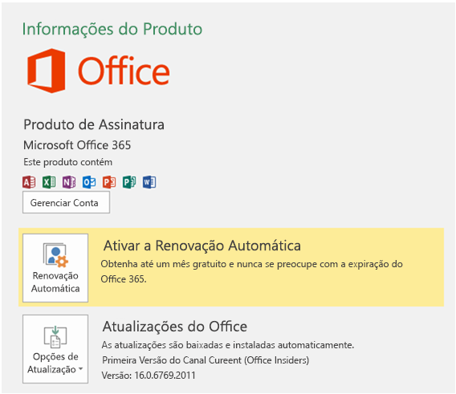

# Instalar a última versão do Office 2016Install the latest version of Office 2016

Novos recursos de desenvolvedor, inclusive os que ainda estão na visualização, são fornecidos primeiro aos assinantes que aceitam obter as últimas compilações do Office.New developer features, including those still in preview, are delivered first to subscribers who opt in to get the latest builds of Office. 

## Aceitar para receber as versões mais recentesOpt in to getting the latest builds

Aceitar para receber as versões mais recentes do Office 2016:To opt in to getting the latest builds of Office 2016: 

- Se você é assinante do Office 365 Home, Personal ou University, confira [Ser um Office Insider](https://products.office.com/office-insider).If you're an Office 365 Home, Personal, or University subscriber, see [Be an Office Insider](https://products.office.com/office-insider).
- Se você for um cliente corporativo do Office 365, confira [Instalar a versão de Primeiro Lançamento do Office 365 para clientes corporativos](https://support.office.com/article/Install-the-First-Release-build-for-Office-365-for-business-customers-4dd8ba40-73c0-4468-b778-c7b744d03ead).If you're an Office 365 for business customer, see [Install the First Release build for Office 365 for business customers](https://support.office.com/article/Install-the-First-Release-build-for-Office-365-for-business-customers-4dd8ba40-73c0-4468-b778-c7b744d03ead).
- Se você estiver executando o Office 2016 em um Mac:If you're running Office 2016 on a Mac:
    - Inicie um programa do Office 2016 para Mac.Start an Office 2016 for Mac program.
    - Selecione **Verificar Atualizações** no menu Ajuda.Select **Check for Updates** on the Help menu.
    - Na caixa Microsoft AutoUpdate, marque a caixa para participar do programa Office Insider.In the Microsoft AutoUpdate box, check the box to join the Office Insider program. 

## Para a versão mais recente:Get the latest build

Para receber as versões mais recentes do Office 2016:To get the latest build of Office 2016: 

1. Baixe a [Ferramenta de Implantação do Office 2016](https://www.microsoft.com/download/details.aspx?id=49117).Download the [Office 2016 Deployment Tool](https://www.microsoft.com/download/details.aspx?id=49117). 
2. Execute a ferramenta. Isso extrai estes dois arquivos: Setup.exe e configuration.xml.Run the tool. This extracts the following two files: Setup.exe and configuration.xml.
3. Substitua o arquivo configuration.xml pelo [Arquivo de Configuração do Primeiro Lançamento](https://raw.githubusercontent.com/OfficeDev/Office-Add-in-Commands-Samples/master/Tools/FirstReleaseConfig/configuration.xml).Replace the configuration.xml file with the [First Release Configuration File](https://raw.githubusercontent.com/OfficeDev/Office-Add-in-Commands-Samples/master/Tools/FirstReleaseConfig/configuration.xml).
4. Execute o seguinte comando como administrador: `setup.exe /configure configuration.xml`Run the following command as an administrator:  `setup.exe /configure configuration.xml` 

    > [!NOTE]
    > O comando pode demorar muito para ser executado sem indicar o progresso.The command might take a long time to run without indicating progress.

Quando o processo de instalação for concluído, você terá os últimos aplicativos do Office 2016 instalados. Para verificar se você tem a última compilação, vá para **Arquivo**  >  **Conta** em qualquer aplicativo do Office. Em Atualizações do Office, você verá o rótulo (Office Insiders) acima do número de versão.When the installation process finishes, you will have the latest Office 2016 applications installed. To verify that you have the latest build, go to **File** > **Account** from any Office application. Under Office Updates, you'll see the (Office Insiders) label above the version number.

## Builds mínimos do Office para conjuntos de requisitos de API JavaScript para OfficeMinimum Office builds for Office JavaScript API requirement sets

Para saber mais sobre os builds mínimos de produtos para cada plataforma dos conjuntos de requisitos de API, confira o seguinte:For information about the minimum product builds for each platform for the API requirement sets, see the following:

- [Conjuntos de requisitos da API JavaScript do WordWord JavaScript API requirement sets](https://dev.office.com/reference/add-ins/requirement-sets/word-api-requirement-sets)
- [Conjuntos de requisitos da API JavaScript do ExcelExcel JavaScript API requirement sets](https://dev.office.com/reference/add-ins/requirement-sets/excel-api-requirement-sets)
- [Conjuntos de requisitos da API JavaScript do OneNoteOneNote JavaScript API requirement sets](https://dev.office.com/reference/add-ins/requirement-sets/onenote-api-requirement-sets)
- [Conjuntos de requisitos da API de caixa de diálogoDialog API requirement sets](https://dev.office.com/reference/add-ins/requirement-sets/dialog-api-requirement-sets)
- [Conjuntos de requisitos de API comum do OfficeOffice common API requirement sets](https://dev.office.com/reference/add-ins/requirement-sets/office-add-in-requirement-sets)
