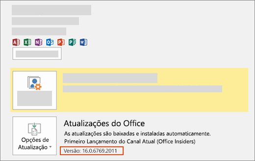

# Instale a última versão do Office

Novos recursos de desenvolvedor, inclusive os que ainda estão na visualização, são fornecidos primeiro aos assinantes que aceitam obter as últimas compilações do Office.

## Opte por obter as versões mais recentes do Office

- Se você for um Microsoft 365 Family, pessoal ou assinante da Universidade, consulte Ser um Office [Insider](https://insider.office.com).
- Se você for um cliente Microsoft 365 Apps para Pequenos e Médios negócios, consulte [Install the First Release build for Microsoft 365 Apps para Pequenos e Médios negócios customers](https://support.office.com/article/4dd8ba40-73c0-4468-b778-c7b744d03ead).
- Se você estiver executando o Office em um Mac:
  - Abra um aplicativo do Office.
  - Selecione **Verificar Atualizações** no menu Ajuda.
  - Na caixa Microsoft AutoUpdate, marque a caixa para participar do programa Office Insider.

## Obter a versão mais recente do Office

1. Baixar a [Ferramenta de Implantação do Office](https://www.microsoft.com/download/details.aspx?id=49117).
2. Execute a ferramenta. Isso extrai estes dois arquivos: Setup.exe e configuration.xml.
3. Substitua o arquivo configuration.xml pelo [Arquivo de Configuração do Primeiro Lançamento](https://raw.githubusercontent.com/OfficeDev/Office-Add-in-Commands-Samples/master/Tools/FirstReleaseConfig/configuration.xml).
4. Execute o seguinte comando como administrador: `setup.exe /configure configuration.xml`

> [!NOTE]
> O comando pode demorar muito para ser executado sem indicar o progresso.

Quando o processo de instalação for concluído, você terá os últimos aplicativos do Office instalados. Para verificar se você tem a última compilação, vá até **arquivo** > **conta** em qualquer aplicativo do Office. Em Atualizações do Office, você verá o rótulo (Office Insiders) acima do número de versão.

## Builds mínimos do Office para conjuntos de requisitos de API JavaScript para Office

- [Conjuntos de requisitos da API JavaScript do Excel](../reference/requirement-sets/excel-api-requirement-sets.md)
- [Conjuntos de requisitos da API JavaScript do OneNote](../reference/requirement-sets/onenote-api-requirement-sets.md)
- [Conjuntos de requisitos de API JavaScript do Outlook](../reference/requirement-sets/outlook-api-requirement-sets.md)
- [Conjuntos de requisitos de API JavaScript do PowerPoint](../reference/requirement-sets/powerpoint-api-requirement-sets.md)
- [Conjuntos de requisitos da API JavaScript do Word](../reference/requirement-sets/word-api-requirement-sets.md)
- [Conjuntos de requisitos da API de Caixa de Diálogo](../reference/requirement-sets/dialog-api-requirement-sets.md)
- [Conjuntos de requisitos da API comum do Office](../reference/requirement-sets/office-add-in-requirement-sets.md)
