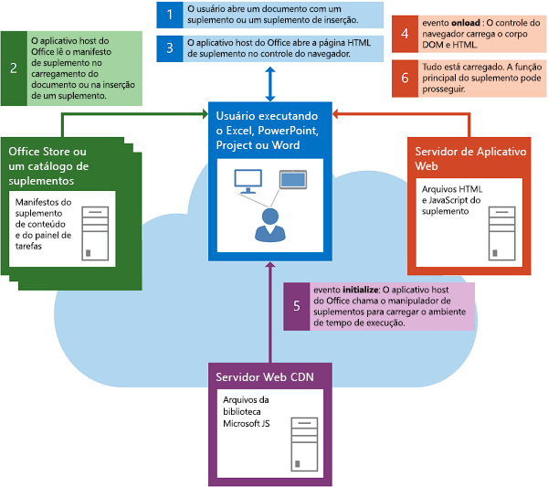
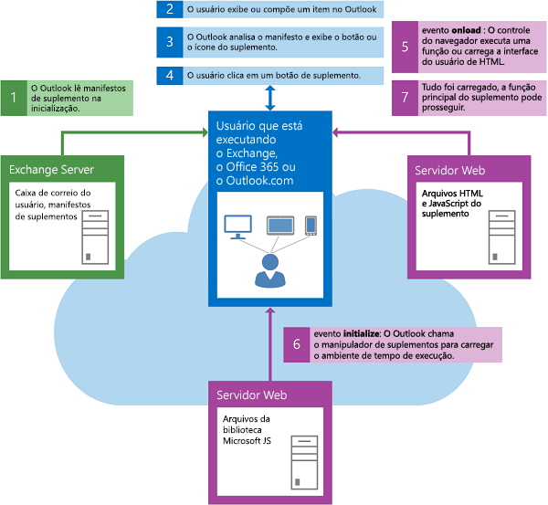

# <a name="loading-the-dom-and-runtime-environment"></a><span data-ttu-id="b18a0-102">Carregar o ambiente de tempo de execução e DOM</span><span class="sxs-lookup"><span data-stu-id="b18a0-102">Loading the DOM and runtime environment</span></span>


<span data-ttu-id="b18a0-103">Um suplemento deve garantir que o DOM e o ambiente de tempo de execução de Suplementos do Office sejam carregados antes de executar sua própria lógica personalizada.</span><span class="sxs-lookup"><span data-stu-id="b18a0-103">An add-in must ensure that both the DOM and the Office Add-ins runtime environment are loaded before running its own custom logic.</span></span> 

## <a name="startup-of-a-content-or-task-pane-add-in"></a><span data-ttu-id="b18a0-104">Inicialização de um suplemento de conteúdo ou de painel de tarefas</span><span class="sxs-lookup"><span data-stu-id="b18a0-104">Startup of a content or task pane add-in</span></span>

<span data-ttu-id="b18a0-105">A figura a seguir mostra o fluxo de eventos envolvidos na inicialização de um suplemento de conteúdo ou de painel de tarefas no Excel, no PowerPoint, no Project, no Word ou no Access.</span><span class="sxs-lookup"><span data-stu-id="b18a0-105">The following figure shows the flow of events involved in starting a content or task pane add-in in Excel, PowerPoint, Project, Word, or Access.</span></span>



<span data-ttu-id="b18a0-107">Os eventos a seguir ocorrem quando um suplemento de conteúdo ou de painel de tarefas é iniciado:</span><span class="sxs-lookup"><span data-stu-id="b18a0-107">The following events occur when a content or task pane add-in starts:</span></span> 


1. <span data-ttu-id="b18a0-108">O usuário abre um documento que já contém um suplemento ou insere um suplemento no documento.</span><span class="sxs-lookup"><span data-stu-id="b18a0-108">The user opens a document that already contains an add-in or inserts an add-in in the document.</span></span>
    
2. <span data-ttu-id="b18a0-109">O aplicativo host do Office lê o manifesto XML do suplemento a partir do AppSource, catálogo de suplementos no SharePoint ou catálogo de pastas compartilhada do qual ele se originou.</span><span class="sxs-lookup"><span data-stu-id="b18a0-109">The Office host application reads the add-in's XML manifest from AppSource, an add-in catalog on SharePoint, or the shared folder catalog it originates from.</span></span>
    
3. <span data-ttu-id="b18a0-110">O aplicativo host do Office abre a página de HTML do suplemento em um controle de navegador.</span><span class="sxs-lookup"><span data-stu-id="b18a0-110">The Office host application opens the add-in's HTML page in a browser control.</span></span>
    
    <span data-ttu-id="b18a0-p101">As próximas duas etapas, as etapas 4 e 5, ocorrem de forma assíncrona e em paralelo. Por esse motivo, o código do suplemento deve garantir que o DOM e o ambiente do tempo de execução do suplemento tenham terminado de carregar antes de prosseguir.</span><span class="sxs-lookup"><span data-stu-id="b18a0-p101">The next two steps, steps 4 and 5, occur asynchronously and in parallel. For this reason, your add-in's code must make sure that both the DOM and the add-in runtime environment have finished loading before proceeding.</span></span>
    
4. <span data-ttu-id="b18a0-113">O controle do navegador carrega o corpo do HTML e DOM e chama o manipulador de eventos para o evento **window.onload**.</span><span class="sxs-lookup"><span data-stu-id="b18a0-113">The browser control loads the DOM and HTML body, and calls the event handler for the  **window.onload** event.</span></span>
    
5. <span data-ttu-id="b18a0-114">O aplicativo host do Office carrega o ambiente de tempo de execução, que baixa e armazena em cache a API do JavaScript para arquivos da biblioteca a partir do servidor da rede de distribuição de conteúdo (CDN) e chama manipulador de eventos do suplemento para o evento [initialize](https://docs.microsoft.com/javascript/api/office?view=office-js) do objeto [Office](https://docs.microsoft.com/javascript/api/office?view=office-js).</span><span class="sxs-lookup"><span data-stu-id="b18a0-114">The Office host application loads the runtime environment, which downloads and caches the JavaScript API for JavaScript library files from the content distribution network (CDN) server, and then calls the add-in's event handler for the [initialize](https://docs.microsoft.com/javascript/api/office?view=office-js) event of the [Office](https://docs.microsoft.com/javascript/api/office?view=office-js) object.</span></span>
    
6. <span data-ttu-id="b18a0-115">Quando o corpo de HTML e DOM terminar de carregar e o suplemento finalizar a inicialização, a função principal do suplemento poderá prosseguir.</span><span class="sxs-lookup"><span data-stu-id="b18a0-115">When the DOM and HTML body finish loading and the add-in finishes initializing, the main function of the add-in can proceed.</span></span>
    

## <a name="startup-of-an-outlook-add-in"></a><span data-ttu-id="b18a0-116">Inicialização de um suplemento do Outlook</span><span class="sxs-lookup"><span data-stu-id="b18a0-116">Startup of an Outlook add-in</span></span>


<span data-ttu-id="b18a0-117">A figura a seguir mostra o fluxo de eventos envolvidos na inicialização de um suplemento do Outlook em execução no desktop, tablet ou smartphone.</span><span class="sxs-lookup"><span data-stu-id="b18a0-117">The following figure shows the flow of events involved in starting an Outlook add-in running on the desktop, tablet, or smartphone.</span></span>



<span data-ttu-id="b18a0-119">Os eventos a seguir ocorrem quando um suplemento Outlook é iniciado:</span><span class="sxs-lookup"><span data-stu-id="b18a0-119">The following events occur when an Outlook add-in starts:</span></span> 


1. <span data-ttu-id="b18a0-120">Quando é iniciado, o Outlook lê os manifestos XML para suplementos do Outlook que foram instalados na conta de email do usuário.</span><span class="sxs-lookup"><span data-stu-id="b18a0-120">When Outlook starts, Outlook reads the XML manifests for Outlook add-ins that have been installed for the user's email account.</span></span>
    
2. <span data-ttu-id="b18a0-121">O usuário seleciona um item no Outlook.</span><span class="sxs-lookup"><span data-stu-id="b18a0-121">The user selects an item in Outlook.</span></span>
    
3. <span data-ttu-id="b18a0-122">Se o item selecionado satisfizer as condições de ativação de um suplemento do Outlook, o Outlook ativará o suplemento e tornará seu botão visíveis na interface de usuário.</span><span class="sxs-lookup"><span data-stu-id="b18a0-122">If the selected item satisfies the activation conditions of an Outlook add-in, Outlook activates the add-in and makes its button visible in the UI.</span></span>
    
4. <span data-ttu-id="b18a0-p102">Se o usuário clicar no botão para iniciar o suplemento do Outlook, o Outlook abrirá a página HTML em um controle de navegador. As próximas duas etapas, as etapas 5 e 6, ocorrerem em paralelo.</span><span class="sxs-lookup"><span data-stu-id="b18a0-p102">If the user clicks the button to start the Outlook add-in, Outlook opens the HTML page in a browser control. The next two steps, steps 5 and 6, occur in parallel.</span></span>
    
5. <span data-ttu-id="b18a0-125">O controle do navegador carrega o corpo do HTML e DOM e chama o manipulador de eventos para o evento **onload**.</span><span class="sxs-lookup"><span data-stu-id="b18a0-125">The browser control loads the DOM and HTML body, and calls the event handler for the  **onload** event.</span></span>
    
6. <span data-ttu-id="b18a0-126">O Outlook chama o manipulador de eventos para o evento [initialize](https://docs.microsoft.com/javascript/api/office?view=office-js) do objeto [Office](https://docs.microsoft.com/javascript/api/office?view=office-js) do suplemento.</span><span class="sxs-lookup"><span data-stu-id="b18a0-126">Outlook calls the event handler for the [initialize](https://docs.microsoft.com/javascript/api/office?view=office-js) event of the [Office](https://docs.microsoft.com/javascript/api/office?view=office-js) object of the add-in.</span></span>
    
7. <span data-ttu-id="b18a0-127">Quando o corpo de HTML e DOM terminar de carregar e o suplemento finalizar a inicialização, a função principal do suplemento poderá prosseguir.</span><span class="sxs-lookup"><span data-stu-id="b18a0-127">When the DOM and HTML body finish loading and the add-in finishes initializing, the main function of the add-in can proceed.</span></span>
    

## <a name="checking-the-load-status"></a><span data-ttu-id="b18a0-128">Verificar o status de carregamento</span><span class="sxs-lookup"><span data-stu-id="b18a0-128">Checking the load status</span></span>


<span data-ttu-id="b18a0-p103">Uma maneira de verificar se o ambiente de tempo de execução e o DOM concluíram o carregamento é usar a função [.ready()](http://api.jquery.com/ready/) do jQuery: `$(document).ready()`. Por exemplo, a seguinte função do manipulador de eventos **initialize** garante que o DOM seja carregado antes do código específico para inicializar as execuções de suplementos. Subsequentemente, o manipulador de eventos **inicializar** prossegue e usa a propriedade [mailbox.item](https://docs.microsoft.com/javascript/api/outlook/office.mailbox?view=office-js) para obter o item selecionado atual no Outlook, e chama a função principal do suplemento, `initDialer`.</span><span class="sxs-lookup"><span data-stu-id="b18a0-p103">One way to check that both the DOM and the runtime environment have finished loading is to use the jQuery [.ready()](http://api.jquery.com/ready/) function: `$(document).ready()`. For example, the following  **initialize** event handler function makes sure the DOM is first loaded before the code specific to initializing the add-in runs. Subsequently, the **initialize** event handler proceeds to use the [mailbox.item](https://docs.microsoft.com/javascript/api/outlook/office.mailbox?view=office-js) property to obtain the currently selected item in Outlook, and calls the main function of the add-in, `initDialer`.</span></span>


```js
Office.initialize = function () {
    // Checks for the DOM to load.
    $(document).ready(function () {
        // After the DOM is loaded, add-in-specific code can run.
        var mailbox = Office.context.mailbox;
        _Item = mailbox.item;
        initDialer();
    });
}
```

<span data-ttu-id="b18a0-132">Essa mesma técnica pode ser usada no manipulador **initialize** de qualquer Suplemento do Office.</span><span class="sxs-lookup"><span data-stu-id="b18a0-132">This same technique can be used in the  **initialize** handler of any Office Add-in.</span></span>

<span data-ttu-id="b18a0-133">O suplemento do Outlook de amostra de discagem telefônica mostra uma abordagem ligeiramente diferente usando somente o JavaScript para verificar essas mesmas condições.</span><span class="sxs-lookup"><span data-stu-id="b18a0-133">The phone dialer sample Outlook add-in shows a slightly different approach using only JavaScript to check these same conditions.</span></span> 

> [!IMPORTANT]
> <span data-ttu-id="b18a0-134">Mesmo que o suplemento não tenha tarefas de inicialização para executar, você deve incluir pelo menos uma função mínima do manipulador de eventos **Office.initialize**, como mostra o exemplo a seguir.</span><span class="sxs-lookup"><span data-stu-id="b18a0-134">Even if your add-in has no initialization tasks to perform, you must include at least a minimal **Office.initialize** event handler function like the following example.</span></span>

```js
Office.initialize = function () {
};
```

<span data-ttu-id="b18a0-p104">Se você não incluir um manipulador de eventos **Office.initialize**, o suplemento poderá gerar um erro ao ser iniciado. Além disso, se um usuário tentar usar o suplemento com um cliente virtual do Office Online, como o Excel Online, PowerPoint Online ou Outlook Web App, ele não funcionará.</span><span class="sxs-lookup"><span data-stu-id="b18a0-p104">If you fail to include an  **Office.initialize** event handler, your add-in may raise an error when it starts. Also, if a user attempts to use your add-in with an Office Online web client, such as Excel Online, PowerPoint Online, or Outlook Web App, it will fail to run.</span></span>

<span data-ttu-id="b18a0-137">Se o suplemento incluir mais de uma página, essa página deverá incluir ou chamar um manipulador de eventos **Office.initialize** sempre que uma nova página for carregada.</span><span class="sxs-lookup"><span data-stu-id="b18a0-137">If your add-in includes more than one page, whenever it loads a new page that page must include or call an  **Office.initialize** event handler.</span></span>


## <a name="see-also"></a><span data-ttu-id="b18a0-138">Veja também</span><span class="sxs-lookup"><span data-stu-id="b18a0-138">See also</span></span>

- [<span data-ttu-id="b18a0-139">Noções básicas da API JavaScript para Office</span><span class="sxs-lookup"><span data-stu-id="b18a0-139">Understanding the JavaScript API for Office</span></span>](understanding-the-javascript-api-for-office.md)
    
