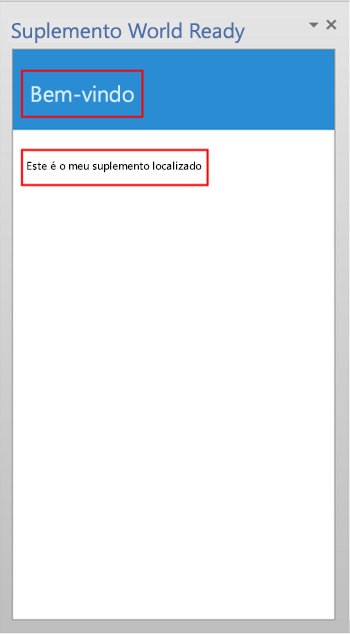
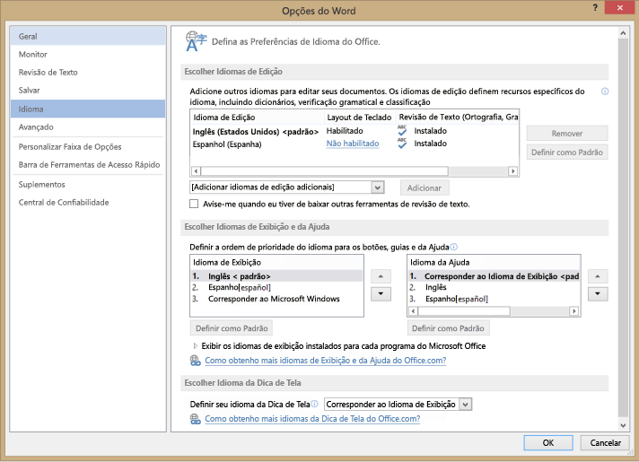
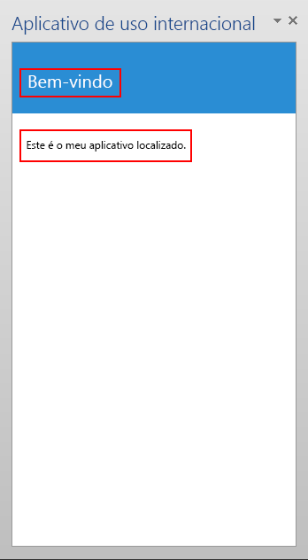

# <a name="localization-for-office-add-ins"></a>Localização para Suplementos do Office

Você pode implementar qualquer esquema de localização que seja apropriado para o seu Suplemento do Office. A API JavaScript e o esquema do manifesto da plataforma de Suplementos do Office oferecem algumas opções. Você pode usar a API JavaScript para Office para determinar uma localidade e exibir cadeias de caracteres com base na localidade do aplicativo host ou para interpretar ou exibir dados com base na localidade dos dados. Você pode usar o manifesto para especificar informações descritivas e o local do arquivo do suplemento específico da localidade. Como alternativa, você pode usar o script do Microsoft Ajax para dar suporte à globalização e localização.

## <a name="use-the-javascript-api-to-determine-locale-specific-strings"></a>Usar a API JavaScript para determinar cadeias de caracteres específicas da localidade

A API JavaScript para Office fornece duas propriedades que oferecem suporte à exibição ou interpretação de valores consistentes com a localidade do aplicativo host e dos dados:

- [Context.displayLanguage][displayLanguage] especifica a localidade (ou idioma) da interface do usuário do aplicativo host. O exemplo a seguir verifica se o aplicativo host usa a localidade en-US ou fr-FR e exibe uma saudação específica para a localidade.
    
    ```js
    function sayHelloWithDisplayLanguage() {
        var myLanguage = Office.context.displayLanguage;
        switch (myLanguage) {
            case 'en-US':
                write('Hello!');
                break;
            case 'fr-FR':
                write('Bonjour!');
                break;
        }
    }
    
    // Function that writes to a div with id='message' on the page.
    function write(message) {
        document.getElementById('message').innerText += message; 
    }
    ```

- [Context.contentLanguage][contentLanguage] especifica a localidade (ou o idioma) dos dados. Estendendo o último exemplo de código, em vez de verificar a propriedade [displayLanguage], atribua `myLanguage` à propriedade [contentLanguage] e use o restante do mesmo código para exibir uma saudação com base na localidade dos dados:
    
    ```js
    var myLanguage = Office.context.contentLanguage;
    ```

## <a name="control-localization-from-the-manifest"></a>Controlar a localização do manifesto


Cada Suplemento do Office especifica um elemento [DefaultLocale] e uma localidade em seu manifesto. Por padrão, a plataforma do Suplemento do Office e os aplicativos host do Office aplicam os valores dos elementos [Description], [DisplayName], [IconUrl], [HighResolutionIconUrl] e [SourceLocation] a todas as localidades. Como opção, você pode dar suporte a valores específicos para localidades específicas, especificando um elemento-filho [Override]para cada localidade adicional, para qualquer um desses cinco elementos. O valor do elemento [DefaultLocale] e do atributo `Locale` do elemento [Override] é especificado de acordo com o [RFC 3066], "Marcas para a Identificação dos Idiomas". A Tabela 1 descreve o suporte de localização para esses elementos.

**Tabela 1. Suporte de localização**


|**Elemento**|**Suporte de localização**|
|:-----|:-----|
|[Descrição]   |Os usuários de cada localidade especificada podem ver uma descrição localizada do suplemento na Office Store (ou no catálogo privado).<br/>Para os suplementos do Outlook, os usuários podem ver a descrição no Centro de Administração do Exchange (EAC) após a instalação.|
|[DisplayName]   |Os usuários de cada localidade especificada podem ver uma descrição localizada do suplemento na Office Store (ou no catálogo privado).<br/>Para os suplementos do Outlook, os usuários podem ver o nome de exibição como um rótulo para o botão de suplemento do Outlook e no EAC após a instalação.<br/>Para os suplementos do painel de tarefas e do conteúdo, os usuários podem ver o nome de exibição na faixa de opções após a instalação do suplemento.|
|[IconUrl]        |A imagem do ícone é opcional. Você pode usar a mesma técnica de substituição para especificar uma determinada imagem para uma cultura específica. Se você usar e localizar um ícone, os usuários em cada localidade que você especificar poderão ver uma imagem de ícone localizada para o suplemento.<br/>Para suplementos do Outlook, os usuários podem ver o ícone no EAC depois de instalar o suplemento.<br/>Para os suplementos do painel de tarefas e do conteúdo, os usuários podem ver o ícone na faixa de opções após a instalação do suplemento.|
|[HighResolutionIconUrl] <br/><br/>**Importante**  Este elemento está disponível somente ao usar o manifesto do suplemento versão 1.1.|A imagem do ícone de alta resolução é opcional, mas se ela for especificada, deverá ocorrer após o elemento [IconUrl]. Quando [HighResolutionIconUrl] for especificado e o suplemento estiver instalado em um dispositivo que ofereça suporte à resolução dpi alto, o valor [HighResolutionIconUrl] é usado em vez do valor para [IconUrl].<br/>Você pode usar a mesma técnica de substituição para especificar uma determinada imagem para uma cultura específica. Se você usar e localizar um ícone, os usuários em cada localidade que você especificar podem ver uma imagem de ícone localizada para o suplemento.<br/>Para suplementos do Outlook, os usuários podem ver o ícone no EAC depois de instalar o suplemento.<br/>Para os suplementos do painel de tarefas e do conteúdo, os usuários podem ver o ícone na faixa de opções após a instalação do suplemento.|
|[Resources] <br/><br/>**Importante**  Este elemento está disponível somente ao usar o manifesto do suplemento versão 1.1.   |Os usuários em cada localidade especificada podem ver recursos de cadeias de caracteres e de ícones que você projetou especificamente para o suplemento dessa localidade. |
|[SourceLocation]   |Os usuários em cada localidade especificada podem ver uma página da Web que você projetou especificamente para o suplemento dessa localidade. |


 > **Observação:** Você só pode localizar o nome de exibição e a descrição das localidades que oferecem suporte ao Office. Veja [Identificadores de idioma e valores de OptionState Id no Office 2013](http://technet.microsoft.com/en-us/library/cc179219.aspx) para obter uma lista de idiomas e localidades para a versão atual do Office.


### <a name="examples"></a>Exemplos

Por exemplo, um Suplemento do Office pode especificar o [DefaultLocale] como `en-us`. Para o elemento [DisplayName], o suplemento pode especificar um elemento filho [Override] para a localidade `fr-fr`, como mostrado abaixo. 


```xml
<DefaultLocale>en-us</DefaultLocale>
...
<DisplayName DefaultValue="Video player">
    <Override Locale="fr-fr" Value="Lecteur vidéo" />
</DisplayName>
```

 > **Observação:** Se for preciso localizar para mais de uma área dentro de uma família de idiomas, como `de-de` e `de-at`, recomendamos que você use elementos `Override` separados para cada área. Usar apenas o nome do idioma sozinho, nesse caso, `de`, não tem suporte em todas as combinações de plataformas e aplicativos de host do Office.

Isso significa que o suplemento pressupõe a localidade `en-us` como padrão. Os usuários veem o nome de exibição em inglês "Video player" para todas as localidades, a menos que a localidade do computador cliente fosse `fr-fr`, nesse caso os usuários veria o nome de exibição em francês "Lecteur vidéo".

> **Observação:** Você só pode especificar uma única substituição por idioma, inclusive para a localidade padrão. Por exemplo, se sua localidade padrão é `en-us`não é possível especificar uma substituição para `en-us` também. 

O exemplo a seguir se aplica a uma substituição de localidade para o elemento [Description]. Primeiro especifica uma localidade padrão de `en-us` e uma descrição em inglês e, em seguida, especifica um [Override] política com uma descrição francesa para o `fr-fr` localidade:

```xml
<DefaultLocale>en-us</DefaultLocale>
...
<Description DefaultValue=
   "Watch YouTube videos referenced in the emails you receive 
   without leaving your email client.">
   <Override Locale="fr-fr" Value=
   "Visualisez les vidéos YouTube référencées dans vos courriers 
   électronique directement depuis Outlook et Outlook Web App."/>
</Description>
```

Isso significa que o suplemento pressupõe a localidade `en-us` como padrão. Os usuários veriam a descrição em inglês no atributo `DefaultValue` para todas as localidades, a menos que a localidade do computador cliente fosse `fr-fr`, nesse caso, eles veriam a descrição em francês.

No exemplo a seguir, o suplemento Especifica uma imagem separada mais apropriada para a localidade e cultura `fr-fr`. Os usuários verão a imagem DefaultLogo.png por padrão, exceto quando a localidade do computador cliente for `fr-fr`. Nesse caso, os usuários veriam a imagem FrenchLogo.png. 


```xml
<!-- Replace "domain" with a real web server name and path. -->
<IconUrl DefaultValue="https://<domain>/DefaultLogo.png"/>
    <Override Locale="fr-fr" Value="https://<domain>/FrenchLogo.png"/>
```

O exemplo a seguir mostra como localizar um recurso na seção `Resources`. Ele aplica um substituto local para uma imagem que é mais apropriada para a cultura `ja-jp`.

```xml
<Resources>
      <bt:Images>
        <bt:Image id="icon1_16x16" DefaultValue="https://www.contoso.com/icon_default.png">
          <bt:Override Locale="ja-jp" Value="https://www.contoso.com/ja-jp16-icon_default.png" />
        </bt:Image>
 ...
```


Para o elemento [SourceLocation], o suporte a localidades adicionais significa fornecer um arquivo HTML de origem separado para cada um dos locais especificados. Os usuários de cada localidade que você especificar poderão ver uma página da Web personalizada que foi projetada para eles.

Para suplementos do Outlook, o elemento [SourceLocation] também atribui o fator forma. Isso permite que você forneça um arquivo HTML de origem localizado e distinto para cada fator de foram correspondente. Você pode especificar um ou mais elementos filho [Override] em cada configuração aplicável ([DesktopSettings], [TabletSettings] ou [PhoneSettings]). O exemplo a seguir mostra os elementos de configurações para fatores de forma de desktop, tablet e smartphone, cada um com um arquivo HTML para a localidade padrão e outro para a localidade francesa.


```xml
<DesktopSettings>
   <SourceLocation DefaultValue="https://contoso.com/Desktop.html">
      <Override Locale="fr-fr" Value="https://contoso.com/fr/Desktop.html" />
   </SourceLocation>
   <RequestedHeight>250</RequestedHeight>
</DesktopSettings>
<TabletSettings>
   <SourceLocation DefaultValue="https://contoso.com/Tablet.html">
      <Override Locale="fr-fr" Value="https://contoso.com/fr/Tablet.html" />
   </SourceLocation>
   <RequestedHeight>200</RequestedHeight>
</TabletSettings>
<PhoneSettings>
   <SourceLocation DefaultValue="https://contoso.com/Mobile.html">
      <Override Locale="fr-fr" Value="https://contoso.com/fr/Mobile.html" />
   </SourceLocation>

</PhoneSettings>

```

## <a name="match-datetime-format-with-client-locale"></a>Fazer a correspondência entre o formato de data/hora e a localidade do cliente

Você pode obter a localidade da interface do usuário do aplicativo host usando a propriedade [displayLanguage]. Em seguida, pode exibir valores de data e hora em um formato consistente com a localidade atual do aplicativo host. Uma maneira de fazer isso é preparar um arquivo de recurso que especifica o formato de exibição de data/hora a ser usado em cada localidade com suporte do seu Suplemento do Office. Na execução, seu suplemento pode usar o arquivo de recurso e fazer a correspondência entre o formato de data/hora apropriado e a localidade obtida na propriedade [displayLanguage]

Você pode obter a localidade dos dados do aplicativo host usando a propriedade [contentLanguage]. Com base nesse valor, você pode, então, interpretar ou exibir adequadamente as cadeias de caracteres de data/hora. Por exemplo, a localidade `jp-JP` expressa valores de data/hora como `yyyy/MM/dd`, e a localidade `fr-FR` como `dd/MM/yyyy`.


## <a name="use-ajax-for-globalization-and-localization"></a>Usar o Ajax para a globalização e localização


Se você usar o Visual Studio para criar Suplementos do Office, o .NET Framework e Ajax fornecem maneiras de globalizar e localizar arquivos de script de cliente.

Você pode globalizar e utilizar as extensões do tipo JavaScript de [Data](http://msdn.microsoft.com/library/caf98d32-2de2-4704-8198-692350343681.aspx) e [Número](http://msdn.microsoft.com/library/c216d3a1-12ae-47d1-bca1-c3666d04572f.aspx) e o objeto [Data](http://msdn.microsoft.com/library/ce2202bb-7ec9-4f5a-bf48-3a04feff283e.aspx) do JavaScript no código do JavaScript para um suplemento do Office para exibir valores com base nas configurações de localização do navegador atual. Para saber mais, confira [Passo a passo: como globalizar uma data usando o script de cliente](http://msdn.microsoft.com/library/69b34e6d-d590-4d03-a763-b7ae54b47d74.aspx).

Você pode incluir cadeias de caracteres de recurso localizadas diretamente em arquivos de JavaScript autônomos para fornecer arquivos de script de cliente para diferentes locais, que são definidos no navegador ou fornecidos pelo usuário. Crie um arquivo de script separado para cada localidade com suporte. Em cada arquivo de script, inclua um objeto no formato JSON que contenha as cadeias de caracteres de recursos para essa localidade. Os valores localizados serão aplicados quando o script for executado no navegador. 


## <a name="example-build-a-localized-office-add-in"></a>Exemplo: Criar um Suplemento do Office localizado

Esta seção fornece exemplos que mostram como localizar uma descrição do Suplemento do Office, o nome de exibição e interface do usuário.

Para executar o código de amostra fornecido, configure o Microsoft Office 2013 em seu computador para usar idiomas adicionais para que você possa testar seu suplemento, alternando o idioma usado para exibição em menus e em comandos para edição e revisão de texto ou ambos.

Além disso, você precisará criar um projeto de Suplemento do Office do Visual Studio 2015.

 > **Observação:**  Para baixar o Visual Studio 2015, confira a [Página do Office Developer Tools](https://www.visualstudio.com/features/office-tools-vs). Esta página também tem um link para o Office Developer Tools.

### <a name="configure-office-2013-to-use-additional-languages-for-display-or-editing"></a>Configurar o Office 2013 para usar idiomas adicionais para exibição ou edição

Você pode usar um Pacote de idiomas do Office 2013 para instalar um idioma adicional. Para saber mais sobre os Pacotes de idioma e onde obtê-los, veja [Opções de idioma do Office 2013](http://office.microsoft.com/en-us/language-packs/).

 > **Observação:**  Se você for assinante do MSDN, é possível que você já tenha os Pacotes de Idiomas do Office 2013. Para determinar se a sua assinatura oferece Pacotes de Idiomas do Office 2013 para download, vá para [Página Inicial de Assinaturas do MSDN](https://msdn.microsoft.com/subscriptions/manage/), insira Pacote de Idiomas do Office 2013 em **Downloads de Softwares**, escolha **Pesquisa** e selecione **Produtos disponíveis com minha assinatura**. Em **Idioma**, marque a caixa de seleção do Pacote de Idiomas que você deseja baixar e, em seguida, selecione **Ir**. 

Depois de instalar o Pacote de Idiomas, você pode configurar o Office 2013 para usar o idioma instalado para exibir na interface do usuário, para edição de conteúdo do documento, ou ambos. O exemplo neste artigo usa uma instalação do Office 2013 que tenha o Pacote de Idiomas do espanhol aplicado.

### <a name="create-an-office-add-in-project"></a>Criar um projeto de Suplemento do Office

1. No Visual Studio, escolha **Arquivo**  >  **Novo Projeto**.
    
2. Na caixa de diálogo **Novo Projeto**, em **Modelos**, expanda **Visual Basic** ou **Visual C#**, expanda **Office/SharePoint** e, em seguida, selecione **Suplementos do Office**.
    
3. Escolha **Suplemento do Office** e, em seguida, nomeie seu suplemento, por exemplo WorldReadyAddIn. Escolha **OK**.
    
4. Na caixa de diálogo **Criar Suplemento do Office**, selecione **Painel de tarefas** e selecione **Próximo**. Na próxima página, desmarque e marque as caixas de todos os aplicativos, exceto do Word. Selecione **Concluir** para criar o projeto.
    

### <a name="localize-the-text-used-in-your-add-in"></a>Localizar o texto usado no seu suplemento

O texto que você deseja localizar para outro idioma aparece em duas áreas:

-  **Nome de exibição e descrição do suplemento**. Isso é controlado por entradas no arquivo do manifesto do suplemento.
    
-  **Interface do Usuário do Suplemento**. Você pode localizar as cadeias de caracteres que aparecem na interface do usuário do seu suplemento usando códigos do JavaScript, por exemplo, usando um arquivo de recurso separado que contenha as cadeias de caracteres localizadas.
    
Para localizar o nome de exibição do suplemento e a descrição:

1. Em **Gerenciador de Soluções**, expanda **WorldReadyAddIn**, **WorldReadyAddInManifest** e, em seguida, selecione **WorldReadyAddIn.xml**.
    
2. No WorldReadyAddInManifest.xml, substitua os elementos [DisplayName] e [Description] com o seguinte bloqueio de código:
    
     > **Observação:**  Você pode substituir as cadeias de caracteres de idioma espanhol localizado usadas neste exemplo pelos elementos [DisplayName] e [Description] com as cadeias de caracteres localizados para qualquer outro idioma.

    ```xml
    <DisplayName DefaultValue="World Ready add-in">
      <Override Locale="es-es" Value="Aplicación de uso internacional"/>
    </DisplayName>
    <Description DefaultValue="An add-in for testing localization">
      <Override Locale="es-es" Value="Una aplicación para la prueba de la localización"/>
    </Description>
    ```

3. Quando você altera o idioma de exibição do Office 2013 do inglês para o espanhol, por exemplo, e executa o suplemento, o nome de exibição do suplemento e a descrição são mostrados com texto localizado. 
    
Para definir a interface do usuário do suplemento:

1. No Visual Studio, no **Gerenciador de Soluções**, selecione **Home.html**.
    
2. Substitua o HTML em Home.html pelo seguinte HTML.
    
    ```html
    <!DOCTYPE html>
    <html>
    <head>
        <meta charset="UTF-8" />
        <meta http-equiv="X-UA-Compatible" content="IE=Edge" />
        <title></title>
        <script src="../../Scripts/jquery-1.8.2.js" type="text/javascript"></script>
    
        <link href="../../Content/Office.css" rel="stylesheet" type="text/css" />
        <script src="https://appsforoffice.microsoft.com/lib/1/hosted/office.js" type="text/javascript"></script>
    
        <!-- To enable offline debugging using a local reference to Office.js, use:                        -->
        <!-- <script src="../../Scripts/Office/MicrosoftAjax.js" type="text/javascript"></script>          -->
        <!--    <script src="../../Scripts/Office/1.0/office.js" type="text/javascript"></script>          -->
    
        <link href="../App.css" rel="stylesheet" type="text/css" />
        <script src="../App.js" type="text/javascript"></script>
    
        <link href="Home.css" rel="stylesheet" type="text/css" />
        <script src="Home.js" type="text/javascript"></script> <body>
        <!-- Page content -->
        <div id="content-header">
            <div class="padding">
                <h1 id="greeting"></h1>
            </div>
        </div>
        <div id="content-main">
            <div class="padding">
                <div>
                    <p id="about"></p>
                </div>            
            </div>
        </div>
    </head>
    </html>
    ```

3. No Visual Studio, selecione **Arquivo**,  **Salvar AddIn\Home\Home.html**.
    
A Figura 3 mostra o elemento do cabeçalho (h1) e o elemento do parágrafo (p) que exibirá o texto localizado quando seu suplemento de amostra for executado.

**Figura 3. IU do suplemento**



### <a name="add-the-resource-file-that-contains-the-localized-strings"></a>Adicionar o arquivo de recurso que contém as cadeias de caracteres localizadas

O arquivo de recurso do JavaScript contém as cadeias de caracteres usadas para a interface do usuário do suplemento. A interface do usuário do suplemento de amostra tem um elemento h1 que exibe uma saudação e um elemento p que apresenta o suplemento ao usuário. 

Para habilitar cadeias de caracteres para o cabeçalho e parágrafo, coloque as cadeias de caracteres em um arquivo de recurso separado. O arquivo de recurso cria um objeto do JavaScript que contém um objeto JSON (JavaScript Object Notation) separado para cada conjunto de cadeias de caracteres localizadas. O arquivo de recurso também fornece um método para obter o objeto JSON apropriado de volta para uma determinada localidade. 

Para adicionar o arquivo de recurso ao projeto do suplemento:

1. No **Gerenciador de Soluções** no Visual Studio, escolha a pasta **Suplemento** no projeto da Web para o suplemento de amostra e selecione **Adicionar**  >  **Arquivo JavaScript**.
    
2. Na caixa de diálogo **Especificar o Nome do Item**, insira UIStrings.js.
    
3. Adicione o código a seguir ao arquivo UIStrings.cs.

    ```js
    /* Store the locale-specific strings */
    
    var UIStrings = (function ()
    {
        "use strict";
    
        var UIStrings = {};
    
        // JSON object for English strings
        UIStrings.EN =
        {        
            "Greeting": "Welcome",
            "Introduction": "This is my localized add-in."        
        };
    
    
        // JSON object for Spanish strings
        UIStrings.ES =
        {        
            "Greeting": "Bienvenido",
            "Introduction": "Esta es mi aplicación localizada."
        };
    
        UIStrings.getLocaleStrings = function (locale)
        {
            var text;
            
            // Get the resource strings that match the language.
            switch (locale)
            {
                case 'en-US':
                    text = UIStrings.EN;
                    break;
                case 'es-ES':
                    text = UIStrings.ES;
                    break;
                default:
                    text = UIStrings.EN;
                    break;
            }
    
            return text;
        };
    
        return UIStrings;
    })();
    ```

O arquivo de recurso UIStrings.js cria um objeto, **UIStrings**, que contém as cadeias de caracteres localizadas para a interface do usuário do suplemento. 

### <a name="localize-the-text-used-for-the-add-in-ui"></a>Localizar o texto usado para a interface do usuário do suplemento

Para usar o arquivo de recurso no seu suplemento, você precisará adicionar uma marca de script para ele em Home.html. Quando Home.html for carregado, o UIStrings.js será executado e o objeto **UIStrings** que você utiliza para obter a cadeia de caracteres ficará disponível para seu código. Adicione o seguinte HTML à marca de cabeçalho do Home.html para tornar **UIStrings** disponível para seu código.

```html
<!-- Resource file for localized strings:                                                          -->
<script src="../UIStrings.js" type="text/javascript"></script>
```

Agora você pode usar o objeto **UIStrings** para definir as cadeias de caracteres da interface do usuário do seu suplemento.

Se você quiser alterar a localização do seu suplemento com base no idioma usado para exibição nos menus e comandos no aplicativo host, use a propriedade **Office.context.displayLanguage** para obter a localidade desse idioma. Por exemplo, se o idioma do aplicativo host utilizar espanhol para exibir menus e comandos, a propriedade **Office.context.displayLanguage** retornará o código es-ES.

Se você quiser alterar a localização do seu suplemento com base no idioma que está sendo usado para editar o conteúdo do documento, use a propriedade **Office.context.contentLanguage** para obter a localidade do idioma. Por exemplo, se o idioma do aplicativo host utilizar espanhol para editar o conteúdo do documento, a propriedade **Office.context.contentLanguage** retornará o código es-ES.

Depois que você sabe o idioma que o aplicativo host está utilizando, é possível usar **UIStrings** para obter o conjunto de cadeias de caracteres localizadas correspondentes ao idioma do aplicativo host.

Substitua o código no arquivo Home.js pelo código a seguir. O código mostra como você pode alterar as cadeias de caracteres usadas nos elementos da interface do usuário no Home.html com base no idioma de exibição do aplicativo host ou no idioma de edição do aplicativo host.

 > **Observação:**  para alternar entre alterar a localização do suplemento com base no idioma usado para edição, remova o comentário da linha de código `var myLanguage = Office.context.contentLanguage;` e comente na linha de código `var myLanguage = Office.context.displayLanguage;`

```js
/// <reference path="../App.js" />
/// <reference path="../UIStrings.js" />


(function () {
    "use strict";

    // The initialize function must be run each time a new page is loaded.
    Office.initialize = function (reason)
    {
       
        $(document).ready(function () {
            app.initialize();

            // Get the language setting for editing document content.
            // To test this, uncomment the following line and then comment out the
            // line that uses Office.context.displayLanguage.
            // var myLanguage = Office.context.contentLanguage;

            // Get the language setting for UI display in the host application.
            var myLanguage = Office.context.displayLanguage;            
            var UIText;

            // Get the resource strings that match the language.
            // Use the UIStrings object from the UIStrings.js file
            // to get the JSON object with the correct localized strings.
            UIText = UIStrings.getLocaleStrings(myLanguage);            

            // Set localized text for UI elements.
            $("#greeting").text(UIText.Greeting);
            $("#about").text(UIText.Instruction);
        });
    };    
})();
```

### <a name="test-your-localized-add-in"></a>Testar seu suplemento localizado

Para testar seu suplemento localizado, altere o idioma usado para exibir ou editar no aplicativo host e execute o seu suplemento. 

Para alterar o idioma usado para exibir ou editar no seu suplemento:

1. No Word 2013, selecione **Arquivo**, **Opções**, **Idioma**. A Figura 4 mostra a caixa de diálogo **Opções do Word** aberta na guia Idioma.
    
    **Figura 4. Opções de idioma na caixa de diálogo Opções do Word 2013**

    

2. Em **Escolher Idiomas de Exibição e da Ajuda**, selecione o idioma desejado para exibição, por exemplo, espanhol, e selecione a seta para cima para mover o idioma espanhol para a primeira posição na lista. Ou, para alterar o idioma usado para edição, em **Escolher idiomas de edição**, escolha o idioma que você deseja usar para edição, por exemplo, espanhol, e selecione **Definir como Padrão**.
    
3. Escolha **OK** para confirmar sua seleção e, em seguida, feche o Word.
    
Execute o suplemento de exemplo. O suplemento do painel de tarefas é carregado no Word 2013 e as cadeias de caracteres na interface do usuário do suplemento são alteradas para corresponder ao idioma usado pelo aplicativo host, conforme mostrado na Figura 5.


**Figura 5. IU do Suplemento com o texto localizado**



## <a name="additional-resources"></a>Recursos adicionais

- [Diretrizes de design para suplementos do Office](../../docs/design/add-in-design.md)
    
- [Identificadores de idioma e valores da ID de OptionState no Office 2013](http://technet.microsoft.com/en-us/library/cc179219%28Office.15%29.aspx)

[DefaultLocale]:         http://dev.office.com/reference/add-ins/manifest/defaultlocale
[Description]:           http://dev.office.com/reference/add-ins/manifest/description
[DisplayName]:           http://dev.office.com/reference/add-ins/manifest/displayname
[IconUrl]:               http://dev.office.com/reference/add-ins/manifest/iconurl
[HighResolutionIconUrl]: http://dev.office.com/reference/add-ins/manifest/highresolutioniconurl
[Resources]:             ../../reference/manifest/resources
[SourceLocation]:        http://dev.office.com/reference/add-ins/manifest/sourcelocation
[Override]:              http://dev.office.com/reference/add-ins/manifest/override
[DesktopSettings]:       http://dev.office.com/reference/add-ins/manifest/desktopsettings
[TabletSettings]:        http://dev.office.com/reference/add-ins/manifest/tabletsettings
[PhoneSettings]:         http://dev.office.com/reference/add-ins/manifest/phonesettings
[displayLanguage]:  http://dev.office.com/reference/add-ins/shared/office.context.displaylanguage 
[contentLanguage]:  http://dev.office.com/reference/add-ins/shared/office.context.contentlanguage 
[RFC 3066]: https://www.rfc-editor.org/info/rfc3066