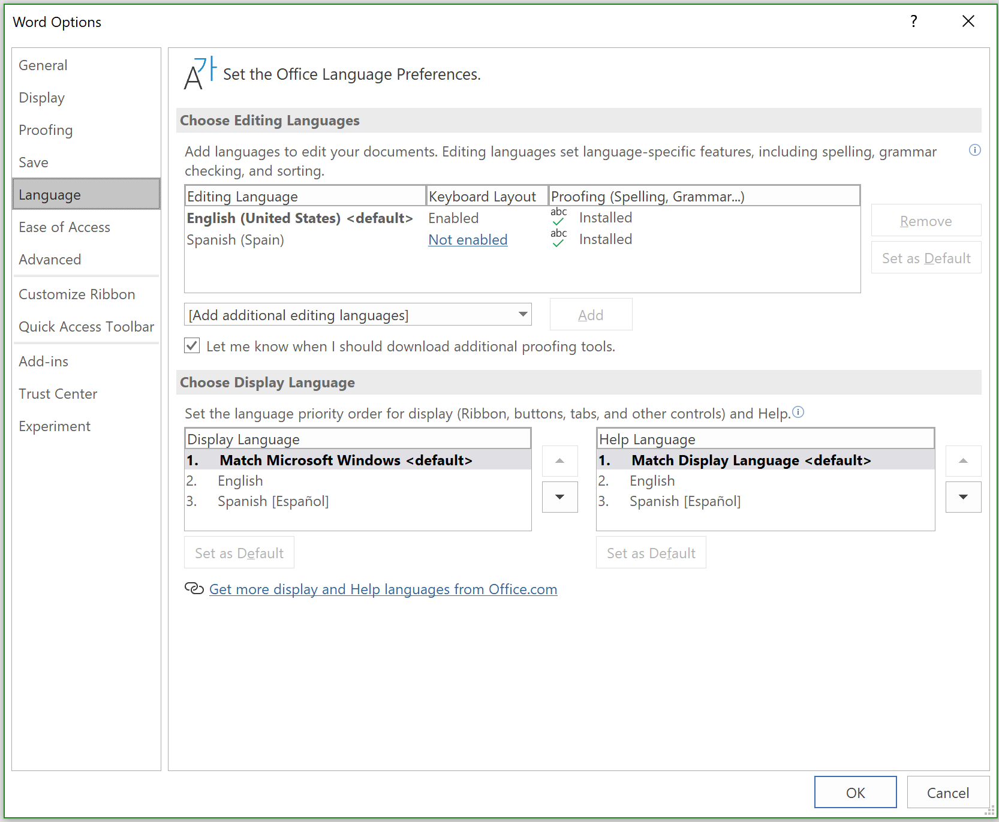

# <a name="localization-for-office-add-ins"></a><span data-ttu-id="1130d-103">Localização para Suplementos do Office</span><span class="sxs-lookup"><span data-stu-id="1130d-103">Localization for Office Add-ins</span></span>

<span data-ttu-id="1130d-p101">Você pode implementar qualquer esquema de localização que seja apropriado para o seu suplemento do Office. A API JavaScript e o esquema do manifesto da plataforma de Suplementos do Office oferecem algumas opções. Você pode usar a API JavaScript para Office para determinar uma localidade e exibir sequências de caracteres com base na localidade do aplicativo host ou para interpretar ou exibir dados com base na localidade dos dados. Você pode usar o manifesto para especificar informações descritivas e local do arquivo do suplemento específicos por localidade. Como alternativa, você pode usar o script do Microsoft Ajax para dar suporte à globalização e localização.</span><span class="sxs-lookup"><span data-stu-id="1130d-p101">You can implement any localization scheme that's appropriate for your Office Add-in. The JavaScript API and manifest schema of the Office Add-ins platform provide some choices. You can use the JavaScript API for Office to determine a locale and display strings based on the locale of the host application, or to interpret or display data based on the locale of the data. You can use the manifest to specify locale-specific add-in file location and descriptive information. Alternatively, you can use Microsoft Ajax script to support globalization and localization.</span></span>

## <a name="use-the-javascript-api-to-determine-locale-specific-strings"></a><span data-ttu-id="1130d-109">Use a API JavaScript para determinar sequências de caracteres específicas por localidade</span><span class="sxs-lookup"><span data-stu-id="1130d-109">Use the JavaScript API to determine locale-specific strings</span></span>

<span data-ttu-id="1130d-110">A API JavaScript para Office fornece duas propriedades que oferecem suporte à exibição ou interpretação de valores consistentes com a localidade do aplicativo host e dos dados:</span><span class="sxs-lookup"><span data-stu-id="1130d-110">The JavaScript API for Office provides two properties that support displaying or interpreting values consistent with the locale of the host application and data:</span></span>

- <span data-ttu-id="1130d-p102">[Context.displayLanguage][displayLanguage] especifica a localidade (ou idioma) da interface do usuário do aplicativo host. O exemplo a seguir verifica se o aplicativo host usa a localidade en-US ou fr-FR e exibe uma saudação específica para a localidade.</span><span class="sxs-lookup"><span data-stu-id="1130d-p102">[Context.displayLanguage][displayLanguage] specifies the locale (or language) of the user interface of the host application. The following example verifies if the host application uses the en-US or fr-FR locale, and displays a locale-specific greeting.</span></span>
    
    ```js
    function sayHelloWithDisplayLanguage() {
        var myLanguage = Office.context.displayLanguage;
        switch (myLanguage) {
            case 'en-US':
                write('Hello!');
                break;
            case 'fr-FR':
                write('Bonjour!');
                break;
        }
    }
    
    // Function that writes to a div with id='message' on the page.
    function write(message) {
        document.getElementById('message').innerText += message; 
    }
    ```

- <span data-ttu-id="1130d-p103">[Context.contentLanguage][contentLanguage] especifica a localidade (ou o idioma) dos dados. Estendendo o último exemplo de código, em vez de verificar a propriedade [displayLanguage], atribua `myLanguage` à propriedade [contentLanguage] e use o restante do mesmo código para exibir uma saudação com base na localidade dos dados:</span><span class="sxs-lookup"><span data-stu-id="1130d-p103">[Context.contentLanguage][contentLanguage] specifies the locale (or language) of the data. Extending the last code sample, instead of checking the [displayLanguage] property, assign `myLanguage` to the [contentLanguage] property, and use the rest of the same code to display a greeting based on the locale of the data:</span></span>
    
    ```js
    var myLanguage = Office.context.contentLanguage;
    ```

## <a name="control-localization-from-the-manifest"></a><span data-ttu-id="1130d-115">Controlar a localização a partir do manifesto</span><span class="sxs-lookup"><span data-stu-id="1130d-115">Control localization from the manifest</span></span>


<span data-ttu-id="1130d-p104">Cada Suplemento do Office especifica um elemento [DefaultLocale] e uma localidade em seu manifesto. Por padrão, a plataforma de Suplementos do Office e os aplicativos host do Office aplicam os valores dos elementos [Description], [DisplayName], [IconUrl], [HighResolutionIconUrl] e [SourceLocation] a todas as localidades. Como opção, você pode oferecer suporte a valores específicos para localidades específicas, especificando um elemento-filho [Override]para cada localidade adicional, para qualquer um desses cinco elementos. O valor do elemento [DefaultLocale] e do atributo `Locale` do elemento [Override] é especificado de acordo com a [RFC 3066], "Marcas para a Identificação de Idiomas". A Tabela 1 descreve o suporte de localização para esses elementos.</span><span class="sxs-lookup"><span data-stu-id="1130d-p104">Every Office Add-in specifies a [DefaultLocale] element and a locale in its manifest. By default, the Office Add-in platform and Office host applications apply the values of the [Description], [DisplayName], [IconUrl], [HighResolutionIconUrl], and [SourceLocation] elements to all locales. You can optionally support specific values for specific locales, by specifying an [Override] child element for each additional locale, for any of these five elements. The value for the [DefaultLocale] element and for the `Locale` attribute of the [Override] element is specified according to [RFC 3066], "Tags for the Identification of Languages." Table 1 describes the localizing support for these elements.</span></span>

<span data-ttu-id="1130d-121">**Tabela 1. Suporte para localização**</span><span class="sxs-lookup"><span data-stu-id="1130d-121">**Table 1. Localization support**</span></span>


|<span data-ttu-id="1130d-122">**Elemento**</span><span class="sxs-lookup"><span data-stu-id="1130d-122">**Element**</span></span>|<span data-ttu-id="1130d-123">**Suporte para localização**</span><span class="sxs-lookup"><span data-stu-id="1130d-123">**Localization support**</span></span>|
|:-----|:-----|
|<span data-ttu-id="1130d-124">[Description]</span><span class="sxs-lookup"><span data-stu-id="1130d-124">[Description]</span></span>   |<span data-ttu-id="1130d-125">Os usuários de cada localidade especificada podem ver uma descrição localizada do suplemento na AppSource (ou no catálogo privado).</span><span class="sxs-lookup"><span data-stu-id="1130d-125">Users in each locale you specify can see a localized description for the add-in in AppSource (or private catalog).</span></span><br/><span data-ttu-id="1130d-126">Para os suplementos do Outlook, os usuários podem ver a descrição no Centro de Administração do Exchange (EAC) após a instalação.</span><span class="sxs-lookup"><span data-stu-id="1130d-126">For Outlook add-ins, users can see the description in the Exchange Admin Center (EAC) after installation.</span></span>|
|<span data-ttu-id="1130d-127">[DisplayName]</span><span class="sxs-lookup"><span data-stu-id="1130d-127">[DisplayName]</span></span>   |<span data-ttu-id="1130d-128">Os usuários de cada localidade especificada podem ver uma descrição localizada do suplemento na AppSource (ou no catálogo privado).</span><span class="sxs-lookup"><span data-stu-id="1130d-128">Users in each locale you specify can see a localized description for the add-in in AppSource (or private catalog).</span></span><br/><span data-ttu-id="1130d-129">Para os suplementos do Outlook, os usuários podem ver o nome para exibição como um rótulo para o botão do suplemento do Outlook e no EAC após a instalação.</span><span class="sxs-lookup"><span data-stu-id="1130d-129">For Outlook add-ins, users can see the display name as a label for the Outlook add-in button and in the EAC after installation.</span></span><br/><span data-ttu-id="1130d-130">Para suplementos de painel de tarefas e de conteúdo, os usuários podem ver o nome para exibição na faixa de opções após a instalação do suplemento.</span><span class="sxs-lookup"><span data-stu-id="1130d-130">For content and task pane add-ins, users can see the display name in the ribbon after installing the add-in.</span></span>|
|<span data-ttu-id="1130d-131">[IconUrl]</span><span class="sxs-lookup"><span data-stu-id="1130d-131">[IconUrl]</span></span>        |<span data-ttu-id="1130d-p105">A imagem do ícone é opcional. Você pode usar a mesma técnica de substituição para especificar uma determinada imagem para uma cultura específica. Se você usar e localizar um ícone, os usuários em cada localidade que você especificar poderão ver uma imagem de ícone localizada para o suplemento.</span><span class="sxs-lookup"><span data-stu-id="1130d-p105">The icon image is optional. You can use the same override technique to specify a certain image for a specific culture. If you use and localize an icon, users in each locale you specify can see a localized icon image for the add-in.</span></span><br/><span data-ttu-id="1130d-135">Para suplementos do Outlook, os usuários podem ver o ícone no EAC depois de instalar o suplemento.</span><span class="sxs-lookup"><span data-stu-id="1130d-135">For Outlook add-ins, users can see the icon in the EAC after installing the add-in.</span></span><br/><span data-ttu-id="1130d-136">Para suplementos de painel de tarefas e de conteúdo, os usuários podem ver o ícone na faixa de opções após a instalação do suplemento.</span><span class="sxs-lookup"><span data-stu-id="1130d-136">For content and task pane add-ins, users can see the icon in the ribbon after installing the add-in.</span></span>|
|<span data-ttu-id="1130d-137">[HighResolutionIconUrl] **Importante:** este elemento só está disponível se você usar a versão 1.1 do manifesto do suplemento.</span><span class="sxs-lookup"><span data-stu-id="1130d-137">[HighResolutionIconUrl] **Important:** This element is available only when using add-in manifest version 1.1.</span></span>|<span data-ttu-id="1130d-p106">A imagem do ícone em alta resolução é opcional, mas se for especificada, deverá ocorrer após o elemento [IconUrl]. Quando [HighResolutionIconUrl] for especificado e o suplemento estiver instalado em um dispositivo que ofereça suporte à alta resolução de dpi, o valor [HighResolutionIconUrl] será usado em vez do valor de [IconUrl].</span><span class="sxs-lookup"><span data-stu-id="1130d-p106">The high resolution icon image is optional but if it is specified, it must occur after the  [IconUrl] element. When [HighResolutionIconUrl] is specified, and the add-in is installed on a device that supports high dpi resolution, the [HighResolutionIconUrl] value is used instead of the value for [IconUrl].</span></span><br/><span data-ttu-id="1130d-p107">Você pode usar a mesma técnica de substituição para especificar uma determinada imagem para uma cultura específica. Se você usar e localizar um ícone, os usuários em cada localidade que você especificar poderão ver uma imagem de ícone localizada para o suplemento.</span><span class="sxs-lookup"><span data-stu-id="1130d-p107">You can use the same override technique to specify a certain image for a specific culture. If you use and localize an icon, users in each locale you specify can see a localized icon image for the add-in.</span></span><br/><span data-ttu-id="1130d-142">Para suplementos do Outlook, os usuários podem ver o ícone no EAC depois de instalar o suplemento.</span><span class="sxs-lookup"><span data-stu-id="1130d-142">For Outlook add-ins, users can see the icon in the EAC after installing the add-in.</span></span><br/><span data-ttu-id="1130d-143">Para suplementos de painel de tarefas e de conteúdo, os usuários podem ver o ícone na faixa de opções após a instalação do suplemento.</span><span class="sxs-lookup"><span data-stu-id="1130d-143">For content and task pane add-ins, users can see the icon in the ribbon after installing the add-in.</span></span>|
|<span data-ttu-id="1130d-144">[Recursos] **Importante:** este elemento só está disponível se você usar a versão 1.1 do manifesto do suplemento.</span><span class="sxs-lookup"><span data-stu-id="1130d-144">[Resources] **Important:** This element is available only when using add-in manifest version 1.1.</span></span>   |<span data-ttu-id="1130d-145">Os usuários em cada localidade especificada podem ver recursos de sequências de caracteres e ícones que você criou especificamente para o suplemento dessa localidade.</span><span class="sxs-lookup"><span data-stu-id="1130d-145">Users in each locale you specify can see string and icon resources that you specifically create for the add-in for that locale.</span></span> |
|<span data-ttu-id="1130d-146">[SourceLocation]</span><span class="sxs-lookup"><span data-stu-id="1130d-146">[SourceLocation]</span></span>   |<span data-ttu-id="1130d-147">Os usuários em cada localidade especificada podem ver uma página da Web que você criou especificamente para o suplemento para essa localidade.</span><span class="sxs-lookup"><span data-stu-id="1130d-147">Users in each locale you specify can see a webpage that you specifically design for the add-in for that locale.</span></span> |


> [!NOTE] 
> <span data-ttu-id="1130d-p108">Você só pode localizar o nome para exibição e a descrição para localidades suportadas pelo Office. Confira [Identificadores de idioma e valores de OptionState Id no Office 2013](https://docs.microsoft.com/previous-versions/office/office-2013-resource-kit/cc179219(v=office.15)) para obter uma lista de idiomas e localidades para a versão atual do Office.</span><span class="sxs-lookup"><span data-stu-id="1130d-p108">You can localize the description and display name for only the locales that Office supports. See [Language identifiers and OptionState Id values in Office 2013](https://docs.microsoft.com/previous-versions/office/office-2013-resource-kit/cc179219(v=office.15)) for a list of languages and locales for the current release of Office.</span></span>


### <a name="examples"></a><span data-ttu-id="1130d-150">Exemplos</span><span class="sxs-lookup"><span data-stu-id="1130d-150">Examples</span></span>

<span data-ttu-id="1130d-p109">Por exemplo, um suplemento do Office pode especificar o [DefaultLocale] como `en-us`. Para o elemento [DisplayName], o suplemento pode especificar um elemento filho [Override] para a localidade `fr-fr`, como é mostrado abaixo.</span><span class="sxs-lookup"><span data-stu-id="1130d-p109">For example, an Office Add-in can specify the [DefaultLocale] as `en-us`. For the [DisplayName] element, the add-in can specify an [Override] child element for the locale `fr-fr`, as shown below.</span></span> 


```xml
<DefaultLocale>en-us</DefaultLocale>
...
<DisplayName DefaultValue="Video player">
    <Override Locale="fr-fr" Value="Lecteur vidéo" />
</DisplayName>
```

> [!NOTE] 
> <span data-ttu-id="1130d-p110">Se for preciso localizar para mais de uma área dentro de uma família de idiomas, como `de-de` e `de-at`, recomendamos que você use elementos `Override` separados para cada área. Usar apenas o nome do idioma sozinho, `de` neste caso, não tem suporte em todas as combinações de plataformas e aplicativos de host do Office.</span><span class="sxs-lookup"><span data-stu-id="1130d-p110">If you need to localize for more than one area within a language family, such as `de-de` and `de-at`, we recommend that you use separate `Override` elements for each area. Using just the language name alone, in this case, `de`, is not supported across all combinations of Office host applications and platforms.</span></span>

<span data-ttu-id="1130d-p111">Isso significa que o suplemento pressupõe a localidade `en-us` como padrão. Os usuários veem o nome para exibição em inglês "Video player" para todas as localidades, a menos que a localidade do computador cliente seja `fr-fr`. Nesse caso os usuários verão o nome para exibição em francês "Lecteur vidéo".</span><span class="sxs-lookup"><span data-stu-id="1130d-p111">This means that the add-in assumes the  `en-us` locale by default. Users see the English display name of "Video player" for all locales unless the client computer's locale is `fr-fr`, in which case users would see the French display name "Lecteur vidéo".</span></span>

> [!NOTE] 
> <span data-ttu-id="1130d-p112">Você só pode especificar uma única substituição por idioma, inclusive para a localidade padrão. Por exemplo, se sua localidade padrão for `en-us`, você não pode especificar também uma substituição para `en-us`.</span><span class="sxs-lookup"><span data-stu-id="1130d-p112">You may only specify a single override per language, including for the default locale. For example, if your default locale is `en-us` you cannot not specify an  override for `en-us` as well.</span></span> 

<span data-ttu-id="1130d-p113">O exemplo a seguir se aplica a uma substituição de localidade para o elemento [Description]. Primeiro especifica a localidade padrão `en-us` e uma descrição em inglês e, em seguida, especifica uma instrução [Override] com uma descrição em francês para a localidade `fr-fr`:</span><span class="sxs-lookup"><span data-stu-id="1130d-p113">The following example applies a locale override for the [Description] element. It first specifies a default locale of `en-us` and an English description, and then specifies an [Override] statement with a French description for the `fr-fr` locale:</span></span>

```xml
<DefaultLocale>en-us</DefaultLocale>
...
<Description DefaultValue=
   "Watch YouTube videos referenced in the emails you receive 
   without leaving your email client.">
   <Override Locale="fr-fr" Value=
   "Visualisez les vidéos YouTube référencées dans vos courriers 
   électronique directement depuis Outlook et Outlook Web App."/>
</Description>
```

<span data-ttu-id="1130d-p114">Isso significa que o suplemento pressupõe a localidade `en-us` como padrão. Os usuários verão a descrição em inglês no atributo `DefaultValue` para todas as localidades, a menos que a localidade do computador cliente seja `fr-fr`. Nesse caso, verão a descrição em francês.</span><span class="sxs-lookup"><span data-stu-id="1130d-p114">This means that the add-in assumes the `en-us` locale by default. Users would see the English description in the `DefaultValue` attribute for all locales unless the client computer's locale is `fr-fr`, in which case they would see the French description.</span></span>

<span data-ttu-id="1130d-p115">No exemplo a seguir, o suplemento especifica uma imagem separada que é mais apropriada para a localidade e a cultura `fr-fr`. Os usuários verão a imagem DefaultLogo.png por padrão, exceto quando a localidade do computador cliente for `fr-fr`. Nesse caso, verão a imagem FrenchLogo.png.</span><span class="sxs-lookup"><span data-stu-id="1130d-p115">In the following example, the add-in specifies a separate image that's more appropriate for the `fr-fr` locale and culture. Users see the image DefaultLogo.png by default, except when the locale of the client computer is `fr-fr`. In this case, users would see the image FrenchLogo.png.</span></span> 


```xml
<!-- Replace "domain" with a real web server name and path. -->
<IconUrl DefaultValue="https://<domain>/DefaultLogo.png"/>
<Override Locale="fr-fr" Value="https://<domain>/FrenchLogo.png"/>
```

<span data-ttu-id="1130d-p116">O exemplo a seguir mostra como localizar um recurso na seção `Resources`. Ele aplica uma substituição de localidade para uma imagem apropriada para a cultura `ja-jp`.</span><span class="sxs-lookup"><span data-stu-id="1130d-p116">The following example shows how to localize a resource in the `Resources` section. It applies a locale override for an image that is more appropriate for the `ja-jp` culture.</span></span>

```xml
<Resources>
      <bt:Images>
        <bt:Image id="icon1_16x16" DefaultValue="https://www.contoso.com/icon_default.png">
          <bt:Override Locale="ja-jp" Value="https://www.contoso.com/ja-jp16-icon_default.png" />
        </bt:Image>
 ...
```


<span data-ttu-id="1130d-p117">Para o elemento [SourceLocation], o suporte a localidades adicionais implica em fornecer um arquivo HTML distinto para cada uma das localidades especificadas. Os usuários de cada localidade que você especificar poderão ver uma página da Web personalizada que foi projetada para eles.</span><span class="sxs-lookup"><span data-stu-id="1130d-p117">For the [SourceLocation] element, supporting additional locales means providing a separate source HTML file for each of the specified locales. Users in each locale you specify can see a customized webpage that you design for that them.</span></span>

<span data-ttu-id="1130d-p118">Para suplementos do Outlook, o elemento [SourceLocation] também é alinhado ao fator forma, o que permite que você forneça um arquivo HTML de origem localizado e distinto para cada fator forma correspondente. Você pode especificar um ou mais elementos [Override] filho em cada configuração aplicável ([DesktopSettings], [TabletSettings] ou [PhoneSettings]). O exemplo a seguir mostra os elementos de configuração para fatores forma de desktop, tablet e smartphone, cada um deles com um arquivo HTML para a localidade padrão e outro para a localidade em francês.</span><span class="sxs-lookup"><span data-stu-id="1130d-p118">For Outlook add-ins, the [SourceLocation] element also aligns to the form factor. This allows you to provide a separate, localized source HTML file for each corresponding form factor. You can specify one or more [Override] child elements in each applicable settings element ([DesktopSettings], [TabletSettings], or [PhoneSettings]). The following example shows settings elements for the desktop, tablet, and smartphone form factors, each with one HTML file for the default locale and another for the French locale.</span></span>


```xml
<DesktopSettings>
   <SourceLocation DefaultValue="https://contoso.com/Desktop.html">
      <Override Locale="fr-fr" Value="https://contoso.com/fr/Desktop.html" />
   </SourceLocation>
   <RequestedHeight>250</RequestedHeight>
</DesktopSettings>
<TabletSettings>
   <SourceLocation DefaultValue="https://contoso.com/Tablet.html">
      <Override Locale="fr-fr" Value="https://contoso.com/fr/Tablet.html" />
   </SourceLocation>
   <RequestedHeight>200</RequestedHeight>
</TabletSettings>
<PhoneSettings>
   <SourceLocation DefaultValue="https://contoso.com/Mobile.html">
      <Override Locale="fr-fr" Value="https://contoso.com/fr/Mobile.html" />
   </SourceLocation>
</PhoneSettings>
```

## <a name="match-datetime-format-with-client-locale"></a><span data-ttu-id="1130d-174">Correspondência entre o formato de data/hora e a localidade do cliente</span><span class="sxs-lookup"><span data-stu-id="1130d-174">Match date/time format with client locale</span></span>

<span data-ttu-id="1130d-p119">Você pode obter a localidade da interface do usuário do aplicativo host usando a propriedade [displayLanguage]. Assim pode exibir valores de data e hora em um formato consistente com a localidade atual do aplicativo host. Uma maneira de fazer isso é preparar um arquivo de recurso que especifica o formato de exibição de data/hora a ser usado para cada localidade suportada pelo seu suplemento do Office. Em tempo de execução, seu suplemento pode usar o arquivo de recurso e fazer a correspondência entre o formato de data/hora apropriado e a localidade obtida na propriedade [displayLanguage].</span><span class="sxs-lookup"><span data-stu-id="1130d-p119">You can get the locale of the user interface of the hosting application by using the [displayLanguage] property. You can then display date and time values in a format consistent with the current locale of the host application. One way to do that is to prepare a resource file that specifies the date/time display format to use for each locale that your Office Add-in supports. At run time, your add-in can use the resource file and match the appropriate date/time format with the locale obtained from the [displayLanguage] property.</span></span>

<span data-ttu-id="1130d-p120">Você pode obter a localidade dos dados do aplicativo host usando a propriedade [contentLanguage]. Com base nesse valor, você pode interpretar ou exibir adequadamente as sequências de caracteres de data/hora. Por exemplo, a localidade `jp-JP` expressa valores de data/hora como `yyyy/MM/dd`, e a localidade `fr-FR` como `dd/MM/yyyy`.</span><span class="sxs-lookup"><span data-stu-id="1130d-p120">You can get the locale of the data of the hosting application by using the [contentLanguage] property. Based on this value, you can then appropriately interpret or display date/time strings. For example, the `jp-JP` locale expresses data/time values as `yyyy/MM/dd`, and the `fr-FR` locale, `dd/MM/yyyy`.</span></span>


## <a name="use-ajax-for-globalization-and-localization"></a><span data-ttu-id="1130d-182">Use Ajax para globalização e localização</span><span class="sxs-lookup"><span data-stu-id="1130d-182">Use Ajax for globalization and localization</span></span>


<span data-ttu-id="1130d-183">Se você usar o Visual Studio para criar suplementos do Office, o .NET Framework e o Ajax oferecem maneiras para globalizar e localizar arquivos de script de cliente.</span><span class="sxs-lookup"><span data-stu-id="1130d-183">If you use Visual Studio to create Office Add-ins, the .NET Framework and Ajax provide ways to globalize and localize client script files.</span></span>

<span data-ttu-id="1130d-p121">Você pode globalizar e utilizar as extensões de tipo JavaScript de [Date](http://msdn.microsoft.com/library/caf98d32-2de2-4704-8198-692350343681.aspx) e [Number](http://msdn.microsoft.com/library/c216d3a1-12ae-47d1-bca1-c3666d04572f.aspx) e o objeto [Date](https://developer.mozilla.org/docs/Web/JavaScript/Reference/Global_Objects/Date) no código JavaScript de um suplemento do Office para exibir valores com base nas configurações de localização do navegador atual. Para saber mais, confira [Passo a passo: como globalizar uma data usando o script de cliente](http://msdn.microsoft.com/library/69b34e6d-d590-4d03-a763-b7ae54b47d74.aspx).</span><span class="sxs-lookup"><span data-stu-id="1130d-p121">You can globalize and use the [Date](http://msdn.microsoft.com/library/caf98d32-2de2-4704-8198-692350343681.aspx) and [Number](http://msdn.microsoft.com/library/c216d3a1-12ae-47d1-bca1-c3666d04572f.aspx) JavaScript type extensions and the JavaScript [Date](https://developer.mozilla.org/docs/Web/JavaScript/Reference/Global_Objects/Date) object in the JavaScript code for an Office Add-in to display values based on the locale settings on the current browser. For more information, see [Walkthrough: Globalizing a Date by Using Client Script](http://msdn.microsoft.com/library/69b34e6d-d590-4d03-a763-b7ae54b47d74.aspx).</span></span>

<span data-ttu-id="1130d-p122">Você pode incluir sequências de caracteres de recurso localizadas diretamente em arquivos JavaScript autônomos para fornecer arquivos de script de cliente para diferentes localidades, que estão definidos no navegador ou fornecidos pelo usuário. Crie um arquivo de script separado para cada localidade suportada. Em cada arquivo de script, inclua um objeto no formato JSON que contenha as sequências de caracteres de recursos para essa localidade. Os valores localizados serão aplicados quando o script for executado no navegador.</span><span class="sxs-lookup"><span data-stu-id="1130d-p122">You can include localized resource strings directly in standalone JavaScript files to provide client script files for different locales, which are set on the browser or provided by the user. Create a separate script file for each supported locale. In each script file, include an object in JSON format that contains the resource strings for that locale. The localized values are applied when the script runs in the browser.</span></span> 


## <a name="example-build-a-localized-office-add-in"></a><span data-ttu-id="1130d-190">Exemplo: Criação de um suplemento do Office localizado</span><span class="sxs-lookup"><span data-stu-id="1130d-190">Example: Build a localized Office Add-in</span></span>

<span data-ttu-id="1130d-191">Esta seção fornece exemplos que mostram como localizar a descrição, o nome para exibição e a interface do usuário de um suplemento do Office.</span><span class="sxs-lookup"><span data-stu-id="1130d-191">This section provides examples that show you how to localize an Office Add-in description, display name, and UI.</span></span>

<span data-ttu-id="1130d-192">Para executar o exemplo de código, configure o Microsoft Office 2013 em seu computador para usar idiomas adicionais de modo que você possa testar seu suplemento, alternando o idioma usado para exibição em menus e comandos para edição,  revisão de texto ou ambos.</span><span class="sxs-lookup"><span data-stu-id="1130d-192">To run the sample code provided, configure Microsoft Office 2013 on your computer to use additional languages so that you can test your add-in by switching the language used for display in menus and commands, for editing and proofing, or both.</span></span>

<span data-ttu-id="1130d-193">Além disso, você precisará criar um projeto de suplemento do Office no Visual Studio 2015.</span><span class="sxs-lookup"><span data-stu-id="1130d-193">Also, you'll need to create a Visual Studio 2015 Office Add-in project.</span></span>

> [!NOTE] 
> <span data-ttu-id="1130d-p123">Para baixar o Visual Studio 2015, confira a [página Office Developer Tools](https://www.visualstudio.com/features/office-tools-vs). Esta página também tem um link para Office Developer Tools.</span><span class="sxs-lookup"><span data-stu-id="1130d-p123">To download Visual Studio 2015, see the [Office Developer Tools page](https://www.visualstudio.com/features/office-tools-vs). This page also has a link for the Office Developer Tools.</span></span>

### <a name="configure-office-2013-to-use-additional-languages-for-display-or-editing"></a><span data-ttu-id="1130d-196">Configure o Office 2013 para usar idiomas adicionais para exibição ou edição</span><span class="sxs-lookup"><span data-stu-id="1130d-196">Configure Office 2013 to use additional languages for display or editing</span></span>

<span data-ttu-id="1130d-p124">Você pode usar um pacote de idiomas do Office 2013 para instalar um idioma adicional. Para saber mais sobre os pacotes de idioma e onde obtê-los, confira [Opções de idioma do Office 2013](http://office.microsoft.com/language-packs/).</span><span class="sxs-lookup"><span data-stu-id="1130d-p124">You can use an Office 2013 Language pack to install an additional language. For more information about Language Packs and where to get them, see [Office 2013 Language Options](http://office.microsoft.com/language-packs/).</span></span>

> [!NOTE] 
> <span data-ttu-id="1130d-p125">Se você for assinante do MSDN, é possível que já tenha os pacotes de idiomas do Office 2013. Para determinar se a sua assinatura permite baixar os pacotes de idiomas do Office 2013, acesse [Página Inicial de Assinaturas do MSDN](https://msdn.microsoft.com/subscriptions/manage/), insira Pacote de idiomas do Office 2013 em **Download de softwares**, escolha **Pesquisa**  e selecione **Produtos disponíveis com minha assinatura**. Em **Idioma**, marque a caixa de seleção do Pacote de idiomas que você deseja baixar e, em seguida, selecione **Ir**.</span><span class="sxs-lookup"><span data-stu-id="1130d-p125">If you are an MSDN Subscriber, you might already have the Office 2013 Language Packs available to you. To determine whether your subscription offers Office 2013 Language Packs for download, go to [MSDN Subscriptions Home](https://msdn.microsoft.com/subscriptions/manage/), enter Office 2013 Language Pack in **Software downloads**, choose **Search**, and then select **Products available with my subscription**. Under **Language**, select the check box for the Language Pack you want to download, and then choose  **Go**.</span></span> 

<span data-ttu-id="1130d-p126">Depois de instalar o pacote de idiomas, você pode configurar o Office 2013 para usar o idioma instalado para exibição da interface do usuário, para edição de conteúdo do documento, ou ambos. O exemplo neste artigo usa uma instalação do Office 2013 com o pacote de idiomas de espanhol aplicado.</span><span class="sxs-lookup"><span data-stu-id="1130d-p126">After you install the Language Pack, you can configure Office 2013 to use the installed language for display in the UI, for editing document content, or both. The example in this article uses an installation of Office 2013 that has the Spanish Language Pack applied.</span></span>

### <a name="create-an-office-add-in-project"></a><span data-ttu-id="1130d-204">Crie um projeto de suplemento do Office</span><span class="sxs-lookup"><span data-stu-id="1130d-204">Create an Office Add-in project</span></span>

1. <span data-ttu-id="1130d-205">No Visual Studio, escolha **Arquivo** > **Novo Projeto**.</span><span class="sxs-lookup"><span data-stu-id="1130d-205">In Visual Studio, choose **File** > **New Project**.</span></span>
    
2. <span data-ttu-id="1130d-206">Na caixa de diálogo **Novo Projeto**, em **Modelos**, expanda **Visual Basic** ou **Visual C#**, expanda **Office/SharePoint** e, em seguida, selecione **Suplementos do Office**.</span><span class="sxs-lookup"><span data-stu-id="1130d-206">In the **New Project** dialog box, under **Templates**, expand **Visual Basic** or **Visual C#**, expand **Office/SharePoint**, and then choose  **Office Add-ins**.</span></span>
    
3. <span data-ttu-id="1130d-p127">Escolha **Suplemento do Office** e, em seguida, dê um nome para o seu suplemento, por exemplo, WorldReadyAddIn. Escolha **OK**.</span><span class="sxs-lookup"><span data-stu-id="1130d-p127">Choose **Office Add-in**, and then name your add-in, for example WorldReadyAddIn. Choose  **OK**.</span></span>
    
4. <span data-ttu-id="1130d-p128">Na caixa de diálogo **Criar Suplemento do Office**, selecione **Painel de tarefas** e selecione **Avançar**. Na próxima página, desmarque todos os aplicativos, exceto o Word. Selecione **Concluir** para criar o projeto.</span><span class="sxs-lookup"><span data-stu-id="1130d-p128">In the **Create Office Add-in** dialog box, select **Task pane** and choose **Next**. On the next page, clear the check boxes for all host applications except Word. Choose **Finish** to create the project.</span></span>
    

### <a name="localize-the-text-used-in-your-add-in"></a><span data-ttu-id="1130d-212">Localize o texto usado no seu suplemento</span><span class="sxs-lookup"><span data-stu-id="1130d-212">Localize the text used in your add-in</span></span>

<span data-ttu-id="1130d-213">O texto que você deseja localizar em outro idioma aparece em duas áreas:</span><span class="sxs-lookup"><span data-stu-id="1130d-213">The text that you want to localize for another language appears in two areas:</span></span>

-  <span data-ttu-id="1130d-p129">**Nome para exibição e descrição do suplemento**. São controlados por entradas no arquivo de manifesto do suplemento.</span><span class="sxs-lookup"><span data-stu-id="1130d-p129">**Add-in display name and description**. This is controlled by entries in the add-in manifest file.</span></span>
    
-  <span data-ttu-id="1130d-p130">**Interface do usuário do suplemento**. Você pode localizar as sequências de caracteres que aparecem na interface do usuário do seu suplemento com código JavaScript, usando um arquivo de recurso separado que contenha as sequências de caracteres localizadas, por exemplo.</span><span class="sxs-lookup"><span data-stu-id="1130d-p130">**Add-in UI**. You can localize the strings that appear in your add-in UI by using JavaScript code—for example, by using a separate resource file that contains the localized strings.</span></span>
    
<span data-ttu-id="1130d-218">Para localizar o nome para exibição e a descrição do suplemento:</span><span class="sxs-lookup"><span data-stu-id="1130d-218">To localize the add-in display name and description:</span></span>

1. <span data-ttu-id="1130d-219">No **Gerenciador de Soluções**, expanda **WorldReadyAddIn**, **WorldReadyAddInManifest** e, em seguida, selecione **WorldReadyAddIn.xml**.</span><span class="sxs-lookup"><span data-stu-id="1130d-219">In **Solution Explorer**, expand **WorldReadyAddIn**, **WorldReadyAddInManifest**, and then choose  **WorldReadyAddIn.xml**.</span></span>
    
2. <span data-ttu-id="1130d-220">No WorldReadyAddInManifest.xml, substitua os elementos [DisplayName] e [Description] com o seguinte bloco de código:</span><span class="sxs-lookup"><span data-stu-id="1130d-220">In WorldReadyAddInManifest.xml, replace the [DisplayName] and [Description] elements with the following block of code:</span></span>
    
    > [!NOTE] 
    > <span data-ttu-id="1130d-221">Você pode substituir as sequências de caracteres localizadas em espanhol usadas neste exemplo pelos elementos [DisplayName] e [Description] com as sequências de caracteres localizadas em qualquer outro idioma.</span><span class="sxs-lookup"><span data-stu-id="1130d-221">NOTE You can replace the Spanish language localized strings used in this example for the [DisplayName] and [Description] elements with the localized strings for any other language.</span></span>

    ```xml
    <DisplayName DefaultValue="World Ready add-in">
      <Override Locale="es-es" Value="Aplicación de uso internacional"/>
    </DisplayName>
    <Description DefaultValue="An add-in for testing localization">
      <Override Locale="es-es" Value="Una aplicación para la prueba de la localización"/>
    </Description>
    ```

3. <span data-ttu-id="1130d-222">Quando você altera o idioma de exibição do Office 2013 do inglês para o espanhol, por exemplo, e executa o suplemento, o nome para exibição do suplemento e a descrição são mostrados com texto localizado.</span><span class="sxs-lookup"><span data-stu-id="1130d-222">When you change the display language for Office 2013 from English to Spanish, for example, and then run the add-in, the add-in display name and description are shown with localized text.</span></span> 
    
<span data-ttu-id="1130d-223">Para definir a interface do usuário do suplemento:</span><span class="sxs-lookup"><span data-stu-id="1130d-223">To lay out the add-in UI:</span></span>

1. <span data-ttu-id="1130d-224">No Visual Studio, no **Gerenciador de Soluções**, selecione **Home.html**.</span><span class="sxs-lookup"><span data-stu-id="1130d-224">In Visual Studio, in **Solution Explorer**, choose **Home.html**.</span></span>
    
2. <span data-ttu-id="1130d-225">Substitua o código HTML em Home.html pelo seguinte.</span><span class="sxs-lookup"><span data-stu-id="1130d-225">Replace the HTML in Home.html with the following HTML.</span></span>
    
    ```html
    <!DOCTYPE html>
    <html>
    <head>
        <meta charset="UTF-8" />
        <meta http-equiv="X-UA-Compatible" content="IE=Edge" />
        <title></title>
        <script src="../../Scripts/jquery-1.8.2.js" type="text/javascript"></script>
    
        <link href="../../Content/Office.css" rel="stylesheet" type="text/css" />
        <script src="https://appsforoffice.microsoft.com/lib/1/hosted/office.js" type="text/javascript"></script>
    
        <!-- To enable offline debugging using a local reference to Office.js, use:                        -->
        <!-- <script src="../../Scripts/Office/MicrosoftAjax.js" type="text/javascript"></script>          -->
        <!--    <script src="../../Scripts/Office/1.0/office.js" type="text/javascript"></script>          -->
    
        <link href="../App.css" rel="stylesheet" type="text/css" />
        <script src="../App.js" type="text/javascript"></script>
    
        <link href="Home.css" rel="stylesheet" type="text/css" />
        <script src="Home.js" type="text/javascript"></script> <body>
        <!-- Page content -->
        <div id="content-header">
            <div class="padding">
                <h1 id="greeting"></h1>
            </div>
        </div>
        <div id="content-main">
            <div class="padding">
                <div>
                    <p id="about"></p>
                </div>            
            </div>
        </div>
    </head>
    </html>
    ```

3. <span data-ttu-id="1130d-226">No Visual Studio, selecione **Arquivo**,  **Salvar Suplemento\Home\Home.html**.</span><span class="sxs-lookup"><span data-stu-id="1130d-226">In Visual Studio, choose  **File**,  **Save AddIn\Home\Home.html**.</span></span>
    
<span data-ttu-id="1130d-227">A figura a seguir mostra o elemento de cabeçalho (h1) e o elemento de parágrafo (p) que exibirão o texto localizado quando seu suplemento de exemplo for executado.</span><span class="sxs-lookup"><span data-stu-id="1130d-227">The following figure shows the heading (h1) element and the paragraph (p) element that will display localized text when your sample add-in runs.</span></span>

<span data-ttu-id="1130d-228">*Figura 1. A interface do usuário do suplemento*</span><span class="sxs-lookup"><span data-stu-id="1130d-228">*Figure 1. The add-in UI*</span></span>


### <a name="add-the-resource-file-that-contains-the-localized-strings"></a><span data-ttu-id="1130d-230">Adicione o arquivo de recurso que contém as sequências de caracteres localizadas</span><span class="sxs-lookup"><span data-stu-id="1130d-230">Add the resource file that contains the localized strings</span></span>

<span data-ttu-id="1130d-p131">O arquivo de recurso JavaScript contém as sequências de caracteres usadas na interface do usuário do suplemento. A interface do usuário do suplemento de exemplo tem um elemento h1 que exibe uma saudação e um elemento p que apresenta o suplemento ao usuário.</span><span class="sxs-lookup"><span data-stu-id="1130d-p131">The JavaScript resource file contains the strings used for the add-in UI. The sample add-in UI has an h1 element that displays a greeting, and a p element that introduces the add-in to the user.</span></span> 

<span data-ttu-id="1130d-p132">Para habilitar sequências de caracteres localizadas para o cabeçalho e o parágrafo, coloque-as em um arquivo de recurso separado. O arquivo de recurso cria um objeto JavaScript que contém um objeto JSON (JavaScript Object Notation) separado para cada conjunto de sequência de caracteres localizadas. O arquivo de recurso também fornece um método para obter o objeto JSON apropriado para uma determinada localidade.</span><span class="sxs-lookup"><span data-stu-id="1130d-p132">To enable localized strings for the heading and paragraph, you place the strings in a separate resource file. The resource file creates a JavaScript object that contains a separate JavaScript Object Notation (JSON) object for each set of localized strings. The resource file also provides a method for getting back the appropriate JSON object for a given locale.</span></span> 

<span data-ttu-id="1130d-236">Para adicionar o arquivo de recurso ao projeto do suplemento:</span><span class="sxs-lookup"><span data-stu-id="1130d-236">To add the resource file to the add-in project:</span></span>

1. <span data-ttu-id="1130d-237">No **Gerenciador de Soluções** no Visual Studio, escolha a pasta **Suplemento** no projeto da Web do suplemento de exemplo e selecione **Adicionar** > **Arquivo JavaScript**.</span><span class="sxs-lookup"><span data-stu-id="1130d-237">In **Solution Explorer** in Visual Studio, choose the **Add-in** folder in the web project for the sample add-in, and choose **Add** > **JavaScript file**.</span></span>
    
2. <span data-ttu-id="1130d-238">Na caixa de diálogo **Especificar o nome do item**, insira UIStrings.js.</span><span class="sxs-lookup"><span data-stu-id="1130d-238">In the **Specify Name for Item** dialog box, enterUIStrings.js.</span></span>
    
3. <span data-ttu-id="1130d-239">Adicione o código a seguir ao arquivo UIStrings.js.</span><span class="sxs-lookup"><span data-stu-id="1130d-239">Add the following code to the UIStrings.js file.</span></span>

    ```js
    /* Store the locale-specific strings */
    
    var UIStrings = (function ()
    {
        "use strict";
    
        var UIStrings = {};
    
        // JSON object for English strings
        UIStrings.EN =
        {        
            "Greeting": "Welcome",
            "Introduction": "This is my localized add-in."        
        };
    
        // JSON object for Spanish strings
        UIStrings.ES =
        {        
            "Greeting": "Bienvenido",
            "Introduction": "Esta es mi aplicación localizada."
        };
    
        UIStrings.getLocaleStrings = function (locale)
        {
            var text;
            
            // Get the resource strings that match the language.
            switch (locale)
            {
                case 'en-US':
                    text = UIStrings.EN;
                    break;
                case 'es-ES':
                    text = UIStrings.ES;
                    break;
                default:
                    text = UIStrings.EN;
                    break;
            }
    
            return text;
        };
    
        return UIStrings;
    })();
    ```

<span data-ttu-id="1130d-240">O arquivo de recurso UIStrings.js cria o objeto, **UIStrings**, que contém as sequências de caracteres localizadas para a interface do usuário do suplemento.</span><span class="sxs-lookup"><span data-stu-id="1130d-240">The UIStrings.js resource file creates an object, **UIStrings**, which contains the localized strings for your add-in UI.</span></span> 

### <a name="localize-the-text-used-for-the-add-in-ui"></a><span data-ttu-id="1130d-241">Localize o texto usado na interface do usuário do suplemento</span><span class="sxs-lookup"><span data-stu-id="1130d-241">Localize the text used for the add-in UI</span></span>

<span data-ttu-id="1130d-p133">Para usar o arquivo de recurso no seu suplemento, você precisará adicionar uma marcação de script na Home.html. Quando a Home.html for carregada, o UIStrings.js será executado e o objeto **UIStrings** que você utiliza para obter a sequência de caracteres estará disponível para o seu código. Adicione o seguinte HTML à marcação head da Home.html para disponibilizar **UIStrings** para o seu código.</span><span class="sxs-lookup"><span data-stu-id="1130d-p133">To use the resource file in your add-in, you'll need to add a script tag for it on Home.html. When Home.html is loaded, UIStrings.js executes and the **UIStrings** object that you use to get the strings is available to your code. Add the following HTML in the head tag for Home.html to make **UIStrings** available to your code.</span></span>

```html
<!-- Resource file for localized strings:                                                          -->
<script src="../UIStrings.js" type="text/javascript"></script>
```

<span data-ttu-id="1130d-245">Agora você pode usar o objeto **UIStrings** para definir as sequências de caracteres da interface do usuário do seu suplemento.</span><span class="sxs-lookup"><span data-stu-id="1130d-245">Now you can use the **UIStrings** object to set the strings for the UI of your add-in.</span></span>

<span data-ttu-id="1130d-p134">Se você quiser alterar a localização do seu suplemento com base no idioma usado para exibição de menus e comandos no aplicativo host, use a propriedade **Office.context.displayLanguage** para obter a localidade desse idioma. Por exemplo, se o idioma do aplicativo host utilizar espanhol para exibir menus e comandos, a propriedade **Office.context.displayLanguage** retornará o código es-ES.</span><span class="sxs-lookup"><span data-stu-id="1130d-p134">If you want to change the localization for your add-in based on what language is used for display in menus and commands in the host application, you use the **Office.context.displayLanguage** property to get the locale for that language. For example, if the host application language uses Spanish for display in menus and commands, the **Office.context.displayLanguage** property will return the language code es-ES.</span></span>

<span data-ttu-id="1130d-p135">Se você quiser alterar a localização do seu suplemento com base no idioma que está sendo usado para editar o conteúdo do documento, use a propriedade **Office.context.contentLanguage** para obter a localidade do idioma. Por exemplo, se o idioma do aplicativo host utilizar espanhol para editar o conteúdo do documento, a propriedade **Office.context.contentLanguage** retornará o código es-ES.</span><span class="sxs-lookup"><span data-stu-id="1130d-p135">If you want to change the localization for your add-in based on what language is being used for editing document content, you use the  **Office.context.contentLanguage** property to get the locale for that language. For example, if the host application language uses Spanish for editing document content, the **Office.context.contentLanguage** property will return the language code es-ES.</span></span>

<span data-ttu-id="1130d-250">Depois que você souber o idioma que o aplicativo host está utilizando, é possível usar **UIStrings** para obter o conjunto de sequências de caracteres localizadas correspondente ao idioma do aplicativo host.</span><span class="sxs-lookup"><span data-stu-id="1130d-250">After you know the language the host application is using, you can use **UIStrings** to get the set of localized strings that matches the host application language.</span></span>

<span data-ttu-id="1130d-p136">Substitua o código no arquivo Home.js pelo código a seguir. O código mostra como você pode alterar as sequências de caracteres usadas nos elementos da interface do usuário no Home.html com base no idioma de exibição do aplicativo host ou no idioma de edição do aplicativo host.</span><span class="sxs-lookup"><span data-stu-id="1130d-p136">Replace the code in the Home.js file with the following code. The code shows how you can change the strings used in the UI elements on Home.html based on either the display language of the host application or the editing language of the host application.</span></span>

> [!NOTE] 
> <span data-ttu-id="1130d-253">Para alternar entre a alteração da localização do suplemento com base no idioma usado para edição, remova a marca de comentário da linha de código `var myLanguage = Office.context.contentLanguage;` e inclua o comentário fora da linha de código `var myLanguage = Office.context.displayLanguage;`</span><span class="sxs-lookup"><span data-stu-id="1130d-253">NOTE To switch between changing the localization of the add-in based on the language used for editing, uncomment the line of code  `var myLanguage = Office.context.contentLanguage;` and comment out the line of code `var myLanguage = Office.context.displayLanguage;`</span></span>

```js
/// <reference path="../App.js" />
/// <reference path="../UIStrings.js" />


(function () {
    "use strict";

    // The initialize function must be run each time a new page is loaded.
    Office.initialize = function (reason)
    {
       
        $(document).ready(function () {
            app.initialize();

            // Get the language setting for editing document content.
            // To test this, uncomment the following line and then comment out the
            // line that uses Office.context.displayLanguage.
            // var myLanguage = Office.context.contentLanguage;

            // Get the language setting for UI display in the host application.
            var myLanguage = Office.context.displayLanguage;            
            var UIText;

            // Get the resource strings that match the language.
            // Use the UIStrings object from the UIStrings.js file
            // to get the JSON object with the correct localized strings.
            UIText = UIStrings.getLocaleStrings(myLanguage);            

            // Set localized text for UI elements.
            $("#greeting").text(UIText.Greeting);
            $("#about").text(UIText.Instruction);
        });
    };    
})();
```

### <a name="test-your-localized-add-in"></a><span data-ttu-id="1130d-254">Testar seu suplemento localizado</span><span class="sxs-lookup"><span data-stu-id="1130d-254">Test your localized add-in</span></span>

<span data-ttu-id="1130d-255">Para testar seu suplemento localizado, altere o idioma usado para exibição ou editação no aplicativo host e execute o seu suplemento.</span><span class="sxs-lookup"><span data-stu-id="1130d-255">To test your localized add-in, change the language used for display or editing in the host application and then run your add-in.</span></span> 

<span data-ttu-id="1130d-256">Para alterar o idioma usado para exibição ou edição no seu suplemento:</span><span class="sxs-lookup"><span data-stu-id="1130d-256">To change the language used for display or editing in your add-in:</span></span>

1. <span data-ttu-id="1130d-p137">No Word 2013, selecione **Arquivo** > **Opções** > **Idioma**. A figura a seguir mostra a caixa de diálogo **Opções do Word** aberta na guia Idioma.</span><span class="sxs-lookup"><span data-stu-id="1130d-p137">In Word 2013, choose **File** > **Options** > **Language**. The following figure shows the **Word Options** dialog box opened to the Language tab.</span></span>
    
    <span data-ttu-id="1130d-259">*Figura 2. Opções de idioma na caixa de diálogo Opções do Word 2013*</span><span class="sxs-lookup"><span data-stu-id="1130d-259">*Figure 2. Language options in the Word 2013 Options dialog box*</span></span>

    

2. <span data-ttu-id="1130d-p138">Em **Escolher idiomas para exibição e ajuda**, selecione o idioma desejado para exibição, por exemplo, espanhol, e selecione a seta para cima para mover o idioma espanhol para a primeira posição na lista. Ou, para alterar o idioma usado para edição, em **Escolher idiomas para edição**, escolha o idioma que você deseja usar para edição, por exemplo, espanhol, e selecione **Definir como padrão**.</span><span class="sxs-lookup"><span data-stu-id="1130d-p138">Under **Choose Display and Help Languages**, select the language that you want for display, for example Spanish, and then choose the up arrow to move the Spanish language to the first position in the list. Alternatively, to change the language used for editing, under  **Choose editing languages**, choose the language you want to use for editing, for example, Spanish, and then choose **Set as Default**.</span></span>
    
3. <span data-ttu-id="1130d-263">Escolha **OK** para confirmar sua seleção e feche o Word.</span><span class="sxs-lookup"><span data-stu-id="1130d-263">Choose **OK** to confirm your selection, and then close Word.</span></span>
    
<span data-ttu-id="1130d-p139">Execute o suplemento de exemplo. O suplemento do painel de tarefas é carregado no Word 2013 e as sequências de caracteres na interface do usuário do suplemento são alteradas para corresponder ao idioma usado pelo aplicativo host, conforme mostrado na figura a seguir.</span><span class="sxs-lookup"><span data-stu-id="1130d-p139">Run the sample add-in. The taskpane add-in loads in Word 2013, and the strings in the add-in UI change to match the language used by the host application, as shown in the following figure.</span></span>


<span data-ttu-id="1130d-266">*Figura 3. Interface do usuário do suplemento com o texto localizado*</span><span class="sxs-lookup"><span data-stu-id="1130d-266">*Figure 3. Add-in UI with localized text*</span></span>


## <a name="see-also"></a><span data-ttu-id="1130d-268">Confira também</span><span class="sxs-lookup"><span data-stu-id="1130d-268">See also</span></span>

- [<span data-ttu-id="1130d-269">Diretrizes de design para suplementos do Office</span><span class="sxs-lookup"><span data-stu-id="1130d-269">Design guidelines for Office Add-ins</span></span>](../design/add-in-design.md)    
- <span data-ttu-id="1130d-270">[Identificadores de idioma e valores de OptionState Id no Office 2013](https://docs.microsoft.com/previous-versions/office/office-2013-resource-kit/cc179219(v=office.15))</span><span class="sxs-lookup"><span data-stu-id="1130d-270">[Language identifiers and OptionState Id values in Office 2013](https://docs.microsoft.com/previous-versions/office/office-2013-resource-kit/cc179219(v=office.15))</span></span>

[DefaultLocale]:        https://docs.microsoft.com/office/dev/add-ins/reference/manifest/defaultlocale?view=office-js
[Description]:          https://docs.microsoft.com/office/dev/add-ins/reference/manifest/description?view=office-js
[DisplayName]:          https://docs.microsoft.com/office/dev/add-ins/reference/manifest/displayname?view=office-js
[IconUrl]:              https://docs.microsoft.com/office/dev/add-ins/reference/manifest/iconurl?view=office-js
[HighResolutionIconUrl]:https://docs.microsoft.com/office/dev/add-ins/reference/manifest/highresolutioniconurl?view=office-js
[Recursos]:            https://docs.microsoft.com/office/dev/add-ins/reference/manifest/resources?view=office-js
[Resources]:            https://docs.microsoft.com/office/dev/add-ins/reference/manifest/resources?view=office-js
[SourceLocation]:       https://docs.microsoft.com/office/dev/add-ins/reference/manifest/sourcelocation?view=office-js
[Substituição]:             https://docs.microsoft.com/office/dev/add-ins/reference/manifest/override?view=office-js
[Override]:             https://docs.microsoft.com/office/dev/add-ins/reference/manifest/override?view=office-js
[DesktopSettings]:      https://docs.microsoft.com/office/dev/add-ins/reference/manifest/desktopsettings?view=office-js
[TabletSettings]:       https://docs.microsoft.com/office/dev/add-ins/reference/manifest/tabletsettings?view=office-js
[PhoneSettings]:        https://docs.microsoft.com/office/dev/add-ins/reference/manifest/phonesettings?view=office-js
[displayLanguage]:  https://docs.microsoft.com/javascript/api/office/office.context?view=office-js#displaylanguage 
[contentLanguage]:  https://docs.microsoft.com/javascript/api/office/office.context?view=office-js#contentlanguage 
[RFC 3066]: https://www.rfc-editor.org/info/rfc3066
