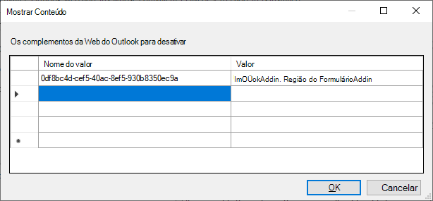

# <a name="make-your-office-add-in-compatible-with-an-existing-com-add-in"></a>Faça seu suplemento do Office ser compatível com um suplemento COM existente

Se você tiver um complemento COM existente, poderá criar funcionalidade equivalente em seu Office Add-in, permitindo que sua solução seja executado em outras plataformas, como Office na Web ou Mac. Em alguns casos, seu Office de usuário pode não ser capaz de fornecer toda a funcionalidade disponível no complemento COM correspondente. Nessas situações, o seu add-in COM pode fornecer uma melhor experiência do usuário Windows do que o Office que o Add-in pode fornecer.

Você pode configurar seu Office Add-in para que, quando o complemento COM equivalente já estiver instalado no computador de um usuário, o Office no Windows executa o add-in COM em vez do Office Add-in. O add-in COM é chamado de "equivalente" porque o Office fará uma transição perfeita entre o complemento COM e o Office De acordo com o qual está instalado o computador de um usuário.

> [!NOTE]
> Esse recurso é suportado pelas plataformas a seguir, quando conectado a uma assinatura Microsoft 365 usuário.
>
> - Excel, Word e PowerPoint na Web
> - Excel, Word e PowerPoint no Windows (versão 1904 ou posterior)
> - Excel, Word e PowerPoint no Mac (versão 13.329 ou posterior)
> - Outlook no Windows (versão 2102 ou posterior)

## <a name="specify-an-equivalent-com-add-in"></a>Especificar um complemento COM equivalente

### <a name="manifest"></a>Manifesto

> [!IMPORTANT]
> Aplica-se Excel, PowerPoint e Word. Outlook suporte em breve.

Para habilitar a compatibilidade entre o seu Office e o complemento COM, [](add-in-manifests.md) identifique o complemento COM equivalente no manifesto do seu Office Add-in. Em seguida, Office no Windows usará o add-in COM em vez do Office do Office, se ambos estão instalados.

O exemplo a seguir mostra a parte do manifesto que especifica um complemento COM como um complemento equivalente. O valor do elemento identifica o complemento COM e o `ProgId` [elemento EquivalentAddins](../reference/manifest/equivalentaddins.md) deve ser posicionado imediatamente antes da marca de `VersionOverrides` fechamento.

```xml
<VersionOverrides>
  ...
  <EquivalentAddins>
    <EquivalentAddin>
      <ProgId>ContosoCOMAddin</ProgId>
      <Type>COM</Type>
    </EquivalentAddin>
  </EquivalentAddins>
</VersionOverrides>
```

> [!TIP]
> Para obter informações sobre o complemento COM e a compatibilidade de UDF XLL, consulte Tornar suas funções personalizadas compatíveis com funções definidas pelo usuário [XLL.](../excel/make-custom-functions-compatible-with-xll-udf.md)

### <a name="group-policy"></a>Política de grupo

> [!IMPORTANT]
> Aplica-se Outlook somente.

Para declarar compatibilidade entre o seu **add-in** da Web Outlook e o com/VSTO add-in, identifique o complemento COM equivalente na política de grupo Desative os complementos da Web do Outlook cuja COM equivalente ou um complemento VSTO está instalado configurando-se no computador do usuário. Em seguida Outlook no Windows usará o add-in COM em vez do complemento da Web, se ambos estão instalados.

1. Baixe a ferramenta [Modelos Administrativos mais](https://www.microsoft.com/download/details.aspx?id=49030)recentes, preste atenção às Instruções de **Instalação da ferramenta.**
1. Abra o Editor de Política de Grupo Local (**gpedit.msc**).
1. Navegue **até Configuração do** Usuário Modelos  >     >  **Administrativos microsoft Outlook 2016**  >  **diversos**.
1. Selecione a configuração Desativar Outlook da Web, cuja COM ou **VSTO add-in** equivalente está instalado .
1. Abra o link para editar a configuração de política.
1. Na caixa de **diálogo Outlook de web para desativar**:
    1. Definir **o nome** do valor como o encontrado no manifesto do complemento da `Id` Web. **Importante**: *Não adicione* chaves ao redor da `{}` entrada.
    1. **Desmarcar** Valor `ProgId` como o do com/VSTO equivalente.
    1. Selecione **OK** para colocar a atualização em vigor.
    

## <a name="equivalent-behavior-for-users"></a>Comportamento equivalente para usuários

Quando um complemento [COM](#specify-an-equivalent-com-add-in)equivalente é especificado, o Office no Windows não exibirá Office interface de usuário do seu complemento (UI) se o complemento COM equivalente estiver instalado. Office oculta apenas os botões de faixa de opções do Office e não impede a instalação. Portanto, seu Office de usuário ainda aparecerá nos seguintes locais dentro da interface do usuário:

- Em **Meus complementos**
- Como entrada no gerenciador de faixa de opções (Excel, Word e PowerPoint somente)

> [!NOTE]
> A especificação de um complemento COM equivalente no manifesto não tem efeito em outras plataformas, como Office na Web ou no Mac.

Os cenários a seguir descrevem o que acontece dependendo de como o usuário adquire o Office Add-in.

### <a name="appsource-acquisition-of-an-office-add-in"></a>Aquisição do AppSource de um Office Add-in

Se um usuário adquirir o Office do AppSource e o complemento COM equivalente já estiver instalado, Office:

1. Instale o Office de usuário.
2. Ocultar a Office interface do usuário de complemento na faixa de opções.
3. Exibe um chamado para o usuário que aponta para o botão de faixa de opções do complemento COM.

### <a name="centralized-deployment-of-office-add-in"></a>Implantação centralizada do Office Desemporto

Se um administrador implantar o Office Add-in em seu locatário usando a implantação centralizada e o complemento COM equivalente já estiver instalado, o usuário deverá reiniciar o Office antes de ver quaisquer alterações. Depois Office reiniciar, ele irá:

1. Instale o Office de usuário.
2. Ocultar a Office interface do usuário de complemento na faixa de opções.
3. Exibe um chamado para o usuário que aponta para o botão de faixa de opções do complemento COM.

### <a name="document-shared-with-embedded-office-add-in"></a>Documento compartilhado com o Office Incorporado

Se um usuário tiver o complemento COM instalado e, em seguida, receber um documento compartilhado com o Office Add-in incorporado, quando abrir o documento, Office irá:

1. Solicitar que o usuário confie no Office Add-in.
2. Se for confiável, o Office de usuário será instalado.
3. Ocultar a Office interface do usuário de complemento na faixa de opções.

## <a name="other-com-add-in-behavior"></a>Outro comportamento de complemento COM

### <a name="excel-powerpoint-word"></a>Excel, PowerPoint, Word

Se um usuário desinstalar o add-in COM equivalente, Office em Windows restaurará a interface do usuário do Office Desinstalar.

Depois de especificar um add-in COM equivalente para seu Office de Office, o Office interrompe o processamento de atualizações para seu Office Add-in. Para adquirir as atualizações mais recentes para o Office, o usuário deve primeiro desinstalar o complemento COM.

### <a name="outlook"></a>Outlook

O complemento COM/VSTO deve ser conectado quando o Outlook for iniciado para que o complemento da Web correspondente seja desabilitado.

Se o complemento COM/VSTO for desconectado durante uma sessão de Outlook subsequente, o complemento da Web provavelmente permanecerá desabilitado até que Outlook seja reiniciado.

## <a name="see-also"></a>Confira também

- [Tornar suas funções personalizadas compatíveis com funções definidas pelo usuário XLL](../excel/make-custom-functions-compatible-with-xll-udf.md)
