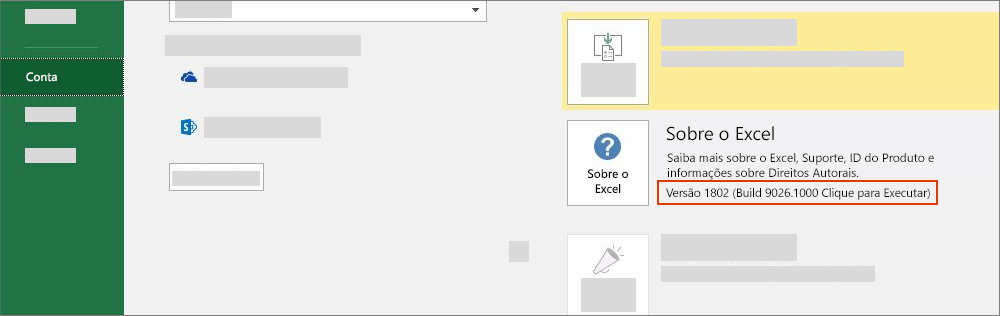

# Versões do Office e conjuntos de requisitos

Há várias versões do Office em várias plataformas, e nem todas dão suporte a cada API na API JavaScript para Office (Office.js). Nem sempre você terá controle sobre a versão do Office que os usuários instalaram.  Para lidar com essa situação, fornecemos um sistema chamado conjuntos de requisitos para ajudar você a determinar se um aplicativo do Office dá suporte aos recursos necessários em seu Suplemento do Office.

> [!NOTE]
>
> - O Office pode ser executado em várias plataformas, incluindo o Windows, navegadores, Mac e iPad.
> - Entre os exemplos dos aplicativos do Office estão os produtos do Office: Excel, Word, PowerPoint, Outlook, OneNote e assim por diante.  
> - Um conjunto de requisito é um grupo nomeado de membros da API, por exemplo, `ExcelApi 1.5`, `WordApi 1.3` etc.  

## Como verificar sua versão do Office

Para identificar a versão do Office que você está usando, em um aplicativo do Office, selecione o menu **Arquivo** e escolha **Conta**. A versão do Office aparecerá na seção **informações sobre** produto. Por exemplo, a captura de tela a seguir indica a versão 1802 do Office (build 9026.1000).

## Disponibilidade dos conjuntos de requisitos do Office

Os Suplementos do Office podem usar conjuntos de requisitos de API para determinar se o aplicativo do Office oferece suporte aos membros da API necessários. O suporte a um conjunto de requisitos varia de acordo com o aplicativo do Office e a versão do aplicativo do Office (veja a seção anterior).

Alguns aplicativos do Office possuem seus próprios conjuntos de requisitos de API. Por exemplo, o primeiro conjunto de requisitos para a API do Excel foi `ExcelApi 1.1`, e o primeiro conjunto de requisitos para a API do Word foi `WordApi 1.1`. Desde então, vários conjuntos de requisitos novos de ExcelApi e WordApi foram adicionados para fornecer mais funcionalidades de API.

Além disso, outras funcionalidades como comandos de suplemento (extensibilidade da faixa de opções) e a capacidade de iniciar caixas de diálogo (API de Caixa de Diálogo) foram adicionadas a API comum. Os comandos de suplemento e os conjuntos de requisitos de API de Caixa de Diálogo são exemplos de conjuntos de API que os diversos hosts do Office compartilham em comum.

Um suplemento só pode usar APIs em conjuntos de requisitos compatíveis com a versão do aplicativo do Office em que o suplemento está em execução. Para saber exatamente quais conjuntos de requisitos estão disponíveis para uma versão específica do aplicativo do Office, consulte os seguintes artigos do conjunto de requisitos específicos do aplicativo.

- [Conjuntos de requisitos de API JavaScript para Excel](/javascript/api/requirement-sets/excel/excel-api-requirement-sets) (ExcelApi)
- [Conjuntos de requisitos de API JavaScript para Word](/javascript/api/requirement-sets/word/word-api-requirement-sets) (WordApi)
- [Conjuntos de requisitos de API JavaScript para OneNote](/javascript/api/requirement-sets/onenote/onenote-api-requirement-sets) (OneNoteApi)
- [Conjuntos de requisitos da API JavaScript do PowerPoint](/javascript/api/requirement-sets/powerpoint/powerpoint-api-requirement-sets) (PowerPointApi)
- [Noções básicas sobre os conjuntos de requisitos da API do Outlook](/javascript/api/requirement-sets/outlook/outlook-api-requirement-sets) (Caixa de Correio)

Alguns conjuntos de requisitos contêm APIs que podem ser usadas por qualquer aplicativo do Office. Para obter informações sobre esses conjuntos de requisitos, consulte os artigos a seguir.

- [Conjuntos de requisitos comuns do Office](/javascript/api/requirement-sets/common/office-add-in-requirement-sets)
- [Conjuntos de requisitos dos comandos de suplemento](/javascript/api/requirement-sets/common/add-in-commands-requirement-sets)
- [Conjuntos de requisitos da API de Caixa de Diálogo](/javascript/api/requirement-sets/common/dialog-api-requirement-sets)
- [Conjuntos de requisitos de origem da caixa de diálogo](/javascript/api/requirement-sets/common/dialog-origin-requirement-sets)
- [Conjuntos de requisitos da API de Identidade](/javascript/api/requirement-sets/common/identity-api-requirement-sets)
- [Conjuntos de requisitos de Coerção de Imagens](/javascript/api/requirement-sets/common/image-coercion-requirement-sets)
- [Conjuntos de requisitos de Atalhos de teclado](/javascript/api/requirement-sets/common/keyboard-shortcuts-requirement-sets)
- [Abrir conjuntos de requisitos de janela do navegador](/javascript/api/requirement-sets/common/open-browser-window-api-requirement-sets)
- [Conjuntos de requisitos comuns da API](/javascript/api/requirement-sets/common/ribbon-api-requirement-sets)
- [Conjuntos de requisitos de tempo de execução compartilhado](/javascript/api/requirement-sets/common/shared-runtime-requirement-sets)

O número da versão de um conjunto de requisitos, como "1.1" no `ExcelApi 1.1`, tem relação com o aplicativo do Office. O número da versão de um certo conjunto de requisitos (por exemplo, `ExcelApi 1.1`), não corresponde ao número da versão do Office.js ou aos conjuntos de requisitos para outros aplicativos do Office (por exemplo, Word, Outlook etc.).  Lançamos os conjuntos de requisitos para diferentes aplicativos do Office em ritmos e períodos diferentes. Por exemplo, `ExcelApi 1.5` foi lançado antes do conjunto de requisitos `WordApi 1.3`.

A biblioteca Office JavaScript API (Office.js) inclui todos os conjuntos de requisitos que estão disponíveis atualmente. Embora exista um conjunto de requisitos `ExcelApi 1.3` e `WordApi 1.3`, não existe um conjunto de `Office.js 1.3` requisitos. O último lançamento do Office.js é mantido como um único ponto de extremidade do Office entregue através da rede de entrega de conteúdo (CDN). Para mais detalhes sobre o CDN do Office.js, incluindo como a compatibilidade de versões anteriores são tratados, veja [Entendendo a API de JavaScript do Office](../develop/understanding-the-javascript-api-for-office.md).

## Especificar aplicativos do Office e conjuntos de requisitos

Há várias maneiras de especificar quais aplicativos do Office e conjuntos de requisitos são exigidos por um suplemento.  Para saber mais detalhes, confira [Especificar requisitos de API e aplicativos do Office](../develop/specify-office-hosts-and-api-requirements.md).

## Confira também

- [Especificar requisitos da API e de aplicativos do Office](../develop/specify-office-hosts-and-api-requirements.md)
- [Instalar a última versão do Office](../develop/install-latest-office-version.md)
- [Visão geral dos canais de atualização do Microsoft 365 Apps](/deployoffice/overview-of-update-channels-for-office-365-proplus)
- [Reinvente a produtividade com o Microsoft 365 e o Microsoft Teams](https://products.office.com/compare-all-microsoft-office-products?tab=2)
