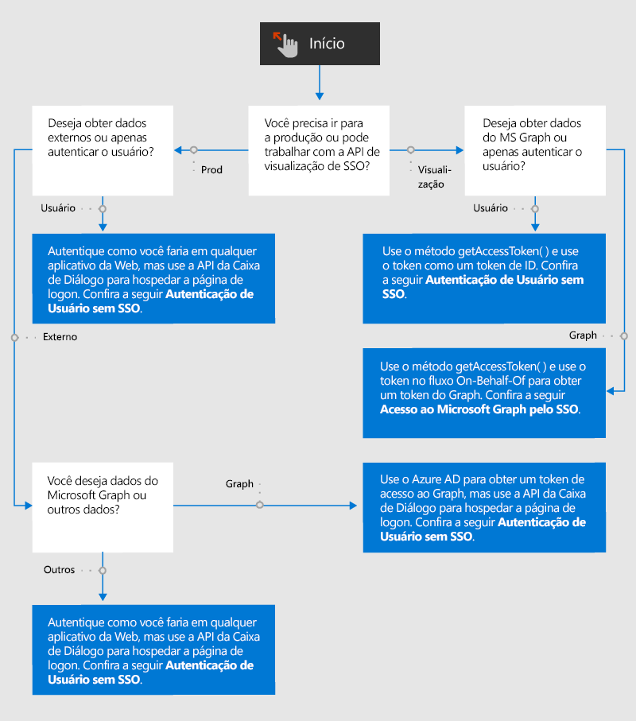

# Visão geral da autenticação e autorização nos Suplementos do Office

Os aplicativos da Web e, portanto, os Suplementos do Office permitem acesso anônimo por padrão, mas é possível exigir que os usuários autentiquem fazendo logon. Por exemplo, você pode exigir que seus usuários se conectem com uma conta da Microsoft, uma conta corporativa ou de estudante do Microsoft 365 ou outra conta comum. Essa tarefa é chamada de autenticação do usuário, pois permite que o suplemento saiba quem é o usuário.

Seu suplemento também pode obter consentimento do usuário para acessar seus dados do Microsoft Graph (como seu perfil do Microsoft 365, arquivos do OneDrive e dados do SharePoint) ou para dados de outras fontes externas, como Google, Facebook, LinkedIn, SalesForce e GitHub. Essa tarefa é chamada de autorização de suplemento (ou aplicativo), pois é o *suplemento* que está sendo autorizado, não o usuário.

Há duas maneiras de realizar a autentificação e autorização.

- **O Logon Único do Office(SSO)**: Um sistema que permite que o login do usuário no Office também funcione como um login para o suplemento. Opcionalmente, o suplemento também pode usar as credenciais do usuário do Office para autorizar o suplemento ao Microsoft Graph. (As fontes que não são da Microsoft não podem ser acessadas por este sistema.)
- **Autenticação e Autorização de Aplicativos Web com o Azure Active Directory**: Não é algo novo ou especial. É apenas a maneira como os suplementos do Office (e outros aplicativos web) autenticavam os usuários e aplicativos autorizados antes de existir um sistema de SSO Office e isto ainda é usado em cenários onde o SSO do Office não pode ser usado. Além disso, existem cenários nos quais você deseja que seus usuários façam logon em seu suplemento separadamente mesmo quando o SSO estiver disponível; por exemplo, se você quiser que os eles tenham a opção de fazer o logon no suplemento com uma ID diferente daquele com o qual eles estão atualmente registrados no Office.

O fluxograma a seguir mostra as decisões que você precisa tomar como desenvolvedor de suplemento. Os detalhes estão incluídos mais adiante neste artigo.

## Autenticação de usuário sem SSO

É possível autenticar um usuário em um Suplemento do Office com o Azure Active Directory (AAD) da mesma forma que em qualquer outro aplicativo Web com uma exceção: o AAD não permite que sua página de logon seja aberta em um iframe. Quando um suplemento do Office está sendo executado no *Office na Web*, o painel de tarefas é um iframe. Isso significa que será necessário abrir a tela de logon do AAD em uma caixa de diálogo aberta com a API de diálogo do Office. Isso afeta o modo como você usa bibliotecas auxiliares de autenticação. Para saber mais, confira [Autenticação com a API de diálogo do Office](auth-with-office-dialog-api.md).

Para obter informações sobre autenticação de programação com o AAD, comece por [Visão geral da plataforma de identidade da Microsoft (v 2.0)](/azure/active-directory/develop/v2-overview), onde você encontrará vários tutoriais e guias, bem como links para bibliotecas e exemplos relevantes. Conforme explicado em [Autenticação com a API de diálogo do Office](auth-with-office-dialog-api.md), talvez seja necessário ajustar o código nos exemplos para executar na caixa de diálogo do Office.

## Acesso ao Microsoft Graph sem SSO

Você pode obter autorização para os dados do Microsoft Graph para seu suplemento obtendo um token de acesso ao Graph a partir do Azure Active Directory (AAD). Você pode fazer isso sem depender do SSO do Office. Para saber mais sobre como fazer isso, confira [Acesse o Microsoft Graph sem o SSO](authorize-to-microsoft-graph-without-sso.md) que tem mais detalhes e links para os exemplos.

## Autenticação do usuário com o SSO

Para autenticar o usuário usando o SSO, seu código em um arquivo de função ou painel de tarefas chama o método [getAccessToken](/javascript/api/office-runtime/officeruntime.auth#getaccesstoken-options-). Se o usuário não estiver conectado, o Office abrirá uma caixa de diálogo e navegará até a página de logon do Azure Active Directory. Após o usuário entrar ou se o usuário já tiver entrado, o método retorna um token de acesso. O token é um de inicialização no fluxo **On-Behalf-Of**. (Confira [Acessar o Microsoft Graph com o SSO](#access-to-microsoft-graph-with-sso).) No entanto, ele também pode ser usado como um token de ID, pois inclui várias declarações exclusivas para o usuário atual, incluindo `preferred_username`, `name`, `sub` e `oid`. Para obter orientação sobre qual propriedade usar como a ID de usuário final, consulte [Tokensde acesso da plataforma de identidade da Microsoft](https://docs.microsoft.com/azure/active-directory/develop/access-tokens#payload-claims). Para obter um exemplo de um desses tokens, confira [Exemplo de token de acesso](sso-in-office-add-ins.md#example-access-token).

Após o seu código ter extraído a declaração desejada no token, ele usará esse valor para pesquisar o usuário em uma tabela de usuário ou banco de dados de usuário que você mantém. Use o banco de dados para armazenar informações relativas ao usuário, como as preferências do usuário ou o estado da conta do usuário. Uma vez que você está usando o SSO, os usuários não entram separadamente no seu suplemento, assim você não precisa armazenar uma senha para o usuário.

Antes de começar a implementar a autenticação do usuário com o SSO, certifique-se de que você está totalmente familiarizado com o artigo [Habilitar o logon único para Suplementos do Office](sso-in-office-add-ins.md). Observe também estes exemplos:

- [SSO do NodeJS do Suplemento do Office](https://github.com/OfficeDev/Office-Add-in-NodeJS-SSO), especialmente o arquivo [ssoAuthES6.js](https://github.com/OfficeDev/Office-Add-in-NodeJS-SSO/blob/master/Complete/public/javascripts/ssoAuthES6.js).
- [SSO do ASP.NET do Suplemento do Office](https://github.com/OfficeDev/Office-Add-in-ASPNET-SSO).

Esses exemplos, no entanto, não usam o token como um token de ID. Eles o utilizam para obter acesso ao Microsoft Graph com o fluxo **On Behalf Of**.

## Acesso ao Microsoft Graph pelo SSO

Para usar o SSO para acessar o Microsoft Graph, o suplemento em um arquivo de função ou painel de tarefas chama o método [getAccessToken](/javascript/api/office-runtime/officeruntime.auth#getaccesstoken-options-). Se o usuário não estiver conectado, o Office abrirá uma caixa de diálogo e o navegará até a página de logon do Azure Active Directory. Após o usuário entrar ou se o usuário já tiver entrado, o método retorna um token de acesso. O token é um token de Bootstrap no fluxo **On Behalf Of**. Especificamente, ele tem uma `scope` Declaração com o valor `access_as_user`. Para mais instruções sobre as declarações no token, consulte [Tokens de acesso à plataforma de identidade da Microsoft](https://docs.microsoft.com/azure/active-directory/develop/access-tokens#payload-claims). Para obter um exemplo de um desses tokens, confira [Exemplo de token de acesso](sso-in-office-add-ins.md#example-access-token).

Após o código obter o token, ele o usará o fluxo **On Behalf Of** para obter um segundo token: um token de acesso ao Microsoft Graph.

Antes de começar a implementar o SSO do Office, certifique-se de que você está totalmente familiarizado com esses dois artigos:

- [Habilitar o logon único para Suplementos do Office](sso-in-office-add-ins.md)
- [Autorizar o Microsoft Graph com SSO](authorize-to-microsoft-graph.md)

Você também deve ler pelo menos um dos artigos descritos aqui. Mesmo que você não execute as etapas, elas contêm informações valiosas sobre a implementação do SSO do Office e o fluxo **On Behalf Of**. 

- [Criar um Suplemento do Office com ASP.NET que usa logon único](create-sso-office-add-ins-aspnet.md)
- [Crie um Suplemento do Office com Node.js que use logon único](create-sso-office-add-ins-nodejs.md)

Observe também estes exemplos:

- [SSO do NodeJS do Suplemento do Office](https://github.com/OfficeDev/Office-Add-in-NodeJS-SSO)
- [SSO do ASP.NET do Suplemento do Office](https://github.com/OfficeDev/Office-Add-in-ASPNET-SSO)

## Acesso a fontes de dados que não são da Microsoft:

Serviços online populares, incluindo o Google, o Facebook, o LinkedIn, o SalesForce e o GitHub, permitem que os desenvolvedores forneçam acesso para os usuários a suas contas em outros aplicativos. Isso dá a você a capacidade de incluir esses serviços no seu Suplemento do Office. Para obter uma visão geral das maneiras como seu suplemento pode fazer isso, confira [Autorizar serviços externos em seu Suplemento do Office](auth-external-add-ins.md).

> [!IMPORTANT]
> Antes de começar a codificar, descubra se a fonte de dados permite que o logon na tela seja aberto em um iframe. Quando um Suplemento do Office está sendo executado no *Office na Web*, o painel de tarefas é um iframe. Se a fonte de dados não permitir que a tela de logon seja aberta em um iFrame, você precisará abrir a tela de logon em uma caixa de diálogo aberta com a API de diálogo do Office. Para saber mais, confira [Autenticação com a API de diálogo do Office](auth-with-office-dialog-api.md).
