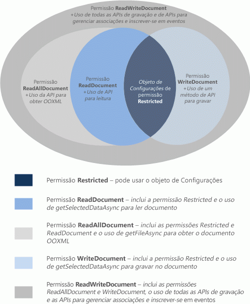

# <a name="requesting-permissions-for-api-use-in-add-ins"></a>Solicitar permissões para uso da API em suplementos 

Este artigo descreve os diferentes níveis de permissão que você pode declarar no manifesto do suplemento de conteúdo ou de painel de tarefas para especificar o nível de acesso da API JavaScript que o suplemento requer para seus recursos. 

## <a name="permissions-model"></a>Modelo de permissões

Um modelo de permissões de acesso da API JavaScript com cinco níveis fornece a base para a privacidade e a segurança dos usuários dos suplementos de conteúdo e de painel de tarefas. A Figura 1 mostra os cinco níveis de permissões da API que você pode declarar no manifesto do suplemento.

*Figura 1. Modelo de permissão com cinco níveis para os suplementos do conteúdo e do painel de tarefas*



Essas permissões especificam o subconjunto da API que o tempo de execução do suplemento permitirá que o suplemento de conteúdo ou de painel de tarefas use quando um usuário inserir e ativar o suplemento (confiar nele). Para declarar o nível de permissão que o suplemento do conteúdo ou do painel de tarefas requer, especifique um dos valores de texto da permissão no elemento [Permissions](../reference/manifest/permissions.md) do manifesto do suplemento. O exemplo a seguir solicita a permissão  **WriteDocument**, que autorizará somente os métodos que podem gravar no documento, mas não lê-lo.

```XML
<Permissions>WriteDocument</Permissions>
```

Como prática recomendada, você deve solicitar permissões com base no princípio do _menor privilégio_. Ou seja, você deve solicitar permissão para acessar apenas o subconjunto mínimo da API que o suplemento requer para funcionar corretamente. Por exemplo, se o suplemento precisar apenas ler os dados no documento de um usuário para seus recursos, você não deve solicitar mais do que a permissão **ReadDocument**.

A tabela a seguir descreve o subconjunto da API JavaScript que é habilitado por cada nível de permissão.

|**Permissão**|**Subconjunto habilitado da API**|
|:-----|:-----|
|**Restrito**|Os métodos do objeto [Settings](/javascript/api/office/office.settings) e o método [Document.getActiveViewAsync](/javascript/api/office/office.document#office-office-document-getactiveviewasync-member(1)). Esse é o nível de permissão mínimo que pode ser solicitado por um suplemento de conteúdo ou de painel de tarefas.|
|**ReadDocument**|Além da API permitida pela permissão **Restrita** , adiciona acesso aos membros da API necessários para ler o documento e gerenciar as vinculações. Isso inclui o uso de:<br/><ul><li>O método <a href="/javascript/api/office/office.document#getSelectedDataAsync_coercionType__options__callback_" target="_blank">Document.getSelectedDataAsync</a> para obter o texto selecionado, HTML (Word apenas) ou os dados tabulares, mas não o código do Open Office XML (OOXML) subjacente que contém todos os dados no documento.</p></li><li><p>Método <a href="/javascript/api/office/office.document#getFileAsync_fileType__options__callback_" target="_blank">Document.getFileAsync</a> para acessar todo o texto no documento, mas não a cópia binária OOXML subjacente do documento.</p></li><li><p>Método <a href="/javascript/api/office/office.binding#getDataAsync_options__callback_" target="_blank">Binding.getDataAsync</a> para a leitura dos dados associados no documento.</p></li><li><p>Métodos <a href="/javascript/api/office/office.bindings#addFromNamedItemAsync_itemName__bindingType__options__callback_" target="_blank">addFromNamedItemAsync</a>, <a href="/javascript/api/office/office.bindings#addFromPromptAsync_bindingType__options__callback_" target="_blank">addFromPromptAsync</a>, <a href="/javascript/api/office/office.bindings#addFromSelectionAsync_bindingType__options__callback_" target="_blank">addFromSelectionAsync</a> do objeto <span class="keyword">Bindings</span> para criar associações no documento.</p></li><li><p>Métodos <a href="/javascript/api/office/office.bindings#getAllAsync_options__callback_" target="_blank">getAllAsync</a>, <a href="/javascript/api/office/office.bindings#getByIdAsync_id__options__callback_" target="_blank">getByIdAsync</a> e <a href="/javascript/api/office/office.bindings#releaseByIdAsync_id__options__callback_" target="_blank">releaseByIdAsync</a> do objeto <span class="keyword">Bindings</span> para acessar e remover as associações no documento.</p></li><li><p>Método <a href="/javascript/api/office/office.document#getFilePropertiesAsync_options__callback_" target="_blank">Document.getFilePropertiesAsync</a> para acessar as propriedades de arquivo do documento, como a URL do documento.</p></li><li><p>Método <a href="/javascript/api/office/office.document#goToByIdAsync_id__goToType__options__callback_" target="_blank">Document.goToByIdAsync</a> para navegar até os objetos nomeados e locais no documento.</p></li><li><p>Para os suplementos do painel de tarefas do Project, todos os métodos "get" do objeto <a href="/javascript/api/office/office.document" target="_blank">ProjectDocument</a>. </p></li></ul>|
|**ReadAllDocument**|Além da API permitida pelas permissões **Restricted** e **ReadDocument** , permite o seguinte acesso adicional aos dados do documento.<br/><ul><li><p>Os métodos <span class="keyword">Document.getSelectedDataAsync</span> e <span class="keyword">Document.getFileAsync</span> podem acessar o código OOXML subjacente do documento (que, além de texto, pode conter formatação, links, gráficos incorporados, comentários, revisões, etc.).</p></li></ul>|
|**WriteDocument**|Além da API permitida pela permissão **Restrita** , adiciona acesso aos seguintes membros da API.<br/><ul><li><p>Método <a href="/javascript/api/office/office.document#setSelectedDataAsync_data__options__callback_" target="_blank">Document.setSelectedDataAsync</a> para gravar na seleção do usuário no documento.</p></li></ul>|
|**ReadWriteDocument**|Além da API permitida pelas permissões **Restricted**, **ReadDocument**, **ReadAllDocument** e **WriteDocument** , inclui o acesso a todas as API restantes suportadas por complementos de conteúdo e painel de tarefas, incluindo métodos para inscrever-se em eventos. Você deve declarar a **permissão ReadWriteDocument** para acessar esses membros adicionais da API:<br/><ul><li><p>Método <a href="/javascript/api/office/office.binding#setDataAsync_data__options__callback_" target="_blank">Binding.setDataAsync</a> para gravar nas regiões associadas do documento.</p></li><li><p>Método <a href="/javascript/api/office/office.tablebinding#addRowsAsync_rows__options__callback_" target="_blank">TableBinding.addRowsAsync</a> para adicionar linhas às tabelas associadas.</p></li><li><p>Método <a href="/javascript/api/office/office.tablebinding#addColumnsAsync_tableData__options__callback_" target="_blank">TableBinding.addColumnsAsync</a> para adicionar colunas às tabelas associadas.</p></li><li><p>Método <a href="/javascript/api/office/office.tablebinding#deleteAllDataValuesAsync_options__callback_" target="_blank">TableBinding.deleteAllDataValuesAsync</a> para excluir todos os dados em uma tabela associada.</p></li><li><p>Métodos <a href="/javascript/api/office/office.tablebinding#setFormatsAsync_cellFormat__options__callback_" target="_blank">setFormatsAsync</a>, <a href="/javascript/api/office/office.tablebinding#clearFormatsAsync_options__callback_" target="_blank">clearFormatsAsync</a> e <a href="/javascript/api/office/office.tablebinding#setTableOptionsAsync_tableOptions__options__callback_" target="_blank">setTableOptionsAsync</a> do objeto <span class="keyword">TableBinding</span> para definir a formatação e as opções nas tabelas associadas.</p></li><li><p>Todos os membros dos objetos <a href="/javascript/api/office/office.customxmlnode" target="_blank">CustomXmlNode</a>, <a href="/javascript/api/office/office.customxmlpart" target="_blank">CustomXmlPart</a>, <a href="/javascript/api/office/office.customxmlparts" target="_blank">CustomXmlParts</a> e <a href="/javascript/api/office/office.customxmlprefixmappings" target="_blank">CustomXmlPrefixMappings</a>.</p></li><li><p>Todos os métodos para se inscrever em eventos compatíveis com suplementos de conteúdo e de painel de tarefas, especificamente os métodos <span class="keyword">addHandlerAsync</span> e <span class="keyword">removeHandlerAsync</span> dos objetos <a href="/javascript/api/office/office.binding" target="_blank">Binding</a>, <a href="/javascript/api/office/office.customxmlpart" target="_blank">CustomXmlPart</a>, <a href="/javascript/api/office/office.document" target="_blank">Document</a>, <a href="/javascript/api/office/office.document" target="_blank">ProjectDocument</a> e <a href="/javascript/api/office/office.document#settings" target="_blank">Settings</a>.</p></li></ul>|

## <a name="see-also"></a>Confira também

- [Privacidade e segurança para Suplementos do Office](../concepts/privacy-and-security.md)
