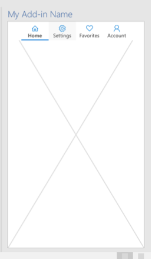

# <a name="show-or-hide-the-task-pane-of-your-office-add-in"></a>Mostre ou oculte o painel de tarefas de seu Suplemento do Office 

[!include[Shared JavaScript runtime requirements](../includes/shared-runtime-requirements-note.md)]

Você pode mostrar o painel de tarefas do seu Office Add-in chamando a `Office.addin.showAsTaskpane()` função.

```javascript
function onCurrentQuarter() {
    Office.addin.showAsTaskpane()
    .then(function() {
        // Code that enables task pane UI elements for
        // working with the current quarter.
    });
}
```

O código anterior assume um cenário em que há uma planilha Excel chamada **CurrentQuarterSales**. O complemento torna o painel de tarefas visível sempre que essa planilha for ativada. O método `onCurrentQuarter` é um manipulador para o [Office. Evento Worksheet.onActivated](/javascript/api/excel/excel.worksheet?view=excel-js-preview&preserve-view=true#onActivated) que foi registrado na planilha.

Você também pode ocultar o painel de tarefas chamando a `Office.addin.hide()` função.

```javascript
function onCurrentQuarterDeactivated() {
    Office.addin.hide();
}
```

O código anterior é um manipulador que está registrado para o [Office. Evento Worksheet.onDeactivated.](/javascript/api/excel/excel.worksheet?view=excel-js-preview&preserve-view=true#onDeactivated)

## <a name="additional-details-on-showing-the-task-pane"></a>Detalhes adicionais sobre como mostrar o painel de tarefas

Quando você chamar , Office exibirá em um painel de tarefas o arquivo atribuído como o valor de ID do recurso ( ) do `Office.addin.showAsTaskpane()` `resid` painel de tarefas. Esse valor pode ser atribuído ou alterado abrindo seu `resid` **arquivomanifest.xml** e localizando dentro `<SourceLocation>` do `<Action xsi:type="ShowTaskpane">` elemento.
(Consulte [Configure your Office Add-in to use a shared runtime](configure-your-add-in-to-use-a-shared-runtime.md) for additional details.)

Como `Office.addin.showAsTaskpane()` é um método assíncrono, seu código continuará em execução até que a função seja concluída. Aguarde essa conclusão com a palavra-chave ou um `await` `then()` método, dependendo da sintaxe JavaScript que você está usando.

## <a name="configure-your-add-in-to-use-the-shared-runtime"></a>Configurar seu complemento para usar o tempo de execução compartilhado

Para usar os `showAsTaskpane()` `hide()` métodos e, seu complemento deve usar o tempo de execução compartilhado. Para obter mais informações, [consulte Configure your Office Add-in to use a shared runtime](configure-your-add-in-to-use-a-shared-runtime.md).

## <a name="preservation-of-state-and-event-listeners"></a>Preservação de ouvintes de estado e eventos

Os `hide()` métodos `showAsTaskpane()` and alteram apenas a *visibilidade* do painel de tarefas. Eles não descarregam ou recarregam (ou reinicializam seu estado).

Considere o seguinte cenário: um painel de tarefas foi projetado com guias. A **guia** Início é aberta quando o complemento é lançado pela primeira vez. Suponha que um usuário abra **a guia Configurações** e, posteriormente, o código no painel de tarefas chama em resposta a algum `hide()` evento. Ainda mais tarde, o `showAsTaskpane()` código chama em resposta a outro evento. O painel de tarefas reaparecerá e a **guia Configurações** ainda está selecionada.



Além disso, todos os ouvintes de eventos registrados no painel de tarefas continuam a ser executados mesmo quando o painel de tarefas está oculto.

Considere o seguinte cenário: O painel de tarefas tem um manipulador registrado para o Excel e eventos para uma `Worksheet.onActivated` `Worksheet.onDeactivated` planilha chamada **Sheet1**. O manipulador ativado faz com que um ponto verde apareça no painel de tarefas. O manipulador desativado transforma o ponto vermelho (que é seu estado padrão). Suponha então que o código chama `hide()` **quando Sheet1** não é ativado e o ponto é vermelho. Enquanto o painel de tarefas está oculto, **Sheet1** é ativado. Chamadas de código `showAsTaskpane()` posteriores em resposta a algum evento. Quando o painel de tarefas é aberto, o ponto fica verde porque os ouvintes e manipuladores de eventos foram embora o painel de tarefas tenha sido oculto.

## <a name="handle-the-visibility-changed-event"></a>Manipular o evento de visibilidade alterado

Quando seu código altera a visibilidade do painel de tarefas com `showAsTaskpane()` ou , Office dispara o `hide()` `VisibilityModeChanged` evento. Pode ser útil lidar com esse evento. Por exemplo, suponha que o painel de tarefas exibe uma lista de todas as planilhas em uma planilha. Se uma nova planilha for adicionada enquanto o painel de tarefas estiver oculto, tornar o painel de tarefas visível não adicionaria, por si só, o novo nome da planilha à lista. Mas seu código pode responder ao evento para recarregar a propriedade Worksheet.name de todas as planilhas na coleção `VisibilityModeChanged` [Workbook.worksheets,](/javascript/api/excel/excel.workbook#worksheets) conforme mostrado no código de exemplo abaixo. [](/javascript/api/excel/excel.worksheet#name)

Para registrar um manipulador para o evento, você não usa um método "adicionar manipulador" como faria na maioria dos Office javaScript. Em vez disso, há uma função especial para a qual você passa seu manipulador: [Office.addin.onVisibilityModeChanged](/javascript/api/office/office.addin#onVisibilityModeChanged_listener_). Apresentamos um exemplo a seguir. Observe que a `args.visibilityMode` propriedade é tipo [VisibilityMode](/javascript/api/office/office.visibilitymode).

```javascript
Office.addin.onVisibilityModeChanged(function(args) {
    if (args.visibilityMode = "Taskpane"); {
        // Code that runs whenever the task pane is made visible.
        // For example, an Excel.run() that loads the names of
        // all worksheets and passes them to the task pane UI.
    }
});
```

A função retorna outra função que *desregula* o manipulador. Veja um exemplo simples, mas não robusto:

```javascript
var removeVisibilityModeHandler =
    Office.addin.onVisibilityModeChanged(function(args) {
        if (args.visibilityMode = "Taskpane"); {
            // Code that runs whenever the task pane is made visible.
        }
    });


// In some later code path, deregister with:
removeVisibilityModeHandler();
```

O método é assíncrono e retorna uma promessa, o que significa que seu código precisa aguardar o cumprimento da promessa antes de chamar o manipulador `onVisibilityModeChanged` **de registro.**

```javascript
// await the promise from onVisibilityModeChanged and assign
// the returned deregister handler to removeVisibilityModeHandler.
var removeVisibilityModeHandler =
    await Office.addin.onVisibilityModeChanged(function(args) {
        if (args.visibilityMode = "Taskpane"); {
            // Code that runs whenever the task pane is made visible.
        }
    });
```

A função de desregister também é assíncrona e retorna uma promessa. Portanto, se você tiver um código que não deve ser executado até que a desregistração seja concluída, aguarde a promessa retornada pela função de desregister.

```javascript
// await the promise from the deregister handler before continuing
await removeVisibilityModeHandler();
// subsequent code here
```

## <a name="see-also"></a>Conferir também

- [Configure seu Suplemento do Office para usar um tempo de execução de JavaScript compartilhado](configure-your-add-in-to-use-a-shared-runtime.md)
- [Execute o código em seu Suplemento do Office quando o documento for aberto](run-code-on-document-open.md)
