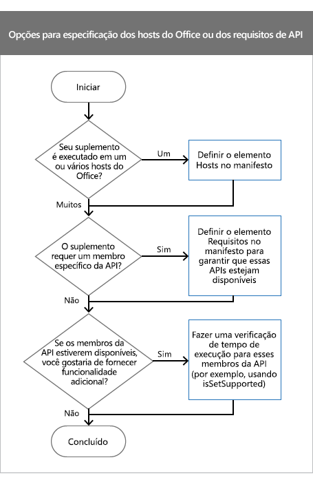

# <a name="specify-office-hosts-and-api-requirements"></a>Especificar hosts do Office e requisitos de API

Seu Suplemento do Office pode depender de um host específico do Office, um conjunto de requisitos, um membro de API ou uma versão da API para funcionar conforme o esperado. Por exemplo, o suplemento pode:

- Executar em um único aplicativo do Office (por exemplo, Word ou Excel) ou diversos aplicativos.

- Usar as APIs de JavaScript que estão disponíveis apenas em algumas versões do Office. Por exemplo, você pode usar as APIs JavaScript do Excel em um suplemento executado no Excel 2016.

- Executar apenas nas versões do Office que oferecem suporte a membros da API que seu suplemento usa.

Este artigo ajuda você a entender quais opções você deve escolher para garantir que seu suplemento funcione conforme o esperado e atinja o público mais amplo possível.

> [!NOTE]
> Confira uma visão avançada da compatibilidade atual dos suplementos do Office no momento na página [Disponibilidade de hosts e plataformas de suplementos do Office](../overview/office-add-in-availability.md).

A tabela a seguir lista os principais conceitos discutidos neste artigo.

|**Conceito**|**Descrição**|
|:-----|:-----|
|Aplicativo do Office, aplicativo host do Office, host do Office ou host|O aplicativo do Office usado para executar seu suplemento. Por exemplo, Word e assim por diante.|
|Plataforma|Onde o host do Office é executado, como em um navegador ou em um iPad.|
|Conjunto de requisitos|Um grupo nomeado de membros relacionados da API. Os suplementos usam conjuntos de requisitos para determinar se o host do Office oferece suporte a membros da API usados por seu suplemento. É mais fácil testar se há suporte para um conjunto de requisitos do que o suporte para membros individuais da API. O suporte a um conjunto de requisitos varia de acordo com o host do Office e a versão do host do Office. <br >Conjuntos de requisitos são especificados no arquivo de manifesto. Ao especificar conjuntos de requisitos no manifesto, você estabelece o nível mínimo de suporte à API que o host do Office deve fornecer a fim de executar seu suplemento. Os hosts do Office que não suportam conjuntos de requisitos especificados no manifesto não podem executar o suplemento e o mesmo não será exibido em <span class="ui">Meus suplementos</span>. Isso restringirá onde o suplemento está disponível. No código usando verificações de tempo de execução. Para obter uma lista completa de conjuntos de requisitos, confira [Conjuntos de requisitos de Suplemento do Office](/office/dev/add-ins/reference/requirement-sets/office-add-in-requirement-sets).|
|Verificação no tempo de execução|Um teste é executado no tempo de execução para determinar se o host do Office que está executando seu suplemento oferece suporte aos conjuntos de requisitos ou métodos usados por seu suplemento. Para executar uma verificação no tempo de execução, use uma instrução **if** com o método **isSetSupported**, os conjuntos de requisito ou os nomes de método que não fazem parte de um conjunto de requisitos.  Use as verificações no tempo de execução para garantir que seu suplemento alcance o maior número de clientes. Ao contrário dos conjuntos de requisitos, as verificações no tempo de execução não especificam o nível mínimo de suporte à API exigido do host do Office para que seu suplemento possa ser executado. Em vez disso, use a instrução **if** para determinar se há suporte para um membro da API. Se houver, você poderá proporcionar mais funcionalidade em seu suplemento. Seu suplemento sempre aparecerá em **Meus Suplementos** ao usar verificações no tempo de execução.|

## <a name="before-you-begin"></a>Antes de começar

O suplemento deve usar a versão mais recente do esquema de manifesto de suplemento. Se você usar as verificações no tempo de execução em seu suplemento, use a biblioteca mais recente da API JavaScript para Office (office.js).

### <a name="specify-the-latest-add-in-manifest-schema"></a>Especificar o esquema de manifesto de suplemento mais recente

Seu manifesto de suplemento deve usar a versão 1.1 do esquema de manifesto de suplemento. Defina o elemento **OfficeApp** no manifesto do seu suplemento da seguinte maneira.

```XML
<OfficeApp xmlns="http://schemas.microsoft.com/office/appforoffice/1.1" xmlns:xsi="http://www.w3.org/2001/XMLSchema-instance" xsi:type="TaskPaneApp">
```

### <a name="specify-the-latest-javascript-api-for-office-library"></a>Especificar a biblioteca de API JavaScript para Office mais recente

Se você usar as verificações no tempo de execução, faça referência à versão mais recente da biblioteca de API JavaScript para Office na CDN (rede de distribuição de conteúdo). Para tanto, adicione a seguinte marca `script` ao código HTML. O uso de `/1/` na URL da CDN garante a referência à versão mais recente do Office.js.

```HTML
<script src="https://appsforoffice.microsoft.com/lib/1/hosted/Office.js" type="text/javascript"></script>
```

## <a name="options-to-specify-office-hosts-or-api-requirements"></a>Opções para especificar os hosts do Office ou requisitos de API

Ao especificar os hosts do Office ou os requisitos de API, há vários fatores a considerar. O diagrama a seguir mostra como decidir sobre qual técnica usar em seu suplemento.



- Se o seu suplemento for executado em um host do Office, defina o elemento **Hosts** no manifesto. Para saber mais, confira [Definir o elemento Hosts](#set-the-hosts-element).

- Para definir o conjunto de requisitos mínimos ou os membros da API que devem receber suporte de um host do Office para que seu suplemento seja executado, defina o elemento **Requirements** no manifesto. Para saber mais, confira [Definir o elemento Requirements no manifesto](#set-the-requirements-element-in-the-manifest).

- Se você quiser fornecer outras funcionalidades caso conjuntos de requisitos ou membros da API específicos estejam disponíveis no host do Office, execute uma verificação no tempo de execução no código JavaScript do seu suplemento. Por exemplo, se o suplemento for executado no Excel 2016, use os membros do API JavaScript do Excel a fim de fornecer funcionalidades adicionais. Para saber mais, confira [Usar verificações de tempo de execução em seu código JavaScript](#use-runtime-checks-in-your-javascript-code).

## <a name="set-the-hosts-element"></a>Definir o elemento Hosts

Para fazer seu suplemento ser executado em um aplicativo host do Office, use os elementos  **Hosts** e **Host** no manifesto. Se você não especificar o elemento **Hosts**, o suplemento será executado em todos os hosts.

Por exemplo, a declaração de **Hosts** e **Host** a seguir especifica que o suplemento funcionará com qualquer versão do Excel, o que inclui o Excel na Web, no Windows e no iPad.

```xml
<Hosts>
  <Host Name="Workbook" />
</Hosts>
```

O elemento **Hosts** pode conter um ou mais elementos **Host**. O elemento **Host** especifica o host do Office exigido por seu suplemento. O atributo **Name** é obrigatório e pode ser definido com um dos valores a seguir.

| Nome          | Aplicativos host do Office                                                                  |
|:--------------|:------------------------------------------------------------------------------------------|
| Banco de dados      | Aplicativos Web do Access                                                                           |
| Documento      | Word no Windows, Word para Mac, Word para iPad e Word na Web                               |
| Caixa de correio       | Outlook no Windows, Outlook para Mac, Outlook na Web, Outlook no Android, Outlook no iOS|
| Apresentação  | PowerPoint no Windows, PowerPoint para Mac, PowerPoint para iPad e PowerPoint na Web       |
| Project       | Project no Windows                                                                        |
| Pasta de Trabalho      | Excel no Windows, Excel para Mac, Excel para iPad e Excel na Web                           |

> [!NOTE]
> o atributo `Name` especifica o aplicativo host do Office que pode executar seu suplemento. Há suporte para hosts do Office em várias plataformas, que são executados em computadores, navegadores da Web, tablets e dispositivos móveis. Você não pode especificar qual plataforma pode ser usada para executar seu suplemento. Por exemplo, se você especificar `Mailbox`, o Outlook no Windows e na Web podem ser usados para executar o suplemento.

> [!IMPORTANT]
> Não recomendamos mais criar e usar aplicativos Web do Access e bancos de dados no SharePoint. Como alternativa, use o [Microsoft PowerApps](https://powerapps.microsoft.com/) para criar soluções de negócios sem código para dispositivos móveis e Web.


## <a name="set-the-requirements-element-in-the-manifest"></a>Definir o elemento Requirements no manifesto

O elemento **Requirements** especifica os conjuntos de requisitos mínimos ou os membros da API que devem receber suporte de um host do Office para que seu suplemento seja executado. O elemento **Requirements** pode especificar conjuntos de requisitos e métodos individuais usados em seu suplemento. Na versão 1.1 do esquema de manifesto de suplemento, o elemento **Requirements** é opcional para todos os suplementos, exceto para os suplementos do Outlook.

> [!WARNING]
> Use o elemento **Requirements** apenas para especificar conjuntos de requisitos ou membros de API cruciais ao seu suplemento. Se o host ou a plataforma do Office não oferecer suporte aos conjuntos de requisitos ou membros de API especificados no elemento **Requirements**, o suplemento não será executado nesse host ou plataforma e não aparecerá em **Meus Suplementos**. Em vista disso, recomendamos que você disponibilize seu suplemento em todas as plataformas de um host do Office, por exemplo, no Excel na Web, no Windows e para iPad. Para disponibilizar seu suplemento em _todos_ os hosts e plataformas do Office, use verificações no tempo de execução ao invés do elemento **Requirements**.

O exemplo de código a seguir mostra um suplemento que carrega em todos os aplicativos host do Office que oferecem suporte ao seguinte:

-  O conjunto de requisitos **TableBindings**, que tem uma versão mínima de "1.1".

-  O conjunto de requisitos **OOXML**, que tem uma versão mínima de "1.1".

-  O método **Document.getSelectedDataAsync**.

```XML
<Requirements>
   <Sets DefaultMinVersion="1.1">
      <Set Name="TableBindings" MinVersion="1.1"/>
      <Set Name="OOXML" MinVersion="1.1"/>
   </Sets>
   <Methods>
      <Method Name="Document.getSelectedDataAsync"/>
   </Methods>
</Requirements>
```

- O elemento **Requirements** contém os elementos filhos **Sets** e **Methods**.

- O elemento **conjuntos** pode conter um ou mais elementos **Definir**. **DefaultMinVersion** especifica o valor padrão de **MinVersion** para todos os elementos filhos de **Definir**.

- O elemento **Definir** especifica os conjuntos de requisitos que devem receber suporte do host do Office para que o suplemento seja executado. O atributo **Nome** especifica o nome do conjunto de requisitos. A **MinVersion** especifica a versão mínima do conjunto de requisitos. A **MinVersion** substitui o valor de **DefaultMinVersion**. Para saber mais sobre os conjuntos de requisito e sobre as versões de conjuntos de requisitos aos quais membros de sua API pertencem, confira [Conjuntos de requisitos de suplementos do Office](/office/dev/add-ins/reference/requirement-sets/office-add-in-requirement-sets).

- O elemento **métodos** pode conter um ou mais elementos **métodos**. Você não pode usar o elemento **métodos** com suplementos do Outlook.

- O elemento **Methods** especifica um método individual que deve receber suporte no host do Office em que o suplemento é executado. O atributo **Name** é obrigatório e especifica o nome do método qualificado com seu objeto pai.

## <a name="use-runtime-checks-in-your-javascript-code"></a>Usar verificações no tempo de execução em seu código JavaScript

Se certos conjuntos de requisitos recebem suporte do host do Office, você pode proporcionar outras funcionalidades em seu suplemento. Por exemplo, você pode usar a nova API JavaScript do Word em seu suplemento existente se o suplemento for executado no Word 2016.  Para fazer isso, use o método [isSetSupported](/javascript/api/office/office.requirementsetsupport#issetsupported-name--minversion-) com o nome do conjunto de requisitos. **isSetSupported** determina, no tempo de execução, se o host do Office que está executando o suplemento é compatível com o conjunto de requisitos. Se houver suporte para o conjunto de requisitos, **isSetSupported** retorna **true** e executa o código adicional que usa os membros da API desse conjunto de requisitos. Se o host do Office não der suporte ao conjunto de requisitos, **isSetSupported** retorna **false** e o código adicional não é executado. O código a seguir mostra a sintaxe a ser usada com **isSetSupported**.

```js
if (Office.context.requirements.isSetSupported(RequirementSetName, MinimumVersion))
{
   // Code that uses API members from RequirementSetName.
}

```

- _RequirementSetName_ (obrigatório) é uma cadeia de caracteres que representa o nome do conjunto de requisitos (por exemplo, "**ExcelApi**", "**Mailbox**", etc.). Para saber mais sobre os conjuntos de requisitos disponíveis, confira [Conjuntos de requisitos de Suplemento do Office](/office/dev/add-ins/reference/requirement-sets/office-add-in-requirement-sets).
- _MinimumVersion_ (opcional) é uma cadeia de caracteres que especifica a versão mínima do conjunto de requisitos que o host deve suportar para que o código dentro da instrução `if` seja executado (por exemplo, "**1.9**").

> [!WARNING]
> Ao chamar o método**isSetSupported**, o valor do parâmetro `MinimumVersion` (se especificado) deve ser uma cadeia de caracteres. Isso ocorre porque o analisador de JavaScript não pode diferenciar valores numéricos, como 1.1 e 1.10, onde é possível para valores de cadeia de caracteres como "1.1" e "1.10".
> A sobrecarga de `number` está obsoleta.

Use **isSetSupported** com a **RequirementSetName** associada ao host do Office da seguinte maneira.

|Host do Office|RequirementSetName|
|---|---|
|Excel|ExcelApi|
|OneNote|OneNoteApi|
|Outlook|Caixa de correio|
|Word|WordApi|

O método **isSetSupported** e os conjuntos de requisitos para esses hosts estão disponíveis no aquivo Office.js mais recente na CDN. Se você não usar o Office.js da CDN, seu suplemento poderá gerar exceções, pois **isSetSupported** ficará indefinido. Para saber mais, confira [Especificar a biblioteca de API JavaScript para Office mais recente](#specify-the-latest-javascript-api-for-office-library).

O exemplo de código a seguir mostra como um suplemento pode fornecer outras funcionalidades para hosts do Office diferentes que podem dar suporte a conjuntos de requisitos ou membros de API diferentes.

```js
if (Office.context.requirements.isSetSupported('WordApi', '1.1'))
{
    // Run code that provides additional functionality using the Word JavaScript API when the add-in runs in Word 2016 or later.
}
else if (Office.context.requirements.isSetSupported('CustomXmlParts'))
{
    // Run code that uses API members from the CustomXmlParts requirement set.
}
else
{
    // Run additional code when the Office host is not Word 2016 or later and does not support the CustomXmlParts requirement set.
}

```

## <a name="runtime-checks-using-methods-not-in-a-requirement-set"></a>Verificações no tempo de execução usando métodos que não fazem parte de um conjunto de requisitos

Alguns membros de API não pertencem a conjuntos de requisitos. Isso aplica-se apenas a membros da API que fazem parte da namespace [API JavaScript para Office](/office/dev/add-ins/reference/javascript-api-for-office) (qualquer um no `Office.`, exceto [APIs da caixa de correio do Outlook](/javascript/api/outlook)), mas não a membros de API que pertencem às namespaces [API JavaScript do Word](/office/dev/add-ins/reference/overview/word-add-ins-reference-overview) (qualquer um no `Word.`), [API JavaScript do Excel](/office/dev/add-ins/reference/overview/excel-add-ins-reference-overview) (qualquer um no `Excel.`) ou[API JavaScript do OneNote](/office/dev/add-ins/reference/overview/onenote-add-ins-javascript-reference) (qualquer um`OneNote.`). Quando seu suplemento depende de um método que não faz parte de um conjunto de requisitos, é possível usar a verificação no tempo de execução para determinar se o método tem suporte no host do Office, conforme mostra o exemplo de código a seguir. Para obter uma lista completa dos métodos que não pertencem a um conjunto de requisitos, confira [Conjuntos de requisitos de Suplemento do Office](/office/dev/add-ins/reference/requirement-sets/office-add-in-requirement-sets#methods-that-arent-part-of-a-requirement-set).

> [!NOTE]
> Recomendamos limitar o uso desse tipo de verificação no tempo de execução no código de seu suplemento.

O exemplo de código a seguir verifica se o host oferece suporte a **document.setSelectedDataAsync**.

```js
if (Office.context.document.setSelectedDataAsync)
{
    // Run code that uses document.setSelectedDataAsync.
}
```


## <a name="see-also"></a>Confira também

- [Manifesto XML dos Suplementos do Office](add-in-manifests.md)
- [Conjuntos de requisitos de Suplemento do Office](/office/dev/add-ins/reference/requirement-sets/office-add-in-requirement-sets)
- [Word-Add-in-Get-Set-EditOpen-XML](https://github.com/OfficeDev/Word-Add-in-Get-Set-EditOpen-XML)
