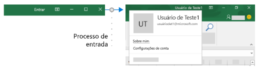
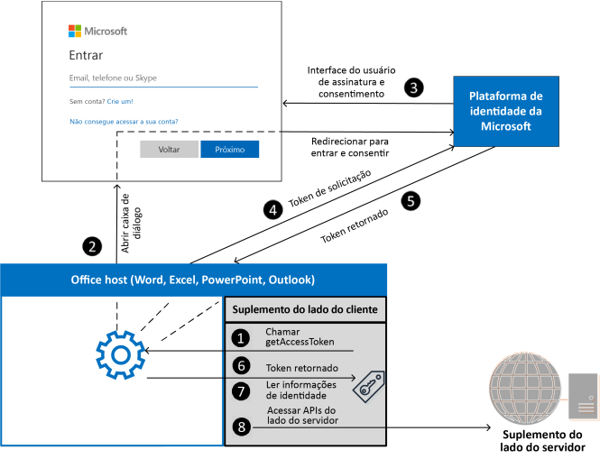

# <a name="enable-single-sign-on-sso-in-an-office-add-in"></a>Habilitar o login único (SSO) em um Suplemento do Office

Os usuários entram no Office (plataformas online, dispositivos móveis e área de trabalho) usando suas contas Microsoft pessoal, contas corporativas ou contas do Microsoft 365 Education. Aproveite isso e use o logon único (SSO) para autenticar e autorizar o usuário no seu suplemento sem exigir que ele entre uma segunda vez.



## <a name="how-sso-works-at-runtime"></a>Como o SSO funciona em tempo de execução

O diagrama a seguir mostra como funciona o processo de SSO. Os elementos azuis representam o Office ou a plataforma de identidade da Microsoft. Os elementos cinza representam o código que você escreve e incluem o código ao lado do cliente (painel de tarefas) e o código ao lado do servidor no seu suplemento.



1. No suplemento, seu código JavaScript chama a API do Office.js [getAccessToken](/javascript/api/office-runtime/officeruntime.auth#office-runtime-officeruntime-auth-getaccesstoken-member(1)). Se o usuário já estiver conectado ao Office, o host do Office retornará o token de acesso com as declarações do usuário conectado.
2. Se o usuário não estiver conectado, o aplicativo host do Office abrirá uma caixa de diálogo para o usuário entrar. O Office redireciona para a plataforma de identidade da Microsoft para concluir o processo de entrada.
3. Se essa for a primeira vez que o usuário atual usar o seu suplemento, será solicitado que ele consinta.
4. O aplicativo host do Office solicita o **token de acesso** da plataforma de identidade da Microsoft para o usuário atual.
5. O plataforma de identidade da Microsoft retorna o token de acesso ao Office. O Office armazenará o token no seu nome para que futuras chamadas do **getAccessToken** retornem ao token armazenado em cache.
6. O aplicativo host do Office retorna o **token de acesso** ao suplemento como parte do objeto de resultado retornado pela `getAccessToken` chamada.
7. O token é um **token de acesso** e um **token de identidade**. Você pode utilizá-lo como um token de identidade para analisar e examinar declarações sobre o usuário, como o nome e o endereço de email do usuário.
8. Opcionalmente, o suplemento pode usar o token como um **token de acesso** para fazer solicitações HTTPS autenticadas nas APIs ao lado do servidor. Como o token de acesso contém declarações de identidade, o servidor pode armazenar informações associadas à identidade do usuário; como as preferências do usuário.

## <a name="requirements-and-best-practices"></a>Requisitos e as práticas recomendadas

### <a name="dont-cache-the-access-token"></a>Não armazenar o token de acesso em cache

Nunca armazene em cache ou armazene o token de acesso no código ao lado do cliente. Sempre chame o [getAccessToken](/javascript/api/office-runtime/officeruntime.auth#office-runtime-officeruntime-auth-getaccesstoken-member(1)) quando precisar de um token de acesso. O Office armazenará em cache o token de acesso (ou solicitará um novo se ele tiver expirado). Isso ajudará a evitar o vazamento acidental do token do seu suplemento.

### <a name="enable-modern-authentication-for-outlook"></a>Habilitar a autenticação moderna do Outlook

Se você estiver trabalhando com um suplemento do **Outlook**, certifique-se de habilitar a Autenticação Moderna para a locação do Microsoft 365. Confira mais informações sobre como fazer isso em [Exchange Online: como habilitar seu locatário para autenticação moderna](https://social.technet.microsoft.com/wiki/contents/articles/32711.exchange-online-how-to-enable-your-tenant-for-modern-authentication.aspx).

### <a name="implement-a-fallback-authentication-system"></a>Implementar um sistema de autenticação de fallback

Você *não* deve confiar no SSO como único método do suplemento de autenticação. Devem implementar um sistema de autenticação alternativo que o suplemento possa se enquadrar em determinadas situações de erro. Por exemplo, se o seu suplemento for carregado em uma versão mais antiga do Office que não oferece suporte ao SSO, a `getAccessToken` chamada falhará.

Quanto aos suplementos do Excel, Word e PowerPoint, normalmente você vai querer voltar a usar a plataforma de identidade da Microsoft. Para obter mais informações, consulte [Autenticar com a plataforma de identidade da Microsoft](overview-authn-authz.md#authenticate-with-the-microsoft-identity-platform).

Quanto aos suplementos do Outlook, há um sistema de fallback recomendado. Para mais informações, confira [Cenário: implementar o logon único no serviço em um Suplemento do Outlook](../outlook/implement-sso-in-outlook-add-in.md).

Você também pode usar um sistema de tabelas e autenticação de usuário, ou pode aproveitar um dos provedores de login social. Para mais informações sobre como fazer isso com um Suplemento do Office, consulte [Autorizar serviços externos no Suplemento do Office](auth-external-add-ins.md).

Para obter exemplos de código que usam a plataforma de identidade da Microsoft como o sistema de fallback, consulte [Suplemento do Office NodeJS SSO](https://github.com/OfficeDev/PnP-OfficeAddins/tree/main/Samples/auth/Office-Add-in-NodeJS-SSO) e o suplemento do [Office ASP.NET SSO](https://github.com/OfficeDev/PnP-OfficeAddins/tree/main/Samples/auth/Office-Add-in-ASPNET-SSO).

## <a name="develop-an-sso-add-in"></a>Desenvolver um suplemento com SSO

Esta seção descreve as tarefas envolvidas na criação de um suplemento do Office que usa SSO. Essas tarefas são descritas aqui independentemente do idioma ou da estrutura. Para obter instruções passo a passo, consulte:

- [Criar um Suplemento do Office com Node.js que usa logon único](create-sso-office-add-ins-nodejs.md)
- [Criar um Suplemento do Office com ASP.NET que usa logon único](create-sso-office-add-ins-aspnet.md)

> [!NOTE]
> Você pode usar o gerador Yeoman para criar um Suplemento do Office com Node.js habilitado para SSO. O gerador Yeoman simplifica o processo de criação de um suplemento habilitado para SSO, automatizando as etapas necessárias para configurar o SSO no Azure e gerando o código necessário para um suplemento usar o SSO. Para obter mais informações, confira [Início rápido de logon único (SSO)](../quickstarts/sso-quickstart.md).

### <a name="register-your-add-in-with-the-microsoft-identity-platform"></a>Registre seu suplemento com o plataforma de identidade da Microsoft

Para trabalhar com o SSO, você precisa registrar seu complemento com a plataforma de identidade da Microsoft. Isso permitirá que a plataforma de identidade da Microsoft forneça serviços de autenticação e autorização ao seu suplemento. A criação do registro do aplicativo inclui as seguintes tarefas.

- Obter uma ID de aplicativo (cliente) para identificar seu suplemento na plataforma de identidade da Microsoft.
- Gere um segredo do cliente para atuar como uma senha para o seu suplemento ao solicitar um token.
- Especifique as permissões que seu suplemento exige. As permissões do Microsoft Graph "perfil" e "openid" são sempre necessárias. É possível que você precise de permissões adicionais, dependendo do que seu suplemento precisa fazer.
- Conceda a confiança dos aplicativos do Office ao suplemento.
- Autorize previamente os aplicativos do Office ao suplemento com o escopo padrão *access_as_user*.

Para obter mais detalhes sobre esse processo, consulte [Registrar um Suplemento do Office que usa o SSO com a plataforma de identidade da Microsoft](register-sso-add-in-aad-v2.md).

### <a name="configure-the-add-in"></a>Configurar o suplemento

Adicione novas marcações ao manifesto do suplemento.

- **WebApplicationInfo** – o pai dos seguintes elementos.
- **ID** - A ID do aplicativo (cliente) que você recebeu quando registrou a plataforma de identidade da Microsoft. Para obter mais informações, consulte [Registrar um Suplemento do Office que usa o SSO com a plataforma de identidade da Microsoft](register-sso-add-in-aad-v2.md).
- **Recurso** - O URI do suplemento. Esse é o mesmo URI (incluindo `api:` o protocolo) que você usou ao registrar o suplemento com a plataforma de identidade da Microsoft. A parte de domínio deste URI deve corresponder ao domínio, incluindo subdomínios usados nas URLs na `<Resources>` seção do manifesto do suplemento e o URI deve terminar com a ID do cliente especificada no `<Id>` elemento.
- **Scopes** – O pai de uma ou mais elementos **Scope**.
- **Escopo** - Especifica uma permissão que o suplemento precisa. As `profile` e `openID` permissões são sempre necessárias e podem ser as únicas permissões necessárias. Se o seu suplemento precisar de acesso ao Microsoft Graph ou outros recursos do Microsoft 365, você precisará de elementos **Escopo** adicionais. Por exemplo, para as permissões do Microsoft Graph você pode solicitar os escopos `User.Read` e `Mail.Read`. Bibliotecas que você usa no seu código para acessar o Microsoft Graph pode precisar de permissões adicionais. Para saber mais, confira [autorizar o Microsoft Graph de um suplemento do Office](authorize-to-microsoft-graph.md).

Quanto ao suplemento do Word, Excel e PowerPoint, adicione a marcação ao final da `<VersionOverrides ... xsi:type="VersionOverridesV1_0">` seção. Quanto aos suplementos do Outlook, adicione a marcação ao final da `<VersionOverrides ... xsi:type="VersionOverridesV1_1">` seção.

Veja a seguir um exemplo da marcação.

```xml
<WebApplicationInfo>
    <Id>5661fed9-f33d-4e95-b6cf-624a34a2f51d</Id>
    <Resource>api://addin.contoso.com/5661fed9-f33d-4e95-b6cf-624a34a2f51d</Resource>
    <Scopes>
        <Scope>openid</Scope>
        <Scope>user.read</Scope>
        <Scope>files.read</Scope>
        <Scope>profile</Scope>
    </Scopes>
</WebApplicationInfo>
```

> [!NOTE]
> Se você não seguir os requisitos de formato no manifesto do SSO, seu suplemento será rejeitado do AppSource até que ele atenda ao formato necessário.

### <a name="include-the-identity-api-requirement-set"></a>Inclua o conjunto de requisitos da API de identidade

Para usar o SSO, seu suplemento exige o conjunto de requisitos da API de identidade 1.3. Para obter mais informações, confira [IdentityAPI](../reference/requirement-sets/identity-api-requirement-sets.md).

### <a name="add-client-side-code"></a>Adicionar código do lado do cliente

Adicione o JavaScript ao suplemento para:

- Chamar [getAccessToken](/javascript/api/office-runtime/officeruntime.auth#office-runtime-officeruntime-auth-getaccesstoken-member(1)).
- Analisar o token de acesso ou encaminhá-lo ao código de servidor do suplemento.

O código a seguir mostra um exemplo simples de chamar `getAccessToken` e analisar o token no nome de usuário e outras credenciais.

> [!NOTE]
> Este exemplo lida explicitamente com apenas um tipo de erro. Para exemplos de tratamento de erro mais elaborados, confira [SSO com Suplemento NodeJS do Office](https://github.com/OfficeDev/Office-Add-in-samples/tree/main/Samples/auth/Office-Add-in-NodeJS-SSO) e [SSO com Suplemento ASP.NET do Office](https://github.com/OfficeDev/Office-Add-in-samples/tree/main/Samples/auth/Office-Add-in-ASPNET-SSO).

```js
async function getUserData() {
    try {
        let userTokenEncoded = await OfficeRuntime.auth.getAccessToken();
        let userToken = jwt_decode(userTokenEncoded); // Using the https://www.npmjs.com/package/jwt-decode library.
        console.log(userToken.name); // user name
        console.log(userToken.preferred_username); // email
        console.log(userToken.oid); // user id     
    }
    catch (exception) {
        if (exception.code === 13003) {
            // SSO is not supported for domain user accounts, only
            // Microsoft 365 Education or work account, or a Microsoft account.
        } else {
            // Handle error
        }
    }
}
```


#### <a name="when-to-call-getaccesstoken"></a>Quando chamar getAccessToken

Se o seu suplemento exigir um usuário conectado, você deverá ligar para `getAccessToken` do `Office.initialize`. Você também deve passar `allowSignInPrompt: true` no `options` parâmetro de `getAccessToken`. Por exemplo, `OfficeRuntime.auth.getAccessToken( { allowSignInPrompt: true });` isso garantirá que, se o usuário ainda não estiver conectado, o Office solicitará que o usuário entre na interface do usuário agora.

Se o suplemento tiver alguma funcionalidade que não exija um usuário assinado, você poderá chamar `getAccessToken` *quando o usuário tiver uma ação que exija um usuário assinado*. Não há degradação significativa de desempenho com as chamadas redundantes do `getAccessToken` porque o Office armazena em cache o token de acesso e o reusará até expirar, sem fazer outra chamada à [plataforma de identidade da Microsoft](/azure/active-directory/develop/)sempre que `getAccessToken` for chamado. Portanto, você pode adicionar chamadas de `getAccessToken` para todas as funções e manipuladores que iniciam uma ação onde o token é necessário.

> [!IMPORTANT]
> Como prática de segurança, sempre chame `getAccessToken` quando precisar de um token de acesso. O Office armazenará em cache para você. Não armazene ou armazene o token de acesso usando seu próprio código.

### <a name="pass-the-access-token-to-server-side-code"></a>Passe o token de acesso para o código ao lado do servidor

Se você precisar acessar as APIs da Web no seu servidor ou serviços adicionais, como o Microsoft Graph, você precisará passar o token de acesso no seu código ao lado do servidor. O token de acesso fornece acesso (para o usuário autenticado) às suas APIs da Web. Além disso, o código ao lado do servidor pode analisar o token para obter informações de identidade, se precisar dele. (Consulte **Usar o token de acesso como um token de identidade** abaixo.) Há muitas bibliotecas disponíveis para diferentes idiomas e plataformas que podem ajudar a simplificar o código que você escreve. Para obter mais informações, consulte [Visão geral da biblioteca de autenticação da Microsoft (MSAL)](/azure/active-directory/develop/msal-overview).

Se você precisar acessar os dados do Microsoft Graph, seu código ao lado do servidor deve fazer o seguinte:

- Validar o token de acesso (consulte **validar o token de acesso** abaixo).
- Inicie o [fluxo OAuth 2.0 On-Behalf-Of](/azure/active-directory/develop/v2-oauth2-on-behalf-of-flow) com uma chamada para a plataforma de identidade da Microsoft que inclui o token de acesso, alguns metadados do usuário e as credenciais do suplemento (sua ID e segredo). A plataforma de identidade da Microsoft retornará um novo token de acesso que pode ser usado para acessar o Microsoft Graph.
- Obter os dados do Microsoft Graph usando o novo token.
- Se você precisar armazenar em cache o novo token de acesso para várias chamadas, recomendamos usar a [Serialização do cache de token em MSAL.NET](/azure/active-directory/develop/msal-net-token-cache-serialization?tabs=aspnet).

> [!IMPORTANT]
> Como prática de segurança, sempre use o código ao lado do servidor para fazer chamadas pelo Microsoft Graph ou outras chamadas que exigem a passagem de um token de acesso. Nunca retorne o token OBO ao cliente para permitir que o cliente faça chamadas diretas ao Microsoft Graph. Isso ajuda a proteger o token de ser interceptado ou vazado. Para obter mais informações sobre o fluxo de protocolo adequado, consulte o [Diagrama de protocolo OAuth 2.0](/azure/active-directory/develop/v2-oauth2-on-behalf-of-flow#protocol-diagram)

O código a seguir mostra um exemplo de passagem do token de acesso para o lado do servidor. O token é passado em um `Authorization` cabeçalho ao enviar uma solicitação para uma API da Web do lado do servidor. Este exemplo envia dados JSON, portanto, ele usa o `POST`método, mas `GET`é suficiente para enviar o token de acesso quando você não estiver escrevendo no servidor.

```js
$.ajax({
    type: "POST",
    url: "/api/DoSomething",
    headers: {
        "Authorization": "Bearer " + accessToken
    },
    data: { /* some JSON payload */ },
    contentType: "application/json; charset=utf-8"
}).done(function (data) {
    // Handle success
}).fail(function (error) {
    // Handle error
}).always(function () {
    // Cleanup
});
```

Para saber mais sobre como obter acesso autorizado aos dados do usuário Microsoft Graph, confira [Autorizar o Microsoft Graph nos suplementos do Office](authorize-to-microsoft-graph.md).

#### <a name="validate-the-access-token"></a>Validar o token de acesso

As APIs da Web no seu servidor devem validar o token de acesso se ele for enviado do cliente. O token é um Token Web JSON (JWT) e isso significa que validação funciona como uma validação de token na maioria dos fluxos padrão do OAuth. Há diversas bibliotecas disponíveis que podem lidar com a validação de JWT. No entanto, as noções básicas incluem:

- Verificar se o token foi bem formado
- Verificar se o token foi emitido pela autoridade desejada
- Verificar se o token está direcionado para a API Web

Tenha em mente as diretrizes a seguir ao validar o token.

- Os tokens SSO válidos serão emitidos pela autoridade do Azure, `https://login.microsoftonline.com`. A declaração `iss` no token deve começar com esse valor.
- O parâmetro do `aud` token será definido como a ID do aplicativo do registro do aplicativo do Azure do suplemento.
- O parâmetro `scp` do token será definido como `access_as_user`.

Para obter mais informações sobre a validação do token, consulte [Tokens de acesso da plataforma de identidade da Microsoft](/azure/active-directory/develop/access-tokens#validating-tokens).

#### <a name="use-the-access-token-as-an-identity-token"></a>User o token de acesso como um token de identidade

Se o suplemento precisar verificar a identidade do usuário, o token de acesso retornado do `getAccessToken()` contém informações que podem ser usadas para estabelecer a identidade. As seguintes declarações no token estão relacionadas à identidade.

- `name` – O nome para exibição do usuário.
- `preferred_username`O endereço de email do usuário.
- `oid` - Um GUID que representa a ID do usuário no sistema de identidade da Microsoft.
- `tid` - Um GUID que representa o locatário no qual o usuário está entrando.

Para obter mais detalhes sobre essas e outras declarações, consulte [Tokens da ID da plataforma de identidade da Microsoft](/azure/active-directory/develop/id-tokens). Se você precisar construir uma ID exclusiva para representar o usuário no seu sistema, consulte [Usar as declarações para identificar um usuário de forma confiável](/azure/active-directory/develop/id-tokens#using-claims-to-reliably-identify-a-user-subject-and-object-id) para obter mais informações.

### <a name="example-access-token"></a>Token de acesso de exemplo

A seguir está uma carga decodificada típica do token de acesso. Para obter informações sobre as propriedades, consulte [Tokens de acesso da plataforma de identidade da Microsoft](/azure/active-directory/develop/active-directory-v2-tokens).

```js
{
    aud: "2c3caa80-93f9-425e-8b85-0745f50c0d24",
    iss: "https://login.microsoftonline.com/fec4f964-8bc9-4fac-b972-1c1da35adbcd/v2.0",
    iat: 1521143967,
    nbf: 1521143967,
    exp: 1521147867,
    aio: "ATQAy/8GAAAA0agfnU4DTJUlEqGLisMtBk5q6z+6DB+sgiRjB/Ni73q83y0B86yBHU/WFJnlMQJ8",
    azp: "e4590ed6-62b3-5102-beff-bad2292ab01c",
    azpacr: "0",
    e_exp: 262800,
    name: "Mila Nikolova",
    oid: "6467882c-fdfd-4354-a1ed-4e13f064be25",
    preferred_username: "milan@contoso.com",
    scp: "access_as_user",
    sub: "XkjgWjdmaZ-_xDmhgN1BMP2vL2YOfeVxfPT_o8GRWaw",
    tid: "fec4f964-8bc9-4fac-b972-1c1da35adbcd",
    uti: "MICAQyhrH02ov54bCtIDAA",
    ver: "2.0"
}
```

## <a name="using-sso-with-an-outlook-add-in"></a>Usando o SSO com um suplemento do Outlook

Há algumas diferenças pequenas, mas importantes entre usar o SSO em um suplemento do Outlook e em um suplemento do Excel, PowerPoint ou Word. Não deixe de ler [Autenticar o usuário com um token de logon único em um suplemento do Outlook](../outlook/authenticate-a-user-with-an-sso-token.md) e [Cenário: implementar o logon único ao serviço em um suplemento do Outlook](../outlook/implement-sso-in-outlook-add-in.md).

## <a name="see-also"></a>Confira também

- [Documentação da plataforma de identidade da Microsoft](/azure/active-directory/develop/)
- [Conjuntos de requisitos](specify-office-hosts-and-api-requirements.md)
- [IdentityAPI](../reference/requirement-sets/identity-api-requirement-sets.md)