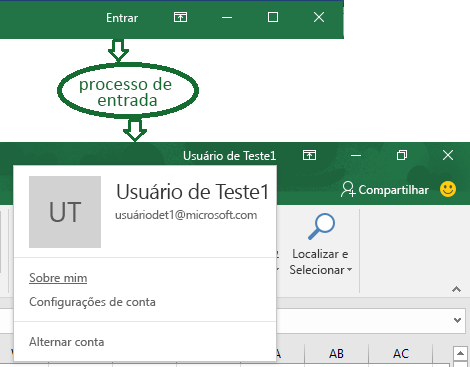
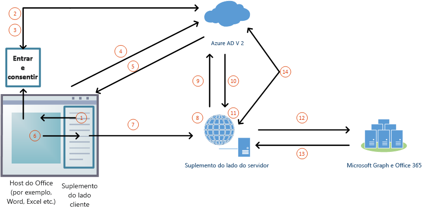

# <a name="enable-single-sign-on-for-office-add-ins-preview"></a>Habilitar o logon único para Suplementos do Office (visualização)

Os usuários entram no Office (online, em dispositivos móveis e plataformas desktop) usando tanto a conta pessoal deles da Microsoft, como a conta corporativa ou de estudante (Office 365). Você pode tirar proveito disso e usar o logon único (SSO) para autorizar usuário para suplemento, sem exigir que o usuário entre uma segunda vez.



### <a name="preview-status"></a>Status de visualização

A API de logon único tem suporte somente na visualização. Está disponível para os desenvolvedores para experimentação; mas não deve ser usado em um suplemento de produção. Além disso, os suplementos que usam o SSO não são aceitos no [AppSource](https://appsource.microsoft.com).

O SSO exige o Office 365 (a versão de assinatura do Office). Você deve usar o build e a versão mensal mais recente do canal Insiders. É necessário ingressar no programa Office Insider para obter essa versão. Para saber mais, confira a página [Seja um Office Insider](https://products.office.com/office-insider?tab=tab-1). Observe que, quando um build é promovido ao Canal Semestral de produção, o suporte para recursos de visualização, como o SSO, é desativado para esse build.

Nem todos os aplicativos do Office oferecem suporte a visualização de SSO. Está disponível no Word, Excel, Outlook e PowerPoint. Confira mais informações sobre os programas para os quais a API de logon único tem suporte no momento em [Conjuntos de requisitos da IdentityAPI](/office/dev/add-ins/reference/requirement-sets/identity-api-requirement-sets).

### <a name="requirements-and-best-practices"></a>Requisitos e as práticas recomendadas

> [!NOTE]
> [!INCLUDE [Information about using preview APIs](../includes/using-preview-apis.md)]

Se você estiver trabalhando com um suplemento do **Outlook**, certifique-se de habilitar a Autenticação Moderna para o locatário do Office 365. Confira mais informações sobre como fazer isso em [Exchange Online: como habilitar seu locatário para autenticação moderna](https://social.technet.microsoft.com/wiki/contents/articles/32711.exchange-online-how-to-enable-your-tenant-for-modern-authentication.aspx).

Você *não* deve confiar no SSO como único método do suplemento de autenticação. Devem implementar um sistema de autenticação alternativo que o suplemento possa se enquadrar em determinadas situações de erro. Você pode usar um sistema de autenticação e tabelas de usuário ou utilizar um dos provedores de logon de redes sociais. Para saber mais sobre como fazer isso com um suplemento do Office, confira [Autorizar serviços externos nos suplementos do Office](/office/dev/add-ins/develop/auth-external-add-ins). Para *Outlook*, há um sistema de retorno recomendado. Para mais informações, confira [Cenário: implementar o logon único no serviço em um Suplemento do Outlook](/outlook/add-ins/implement-sso-in-outlook-add-in).

### <a name="how-sso-works-at-runtime"></a>Como o SSO funciona em tempo de execução

O diagrama a seguir mostra como funciona o processo de SSO.



1. No suplemento, o JavaScript chama uma nova API Office.js [getAccessTokenAsync](#sso-api-reference). Isso informa ao aplicativo host do Office para obter um token de acesso para o suplemento. Confira [Token de acesso de amostra](#example-access-token).
2. Se o usuário não estiver conectado, o aplicativo host do Office abrirá uma janela pop-up para o usuário entrar.
3. Se essa é a primeira vez que o usuário atual usa seu suplemento, será solicitado que ele dê o consentimento.
4. O aplicativo host do Office solicita o **token do suplemento** do ponto de extremidade v 2.0 do Azure AD para o usuário atual. 
5. O Azure AD envia o token do suplemento ao aplicativo host do Office.
6. O aplicativo host do Office envia o **token do suplemento** ao suplemento como parte do objeto de resultado que retornou pela chamada de `getAccessTokenAsync`.
7. O JavaScript no suplemento pode analisar o token e extrair informações necessárias, como endereço de email do usuário.
8. Opcionalmente, o suplemento pode enviar solicitação HTTP para o servidor para obter mais dados sobre o usuário; como as preferências do usuário. Como alternativa, o próprio token de acesso pode ser enviado para o servidor para análise e validação.

## <a name="develop-an-sso-add-in"></a>Desenvolver um suplemento com SSO

Esta seção descreve as tarefas envolvidas na criação de um suplemento do Office que usa SSO. Essas tarefas descritas aqui apresentam uma linguagem e uma estrutura de forma agnóstica. Confira exemplos de explicações detalhadas em:

* [Criar um Suplemento do Office com Node.js que usa logon único](create-sso-office-add-ins-nodejs.md)
* [Criar um Suplemento do Office com ASP.NET que usa logon único](create-sso-office-add-ins-aspnet.md)

### <a name="create-the-service-application"></a>Criar o aplicativo de serviço

Registre o suplemento no portal de registro para o ponto de extremidade do Azure v 2.0. Esse é um processo que leva entre 5 e 10 minutos e inclui as seguintes tarefas:

* Obter um ID de cliente e o segredo para o suplemento.
* Especificar as permissões que seu suplemento precisa de AAD v. ponto de extremidade 2.0 (e, opcionalmente, para o Microsoft Graph). A permissão "perfil" sempre é necessária.
* Conceder a confiança do aplicativo host do Office para o suplemento.
* Autorizar previamente o aplicativo host do Office para o suplemento com a permissão padrão *access_as_user*.

Para mais detalhes sobre esse processo, confira [Registrar um Suplemento do Office que usa SSO com o ponto de extremidade do Azure AD v2.0](register-sso-add-in-aad-v2.md).

### <a name="configure-the-add-in"></a>Configurar o suplemento

Adicione novas marcações ao manifesto do suplemento:

* **WebApplicationInfo** – o pai dos seguintes elementos.
* **ID** - O ID do cliente do suplemento Este é um ID do aplicativo que você obtém como parte do registro do suplemento. Confira [Registrar um Suplemento do Office que usa SSO com o ponto de extremidade do Azure AD v2.0](register-sso-add-in-aad-v2.md).
* **Resource** – A URL do suplemento. Esse é o mesmo URI (incluindo o protocolo `api:`) que você usou ao registrar o suplemento no AAD. Parte de domínio deste URI deve coincidir com o domínio, incluindo qualquer subdomínio, que o usado nas URLs na seção `<Resources>` do manifesto do suplemento.
* **Scopes** – O pai de uma ou mais elementos **Scope**.
* **Scope** – Especifica uma permissão que seu suplemento precisa para o AAD. A permissão `profile` sempre é necessária, e pode ser a única permissão necessária, se o suplemento não acessar o Microsoft Graph. Se isso acontecer, você também precisa de elementos **Escopo** para as permissões necessárias do Microsoft Graph; por exemplo, `User.Read`, `Mail.Read`. Bibliotecas que você usa no seu código para acessar o Microsoft Graph pode precisar de permissões adicionais. Por exemplo, a biblioteca de autenticação da Microsoft (MSAL) para .NET requer a permissão `offline_access`. Para saber mais, confira [autorizar o Microsoft Graph de um suplemento do Office](authorize-to-microsoft-graph.md).

Para hosts do Office diferentes do Outlook, adicione a marcação no final da seção `<VersionOverrides ... xsi:type="VersionOverridesV1_0">`. Para o Outlook, adicione a marcação no final da seção `<VersionOverrides ... xsi:type="VersionOverridesV1_1">`.

Veja a seguir um exemplo da marcação:

```xml
<WebApplicationInfo>
    <Id>5661fed9-f33d-4e95-b6cf-624a34a2f51d</Id>
    <Resource>api://addin.contoso.com/5661fed9-f33d-4e95-b6cf-624a34a2f51d</Resource>
    <Scopes>
        <Scope>user.read</Scope>
        <Scope>files.read</Scope>
        <Scope>profile</Scope>
    </Scopes>
</WebApplicationInfo>
```

### <a name="add-client-side-code"></a>Adicionar código do lado do cliente

Adicione o JavaScript ao suplemento para:

* Ligue [getAccessTokenAsync](/office/dev/add-ins/develop/sso-in-office-add-ins#sso-api-reference).

* Analisar o token de acesso ou encaminhá-lo ao código de servidor do suplemento.

Aqui está um exemplo simples de uma chamada para `getAccessTokenAsync`.

> [!NOTE]
> Este exemplo lida explicitamente com apenas um tipo de erro. Exemplos de tratamento de erro mais elaborados, confira [Home.js Office – adicionar-em-ASPNET-SSO](https://github.com/OfficeDev/Office-Add-in-ASPNET-SSO/blob/master/Complete/Office-Add-in-ASPNET-SSO-WebAPI/Scripts/Home.js) e [program.js Office – adicionar-em-NodeJS-SSO](https://github.com/OfficeDev/Office-Add-in-NodeJS-SSO/blob/master/Completed/public/program.js). E veja [solucionar problemas de mensagens de erro no logon único (SSO)](troubleshoot-sso-in-office-add-ins.md).
 

```js
Office.context.auth.getAccessTokenAsync(function (result) {
    if (result.status === "succeeded") {
        // Use this token to call Web API
        var ssoToken = result.value;
        ...
    } else {
        if (result.error.code === 13003) {
            // SSO is not supported for domain user accounts, only
            // work or school (Office 365) or Microsoft Account IDs.
        } else {
            // Handle error
        }
    }
});
```

Aqui está um exemplo simples de como passar o token de suplemento para o lado do servidor. O token é incluído como um cabeçalho de `Authorization`ao enviar uma solicitação para o lado do servidor. Este exemplo prevê enviar dados JSON, para que ele tenha o método `POST`, mas `GET` é suficiente para enviar o token de acesso quando você não estiver escrevendo no servidor.

```js
$.ajax({
    type: "POST",
    url: "/api/DoSomething",
    headers: {
        "Authorization": "Bearer " + ssoToken
    },
    data: { /* some JSON payload */ },
    contentType: "application/json; charset=utf-8"
}).done(function (data) {
    // Handle success
}).fail(function (error) {
    // Handle error
}).always(function () {
    // Cleanup
});
```

#### <a name="when-to-call-the-method"></a>Quando chamar o método

Se o seu suplemento não puder ser usado quando nenhum usuário estiver logado no Office, então você deve chamar `getAccessTokenAsync` * quando o suplemento for iniciado *.

Se o complemento tiver alguma funcionalidade que não exija um usuário conectado, então chame `getAccessTokenAsync` * quando o usuário fizer uma ação que exija acesso a um usuário logado*. Não há uma degradação significativa do desempenho com chamadas redundantes de `getAccessTokenAsync` porque o Office armazena em cache o token de acesso e o reutilizará, até que ele expire, sem fazer outra chamada para o AAD V. Ponto de extremidade 2.0 sempre que `getAccessTokenAsync` for chamado. Portanto, você pode adicionar chamadas de `getAccessTokenAsync` para todas as funções e manipuladores que iniciam uma ação onde o token é necessário.

### <a name="add-server-side-code"></a>Adicionar código no lado do servidor

Na maioria dos cenários, não haverá muitas razões para obter o token de acesso, se o suplemento não o passar no lado do servidor e o utilizar lá. Algumas tarefas de servidor que o suplemento pode fazer:

* Criar um ou mais métodos de Web API com informações sobre o usuário que são extraídas do token; Por exemplo, uma forma que procura preferências do usuário em seu banco de dados hospedado. (Confira **usando o token SSO, como uma identidade** abaixo.)Dependendo do seu idioma e da estrutura, podem estar disponíveis bibliotecas que simplificarão o código que você precisa escrever.
* Obter dados do Microsoft Graph. O código do lado do servidor precisa fazer o seguinte:

    * Validar o token de acesso (consulte **validar o token de acesso** abaixo).
    * Iniciar o fluxo "on behalf of" com uma chamada para o ponto de extremidade v 2.0 do Azure AD que inclui o token de acesso, alguns metadados sobre o usuário e as credenciais do suplemento (sua ID e segredo). O token de acesso nesse contexto é chamado de bootstrap token.
    * Armazenar em cache o novo token de acesso que é retornado do fluxo em nome de.
    * Obter os dados do Microsoft Graph usando o novo token.

 Para saber mais sobre como obter acesso autorizado aos dados do usuário Microsoft Graph, confira [Autorizar o Microsoft Graph nos suplementos do Office](authorize-to-microsoft-graph.md).

#### <a name="validate-the-access-token"></a>Validar o token de acesso

Após a API Web receber o token de acesso, ela deve validá-lo antes que ele possa ser usado. O token é um Token Web JSON (JWT) e isso significa que validação funciona como uma validação de token na maioria dos fluxos padrão do OAuth. Há diversas bibliotecas disponíveis que podem lidar com a validação de JWT. No entanto, as noções básicas incluem:

- Verificar se o token foi bem formado
- Verificar se o token foi emitido pela autoridade desejada
- Verificar se o token está direcionado para a API Web

Ao validar o token, lembre-se das seguintes diretrizes:

- Os tokens SSO válidos serão emitidos pela autoridade do Azure, `https://login.microsoftonline.com`. A declaração `iss` no token deve começar com esse valor.
- O parâmetro `aud` do token será configurado como a ID de aplicativo do registro do suplemento.
- O parâmetro `scp` do token será definido como `access_as_user`.

#### <a name="using-the-sso-token-as-an-identity"></a>Usar o token SSO como uma identidade

Se o suplemento precisar verificar a identidade do usuário, o token SSO contém informações que podem ser usadas para estabelecer a identidade. As seguintes declarações no token estão relacionadas à identidade.

- `name` – O nome para exibição do usuário.
- `preferred_username`O endereço de email do usuário.
- `oid` – Um GUID que representa a ID do usuário no Azure Active Directory.
- `tid` – Um GUID que representa a ID da organização do usuário no Azure Active Directory.

Como os valores `name` e `preferred_username` podem alterar, recomendamos que os valores `oid` e `tid` sejam usados para correlacionar a identidade com o serviço de autorização do back-end.

Por exemplo, o serviço poderia formatar os valores em conjunto como `{oid-value}@{tid-value}` e armazená-los como um valor no registro do usuário no banco de dados do usuário interno. Em seguida, nas solicitações subsequentes, o usuário poderia ser recuperado usando o mesmo valor e o acesso a recursos específicos poderia ser determinado com base em seus mecanismos de controle de acesso existentes.

### <a name="example-access-token"></a>Token de acesso de exemplo

A seguir está uma carga decodificada típica do token de acesso. Para saber mais sobre as propriedades, confira [Referência de tokens de versão do Azure Active Directory 2.0](/azure/active-directory/develop/active-directory-v2-tokens).


```js
{
    aud: "2c3caa80-93f9-425e-8b85-0745f50c0d24",
    iss: "https://login.microsoftonline.com/fec4f964-8bc9-4fac-b972-1c1da35adbcd/v2.0",
    iat: 1521143967,
    nbf: 1521143967,
    exp: 1521147867,
    aio: "ATQAy/8GAAAA0agfnU4DTJUlEqGLisMtBk5q6z+6DB+sgiRjB/Ni73q83y0B86yBHU/WFJnlMQJ8",
    azp: "e4590ed6-62b3-5102-beff-bad2292ab01c",
    azpacr: "0",
    e_exp: 262800,
    name: "Mila Nikolova",
    oid: "6467882c-fdfd-4354-a1ed-4e13f064be25",
    preferred_username: "milan@contoso.com",
    scp: "access_as_user",
    sub: "XkjgWjdmaZ-_xDmhgN1BMP2vL2YOfeVxfPT_o8GRWaw",
    tid: "fec4f964-8bc9-4fac-b972-1c1da35adbcd",
    uti: "MICAQyhrH02ov54bCtIDAA",
    ver: "2.0"
}
```

## <a name="using-sso-with-an-outlook-add-in"></a>Usando o SSO com um suplemento do Outlook

Há algumas diferenças pequenas, mas importantes entre usar o SSO em um suplemento do Outlook e em um suplemento do Excel, PowerPoint ou Word. Não deixe de ler [Autenticar o usuário com um token de logon único em um suplemento do Outlook](/outlook/add-ins/authenticate-a-user-with-an-sso-token) e [Cenário: implementar o logon único ao serviço em um suplemento do Outlook](/outlook/add-ins/implement-sso-in-outlook-add-in).

## <a name="sso-api-reference"></a>Referência da API do SSO

### <a name="getaccesstokenasync"></a>getAccessTokenAsync

O namespace [Auth](/javascript/api/office/office.auth) do Office, `Office.context.auth`, fornece um método, `getAccessTokenAsync` que permite com que o host do Office obtenha um token de acesso para o aplicativo web do suplemento. Indiretamente, isso também habilita o suplemento para acessar os dados do Microsoft Graph do usuário sem exigir que o usuário se conecte uma segunda vez.

```typescript
getAccessTokenAsync(options?: AuthOptions, callback?: (result: AsyncResult<string>) => void): void;
```

O método chama o ponto de extremidade do Azure Active Directory V 2.0 para obter um token de acesso para o aplicativo Web do seu suplemento. Isso permite que os suplementos identifiquem usuários. O código do lado do servidor pode usar esse token para acessar o Microsoft Graph do aplicativo Web do suplemento usando o [fluxo OAuth "em nome de"](/azure/active-directory/develop/active-directory-v2-protocols-oauth-on-behalf-of).

> [!NOTE]
> No Outlook, não há suporte para esse API se o suplemento for carregado em uma caixa de correio do Gmail ou do Outlook.com.

|Hosts|Excel, OneNote, Outlook, PowerPoint, Word|
|---|---|
|[Conjuntos de requisitos](/office/dev/add-ins/develop/specify-office-hosts-and-api-requirements)|[IdentityAPI](/office/dev/add-ins/reference/requirement-sets/identity-api-requirement-sets)|

#### <a name="parameters"></a>Parâmetros

`options` – Opcional. Aceite um objeto [AuthOptions](/javascript/api/office/office.authoptions) (veja abaixo) para definir comportamentos de logon.

`callback` – Opcional. Aceita um método de retorno que possa analisar o token de ID de usuário ou usar o token fluxo "em nome de" para obter acesso ao Microsoft Graph. Se [AsyncResult](/javascript/api/office/office.asyncresult) `.status` é "bem-sucedido", em seguida, `AsyncResult.value` é o v AAD bruto. token de acesso 2.0 formatado.

A interface [AuthOptions](/javascript/api/office/office.authoptions) fornece opções para a experiência do usuário quando o Office obtém um token de acesso para o suplemento do AAD v. 2.0 com o método`getAccessTokenAsync`.
