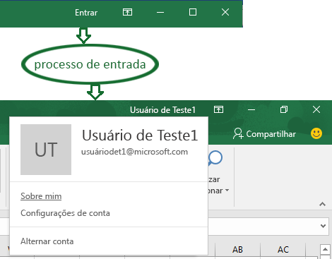
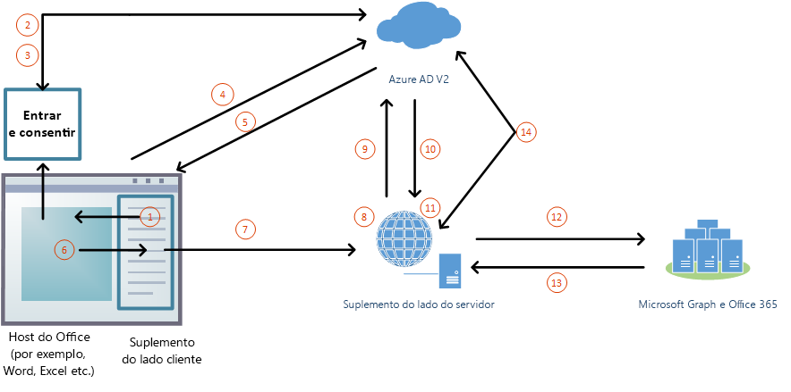

# <a name="enable-single-sign-on-for-office-add-ins"></a>Habilitar o logon único para Suplementos do Office

Os usuários entram no Office (online, em dispositivos móveis e plataformas desktop) usando tanto a conta pessoal deles da Microsoft, como a conta corporativa ou de estudante (Office 365). Você pode tirar proveito disso e usar o SSO para fazer o seguinte, sem exigir que o usuário entre uma segunda vez:

* Autorizar o usuário a fazer logon em seu suplemento.
* Autorizar o suplemento a acessar o [Microsoft Graph](https://developer.microsoft.com/graph/docs).



>**Observação:** A API de logon único tem suporte para Word, Excel e PowerPoint. Confira mais informações sobre os programas para os quais a API de logon único tem suporte no momento em [Conjuntos de requisitos da IdentityAPI](http://dev.office.com/reference/add-ins/requirement-sets/identity-api-requirement-sets).
> O logon único está no modo de visualização do Outlook. Se você estiver trabalhando com um suplemento do Outlook, certifique-se de habilitar a Autenticação Moderna para a locação do Office 365. Para obter informações sobre como fazer isso, consulte [Exchange Online: Como habilitar seu locatário para autenticação moderna](https://social.technet.microsoft.com/wiki/contents/articles/32711.exchange-online-how-to-enable-your-tenant-for-modern-authentication.aspx).

Para os usuários, o logon único torna a experiência de execução do suplemento mais fácil. Para os desenvolvedores, isso significa que o suplemento poderá autenticar os usuários e obter acesso autorizado aos dados deles por meio do Microsoft Graph com as credenciais que o usuário já tenha fornecido para o aplicativo do Office.

## <a name="sso-add-in-architecture"></a>Arquitetura do suplemento de SSO

Além de hospedar as páginas e o JavaScript do aplicativo web, o suplemento também deve hospedar, ao mesmo tempo o [nome de domínio totalmente qualificado](https://msdn.microsoft.com/en-us/library/windows/desktop/ms682135.aspx#_dns_fully_qualified_domain_name_fqdn__gly), uma ou mais APIs web que obterá um token de acesso ao Microsoft Graph e fará solicitações a ele.

O manifesto do suplemento contém a marcação que especifica como ele está registrado no ponto de extremidade v2.0 do Azure Active Directory (Azure AD) e especifica todas as permissões para o Microsoft Graph que o suplemento precisa.

### <a name="how-it-works-at-runtime"></a>Como ele funciona em tempo de execução

O diagrama a seguir mostra como funciona o processo de SSO.
<!-- Minor fixes to the text in the diagram - change V2 to v2.0, and change "(e.g. Word, Excel, etc.)" to "(for example, Word, Excel)". -->


1. No suplemento, o JavaScript chama uma nova API Office.js `getAccessTokenAsync`. Isso informa ao aplicativo host do Office para obter um token de acesso para o suplemento. (A partir daqui, chamaremos ele de **token do suplemento**).
1. Se o usuário não estiver conectado, o aplicativo host do Office abrirá uma janela pop-up para o usuário entrar.
1.  Se essa é a primeira vez que o usuário atual usa seu suplemento, será solicitado que ele dê o consentimento.
1. O aplicativo host do Office solicita o **token do suplemento** do ponto de extremidade v 2.0 do Azure AD para o usuário atual. 
1. O Azure AD envia o token do suplemento ao aplicativo host do Office.
1. O aplicativo host do Office envia o **token do suplemento** ao suplemento como parte do objeto de resultado que retornou pela chamada de `getAccessTokenAsync`.
1. O JavaScript no suplemento faz uma solicitação HTTP a uma API web que está hospedada no mesmo domínio totalmente qualificado que o suplemento e inclui o **token do suplemento** como prova de autorização.  
1. O código do lado do servidor valida o **token do suplemento** que chega.
1. O código do lado do servidor usa o fluxo "on behalf of" (em nome de) (definidos nos documentos [Exchange Token OAuth2](https://tools.ietf.org/html/draft-ietf-oauth-token-exchange-02) [Troca de Token do OAuth2] e [aplicativo para servidor ou daemon para um cenário com API web do Azure](https://docs.microsoft.com/en-us/azure/active-directory/develop/active-directory-authentication-scenarios#daemon-or-server-application-to-web-api)) para obter um token de acesso para o Microsoft Graph (a partir daqui chamado de **token do MSG**) em troca do token do suplemento.
1. O Azure AD retorna o **token do MSG** (e um token de atualização, se o suplemento solicitar a permissão *offline_access*) para ele próprio.
1. O código do lado do servidor armazena em cache o(s) **token(s) do MSG**.
1. O código do lado do servidor faz solicitações ao Microsoft Graph e inclui o **token do MSG**.
1. O Microsoft Graph retorna os dados para o suplemento, que pode transmiti-los à interface do usuário do suplemento.
1. Quando o token do MSG expira, o código do lado do servidor pode usar o token de atualização para obter um novo **token do MSG**.

## <a name="develop-an-sso-add-in"></a>Desenvolver um suplemento com SSO

Esta seção descreve as tarefas envolvidas na criação de um suplemento do Office que usa SSO. Essas tarefas descritas aqui apresentam uma linguagem e uma estrutura de forma agnóstica. Confira exemplos de explicações detalhadas em:

* [Criar um Suplemento do Office com Node.js que usa logon único](../../docs/develop/create-sso-office-add-ins-nodejs.md)
* [Criar um Suplemento do Office com ASP.NET que usa logon único](../../docs/develop/create-sso-office-add-ins-aspnet.md)

### <a name="create-the-service-application"></a>Criar o aplicativo de serviço

Registre o suplemento no portal de registro para o ponto de extremidade v 2.0 do Azure: https://apps.dev.microsoft.com. Esse é um processo que leva entre 5 e 10 minutos e inclui as seguintes tarefas:

* Obter uma ID de cliente e o segredo para o suplemento.
* Especificar as permissões que seu suplemento precisa para o Microsoft Graph.
* Conceder a confiança do aplicativo host do Office para o suplemento.
* Autorizar previamente o aplicativo host do Office para o suplemento com a permissão padrão *access_as_user*.

### <a name="configure-the-add-in"></a>Configurar o suplemento

Adicione novas marcações ao manifesto do suplemento:

* **WebApplicationInfo** - o pai dos seguintes elementos.
* **Id** - a ID de cliente do suplemento.
* **Resource** - A URL do suplemento.
* **Scopes** - O pai de uma ou mais elementos **Scope**.
* **Scope** - Especifica uma permissão que seu suplemento precisa para o Microsoft Graph. Por exemplo, `User.Read`, `Mail.Read` ou `offline_access`). Para saber mais, veja [Permissões do Microsoft Graph](https://developer.microsoft.com/en-us/graph/docs/concepts/permissions_reference).

Para hosts do Office diferentes do Outlook, adicione a marcação no final da seção `<VersionOverrides ... xsi:type="VersionOverridesV1_0">`. Para o Outlook, adicione a marcação no final da seção `<VersionOverrides ... xsi:type="VersionOverridesV1_1">`.

### <a name="add-client-side-code"></a>Adicionar código do lado do cliente

Adicione o JavaScript ao suplemento para:

* Chamar `Office.context.auth.getAccessTokenAsync(myTokenHandler)`.
* Crie um manipulador que transmite o token do suplemento ao código do suplemento no lado do servidor. Por exemplo:

```js
function mytokenHandler(asyncResult) {
    // Passes asyncResult.value (which has the add-in access token)
    // to the add-in’s web API as an Authorization header.
}
```

### <a name="when-to-call-the-method"></a>Quando chamar o método

Se o seu suplemento não puder ser usado quando nenhum usuário estiver logado no Office e o Office não possuir um token de acesso ao seu complemento, então você deve chamar `getAccessTokenAsync` * quando o suplemento for iniciado *.

Se o complemento tiver alguma funcionalidade que não exija acesso ao Microsoft Graph ou mesmo a um usuário conectado, então chame `getAccessTokenAsync` * quando o usuário fizer uma ação que exija acesso ao Microsoft Graph ou, pelo menos, a um usuário logado*. Não há uma degradação significativa do desempenho com chamadas redundantes de `getAccessTokenAsync` porque o Office armazena em cache o token de acesso e o reutilizará, até que ele expire, sem fazer outra chamada para o AAD V. Ponto de extremidade 2.0 sempre que `getAccessTokenAsync` for chamado. Portanto, você pode adicionar chamadas de `getAccessTokenAsync` para todas as funções e manipuladores que iniciam uma ação onde o token é necessário.

### <a name="add-server-side-code"></a>Adicionar código no lado do servidor

Crie um ou mais métodos de API Web que obtêm dados do Microsoft Graph. Dependendo do seu idioma e da estrutura, podem estar disponíveis bibliotecas que simplificarão o código que você precisa escrever. O código do lado do servidor precisa fazer o seguinte:

* Validar o token do suplemento que recebeu do manipulador de token que você criou anteriormente.
* Iniciar o fluxo "on behalf of" com uma chamada para o ponto de extremidade v 2.0 do Azure AD que inclui o token de acesso do suplemento, alguns metadados sobre o usuário e as credenciais do suplemento (sua ID e segredo).
* Armazenar em cache o token MSG que retornou.
* Obter os dados do Microsoft Graph usando o token do MSG.
