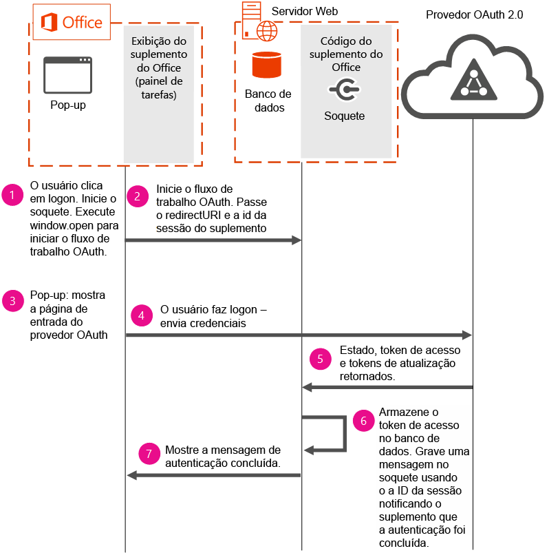

# <a name="use-the-oauth-authorization-framework-in-an-office-add-in"></a><span data-ttu-id="bc489-102">Usar a estrutura de autorização OAuth em um Suplemento do Office</span><span class="sxs-lookup"><span data-stu-id="bc489-102">Use the OAuth authorization framework in an Office Add-in</span></span>

<span data-ttu-id="bc489-p101">OAuth é o padrão aberto para autorização que provedores de serviço online como Office 365, Facebook, Google, SalesForce, LinkedIn e outros usam para executar a autenticação do usuário. A estrutura de autorização OAuth é o protocolo de autorização padrão usado no Azure e no Office 365. A estrutura de autorização OAuth é usada em cenários empresariais (corporativos) e de consumidor.</span><span class="sxs-lookup"><span data-stu-id="bc489-p101">OAuth is the open standard for authorization that online service providers such as Office 365, Facebook, Google, SalesForce, LinkedIn and others use to perform user authentication. The OAuth authorization framework is the default authorization protocol used in Azure and Office 365. The OAuth authorization framework is used in both enterprise (corporate) and consumer scenarios.</span></span>

<span data-ttu-id="bc489-p102">Os provedores de serviços online podem fornecer APIs públicas expostas via REST. Os desenvolvedores podem usar essas APIs públicas em suplementos do Office para ler ou gravar dados para o provedor de serviços online. A integração de dados de provedores de serviços online em um suplemento aumenta seu valor, o que leva a uma maior adoção pelos usuários. Ao usar essas APIs em seu suplemento, os usuários deverão fazer a autenticação usando a estrutura de autorização OAuth.</span><span class="sxs-lookup"><span data-stu-id="bc489-p102">Online service providers may provide public APIs exposed via REST. Developers can use these public APIs in their Office add-ins to read or write data to the online service provider. Integrating data from online service providers in an add-in increases its value, which leads to greater user adoption. When using these APIs in your add-in, users will be required to authenticate using the OAuth authorization framework.</span></span>

<span data-ttu-id="bc489-p103">Este tópico descreve como implementar um fluxo de autenticação no suplemento para executar a autenticação do usuário. Os segmentos de código incluídos neste tópico são obtidos do exemplo de código [Office-Add-in-NodeJS-ServerAuth](https://github.com/OfficeDev/Office-Add-in-NodeJS-ServerAuth).</span><span class="sxs-lookup"><span data-stu-id="bc489-p103">This topic describes how to implement an authentication flow in your add-in to perform user authentication. Code segments included in this topic are taken from the [Office-Add-in-NodeJS-ServerAuth](https://github.com/OfficeDev/Office-Add-in-NodeJS-ServerAuth) code sample.</span></span>

> [!NOTE]
> <span data-ttu-id="bc489-p104">Por motivos de segurança, os navegadores não têm permissão para exibir páginas de entrada em um IFrame. Dependendo da versão do Office que seus clientes usam, principalmente versões baseadas na Web, o suplemento é exibido em um IFrame. Isso impõe algumas considerações sobre como gerenciar o fluxo de autenticação.</span><span class="sxs-lookup"><span data-stu-id="bc489-p104">For security reasons, browsers are not allowed to display sign-in pages in an IFrame. Depending on the version of Office that your customers use, most notably web-based versions, your add-in is displayed in an IFrame. This imposes some considerations on how to manage the authentication flow.</span></span> 

<span data-ttu-id="bc489-115">O diagrama a seguir mostra os componentes necessários e o fluxo de eventos que ocorrem durante a implementação da autenticação no suplemento.</span><span class="sxs-lookup"><span data-stu-id="bc489-115">The following diagram shows the required components and the flow of events that occur when implementing authentication in your add-in.</span></span>



<span data-ttu-id="bc489-117">O diagrama mostra como os seguintes componentes necessários são usados:</span><span class="sxs-lookup"><span data-stu-id="bc489-117">The diagram shows how the following required components are used:</span></span>


- <span data-ttu-id="bc489-p105">O Office executa um suplemento de painel de tarefas no computador do usuário. O suplemento abre uma janela pop-up para iniciar o fluxo de autenticação. Os suplementos não podem iniciar fluxos de autenticação diretamente porque, dependendo da plataforma usada, os suplementos podem ser executados em um IFRAME. Por motivos de segurança, páginas de entrada OAuth não podem ser exibidas em um IFRAME.</span><span class="sxs-lookup"><span data-stu-id="bc489-p105">Office runs a task pane add-in on the user's computer. Your add-in opens a pop-up window to start the authentication flow. Add-ins cannot start authentication flows directly because add-ins, depending on the platform used, may run in an IFRAME. For security reasons, OAuth sign-in pages can't be displayed in an IFRAME.</span></span> 
    
- <span data-ttu-id="bc489-p106">Um servidor Web hospeda o código do suplemento. Este exemplo de código usa um servidor de banco de dados em execução no servidor Web para armazenar o token de acesso do usuário. É necessário persistir o token de acesso para que, depois que a autenticação for concluída usando a janela pop-up, as páginas do suplemento principal possam usar os mesmos tokens para acessar dados do serviço online. É necessário salvar os tokens usando opções no servidor porque você não pode depender de informações passadas do suplemento ou do pop-up.</span><span class="sxs-lookup"><span data-stu-id="bc489-p106">A web server hosts your add-in's code. This code sample uses a database server running on the web server to store the user's access token. Persisting the access token is necessary so that after authentication completes using the pop-up window, the main add-in's pages can use the same tokens to access data from the online service. Saving the tokens by using server-side options is necessary because you can't rely on information passed from the add-in or the pop-up.</span></span>
    
- <span data-ttu-id="bc489-126">O provedor OAuth 2.0 executa a autenticação do usuário.</span><span class="sxs-lookup"><span data-stu-id="bc489-126">The OAuth 2.0 provider performs user authentication.</span></span>
    

    
> [!IMPORTANT]
> <span data-ttu-id="bc489-p107">Os tokens de acesso não podem ser retornados ao painel de tarefas, mas podem ser usados no servidor. Neste exemplo de código, os tokens de acesso são armazenados no banco de dados por dois minutos. Após dois minutos, os tokens são limpos do banco de dados e os usuários são solicitados a realizar a autenticação novamente. Antes de alterar esse período de tempo em sua própria implementação, considere os riscos de segurança associados ao armazenamento de tokens de acesso em um banco de dados por um período de tempo de mais de dois minutos.</span><span class="sxs-lookup"><span data-stu-id="bc489-p107">Access tokens can't be returned to the task pane, but they can be used on the server. In this code sample, the access tokens are stored in the database for 2 minutes. After 2 minutes, tokens are purged from the database and users are prompted to re-authenticate. Before changing this time period in your own implementation, consider the security risks associated with storing access tokens in a database for a time period that is longer than 2 minutes.</span></span>


## <a name="step-1---start-socket-and-open-a-pop-up-window"></a><span data-ttu-id="bc489-131">Etapa 1: iniciar o soquete e abrir uma janela pop-up</span><span class="sxs-lookup"><span data-stu-id="bc489-131">Step 1 - Start socket and open a pop-up window</span></span>

<span data-ttu-id="bc489-p108">Quando você executa este código de exemplo, um suplemento de painel de tarefas é exibido no Office. Quando o usuário escolhe um provedor OAuth no qual fazer logon, primeiro o suplemento cria um soquete. Este exemplo usa um soquete para fornecer uma boa experiência do usuário no suplemento. O suplemento usa o soquete para comunicar o sucesso ou a falha da autenticação ao usuário. Com o uso de um soquete, a página principal do suplemento é facilmente atualizada com o status de autenticação e não requer interação com o usuário nem sondagem. O segmento de código a seguir, obtido de routes/connect.js, mostra como iniciar o soquete. O soquete é nomeado usando **decodedNodeCookie**, que é a ID de sessão do suplemento Este exemplo de código cria o soquete usando [socket.io](http://socket.io/).</span><span class="sxs-lookup"><span data-stu-id="bc489-p108">When you run this code sample, a task pane add-in displays in Office. When the user chooses an OAuth provider to log into, the add-in first creates a socket. This sample uses a socket to provide a good user experience in the add-in. The add-in uses the socket to communicate the success or failure of the authentication to the user. By using a socket, the add-in's main page is easily updated with the authentication status, and doesn't require user interaction or polling. The following code segment, taken from routes/connect.js, shows how to start the socket. The socket is named using  **decodedNodeCookie**, which is the add-in's session ID. This code sample creates the socket by using [socket.io](http://socket.io/).</span></span>


```js
io.on('connection', function (socket) {
  console.log('Socket connection established');
  var jsonCookie =
    cookie.parse(socket
      .handshake
      .headers
      .cookie);
  var decodedNodeCookie =
    cookieParser
      .signedCookie(jsonCookie.nodecookie, '<Insert a random string>');
  console.log('Decoded cookie: ' + decodedNodeCookie);
  // The session ID becomes the room name for this session.
  socket.join(decodedNodeCookie);
  io.to(decodedNodeCookie).emit('init', 'Private socket session established');
});

```

<span data-ttu-id="bc489-p109">Em seguida, o suplemento se conecta ao soquete. O código a seguir pode ser encontrado em /public/javascripts/client.js.</span><span class="sxs-lookup"><span data-stu-id="bc489-p109">Next, the add-in connects to the socket. The following code can be found in /public/javascripts/client.js.</span></span>


```js
var socket = io.connect('https://localhost:3001', { secure: true });
```

<span data-ttu-id="bc489-p110">Em seguida, o suplemento abre uma janela pop-up no computador do usuário usando **window.open**. Ao executar **window.open**, verifique se o URI de redirecionamento e a ID de sessão do suplemento são passados na URL. A ID de sessão do suplemento é usada para identificar o soquete a ser usado ao enviar informações de status de autenticação à interface do usuário do suplemento. O segmento de código a seguir pode ser encontrado em views/index.jade.</span><span class="sxs-lookup"><span data-stu-id="bc489-p110">Next, the add-in opens a pop-up window on the user's computer using  **window.open**. When running  **window.open**, ensure the redirect URI and session ID of the add-in is passed in the URL. The session ID of the add-in is used to identify the socket to use when sending authentication status information to the add-in's UI. The following code segment can be found in views/index.jade.</span></span>


```js
onclick="window.open('/connect/azure/#{sessionID}', 'AuthPopup', 'width=500,height=500,centerscreen=1,menubar=0,toolbar=0,location=0,personalbar=0,status=0,titlebar=0,dialog=1')")
```


## <a name="steps-2-amp-3---start-the-authentication-flow-and-show-the-sign-in-page"></a><span data-ttu-id="bc489-146">Etapas 2 &amp; 3: iniciar o fluxo de autenticação e mostrar a página de entrada</span><span class="sxs-lookup"><span data-stu-id="bc489-146">Steps 2 &amp; 3 - Start the authentication flow and show the sign-in page</span></span>

<span data-ttu-id="bc489-p111">O suplemento deve iniciar o fluxo de autenticação. O segmento de código abaixo usa a biblioteca Passport OAuth. Ao iniciar o fluxo de autenticação, passe a URL de autorização do provedor OAuth e a ID de sessão do suplemento. A ID de sessão do suplemento deve ser passada no parâmetro de estado. Agora a janela pop-up exibe a página de entrada do provedor OAuth para que os usuários possam entrar.</span><span class="sxs-lookup"><span data-stu-id="bc489-p111">The add-in must start the authentication flow. The code segment below uses the Passport OAuth library. When starting the authentication flow, ensure that you pass the authorization URL of the OAuth provider, and the session ID of the add-in. The session ID of the add-in must be passed in the state parameter. The pop-up window now displays the OAuth provider's sign-in page so that users can sign in.</span></span>


```js
router.get('/azure/:sessionID', function(req, res, next) { 
   passport.authenticate( 
     'azure',  
     { state: req.params.sessionID }, 

```


## <a name="steps-4-5-amp-6---user-signs-in-and-web-server-receives-tokens"></a><span data-ttu-id="bc489-152">Etapas 4, 5 &amp; 6: o usuário entra e o servidor Web recebe tokens</span><span class="sxs-lookup"><span data-stu-id="bc489-152">Steps 4, 5 &amp; 6 - User signs in and web server receives tokens</span></span>

 <span data-ttu-id="bc489-p112">Após uma entrada bem-sucedida, um token de acesso, um token de atualização e um parâmetro de estado são retornados para o suplemento. O parâmetro de estado contém a ID de sessão, que é usada para enviar informações de status de autenticação ao soquete na etapa 7. O segmento de código a seguir, obtido de app.js, armazena o token de acesso no banco de dados.</span><span class="sxs-lookup"><span data-stu-id="bc489-p112">After a successful sign-in, an access token, refresh token, and state parameter are returned to the add-in. The state parameter contains the session ID, which is used to send authentication status information to the socket in step 7. The following code segment, taken from app.js, stores the access token in the database.</span></span>


```js
  dbHelperInstance.insertDoc(userData, null, 
         function (err, body) { 
           if (!err) { 
             console.log("Inserted session entry [" + userData.sessid + "] id: " + body.id); 
           } 
           done(err, userData); 
         }); 

```


## <a name="step-7---show-authentication-information-in-the-add-ins-ui"></a><span data-ttu-id="bc489-156">Etapa 7: mostrar informações de autenticação na interface do usuário do suplemento</span><span class="sxs-lookup"><span data-stu-id="bc489-156">Step 7 - Show authentication information in the add-in's UI</span></span>

<span data-ttu-id="bc489-p113">O segmento de código a seguir, obtido de connect.js, atualiza interface do usuário do suplemento com as informações de status de autenticação. A interface do usuário do suplemento é atualizada usando o soquete que foi criado na etapa 1.</span><span class="sxs-lookup"><span data-stu-id="bc489-p113">The following code segment, taken from connect.js, updates the add-in's UI with the authentication status information. The add-in's UI is updated by using the socket that was created in step 1.</span></span>


```js
  
       io.to(user.sessid).emit('auth_success', providers); 
       next(); 

```


## <a name="see-also"></a><span data-ttu-id="bc489-159">Veja também</span><span class="sxs-lookup"><span data-stu-id="bc489-159">See also</span></span>

- [<span data-ttu-id="bc489-160">Exemplo de Autenticação do Servidor de Suplemento do Office para Node.js</span><span class="sxs-lookup"><span data-stu-id="bc489-160">Office Add-in Server Authentication Sample for Node.js</span></span>](https://github.com/OfficeDev/Office-Add-in-Nodejs-ServerAuth/blob/master/README.md)
    
