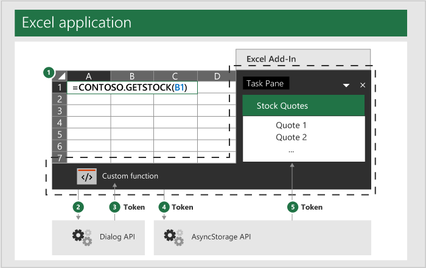

# <a name="authentication-for-custom-functions"></a><span data-ttu-id="939e9-103">Autenticação para funções personalizadas</span><span class="sxs-lookup"><span data-stu-id="939e9-103">Authentication for custom functions</span></span>

<span data-ttu-id="939e9-104">Em alguns cenários, sua função personalizada precisará autenticar o usuário para acessar recursos protegidos.</span><span class="sxs-lookup"><span data-stu-id="939e9-104">In some scenarios your custom function will need to authenticate the user in order to access protected resources.</span></span> <span data-ttu-id="939e9-105">Embora as funções personalizadas não exijam um método específico de autenticação, você deve estar ciente de que as funções personalizadas são executadas em um tempo de execução separado no painel de tarefas e em outros elementos da interface do usuário do seu suplemento.</span><span class="sxs-lookup"><span data-stu-id="939e9-105">While custom functions don't require a specific method of authentication, you should be aware that custom functions run in a separate runtime from the task pane and other UI elements of your add-in.</span></span> <span data-ttu-id="939e9-106">Por causa disso, você precisará passar dados alternando entre os dois tempos de execução usando o objeto `OfficeRuntime.storage` e a API de Caixa de Diálogo.</span><span class="sxs-lookup"><span data-stu-id="939e9-106">Because of this, you'll need to pass data back and forth between the two runtimes using the `OfficeRuntime.storage` object and the Dialog API.</span></span>

[!include[Excel custom functions note](../includes/excel-custom-functions-note.md)]

## <a name="officeruntimestorage-object"></a><span data-ttu-id="939e9-107">Objeto OfficeRuntime.storage</span><span class="sxs-lookup"><span data-stu-id="939e9-107">OfficeRuntime.storage object</span></span>

<span data-ttu-id="939e9-108">O tempo de execução de funções personalizadas não tem um objeto `localStorage` disponível na janela global, onde você normalmente pode armazenar dados.</span><span class="sxs-lookup"><span data-stu-id="939e9-108">The custom functions runtime doesn't have a `localStorage` object available on the global window, where you might typically store data.</span></span> <span data-ttu-id="939e9-109">Em vez disso, você deve compartilhar dados entre funções personalizadas e painéis de tarefas usando o [OfficeRuntime.storage](/javascript/api/office-runtime/officeruntime.storage) para definir e obter dados.</span><span class="sxs-lookup"><span data-stu-id="939e9-109">Instead, you should share data between custom functions and task panes by using [OfficeRuntime.storage](/javascript/api/office-runtime/officeruntime.storage) to set and get data.</span></span>

<span data-ttu-id="939e9-110">Além disso, há um benefício em usar o objeto `storage`; Ele usa um ambiente de sandbox seguro para que seus dados não possam ser acessados por outros suplementos.</span><span class="sxs-lookup"><span data-stu-id="939e9-110">Additionally, there is a benefit to using the `storage` object; it uses a secure sandbox environment so that your data cannot be accessed by other add-ins.</span></span>

### <a name="suggested-usage"></a><span data-ttu-id="939e9-111">Uso sugerido</span><span class="sxs-lookup"><span data-stu-id="939e9-111">Suggested usage</span></span>

<span data-ttu-id="939e9-112">Quando você precisar autenticar a partir do painel de tarefas ou de uma função personalizada, verifique `storage` para ver se o token de acesso já foi adquirido.</span><span class="sxs-lookup"><span data-stu-id="939e9-112">When you need to authenticate either from the task pane or a custom function, check `storage` to see if the access token was already acquired.</span></span> <span data-ttu-id="939e9-113">Caso contrário, use a API de caixa de diálogo para autenticar o usuário, recuperar o token de acesso e, em seguida, armazenar o token em `storage` para uso futuro.</span><span class="sxs-lookup"><span data-stu-id="939e9-113">If not, use the dialog API to authenticate the user, retrieve the access token, and then store the token in `storage` for future use.</span></span>

## <a name="dialog-api"></a><span data-ttu-id="939e9-114">API de Caixa de Diálogo</span><span class="sxs-lookup"><span data-stu-id="939e9-114">Dialog API</span></span>

<span data-ttu-id="939e9-115">Se um token não existir, você deverá usar a API de diálogo para solicitar que o usuário faça logon.</span><span class="sxs-lookup"><span data-stu-id="939e9-115">If a token doesn't exist, you should use the Dialog API to ask the user to sign in.</span></span> <span data-ttu-id="939e9-116">Depois que um usuário insere suas credenciais, o token de acesso resultante pode ser armazenado em `storage`.</span><span class="sxs-lookup"><span data-stu-id="939e9-116">After a user enters their credentials, the resulting access token can be stored in `storage`.</span></span>

> [!NOTE]
> <span data-ttu-id="939e9-117">O tempo de execução de funções personalizadas usa um objeto Dialog que é um pouco diferente do objeto Dialog no tempo de execução do mecanismo do navegador usado pelos painéis de tarefas.</span><span class="sxs-lookup"><span data-stu-id="939e9-117">The custom functions runtime uses a Dialog object that is slightly different from the Dialog object in the browser engine runtime used by task panes.</span></span> <span data-ttu-id="939e9-118">Ambos são chamados de "API de Caixa de Diálogo", mas usam `OfficeRuntime.Dialog` para autenticar usuários no tempo de execução de funções personalizadas.</span><span class="sxs-lookup"><span data-stu-id="939e9-118">They're both referred to as the "Dialog API", but use `OfficeRuntime.Dialog` to authenticate users in the custom functions runtime.</span></span>

<span data-ttu-id="939e9-119">Para obter informações sobre como usar o objeto `Dialog`, consulte a [Caixa de Diálogo Funções Personalizadas](/office/dev/add-ins/excel/custom-functions-dialog).</span><span class="sxs-lookup"><span data-stu-id="939e9-119">For information on how to use the `Dialog` object, see [Custom Functions dialog](/office/dev/add-ins/excel/custom-functions-dialog).</span></span>

<span data-ttu-id="939e9-120">Ao visualizar o processo de autenticação como um todo, pode ser útil pensar no painel de tarefas e nos elementos de IU de seu suplemento, bem como pensar nas funções personalizadas de seu complemento como entidades separadas que podem se comunicar entre si por meio de `OfficeRuntime.storage`.</span><span class="sxs-lookup"><span data-stu-id="939e9-120">When envisioning the entire authentication process as a whole, it might be helpful to think of the task pane and UI elements of your add-in and the custom functions part of your add-in as separate entities which can communicate with each other through `OfficeRuntime.storage`.</span></span>

<span data-ttu-id="939e9-121">O diagrama a seguir descreve esse processo básico.</span><span class="sxs-lookup"><span data-stu-id="939e9-121">The following diagram outlines this basic process.</span></span> <span data-ttu-id="939e9-122">Observe que a linha pontilhada indica que, embora executem ações separadas, as funções personalizadas e o painel de tarefas do seu suplemento fazem parte do seu suplemento como um todo.</span><span class="sxs-lookup"><span data-stu-id="939e9-122">Note that the dotted line indicates that while they perform separate actions, custom functions and your add-in's task pane are both part of your add-in as a whole.</span></span>

1. <span data-ttu-id="939e9-123">As chamadas de função personalizada de uma célula são emitdas por você em uma pasta de trabalho do Excel.</span><span class="sxs-lookup"><span data-stu-id="939e9-123">You issue a custom function call from a cell in an Excel workbook.</span></span>
2. <span data-ttu-id="939e9-124">A função personalizada usa `Dialog` para passar suas credenciais de usuário para um site.</span><span class="sxs-lookup"><span data-stu-id="939e9-124">The custom function uses `Dialog` to pass your user credentials to a website.</span></span>
3. <span data-ttu-id="939e9-125">Esse site, em seguida, retorna um token de acesso para a função personalizada.</span><span class="sxs-lookup"><span data-stu-id="939e9-125">This website then returns an access token to the custom function.</span></span>
4. <span data-ttu-id="939e9-126">Sua função personalizada, em seguida, define esse token de acesso para `storage`.</span><span class="sxs-lookup"><span data-stu-id="939e9-126">Your custom function then sets this access token to the `storage`.</span></span>
5. <span data-ttu-id="939e9-127">O painel de tarefas do seu suplemento acessa o token a partir de `storage`.</span><span class="sxs-lookup"><span data-stu-id="939e9-127">Your add-in's task pane accesses the token from `storage`.</span></span>

<span data-ttu-id="939e9-128"></span><span class="sxs-lookup"><span data-stu-id="939e9-128"></span></span>

## <a name="storing-the-token"></a><span data-ttu-id="939e9-129">Armazenando o token</span><span class="sxs-lookup"><span data-stu-id="939e9-129">Storing the token</span></span>

<span data-ttu-id="939e9-130">Os exemplos a seguir são do exemplo de código [Usando OfficeRuntime.storage em funções personalizadas](https://github.com/OfficeDev/PnP-OfficeAddins/tree/master/Excel-custom-functions/AsyncStorage).</span><span class="sxs-lookup"><span data-stu-id="939e9-130">The following examples are from the [Using OfficeRuntime.storage in custom functions](https://github.com/OfficeDev/PnP-OfficeAddins/tree/master/Excel-custom-functions/AsyncStorage) code sample.</span></span> <span data-ttu-id="939e9-131">Consulte este exemplo de código para obter um exemplo completo de compartilhamento de dados entre funções personalizadas e o painel de tarefas.</span><span class="sxs-lookup"><span data-stu-id="939e9-131">Refer to this code sample for a complete example of sharing data between custom functions and the task pane.</span></span>

<span data-ttu-id="939e9-132">Se a função personalizada for autenticada, ela receberá o token de acesso e precisará armazená-lo em `storage`.</span><span class="sxs-lookup"><span data-stu-id="939e9-132">If the custom function authenticates, then it receives the access token and will need to store it in `storage`.</span></span> <span data-ttu-id="939e9-133">O exemplo de código a seguir mostra como chamar o método `storage.setItem` para armazenar um valor.</span><span class="sxs-lookup"><span data-stu-id="939e9-133">The following code sample shows how to call the `storage.setItem` method to store a value.</span></span> <span data-ttu-id="939e9-134">A função `storeValue` é uma função personalizada que, para fins de exemplo, armazena um valor do usuário.</span><span class="sxs-lookup"><span data-stu-id="939e9-134">The `storeValue` function is a custom function that for example purposes stores a value from the user.</span></span> <span data-ttu-id="939e9-135">Você pode modificá-la para que seja armazenado qualquer valor de token que você precise.</span><span class="sxs-lookup"><span data-stu-id="939e9-135">You can modify this to store any token value you need.</span></span>

```js
/**
 * Stores a key-value pair into OfficeRuntime.storage.
 * @customfunction
 * @param {string} key Key of item to put into storage.
 * @param {*} value Value of item to put into storage.
 */
function storeValue(key, value) {
  return OfficeRuntime.storage.setItem(key, value).then(function (result) {
      return "Success: Item with key '" + key + "' saved to storage.";
  }, function (error) {
      return "Error: Unable to save item with key '" + key + "' to storage. " + error;
  });
}
```

<span data-ttu-id="939e9-136">Quando o painel de tarefas precisa do token de acesso, ele pode recuperar o token de `storage`.</span><span class="sxs-lookup"><span data-stu-id="939e9-136">When the task pane needs the access token, it can retrieve the token from `storage`.</span></span> <span data-ttu-id="939e9-137">O exemplo de código a seguir mostra como usar o método `storage.getItem` para recuperar o token.</span><span class="sxs-lookup"><span data-stu-id="939e9-137">The following code sample shows how to use the `storage.getItem` method to retrieve the token.</span></span>

```js
/**
 * Read a token from storage.
 * @customfunction GETTOKEN
 */
function receiveTokenFromCustomFunction() {
  var key = "token";
  var tokenSendStatus = document.getElementById('tokenSendStatus');
  OfficeRuntime.storage.getItem(key).then(function (result) {
     tokenSendStatus.value = "Success: Item with key '" + key + "' read from storage.";
     document.getElementById('tokenTextBox2').value = result;
  }, function (error) {
     tokenSendStatus.value = "Error: Unable to read item with key '" + key + "' from storage. " + error;
  });
}
```

## <a name="general-guidance"></a><span data-ttu-id="939e9-138">Orientação geral</span><span class="sxs-lookup"><span data-stu-id="939e9-138">General guidance</span></span>

<span data-ttu-id="939e9-139">Os Suplementos do Office são baseados na Web e você pode usar qualquer técnica de autenticação da Web.</span><span class="sxs-lookup"><span data-stu-id="939e9-139">Office Add-ins are web-based and you can use any web authentication technique.</span></span> <span data-ttu-id="939e9-140">Não há um padrão ou método específico que você deva seguir para implementar sua própria autenticação com funções personalizadas.</span><span class="sxs-lookup"><span data-stu-id="939e9-140">There is no particular pattern or method you must follow to implement your own authentication with custom functions.</span></span> <span data-ttu-id="939e9-141">Você pode querer consultar a documentação sobre vários padrões de autenticação, começando com [este artigo sobre a autorização por serviços externos](/office/dev/add-ins/develop/auth-external-add-ins).</span><span class="sxs-lookup"><span data-stu-id="939e9-141">You may wish to consult the documentation about various authentication patterns, starting with [this article about authorizing via external services](/office/dev/add-ins/develop/auth-external-add-ins).</span></span>  

<span data-ttu-id="939e9-142">Evite usar os seguintes locais para armazenar dados ao desenvolver funções personalizadas:</span><span class="sxs-lookup"><span data-stu-id="939e9-142">Avoid using the following locations to store data when developing custom functions:</span></span>  

- <span data-ttu-id="939e9-143">`localStorage`: Funções personalizadas não têm acesso ao objeto global `window` e, portanto, não têm acesso aos dados armazenados em `localStorage`.</span><span class="sxs-lookup"><span data-stu-id="939e9-143">`localStorage`: Custom functions do not have access to the global `window` object and therefore have no access to data stored in `localStorage`.</span></span>
- <span data-ttu-id="939e9-144">`Office.context.document.settings`: Esse local não é seguro, e informações podem ser extraídas por qualquer pessoa usando o suplemento.</span><span class="sxs-lookup"><span data-stu-id="939e9-144">`Office.context.document.settings`:  This location is not secure and information can be extracted by anyone using the add-in.</span></span>

## <a name="next-steps"></a><span data-ttu-id="939e9-145">Próximas etapas</span><span class="sxs-lookup"><span data-stu-id="939e9-145">Next steps</span></span>
<span data-ttu-id="939e9-146">Aprenda sobre a [API de caixa de diálogo para funções personalizadas](custom-functions-dialog.md).</span><span class="sxs-lookup"><span data-stu-id="939e9-146">Learn about the [dialog API for custom functions](custom-functions-dialog.md).</span></span>

## <a name="see-also"></a><span data-ttu-id="939e9-147">Confira também</span><span class="sxs-lookup"><span data-stu-id="939e9-147">See also</span></span>

* [<span data-ttu-id="939e9-148">Arquitetura de funções personalizadas</span><span class="sxs-lookup"><span data-stu-id="939e9-148">Custom functions architecture</span></span>](custom-functions-architecture.md)
* [<span data-ttu-id="939e9-149">Receber e tratar dados com funções personalizadas</span><span class="sxs-lookup"><span data-stu-id="939e9-149">Receive and handle data with custom functions</span></span>](custom-functions-web-reqs.md)
* [<span data-ttu-id="939e9-150">Tempo de execução de funções personalizadas do Excel</span><span class="sxs-lookup"><span data-stu-id="939e9-150">Runtime for Excel custom functions</span></span>](custom-functions-runtime.md)
* [<span data-ttu-id="939e9-151">Tutorial de funções personalizadas do Excel</span><span class="sxs-lookup"><span data-stu-id="939e9-151">Excel custom functions tutorial</span></span>](excel-tutorial-custom-functions.md)
