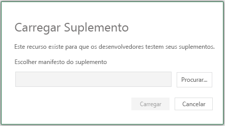

# Depuração de funções personalizadas sem interface do usuárioUI-less custom functions debugging

Este artigo discute a depuração *apenas* para funções personalizadas que não usam um painel de tarefas ou outros elementos de interface do usuário (funções personalizadas sem interface do usuário).This article discusses debugging *only* for custom functions that don't use a task pane or other user interface elements (UI-less custom functions). 

[!include[Excel custom functions note](../includes/excel-custom-functions-note.md)]

[!include[Shared runtime note](../includes/shared-runtime-note.md)]

No Windows:On Windows:
- [Excel Depurador Visual Studio Code (VS Code)Excel Desktop and Visual Studio Code (VS Code) debugger](#use-the-vs-code-debugger-for-excel-desktop)
- [Excel na Web e VS Code depuradorExcel on the web and VS Code debugger](#use-the-vs-code-debugger-for-excel-in-microsoft-edge)
- [Excel na Web e ferramentas do navegadorExcel on the web and browser tools](#use-the-browser-developer-tools-to-debug-custom-functions-in-excel-on-the-web)
- [Linha de comandoCommand line](#use-the-command-line-tools-to-debug)

No Mac:On Mac:
- [Excel na Web e ferramentas do navegadorExcel on the web and browser tools](#use-the-browser-developer-tools-to-debug-custom-functions-in-excel-on-the-web)
- [Linha de comandoCommand line](#use-the-command-line-tools-to-debug)

> [!NOTE]
> Para simplificar, este artigo mostra a depuração no contexto de uso Visual Studio Code para editar, executar tarefas e, em alguns casos, usar o modo de exibição de depuração.For simplicity, this article shows debugging in the context of using Visual Studio Code to edit, run tasks, and in some cases use the debug view. Se você estiver usando uma ferramenta de linha de comando ou editor diferente, consulte [as](#commands-for-building-and-running-your-add-in) instruções de linha de comando no final deste artigo.If you are using a different editor or command line tool, see the [command line instructions](#commands-for-building-and-running-your-add-in) at the end of this article.

## RequisitosRequirements

Esse processo de depuração funciona **apenas** para funções personalizadas sem interface do usuário, que não usam um painel de tarefas ou outros elementos da interface do usuário.This debugging process works **only** for UI-less custom functions, which don't use a task pane or other UI elements. Uma função personalizada sem interface do usuário pode ser criada seguindo as etapas no tutorial Criar funções [personalizadas](../tutorials/excel-tutorial-create-custom-functions.md) no Excel e, em seguida, remover todos os elementos do painel de tarefas e da interface do usuário instalados pelo gerador [Yeoman para Office Add-ins](https://www.npmjs.com/package/generator-office).A UI-less custom function can be created by following the steps in the [Create custom functions in Excel](../tutorials/excel-tutorial-create-custom-functions.md) tutorial, and then removing all of the task pane and UI elements that are installed by the [Yeoman generator for Office Add-ins](https://www.npmjs.com/package/generator-office).

Observe que esse processo de depuração não é compatível com projetos de funções personalizadas usando um [tempo de execução compartilhado.](../develop/configure-your-add-in-to-use-a-shared-runtime.md)Note that this debugging process is not compatible with custom functions projects using a [shared runtime](../develop/configure-your-add-in-to-use-a-shared-runtime.md).

## Use o VS Code depurador para Excel DesktopUse the VS Code debugger for Excel Desktop

Você pode usar VS Code para depurar funções personalizadas sem interface do usuário Office Excel na área de trabalho.You can use VS Code to debug UI-less custom functions in Office Excel on the desktop.

> [!NOTE]
> A depuração de área de trabalho para o Mac não está disponível, mas pode ser atingida usando as ferramentas do navegador e a linha de comando para [depurar](#use-the-command-line-tools-to-debug)Excel na Web ).Desktop debugging for the Mac is not available but can be achieved [using the browser tools and command line to debug Excel on the web](#use-the-command-line-tools-to-debug)).

### Execute o seu complemento do VS CodeRun your add-in from VS Code

1. Abra sua pasta de projeto raiz de funções personalizadas [VS Code](https://code.visualstudio.com/).Open your custom functions root project folder in [VS Code](https://code.visualstudio.com/).
2. Escolha **Terminal > Executar Tarefa** e digite ou selecione **Assistir**.Choose **Terminal > Run Task** and type or select **Watch**. Isso monitorará e reconstruirá todas as alterações de arquivo.This will monitor and rebuild for any file changes.
3. Escolha **Terminal > Executar Tarefa** e digite ou selecione **Dev Server**.Choose **Terminal > Run Task** and type or select **Dev Server**.

### Iniciar o VS Code depuradorStart the VS Code debugger

4. Escolha **Exibir > Executar ou** insira **Ctrl+Shift+D** para alternar para o exibição de depuração.Choose **View > Run** or enter **Ctrl+Shift+D** to switch to debug view.
5. No menu suspenso Executar, escolha Excel **Desktop (Funções Personalizadas)**.From the Run drop-down menu, choose **Excel Desktop (Custom Functions)**.
6. Selecione **F5** (ou selecione **Executar -> Iniciar Depuração** no menu) para começar a depuração.Select **F5** (or select **Run -> Start Debugging** from the menu) to begin debugging. Uma nova Excel de trabalho será aberta com seu complemento já sideload e pronto para uso.A new Excel workbook will open with your add-in already sideloaded and ready to use.

### Iniciar a depuraçãoStart debugging

1. Em VS Code, abra seu arquivo de script de código-fonte (**functions.js** **ou functions.ts**).In VS Code, open your source code script file (**functions.js** or **functions.ts**).
2. [Definir um ponto de interrupção](https://code.visualstudio.com/Docs/editor/debugging#_breakpoints) no código-fonte da função personalizada.[Set a breakpoint](https://code.visualstudio.com/Docs/editor/debugging#_breakpoints) in the custom function source code.
3. Na Excel de trabalho, insira uma fórmula que usa sua função personalizada.In the Excel workbook, enter a formula that uses your custom function.

Neste ponto, a execução será parada na linha de código onde você definirá o ponto de interrupção.At this point execution will stop on the line of code where you set the breakpoint. Agora você pode passar pelo código, definir relógios e usar qualquer VS Code recursos de depuração necessários.Now you can step through your code, set watches, and use any VS Code debugging features you need.

## Use o VS Code depurador para Excel em Microsoft EdgeUse the VS Code debugger for Excel in Microsoft Edge

Você pode usar VS Code para depurar funções personalizadas sem interface do usuário Excel no navegador Microsoft Edge usuário.You can use VS Code to debug UI-less custom functions in Excel on the Microsoft Edge browser. Para usar VS Code com Microsoft Edge, você deve instalar o [Depurador para Microsoft Edge](https://marketplace.visualstudio.com/items?itemName=msjsdiag.debugger-for-edge) extensão.To use VS Code with Microsoft Edge, you must install the [Debugger for Microsoft Edge](https://marketplace.visualstudio.com/items?itemName=msjsdiag.debugger-for-edge) extension.

### Execute o seu complemento do VS CodeRun your add-in from VS Code

1. Abra sua pasta de projeto raiz de funções personalizadas [VS Code](https://code.visualstudio.com/).Open your custom functions root project folder in [VS Code](https://code.visualstudio.com/).
2. Escolha **Terminal > Executar Tarefa** e digite ou selecione **Assistir**.Choose **Terminal > Run Task** and type or select **Watch**. Isso monitorará e reconstruirá todas as alterações de arquivo.This will monitor and rebuild for any file changes.
3. Escolha **Terminal > Executar Tarefa** e digite ou selecione **Dev Server**.Choose **Terminal > Run Task** and type or select **Dev Server**.

### Iniciar o VS Code depuradorStart the VS Code debugger

4. Escolha **Exibir > Executar ou** insira **Ctrl+Shift+D** para alternar para o exibição de depuração.Choose **View > Run** or enter **Ctrl+Shift+D** to switch to debug view.
5. Nas opções Depurar, escolha **Office Online (Edge Chromium)**.From the Debug options, choose **Office Online (Edge Chromium)**.
6. Abra Excel no navegador Microsoft Edge e crie uma nova workbook.Open Excel in the Microsoft Edge browser and create a new workbook.
7. Escolha **Compartilhar** na faixa de opções e copie o link para a URL dessa nova workbook.Choose **Share** in the ribbon and copy the link for the URL for this new workbook.
8. Selecione **F5** (ou **selecione Executar > Iniciar Depuração** no menu) para começar a depuração.Select **F5** (or select **Run > Start Debugging** from the menu) to begin debugging. Um prompt será exibido, que solicita a URL do documento.A prompt will appear, which asks for the URL of your document.
9. Colar na URL da pasta de trabalho e pressione Enter.Paste in the URL for your workbook and press Enter.

### Realizar o sideload do seu suplementoSideload your add-in

1. Selecione a **guia** Inserir na faixa de opções e, na seção **Complementos,** escolha Office **Adicionar.**Select the **Insert** tab on the ribbon and in the **Add-ins** section, choose **Office Add-ins**.
2. Na caixa **de diálogo Office de** Office, selecione a guia MEUS **ADD-INS,** escolha Gerenciar Meus **Complementos** e, em seguida, **Upload Meu Complemento**.On the **Office Add-ins** dialog, select the **MY ADD-INS** tab, choose **Manage My Add-ins**, and then **Upload My Add-in**.
    
    

3. **Navegue** até o arquivo de manifesto do complemento e selecione **Upload**.**Browse** to the add-in manifest file and then select **Upload**.
    
    

### Definir pontos de interrupçãoSet breakpoints
1. Em VS Code, abra seu arquivo de script de código-fonte (**functions.js** **ou functions.ts**).In VS Code, open your source code script file (**functions.js** or **functions.ts**).
2. [Definir um ponto de interrupção](https://code.visualstudio.com/Docs/editor/debugging#_breakpoints) no código-fonte da função personalizada.[Set a breakpoint](https://code.visualstudio.com/Docs/editor/debugging#_breakpoints) in the custom function source code.
3. Na Excel de trabalho, insira uma fórmula que usa sua função personalizada.In the Excel workbook, enter a formula that uses your custom function.

## Use as ferramentas de desenvolvedor do navegador para depurar funções personalizadas em Excel na WebUse the browser developer tools to debug custom functions in Excel on the web

Você pode usar as ferramentas de desenvolvedor do navegador para depurar funções personalizadas sem interface do usuário Excel na Web.You can use the browser developer tools to debug UI-less custom functions in Excel on the web. As etapas a seguir funcionam para o Windows e macOS.The following steps work for both Windows and macOS.

### Execute o seu complemento do Visual Studio CodeRun your add-in from Visual Studio Code

1. Abra sua pasta de projeto raiz de funções personalizadas [Visual Studio Code (VS Code)](https://code.visualstudio.com/).Open your custom functions root project folder in [Visual Studio Code (VS Code)](https://code.visualstudio.com/).
2. Escolha **Terminal > Executar Tarefa** e digite ou selecione **Assistir**.Choose **Terminal > Run Task** and type or select **Watch**. Isso monitorará e reconstruirá todas as alterações de arquivo.This will monitor and rebuild for any file changes.
3. Escolha **Terminal > Executar Tarefa** e digite ou selecione **Dev Server**.Choose **Terminal > Run Task** and type or select **Dev Server**.

### Realizar o sideload do seu suplementoSideload your add-in

1. Abra [Office na Web](https://office.live.com/).Open [Office on the web](https://office.live.com/).
2. Abra uma nova Excel de trabalho.Open a new Excel workbook.
3. Abra a **guia** Inserir na faixa de opções e, na seção **Add-ins,** escolha Office **Adicionar.**Open the **Insert** tab on the ribbon and, in the **Add-ins** section, choose **Office Add-ins**.
4. Na caixa **de diálogo Office de** Office, selecione a guia MEUS **ADD-INS,** escolha Gerenciar Meus **Complementos** e, em seguida, **Upload Meu Complemento**.On the **Office Add-ins** dialog, select the **MY ADD-INS** tab, choose **Manage My Add-ins**, and then **Upload My Add-in**.
    
    

5. **Navegue** até o arquivo de manifesto do suplemento e selecione **Carregar**.**Browse** to the add-in manifest file, and then select **Upload**.
    
    

> [!NOTE]
> Depois de fazer sideload no documento, ele permanecerá sideload sempre que você abrir o documento.Once you've sideloaded to the document, it will remain sideloaded each time you open the document.

### Iniciar a depuraçãoStart debugging

1. Abra ferramentas de desenvolvedor no navegador.Open developer tools in the browser. Para o Chrome e a maioria dos navegadores F12 abrirá as ferramentas de desenvolvedor.For Chrome and most browsers F12 will open the developer tools.
2. Em ferramentas de desenvolvedor, abra seu arquivo de script de código-fonte usando **Cmd+P** ou **Ctrl+P** (**functions.js** **ou functions.ts**).In developer tools, open your source code script file using **Cmd+P** or **Ctrl+P** (**functions.js** or **functions.ts**).
3. [Definir um ponto de interrupção](https://code.visualstudio.com/Docs/editor/debugging#_breakpoints) no código-fonte da função personalizada.[Set a breakpoint](https://code.visualstudio.com/Docs/editor/debugging#_breakpoints) in the custom function source code. 

Se você precisar alterar o código, poderá fazer edições no VS Code e salvar as alterações.If you need to change the code you can make edits in VS Code and save the changes. Atualize o navegador para ver as alterações carregadas.Refresh the browser to see the changes loaded.

## Usar as ferramentas de linha de comando para depurarUse the command line tools to debug

Se você não estiver usando VS Code, poderá usar a linha de comando (como bash ou PowerShell) para executar o seu complemento.If you are not using VS Code, you can use the command line (such as bash, or PowerShell) to run your add-in. Você precisará usar as ferramentas de desenvolvedor do navegador para depurar seu código Excel na Web.You'll need to use the browser developer tools to debug your code in Excel on the web. Não é possível depurar a versão da área de trabalho Excel usando a linha de comando.You cannot debug the desktop version of Excel using the command line.

1. Na linha de comando, `npm run watch` execute para observar e reconstruir quando ocorrerem alterações de código.From the command line run `npm run watch` to watch for and rebuild when code changes occur.
2. Abra uma segunda janela de linha de comando (a primeira será bloqueada durante a execução do relógio).Open a second command line window (the first one will be blocked while running the watch.)

3. Se você quiser iniciar o seu complemento na versão da área de trabalho Excel, execute o seguinte comando.If you want to start your add-in in the desktop version of Excel, run the following command.

    `npm run start:desktop`

    Ou se você preferir iniciar o seu Excel na Web, execute o seguinte comando.Or if you prefer to start your add-in in Excel on the web, run the following command.

    `npm run start:web`

    Para Excel na Web você também precisa fazer sideload do seu complemento.For Excel on the web you also need to sideload your add-in. Siga as etapas em [Sideload your add-in](#sideload-your-add-in) to sideload your add-in.Follow the steps in [Sideload your add-in](#sideload-your-add-in) to sideload your add-in. Em seguida, continue até a próxima seção para iniciar a depuração.Then continue to the next section to start debugging.

4. Abra ferramentas de desenvolvedor no navegador.Open developer tools in the browser. Para o Chrome e a maioria dos navegadores F12 abrirá as ferramentas de desenvolvedor.For Chrome and most browsers F12 will open the developer tools.
5. Em ferramentas de desenvolvedor, abra seu arquivo de script de código-fonte (**functions.js** **ou functions.ts**).In developer tools, open your source code script file (**functions.js** or **functions.ts**). Seu código de funções personalizadas pode estar localizado perto do final do arquivo.Your custom functions code may be located near the end of the file.
6. No código-fonte da função personalizada, aplique um ponto de interrupção selecionando uma linha de código.In the custom function source code, apply a breakpoint by selecting a line of code.

Se você precisar alterar o código, poderá fazer edições no Visual Studio e salvar as alterações.If you need to change the code you can make edits in Visual Studio and save the changes. Atualize o navegador para ver as alterações carregadas.Refresh the browser to see the changes loaded.

### Comandos para criar e executar o seu complementoCommands for building and running your add-in

Há várias tarefas de com build disponíveis:There are several build tasks available:
- `npm run watch`: cria para desenvolvimento e recria automaticamente quando um arquivo de origem é salvo`npm run watch`: builds for development and automatically rebuilds when a source file is saved
- `npm run build-dev`: builds para desenvolvimento uma vez`npm run build-dev`: builds for development once
- `npm run build`: builds para produção`npm run build`: builds for production
- `npm run dev-server`: executa o servidor Web usado para desenvolvimento`npm run dev-server`: runs the web server used for development

Você pode usar as seguintes tarefas para iniciar a depuração na área de trabalho ou online.You can use the following tasks to start debugging on desktop or online.
- `npm run start:desktop`: Inicia Excel na área de trabalho e faz o sideload do seu complemento.`npm run start:desktop`: Starts Excel on desktop and sideloads your add-in.
- `npm run start:web`: Inicia Excel na Web e descarrega o seu complemento.`npm run start:web`: Starts Excel on the web and sideloads your add-in.
- `npm run stop`: Interrompe Excel e depuração.`npm run stop`: Stops Excel and debugging.

## Próximas etapasNext steps
Saiba mais sobre as práticas de autenticação para funções [personalizadas sem interface do usuário.](custom-functions-authentication.md)Learn about [authentication practices for UI-less custom functions](custom-functions-authentication.md).

## Confira tambémSee also

* [Solução de problemas de funções personalizadasCustom functions troubleshooting](custom-functions-troubleshooting.md)
* [Tratamento de erros para funções personalizadas no ExcelError handling for custom functions in Excel](custom-functions-errors.md)
* [Criar funções personalizadas no ExcelCreate custom functions in Excel](custom-functions-overview.md)
