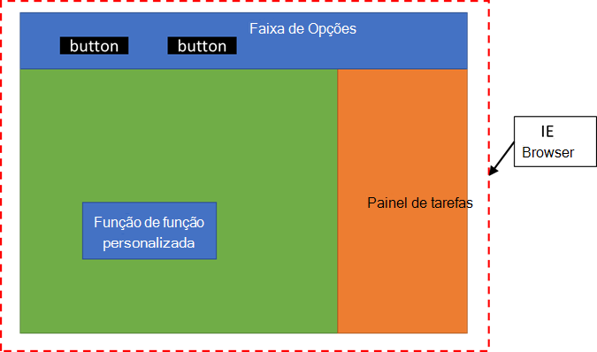

# Visão geral: Execute seu código de suplemento em um tempo de execução do Javascript compartilhado (visualização)Overview: Run your add-in code in a shared JavaScript runtime (preview)

[!include[Running custom functions in shared JavaScript runtime note](../includes/excel-shared-runtime-preview-note.md)]

Ao executar o Excel no Windows ou Mac, o suplemento executará o código para botões da faixa de opções, funções personalizadas e o painel de tarefas em ambientes de tempo de execução JavaScript separados.When running Excel on Windows or Mac, your add-in will run code for ribbon buttons, custom functions, and the task pane in separate JavaScript runtime environments. Isso cria limitações, como não poder compartilhar facilmente dados globais e não poder acessar todas as funcionalidades do CORS a partir de uma função customizada.This creates limitations such as not being able to easily share global data, and not being able to access all CORS functionality from a custom function.

No entanto, você pode configurar o suplemento do Excel para compartilhar código no mesmo tempo de execução JavaScript (também conhecido como tempo de execução compartilhado).However, you can configure your Excel add-in to share code in the same JavaScript runtime (also referred to as a shared runtime). Isso permite uma melhor coordenação entre o suplemento e o acesso ao DOM e CORS do painel de tarefas de todas as partes do suplemento.This enables better coordination across your add-in and access to the task pane DOM and CORS from all parts of your add-in.

A configuração de um tempo de execução compartilhado permite os seguintes cenários:Configuring a shared runtime enables the following scenarios:

- Seu suplemento terá um DOM compartilhado que a faixa de opções, o painel de tarefas e as funções personalizadas podem acessar.Your add-in will have a shared DOM that the ribbon, task pane, and custom functions can all access.
- Suas funções personalizadas terão suporte completo ao CORS.Your custom functions will have full CORS support.
- Suas funções personalizadas podem chamar as APIs do Office.js para ler os dados do documento da planilha.Your custom functions can call Office.js APIs to read spreadsheet document data.
- Seu suplemento pode executar o código assim que o documento for aberto.Your add-in can run code as soon as the document is opened.
- Seu suplemento pode continuar executando o código após o fechamento do painel de tarefas.Your add-in can continue running code after the task pane is closed.

Quando você executa funções personalizadas em um tempo de execução compartilhado com o painel de tarefas, ele será executado em uma instância do navegador em plataformas diferentes, conforme explicado em [Navegadores usados pelos Suplementos do Office](../concepts/browsers-used-by-office-web-add-ins.md). Além disso, todos os botões exibidos pelo suplemento do Excel na faixa de opções serão executados no mesmo tempo de execução compartilhado.When you run custom functions in a shared runtime with the task pane, it will run in a browser instance on different platforms as explained in [Browsers used by Office Add-ins](../concepts/browsers-used-by-office-web-add-ins.md). Additionally, any buttons that your Excel add-in displays on the ribbon will run in the same shared runtime. A imagem a seguir mostra como as funções personalizadas, a interface do usuário da faixa de opções e o código do painel de tarefas serão executados no mesmo tempo de execução JavaScript.The following image shows how custom functions, the ribbon UI, and the task pane code will all run in the same JavaScript runtime.

## Diferenças ao executar funções personalizadas em um tempo de execução compartilhadoDifferences when running custom functions in a shared runtime

Quando você configura seu projeto de suplemento do Excel para executar funções personalizadas em um tempo de execução compartilhado, existem algumas diferenças no uso do tempo de execução da função personalizada.When you configure your Excel add-in project to run custom functions in a shared runtime, there are a few differences from using the custom function runtime.

### ArmazenamentoStorage

Você não precisa mais usar a API de **Armazenamento** para compartilhar dados entre o painel de tarefas, funções personalizadas ou interface do usuário da faixa de opções.You no longer need to use the **Storage** API to share data between the task pane, custom functions or ribbon UI. Você pode colocar variáveis globais no objeto de **janela** ou usar sua própria abordagem de gerenciamento de estado preferida.You can put global variables in the **window** object, or use your own preferred state management approach.

### AutenticaçãoAuthentication

Quando você recebe tokens como parte da autenticação, não precisa usar a API de **Armazenamento** para compartilhá-los entre o painel de tarefas, funções personalizadas e interface do usuário da faixa de opções.When you receive tokens as part of authentication, you don't need to use the **Storage** API to share them between the task pane, custom functions and ribbon UI. Você pode usar sua própria técnica de armazenamento e local de armazenamento preferidos para compartilhá-los, como `localStorage`.You can use your own preferred storage technique and storage location to share them, such as `localStorage`.

### API de Caixa de DiálogoDialog API

Você não precisa mais usar a API **OfficeRuntime.Dialog** para exibir uma caixa de diálogo a partir de uma função personalizada.You no longer need to use the **OfficeRuntime.Dialog** API to display a dialog from a custom function. Você pode usar a mesma [API de caixa de diálogo](../develop/dialog-api-in-office-add-ins.md) para funções personalizadas, botões da faixa de opções e o painel de tarefas.You can use the same [Dialog API](../develop/dialog-api-in-office-add-ins.md) for custom functions, ribbon buttons, and the task pane.

### DepuraçãoDebugging

Ao usar um tempo de execução compartilhado, não é possível usar o Código do Visual Studio para depurar funções personalizadas no Excel no Windows no momento.When using a shared runtime, you can't use Visual Studio Code to debug custom functions in Excel on Windows at this time. Você precisará usar ferramentas de desenvolvedor.You'll need to use developer tools. Para obter mais informações, consulte [Depurar suplementos usando ferramentas de desenvolvedor no Windows 10](../testing/debug-add-ins-using-f12-developer-tools-on-windows-10.md).For more information, see [Debug add-ins using developer tools on Windows 10](../testing/debug-add-ins-using-f12-developer-tools-on-windows-10.md).

## IntroduçãoGet Started

Para configurar seu projeto de suplemento do Excel para executar funções personalizadas em um tempo de execução compartilhado, consulte [Configurar o suplemento do Excel para usar um tempo de execução do Javascript compartilhado (visualização)](configure-your-add-in-to-use-a-shared-runtime.md).To configure your Excel add-in project to run custom functions in a shared runtime, see [Configure your Excel add-in to use a shared JavaScript runtime (preview)](configure-your-add-in-to-use-a-shared-runtime.md).

## Envie-nos seus comentáriosGive us feedback

Adoraríamos ouvir seus comentários sobre esse recurso.We'd love to hear your feedback on this feature. Se você encontrar algum bug ou problema, ou tiver solicitações sobre esse recurso, informe-nos criando um problema do GitHub no [repositório office-js](https://github.com/OfficeDev/office-js).If you find any bugs, issues, or have requests on this feature, please let us know by creating a GitHub issue in the [office-js repo](https://github.com/OfficeDev/office-js).

## Confira tambémSee also

Lista de artigos relacionados para tempo de execução compartilhadoList of related articles for shared runtime
- [Tutorial: Compartilhar dados e eventos entre as funções personalizadas do Excel e o painel de tarefas (visualização)Tutorial: Share data and events between Excel custom functions and the task pane (preview)](../tutorials/share-data-and-events-between-custom-functions-and-the-task-pane-tutorial.md)
- [Chame APIs do Excel a partir de sua função personalizada (visualização)Call Excel APIs from your custom function (preview)](call-excel-apis-from-custom-function.md)