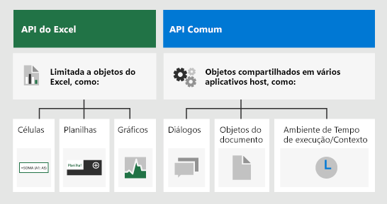

# <a name="advanced-programming-concepts-with-the-excel-javascript-api"></a>Conceitos avançados de programação com a API JavaScript do Excel

Este artigo se baseia nas informações contidas em [conceitos fundamentais de programação API JavaScript do Excel](excel-add-ins-core-concepts.md) para descrever alguns dos conceitos mais avançados que são essenciais para a criação de suplementos complexos para o Excel 2016 ou posterior.

## <a name="officejs-apis-for-excel"></a>APIs Office.js para Excel

Um suplemento do Excel interage com objetos no Excel usando a API JavaScript do Office, que inclui dois modelos de objetos JavaScript:

* **API JavaScript do Excel**: introduzida com o Office 2016, a [API JavaScript do Excel](../reference/overview/excel-add-ins-reference-overview.md) fornece objetos fortemente tipados que você pode usar para acessar planilhas, intervalos, tabelas, gráficos e muito mais.

* **APIs Comuns**: Introduzida com o Office 2013, a [API Comum](/javascript/api/office) pode ser usada para acessar recursos como interface de usuário, caixas de diálogo e configurações de cliente, que são comuns entre vários tipos de aplicativos do Office.

Enquanto você provavelmente use a API JavaScript do Excel para desenvolver a maioria das funcionalidades em suplementos que visam o Excel 2016, você também usará objetos na API comum. Por exemplo:

- [Context](/javascript/api/office/office.context): The `Context` object represents the runtime environment of the add-in and provides access to key objects of the API. It consists of workbook configuration details such as `contentLanguage` and `officeTheme` and also provides information about the add-in's runtime environment such as `host` and `platform`. Additionally, it provides the `requirements.isSetSupported()` method, which you can use to check whether the specified requirement set is supported by the Excel application where the add-in is running.

- [Documento](/javascript/api/office/office.document): o objeto `Document` fornece o método `getFileAsync()`, que você pode usar para baixar o arquivo do Excel em que o suplemento está sendo executado.

A imagem a seguir ilustra quando você pode usar a API JavaScript do Excel ou as APIs comuns.



## <a name="requirement-sets"></a>Conjuntos de requisitos

Requirement sets are named groups of API members. An Office Add-in can perform a runtime check or use requirement sets specified in the manifest to determine whether an Office host supports the APIs that the add-in needs. To identify the specific requirement sets that are available on each supported platform, see [Excel JavaScript API requirement sets](../reference/requirement-sets/excel-api-requirement-sets.md).

### <a name="checking-for-requirement-set-support-at-runtime"></a>Verificando o suporte ao conjunto de requisitos no tempo de execução

O exemplo de código a seguir mostra como determinar se o aplicativo host, onde o suplemento está em execução, dá suporte ao conjunto de requisitos da API especificado.

```js
if (Office.context.requirements.isSetSupported('ExcelApi', '1.3')) {
  /// perform actions
}
else {
  /// provide alternate flow/logic
}
```

### <a name="defining-requirement-set-support-in-the-manifest"></a>Definindo o suporte ao conjunto de requisitos no manifesto

You can use the [Requirements element](../reference/manifest/requirements.md) in the add-in manifest to specify the minimal requirement sets and/or API methods that your add-in requires to activate. If the Office host or platform doesn't support the requirement sets or API methods that are specified in the `Requirements` element of the manifest, the add-in won't run in that host or platform, and won't display in the list of add-ins that are shown in **My Add-ins**.

O exemplo de código a seguir mostra o elemento `Requirements` em um manifesto de suplemento que especifica se o suplemento deve ser carregado em todos os aplicativos host do Office que dão suporte ao conjunto de requisitos ExcelApi, versão 1.3 ou superior.

```xml
<Requirements>
   <Sets DefaultMinVersion="1.3">
      <Set Name="ExcelApi" MinVersion="1.3"/>
   </Sets>
</Requirements>
```

> [!NOTE]
> Para disponibilizar seu suplemento em todas as plataformas de um host do Office, como Excel Online, Windows e iPad, é recomendável verificar o suporte a requisitos no tempo de execução, em vez de definir o suporte ao conjunto de requisitos no manifesto.

### <a name="requirement-sets-for-the-officejs-common-api"></a>Conjuntos de requisitos para a API comum Office.js

Para saber mais sobre conjuntos de requisitos comuns da API, confira [Conjuntos de requisitos comuns da API do Office](../reference/requirement-sets/office-add-in-requirement-sets.md).

## <a name="loading-the-properties-of-an-object"></a>Carregando as propriedades de um objeto

Calling the `load()` method on an Excel JavaScript object instructs the API to load the object into JavaScript memory when the `sync()` method runs. The `load()` method accepts a string that contains comma-delimited names of properties to load or an object that specifies properties to load, pagination options, etc.

### <a name="method-details"></a>Detalhes do método

#### `load(propertyNames?: string | string[])`

Coloca um comando na fila para carregar as propriedades especificadas do objeto. Você deve chamar `context.sync()` antes de ler as propriedades.

#### <a name="syntax"></a>Sintaxe

```js
object.load(param);
```

#### <a name="parameters"></a>Parâmetros

|**Parâmetro**|**Tipo**|**Descrição**|
|:------------|:-------|:----------|
|`propertyNames`|objeto|Opcional. Aceita nomes de propriedade como uma matriz ou cadeia de caracteres delimitada por vírgulas.|

#### <a name="returns"></a>Retorna

nulo

#### <a name="example"></a>Exemplo

The following code sample sets the properties of one Excel range by copying the properties of another range. Note that the source object must be loaded first, before its property values can be accessed and written to the target range. This example assumes that there is data the two ranges (**B2:E2** and **B7:E7**) and that the two ranges are initially formatted differently.

```js
Excel.run(function (ctx) {
    var sheet = ctx.workbook.worksheets.getItem("Sample");
    var sourceRange = sheet.getRange("B2:E2");
    sourceRange.load("format/fill/color, format/font/name, format/font/color");

    return ctx.sync()
        .then(function () {
            var targetRange = sheet.getRange("B7:E7");
            targetRange.set(sourceRange);
            targetRange.format.autofitColumns();

            return ctx.sync();
        });
}).catch(function(error) {
    console.log("Error: " + error);
    if (error instanceof OfficeExtension.Error) {
        console.log("Debug info: " + JSON.stringify(error.debugInfo));
    }
});
```

### <a name="load-option-properties"></a>Carregar propriedades de opção

Como uma alternativa para passar uma cadeia de caracteres delimitada por vírgulas ou uma matriz ao chamar o método `load()`, você pode passar um objeto que contém as propriedades a seguir.

|**Propriedade**|**Tipo**|**Descrição**|
|:-----------|:-------|:----------|
|`select`|objeto|Contains a comma-delimited list or an array of scalar property names. Optional.|
|`expand`|objeto|Contains a comma-delimited list or an array of navigational property names. Optional.|
|`top`|int| Specifies the maximum number of collection items that can be included in the result. Optional. You can only use this option when you use the object notation option.|
|`skip`|int|Specify the number of items in the collection that are to be skipped and not included in the result. If `top` is specified, the result set will start after skipping the specified number of items. Optional. You can only use this option when you use the object notation option.|

O exemplo de código a seguir carrega uma coleção de planilhas selecionando a `name`propriedade e o `address`do intervalo usado para cada planilha na coleção. Ele também especifica que apenas as cinco planilhas principais na coleção devem ser carregadas. Você poderia processar o próximo conjunto de cinco planilhas especificando `top: 10` e `skip: 5` como valores de atributo.

```js
myWorksheets.load({
    select: 'name, userRange/address',
    expand: 'tables',
    top: 5,
    skip: 0
});
```

### <a name="calling-load-without-parameters"></a>Chamando `load` sem parâmetros

If you call the `load()` method on an object (or collection) without specifying any parameters, all scalar properties of the object (or all scalar properties of all objects in the collection) will be loaded. To reduce the amount of data transfer between the Excel host application and the add-in, you should avoid calling the `load()` method without explicitly specifying which properties to load.

> [!IMPORTANT]
> A quantidade de dados retornados por uma declaração `load` sem parâmetros pode exceder os limites de tamanho do serviço. Para reduzir os riscos a suplementos mais antigos, algumas propriedades não são retornadas por `load` sem a solicitação explícita. As seguintes propriedades são excluídas dessas operações de carregamento:
>
> * `Excel.Range.numberFormatCategories`

## <a name="scalar-and-navigation-properties"></a>Propriedades escalares e de navegação

Há duas categorias de propriedades: **escalar** e de **navegação**. As propriedades escalares são tipos atribuíveis, como cadeias de caracteres, inteiros e estruturas JSON. As propriedades de navegação são objetos Somente Leitura e coleções de objetos que têm seus campos atribuídos, em vez de atribuir diretamente a propriedade. Por exemplo, os membros `name` e `position` no objeto [Planilha](/javascript/api/excel/excel.worksheet) são propriedades escalares, enquanto `protection` e `tables` são propriedades de navegação. `prompt` no objeto [DataValidation](/javascript/api/excel/excel.datavalidation) é um exemplo de uma propriedade escalar que deve ser definida usando um objeto JSON (`dv.prompt = { title: "MyPrompt"}`), em vez de definir as subpropriedades (`dv.prompt.title = "MyPrompt" // will not set the title`).

### <a name="scalar-properties-and-navigation-properties-with-objectload"></a>Propriedades escalares e propriedades de navegação com `object.load()`

Calling the `object.load()` method with no parameters specified will load all scalar properties of the object; navigation properties of the object will not be loaded. Additionally, navigation properties cannot be loaded directly. Instead, you should use the `load()` method to reference individual scalar properties within the desired navigation property. For example, to load the font name for a range, you must specify the `format` and `font` navigation properties as the path to the `name` property:

```js
someRange.load("format/font/name")
```

> [!NOTE]
> With the Excel JavaScript API, you can set scalar properties of a navigation property by traversing the path. For example, you could set the font size for a range by using `someRange.format.font.size = 10;`. You do not need to load the property before you set it. 

## <a name="setting-properties-of-an-object"></a>Definindo propriedades de um objeto

Setting properties on an object with nested navigation properties can be cumbersome. As an alternative to setting individual properties using navigation paths as described above, you can use the `object.set()` method that is available on all objects in the Excel JavaScript API. With this method, you can set multiple properties of an object at once by passing either another object of the same Office.js type or a JavaScript object with properties that are structured like the properties of the object on which the method is called.

> [!NOTE]
> The `set()` method is implemented only for objects within the host-specific Office JavaScript APIs, such as the Excel JavaScript API. The common (shared) APIs do not support this method. 

### <a name="set-properties-object-options-object"></a>set (properties: object, options: object)

Properties of the object on which the method is called are set to the values that are specified by the corresponding properties of the passed-in object. If the `properties` parameter is a JavaScript object, any property of the passed-in object that corresponds to a read-only property in the object on which the method is called will either be ignored or cause an exception to be thrown, depending on the value of the `options` parameter.

#### <a name="syntax"></a>Sintaxe

```js
object.set(properties[, options]);
```

#### <a name="parameters"></a>Parâmetros

|**Parâmetro**|**Tipo**|**Descrição**|
|:------------|:--------|:----------|
|`properties`|objeto|Um objeto do mesmo tipo de objeto do Office.js no qual o método é chamado ou um objeto JavaScript com nomes e tipos de propriedade que espelham a estrutura do objeto no qual o método é chamado.|
|`options`|objeto|Optional. Can only be passed when the first parameter is a JavaScript object. The object can contain the following property: `throwOnReadOnly?: boolean` (Default is `true`: throw an error if the passed in JavaScript object includes read-only properties.)|

#### <a name="returns"></a>Retorna

nulo

#### <a name="example"></a>Exemplo

The following code sample sets several format properties of a range by calling the `set()` method and passing in a JavaScript object with property names and types that mirror the structure of properties in the `Range` object. This example assumes that there is data in range **B2:E2**.

```js
Excel.run(function (ctx) {
    var sheet = ctx.workbook.worksheets.getItem("Sample");
    var range = sheet.getRange("B2:E2");
    range.set({
        format: {
            fill: {
                color: '#4472C4'
            },
            font: {
                name: 'Verdana',
                color: 'white'
            }
        }
    });
    range.format.autofitColumns();

    return ctx.sync();
}).catch(function(error) {
    console.log("Error: " + error);
    if (error instanceof OfficeExtension.Error) {
        console.log("Debug info: " + JSON.stringify(error.debugInfo));
    }
});
```

## <a name="42ornullobject-methods"></a>Métodos &#42;OrNullObject

Many Excel JavaScript API methods will return an exception when the condition of the API is not met. For example, if you attempt to get a worksheet by specifying a worksheet name that doesn't exist in the workbook, the `getItem()` method will return an `ItemNotFound` exception. 

Instead of implementing complex exception handling logic for scenarios like this, you can use the `*OrNullObject` method variant that's available for several methods in the Excel JavaScript API. An `*OrNullObject` method will return a null object (not the JavaScript `null`) rather than throwing an exception if the specified item doesn't exist. For example, you can call the `getItemOrNullObject()` method on a collection such as **Worksheets** to attempt to retrieve an item from the collection. The `getItemOrNullObject()` method returns the specified item if it exists; otherwise, it returns a null object. The null object that is returned contains the boolean property `isNullObject` that you can evaluate to determine whether the object exists.

The following code sample attempts to retrieve a worksheet named "Data" by using the `getItemOrNullObject()` method. If the method returns a null object, a new sheet needs to be created before actions can taken on the sheet.

```js
var dataSheet = context.workbook.worksheets.getItemOrNullObject("Data");

return context.sync()
  .then(function() {
    if (dataSheet.isNullObject) {
        // Create the sheet
    }

    dataSheet.position = 1;
    //...
  })
```

## <a name="see-also"></a>Confira também

* [Conceitos fundamentais de programação com a API JavaScript do Excel](excel-add-ins-core-concepts.md)
* [Exemplos de código de suplementos do Excel](https://developer.microsoft.com/office/gallery/?filterBy=Samples,Excel)
* [Otimização de desempenho da API JavaScript do Excel](performance.md)
* [Referência da API JavaScript do Excel](../reference/overview/excel-add-ins-reference-overview.md)
