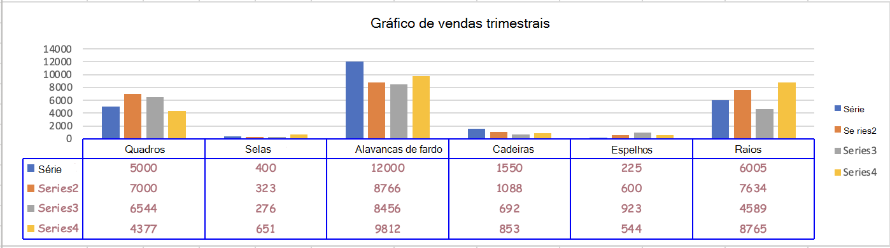

# <a name="work-with-charts-using-the-excel-javascript-api"></a>Trabalhar com gráficos usando a API JavaScript do Excel

Este artigo fornece exemplos de código que mostram como executar tarefas comuns com gráficos usando a API JavaScript do Excel.
Para ver a lista completa de propriedades e métodos que os objetos e suportam, consulte [Objeto Chart (API JavaScript para Excel)](/javascript/api/excel/excel.chart) e [Objeto da coleção Chart (API JavaScript](/javascript/api/excel/excel.chartcollection) para Excel).`Chart` `ChartCollection`

## <a name="create-a-chart"></a>Criar um gráfico

O exemplo de código a seguir cria um gráfico na planilha chamada **Amostra**. O gráfico é de **Linha** e se baseia em dados do intervalo **A1:B13**.

```js
await Excel.run(async (context) => {
    let sheet = context.workbook.worksheets.getItem("Sample");
    let dataRange = sheet.getRange("A1:B13");
    let chart = sheet.charts.add(
      Excel.ChartType.line, 
      dataRange, 
      Excel.ChartSeriesBy.auto);

    chart.title.text = "Sales Data";
    chart.legend.position = Excel.ChartLegendPosition.right;
    chart.legend.format.fill.setSolidColor("white");
    chart.dataLabels.format.font.size = 15;
    chart.dataLabels.format.font.color = "black";

    await context.sync();
});
```

### <a name="new-line-chart"></a>Novo gráfico de linhas


## <a name="add-a-data-series-to-a-chart"></a>Adicionar uma série de dados a um gráfico

O exemplo de código a seguir adiciona uma série de dados ao primeiro gráfico na planilha. A nova série de dados corresponde à coluna chamada **2016** e baseia-se em dados do intervalo **D2:D5**.

```js
await Excel.run(async (context) => {
    let sheet = context.workbook.worksheets.getItem("Sample");
    let chart = sheet.charts.getItemAt(0);
    let dataRange = sheet.getRange("D2:D5");

    let newSeries = chart.series.add("2016");
    newSeries.setValues(dataRange);

    await context.sync();
});
```

### <a name="chart-before-the-2016-data-series-is-added"></a>Gráfico antes da adição da série de dados de 2016


### <a name="chart-after-the-2016-data-series-is-added"></a>Gráfico após a adição da série de dados de 2016


## <a name="set-chart-title"></a>Definir título do gráfico

O exemplo de código a seguir define o título do primeiro gráfico na planilha para **Sales Data by Year**.

```js
await Excel.run(async (context) => {
    let sheet = context.workbook.worksheets.getItem("Sample");

    let chart = sheet.charts.getItemAt(0);
    chart.title.text = "Sales Data by Year";

    await context.sync();
});
```

### <a name="chart-after-title-is-set"></a>Gráfico após definição do título


## <a name="set-properties-of-an-axis-in-a-chart"></a>Definir propriedades de um eixo em um gráfico

Os gráficos que usam o [Sistema de coordenadas cartesiano](https://en.wikipedia.org/wiki/Cartesian_coordinate_system), como gráficos de colunas, gráfico de barras e gráficos de dispersão contêm um eixo de categorias e um eixo de valores. Estes exemplos mostram como definir o título e exibem a unidade de um eixo em um gráfico.

### <a name="set-axis-title"></a>Definir título do eixo

O exemplo de código a seguir define o título do eixo das categorias para o primeiro gráfico na planilha como **Product**.

```js
await Excel.run(async (context) => {
    let sheet = context.workbook.worksheets.getItem("Sample");

    let chart = sheet.charts.getItemAt(0);
    chart.axes.categoryAxis.title.text = "Product";

    await context.sync();
});
```

### <a name="chart-after-title-of-category-axis-is-set"></a>Gráfico após definição do título do eixo das categorias


### <a name="set-axis-display-unit"></a>Definir unidade de exibição do eixo

O exemplo de código a seguir define a unidade de exibição do eixo de valor para o primeiro gráfico na planilha para **centenas**.

```js
await Excel.run(async (context) => {
    let sheet = context.workbook.worksheets.getItem("Sample");

    let chart = sheet.charts.getItemAt(0);
    chart.axes.valueAxis.displayUnit = "Hundreds";

    await context.sync();
});
```

### <a name="chart-after-display-unit-of-value-axis-is-set"></a>Gráfico após a definição da unidade de exibição do eixo de valor


## <a name="set-visibility-of-gridlines-in-a-chart"></a>Definir visibilidade de linhas de grade em um gráfico

O exemplo de código a seguir oculta as principais linhas de grade para o eixo dos valores do primeiro gráfico na planilha. Você pode mostrar as linhas de grade principais para o eixo do valor do gráfico, definindo `chart.axes.valueAxis.majorGridlines.visible` como `true`.

```js
await Excel.run(async (context) => {
    let sheet = context.workbook.worksheets.getItem("Sample");

    let chart = sheet.charts.getItemAt(0);
    chart.axes.valueAxis.majorGridlines.visible = false;

    await context.sync();
});
```

### <a name="chart-with-gridlines-hidden"></a>Gráfico com linhas de grade ocultas


## <a name="chart-trendlines"></a>Linhas de tendência do gráfico

### <a name="add-a-trendline"></a>Adicionar uma linha de tendência

O exemplo de código a seguir adiciona uma linha de tendência de média móvel à primeira série no primeiro gráfico da planilha chamada **Amostra**. A linha de tendência mostra uma média móvel de cinco períodos.

```js
await Excel.run(async (context) => {
    let sheet = context.workbook.worksheets.getItem("Sample");

    let chart = sheet.charts.getItemAt(0);
    let seriesCollection = chart.series;
    seriesCollection.getItemAt(0).trendlines.add("MovingAverage").movingAveragePeriod = 5;

    await context.sync();
});
```

#### <a name="chart-with-moving-average-trendline"></a>Gráfico com linha de tendência de média móvel


### <a name="update-a-trendline"></a>Atualizar uma linha de tendência

O exemplo de código a seguir define a linha de tendência para digitar `Linear` para a primeira série no primeiro gráfico da planilha chamada **Sample**.

```js
await Excel.run(async (context) => {
    let sheet = context.workbook.worksheets.getItem("Sample");

    let chart = sheet.charts.getItemAt(0);
    let seriesCollection = chart.series;
    let series = seriesCollection.getItemAt(0);
    series.trendlines.getItem(0).type = "Linear";

    await context.sync();
});
```

#### <a name="chart-with-linear-trendline"></a>Gráfico com linha de tendência linear


## <a name="add-and-format-a-chart-data-table"></a>Adicionar e formatar uma tabela de dados de gráfico

Você pode acessar o elemento de tabela de dados de um gráfico com o [`Chart.getDataTableOrNullObject`](/javascript/api/excel/excel.chart#excel-excel-chart-getdatatableornullobject-member(1)) método. Este método retorna o [`ChartDataTable`](/javascript/api/excel/excel.chartdatatable) objeto. O `ChartDataTable` objeto tem propriedades de formatação booliana, como `visible`, `showLegendKey`e `showHorizontalBorder`.

A `ChartDataTable.format` propriedade retorna o [`ChartDataTableFormat`](/javascript/api/excel/excel.chartdatatableformat) objeto, que permite que você formate e estilmente a tabela de dados. O `ChartDataTableFormat` objeto oferece `border`, `fill`e `font` propriedades.

O exemplo de código a seguir mostra como adicionar uma tabela de dados a um gráfico e formatar essa tabela de dados usando os `ChartDataTable` objetos e `ChartDataTableFormat` .

```js
// This code sample adds a data table to a chart that already exists on the worksheet, 
// and then adjusts the display and format of that data table.
await Excel.run(async (context) => {
    // Retrieve the chart on the "Sample" worksheet.
    let chart = context.workbook.worksheets.getItem("Sample").charts.getItemAt(0);

    // Get the chart data table object and load its properties.
    let chartDataTable = chart.getDataTableOrNullObject();
    chartDataTable.load();

    // Set the display properties of the chart data table.
    chartDataTable.visible = true;
    chartDataTable.showLegendKey = true;
    chartDataTable.showHorizontalBorder = false;
    chartDataTable.showVerticalBorder = true;
    chartDataTable.showOutlineBorder = true;

    // Retrieve the chart data table format object and set font and border properties. 
    let chartDataTableFormat = chartDataTable.format;
    chartDataTableFormat.font.color = "#B76E79";
    chartDataTableFormat.font.name = "Comic Sans";
    chartDataTableFormat.border.color = "blue";

    await context.sync();
});
```

A captura de tela a seguir mostra a tabela de dados que o exemplo de código anterior cria.



## <a name="export-a-chart-as-an-image"></a>Exportar um gráfico como uma imagem

Os gráficos podem ser processados como imagens fora do Excel. `Chart.getImage` retorna o gráfico como uma cadeia de caracteres codificada na base 64 representando o gráfico como uma imagem JPEG. O código a seguir mostra como obter a cadeia de caracteres de imagem e registrá-la no console.

```js
await Excel.run(async (context) => {
    let chart = context.workbook.worksheets.getItem("Sheet1").charts.getItem("Chart1");
    let imageAsString = chart.getImage();
    await context.sync();
    
    console.log(imageAsString.value);
    // Instead of logging, your add-in may use the base64-encoded string to save the image as a file or insert it in HTML.
});
```

`Chart.getImage` usa três parâmetros opcionais: largura, altura e o modo de ajuste.

```typescript
getImage(width?: number, height?: number, fittingMode?: Excel.ImageFittingMode): OfficeExtension.ClientResult<string>;
```

Esses parâmetros determinam o tamanho da imagem. As imagens são sempre dimensionadas proporcionalmente. Os parâmetros de largura e altura definem limites superiores ou inferiores na imagem dimensionada. `ImageFittingMode` tem três valores com os seguintes comportamentos.

- `Fill`: a altura ou largura mínima da imagem é a altura ou largura especificada (o que for atingido primeiro ao dimensionar a imagem). Esse é o comportamento padrão quando nenhum modo de ajuste é especificado.
- `Fit`: a altura ou largura máxima da imagem é a altura ou largura especificada (o que for atingido primeiro ao dimensionar a imagem).
- `FitAndCenter`: a altura ou largura máxima da imagem é a altura ou largura especificada (o que for atingido primeiro ao dimensionar a imagem). A imagem resultante é centralizada proporcionalmente à outra dimensão.

## <a name="see-also"></a>Confira também

- [Modelo de objeto JavaScript do Excel em Suplementos do Office](excel-add-ins-core-concepts.md)
