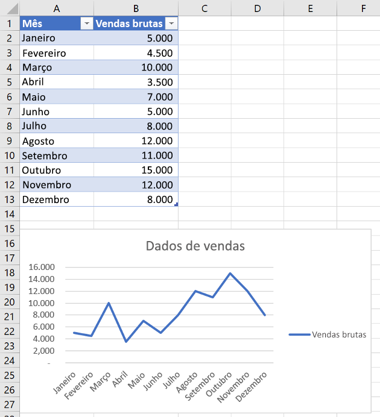
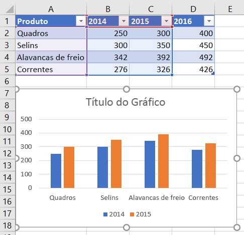
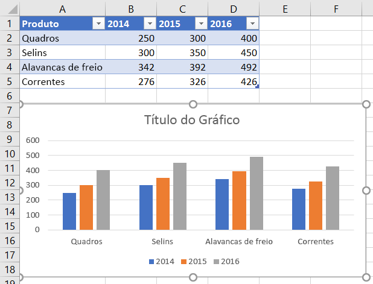
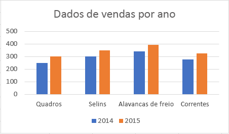
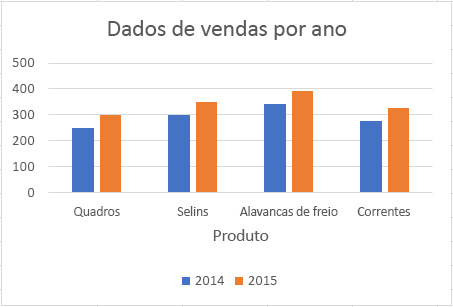
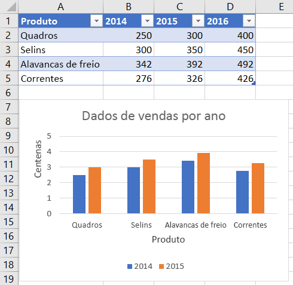
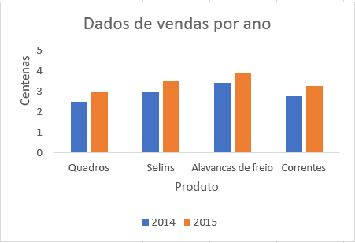
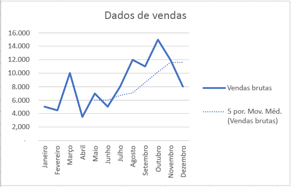
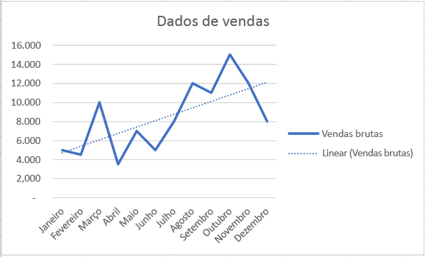

# <a name="work-with-charts-using-the-excel-javascript-api"></a><span data-ttu-id="fba91-102">Trabalhar com gr?ficos usando a API JavaScript do Excel</span><span class="sxs-lookup"><span data-stu-id="fba91-102">Work with Charts using the Excel JavaScript API</span></span>

<span data-ttu-id="fba91-103">Este artigo fornece exemplos de c?digo que mostram como executar tarefas comuns com gr?ficos usando a API JavaScript do Excel.</span><span class="sxs-lookup"><span data-stu-id="fba91-103">This article provides code samples that show how to perform common tasks with charts using the Excel JavaScript API.</span></span> <span data-ttu-id="fba91-104">Para obter a lista completa de propriedades e m?todos aos quais os objetos **Chart** e **ChartCollection** d?o suporte, confira [Objeto Chart (API JavaScript para Excel)](https://dev.office.com/reference/add-ins/excel/chart) e [Objeto Chart Collection (API JavaScript para Excel)](https://dev.office.com/reference/add-ins/excel/chartcollection).</span><span class="sxs-lookup"><span data-stu-id="fba91-104">For the complete list of properties and methods that the **Chart** and **ChartCollection** objects support, see [Chart Object (JavaScript API for Excel)](https://dev.office.com/reference/add-ins/excel/chart) and [Chart Collection Object (JavaScript API for Excel)](https://dev.office.com/reference/add-ins/excel/chartcollection).</span></span>

## <a name="create-a-chart"></a><span data-ttu-id="fba91-105">Criar um gr?fico</span><span class="sxs-lookup"><span data-stu-id="fba91-105">Create a chart</span></span>

<span data-ttu-id="fba91-106">O exemplo de c?digo a seguir cria um gr?fico na planilha chamada **Amostra**.</span><span class="sxs-lookup"><span data-stu-id="fba91-106">The following code sample creates a chart in the worksheet named **Sample**.</span></span> <span data-ttu-id="fba91-107">O gr?fico ? de **Linha** e se baseia em dados do intervalo **A1:B13**.</span><span class="sxs-lookup"><span data-stu-id="fba91-107">The chart is a **Line** chart that is based upon data in the range **A1:B13**.</span></span>

```js
Excel.run(function (context) {
    var sheet = context.workbook.worksheets.getItem("Sample");
    var dataRange = sheet.getRange("A1:B13");
    var chart = sheet.charts.add("Line", dataRange, "auto");

    chart.title.text = "Sales Data";
    chart.legend.position = "right"
    chart.legend.format.fill.setSolidColor("white");
    chart.dataLabels.format.font.size = 15;
    chart.dataLabels.format.font.color = "black";

    return context.sync();
}).catch(errorHandlerFunction);
```

<span data-ttu-id="fba91-108">**Novo gr?fico de linhas**</span><span class="sxs-lookup"><span data-stu-id="fba91-108">**New line chart**</span></span>




## <a name="add-a-data-series-to-a-chart"></a><span data-ttu-id="fba91-110">Adicionar uma s?rie de dados a um gr?fico</span><span class="sxs-lookup"><span data-stu-id="fba91-110">Add a data series to a chart</span></span>

<span data-ttu-id="fba91-111">O exemplo de c?digo a seguir adiciona uma s?rie de dados ao primeiro gr?fico na planilha.</span><span class="sxs-lookup"><span data-stu-id="fba91-111">The following code sample adds a data series to the first chart in the worksheet.</span></span> <span data-ttu-id="fba91-112">A nova s?rie de dados corresponde ? coluna chamada **2016** e baseia-se em dados do intervalo **D2:D5**.</span><span class="sxs-lookup"><span data-stu-id="fba91-112">The new data series corresponds to the column named **2016** and is based upon data in the range **D2:D5**.</span></span>

> [!NOTE]
> <span data-ttu-id="fba91-113">Essa amostra usa APIs que s? est?o dispon?veis na vers?o pr?via p?blica (beta) no momento.</span><span class="sxs-lookup"><span data-stu-id="fba91-113">This sample uses APIs that are currently available only in public preview (beta).</span></span> <span data-ttu-id="fba91-114">Para executar essa amostra, voc? deve usar a biblioteca beta do CDN do Office.js: https://appsforoffice.microsoft.com/lib/beta/hosted/office.js.</span><span class="sxs-lookup"><span data-stu-id="fba91-114">To run this sample, you must use the beta library of the Office.js CDN: https://appsforoffice.microsoft.com/lib/beta/hosted/office.js.</span></span>

```js
Excel.run(function (context) {
    var sheet = context.workbook.worksheets.getItem("Sample");
    var chart = sheet.charts.getItemAt(0);
    var dataRange = sheet.getRange("D2:D5");

    var newSeries = chart.series.add("2016");
    newSeries.setValues(dataRange);

    return context.sync();
}).catch(errorHandlerFunction);
```

<span data-ttu-id="fba91-115">**Gr?fico antes da adi??o da s?rie de dados de 2016**</span><span class="sxs-lookup"><span data-stu-id="fba91-115">**Chart before the 2016 data series is added**</span></span>



<span data-ttu-id="fba91-117">**Gr?fico ap?s a adi??o da s?rie de dados de 2016**</span><span class="sxs-lookup"><span data-stu-id="fba91-117">**Chart after the 2016 data series is added**</span></span>



## <a name="set-chart-title"></a><span data-ttu-id="fba91-119">Definir t?tulo do gr?fico</span><span class="sxs-lookup"><span data-stu-id="fba91-119">Set chart title</span></span>

<span data-ttu-id="fba91-120">O exemplo de c?digo a seguir define o t?tulo do primeiro gr?fico na planilha para **Sales Data by Year**.</span><span class="sxs-lookup"><span data-stu-id="fba91-120">The following code sample sets the title of the first chart in the worksheet to **Sales Data by Year**.</span></span> 

```js
Excel.run(function (context) {
    var sheet = context.workbook.worksheets.getItem("Sample");

    var chart = sheet.charts.getItemAt(0);
    chart.title.text = "Sales Data by Year";

    return context.sync();
}).catch(errorHandlerFunction);
```

<span data-ttu-id="fba91-121">**Gr?fico ap?s defini??o do t?tulo**</span><span class="sxs-lookup"><span data-stu-id="fba91-121">**Chart after title is set**</span></span>



## <a name="set-properties-of-an-axis-in-a-chart"></a><span data-ttu-id="fba91-123">Definir propriedades de um eixo em um gr?fico</span><span class="sxs-lookup"><span data-stu-id="fba91-123">Set properties of an axis in a chart</span></span>

<span data-ttu-id="fba91-124">Os gr?ficos que usam o [Sistema de coordenadas cartesiano](https://en.wikipedia.org/wiki/Cartesian_coordinate_system), como gr?ficos de colunas, gr?fico de barras e gr?ficos de dispers?o cont?m um eixo de categorias e um eixo de valores.</span><span class="sxs-lookup"><span data-stu-id="fba91-124">Charts that use the [Cartesian coordinate system](https://en.wikipedia.org/wiki/Cartesian_coordinate_system) such as column charts, bar charts, and scatter charts contain a category axis and a value axis.</span></span> <span data-ttu-id="fba91-125">Estes exemplos mostram como definir o t?tulo e exibem a unidade de um eixo em um gr?fico.</span><span class="sxs-lookup"><span data-stu-id="fba91-125">These examples show how to set the title and display unit of an axis in a chart.</span></span>

### <a name="set-axis-title"></a><span data-ttu-id="fba91-126">Definir t?tulo do eixo</span><span class="sxs-lookup"><span data-stu-id="fba91-126">Set axis title</span></span>

<span data-ttu-id="fba91-127">O exemplo de c?digo a seguir define o t?tulo do eixo das categorias para o primeiro gr?fico na planilha como **Product**.</span><span class="sxs-lookup"><span data-stu-id="fba91-127">The following code sample sets the title of the category axis for the first chart in the worksheet to **Product**.</span></span>

```js
Excel.run(function (context) {
    var sheet = context.workbook.worksheets.getItem("Sample");

    var chart = sheet.charts.getItemAt(0);
    chart.axes.categoryAxis.title.text = "Product";

    return context.sync();
}).catch(errorHandlerFunction);
```

<span data-ttu-id="fba91-128">**Gr?fico ap?s defini??o do t?tulo do eixo das categorias**</span><span class="sxs-lookup"><span data-stu-id="fba91-128">**Chart after title of category axis is set**</span></span>



### <a name="set-axis-display-unit"></a><span data-ttu-id="fba91-130">Definir unidade de exibi??o do eixo</span><span class="sxs-lookup"><span data-stu-id="fba91-130">Set axis display unit</span></span>

<span data-ttu-id="fba91-131">O exemplo de c?digo a seguir define a unidade de exibi??o do eixo dos valores para o primeiro gr?fico na planilha como **Hundreds**.</span><span class="sxs-lookup"><span data-stu-id="fba91-131">The following code sample sets the display unit of the value axis for the first chart in the worksheet to **Hundreds**.</span></span>

> [!NOTE]
> <span data-ttu-id="fba91-132">Essa amostra usa APIs que s? est?o dispon?veis na vers?o pr?via p?blica (beta) no momento.</span><span class="sxs-lookup"><span data-stu-id="fba91-132">This sample uses APIs that are currently available only in public preview (beta).</span></span> <span data-ttu-id="fba91-133">Para executar essa amostra, voc? deve usar a biblioteca beta do CDN do Office.js: https://appsforoffice.microsoft.com/lib/beta/hosted/office.js.</span><span class="sxs-lookup"><span data-stu-id="fba91-133">To run this sample, you must use the beta library of the Office.js CDN: https://appsforoffice.microsoft.com/lib/beta/hosted/office.js.</span></span>

```js
Excel.run(function (context) {
    var sheet = context.workbook.worksheets.getItem("Sample");

    var chart = sheet.charts.getItemAt(0);
    chart.axes.valueAxis.displayUnit = "Hundreds";

    return context.sync();
}).catch(errorHandlerFunction);
```

<span data-ttu-id="fba91-134">**Gr?fico ap?s a defini??o da unidade de exibi??o do eixo dos valores**</span><span class="sxs-lookup"><span data-stu-id="fba91-134">**Chart after display unit of value axis is set**</span></span>



## <a name="set-visibility-of-gridlines-in-a-chart"></a><span data-ttu-id="fba91-136">Definir visibilidade de linhas de grade em um gr?fico</span><span class="sxs-lookup"><span data-stu-id="fba91-136">Set visibility of gridlines in a chart</span></span>

<span data-ttu-id="fba91-137">O exemplo de c?digo a seguir oculta as principais linhas de grade para o eixo dos valores do primeiro gr?fico na planilha.</span><span class="sxs-lookup"><span data-stu-id="fba91-137">The following code sample hides the major gridlines for the value axis of the first chart in the worksheet.</span></span> <span data-ttu-id="fba91-138">Voc? pode mostrar as principais linhas de grade do eixo dos valores do gr?fico, definindo `chart.axes.valueAxis.majorGridlines.visible` como **true**.</span><span class="sxs-lookup"><span data-stu-id="fba91-138">You can show the major gridlines for the value axis of the chart, by setting `chart.axes.valueAxis.majorGridlines.visible` to **true**.</span></span>

```js
Excel.run(function (context) {
    var sheet = context.workbook.worksheets.getItem("Sample");

    var chart = sheet.charts.getItemAt(0);
    chart.axes.valueAxis.majorGridlines.visible = false;

    return context.sync();
}).catch(errorHandlerFunction);
```

<span data-ttu-id="fba91-139">**Gr?fico com linhas de grade ocultas**</span><span class="sxs-lookup"><span data-stu-id="fba91-139">**Chart with gridlines hidden**</span></span>



## <a name="chart-trendlines"></a><span data-ttu-id="fba91-141">Linhas de tend?ncia do gr?fico</span><span class="sxs-lookup"><span data-stu-id="fba91-141">Chart trendlines</span></span>

### <a name="add-a-trendline"></a><span data-ttu-id="fba91-142">Adicionar uma linha de tend?ncia</span><span class="sxs-lookup"><span data-stu-id="fba91-142">Add a trendline</span></span>

<span data-ttu-id="fba91-p108">O exemplo de c?digo a seguir adiciona uma linha de tend?ncia de m?dia m?vel ? primeira s?rie no primeiro gr?fico da planilha chamada **Amostra**. A linha de tend?ncia mostra uma m?dia m?vel de cinco per?odos.</span><span class="sxs-lookup"><span data-stu-id="fba91-p108">The following code sample adds a moving average trendline to the first series in the first chart in the worksheet named **Sample**. The trendline shows a moving average over 5 periods.</span></span>

> [!NOTE]
> <span data-ttu-id="fba91-145">Essa amostra usa APIs que s? est?o dispon?veis na vers?o pr?via p?blica (beta) no momento.</span><span class="sxs-lookup"><span data-stu-id="fba91-145">This sample uses APIs that are currently available only in public preview (beta).</span></span> <span data-ttu-id="fba91-146">Para executar essa amostra, voc? deve usar a biblioteca beta do CDN do Office.js: https://appsforoffice.microsoft.com/lib/beta/hosted/office.js.</span><span class="sxs-lookup"><span data-stu-id="fba91-146">To run this sample, you must use the beta library of the Office.js CDN: https://appsforoffice.microsoft.com/lib/beta/hosted/office.js.</span></span>

```js
Excel.run(function (context) {
    var sheet = context.workbook.worksheets.getItem("Sample");

    var chart = sheet.charts.getItemAt(0);
    var seriesCollection = chart.series;
    seriesCollection.getItemAt(0).trendlines.add("MovingAverage").movingAveragePeriod = 5;

    return context.sync();
}).catch(errorHandlerFunction);
```

<span data-ttu-id="fba91-147">**Gr?fico com linha de tend?ncia de m?dia m?vel**</span><span class="sxs-lookup"><span data-stu-id="fba91-147">**Chart with moving average trendline**</span></span>



### <a name="update-a-trendline"></a><span data-ttu-id="fba91-149">Atualizar uma linha de tend?ncia</span><span class="sxs-lookup"><span data-stu-id="fba91-149">Update a trendline</span></span>

<span data-ttu-id="fba91-150">O exemplo de c?digo a seguir define a linha de tend?ncia para o tipo **Linear** para a primeira s?rie no primeiro gr?fico da planilha chamada **Amostra**.</span><span class="sxs-lookup"><span data-stu-id="fba91-150">The following code sample sets the trendline to type **Linear** for the first series in the first chart in the worksheet named **Sample**.</span></span>

> [!NOTE]
> <span data-ttu-id="fba91-151">Essa amostra usa APIs que s? est?o dispon?veis na vers?o pr?via p?blica (beta) no momento.</span><span class="sxs-lookup"><span data-stu-id="fba91-151">This sample uses APIs that are currently available only in public preview (beta).</span></span> <span data-ttu-id="fba91-152">Para executar essa amostra, voc? deve usar a biblioteca beta do CDN do Office.js: https://appsforoffice.microsoft.com/lib/beta/hosted/office.js.</span><span class="sxs-lookup"><span data-stu-id="fba91-152">To run this sample, you must use the beta library of the Office.js CDN: https://appsforoffice.microsoft.com/lib/beta/hosted/office.js.</span></span>

```js
Excel.run(function (context) {
    var sheet = context.workbook.worksheets.getItem("Sample");

    var chart = sheet.charts.getItemAt(0);
    var seriesCollection = chart.series;
    var series = seriesCollection.getItemAt(0);
    series.trendlines.getItem(0).type = "Linear";

    return context.sync();
}).catch(errorHandlerFunction);
```

<span data-ttu-id="fba91-153">**Gr?fico com linha de tend?ncia linear**</span><span class="sxs-lookup"><span data-stu-id="fba91-153">**Chart with linear trendline**</span></span>



## <a name="see-also"></a><span data-ttu-id="fba91-155">Veja tamb?m</span><span class="sxs-lookup"><span data-stu-id="fba91-155">See also</span></span>

- [<span data-ttu-id="fba91-156">Principais conceitos da API JavaScript do Excel</span><span class="sxs-lookup"><span data-stu-id="fba91-156">Excel JavaScript API core concepts</span></span>](excel-add-ins-core-concepts.md)
- [<span data-ttu-id="fba91-157">Objeto Chart (API JavaScript para Excel)</span><span class="sxs-lookup"><span data-stu-id="fba91-157">Chart Object (JavaScript API for Excel)</span></span>](https://dev.office.com/reference/add-ins/excel/chart) 
- [<span data-ttu-id="fba91-158">Objeto Chart Collection (API JavaScript para Excel)</span><span class="sxs-lookup"><span data-stu-id="fba91-158">Chart Collection Object (JavaScript API for Excel)</span></span>](https://dev.office.com/reference/add-ins/excel/chartcollection)