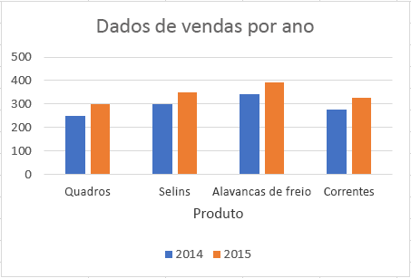

# <a name="work-with-charts-using-the-excel-javascript-api"></a><span data-ttu-id="03efb-102">Trabalhar com gráficos usando a API JavaScript do Excel</span><span class="sxs-lookup"><span data-stu-id="03efb-102">Work with Charts using the Excel JavaScript API</span></span>

<span data-ttu-id="03efb-103">Este artigo fornece exemplos de código que mostram como executar tarefas comuns com gráficos usando a API JavaScript do Excel.</span><span class="sxs-lookup"><span data-stu-id="03efb-103">This article provides code samples that show how to perform common tasks with charts using the Excel JavaScript API.</span></span> <span data-ttu-id="03efb-104">Para obter a lista completa de propriedades e métodos aos quais os objetos **Chart** e **ChartCollection** dão suporte, confira [Objeto Chart (API JavaScript para Excel)](https://docs.microsoft.com/javascript/api/excel/excel.chart) e [Objeto Chart Collection (API JavaScript para Excel)](https://docs.microsoft.com/javascript/api/excel/excel.chartcollection).</span><span class="sxs-lookup"><span data-stu-id="03efb-104">For the complete list of properties and methods that the **Chart** and **ChartCollection** objects support, see [Chart Object (JavaScript API for Excel)](https://docs.microsoft.com/javascript/api/excel/excel.chart) and [Chart Collection Object (JavaScript API for Excel)](https://docs.microsoft.com/javascript/api/excel/excel.chartcollection).</span></span>

## <a name="create-a-chart"></a><span data-ttu-id="03efb-105">Criar um gráfico</span><span class="sxs-lookup"><span data-stu-id="03efb-105">Create a chart</span></span>

<span data-ttu-id="03efb-106">O exemplo de código a seguir cria um gráfico na planilha chamada **Amostra**.</span><span class="sxs-lookup"><span data-stu-id="03efb-106">The following code sample creates a chart in the worksheet named **Sample**.</span></span> <span data-ttu-id="03efb-107">O gráfico é de **Linha** e se baseia em dados do intervalo **A1:B13**.</span><span class="sxs-lookup"><span data-stu-id="03efb-107">The chart is a **Line** chart that is based upon data in the range **A1:B13**.</span></span>

```js
Excel.run(function (context) {
    var sheet = context.workbook.worksheets.getItem("Sample");
    var dataRange = sheet.getRange("A1:B13");
    var chart = sheet.charts.add("Line", dataRange, "auto");

    chart.title.text = "Sales Data";
    chart.legend.position = "right"
    chart.legend.format.fill.setSolidColor("white");
    chart.dataLabels.format.font.size = 15;
    chart.dataLabels.format.font.color = "black";

    return context.sync();
}).catch(errorHandlerFunction);
```

<span data-ttu-id="03efb-108">**Novo gráfico de linhas**</span><span class="sxs-lookup"><span data-stu-id="03efb-108">**New line chart**</span></span>


## <a name="add-a-data-series-to-a-chart"></a><span data-ttu-id="03efb-110">Adicionar uma série de dados a um gráfico</span><span class="sxs-lookup"><span data-stu-id="03efb-110">Add a data series to a chart</span></span>

<span data-ttu-id="03efb-111">O exemplo de código a seguir adiciona uma série de dados ao primeiro gráfico na planilha.</span><span class="sxs-lookup"><span data-stu-id="03efb-111">The following code sample adds a data series to the first chart in the worksheet.</span></span> <span data-ttu-id="03efb-112">A nova série de dados corresponde à coluna chamada **2016** e baseia-se em dados do intervalo **D2:D5**.</span><span class="sxs-lookup"><span data-stu-id="03efb-112">The new data series corresponds to the column named **2016** and is based upon data in the range **D2:D5**.</span></span>

```js
Excel.run(function (context) {
    var sheet = context.workbook.worksheets.getItem("Sample");
    var chart = sheet.charts.getItemAt(0);
    var dataRange = sheet.getRange("D2:D5");

    var newSeries = chart.series.add("2016");
    newSeries.setValues(dataRange);

    return context.sync();
}).catch(errorHandlerFunction);
```

<span data-ttu-id="03efb-113">**Gráfico antes da adição da série de dados de 2016**</span><span class="sxs-lookup"><span data-stu-id="03efb-113">**Chart before the 2016 data series is added**</span></span>


<span data-ttu-id="03efb-115">**Gráfico após a adição da série de dados de 2016**</span><span class="sxs-lookup"><span data-stu-id="03efb-115">**Chart after the 2016 data series is added**</span></span>


## <a name="set-chart-title"></a><span data-ttu-id="03efb-117">Definir título do gráfico</span><span class="sxs-lookup"><span data-stu-id="03efb-117">Set chart title</span></span>

<span data-ttu-id="03efb-118">O exemplo de código a seguir define o título do primeiro gráfico na planilha para **Sales Data by Year**.</span><span class="sxs-lookup"><span data-stu-id="03efb-118">The following code sample sets the title of the first chart in the worksheet to **Sales Data by Year**.</span></span> 

```js
Excel.run(function (context) {
    var sheet = context.workbook.worksheets.getItem("Sample");

    var chart = sheet.charts.getItemAt(0);
    chart.title.text = "Sales Data by Year";

    return context.sync();
}).catch(errorHandlerFunction);
```

<span data-ttu-id="03efb-119">**Gráfico após definição do título**</span><span class="sxs-lookup"><span data-stu-id="03efb-119">**Chart after title is set**</span></span>


## <a name="set-properties-of-an-axis-in-a-chart"></a><span data-ttu-id="03efb-121">Definir propriedades de um eixo em um gráfico</span><span class="sxs-lookup"><span data-stu-id="03efb-121">Set properties of an axis in a chart</span></span>

<span data-ttu-id="03efb-122">Os gráficos que usam o [Sistema de coordenadas cartesiano](https://en.wikipedia.org/wiki/Cartesian_coordinate_system), como gráficos de colunas, gráfico de barras e gráficos de dispersão contêm um eixo de categorias e um eixo de valores.</span><span class="sxs-lookup"><span data-stu-id="03efb-122">Charts that use the [Cartesian coordinate system](https://en.wikipedia.org/wiki/Cartesian_coordinate_system) such as column charts, bar charts, and scatter charts contain a category axis and a value axis.</span></span> <span data-ttu-id="03efb-123">Estes exemplos mostram como definir o título e exibem a unidade de um eixo em um gráfico.</span><span class="sxs-lookup"><span data-stu-id="03efb-123">These examples show how to set the title and display unit of an axis in a chart.</span></span>

### <a name="set-axis-title"></a><span data-ttu-id="03efb-124">Definir título do eixo</span><span class="sxs-lookup"><span data-stu-id="03efb-124">Set axis title</span></span>

<span data-ttu-id="03efb-125">O exemplo de código a seguir define o título do eixo das categorias para o primeiro gráfico na planilha como **Product**.</span><span class="sxs-lookup"><span data-stu-id="03efb-125">The following code sample sets the title of the category axis for the first chart in the worksheet to **Product**.</span></span>

```js
Excel.run(function (context) {
    var sheet = context.workbook.worksheets.getItem("Sample");

    var chart = sheet.charts.getItemAt(0);
    chart.axes.categoryAxis.title.text = "Product";

    return context.sync();
}).catch(errorHandlerFunction);
```

<span data-ttu-id="03efb-126">**Gráfico após definição do título do eixo das categorias**</span><span class="sxs-lookup"><span data-stu-id="03efb-126">**Chart after title of category axis is set**</span></span>



### <a name="set-axis-display-unit"></a><span data-ttu-id="03efb-128">Definir unidade de exibição do eixo</span><span class="sxs-lookup"><span data-stu-id="03efb-128">Set axis display unit</span></span>

<span data-ttu-id="03efb-129">O exemplo de código a seguir define a unidade de exibição do eixo de valor para o primeiro gráfico na planilha para **centenas**.</span><span class="sxs-lookup"><span data-stu-id="03efb-129">The following code sample sets the display unit of the value axis for the first chart in the worksheet to **Hundreds**.</span></span>

```js
Excel.run(function (context) {
    var sheet = context.workbook.worksheets.getItem("Sample");

    var chart = sheet.charts.getItemAt(0);
    chart.axes.valueAxis.displayUnit = "Hundreds";

    return context.sync();
}).catch(errorHandlerFunction);
```

<span data-ttu-id="03efb-130">**Gráfico após a definição da unidade de exibição do eixo de valor**</span><span class="sxs-lookup"><span data-stu-id="03efb-130">**Chart after display unit of value axis is set**</span></span>


## <a name="set-visibility-of-gridlines-in-a-chart"></a><span data-ttu-id="03efb-132">Definir visibilidade de linhas de grade em um gráfico</span><span class="sxs-lookup"><span data-stu-id="03efb-132">Set visibility of gridlines in a chart</span></span>

<span data-ttu-id="03efb-133">O exemplo de código a seguir oculta as principais linhas de grade para o eixo dos valores do primeiro gráfico na planilha.</span><span class="sxs-lookup"><span data-stu-id="03efb-133">The following code sample hides the major gridlines for the value axis of the first chart in the worksheet.</span></span> <span data-ttu-id="03efb-134">Você pode mostrar as principais linhas de grade do eixo dos valores do gráfico, definindo `chart.axes.valueAxis.majorGridlines.visible` como **true**.</span><span class="sxs-lookup"><span data-stu-id="03efb-134">You can show the major gridlines for the value axis of the chart, by setting `chart.axes.valueAxis.majorGridlines.visible` to **true**.</span></span>

```js
Excel.run(function (context) {
    var sheet = context.workbook.worksheets.getItem("Sample");

    var chart = sheet.charts.getItemAt(0);
    chart.axes.valueAxis.majorGridlines.visible = false;

    return context.sync();
}).catch(errorHandlerFunction);
```

<span data-ttu-id="03efb-135">**Gráfico com linhas de grade ocultas**</span><span class="sxs-lookup"><span data-stu-id="03efb-135">**Chart with gridlines hidden**</span></span>


## <a name="chart-trendlines"></a><span data-ttu-id="03efb-137">Linhas de tendência do gráfico</span><span class="sxs-lookup"><span data-stu-id="03efb-137">Chart trendlines</span></span>

### <a name="add-a-trendline"></a><span data-ttu-id="03efb-138">Adicionar uma linha de tendência</span><span class="sxs-lookup"><span data-stu-id="03efb-138">Add a trendline</span></span>

<span data-ttu-id="03efb-p106">O exemplo de código a seguir adiciona uma linha de tendência de média móvel à primeira série no primeiro gráfico da planilha chamada **Amostra**. A linha de tendência mostra uma média móvel de cinco períodos.</span><span class="sxs-lookup"><span data-stu-id="03efb-p106">The following code sample adds a moving average trendline to the first series in the first chart in the worksheet named **Sample**. The trendline shows a moving average over 5 periods.</span></span>

```js
Excel.run(function (context) {
    var sheet = context.workbook.worksheets.getItem("Sample");

    var chart = sheet.charts.getItemAt(0);
    var seriesCollection = chart.series;
    seriesCollection.getItemAt(0).trendlines.add("MovingAverage").movingAveragePeriod = 5;

    return context.sync();
}).catch(errorHandlerFunction);
```

<span data-ttu-id="03efb-141">**Gráfico com linha de tendência de média móvel**</span><span class="sxs-lookup"><span data-stu-id="03efb-141">**Chart with moving average trendline**</span></span>


### <a name="update-a-trendline"></a><span data-ttu-id="03efb-143">Atualizar uma linha de tendência</span><span class="sxs-lookup"><span data-stu-id="03efb-143">Update a trendline</span></span>

<span data-ttu-id="03efb-144">O exemplo de código a seguir define a linha de tendência para o tipo **Linear** para a primeira série no primeiro gráfico da planilha chamada **Amostra**.</span><span class="sxs-lookup"><span data-stu-id="03efb-144">The following code sample sets the trendline to type **Linear** for the first series in the first chart in the worksheet named **Sample**.</span></span>

```js
Excel.run(function (context) {
    var sheet = context.workbook.worksheets.getItem("Sample");

    var chart = sheet.charts.getItemAt(0);
    var seriesCollection = chart.series;
    var series = seriesCollection.getItemAt(0);
    series.trendlines.getItem(0).type = "Linear";

    return context.sync();
}).catch(errorHandlerFunction);
```

<span data-ttu-id="03efb-145">**Gráfico com linha de tendência linear**</span><span class="sxs-lookup"><span data-stu-id="03efb-145">**Chart with linear trendline**</span></span>


## <a name="see-also"></a><span data-ttu-id="03efb-147">Confira também</span><span class="sxs-lookup"><span data-stu-id="03efb-147">See also</span></span>

- [<span data-ttu-id="03efb-148">Conceitos fundamentais de programação com a API JavaScript do Excel</span><span class="sxs-lookup"><span data-stu-id="03efb-148">Fundamental programming concepts with the Excel JavaScript API</span></span>](excel-add-ins-core-concepts.md)
