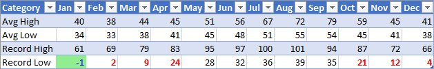

# <a name="apply-conditional-formatting-to-excel-ranges"></a>Aplicar formatação condicional a intervalos do Excel

A Biblioteca de JavaScript do Excel fornece APIs para aplicar a formatação condicional aos intervalos de dados nas suas planilhas. Esse recurso simplifica a visualização da análise de grandes conjuntos de dados. A formatação também atualiza dinamicamente com base nas alterações no intervalo.

> [!NOTE]
> Este artigo aborda a formatação condicional no contexto dos suplementos do JavaScript do Excel. Os artigos a seguir fornecem informações detalhadas sobre os recursos completos de formatação condicionais do Excel.
> -  [Adicionar, alterar ou limpar formatações condicionais](https://support.office.com/article/add-change-or-clear-conditional-formats-8a1cc355-b113-41b7-a483-58460332a1af)
> -  [Use fórmulas com o acesso condicional](https://support.office.com/article/Use-formulas-with-conditional-formatting-FED60DFA-1D3F-4E13-9ECB-F1951FF89D7F)

## <a name="programmatic-control-of-conditional-formatting"></a>Controle de programação de formatação condicional

A `Range.conditionalFormats` propriedade é uma coleção de objetos [ConditionalFormat](/javascript/api/excel/excel.conditionalformat) que se aplicam ao intervalo.  O `ConditionalFormat` objeto contém várias propriedades que definem o formato a ser aplicado com o [ConditionalFormatType](/javascript/api/excel/excel.conditionalformattype).

-    `cellValue`
-    `colorScale`
-    `custom`
-    `dataBar`
-    `iconSet`
-    `preset`
-    `textComparison`
-    `topBottom`

> [!NOTE]
> Cada uma das seguintes propriedades de formatação tem uma variante `*OrNullObject` correspondente. Saiba mais sobre esse padrão na [ \* seção Métodos OrNullObject.](../develop/application-specific-api-model.md#ornullobject-methods-and-properties)

Somente um tipo de formato pode ser definido para o objeto ConditionalFormat. Isso é determinado pela `type` propriedade, que é uma enumeração de valor[ConditionalFormatType](/javascript/api/excel/excel.conditionalformattype). `type` é definido quando um formato condicional para um intervalo é adicionado.

## <a name="creating-conditional-formatting-rules"></a>Criando regras de formatação condicional

Formatos condicionais são adicionados a um intervalo usando `conditionalFormats.add`. Após a adição, propriedades específicas podem ser definidas  para o formato condicional. Os exemplos a seguir mostram a criação de diferentes tipos de formatação.

### <a name="cell-value"></a>[Valor da célula](/javascript/api/excel/excel.cellvalueconditionalformat)

A formatação condicional de valor de célula aplica um formato definidas pelo usuário com base em uma ou duas fórmulas em [ConditionalCellValueRule](/javascript/api/excel/excel.conditionalcellvaluerule). A `operator` propriedade é um[ConditionalCellValueOperator](/javascript/api/excel/excel.conditionalcellvalueoperator) que define como expressões resultantes se relacionam com a formatação.

O exemplo a seguir mostra a cor de fonte vermelha aplicada a qualquer valor no intervalo menor que zero.


```typescript
const sheet = context.workbook.worksheets.getItem("Sample");
const range = sheet.getRange("B21:E23");
const conditionalFormat = range.conditionalFormats.add(
    Excel.ConditionalFormatType.cellValue
);

// set the font of negative numbers to red
conditionalFormat.cellValue.format.font.color = "red";
conditionalFormat.cellValue.rule = { formula1: "=0", operator: "LessThan" };

await context.sync();
```

### <a name="color-scale"></a>[Escala de cores](/javascript/api/excel/excel.colorscaleconditionalformat)

Formatação condicional de escala de cores aplica um gradiente de cor para o intervalo de dados. A `criteria` propriedade na `ColorScaleConditionalFormat` define três [ConditionalColorScaleCriterion](/javascript/api/excel/excel.conditionalcolorscalecriterion): `minimum`, `maximum`e, opcionalmente, `midpoint`. Cada um dos pontos de escala critério têm três propriedades:

-    `color` – O código de cor HTML para o ponto de extremidade.
-    `formula` – Um número ou uma fórmula que representa o ponto de extremidade. Isso será `null` caso `type` está `lowestValue` ou `highestValue`.
-    `type` Como a fórmula deve ser avaliada. `highestValue` e `lowestValue` fazem referência a valores no intervalo a ser formatado.

O exemplo a seguir mostra um intervalo a ser colorido de azul para amarelo para vermelho. Observe que `minimum` e `maximum` são os valores mais altos e mais baixos, respectivamente e usam `null` fórmulas. `midpoint` está usando o `percentage` tipo com uma fórmula de `"=50"` então a célula yellowest é o valor médio.


```typescript
const sheet = context.workbook.worksheets.getItem("Sample");
const range = sheet.getRange("B2:M5");
const conditionalFormat = range.conditionalFormats.add(
      Excel.ConditionalFormatType.colorScale
);

// color the backgrounds of the cells from blue to yellow to red based on value
const criteria = {
      minimum: {
           formula: null,
           type: Excel.ConditionalFormatColorCriterionType.lowestValue,
           color: "blue"
      },
      midpoint: {
           formula: "50",
           type: Excel.ConditionalFormatColorCriterionType.percent,
           color: "yellow"
      },
      maximum: {
           formula: null,
           type: Excel.ConditionalFormatColorCriterionType.highestValue,
           color: "red"
      }
};
conditionalFormat.colorScale.criteria = criteria;

await context.sync();
```

### <a name="custom"></a>[Personalizados](/javascript/api/excel/excel.customconditionalformat)

A formatação condicional personalizada aplica um formato definido pelo usuário para as células com base em uma fórmula de complexidade arbitrária. O objeto [ConditionalFormatRule](/javascript/api/excel/excel.conditionalformatrule) permite que você defina a fórmula em notações diferentes:

-    `formula` -Anotação padrão.
-    `formulaLocal` - Localizado com base no idioma do usuário.
-    `formulaR1C1` -Notação estilo R1C1.

O exemplo de cores a seguir as fontes de verde nas células com valores maiores que a célula à esquerda.


```typescript
const sheet = context.workbook.worksheets.getItem("Sample");
const range = sheet.getRange("B8:E13");
const conditionalFormat = range.conditionalFormats.add(
     Excel.ConditionalFormatType.custom
);

// if a cell has a higher value than the one to its left, set that cell's font to green
conditionalFormat.custom.rule.formula = '=IF(B8>INDIRECT("RC[-1]",0),TRUE)';
conditionalFormat.custom.format.font.color = "green";

await context.sync();

```
### <a name="data-bar"></a>[Barra de dados](/javascript/api/excel/excel.databarconditionalformat)

A barra de formatação condicional de dados adiciona barras de dados nas células. Por padrão, os valores mínimos e máximos no intervalo formam limites e tamanhos proporcionais às barras de dados. O `DataBarConditionalFormat` objeto tem várias propriedades para controlar a aparência da barra. 

O exemplo a seguir formata o intervalo com barras de dados preenchidas da esquerda para a direita.


```typescript
const sheet = context.workbook.worksheets.getItem("Sample");
const range = sheet.getRange("B8:E13");
const conditionalFormat = range.conditionalFormats.add(
     Excel.ConditionalFormatType.dataBar
);

// give left-to-right, default-appearance data bars to all the cells
conditionalFormat.dataBar.barDirection = Excel.ConditionalDataBarDirection.leftToRight;
await context.sync();
```

### <a name="icon-set"></a>[Conjunto de ícones](/javascript/api/excel/excel.iconsetconditionalformat)

A formatação condicional do conjunto de ícones usa os [ícones](/javascript/api/excel/excel.icon) do Excel para realçar células. A `criteria` propriedade é uma matriz [ConditionalIconCriterion](/javascript/api/excel/excel.ConditionalIconCriterion), que define o símbolo a ser inserido e a condição em que ele é inserido. Essa matriz é automaticamente pré-preenchida com critério de elementos com propriedades padrão. Propriedades individuais não podem ser substituídas. Em vez disso, todo o objeto de critérios deve ser substituído. 

O exemplo a seguir mostra um conjunto de ícones de três triângulos aplicado ao intervalo.


```typescript
const sheet = context.workbook.worksheets.getItem("Sample");
const range = sheet.getRange("B8:E13");
const conditionalFormat = range.conditionalFormats.add(
     Excel.ConditionalFormatType.iconSet
);

const iconSetCF = conditionalFormat.iconSet;
iconSetCF.style = Excel.IconSet.threeTriangles;

/*
   With a "three*" icon set style, such as "threeTriangles", the third
    element in the criteria array (criteria[2]) defines the "top" icon;
    e.g., a green triangle. The second (criteria[1]) defines the "middle"
    icon, The first (criteria[0]) defines the "low" icon, but it can often 
    be left empty as this method does below, because every cell that
   does not match the other two criteria always gets the low icon.
*/
iconSetCF.criteria = [
    {} as any,
      {
        type: Excel.ConditionalFormatIconRuleType.number,
        operator: Excel.ConditionalIconCriterionOperator.greaterThanOrEqual,
        formula: "=700"
      },
      {
        type: Excel.ConditionalFormatIconRuleType.number,
        operator: Excel.ConditionalIconCriterionOperator.greaterThanOrEqual,
        formula: "=1000"
      }
];

await context.sync();
```

### <a name="preset-criteria"></a>[Critérios predefinidos](/javascript/api/excel/excel.presetcriteriaconditionalformat)

A formatação condicional predefinida aplica um formato definido pelo usuário ao intervalo com base em uma regra padrão selecionada. Essas regras são definidas pelo[ConditionalFormatPresetCriterion](/javascript/api/excel/excel.ConditionalFormatPresetCriterion) no [ConditionalPresetCriteriaRule](/javascript/api/excel/excel.conditionalpresetcriteriarule). 

O exemplo a seguir colore a fonte branca onde quer que o valor de uma célula seja pelo menos um desvio padrão acima da média do intervalo.


```typescript
const sheet = context.workbook.worksheets.getItem("Sample");
const range = sheet.getRange("B2:M5");
const conditionalFormat = range.conditionalFormats.add(
     Excel.ConditionalFormatType.presetCriteria
);

// color every cell's font white that is one standard deviation above average relative to the range
conditionalFormat.preset.format.font.color = "white";
conditionalFormat.preset.rule = {
     criterion: Excel.ConditionalFormatPresetCriterion.oneStdDevAboveAverage
};

await context.sync();
```

### <a name="text-comparison"></a>[Comparação de texto](/javascript/api/excel/excel.textconditionalformat)

A formatação condicional de texto comparação usa comparações de cadeias como condição. As`rule` propriedade é [ConditionalTextComparisonRule](/javascript/api/excel/excel.conditionaltextcomparisonrule) definindo uma cadeia de caracteres a ser comparada com a célula e um operador para especificar o tipo de comparação. 

O exemplo a seguir formata a cor da fonte vermelha quando o texto de uma célula contém "Atrasado".


```typescript
const sheet = context.workbook.worksheets.getItem("Sample");
const range = sheet.getRange("B16:D18");
const conditionalFormat = range.conditionalFormats.add(
     Excel.ConditionalFormatType.containsText
);

// color the font of every cell containing "Delayed"
conditionalFormat.textComparison.format.font.color = "red";
conditionalFormat.textComparison.rule = {
     operator: Excel.ConditionalTextOperator.contains,
     text: "Delayed"
};

await context.sync();
```

### <a name="topbottom"></a>[Superiores/inferiores](/javascript/api/excel/excel.TopBottomconditionalformat)

A formatação condicional superiores/inferiores aplica um formato para maiores ou menores valores em um intervalo. As `rule` propriedade é do tipo [ConditionalTopBottomRule](/javascript/api/excel/excel.conditionaltopbottomrule), define a condição se baseia no maior ou menor, e se a avaliação é ordenada ou na baseada na porcentagem. 

O exemplo a seguir aplica um destaque em verde na maior célula valor do intervalo.


```typescript
const sheet = context.workbook.worksheets.getItem("Sample");
const range = sheet.getRange("B21:E23");
const conditionalFormat = range.conditionalFormats.add(
     Excel.ConditionalFormatType.topBottom
);

// for the highest valued cell in the range, make the background green
conditionalFormat.topBottom.format.fill.color = "green"
conditionalFormat.topBottom.rule = { rank: 1, type: "TopItems"}

await context.sync();
```

## <a name="multiple-formats-and-priority"></a>Vários formatos e prioridades

Você pode aplicar vários formatos condicionais em um intervalo. Se os formatos tem elementos conflitantes, como cores de fonte diferentes apenas um formato aplica-se a esse elemento determinado. Precedência é definida pela propriedade `ConditionalFormat.priority`. Prioridade é um número (igual ao índice a `ConditionalFormatCollection`) e pode ser definido ao criar o formato. Quanto mais baixo o `priority` valor for, maior a prioridade do formato é.

O exemplo a seguir mostra uma opção de cor da fonte conflitante entre os dois formatos. Números negativos receberão uma fonte em negrito, mas não a fonte vermelha, porque a prioridade é o formato que oferece uma fonte azul.


```typescript
const sheet = context.workbook.worksheets.getItem("Sample");
const temperatureDataRange = sheet.tables.getItem("TemperatureTable").getDataBodyRange();


// Set low numbers to bold, dark red font and assign priority 1.
const presetFormat = temperatureDataRange.conditionalFormats
    .add(Excel.ConditionalFormatType.presetCriteria);
presetFormat.preset.format.font.color = "red";
presetFormat.preset.format.font.bold = true;
presetFormat.preset.rule = { criterion: Excel.ConditionalFormatPresetCriterion.oneStdDevBelowAverage };
presetFormat.priority = 1;

// Set negative numbers to blue font with green background and set priority 0.
const cellValueFormat = temperatureDataRange.conditionalFormats
    .add(Excel.ConditionalFormatType.cellValue);
cellValueFormat.cellValue.format.font.color = "blue";
cellValueFormat.cellValue.format.fill.color = "lightgreen";
cellValueFormat.cellValue.rule = { formula1: "=0", operator: "LessThan" };
cellValueFormat.priority = 0;

await context.sync();

```

### <a name="mutually-exclusive-conditional-formats"></a>Formatos condicionais mutuamente exclusivos 

As `stopIfTrue` propriedade de `ConditionalFormat` impede que os formatos condicionais de prioridade inferiores sejam aplicados ao intervalo. Quando um intervalo que corresponde ao formato condicional com `stopIfTrue === true` é aplicado, nenhum formato condicional subsequente é aplicado, mesmo se os detalhes da formatação não forem contraditórios.

O exemplo a seguir mostra dois formatos condicionais adicionados a um intervalo. Números negativos terão uma fonte azul com um fundo verde suave, independentemente da condição de formatação ser verdadeira.



```typescript
const sheet = context.workbook.worksheets.getItem("Sample");
const temperatureDataRange = sheet.tables.getItem("TemperatureTable").getDataBodyRange();

// Set low numbers to bold, dark red font and assign priority 1.
const presetFormat = temperatureDataRange.conditionalFormats
    .add(Excel.ConditionalFormatType.presetCriteria);
presetFormat.preset.format.font.color = "red";
presetFormat.preset.format.font.bold = true;
presetFormat.preset.rule = { criterion: Excel.ConditionalFormatPresetCriterion.oneStdDevBelowAverage };
presetFormat.priority = 1;

// Set negative numbers to blue font with green background and 
// set priority 0, but set stopIfTrue to true, so none of the 
// formatting of the conditional format with the higher priority
// value will apply, not even the bolding of the font.
const cellValueFormat = temperatureDataRange.conditionalFormats
    .add(Excel.ConditionalFormatType.cellValue);
cellValueFormat.cellValue.format.font.color = "blue";
cellValueFormat.cellValue.format.fill.color = "lightgreen";
cellValueFormat.cellValue.rule = { formula1: "=0", operator: "LessThan" };
cellValueFormat.priority = 0;
cellValueFormat.stopIfTrue = true;

await context.sync();
```

## <a name="see-also"></a>Confira também

- [Modelo de objeto JavaScript do Excel em Suplementos do Office](../excel/excel-add-ins-core-concepts.md)
- [Objeto ConditionalFormat (API JavaScript para Excel)](/javascript/api/excel/excel.conditionalformat)
- [Adicionar, alterar ou limpar formatações condicionais](https://support.office.com/article/add-change-or-clear-conditional-formats-8a1cc355-b113-41b7-a483-58460332a1af)
- [Use fórmulas com o acesso condicional](https://support.office.com/article/Use-formulas-with-conditional-formatting-FED60DFA-1D3F-4E13-9ECB-F1951FF89D7F)
