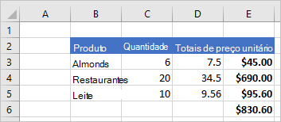
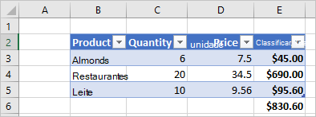
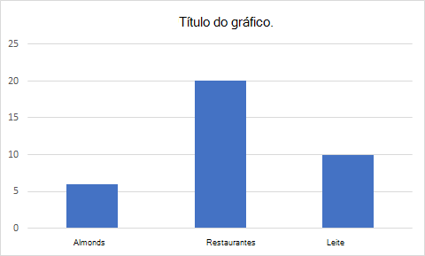

# <a name="excel-javascript-object-model-in-office-add-ins"></a>Modelo de objeto JavaScript do Excel em suplementos do Office

Este artigo descreve como usar a [API JavaScript do Excel](../reference/overview/excel-add-ins-reference-overview.md) para desenvolver suplementos para o Excel 2016 ou versões posteriores. Ele apresenta os conceitos básicos que são fundamentais para usar a API e fornece orientações para executar tarefas específicas, como leitura ou gravação em um intervalo grande, atualização de todas as células do intervalo e muito mais.

> [!IMPORTANT]
> Confira [Usar o modelo da API específica do aplicativo](../develop/application-specific-api-model.md) para saber mais sobre a natureza assíncrona das APIs do Excel e como elas funcionam com a pasta de trabalho.  

## <a name="officejs-apis-for-excel"></a>APIs Office.js para Excel

Um suplemento do Excel interage com objetos no Excel usando a API JavaScript do Office, que inclui dois modelos de objetos JavaScript:

* **API JavaScript do Excel**: introduzida com o Office 2016, a [API JavaScript do Excel](../reference/overview/excel-add-ins-reference-overview.md) fornece objetos fortemente tipados que você pode usar para acessar planilhas, intervalos, tabelas, gráficos e muito mais.

* **APIs Comuns**: Introduzida com o Office 2013, a [API Comum](/javascript/api/office) pode ser usada para acessar recursos como interface de usuário, caixas de diálogo e configurações de cliente, que são comuns entre vários tipos de aplicativos do Office.

Embora você provavelmente use a API JavaScript do Excel para desenvolver a maioria das funcionalidades em suplementos destinados ao Excel 2016 ou posterior, você também usará objetos na API Comum. Por exemplo:

* [Contexto](/javascript/api/office/office.context): o objeto `Context` representa o ambiente de tempo de execução do suplemento e oferece acesso aos principais objetos da API. Ele consiste em detalhes da configuração da pasta de trabalho, como `contentLanguage` e `officeTheme`, além de fornecer informações sobre o ambiente de tempo de execução do suplemento, como `host` e `platform`. Além disso, ele fornece o método `requirements.isSetSupported()`, que você pode usar para verificar se o conjunto de requisitos especificado é suportado pelo aplicativo Excel onde o suplemento está sendo executado.
* [Documento](/javascript/api/office/office.document): o objeto `Document` fornece o método `getFileAsync()`, que você pode usar para baixar o arquivo do Excel em que o suplemento está sendo executado.

A imagem a seguir ilustra quando você pode usar a API JavaScript do Excel ou as APIs comuns.


## <a name="excel-specific-object-model"></a>Modelo de objeto específico do Excel

Para entender as APIs do Excel, você deve entender como os componentes de uma pasta de trabalho estão relacionados entre si.

* Uma **Pasta de trabalho** contém uma ou mais **Planilhas**.
* Uma **Planilha** contém coleções desses objetos de dados que estão presentes na planilha individual e dá acesso às células por meio de **Intervalo** de objetos.
* Um **Intervalo** representa um grupo de células contíguas.
* Os **Intervalos** são usados para criar e colocar **Tabelas**, **Gráficos**, **Formas** e outras visualizações de dados ou objetos da organização.
* As **Pastas de trabalho** contêm coleções de alguns desses objetos de dados (por exemplo, **Tabelas**) para toda a **Pasta de trabalho**.

[!include[Excel cells and ranges note](../includes/note-excel-cells-and-ranges.md)]

### <a name="ranges"></a>Intervalos

Um intervalo é um grupo de células contíguas na pasta de trabalho. Os suplementos costumam usar uma notação estilo A1 (por ex.: **B3** para a única célula na coluna **B** e linha **3** ou **C2:F4** para as células das colunas **C** a **F** e linhas **2** a **4**) para definir intervalos.

Os intervalos têm três propriedades principais: `values`, `formulas` e `format`. Essas propriedades recebem ou definem os valores da célula, as fórmulas a serem avaliadas e a formatação visual das células.

#### <a name="range-sample"></a>Exemplo de intervalo

O exemplo a seguir mostra como criar registros de vendas. Essa função usa objetos `Range` para definir os valores, fórmulas e formatos.

```js
Excel.run(function (context) {
    var sheet = context.workbook.worksheets.getActiveWorksheet();

    // Create the headers and format them to stand out.
    var headers = [
      ["Product", "Quantity", "Unit Price", "Totals"]
    ];
    var headerRange = sheet.getRange("B2:E2");
    headerRange.values = headers;
    headerRange.format.fill.color = "#4472C4";
    headerRange.format.font.color = "white";

    // Create the product data rows.
    var productData = [
      ["Almonds", 6, 7.5],
      ["Coffee", 20, 34.5],
      ["Chocolate", 10, 9.56],
    ];
    var dataRange = sheet.getRange("B3:D5");
    dataRange.values = productData;

    // Create the formulas to total the amounts sold.
    var totalFormulas = [
      ["=C3 * D3"],
      ["=C4 * D4"],
      ["=C5 * D5"],
      ["=SUM(E3:E5)"]
    ];
    var totalRange = sheet.getRange("E3:E6");
    totalRange.formulas = totalFormulas;
    totalRange.format.font.bold = true;

    // Display the totals as US dollar amounts.
    totalRange.numberFormat = [["$0.00"]];

    return context.sync();
});
```

Este exemplo cria os dados a seguir na planilha atual.



Para obter mais informações, confira [Definir e obter valores de intervalo, texto ou fórmulas usando a API JavaScript do Excel](excel-add-ins-ranges-set-get-values.md).

### <a name="charts-tables-and-other-data-objects"></a>Gráficos, tabelas e outros objetos de dados

As APIs JavaScript do Excel podem criar e manipular estruturas de dados e visualizações no Excel. As tabelas e gráficos são dois dos objetos mais usados, mas as APIs oferecem suporte a tabelas dinâmicas, formas, imagens e muito mais.

#### <a name="creating-a-table"></a>Criar uma tabela

Crie tabelas usando intervalos preenchidos com dados. A formatação e os controles de tabela (como filtros) são automaticamente aplicados ao intervalo.

O exemplo a seguir cria uma tabela usando os intervalos do exemplo anterior.

```js
Excel.run(function (context) {
    var sheet = context.workbook.worksheets.getActiveWorksheet();
    sheet.tables.add("B2:E5", true);
    return context.sync();
});
```

O uso desse código de exemplo na planilha com os dados anteriores cria a tabela a seguir.



Para obter mais informações, confira [Trabalho com tabelas usando a API JavaScript do Excel](excel-add-ins-tables.md).

#### <a name="creating-a-chart"></a>Criar um gráfico

Crie gráficos para visualizar os dados em um intervalo. As APIs suportam inúmeras variedades de gráficos que podem ser personalizadas de acordo com suas necessidades.

O exemplo a seguir cria um gráfico de colunas simples para três itens e o coloca 100 pixels abaixo da parte superior da planilha.

```js
Excel.run(function (context) {
    var sheet = context.workbook.worksheets.getActiveWorksheet();
    var chart = sheet.charts.add(Excel.ChartType.columnStacked, sheet.getRange("B3:C5"));
    chart.top = 100;
    return context.sync();
});
```

Executar este exemplo na planilha com a tabela anterior cria o gráfico a seguir.



Para obter mais informações, confira [Trabalho com gráficos usando a API JavaScript do Excel](excel-add-ins-charts.md).

## <a name="see-also"></a>Confira também

* [Crie seu primeiro suplemento do Excel](../quickstarts/excel-quickstart-jquery.md)
* [Exemplos de código de suplementos do Excel](https://developer.microsoft.com/office/gallery/?filterBy=Samples,Excel)
* [Otimização de desempenho da API JavaScript do Excel](../excel/performance.md)
* [Referência da API JavaScript do Excel](../reference/overview/excel-add-ins-reference-overview.md)
