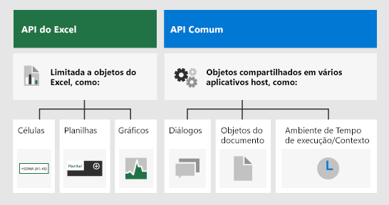

# <a name="excel-javascript-object-model-in-office-add-ins"></a><span data-ttu-id="8d6f5-103">Modelo de objeto JavaScript do Excel em suplementos do Office</span><span class="sxs-lookup"><span data-stu-id="8d6f5-103">Excel JavaScript object model in Office Add-ins</span></span>

<span data-ttu-id="8d6f5-104">Este artigo descreve como usar a [API JavaScript do Excel](../reference/overview/excel-add-ins-reference-overview.md) para desenvolver suplementos para o Excel 2016 ou versões posteriores.</span><span class="sxs-lookup"><span data-stu-id="8d6f5-104">This article describes how to use the [Excel JavaScript API](../reference/overview/excel-add-ins-reference-overview.md) to build add-ins for Excel 2016 or later.</span></span> <span data-ttu-id="8d6f5-105">Ele apresenta os conceitos básicos que são fundamentais para usar a API e fornece orientações para executar tarefas específicas, como leitura ou gravação em um intervalo grande, atualização de todas as células do intervalo e muito mais.</span><span class="sxs-lookup"><span data-stu-id="8d6f5-105">It introduces core concepts that are fundamental to using the API and provides guidance for performing specific tasks such as reading or writing to a large range, updating all cells in range, and more.</span></span>

> [!IMPORTANT]
> <span data-ttu-id="8d6f5-106">Confira [Usar o modelo da API específica do aplicativo](../develop/application-specific-api-model.md) para saber mais sobre a natureza assíncrona das APIs do Excel e como elas funcionam com a pasta de trabalho.</span><span class="sxs-lookup"><span data-stu-id="8d6f5-106">See [Using the application-specific API model](../develop/application-specific-api-model.md) to learn about the asynchronous nature of the Excel APIs and how they work with the workbook.</span></span>  

## <a name="officejs-apis-for-excel"></a><span data-ttu-id="8d6f5-107">APIs Office.js para Excel</span><span class="sxs-lookup"><span data-stu-id="8d6f5-107">Office.js APIs for Excel</span></span>

<span data-ttu-id="8d6f5-108">Um suplemento do Excel interage com objetos no Excel usando a API JavaScript do Office, que inclui dois modelos de objetos JavaScript:</span><span class="sxs-lookup"><span data-stu-id="8d6f5-108">An Excel add-in interacts with objects in Excel by using the Office JavaScript API, which includes two JavaScript object models:</span></span>

* <span data-ttu-id="8d6f5-109">**API JavaScript do Excel**: introduzida com o Office 2016, a [API JavaScript do Excel](../reference/overview/excel-add-ins-reference-overview.md) fornece objetos fortemente tipados que você pode usar para acessar planilhas, intervalos, tabelas, gráficos e muito mais.</span><span class="sxs-lookup"><span data-stu-id="8d6f5-109">**Excel JavaScript API**: Introduced with Office 2016, the [Excel JavaScript API](../reference/overview/excel-add-ins-reference-overview.md) provides strongly-typed objects that you can use to access worksheets, ranges, tables, charts, and more.</span></span>

* <span data-ttu-id="8d6f5-110">**APIs Comuns**: Introduzida com o Office 2013, a [API Comum](/javascript/api/office) pode ser usada para acessar recursos como interface de usuário, caixas de diálogo e configurações de cliente, que são comuns entre vários tipos de aplicativos do Office.</span><span class="sxs-lookup"><span data-stu-id="8d6f5-110">**Common APIs**: Introduced with Office 2013, the [Common API](/javascript/api/office) can be used to access features such as UI, dialogs, and client settings that are common across multiple types of Office applications.</span></span>

<span data-ttu-id="8d6f5-p102">Embora você provavelmente use a API JavaScript do Excel para desenvolver a maioria das funcionalidades em suplementos destinados ao Excel 2016 ou posterior, você também usará objetos na API Comum. Por exemplo:</span><span class="sxs-lookup"><span data-stu-id="8d6f5-p102">While you'll likely use the Excel JavaScript API to develop the majority of functionality in add-ins that target Excel 2016 or later, you'll also use objects in the Common API. For example:</span></span>

* <span data-ttu-id="8d6f5-p103">[Contexto](/javascript/api/office/office.context): o objeto `Context` representa o ambiente de tempo de execução do suplemento e oferece acesso aos principais objetos da API. Ele consiste em detalhes da configuração da pasta de trabalho, como `contentLanguage` e `officeTheme`, além de fornecer informações sobre o ambiente de tempo de execução do suplemento, como `host` e `platform`. Além disso, ele fornece o método `requirements.isSetSupported()`, que você pode usar para verificar se o conjunto de requisitos especificado é suportado pelo aplicativo Excel onde o suplemento está sendo executado.</span><span class="sxs-lookup"><span data-stu-id="8d6f5-p103">[Context](/javascript/api/office/office.context): The `Context` object represents the runtime environment of the add-in and provides access to key objects of the API. It consists of workbook configuration details such as `contentLanguage` and `officeTheme` and also provides information about the add-in's runtime environment such as `host` and `platform`. Additionally, it provides the `requirements.isSetSupported()` method, which you can use to check whether the specified requirement set is supported by the Excel application where the add-in is running.</span></span>
* <span data-ttu-id="8d6f5-116">[Documento](/javascript/api/office/office.document): o objeto `Document` fornece o método `getFileAsync()`, que você pode usar para baixar o arquivo do Excel em que o suplemento está sendo executado.</span><span class="sxs-lookup"><span data-stu-id="8d6f5-116">[Document](/javascript/api/office/office.document): The `Document` object provides the `getFileAsync()` method, which you can use to download the Excel file where the add-in is running.</span></span>

<span data-ttu-id="8d6f5-117">A imagem a seguir ilustra quando você pode usar a API JavaScript do Excel ou as APIs comuns.</span><span class="sxs-lookup"><span data-stu-id="8d6f5-117">The following image illustrates when you might use the Excel JavaScript API or the Common APIs.</span></span>



## <a name="excel-specific-object-model"></a><span data-ttu-id="8d6f5-119">Modelo de objeto específico do Excel</span><span class="sxs-lookup"><span data-stu-id="8d6f5-119">Excel-specific object model</span></span>

<span data-ttu-id="8d6f5-120">Para entender as APIs do Excel, você deve entender como os componentes de uma pasta de trabalho estão relacionados entre si.</span><span class="sxs-lookup"><span data-stu-id="8d6f5-120">To understand the Excel APIs, you must understand how the components of a workbook are related to one another.</span></span>

* <span data-ttu-id="8d6f5-121">Uma **Pasta de trabalho** contém uma ou mais **Planilhas**.</span><span class="sxs-lookup"><span data-stu-id="8d6f5-121">A **Workbook** contains one or more **Worksheets**.</span></span>
* <span data-ttu-id="8d6f5-122">Uma **Planilha** contém coleções desses objetos de dados que estão presentes na planilha individual e dá acesso às células por meio de **Intervalo** de objetos.</span><span class="sxs-lookup"><span data-stu-id="8d6f5-122">A **Worksheet** contains collections of those data objects that are present in the individual sheet, and gives access to cells through **Range** objects.</span></span>
* <span data-ttu-id="8d6f5-123">Um **Intervalo** representa um grupo de células contíguas.</span><span class="sxs-lookup"><span data-stu-id="8d6f5-123">A **Range** represents a group of contiguous cells.</span></span>
* <span data-ttu-id="8d6f5-124">Os **Intervalos** são usados para criar e colocar **Tabelas**, **Gráficos**, **Formas** e outras visualizações de dados ou objetos da organização.</span><span class="sxs-lookup"><span data-stu-id="8d6f5-124">**Ranges** are used to create and place **Tables**, **Charts**, **Shapes**, and other data visualization or organization objects.</span></span>
* <span data-ttu-id="8d6f5-125">As **Pastas de trabalho** contêm coleções de alguns desses objetos de dados (por exemplo, **Tabelas**) para toda a **Pasta de trabalho**.</span><span class="sxs-lookup"><span data-stu-id="8d6f5-125">**Workbooks** contain collections of some of those data objects (such as **Tables**) for the entire **Workbook**.</span></span>

[!include[Excel cells and ranges note](../includes/note-excel-cells-and-ranges.md)]

### <a name="ranges"></a><span data-ttu-id="8d6f5-126">Intervalos</span><span class="sxs-lookup"><span data-stu-id="8d6f5-126">Ranges</span></span>

<span data-ttu-id="8d6f5-127">Um intervalo é um grupo de células contíguas na pasta de trabalho.</span><span class="sxs-lookup"><span data-stu-id="8d6f5-127">A range is a group of contiguous cells in the workbook.</span></span> <span data-ttu-id="8d6f5-128">Os suplementos costumam usar uma notação estilo A1 (por ex.: **B3** para a única célula na coluna **B** e linha **3** ou **C2:F4** para as células das colunas **C** a **F** e linhas **2** a **4**) para definir intervalos.</span><span class="sxs-lookup"><span data-stu-id="8d6f5-128">Add-ins typically use A1-style notation (e.g. **B3** for the single cell in column **B** and row **3** or **C2:F4** for the cells from columns **C** through **F** and rows **2** through **4**) to define ranges.</span></span>

<span data-ttu-id="8d6f5-129">Os intervalos têm três propriedades principais: `values`, `formulas` e `format`.</span><span class="sxs-lookup"><span data-stu-id="8d6f5-129">Ranges have three core properties: `values`, `formulas`, and `format`.</span></span> <span data-ttu-id="8d6f5-130">Essas propriedades recebem ou definem os valores da célula, as fórmulas a serem avaliadas e a formatação visual das células.</span><span class="sxs-lookup"><span data-stu-id="8d6f5-130">These properties get or set the cell values, formulas to be evaluated, and the visual formatting of the cells.</span></span>

#### <a name="range-sample"></a><span data-ttu-id="8d6f5-131">Exemplo de intervalo</span><span class="sxs-lookup"><span data-stu-id="8d6f5-131">Range sample</span></span>

<span data-ttu-id="8d6f5-132">O exemplo a seguir mostra como criar registros de vendas.</span><span class="sxs-lookup"><span data-stu-id="8d6f5-132">The following sample shows how to create sales records.</span></span> <span data-ttu-id="8d6f5-133">Essa função usa objetos `Range` para definir os valores, fórmulas e formatos.</span><span class="sxs-lookup"><span data-stu-id="8d6f5-133">This function uses `Range` objects to set the values, formulas, and formats.</span></span>

```js
Excel.run(function (context) {
    var sheet = context.workbook.worksheets.getActiveWorksheet();

    // Create the headers and format them to stand out.
    var headers = [
      ["Product", "Quantity", "Unit Price", "Totals"]
    ];
    var headerRange = sheet.getRange("B2:E2");
    headerRange.values = headers;
    headerRange.format.fill.color = "#4472C4";
    headerRange.format.font.color = "white";

    // Create the product data rows.
    var productData = [
      ["Almonds", 6, 7.5],
      ["Coffee", 20, 34.5],
      ["Chocolate", 10, 9.56],
    ];
    var dataRange = sheet.getRange("B3:D5");
    dataRange.values = productData;

    // Create the formulas to total the amounts sold.
    var totalFormulas = [
      ["=C3 * D3"],
      ["=C4 * D4"],
      ["=C5 * D5"],
      ["=SUM(E3:E5)"]
    ];
    var totalRange = sheet.getRange("E3:E6");
    totalRange.formulas = totalFormulas;
    totalRange.format.font.bold = true;

    // Display the totals as US dollar amounts.
    totalRange.numberFormat = [["$0.00"]];

    return context.sync();
});
```

<span data-ttu-id="8d6f5-134">Esse exemplo cria os seguintes dados na planilha atual:</span><span class="sxs-lookup"><span data-stu-id="8d6f5-134">This sample creates the following data in the current worksheet:</span></span>


<span data-ttu-id="8d6f5-136">Para obter mais informações, confira [Definir e obter valores de intervalo, texto ou fórmulas usando a API JavaScript do Excel](excel-add-ins-ranges-set-get-values.md).</span><span class="sxs-lookup"><span data-stu-id="8d6f5-136">For more information, see [Set and get range values, text, or formulas using the Excel JavaScript API](excel-add-ins-ranges-set-get-values.md).</span></span>

### <a name="charts-tables-and-other-data-objects"></a><span data-ttu-id="8d6f5-137">Gráficos, tabelas e outros objetos de dados</span><span class="sxs-lookup"><span data-stu-id="8d6f5-137">Charts, tables, and other data objects</span></span>

<span data-ttu-id="8d6f5-138">As APIs JavaScript do Excel podem criar e manipular estruturas de dados e visualizações no Excel.</span><span class="sxs-lookup"><span data-stu-id="8d6f5-138">The Excel JavaScript APIs can create and manipulate the data structures and visualizations within Excel.</span></span> <span data-ttu-id="8d6f5-139">As tabelas e gráficos são dois dos objetos mais usados, mas as APIs oferecem suporte a tabelas dinâmicas, formas, imagens e muito mais.</span><span class="sxs-lookup"><span data-stu-id="8d6f5-139">Tables and charts are two of the more commonly used objects, but the APIs support PivotTables, shapes, images, and more.</span></span>

#### <a name="creating-a-table"></a><span data-ttu-id="8d6f5-140">Criar uma tabela</span><span class="sxs-lookup"><span data-stu-id="8d6f5-140">Creating a table</span></span>

<span data-ttu-id="8d6f5-p108">Crie tabelas usando intervalos preenchidos com dados. A formatação e os controles de tabela (como filtros) são automaticamente aplicados ao intervalo.</span><span class="sxs-lookup"><span data-stu-id="8d6f5-p108">Create tables by using data-filled ranges. Formatting and table controls (such as filters) are automatically applied to the range.</span></span>

<span data-ttu-id="8d6f5-143">O exemplo a seguir cria uma tabela usando os intervalos do exemplo anterior.</span><span class="sxs-lookup"><span data-stu-id="8d6f5-143">The following sample creates a table using the ranges from the previous sample.</span></span>

```js
Excel.run(function (context) {
    var sheet = context.workbook.worksheets.getActiveWorksheet();
    sheet.tables.add("B2:E5", true);
    return context.sync();
});
```

<span data-ttu-id="8d6f5-144">Usar esse código de exemplo na planilha com os dados anteriores cria a tabela a seguir:</span><span class="sxs-lookup"><span data-stu-id="8d6f5-144">Using this sample code on the worksheet with the previous data creates the following table:</span></span>


<span data-ttu-id="8d6f5-146">Para obter mais informações, confira [Trabalho com tabelas usando a API JavaScript do Excel](excel-add-ins-tables.md).</span><span class="sxs-lookup"><span data-stu-id="8d6f5-146">For more information, see [Work with tables using the Excel JavaScript API](excel-add-ins-tables.md).</span></span>

#### <a name="creating-a-chart"></a><span data-ttu-id="8d6f5-147">Criar um gráfico</span><span class="sxs-lookup"><span data-stu-id="8d6f5-147">Creating a chart</span></span>

<span data-ttu-id="8d6f5-148">Crie gráficos para visualizar os dados em um intervalo.</span><span class="sxs-lookup"><span data-stu-id="8d6f5-148">Create charts to visualize the data in a range.</span></span> <span data-ttu-id="8d6f5-149">As APIs suportam inúmeras variedades de gráficos que podem ser personalizadas de acordo com suas necessidades.</span><span class="sxs-lookup"><span data-stu-id="8d6f5-149">The APIs support dozens of chart varieties, each of which can be customized to suit your needs.</span></span>

<span data-ttu-id="8d6f5-150">O exemplo a seguir cria um gráfico de colunas simples para três itens e o coloca 100 pixels abaixo da parte superior da planilha.</span><span class="sxs-lookup"><span data-stu-id="8d6f5-150">The following sample creates a simple column chart for three items and places it 100 pixels below the top of the worksheet.</span></span>

```js
Excel.run(function (context) {
    var sheet = context.workbook.worksheets.getActiveWorksheet();
    var chart = sheet.charts.add(Excel.ChartType.columnStacked, sheet.getRange("B3:C5"));
    chart.top = 100;
    return context.sync();
});
```

<span data-ttu-id="8d6f5-151">Executar esse exemplo na planilha com a tabela anterior cria o seguinte gráfico:</span><span class="sxs-lookup"><span data-stu-id="8d6f5-151">Running this sample on the worksheet with the previous table creates the following chart:</span></span>


<span data-ttu-id="8d6f5-153">Para obter mais informações, confira [Trabalho com gráficos usando a API JavaScript do Excel](excel-add-ins-charts.md).</span><span class="sxs-lookup"><span data-stu-id="8d6f5-153">For more information, see [Work with charts using the Excel JavaScript API](excel-add-ins-charts.md).</span></span>

## <a name="see-also"></a><span data-ttu-id="8d6f5-154">Confira também</span><span class="sxs-lookup"><span data-stu-id="8d6f5-154">See also</span></span>

* [<span data-ttu-id="8d6f5-155">Crie seu primeiro suplemento do Excel</span><span class="sxs-lookup"><span data-stu-id="8d6f5-155">Build your first Excel add-in</span></span>](../quickstarts/excel-quickstart-jquery.md)
* [<span data-ttu-id="8d6f5-156">Exemplos de código de suplementos do Excel</span><span class="sxs-lookup"><span data-stu-id="8d6f5-156">Excel add-ins code samples</span></span>](https://developer.microsoft.com/office/gallery/?filterBy=Samples,Excel)
* [<span data-ttu-id="8d6f5-157">Otimização de desempenho da API JavaScript do Excel</span><span class="sxs-lookup"><span data-stu-id="8d6f5-157">Excel JavaScript API performance optimization</span></span>](../excel/performance.md)
* [<span data-ttu-id="8d6f5-158">Referência da API JavaScript do Excel</span><span class="sxs-lookup"><span data-stu-id="8d6f5-158">Excel JavaScript API reference</span></span>](../reference/overview/excel-add-ins-reference-overview.md)
