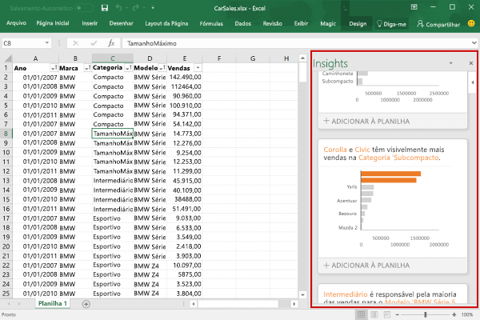

# Visão geral dos suplementos do Excel

Um suplemento do Excel permite estender a funcionalidade do aplicativo Excel em várias plataformas, incluindo Office para Windows, Office Online, Office para Mac e Office para iPad. Use suplementos do Excel em uma pasta de trabalho para:

- Interagir com objetos do Excel, ler e gravar dados do Excel. 
- Estender a funcionalidade usando o painel de tarefas ou o painel conteúdo baseado na Web 
- Adicionar botões personalizados da faixa de opções ou itens de menu contextuais
- Fornecer interação mais rica usando janela de caixa de diálogo 

A plataforma Suplementos do Office fornece a estrutura e as APIs JavaScript Office.js que permitem criar e executar suplementos do Excel. Usando a plataforma Suplementos do Office para criar o suplemento do Excel, você receberá os seguintes benefícios:

* **Suporte à plataforma cruzada**: Os suplementos do Excel são executados no Office para Windows, Mac, iOS e Office Online.
* **Implantação centralizada**: Os administradores podem implantar rápida e facilmente suplementos do Excel para usuários em toda uma organização.
* **SSO (logon único)**: Integre facilmente seu suplemento do Excel ao Microsoft Graph.
* **Uso da tecnologia da Web padrão**: Crie um suplemento do Excel usando tecnologias da Web conhecidas, como HTML, CSS e JavaScript.
* **Distribuição pelo AppSource**: Compartilhe o suplemento do Excel com uma ampla audiência publicando-o na [AppSource](https://appsource.microsoft.com/en-us/marketplace/apps?product=office&page=1&src=office&corrid=53245fad-fcbe-41f8-9f97-b0840264f97c&omexanonuid=4a0102fb-b31a-4b9f-9bb0-39d4cc6b789d).

> [!NOTE]
> Os suplementos são diferentes dos suplementos de COM e VSTO, que são anteriores às soluções de integração do Office que são executadas apenas no Office para Windows. Diferentemente dos suplementos de COM, os suplementos do Excel não exigem a instalação de código no dispositivo de um usuário, nem no Excel. 

## Componentes de um suplemento do Excel 

Um suplemento do Excel inclui dois componentes básicos: um aplicativo Web e um arquivo de configuração, chamado de arquivo de manifesto. 

O aplicativo Web usa a [API JavaScript para Office](https://dev.office.com/reference/add-ins/javascript-api-for-office) para interagir com objetos no Excel e também pode facilitar a interação com recursos online. Por exemplo, um suplemento pode executar alguma das seguintes tarefas:

* Criar, ler, atualizar e excluir dados na pasta de trabalho (planilhas, intervalos, tabelas, gráficos, itens nomeados e muito mais).
* Executar autorização de usuário em um serviço online usando o fluxo padrão OAuth 2.0.
* Emitir solicitações de API ao Microsoft Graph ou qualquer outra API.

O aplicativo Web pode ser hospedado em qualquer servidor Web, além de poder ser criado usando estruturas do lado do cliente (como Angular, React, jQuery) ou tecnologias do lado do servidor (como ASP.NET, Node.js, PHP).

O [manifesto](../develop/add-in-manifests.md) é um arquivo de configuração XML que define como o suplemento integra-se aos clientes do Office, especificando configurações e recursos, como: 

* A URL do aplicativo Web do suplemento.
* O nome de exibição, a descrição, a ID, a versão e a localidade padrão do suplemento.
* Como o suplemento integra-se ao Excel, incluindo qualquer interface de usuário personalizada que o suplemento cria (botões da faixa de opções, menus de contexto, etc.).
* Permissões exigidas pelo suplemento, como leitura e gravação no documento.

Para permitir que os usuários finais instalem e usem um suplemento do Excel, você deve publicar o respectivo manifesto no AppSource ou em um catálogo de Suplementos. 

## Recursos de um suplemento do Excel

Além de interagir com o conteúdo da pasta de trabalho, os suplementos do Excel podem adicionar botões personalizados da faixa de opções ou comandos de menu, inserir painéis de tarefas, abrir caixas de diálogo e, até mesmo, inserir objetos sofisticados baseados na web, como gráficos ou visualizações interativas, em uma planilha.

### Comandos de suplemento

Comandos de suplemento são elementos de interface do usuário que estendem a interface do usuário do Excel e iniciam ações no suplemento. É possível adicionar um botão à faixa de opções ou um item a um menu de contexto do Excel. Ao selecionar um comando de suplemento, os usuários iniciam ações como executar código JavaScript ou exibir uma página do suplemento em um painel de tarefas.  

**Comandos de suplemento**

Para saber mais sobre recursos de comando, plataformas suportadas e práticas recomendadas para o desenvolvimento de comandos de suplemento, confira [Comandos de suplemento para Excel, Word e PowerPoint](../design/add-in-commands.md).

### Painéis de tarefas

Os painéis de tarefas são superfícies de interface que normalmente são exibidas no lado direito da janela no Excel. Os painéis de tarefas dão aos usuários acesso a controles de interface que executam códigos para modificar o documento do Excel ou exibir dados de uma fonte de dados. 

**Painel de tarefas**

Para saber mais sobre os painéis de tarefas, confira [Painéis de tarefas nos Suplementos do Office](../design/task-pane-add-ins.md). Para ver uma amostra que implementa um painel de tarefas no Excel, confira [Suplemento do Excel JS WoodGrove Expense Trends](https://github.com/OfficeDev/Excel-Add-in-WoodGrove-Expense-Trends).

### Caixas de diálogo

As caixas de diálogo são superfícies que flutuam acima da janela do aplicativo do Excel ativo. Você pode usar caixas de diálogo para tarefas como exibir páginas de entrada que não podem ser abertas diretamente em um painel de tarefas, solicitar que o usuário confirme uma ação ou hospedar vídeos que possam ser muito pequenos se confinados a um painel de tarefas. Para abrir caixas de diálogo no suplemento do Excel, use a [API da Caixa de Diálogo](https://dev.office.com/reference/add-ins/shared/officeui).

**Caixa de diálogo**

Para saber mais sobre caixas de diálogo e a API da Caixa de Diálogo, confira [Caixas de diálogo nos Suplementos do Office](../design/dialog-boxes.md) e [Usar a API da Caixa de Diálogo em Suplementos do Office](../develop/dialog-api-in-office-add-ins.md).

### Suplementos de conteúdo

Os suplementos de conteúdo são superfícies que podem ser inseridas diretamente em documentos do Excel. É possível usar suplementos de conteúdo para inserir objetos sofisticados baseados na Web, como gráficos, visualizações de dados ou mídia em uma planilha ou para conceder aos usuários acesso aos controles de interface que executam código para modificar o documento do Excel ou exibir dados de uma fonte de dados. Use suplementos de conteúdo quando quiser inserir a funcionalidade diretamente no documento.

**Suplemento de conteúdo**

Para saber mais sobre suplementos conteúdos, confira [Suplementos do Office de conteúdo](../design/content-add-ins.md). Para ver um exemplo que implementa um suplemento de conteúdo no Excel, confira [Suplemento de conteúdo do Excel Humongous Insurance](https://github.com/OfficeDev/Excel-Content-Add-in-Humongous-Insurance) no GitHub.

## APIs JavaScript para interagir com o conteúdo da pasta de trabalho

Um suplemento do Excel interage com objetos no Excel usando a [API JavaScript para Office](https://dev.office.com/reference/add-ins/javascript-api-for-office), que inclui dois modelos de objeto JavaScript:

* **API JavaScript do Excel**: Introduzida com o Office 2016, a [API JavaScript do Excel](https://dev.office.com/reference/add-ins/excel/excel-add-ins-reference-overview) fornece objetos do Excel fortemente tipados que você pode usar para acessar planilhas, intervalos, tabelas, gráficos e muito mais. 

* **API compartilhada**: Introduzida com o Office 2013, a API compartilhada permite acessar recursos como interface de usuário, caixas de diálogo e configurações de cliente, que são comuns entre vários tipos de aplicativos host, como Word, Excel e PowerPoint. Como a API compartilhada fornece funcionalidade limitada para interação do Excel, você poderá usá-la se seu suplemento precisar ser executado no Excel 2013.

## Próximas etapas

Introdução à [criação de seu primeiro suplemento do Excel](excel-add-ins-get-started-overview.md). Em seguida, saiba mais sobre os [principais conceitos](excel-add-ins-core-concepts.md) da criação de suplementos do Excel.

## Veja também

- [Visão geral da plataforma Suplementos do Office](../overview/office-add-ins.md)
- [Práticas recomendadas para o desenvolvimento de Suplementos do Office](../concepts/add-in-development-best-practices.md)
- [Diretrizes de design para suplementos do Office](../design/add-in-design.md)
- [Principais conceitos da API JavaScript do Excel](excel-add-ins-core-concepts.md)
- [Referência da API JavaScript do Excel](https://dev.office.com/reference/add-ins/excel/excel-add-ins-reference-overview)
