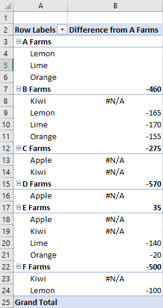

# <a name="work-with-pivottables-using-the-excel-javascript-api"></a><span data-ttu-id="de18e-103">Trabalhar com tabelas dinâmicas usando a API JavaScript do Excel</span><span class="sxs-lookup"><span data-stu-id="de18e-103">Work with PivotTables using the Excel JavaScript API</span></span>

<span data-ttu-id="de18e-104">As tabelas dinâmicas simplificam conjuntos de dados maiores.</span><span class="sxs-lookup"><span data-stu-id="de18e-104">PivotTables streamline larger data sets.</span></span> <span data-ttu-id="de18e-105">Eles permitem a manipulação rápida dos dados agrupados.</span><span class="sxs-lookup"><span data-stu-id="de18e-105">They allow the quick manipulation of grouped data.</span></span> <span data-ttu-id="de18e-106">A API JavaScript do Excel permite que o suplemento crie tabelas dinâmicas e interaja com seus componentes.</span><span class="sxs-lookup"><span data-stu-id="de18e-106">The Excel JavaScript API lets your add-in create PivotTables and interact with their components.</span></span> <span data-ttu-id="de18e-107">Este artigo descreve como as tabelas dinâmicas são representadas pela API JavaScript do Office e fornece exemplos de código para os principais cenários.</span><span class="sxs-lookup"><span data-stu-id="de18e-107">This article describes how PivotTables are represented by the Office JavaScript API and provides code samples for key scenarios.</span></span>

<span data-ttu-id="de18e-108">Se você não estiver familiarizado com a funcionalidade das tabelas dinâmicas, considere explorá-las como um usuário final.</span><span class="sxs-lookup"><span data-stu-id="de18e-108">If you are unfamiliar with the functionality of PivotTables, consider exploring them as an end user.</span></span>
<span data-ttu-id="de18e-109">Confira [criar uma tabela dinâmica para analisar os dados da planilha](https://support.office.com/article/Import-and-analyze-data-ccd3c4a6-272f-4c97-afbb-d3f27407fcde#ID0EAABAAA=PivotTables) para obter uma boa opção mais interessante nessas ferramentas.</span><span class="sxs-lookup"><span data-stu-id="de18e-109">See [Create a PivotTable to analyze worksheet data](https://support.office.com/article/Import-and-analyze-data-ccd3c4a6-272f-4c97-afbb-d3f27407fcde#ID0EAABAAA=PivotTables) for a good primer on these tools.</span></span>

> [!IMPORTANT]
> <span data-ttu-id="de18e-110">As tabelas dinâmicas criadas com OLAP não têm suporte no momento.</span><span class="sxs-lookup"><span data-stu-id="de18e-110">PivotTables created with OLAP are not currently supported.</span></span> <span data-ttu-id="de18e-111">Também não há suporte para o Power pivot.</span><span class="sxs-lookup"><span data-stu-id="de18e-111">There is also no support for Power Pivot.</span></span>

## <a name="object-model"></a><span data-ttu-id="de18e-112">Modelo de objetos</span><span class="sxs-lookup"><span data-stu-id="de18e-112">Object model</span></span>

<span data-ttu-id="de18e-113">A [tabela dinâmica](/javascript/api/excel/excel.pivottable) é o objeto central para tabelas dinâmicas na API JavaScript do Office.</span><span class="sxs-lookup"><span data-stu-id="de18e-113">The [PivotTable](/javascript/api/excel/excel.pivottable) is the central object for PivotTables in the Office JavaScript API.</span></span>

- <span data-ttu-id="de18e-114">`Workbook.pivotTables`e `Worksheet.pivotTables` são [PivotTableCollections](/javascript/api/excel/excel.pivottablecollection) que contêm as [tabelas dinâmicas](/javascript/api/excel/excel.pivottable) na pasta de trabalho e planilha, respectivamente.</span><span class="sxs-lookup"><span data-stu-id="de18e-114">`Workbook.pivotTables` and `Worksheet.pivotTables` are [PivotTableCollections](/javascript/api/excel/excel.pivottablecollection) that contain the [PivotTables](/javascript/api/excel/excel.pivottable) in the workbook and worksheet, respectively.</span></span>
- <span data-ttu-id="de18e-115">Uma [tabela dinâmica](/javascript/api/excel/excel.pivottable) contém um [PivotTableCollections](/javascript/api/excel/excel.pivottablecollection) que tem vários [PivotHierarchies](/javascript/api/excel/excel.pivothierarchy).</span><span class="sxs-lookup"><span data-stu-id="de18e-115">A [PivotTable](/javascript/api/excel/excel.pivottable) contains a [PivotTableCollections](/javascript/api/excel/excel.pivottablecollection) that has multiple [PivotHierarchies](/javascript/api/excel/excel.pivothierarchy).</span></span>
- <span data-ttu-id="de18e-116">Um [PivotHierarchy](/javascript/api/excel/excel.pivothierarchy) contém um [PivotFieldCollection](/javascript/api/excel/excel.pivotfieldcollection) que tem exatamente um [PivotField](/javascript/api/excel/excel.pivotfield).</span><span class="sxs-lookup"><span data-stu-id="de18e-116">A [PivotHierarchy](/javascript/api/excel/excel.pivothierarchy) contains a [PivotFieldCollection](/javascript/api/excel/excel.pivotfieldcollection) that has exactly one [PivotField](/javascript/api/excel/excel.pivotfield).</span></span> <span data-ttu-id="de18e-117">Se o design expandir para incluir tabelas dinâmicas OLAP, isso pode ser alterado.</span><span class="sxs-lookup"><span data-stu-id="de18e-117">If the design expands to include OLAP PivotTables, this may change.</span></span>
- <span data-ttu-id="de18e-118">Um [PivotField](/javascript/api/excel/excel.pivotfield) contém um [PivotItemCollection](/javascript/api/excel/excel.pivotitemcollection) que tem vários [PivotItems](/javascript/api/excel/excel.pivotitem).</span><span class="sxs-lookup"><span data-stu-id="de18e-118">A [PivotField](/javascript/api/excel/excel.pivotfield) contains a [PivotItemCollection](/javascript/api/excel/excel.pivotitemcollection) that has multiple [PivotItems](/javascript/api/excel/excel.pivotitem).</span></span>
- <span data-ttu-id="de18e-119">Uma [tabela dinâmica](/javascript/api/excel/excel.pivottable) contém um [PivotLayout](/javascript/api/excel/excel.pivotlayout) que define onde o [PivotFields](/javascript/api/excel/excel.pivotfield) e o [PivotItems](/javascript/api/excel/excel.pivotitem) são exibidos na planilha.</span><span class="sxs-lookup"><span data-stu-id="de18e-119">A [PivotTable](/javascript/api/excel/excel.pivottable) contains a [PivotLayout](/javascript/api/excel/excel.pivotlayout) that defines where the [PivotFields](/javascript/api/excel/excel.pivotfield) and [PivotItems](/javascript/api/excel/excel.pivotitem) are displayed in the worksheet.</span></span>

<span data-ttu-id="de18e-120">Vamos ver como essas relações se aplicam a alguns dados de exemplo.</span><span class="sxs-lookup"><span data-stu-id="de18e-120">Let's look at how these relationships apply to some example data.</span></span> <span data-ttu-id="de18e-121">Os dados a seguir descrevem as vendas de frutas de vários farms.</span><span class="sxs-lookup"><span data-stu-id="de18e-121">The following data describes fruit sales from various farms.</span></span> <span data-ttu-id="de18e-122">Este será o exemplo neste artigo.</span><span class="sxs-lookup"><span data-stu-id="de18e-122">It will be the example throughout this article.</span></span>


<span data-ttu-id="de18e-124">Estes dados de vendas do farm de frutas serão usados para criar uma tabela dinâmica.</span><span class="sxs-lookup"><span data-stu-id="de18e-124">This fruit farm sales data will be used to make a PivotTable.</span></span> <span data-ttu-id="de18e-125">Cada coluna, como **tipos**, é um `PivotHierarchy`.</span><span class="sxs-lookup"><span data-stu-id="de18e-125">Each column, such as **Types**, is a `PivotHierarchy`.</span></span> <span data-ttu-id="de18e-126">A hierarquia **tipos** contém o campo **tipos** .</span><span class="sxs-lookup"><span data-stu-id="de18e-126">The **Types** hierarchy contains the **Types** field.</span></span> <span data-ttu-id="de18e-127">O campo **tipos** contém os itens **Apple**, **Kiwi**, **casca**, **verde-limão**e **laranja**.</span><span class="sxs-lookup"><span data-stu-id="de18e-127">The **Types** field contains the items **Apple**, **Kiwi**, **Lemon**, **Lime**, and **Orange**.</span></span>

### <a name="hierarchies"></a><span data-ttu-id="de18e-128">Hierarquias</span><span class="sxs-lookup"><span data-stu-id="de18e-128">Hierarchies</span></span>

<span data-ttu-id="de18e-129">As tabelas dinâmicas são organizadas com base em quatro categorias de hierarquia: [linha](/javascript/api/excel/excel.rowcolumnpivothierarchy), [coluna](/javascript/api/excel/excel.rowcolumnpivothierarchy), [dados](/javascript/api/excel/excel.datapivothierarchy)e [filtro](/javascript/api/excel/excel.filterpivothierarchy).</span><span class="sxs-lookup"><span data-stu-id="de18e-129">PivotTables are organized based on four hierarchy categories: [row](/javascript/api/excel/excel.rowcolumnpivothierarchy), [column](/javascript/api/excel/excel.rowcolumnpivothierarchy), [data](/javascript/api/excel/excel.datapivothierarchy), and [filter](/javascript/api/excel/excel.filterpivothierarchy).</span></span>

<span data-ttu-id="de18e-130">Os dados do farm mostrados anteriormente têm cinco hierarquias: **farms**, **tipo**, **classificação**, enessações **vendidas no farm**e as **dovendas vendidas no atacado**.</span><span class="sxs-lookup"><span data-stu-id="de18e-130">The farm data shown earlier has five hierarchies: **Farms**, **Type**, **Classification**, **Crates Sold at Farm**, and **Crates Sold Wholesale**.</span></span> <span data-ttu-id="de18e-131">Cada hierarquia só pode existir em uma das quatro categorias.</span><span class="sxs-lookup"><span data-stu-id="de18e-131">Each hierarchy can only exist in one of the four categories.</span></span> <span data-ttu-id="de18e-132">Se **Type** for adicionado às hierarquias de coluna, ele também não poderá estar na linha, dados ou hierarquias de filtro.</span><span class="sxs-lookup"><span data-stu-id="de18e-132">If **Type** is added to column hierarchies, it cannot also be in the row, data, or filter hierarchies.</span></span> <span data-ttu-id="de18e-133">Se **Type** for adicionado posteriormente às hierarquias de linha, ele será removido das hierarquias de coluna.</span><span class="sxs-lookup"><span data-stu-id="de18e-133">If **Type** is subsequently added to row hierarchies, it is removed from the column hierarchies.</span></span> <span data-ttu-id="de18e-134">Esse comportamento é o mesmo que a atribuição de hierarquia é feita por meio da interface do usuário do Excel ou das APIs JavaScript do Excel.</span><span class="sxs-lookup"><span data-stu-id="de18e-134">This behavior is the same whether hierarchy assignment is done through the Excel UI or the Excel JavaScript APIs.</span></span>

<span data-ttu-id="de18e-135">Hierarquias de linha e coluna definem como os dados serão agrupados.</span><span class="sxs-lookup"><span data-stu-id="de18e-135">Row and column hierarchies define how data will be grouped.</span></span> <span data-ttu-id="de18e-136">Por exemplo, uma hierarquia de linha de **farms** agrupará todos os conjuntos de dados do mesmo farm.</span><span class="sxs-lookup"><span data-stu-id="de18e-136">For example, a row hierarchy of **Farms** will group together all the data sets from the same farm.</span></span> <span data-ttu-id="de18e-137">A escolha entre hierarquia de linha e coluna define a orientação da tabela dinâmica.</span><span class="sxs-lookup"><span data-stu-id="de18e-137">The choice between row and column hierarchy defines the orientation of the PivotTable.</span></span>

<span data-ttu-id="de18e-138">Hierarquias de dados são os valores a serem agregados com base nas hierarquias de linha e coluna.</span><span class="sxs-lookup"><span data-stu-id="de18e-138">Data hierarchies are the values to be aggregated based on the row and column hierarchies.</span></span> <span data-ttu-id="de18e-139">Uma tabela dinâmica com uma hierarquia de linha de **farms** e uma hierarquia de dados de **envenda vendida** mostra a soma total (por padrão) de todos os diferentes frutas para cada farm.</span><span class="sxs-lookup"><span data-stu-id="de18e-139">A PivotTable with a row hierarchy of **Farms** and a data hierarchy of **Crates Sold Wholesale** shows the sum total (by default) of all the different fruits for each farm.</span></span>

<span data-ttu-id="de18e-140">As hierarquias de filtro incluem ou excluem dados da tabela dinâmica com base nos valores desse tipo filtrado.</span><span class="sxs-lookup"><span data-stu-id="de18e-140">Filter hierarchies include or exclude data from the pivot based on values within that filtered type.</span></span> <span data-ttu-id="de18e-141">Uma hierarquia de filtro de **classificação** com o tipo **orgânica** selecionado mostra apenas dados para frutas orgânicas.</span><span class="sxs-lookup"><span data-stu-id="de18e-141">A filter hierarchy of **Classification** with the type **Organic** selected only shows data for organic fruit.</span></span>

<span data-ttu-id="de18e-142">Estes são os dados do farm novamente, juntamente com uma tabela dinâmica.</span><span class="sxs-lookup"><span data-stu-id="de18e-142">Here is the farm data again, alongside a PivotTable.</span></span> <span data-ttu-id="de18e-143">A tabela dinâmica está usando o **farm** e o **tipo** como hierarquias de linha, as enfileiras **vendidas no farm** e as doutilizações **vendidas** como as hierarquias de dados (com a função de agregação padrão de Sum) e a **classificação** como uma hierarquia de filtro (com a **orgânica** selecionada).</span><span class="sxs-lookup"><span data-stu-id="de18e-143">The PivotTable is using **Farm** and **Type** as the row hierarchies, **Crates Sold at Farm** and **Crates Sold Wholesale** as the data hierarchies (with the default aggregation function of sum), and **Classification** as a filter hierarchy (with **Organic** selected).</span></span>


<span data-ttu-id="de18e-145">Esta tabela dinâmica pode ser gerada por meio da API JavaScript ou através da interface do usuário do Excel.</span><span class="sxs-lookup"><span data-stu-id="de18e-145">This PivotTable could be generated through the JavaScript API or through the Excel UI.</span></span> <span data-ttu-id="de18e-146">Ambas as opções permitem mais manipulação por meio de suplementos.</span><span class="sxs-lookup"><span data-stu-id="de18e-146">Both options allow for further manipulation through add-ins.</span></span>

## <a name="create-a-pivottable"></a><span data-ttu-id="de18e-147">Criar uma tabela dinâmica</span><span class="sxs-lookup"><span data-stu-id="de18e-147">Create a PivotTable</span></span>

<span data-ttu-id="de18e-148">As tabelas dinâmicas precisam de um nome, origem e destino.</span><span class="sxs-lookup"><span data-stu-id="de18e-148">PivotTables need a name, source, and destination.</span></span> <span data-ttu-id="de18e-149">A origem pode ser um endereço de intervalo ou nome de tabela (passado `Range`como `string`um, `Table` ou tipo).</span><span class="sxs-lookup"><span data-stu-id="de18e-149">The source can be a range address or table name (passed as a `Range`, `string`, or `Table` type).</span></span> <span data-ttu-id="de18e-150">O destino é um endereço de intervalo (fornecido como ou `Range` um `string`ou).</span><span class="sxs-lookup"><span data-stu-id="de18e-150">The destination is a range address (given as either a `Range` or `string`).</span></span>
<span data-ttu-id="de18e-151">Os exemplos a seguir mostram várias técnicas de criação de tabela dinâmica.</span><span class="sxs-lookup"><span data-stu-id="de18e-151">The following samples show various PivotTable creation techniques.</span></span>

### <a name="create-a-pivottable-with-range-addresses"></a><span data-ttu-id="de18e-152">Criar uma tabela dinâmica com endereços de intervalo</span><span class="sxs-lookup"><span data-stu-id="de18e-152">Create a PivotTable with range addresses</span></span>

```js
Excel.run(function (context) {
    // Create a PivotTable named "Farm Sales" on the current worksheet at cell
    // A22 with data from the range A1:E21.
    context.workbook.worksheets.getActiveWorksheet().pivotTables.add(
      "Farm Sales", "A1:E21", "A22");

    return context.sync();
});
```

### <a name="create-a-pivottable-with-range-objects"></a><span data-ttu-id="de18e-153">Criar uma tabela dinâmica com objetos Range</span><span class="sxs-lookup"><span data-stu-id="de18e-153">Create a PivotTable with Range objects</span></span>

```js
Excel.run(function (context) {
    // Create a PivotTable named "Farm Sales" on a worksheet called "PivotWorksheet" at cell A2
    // the data comes from the worksheet "DataWorksheet" across the range A1:E21.
    var rangeToAnalyze = context.workbook.worksheets.getItem("DataWorksheet").getRange("A1:E21");
    var rangeToPlacePivot = context.workbook.worksheets.getItem("PivotWorksheet").getRange("A2");
    context.workbook.worksheets.getItem("PivotWorksheet").pivotTables.add(
      "Farm Sales", rangeToAnalyze, rangeToPlacePivot);

    return context.sync();
});
```

### <a name="create-a-pivottable-at-the-workbook-level"></a><span data-ttu-id="de18e-154">Criar uma tabela dinâmica no nível da pasta de trabalho</span><span class="sxs-lookup"><span data-stu-id="de18e-154">Create a PivotTable at the workbook level</span></span>

```js
Excel.run(function (context) {
    // Create a PivotTable named "Farm Sales" on a worksheet called "PivotWorksheet" at cell A2
    // the data is from the worksheet "DataWorksheet" across the range A1:E21.
    context.workbook.pivotTables.add(
        "Farm Sales", "DataWorksheet!A1:E21", "PivotWorksheet!A2");

    return context.sync();
});
```

## <a name="use-an-existing-pivottable"></a><span data-ttu-id="de18e-155">Usar uma tabela dinâmica existente</span><span class="sxs-lookup"><span data-stu-id="de18e-155">Use an existing PivotTable</span></span>

<span data-ttu-id="de18e-156">As tabelas dinâmicas criadas manualmente também podem ser acessadas por meio da coleção PivotTable da pasta de trabalho ou de planilhas individuais.</span><span class="sxs-lookup"><span data-stu-id="de18e-156">Manually created PivotTables are also accessible through the PivotTable collection of the workbook or of individual worksheets.</span></span> <span data-ttu-id="de18e-157">O código a seguir obtém uma tabela dinâmica chamada **My pivot** da pasta de trabalho.</span><span class="sxs-lookup"><span data-stu-id="de18e-157">The following code gets a PivotTable named **My Pivot** from the workbook.</span></span>

```js
Excel.run(function (context) {
    var pivotTable = context.workbook.pivotTables.getItem("My Pivot");
    return context.sync();
});
```

## <a name="add-rows-and-columns-to-a-pivottable"></a><span data-ttu-id="de18e-158">Adicionar linhas e colunas a uma tabela dinâmica</span><span class="sxs-lookup"><span data-stu-id="de18e-158">Add rows and columns to a PivotTable</span></span>

<span data-ttu-id="de18e-159">Linhas e colunas dinamizam os dados em torno dos valores dos campos.</span><span class="sxs-lookup"><span data-stu-id="de18e-159">Rows and columns pivot the data around those fields' values.</span></span>

<span data-ttu-id="de18e-160">A adição da coluna do **farm** dinamiza todas as vendas em torno de cada farm.</span><span class="sxs-lookup"><span data-stu-id="de18e-160">Adding the **Farm** column pivots all the sales around each farm.</span></span> <span data-ttu-id="de18e-161">Adicionar as linhas de **tipo** e **classificação** divide ainda mais os dados com base no que frutas foi vendido e se foi orgânica ou não.</span><span class="sxs-lookup"><span data-stu-id="de18e-161">Adding the **Type** and **Classification** rows further breaks down the data based on what fruit was sold and whether it was organic or not.</span></span>


```js
Excel.run(function (context) {
    var pivotTable = context.workbook.worksheets.getActiveWorksheet().pivotTables.getItem("Farm Sales");

    pivotTable.rowHierarchies.add(pivotTable.hierarchies.getItem("Type"));
    pivotTable.rowHierarchies.add(pivotTable.hierarchies.getItem("Classification"));

    pivotTable.columnHierarchies.add(pivotTable.hierarchies.getItem("Farm"));

    return context.sync();
});
```

<span data-ttu-id="de18e-163">Você também pode ter uma tabela dinâmica com apenas linhas ou colunas.</span><span class="sxs-lookup"><span data-stu-id="de18e-163">You can also have a PivotTable with only rows or columns.</span></span>

```js
Excel.run(function (context) {
    var pivotTable = context.workbook.worksheets.getActiveWorksheet().pivotTables.getItem("Farm Sales");
    pivotTable.rowHierarchies.add(pivotTable.hierarchies.getItem("Farm"));
    pivotTable.rowHierarchies.add(pivotTable.hierarchies.getItem("Type"));
    pivotTable.rowHierarchies.add(pivotTable.hierarchies.getItem("Classification"));

    return context.sync();
});
```

## <a name="add-data-hierarchies-to-the-pivottable"></a><span data-ttu-id="de18e-164">Adicionar hierarquias de dados à tabela dinâmica</span><span class="sxs-lookup"><span data-stu-id="de18e-164">Add data hierarchies to the PivotTable</span></span>

<span data-ttu-id="de18e-165">As hierarquias de dados preenchem a tabela dinâmica com informações para combinar com base nas linhas e colunas.</span><span class="sxs-lookup"><span data-stu-id="de18e-165">Data hierarchies fill the PivotTable with information to combine based on the rows and columns.</span></span> <span data-ttu-id="de18e-166">Adicionar as hierarquias de dados das pessoas **vendidas no farm** e as pessoas **vendidas no atacado** fornece somas desses números para cada linha e coluna.</span><span class="sxs-lookup"><span data-stu-id="de18e-166">Adding the data hierarchies of **Crates Sold at Farm** and **Crates Sold Wholesale** gives sums of those figures for each row and column.</span></span>

<span data-ttu-id="de18e-167">No exemplo, **farm** e **tipo** são linhas, com as vendas de compra como os dados.</span><span class="sxs-lookup"><span data-stu-id="de18e-167">In the example, both **Farm** and **Type** are rows, with the crate sales as the data.</span></span>


```js
Excel.run(function (context) {
    var pivotTable = context.workbook.worksheets.getActiveWorksheet().pivotTables.getItem("Farm Sales");

    // "Farm" and "Type" are the hierarchies on which the aggregation is based.
    pivotTable.rowHierarchies.add(pivotTable.hierarchies.getItem("Farm"));
    pivotTable.rowHierarchies.add(pivotTable.hierarchies.getItem("Type"));

    // "Crates Sold at Farm" and "Crates Sold Wholesale" are the hierarchies
    // that will have their data aggregated (summed in this case).
    pivotTable.dataHierarchies.add(pivotTable.hierarchies.getItem("Crates Sold at Farm"));
    pivotTable.dataHierarchies.add(pivotTable.hierarchies.getItem("Crates Sold Wholesale"));

    return context.sync();
});
```

## <a name="slicers"></a><span data-ttu-id="de18e-169">Segmentações de dados</span><span class="sxs-lookup"><span data-stu-id="de18e-169">Slicers</span></span>

<span data-ttu-id="de18e-170">As [segmentações](/javascript/api/excel/excel.slicer) de dados permitem que os dados sejam filtrados de uma tabela dinâmica ou tabela do Excel.</span><span class="sxs-lookup"><span data-stu-id="de18e-170">[Slicers](/javascript/api/excel/excel.slicer) allow data to be filtered from an Excel PivotTable or table.</span></span> <span data-ttu-id="de18e-171">Uma segmentação de, usa valores de uma coluna especificada ou PivotField para filtrar as linhas correspondentes.</span><span class="sxs-lookup"><span data-stu-id="de18e-171">A slicer uses values from a specified column or PivotField to filter corresponding rows.</span></span> <span data-ttu-id="de18e-172">Esses valores são armazenados como objetos [SlicerItem](/javascript/api/excel/excel.sliceritem) no `Slicer`.</span><span class="sxs-lookup"><span data-stu-id="de18e-172">These values are stored as [SlicerItem](/javascript/api/excel/excel.sliceritem) objects in the `Slicer`.</span></span> <span data-ttu-id="de18e-173">O suplemento pode ajustar esses filtros, como os usuários ([por meio da interface do usuário do Excel](https://support.office.com/article/Use-slicers-to-filter-data-249f966b-a9d5-4b0f-b31a-12651785d29d)).</span><span class="sxs-lookup"><span data-stu-id="de18e-173">Your add-in can adjust these filters, as can users ([through the Excel UI](https://support.office.com/article/Use-slicers-to-filter-data-249f966b-a9d5-4b0f-b31a-12651785d29d)).</span></span> <span data-ttu-id="de18e-174">A segmentação de trabalho fica na parte superior da planilha na camada de desenho, conforme mostrado na captura de tela a seguir.</span><span class="sxs-lookup"><span data-stu-id="de18e-174">The slicer sits on top of the worksheet in the drawing layer, as shown in the following screenshot.</span></span>


> [!NOTE]
> <span data-ttu-id="de18e-176">As técnicas descritas nesta seção concentram-se em como usar slicers conectados a tabelas dinâmicas.</span><span class="sxs-lookup"><span data-stu-id="de18e-176">The techniques described in this section focus on how to use slicers connected to PivotTables.</span></span> <span data-ttu-id="de18e-177">As mesmas técnicas também se aplicam ao uso de segmentações de, conectadas a tabelas.</span><span class="sxs-lookup"><span data-stu-id="de18e-177">The same techniques also apply to using slicers connected to tables.</span></span>

### <a name="create-a-slicer"></a><span data-ttu-id="de18e-178">Criar uma segmentação de um</span><span class="sxs-lookup"><span data-stu-id="de18e-178">Create a slicer</span></span>

<span data-ttu-id="de18e-179">Você pode criar uma segmentação de, em uma pasta de trabalho ou `Workbook.slicers.add` planilha, `Worksheet.slicers.add` usando o método ou método.</span><span class="sxs-lookup"><span data-stu-id="de18e-179">You can create a slicer in a workbook or worksheet by using the `Workbook.slicers.add` method or `Worksheet.slicers.add` method.</span></span> <span data-ttu-id="de18e-180">Isso adiciona uma segmentação de objetos à [SlicerCollection](/javascript/api/excel/excel.slicercollection) do objeto especificado `Workbook` ou `Worksheet` .</span><span class="sxs-lookup"><span data-stu-id="de18e-180">Doing so adds a slicer to the [SlicerCollection](/javascript/api/excel/excel.slicercollection) of the specified `Workbook` or `Worksheet` object.</span></span> <span data-ttu-id="de18e-181">O `SlicerCollection.add` método tem três parâmetros:</span><span class="sxs-lookup"><span data-stu-id="de18e-181">The `SlicerCollection.add` method has three parameters:</span></span>

- <span data-ttu-id="de18e-182">`slicerSource`: A fonte de dados na qual a nova segmentação de dados se baseia.</span><span class="sxs-lookup"><span data-stu-id="de18e-182">`slicerSource`: The data source on which the new slicer is based.</span></span> <span data-ttu-id="de18e-183">`PivotTable`Pode ser um `Table`, ou cadeia de caracteres que representa o nome ou a ID `PivotTable` de `Table`um ou.</span><span class="sxs-lookup"><span data-stu-id="de18e-183">It can be a `PivotTable`, `Table`, or string representing the name or ID of a `PivotTable` or `Table`.</span></span>
- <span data-ttu-id="de18e-184">`sourceField`: O campo na fonte de dados pela qual filtrar.</span><span class="sxs-lookup"><span data-stu-id="de18e-184">`sourceField`: The field in the data source by which to filter.</span></span> <span data-ttu-id="de18e-185">`PivotField`Pode ser um `TableColumn`, ou cadeia de caracteres que representa o nome ou a ID `PivotField` de `TableColumn`um ou.</span><span class="sxs-lookup"><span data-stu-id="de18e-185">It can be a `PivotField`, `TableColumn`, or string representing the name or ID of a `PivotField` or `TableColumn`.</span></span>
- <span data-ttu-id="de18e-186">`slicerDestination`: A planilha onde a nova segmentação de trabalho será criada.</span><span class="sxs-lookup"><span data-stu-id="de18e-186">`slicerDestination`: The worksheet where the new slicer will be created.</span></span> <span data-ttu-id="de18e-187">Pode ser um `Worksheet` objeto ou o nome ou a ID de um `Worksheet`.</span><span class="sxs-lookup"><span data-stu-id="de18e-187">It can be a `Worksheet` object or the name or ID of a `Worksheet`.</span></span> <span data-ttu-id="de18e-188">Esse parâmetro é desnecessário quando `SlicerCollection` o é acessado `Worksheet.slicers`.</span><span class="sxs-lookup"><span data-stu-id="de18e-188">This parameter is unnecessary when the `SlicerCollection` is accessed through `Worksheet.slicers`.</span></span> <span data-ttu-id="de18e-189">Nesse caso, a planilha da coleção é usada como o destino.</span><span class="sxs-lookup"><span data-stu-id="de18e-189">In this case, the collection's worksheet is used as the destination.</span></span>

<span data-ttu-id="de18e-190">O exemplo de código a seguir adiciona uma nova segmentação de trabalho à planilha **dinâmica** .</span><span class="sxs-lookup"><span data-stu-id="de18e-190">The following code sample adds a new slicer to the **Pivot** worksheet.</span></span> <span data-ttu-id="de18e-191">A origem da segmentação de dados é a tabela dinâmica de **vendas do farm** e filtra usando os dados do **tipo** .</span><span class="sxs-lookup"><span data-stu-id="de18e-191">The slicer's source is the **Farm Sales** PivotTable and filters using the **Type** data.</span></span> <span data-ttu-id="de18e-192">A segmentação de, também é chamada de **segmentação de frutas** para referência futura.</span><span class="sxs-lookup"><span data-stu-id="de18e-192">The slicer is also named **Fruit Slicer** for future reference.</span></span>

```js
Excel.run(function (context) {
    var sheet = context.workbook.worksheets.getItem("Pivot");
    var slicer = sheet.slicers.add(
        "Farm Sales" /* The slicer data source. For PivotTables, this can be the PivotTable object reference or name. */,
        "Type" /* The field in the data to filter by. For PivotTables, this can be a PivotField object reference or ID. */
    );
    slicer.name = "Fruit Slicer";
    return context.sync();
});
```

### <a name="filter-items-with-a-slicer"></a><span data-ttu-id="de18e-193">Filtrar itens com uma segmentação de um</span><span class="sxs-lookup"><span data-stu-id="de18e-193">Filter items with a slicer</span></span>

<span data-ttu-id="de18e-194">A segmentação de relatório filtra a tabela dinâmica com `sourceField`itens do.</span><span class="sxs-lookup"><span data-stu-id="de18e-194">The slicer filters the PivotTable with items from the `sourceField`.</span></span> <span data-ttu-id="de18e-195">O `Slicer.selectItems` método define os itens que permanecem na segmentação de,.</span><span class="sxs-lookup"><span data-stu-id="de18e-195">The `Slicer.selectItems` method sets the items that remain in the slicer.</span></span> <span data-ttu-id="de18e-196">Esses itens são passados para o método como a `string[]`, representando as chaves dos itens.</span><span class="sxs-lookup"><span data-stu-id="de18e-196">These items are passed to the method as a `string[]`, representing the keys of the items.</span></span> <span data-ttu-id="de18e-197">Qualquer linha que contenha esses itens permanecerá na agregação da tabela dinâmica.</span><span class="sxs-lookup"><span data-stu-id="de18e-197">Any rows containing those items remain in the PivotTable's aggregation.</span></span> <span data-ttu-id="de18e-198">Chamadas subsequentes `selectItems` para definir a lista como as chaves especificadas nessas chamadas.</span><span class="sxs-lookup"><span data-stu-id="de18e-198">Subsequent calls to `selectItems` set the list to the keys specified in those calls.</span></span>

> [!NOTE]
> <span data-ttu-id="de18e-199">Se `Slicer.selectItems` for passado um item que não está na fonte de dados, um `InvalidArgument` erro será gerado.</span><span class="sxs-lookup"><span data-stu-id="de18e-199">If `Slicer.selectItems` is passed an item that's not in the data source, an `InvalidArgument` error is thrown.</span></span> <span data-ttu-id="de18e-200">O conteúdo pode ser verificado através da `Slicer.slicerItems` Propriedade, que é um [SlicerItemCollection](/javascript/api/excel/excel.sliceritemcollection).</span><span class="sxs-lookup"><span data-stu-id="de18e-200">The contents can be verified through the `Slicer.slicerItems` property, which is a [SlicerItemCollection](/javascript/api/excel/excel.sliceritemcollection).</span></span>

<span data-ttu-id="de18e-201">O exemplo de código a seguir mostra três itens que estão sendo selecionados para a segmentação de itens: **casca**de limão, **verde-limão**e **laranja**.</span><span class="sxs-lookup"><span data-stu-id="de18e-201">The following code sample shows three items being selected for the slicer: **Lemon**, **Lime**, and **Orange**.</span></span>

```js
Excel.run(function (context) {
    var slicer = context.workbook.slicers.getItem("Fruit Slicer");
    // Anything other than the following three values will be filtered out of the PivotTable for display and aggregation.
    slicer.selectItems(["Lemon", "Lime", "Orange"]);
    return context.sync();
});
```

<span data-ttu-id="de18e-202">Para remover todos os filtros da segmentação de itens, `Slicer.clearFilters` use o método, conforme mostrado no exemplo a seguir.</span><span class="sxs-lookup"><span data-stu-id="de18e-202">To remove all filters from the slicer, use the `Slicer.clearFilters` method, as shown in the following sample.</span></span>

```js
Excel.run(function (context) {
    var slicer = context.workbook.slicers.getItem("Fruit Slicer");
    slicer.clearFilters();
    return context.sync();
});
```

### <a name="style-and-format-a-slicer"></a><span data-ttu-id="de18e-203">Estilo e formatação de uma segmentação de subconjuntos</span><span class="sxs-lookup"><span data-stu-id="de18e-203">Style and format a slicer</span></span>

<span data-ttu-id="de18e-204">O suplemento pode ajustar as configurações de exibição de uma segmentação por `Slicer` meio de propriedades.</span><span class="sxs-lookup"><span data-stu-id="de18e-204">You add-in can adjust a slicer's display settings through `Slicer` properties.</span></span> <span data-ttu-id="de18e-205">O exemplo de código a seguir define o estilo como **SlicerStyleLight6**, define o texto na parte superior da segmentação de texto para **tipos de frutas**, coloca a segmentação de texto na posição **(395, 15)** na camada de desenho e define o tamanho da segmentação de texto como **135x150** pixels.</span><span class="sxs-lookup"><span data-stu-id="de18e-205">The following code sample sets the style to **SlicerStyleLight6**, sets the text at the top of the slicer to **Fruit Types**, places the slicer at the position **(395, 15)** on the drawing layer, and sets the slicer's size to **135x150** pixels.</span></span>

```js
Excel.run(function (context) {
    var slicer = context.workbook.slicers.getItem("Fruit Slicer");
    slicer.caption = "Fruit Types";
    slicer.left = 395;
    slicer.top = 15;
    slicer.height = 135;
    slicer.width = 150;
    slicer.style = "SlicerStyleLight6";
    return context.sync();
});
```

### <a name="delete-a-slicer"></a><span data-ttu-id="de18e-206">Excluir uma segmentação de um</span><span class="sxs-lookup"><span data-stu-id="de18e-206">Delete a slicer</span></span>

<span data-ttu-id="de18e-207">Para excluir uma segmentação de, chame `Slicer.delete` o método.</span><span class="sxs-lookup"><span data-stu-id="de18e-207">To delete a slicer, call the `Slicer.delete` method.</span></span> <span data-ttu-id="de18e-208">O exemplo de código a seguir exclui a primeira segmentação de itens da planilha atual.</span><span class="sxs-lookup"><span data-stu-id="de18e-208">The following code sample deletes the first slicer from the current worksheet.</span></span>

```js
Excel.run(function (context) {
    var sheet = context.workbook.worksheets.getActiveWorksheet();
    sheet.slicers.getItemAt(0).delete();
    return context.sync();
});
```

## <a name="change-aggregation-function"></a><span data-ttu-id="de18e-209">Função de agregação de alteração</span><span class="sxs-lookup"><span data-stu-id="de18e-209">Change aggregation function</span></span>

<span data-ttu-id="de18e-210">As hierarquias de dados têm seus valores agregados.</span><span class="sxs-lookup"><span data-stu-id="de18e-210">Data hierarchies have their values aggregated.</span></span> <span data-ttu-id="de18e-211">Para conjuntos de números de valores, esta é uma soma por padrão.</span><span class="sxs-lookup"><span data-stu-id="de18e-211">For datasets of numbers, this is a sum by default.</span></span> <span data-ttu-id="de18e-212">A `summarizeBy` propriedade define esse comportamento com base em um tipo [AggregationFunction](/javascript/api/excel/excel.aggregationfunction) .</span><span class="sxs-lookup"><span data-stu-id="de18e-212">The `summarizeBy` property defines this behavior based on an [AggregationFunction](/javascript/api/excel/excel.aggregationfunction) type.</span></span>

<span data-ttu-id="de18e-213">Os tipos de função de agregação `Sum`suportados `Count`atualmente `Average`são `Max`, `Min` `Product`,, `CountNumbers`, `StandardDeviation`, `StandardDeviationP`, `Variance`, `VarianceP`,, `Automatic` e (o padrão).</span><span class="sxs-lookup"><span data-stu-id="de18e-213">The currently supported aggregation function types are `Sum`, `Count`, `Average`, `Max`, `Min`, `Product`, `CountNumbers`, `StandardDeviation`, `StandardDeviationP`, `Variance`, `VarianceP`, and `Automatic` (the default).</span></span>

<span data-ttu-id="de18e-214">O exemplo de código a seguir altera a agregação para ser a média dos dados.</span><span class="sxs-lookup"><span data-stu-id="de18e-214">The following code samples changes the aggregation to be averages of the data.</span></span>

```js
Excel.run(function (context) {
    var pivotTable = context.workbook.worksheets.getActiveWorksheet().pivotTables.getItem("Farm Sales");
    pivotTable.dataHierarchies.load("no-properties-needed");
    return context.sync().then(function() {

        // Change the aggregation from the default sum to an average of all the values in the hierarchy.
        pivotTable.dataHierarchies.items[0].summarizeBy = Excel.AggregationFunction.average;
        pivotTable.dataHierarchies.items[1].summarizeBy = Excel.AggregationFunction.average;
        return context.sync();
    });
});
```

## <a name="change-calculations-with-a-showasrule"></a><span data-ttu-id="de18e-215">Alterar cálculos com um ShowAsRule</span><span class="sxs-lookup"><span data-stu-id="de18e-215">Change calculations with a ShowAsRule</span></span>

<span data-ttu-id="de18e-216">As tabelas dinâmicas, por padrão, agregam os dados de suas hierarquias de linha e coluna de forma independente.</span><span class="sxs-lookup"><span data-stu-id="de18e-216">PivotTables, by default, aggregate the data of their row and column hierarchies independently.</span></span> <span data-ttu-id="de18e-217">Um [ShowAsRule](/javascript/api/excel/excel.showasrule) altera a hierarquia de dados para valores de saída com base em outros itens na tabela dinâmica.</span><span class="sxs-lookup"><span data-stu-id="de18e-217">A [ShowAsRule](/javascript/api/excel/excel.showasrule) changes the data hierarchy to output values based on other items in the PivotTable.</span></span>

<span data-ttu-id="de18e-218">O `ShowAsRule` objeto tem três propriedades:</span><span class="sxs-lookup"><span data-stu-id="de18e-218">The `ShowAsRule` object has three properties:</span></span>

- <span data-ttu-id="de18e-219">`calculation`: O tipo de cálculo relativo a ser aplicado à hierarquia de dados (o padrão `none`é).</span><span class="sxs-lookup"><span data-stu-id="de18e-219">`calculation`: The type of relative calculation to apply to the data hierarchy (the default is `none`).</span></span>
- <span data-ttu-id="de18e-220">`baseField`: O [PivotField](/javascript/api/excel/excel.pivotfield) na hierarquia que contém os dados básicos antes do cálculo ser aplicado.</span><span class="sxs-lookup"><span data-stu-id="de18e-220">`baseField`: The [PivotField](/javascript/api/excel/excel.pivotfield) in the hierarchy containing the base data before the calculation is applied.</span></span> <span data-ttu-id="de18e-221">Como as tabelas dinâmicas do Excel têm um mapeamento de um-para-um de hierarquia para campo, você usará o mesmo nome para acessar a hierarquia e o campo.</span><span class="sxs-lookup"><span data-stu-id="de18e-221">Since Excel PivotTables have a one-to-one mapping of hierarchy to field, you'll use the same name to access both the hierarchy and the field.</span></span>
- <span data-ttu-id="de18e-222">`baseItem`: O [PivotItem](/javascript/api/excel/excel.pivotitem) individual comparado com os valores dos campos base com base no tipo de cálculo.</span><span class="sxs-lookup"><span data-stu-id="de18e-222">`baseItem`: The individual [PivotItem](/javascript/api/excel/excel.pivotitem) compared against the values of the base fields based on the calculation type.</span></span> <span data-ttu-id="de18e-223">Nem todos os cálculos exigem esse campo.</span><span class="sxs-lookup"><span data-stu-id="de18e-223">Not all calculations require this field.</span></span>

<span data-ttu-id="de18e-224">O exemplo a seguir define o cálculo **da soma das enações vendidas na** hierarquia de dados do farm como uma porcentagem do total da coluna.</span><span class="sxs-lookup"><span data-stu-id="de18e-224">The following example sets the calculation on the **Sum of Crates Sold at Farm** data hierarchy to be a percentage of the column total.</span></span>
<span data-ttu-id="de18e-225">Ainda queremos que a granularidade seja estendida para o nível de tipo de frutas, portanto, usaremos a hierarquia de linha de **tipo** e seu campo base.</span><span class="sxs-lookup"><span data-stu-id="de18e-225">We still want the granularity to extend to the fruit type level, so we'll use the **Type** row hierarchy and its underlying field.</span></span>
<span data-ttu-id="de18e-226">O exemplo também tem o **farm** como a primeira hierarquia de linha, portanto, o total de entradas do farm exibe a porcentagem de produção de cada farm também.</span><span class="sxs-lookup"><span data-stu-id="de18e-226">The example also has **Farm** as the first row hierarchy, so the farm total entries display the percentage each farm is responsible for producing as well.</span></span>


```js
Excel.run(function (context) {
    var pivotTable = context.workbook.worksheets.getActiveWorksheet().pivotTables.getItem("Farm Sales");
    var farmDataHierarchy = pivotTable.dataHierarchies.getItem("Sum of Crates Sold at Farm");

    farmDataHierarchy.load("showAs");
    return context.sync().then(function () {

        // Show the crates of each fruit type sold at the farm as a percentage of the column's total.
        var farmShowAs = farmDataHierarchy.showAs;
        farmShowAs.calculation = Excel.ShowAsCalculation.percentOfColumnTotal;
        farmShowAs.baseField = pivotTable.rowHierarchies.getItem("Type").fields.getItem("Type");
        farmDataHierarchy.showAs = farmShowAs;
        farmDataHierarchy.name = "Percentage of Total Farm Sales";
    });
});
```

<span data-ttu-id="de18e-228">O exemplo anterior definiu o cálculo para a coluna, em relação ao campo de uma hierarquia de linha individual.</span><span class="sxs-lookup"><span data-stu-id="de18e-228">The previous example set the calculation to the column, relative to the field of an individual row hierarchy.</span></span> <span data-ttu-id="de18e-229">Quando o cálculo está relacionado a um item individual, use a `baseItem` propriedade.</span><span class="sxs-lookup"><span data-stu-id="de18e-229">When the calculation relates to an individual item, use the `baseItem` property.</span></span>

<span data-ttu-id="de18e-230">O exemplo a seguir mostra `differenceFrom` o cálculo.</span><span class="sxs-lookup"><span data-stu-id="de18e-230">The following example shows the `differenceFrom` calculation.</span></span> <span data-ttu-id="de18e-231">Ele exibe a diferença entre as entradas de hierarquia de dados de vendas do farm em relação às de **um farm**.</span><span class="sxs-lookup"><span data-stu-id="de18e-231">It displays the difference of the farm crate sales data hierarchy entries relative to those of **A Farms**.</span></span>
<span data-ttu-id="de18e-232">O `baseField` **farm**de is, portanto, vemos as diferenças entre os outros farms, bem como as divisões de cada tipo de fruta (**Type** também é uma hierarquia de linha neste exemplo).</span><span class="sxs-lookup"><span data-stu-id="de18e-232">The `baseField` is **Farm**, so we see the differences between the other farms, as well as breakdowns for each type of like fruit (**Type** is also a row hierarchy in this example).</span></span>



```js
Excel.run(function (context) {
    var pivotTable = context.workbook.worksheets.getActiveWorksheet().pivotTables.getItem("Farm Sales");
    var farmDataHierarchy = pivotTable.dataHierarchies.getItem("Sum of Crates Sold at Farm");

    farmDataHierarchy.load("showAs");
    return context.sync().then(function () {
        // Show the difference between crate sales of the "A Farms" and the other farms.
        // This difference is both aggregated and shown for individual fruit types (where applicable).
        var farmShowAs = farmDataHierarchy.showAs;
        farmShowAs.calculation = Excel.ShowAsCalculation.differenceFrom;
        farmShowAs.baseField = pivotTable.rowHierarchies.getItem("Farm").fields.getItem("Farm");
        farmShowAs.baseItem = pivotTable.rowHierarchies.getItem("Farm").fields.getItem("Farm").items.getItem("A Farms");
        farmDataHierarchy.showAs = farmShowAs;
        farmDataHierarchy.name = "Difference from A Farms";
    });
});
```

## <a name="pivottable-layouts"></a><span data-ttu-id="de18e-236">Layouts de tabela dinâmica</span><span class="sxs-lookup"><span data-stu-id="de18e-236">PivotTable layouts</span></span>

<span data-ttu-id="de18e-237">Um [PivotLayout](/javascript/api/excel/excel.pivotlayout) define o posicionamento de hierarquias e seus dados.</span><span class="sxs-lookup"><span data-stu-id="de18e-237">A [PivotLayout](/javascript/api/excel/excel.pivotlayout) defines the placement of hierarchies and their data.</span></span> <span data-ttu-id="de18e-238">Você acessa o layout para determinar os intervalos onde os dados são armazenados.</span><span class="sxs-lookup"><span data-stu-id="de18e-238">You access the layout to determine the ranges where data is stored.</span></span>

<span data-ttu-id="de18e-239">O diagrama a seguir mostra quais chamadas de função de layout correspondem aos intervalos da tabela dinâmica.</span><span class="sxs-lookup"><span data-stu-id="de18e-239">The following diagram shows which layout function calls correspond to which ranges of the PivotTable.</span></span>


<span data-ttu-id="de18e-241">O código a seguir demonstra como obter a última linha dos dados da tabela dinâmica percorrendo o layout.</span><span class="sxs-lookup"><span data-stu-id="de18e-241">The following code demonstrates how to get the last row of the PivotTable data by going through the layout.</span></span> <span data-ttu-id="de18e-242">Esses valores são somados em um total geral.</span><span class="sxs-lookup"><span data-stu-id="de18e-242">Those values are then summed together for a grand total.</span></span>

```js
Excel.run(function (context) {
    var pivotTable = context.workbook.worksheets.getActiveWorksheet().pivotTables.getItem("Farm Sales");

    // Get the totals for each data hierarchy from the layout.
    var range = pivotTable.layout.getDataBodyRange();
    var grandTotalRange = range.getLastRow();
    grandTotalRange.load("address");
    return context.sync().then(function () {
        // Sum the totals from the PivotTable data hierarchies and place them in a new range.
        var masterTotalRange = context.workbook.worksheets.getActiveWorksheet().getRange("B27:C27");
        masterTotalRange.formulas = [["All Crates", "=SUM(" + grandTotalRange.address + ")"]];
    });
});
```

<span data-ttu-id="de18e-243">As tabelas dinâmicas têm três estilos de layout: compactar, estrutura de tópicos e tabular.</span><span class="sxs-lookup"><span data-stu-id="de18e-243">PivotTables have three layout styles: Compact, Outline, and Tabular.</span></span> <span data-ttu-id="de18e-244">Vimos o estilo compacto nos exemplos anteriores.</span><span class="sxs-lookup"><span data-stu-id="de18e-244">We've seen the compact style in the previous examples.</span></span>

<span data-ttu-id="de18e-245">Os exemplos a seguir usam os estilos de estrutura de tópicos e tabular, respectivamente.</span><span class="sxs-lookup"><span data-stu-id="de18e-245">The following examples use the outline and tabular styles, respectively.</span></span> <span data-ttu-id="de18e-246">O exemplo de código mostra como fazer o ciclo entre os diferentes layouts.</span><span class="sxs-lookup"><span data-stu-id="de18e-246">The code sample shows how to cycle between the different layouts.</span></span>

### <a name="outline-layout"></a><span data-ttu-id="de18e-247">Layout de estrutura de tópicos</span><span class="sxs-lookup"><span data-stu-id="de18e-247">Outline layout</span></span>


### <a name="tabular-layout"></a><span data-ttu-id="de18e-249">Layout tabular</span><span class="sxs-lookup"><span data-stu-id="de18e-249">Tabular layout</span></span>


## <a name="change-hierarchy-names"></a><span data-ttu-id="de18e-251">Alterar nomes de hierarquia</span><span class="sxs-lookup"><span data-stu-id="de18e-251">Change hierarchy names</span></span>

<span data-ttu-id="de18e-252">Os campos de hierarquia são editáveis.</span><span class="sxs-lookup"><span data-stu-id="de18e-252">Hierarchy fields are editable.</span></span> <span data-ttu-id="de18e-253">O código a seguir demonstra como alterar os nomes exibidos de duas hierarquias de dados.</span><span class="sxs-lookup"><span data-stu-id="de18e-253">The following code demonstrates how to change the displayed names of two data hierarchies.</span></span>

```js
Excel.run(function (context) {
    var dataHierarchies = context.workbook.worksheets.getActiveWorksheet()
        .pivotTables.getItem("Farm Sales").dataHierarchies;
    dataHierarchies.load("no-properties-needed");
    return context.sync().then(function () {
        // changing the displayed names of these entries
        dataHierarchies.items[0].name = "Farm Sales";
        dataHierarchies.items[1].name = "Wholesale";
    });
});
```

## <a name="delete-a-pivottable"></a><span data-ttu-id="de18e-254">Excluir uma tabela dinâmica</span><span class="sxs-lookup"><span data-stu-id="de18e-254">Delete a PivotTable</span></span>

<span data-ttu-id="de18e-255">As tabelas dinâmicas são excluídas usando seus nomes.</span><span class="sxs-lookup"><span data-stu-id="de18e-255">PivotTables are deleted by using their name.</span></span>

```js
Excel.run(function (context) {
    context.workbook.worksheets.getItem("Pivot").pivotTables.getItem("Farm Sales").delete();
    return context.sync();
});
```

## <a name="see-also"></a><span data-ttu-id="de18e-256">Confira também</span><span class="sxs-lookup"><span data-stu-id="de18e-256">See also</span></span>

- [<span data-ttu-id="de18e-257">Conceitos fundamentais de programação com a API JavaScript do Excel</span><span class="sxs-lookup"><span data-stu-id="de18e-257">Fundamental programming concepts with the Excel JavaScript API</span></span>](excel-add-ins-core-concepts.md)
- [<span data-ttu-id="de18e-258">Referência da API JavaScript do Excel</span><span class="sxs-lookup"><span data-stu-id="de18e-258">Excel JavaScript API Reference</span></span>](/javascript/api/excel)
