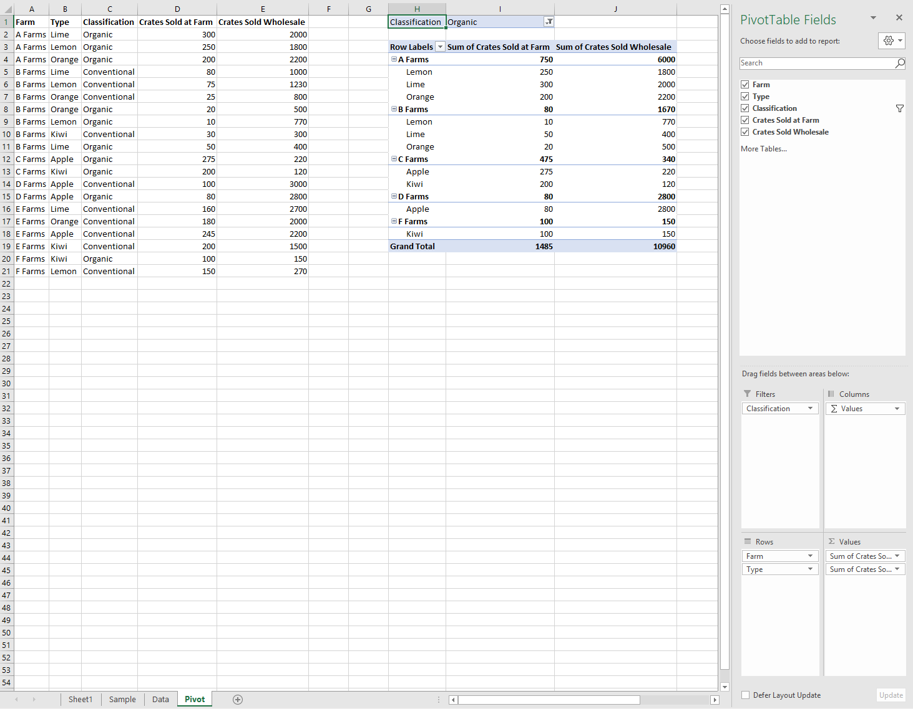
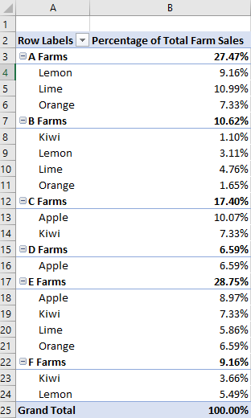
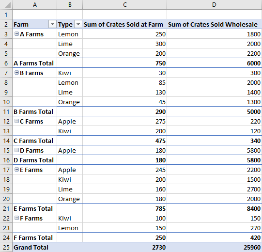

# <a name="work-with-pivottables-using-the-excel-javascript-api"></a>Trabalhar com tabelas dinâmicas usando a API JavaScript do Excel

As tabelas dinâmicas simplificam conjuntos de dados maiores. Eles permitem a manipulação rápida dos dados agrupados. A API JavaScript do Excel permite que o suplemento crie tabelas dinâmicas e interaja com seus componentes. Este artigo descreve como as tabelas dinâmicas são representadas pela API JavaScript do Office e fornece exemplos de código para os principais cenários.

Se você não estiver familiarizado com a funcionalidade das tabelas dinâmicas, considere explorá-las como um usuário final.
Confira [criar uma tabela dinâmica para analisar os dados da planilha](https://support.office.com/article/Import-and-analyze-data-ccd3c4a6-272f-4c97-afbb-d3f27407fcde#ID0EAABAAA=PivotTables) para obter uma boa opção mais interessante nessas ferramentas.

> [!IMPORTANT]
> As tabelas dinâmicas criadas com OLAP não têm suporte no momento. Também não há suporte para o Power pivot.

## <a name="object-model"></a>Modelo de objetos

A [tabela dinâmica](/javascript/api/excel/excel.pivottable) é o objeto central para tabelas dinâmicas na API JavaScript do Office.

- `Workbook.pivotTables`e `Worksheet.pivotTables` são [PivotTableCollections](/javascript/api/excel/excel.pivottablecollection) que contêm as [tabelas dinâmicas](/javascript/api/excel/excel.pivottable) na pasta de trabalho e planilha, respectivamente.
- Uma [tabela dinâmica](/javascript/api/excel/excel.pivottable) contém um [PivotTableCollections](/javascript/api/excel/excel.pivottablecollection) que tem vários [PivotHierarchies](/javascript/api/excel/excel.pivothierarchy).
- Um [PivotHierarchy](/javascript/api/excel/excel.pivothierarchy) contém um [PivotFieldCollection](/javascript/api/excel/excel.pivotfieldcollection) que tem exatamente um [PivotField](/javascript/api/excel/excel.pivotfield). Se o design expandir para incluir tabelas dinâmicas OLAP, isso pode ser alterado.
- Um [PivotField](/javascript/api/excel/excel.pivotfield) contém um [PivotItemCollection](/javascript/api/excel/excel.pivotitemcollection) que tem vários [PivotItems](/javascript/api/excel/excel.pivotitem).
- Uma [tabela dinâmica](/javascript/api/excel/excel.pivottable) contém um [PivotLayout](/javascript/api/excel/excel.pivotlayout) que define onde o [PivotFields](/javascript/api/excel/excel.pivotfield) e o [PivotItems](/javascript/api/excel/excel.pivotitem) são exibidos na planilha.

Vamos ver como essas relações se aplicam a alguns dados de exemplo. Os dados a seguir descrevem as vendas de frutas de vários farms. Este será o exemplo neste artigo.


Estes dados de vendas do farm de frutas serão usados para criar uma tabela dinâmica. Cada coluna, como **tipos**, é um `PivotHierarchy`. A hierarquia **tipos** contém o campo **tipos** . O campo **tipos** contém os itens **Apple**, **Kiwi**, **casca**, **verde-limão**e **laranja**.

### <a name="hierarchies"></a>Hierarquias

As tabelas dinâmicas são organizadas com base em quatro categorias de hierarquia: [linha](/javascript/api/excel/excel.rowcolumnpivothierarchy), [coluna](/javascript/api/excel/excel.rowcolumnpivothierarchy), [dados](/javascript/api/excel/excel.datapivothierarchy)e [filtro](/javascript/api/excel/excel.filterpivothierarchy).

Os dados do farm mostrados anteriormente têm cinco hierarquias: **farms**, **tipo**, **classificação**, enessações **vendidas no farm**e as **dovendas vendidas no atacado**. Cada hierarquia só pode existir em uma das quatro categorias. Se **Type** for adicionado às hierarquias de coluna, ele também não poderá estar na linha, dados ou hierarquias de filtro. Se **Type** for adicionado posteriormente às hierarquias de linha, ele será removido das hierarquias de coluna. Esse comportamento é o mesmo que a atribuição de hierarquia é feita por meio da interface do usuário do Excel ou das APIs JavaScript do Excel.

Hierarquias de linha e coluna definem como os dados serão agrupados. Por exemplo, uma hierarquia de linha de **farms** agrupará todos os conjuntos de dados do mesmo farm. A escolha entre hierarquia de linha e coluna define a orientação da tabela dinâmica.

Hierarquias de dados são os valores a serem agregados com base nas hierarquias de linha e coluna. Uma tabela dinâmica com uma hierarquia de linha de **farms** e uma hierarquia de dados de **envenda vendida** mostra a soma total (por padrão) de todos os diferentes frutas para cada farm.

As hierarquias de filtro incluem ou excluem dados da tabela dinâmica com base nos valores desse tipo filtrado. Uma hierarquia de filtro de **classificação** com o tipo **orgânica** selecionado mostra apenas dados para frutas orgânicas.

Estes são os dados do farm novamente, juntamente com uma tabela dinâmica. A tabela dinâmica está usando o **farm** e o **tipo** como hierarquias de linha, as enfileiras **vendidas no farm** e as doutilizações **vendidas** como as hierarquias de dados (com a função de agregação padrão de Sum) e a **classificação** como uma hierarquia de filtro (com a **orgânica** selecionada).



Esta tabela dinâmica pode ser gerada por meio da API JavaScript ou através da interface do usuário do Excel. Ambas as opções permitem mais manipulação por meio de suplementos.

## <a name="create-a-pivottable"></a>Criar uma tabela dinâmica

As tabelas dinâmicas precisam de um nome, origem e destino. A origem pode ser um endereço de intervalo ou nome de tabela (passado `Range`como `string`um, `Table` ou tipo). O destino é um endereço de intervalo (fornecido como ou `Range` um `string`ou).
Os exemplos a seguir mostram várias técnicas de criação de tabela dinâmica.

### <a name="create-a-pivottable-with-range-addresses"></a>Criar uma tabela dinâmica com endereços de intervalo

```js
Excel.run(function (context) {
    // Create a PivotTable named "Farm Sales" on the current worksheet at cell
    // A22 with data from the range A1:E21.
    context.workbook.worksheets.getActiveWorksheet().pivotTables.add(
      "Farm Sales", "A1:E21", "A22");

    return context.sync();
});
```

### <a name="create-a-pivottable-with-range-objects"></a>Criar uma tabela dinâmica com objetos Range

```js
Excel.run(function (context) {
    // Create a PivotTable named "Farm Sales" on a worksheet called "PivotWorksheet" at cell A2
    // the data comes from the worksheet "DataWorksheet" across the range A1:E21.
    var rangeToAnalyze = context.workbook.worksheets.getItem("DataWorksheet").getRange("A1:E21");
    var rangeToPlacePivot = context.workbook.worksheets.getItem("PivotWorksheet").getRange("A2");
    context.workbook.worksheets.getItem("PivotWorksheet").pivotTables.add(
      "Farm Sales", rangeToAnalyze, rangeToPlacePivot);

    return context.sync();
});
```

### <a name="create-a-pivottable-at-the-workbook-level"></a>Criar uma tabela dinâmica no nível da pasta de trabalho

```js
Excel.run(function (context) {
    // Create a PivotTable named "Farm Sales" on a worksheet called "PivotWorksheet" at cell A2
    // the data is from the worksheet "DataWorksheet" across the range A1:E21.
    context.workbook.pivotTables.add(
        "Farm Sales", "DataWorksheet!A1:E21", "PivotWorksheet!A2");

    return context.sync();
});
```

## <a name="use-an-existing-pivottable"></a>Usar uma tabela dinâmica existente

As tabelas dinâmicas criadas manualmente também podem ser acessadas por meio da coleção PivotTable da pasta de trabalho ou de planilhas individuais. O código a seguir obtém uma tabela dinâmica chamada **My pivot** da pasta de trabalho.

```js
Excel.run(function (context) {
    var pivotTable = context.workbook.pivotTables.getItem("My Pivot");
    return context.sync();
});
```

## <a name="add-rows-and-columns-to-a-pivottable"></a>Adicionar linhas e colunas a uma tabela dinâmica

Linhas e colunas dinamizam os dados em torno dos valores dos campos.

A adição da coluna do **farm** dinamiza todas as vendas em torno de cada farm. Adicionar as linhas de **tipo** e **classificação** divide ainda mais os dados com base no que frutas foi vendido e se foi orgânica ou não.


```js
Excel.run(function (context) {
    var pivotTable = context.workbook.worksheets.getActiveWorksheet().pivotTables.getItem("Farm Sales");

    pivotTable.rowHierarchies.add(pivotTable.hierarchies.getItem("Type"));
    pivotTable.rowHierarchies.add(pivotTable.hierarchies.getItem("Classification"));

    pivotTable.columnHierarchies.add(pivotTable.hierarchies.getItem("Farm"));

    return context.sync();
});
```

Você também pode ter uma tabela dinâmica com apenas linhas ou colunas.

```js
Excel.run(function (context) {
    var pivotTable = context.workbook.worksheets.getActiveWorksheet().pivotTables.getItem("Farm Sales");
    pivotTable.rowHierarchies.add(pivotTable.hierarchies.getItem("Farm"));
    pivotTable.rowHierarchies.add(pivotTable.hierarchies.getItem("Type"));
    pivotTable.rowHierarchies.add(pivotTable.hierarchies.getItem("Classification"));

    return context.sync();
});
```

## <a name="add-data-hierarchies-to-the-pivottable"></a>Adicionar hierarquias de dados à tabela dinâmica

As hierarquias de dados preenchem a tabela dinâmica com informações para combinar com base nas linhas e colunas. Adicionar as hierarquias de dados das pessoas **vendidas no farm** e as pessoas **vendidas no atacado** fornece somas desses números para cada linha e coluna.

No exemplo, **farm** e **tipo** são linhas, com as vendas de compra como os dados.


```js
Excel.run(function (context) {
    var pivotTable = context.workbook.worksheets.getActiveWorksheet().pivotTables.getItem("Farm Sales");

    // "Farm" and "Type" are the hierarchies on which the aggregation is based.
    pivotTable.rowHierarchies.add(pivotTable.hierarchies.getItem("Farm"));
    pivotTable.rowHierarchies.add(pivotTable.hierarchies.getItem("Type"));

    // "Crates Sold at Farm" and "Crates Sold Wholesale" are the hierarchies
    // that will have their data aggregated (summed in this case).
    pivotTable.dataHierarchies.add(pivotTable.hierarchies.getItem("Crates Sold at Farm"));
    pivotTable.dataHierarchies.add(pivotTable.hierarchies.getItem("Crates Sold Wholesale"));

    return context.sync();
});
```

## <a name="slicers"></a>Segmentações de dados

As [segmentações](/javascript/api/excel/excel.slicer) de dados permitem que os dados sejam filtrados de uma tabela dinâmica ou tabela do Excel. Uma segmentação de, usa valores de uma coluna especificada ou PivotField para filtrar as linhas correspondentes. Esses valores são armazenados como objetos [SlicerItem](/javascript/api/excel/excel.sliceritem) no `Slicer`. O suplemento pode ajustar esses filtros, como os usuários ([por meio da interface do usuário do Excel](https://support.office.com/article/Use-slicers-to-filter-data-249f966b-a9d5-4b0f-b31a-12651785d29d)). A segmentação de trabalho fica na parte superior da planilha na camada de desenho, conforme mostrado na captura de tela a seguir.


> [!NOTE]
> As técnicas descritas nesta seção concentram-se em como usar slicers conectados a tabelas dinâmicas. As mesmas técnicas também se aplicam ao uso de segmentações de, conectadas a tabelas.

### <a name="create-a-slicer"></a>Criar uma segmentação de um

Você pode criar uma segmentação de, em uma pasta de trabalho ou `Workbook.slicers.add` planilha, `Worksheet.slicers.add` usando o método ou método. Isso adiciona uma segmentação de objetos à [SlicerCollection](/javascript/api/excel/excel.slicercollection) do objeto especificado `Workbook` ou `Worksheet` . O `SlicerCollection.add` método tem três parâmetros:

- `slicerSource`: A fonte de dados na qual a nova segmentação de dados se baseia. `PivotTable`Pode ser um `Table`, ou cadeia de caracteres que representa o nome ou a ID `PivotTable` de `Table`um ou.
- `sourceField`: O campo na fonte de dados pela qual filtrar. `PivotField`Pode ser um `TableColumn`, ou cadeia de caracteres que representa o nome ou a ID `PivotField` de `TableColumn`um ou.
- `slicerDestination`: A planilha onde a nova segmentação de trabalho será criada. Pode ser um `Worksheet` objeto ou o nome ou a ID de um `Worksheet`. Esse parâmetro é desnecessário quando `SlicerCollection` o é acessado `Worksheet.slicers`. Nesse caso, a planilha da coleção é usada como o destino.

O exemplo de código a seguir adiciona uma nova segmentação de trabalho à planilha **dinâmica** . A origem da segmentação de dados é a tabela dinâmica de **vendas do farm** e filtra usando os dados do **tipo** . A segmentação de, também é chamada de **segmentação de frutas** para referência futura.

```js
Excel.run(function (context) {
    var sheet = context.workbook.worksheets.getItem("Pivot");
    var slicer = sheet.slicers.add(
        "Farm Sales" /* The slicer data source. For PivotTables, this can be the PivotTable object reference or name. */,
        "Type" /* The field in the data to filter by. For PivotTables, this can be a PivotField object reference or ID. */
    );
    slicer.name = "Fruit Slicer";
    return context.sync();
});
```

### <a name="filter-items-with-a-slicer"></a>Filtrar itens com uma segmentação de um

A segmentação de relatório filtra a tabela dinâmica com `sourceField`itens do. O `Slicer.selectItems` método define os itens que permanecem na segmentação de,. Esses itens são passados para o método como a `string[]`, representando as chaves dos itens. Qualquer linha que contenha esses itens permanecerá na agregação da tabela dinâmica. Chamadas subsequentes `selectItems` para definir a lista como as chaves especificadas nessas chamadas.

> [!NOTE]
> Se `Slicer.selectItems` for passado um item que não está na fonte de dados, um `InvalidArgument` erro será gerado. O conteúdo pode ser verificado através da `Slicer.slicerItems` Propriedade, que é um [SlicerItemCollection](/javascript/api/excel/excel.sliceritemcollection).

O exemplo de código a seguir mostra três itens que estão sendo selecionados para a segmentação de itens: **casca**de limão, **verde-limão**e **laranja**.

```js
Excel.run(function (context) {
    var slicer = context.workbook.slicers.getItem("Fruit Slicer");
    // Anything other than the following three values will be filtered out of the PivotTable for display and aggregation.
    slicer.selectItems(["Lemon", "Lime", "Orange"]);
    return context.sync();
});
```

Para remover todos os filtros da segmentação de itens, `Slicer.clearFilters` use o método, conforme mostrado no exemplo a seguir.

```js
Excel.run(function (context) {
    var slicer = context.workbook.slicers.getItem("Fruit Slicer");
    slicer.clearFilters();
    return context.sync();
});
```

### <a name="style-and-format-a-slicer"></a>Estilo e formatação de uma segmentação de subconjuntos

O suplemento pode ajustar as configurações de exibição de uma segmentação por `Slicer` meio de propriedades. O exemplo de código a seguir define o estilo como **SlicerStyleLight6**, define o texto na parte superior da segmentação de texto para **tipos de frutas**, coloca a segmentação de texto na posição **(395, 15)** na camada de desenho e define o tamanho da segmentação de texto como **135x150** pixels.

```js
Excel.run(function (context) {
    var slicer = context.workbook.slicers.getItem("Fruit Slicer");
    slicer.caption = "Fruit Types";
    slicer.left = 395;
    slicer.top = 15;
    slicer.height = 135;
    slicer.width = 150;
    slicer.style = "SlicerStyleLight6";
    return context.sync();
});
```

### <a name="delete-a-slicer"></a>Excluir uma segmentação de um

Para excluir uma segmentação de, chame `Slicer.delete` o método. O exemplo de código a seguir exclui a primeira segmentação de itens da planilha atual.

```js
Excel.run(function (context) {
    var sheet = context.workbook.worksheets.getActiveWorksheet();
    sheet.slicers.getItemAt(0).delete();
    return context.sync();
});
```

## <a name="change-aggregation-function"></a>Função de agregação de alteração

As hierarquias de dados têm seus valores agregados. Para conjuntos de números de valores, esta é uma soma por padrão. A `summarizeBy` propriedade define esse comportamento com base em um tipo [AggregationFunction](/javascript/api/excel/excel.aggregationfunction) .

Os tipos de função de agregação `Sum`suportados `Count`atualmente `Average`são `Max`, `Min` `Product`,, `CountNumbers`, `StandardDeviation`, `StandardDeviationP`, `Variance`, `VarianceP`,, `Automatic` e (o padrão).

O exemplo de código a seguir altera a agregação para ser a média dos dados.

```js
Excel.run(function (context) {
    var pivotTable = context.workbook.worksheets.getActiveWorksheet().pivotTables.getItem("Farm Sales");
    pivotTable.dataHierarchies.load("no-properties-needed");
    return context.sync().then(function() {

        // Change the aggregation from the default sum to an average of all the values in the hierarchy.
        pivotTable.dataHierarchies.items[0].summarizeBy = Excel.AggregationFunction.average;
        pivotTable.dataHierarchies.items[1].summarizeBy = Excel.AggregationFunction.average;
        return context.sync();
    });
});
```

## <a name="change-calculations-with-a-showasrule"></a>Alterar cálculos com um ShowAsRule

As tabelas dinâmicas, por padrão, agregam os dados de suas hierarquias de linha e coluna de forma independente. Um [ShowAsRule](/javascript/api/excel/excel.showasrule) altera a hierarquia de dados para valores de saída com base em outros itens na tabela dinâmica.

O `ShowAsRule` objeto tem três propriedades:

- `calculation`: O tipo de cálculo relativo a ser aplicado à hierarquia de dados (o padrão `none`é).
- `baseField`: O [PivotField](/javascript/api/excel/excel.pivotfield) na hierarquia que contém os dados básicos antes do cálculo ser aplicado. Como as tabelas dinâmicas do Excel têm um mapeamento de um-para-um de hierarquia para campo, você usará o mesmo nome para acessar a hierarquia e o campo.
- `baseItem`: O [PivotItem](/javascript/api/excel/excel.pivotitem) individual comparado com os valores dos campos base com base no tipo de cálculo. Nem todos os cálculos exigem esse campo.

O exemplo a seguir define o cálculo **da soma das enações vendidas na** hierarquia de dados do farm como uma porcentagem do total da coluna.
Ainda queremos que a granularidade seja estendida para o nível de tipo de frutas, portanto, usaremos a hierarquia de linha de **tipo** e seu campo base.
O exemplo também tem o **farm** como a primeira hierarquia de linha, portanto, o total de entradas do farm exibe a porcentagem de produção de cada farm também.



```js
Excel.run(function (context) {
    var pivotTable = context.workbook.worksheets.getActiveWorksheet().pivotTables.getItem("Farm Sales");
    var farmDataHierarchy = pivotTable.dataHierarchies.getItem("Sum of Crates Sold at Farm");

    farmDataHierarchy.load("showAs");
    return context.sync().then(function () {

        // Show the crates of each fruit type sold at the farm as a percentage of the column's total.
        var farmShowAs = farmDataHierarchy.showAs;
        farmShowAs.calculation = Excel.ShowAsCalculation.percentOfColumnTotal;
        farmShowAs.baseField = pivotTable.rowHierarchies.getItem("Type").fields.getItem("Type");
        farmDataHierarchy.showAs = farmShowAs;
        farmDataHierarchy.name = "Percentage of Total Farm Sales";
    });
});
```

O exemplo anterior definiu o cálculo para a coluna, em relação ao campo de uma hierarquia de linha individual. Quando o cálculo está relacionado a um item individual, use a `baseItem` propriedade.

O exemplo a seguir mostra `differenceFrom` o cálculo. Ele exibe a diferença entre as entradas de hierarquia de dados de vendas do farm em relação às de **um farm**.
O `baseField` **farm**de is, portanto, vemos as diferenças entre os outros farms, bem como as divisões de cada tipo de fruta (**Type** também é uma hierarquia de linha neste exemplo).


```js
Excel.run(function (context) {
    var pivotTable = context.workbook.worksheets.getActiveWorksheet().pivotTables.getItem("Farm Sales");
    var farmDataHierarchy = pivotTable.dataHierarchies.getItem("Sum of Crates Sold at Farm");

    farmDataHierarchy.load("showAs");
    return context.sync().then(function () {
        // Show the difference between crate sales of the "A Farms" and the other farms.
        // This difference is both aggregated and shown for individual fruit types (where applicable).
        var farmShowAs = farmDataHierarchy.showAs;
        farmShowAs.calculation = Excel.ShowAsCalculation.differenceFrom;
        farmShowAs.baseField = pivotTable.rowHierarchies.getItem("Farm").fields.getItem("Farm");
        farmShowAs.baseItem = pivotTable.rowHierarchies.getItem("Farm").fields.getItem("Farm").items.getItem("A Farms");
        farmDataHierarchy.showAs = farmShowAs;
        farmDataHierarchy.name = "Difference from A Farms";
    });
});
```

## <a name="pivottable-layouts"></a>Layouts de tabela dinâmica

Um [PivotLayout](/javascript/api/excel/excel.pivotlayout) define o posicionamento de hierarquias e seus dados. Você acessa o layout para determinar os intervalos onde os dados são armazenados.

O diagrama a seguir mostra quais chamadas de função de layout correspondem aos intervalos da tabela dinâmica.


O código a seguir demonstra como obter a última linha dos dados da tabela dinâmica percorrendo o layout. Esses valores são somados em um total geral.

```js
Excel.run(function (context) {
    var pivotTable = context.workbook.worksheets.getActiveWorksheet().pivotTables.getItem("Farm Sales");

    // Get the totals for each data hierarchy from the layout.
    var range = pivotTable.layout.getDataBodyRange();
    var grandTotalRange = range.getLastRow();
    grandTotalRange.load("address");
    return context.sync().then(function () {
        // Sum the totals from the PivotTable data hierarchies and place them in a new range.
        var masterTotalRange = context.workbook.worksheets.getActiveWorksheet().getRange("B27:C27");
        masterTotalRange.formulas = [["All Crates", "=SUM(" + grandTotalRange.address + ")"]];
    });
});
```

As tabelas dinâmicas têm três estilos de layout: compactar, estrutura de tópicos e tabular. Vimos o estilo compacto nos exemplos anteriores.

Os exemplos a seguir usam os estilos de estrutura de tópicos e tabular, respectivamente. O exemplo de código mostra como fazer o ciclo entre os diferentes layouts.

### <a name="outline-layout"></a>Layout de estrutura de tópicos


### <a name="tabular-layout"></a>Layout tabular



## <a name="change-hierarchy-names"></a>Alterar nomes de hierarquia

Os campos de hierarquia são editáveis. O código a seguir demonstra como alterar os nomes exibidos de duas hierarquias de dados.

```js
Excel.run(function (context) {
    var dataHierarchies = context.workbook.worksheets.getActiveWorksheet()
        .pivotTables.getItem("Farm Sales").dataHierarchies;
    dataHierarchies.load("no-properties-needed");
    return context.sync().then(function () {
        // changing the displayed names of these entries
        dataHierarchies.items[0].name = "Farm Sales";
        dataHierarchies.items[1].name = "Wholesale";
    });
});
```

## <a name="delete-a-pivottable"></a>Excluir uma tabela dinâmica

As tabelas dinâmicas são excluídas usando seus nomes.

```js
Excel.run(function (context) {
    context.workbook.worksheets.getItem("Pivot").pivotTables.getItem("Farm Sales").delete();
    return context.sync();
});
```

## <a name="see-also"></a>Confira também

- [Conceitos fundamentais de programação com a API JavaScript do Excel](excel-add-ins-core-concepts.md)
- [Referência da API JavaScript do Excel](/javascript/api/excel)
