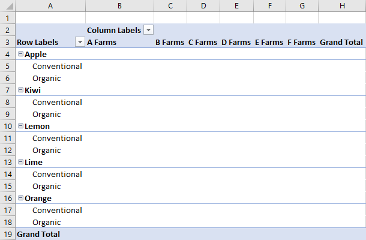

# <a name="work-with-pivottables-using-the-excel-javascript-api"></a>Trabalhar com tabelas dinâmicas usando a API do JavaScript Excel

As tabelas dinâmicas simplificam conjuntos de dados maiores. Elas permitem a rápida manipulação de dados agrupados. A API JavaScript do Excel permite que seu suplemento crie tabelas dinâmicas e interaja com os seus componentes. 

Se você não estiver familiarizado com a funcionalidade de tabelas dinâmicas, considere explorá-las como um usuário final. Confira [Criar uma tabela dinâmica para analisar dados de planilha](https://support.office.com/en-us/article/Import-and-analyze-data-ccd3c4a6-272f-4c97-afbb-d3f27407fcde#ID0EAABAAA=PivotTables) para uma boa introdução sobre essas ferramentas. 

Este artigo fornece exemplos de código para cenários comuns. Para enriquecer a compreensão da API de tabela dinâmica, veja [**Tabela dinâmica**](https://docs.microsoft.com/javascript/api/excel/excel.pivottable) e [**Coleção de tabelas dinâmicas**](https://docs.microsoft.com/javascript/api/excel/excel.pivottable).

> [!IMPORTANT]
> Tabelas dinâmicas criadas com OLAP não são suportadas no momento.

## <a name="hierarchies"></a>Hierarquias

Tabelas dinâmicas são organizadas com base em quatro categorias de hierarquia: linha, coluna, dados e filtro. Os dados a seguir que descrevem vendas fruta de diversas fazendas serão usados ao longo deste artigo.


Esses dados têm cinco hierarquias: **Fazendas**, **Tipo**, **Classificação**, **Caixas vendidas na fazenda**e **Caixas vendidas no atacado**. Cada hierarquia só pode existir em uma das quatro categorias. Se **Tipo** for adicionado às hierarquias de coluna e depois for adicionados às hierarquias de linha, ele apenas permanecerá nas últimas.

Hierarquias de linha e de coluna definem como os dados serão agrupados. Por exemplo, uma hierarquia de linha de **Fazendas** agrupará todos os conjuntos de dados da mesma fazenda. A escolha entre a hierarquia de linha e de coluna define a orientação da tabela dinâmica.

As hierarquias de dados são os valores a serem agregados com base nas hierarquias de linha e de coluna. Uma tabela dinâmica com uma hierarquia de linha de **Fazendas** e uma hierarquia de dados de **Caixas vendidas no atacado** mostra a soma total (por padrão) de todas as frutas diferentes para cada fazenda.

Hierarquias de filtro incluem ou excluem dados da tabela dinâmica com base nos valores dentro desse tipo filtrado. Uma hierarquia de filtro de **Classificação** com o tipo **Orgânico** selecionado mostra apenas os dados de frutas orgânicas.

Aqui estão os dados da fazenda novamente, junto com uma tabela dinâmica. A tabela dinâmica está usando **Fazenda** e **Tipo** como as hierarquias de linha, **Caixas vendidas na fazenda** e **Caixas vendidas no atacado** como as hierarquias de dados (com a função de agregação padrão de soma) e **Classificação** como uma hierarquia de filtro (com **Orgânico** selecionado). 


Esta tabela dinâmica poderia ser gerada por meio da API do JavaScript ou por meio da interface do usuário do Excel. As duas opções permitem manipulação adicional por meio de suplementos.

## <a name="create-a-pivottable"></a>Criar uma tabela dinâmica

Tabelas dinâmicas precisam de um nome, origem e destino. A fonte pode ser um endereço de intervalo ou um nome da tabela (passado como um tipo `Range`, `string` ou `Table`). O destino é um endereço de intervalo (dado como um `Range` ou `string`). Os exemplos a seguir mostram várias técnicas de criação de uma tabela dinâmica.

### <a name="create-a-pivottable-with-range-addresses"></a>Criar uma tabela dinâmica com o endereços de intervalo

```typescript
await Excel.run(async (context) => {
    // creating a PivotTable named "Farm Sales" on the current worksheet at cell A22 with data from the range A1:E21
    context.workbook.worksheets.getActiveWorksheet().pivotTables.add("Farm Sales", "A1:E21", "A22");

    await context.sync();
});
```

### <a name="create-a-pivottable-with-range-objects"></a>Criar uma tabela dinâmica com objetos de intervalo

```typescript
await Excel.run(async (context) => {    
    // creating a PivotTable named "Farm Sales" on a worksheet called "PivotWorksheet" at cell A2
    // the data comes from the worksheet "DataWorksheet" across the range A1:E21
    const rangeToAnalyze = context.workbook.worksheets.getItem("DataWorksheet").getRange("A1:E21");
    const rangeToPlacePivot = context.workbook.worksheets.getItem("PivotWorksheet").getRange("A2");
    context.workbook.worksheets.getItem("PivotWorksheet").pivotTables.add(
        "Farm Sales", rangeToAnalyze, rangeToPlacePivot);
    
    await context.sync();
});
```

### <a name="create-a-pivottable-at-the-workbook-level"></a>Criar uma tabela dinâmica no nível da pasta de trabalho

```typescript
await Excel.run(async (context) => {
    // creating a PivotTable named "Farm Sales" on a worksheet called "PivotWorksheet" at cell A2
    // the data is from the worksheet "DataWorksheet" across the range A1:E21
    context.workbook.pivotTables.add("Farm Sales", "DataWorksheet!A1:E21", "PivotWorksheet!A2");

    await context.sync();
});
```

## <a name="use-an-existing-pivottable"></a>Usar uma tabela dinâmica existente

A criação de tabelas dinâmicas manualmente também é acessível por meio da coleção de tabelas dinâmicas da pasta de trabalho ou das planilhas individuais. 

O código a seguir obtém a primeira tabela dinâmica na pasta de trabalho. Ele então oferece um nome para a tabela para facilitar a referência futura.

```typescript
await Excel.run(async (context) => {
    const pivotTable = context.workbook.pivotTables.getItem("My Pivot");
    await context.sync();
});
```

## <a name="add-rows-and-columns-to-a-pivottable"></a>Adicionar linhas e colunas à tabela dinâmica

Linhas e colunas articulam os dados em torno desses campos de valores.

Adicionar a coluna **Fazenda** articula todas as vendas ao redor de cada fazenda. Adicionar as linhas **Tipo** e **Classificação** quebra os dados com base em qual fruta foi vendida e se ela era orgânica ou não.



```typescript
await Excel.run(async (context) => {
    const pivotTable = context.workbook.worksheets.getActiveWorksheet().pivotTables.getItem("Farm Sales");

    pivotTable.rowHierarchies.add(pivotTable.hierarchies.getItem("Type"));
    pivotTable.rowHierarchies.add(pivotTable.hierarchies.getItem("Classification"));
    
    pivotTable.columnHierarchies.add(pivotTable.hierarchies.getItem("Farm"));

    await context.sync();
});
```

Você também pode ter uma tabela dinâmica apenas com linhas ou colunas.

```typescript
await Excel.run(async (context) => {
    const pivotTable = context.workbook.worksheets.getActiveWorksheet().pivotTables.getItem("Farm Sales");
    pivotTable.rowHierarchies.add(pivotTable.hierarchies.getItem("Farm"));
    pivotTable.rowHierarchies.add(pivotTable.hierarchies.getItem("Type"));
    pivotTable.rowHierarchies.add(pivotTable.hierarchies.getItem("Classification"));
    
    await context.sync();
});
```

## <a name="add-data-hierarchies-to-the-pivottable"></a>Adicionar hierarquias de dados à tabela dinâmica

Hierarquias de dados preenchem a tabela dinâmica com informações para combinar com base nas linhas e colunas. Adicionar as hierarquias de dados de **Caixas vendidas na fazenda** e **Caixas vendidas no atacado** dá somas àqueles valores para cada linha e coluna. 

No exemplo, tanto **Fazenda** quanto **Tipo** são linhas, com as vendas das caixas como os dados. 


```typescript
await Excel.run(async (context) => {
    const pivotTable = context.workbook.worksheets.getActiveWorksheet().pivotTables.getItem("Farm Sales");

    // "Farm" and "Type" are the hierarchies on which the aggregation is based
    pivotTable.rowHierarchies.add(pivotTable.hierarchies.getItem("Farm"));
    pivotTable.rowHierarchies.add(pivotTable.hierarchies.getItem("Type"));

    // "Crates Sold at Farm" and "Crates Sold Wholesale" are the hierarchies
    // that will have their data aggregated (summed in this case)
    pivotTable.dataHierarchies.add(pivotTable.hierarchies.getItem("Crates Sold at Farm"));
    pivotTable.dataHierarchies.add(pivotTable.hierarchies.getItem("Crates Sold Wholesale"));

    await context.sync();
});
```

## <a name="change-aggregation-function"></a>Alterar a função de agregação

Hierarquias de dados têm seus valores agregados. Para conjuntos de dados de números, essa é uma soma por padrão. A propriedade `summarizeBy` define esse comportamento com base em um tipo `AggregrationFunction`. 

Os tipos de função agregada suportados atualmente são `Sum`, `Count`, `Average`, `Max`, `Min`, `Product`, `CountNumbers`, `StandardDeviation`, `StandardDeviationP`, `Variance`, `VarianceP` e `Automatic` (padrão).

O exemplo de código a seguir altera a agregação para as médias dos dados.

```typescript
await Excel.run(async (context) => {
    const pivotTable = context.workbook.worksheets.getActiveWorksheet().pivotTables.getItem("Farm Sales");
    pivotTable.dataHierarchies.load("no-properties-needed");
    await context.sync();

    // changing the aggregation from the default sum to an average of all the values in the hierarchy
    pivotTable.dataHierarchies.items[0].summarizeBy = Excel.AggregationFunction.average;
    pivotTable.dataHierarchies.items[1].summarizeBy = Excel.AggregationFunction.average;
    await context.sync();
});
```

## <a name="change-calculations-with-a-showasrule"></a>Altere os cálculos com ShowAsRule

As tabelas dinâmicas, por padrão, agregam os dados de suas hierarquias de linha e coluna de forma independente. Uma `ShowAsRule` altera a hierarquia dos dados para valores de saída com base em outros itens da tabela dinâmica.

O objeto `ShowAsRule` tem três propriedades:
-   `calculation`: O tipo de cálculo relativo para aplicar à hierarquia de dados (o padrão é `none`).
-   `baseField`: O campo dentro da hierarquia que contém os dados de base antes do cálculo ser aplicado. O `PivotField` normalmente tem o mesmo nome que sua hierarquia pai.
-   `baseItem`: O item individual comparado com os valores dos campos de base de acordo com o tipo de cálculo. Nem todos os cálculos exigem esse campo.

O exemplo a seguir define o cálculo da hierarquia de dados **Soma de caixas vendidas na fazenda** como uma porcentagem do total de coluna. Ainda queremos a granularidade para estender o nível de tipo de fruta, então usaremos a hierarquia de linha de **Tipo** e seu campo subjacente. O exemplo também tem **Fazenda** como a primeira linha da hierarquia, assim, o total de entradas da fazenda também mostra a porcentagem que cada fazenda é responsável por produzir.


``` TypeScript
await Excel.run(async (context) => {
    const pivotTable = context.workbook.worksheets.getActiveWorksheet().pivotTables.getItem("Farm Sales");
    const farmDataHierarchy = pivotTable.dataHierarchies.getItem("Sum of Crates Sold at Farm");

    farmDataHierarchy.load("showAs");
    await context.sync();

    // show the crates of each fruit type sold at the farm as a percentage of the column's total
    let farmShowAs = farmDataHierarchy.showAs;
    farmShowAs.calculation = Excel.ShowAsCalculation.percentOfColumnTotal;
    farmShowAs.baseField = pivotTable.rowHierarchies.getItem("Type").fields.getItem("Type");
    farmDataHierarchy.showAs = farmShowAs; 
    farmDataHierarchy.name = "Percentage of Total Farm Sales";

    await context.sync();
});
```

O exemplo anterior define o cálculo para a coluna em relação à hierarquia de uma linha individual. Quando o cálculo está relacionado a um item individual, use a propriedade `baseItem`. 

O exemplo a seguir mostra o cálculo `differenceFrom`. Ele mostra a diferença entre das entradas na hierarquia de dados de vendas de caixas na fazenda em relação à "Fazendas A". O `baseField` é **Fazenda**, portanto, vemos as diferenças entre as outras fazendas, bem como o detalhe de cada tipo de fruta (**Tipo** também é uma hierarquia de linha neste exemplo).


``` TypeScript
await Excel.run(async (context) => {
    const pivotTable = context.workbook.worksheets.getActiveWorksheet().pivotTables.getItem("Farm Sales");
    const farmDataHierarchy = pivotTable.dataHierarchies.getItem("Sum of Crates Sold at Farm");

    farmDataHierarchy.load("showAs");
    await context.sync();

    // show the difference between crate sales of the "A Farms" and the other farms
    // this difference is both aggregated and shown for individual fruit types (where applicable)
    let farmShowAs = farmDataHierarchy.showAs;
    farmShowAs.calculation = Excel.ShowAsCalculation.differenceFrom;
    farmShowAs.baseField = pivotTable.rowHierarchies.getItem("Farm").fields.getItem("Farm");
    farmShowAs.baseItem = pivotTable.rowHierarchies.getItem("Farm").fields.getItem("Farm").items.getItem("A Farms");
    farmDataHierarchy.showAs = farmShowAs;
    farmDataHierarchy.name = "Difference from A Farms";
    await context.sync();
});
```

## <a name="pivottable-layouts"></a>Layouts de tabela dinâmica

Um layout de tabela dinâmica define o posicionamento das hierarquias e seus dados. Você acessa o layout para determinar os intervalos de onde os dados são armazenados. 

O diagrama a seguir mostra qual chamadas de funções de layout correspondem a quais intervalos da tabela dinâmica.


O código a seguir demonstra como obter a última linha de dados da tabela dinâmica por meio do layout. Esses valores são somados para um total geral.

```typescript
await Excel.run(async (context) => {
    const pivotTable = context.workbook.worksheets.getActiveWorksheet().pivotTables.getItem("Farm Sales");

    // get the totals for each data hierarchy from the layout
    const range = pivotTable.layout.getDataBodyRange();
    const grandTotalRange = range.getLastRow();
    grandTotalRange.load("address");
    await context.sync();

    // sum the totals from the PivotTable data hierarchies and place them in a new range
    const masterTotalRange = context.workbook.worksheets.getActiveWorksheet().getRange("B27:C27");
    masterTotalRange.formulas = [["All Crates", "=SUM(" + grandTotalRange.address + ")"]];
    await context.sync();
});
```

As tabelas dinâmicas têm três estilos de layout: Compacto, Contorno e Tabular. Vimos o estilo compacto nos exemplos anteriores. 

Os exemplos a seguir usam os estilos contorno e tabular, respectivamente. O exemplo de código mostra como fazer o ciclo entre os diferentes layouts.

### <a name="outline-layout"></a>Layout contorno


### <a name="tabular-layout"></a>Layout tabular


## <a name="change-hierarchy-names"></a>Alterar os nomes de hierarquia

Campos de hierarquia são editáveis. O código a seguir demonstra como alterar os nomes exibidos de duas hierarquias de dados.

```typescript
await Excel.run(async (context) => {
    const dataHierarchies = context.workbook.worksheets.getActiveWorksheet()
        .pivotTables.getItem("Farm Sales").dataHierarchies;
    dataHierarchies.load("no-properties-needed");
    await context.sync();
    
    // changing the displayed names of these entries
    dataHierarchies.items[0].name = "Farm Sales";
    dataHierarchies.items[1].name = "Wholesale";
    await context.sync();
});
```

## <a name="delete-a-pivottable"></a>Excluir uma tabela dinâmica

As tabelas dinâmicas são excluídas pelo uso de seu nome.

```typescript
await Excel.run(async (context) => {
    context.workbook.worksheets.getItem("Pivot").pivotTables.getItem("Farm Sales").delete();

    await context.sync();
});
```

## <a name="see-also"></a>Confira também

- [Principais conceitos da API JavaScript do Excel](excel-add-ins-core-concepts.md)
- [Referência da API JavaScript do Excel](https://docs.microsoft.com/javascript/api/excel)
