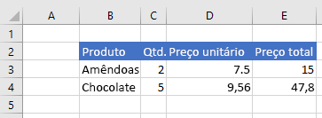

# <a name="clear-or-delete-ranges-using-the-excel-javascript-api"></a>Limpar ou excluir intervalos usando a API JavaScript do Excel

Este artigo fornece exemplos de código que limpam e excluem intervalos com a API JavaScript do Excel. Para ver a lista completa de propriedades e métodos suportados pelo `Range` objeto, consulte [Classe Excel.Range](/javascript/api/excel/excel.range).

[!include[Excel cells and ranges note](../includes/note-excel-cells-and-ranges.md)]

## <a name="clear-a-range-of-cells"></a>Limpar um intervalo de células

O exemplo de código a seguir limpa todo o conteúdo e a formatação das células no intervalo **E2:E5**.  

```js
Excel.run(function (context) {
    var sheet = context.workbook.worksheets.getItem("Sample");
    var range = sheet.getRange("E2:E5");

    range.clear();

    return context.sync();
}).catch(errorHandlerFunction);
```

### <a name="data-before-range-is-cleared"></a>Dados antes da limpeza do intervalo


### <a name="data-after-range-is-cleared"></a>Dados após a limpeza do intervalo


## <a name="delete-a-range-of-cells"></a>Excluir um intervalo de células

O exemplo de código a seguir exclui as células no intervalo **B4:E4** e desloca outras células para cima para preencher o espaço que foi desocupado pelas células excluídas.

```js
Excel.run(function (context) {
    var sheet = context.workbook.worksheets.getItem("Sample");
    var range = sheet.getRange("B4:E4");

    range.delete(Excel.DeleteShiftDirection.up);

    return context.sync();
}).catch(errorHandlerFunction);
```

### <a name="data-before-range-is-deleted"></a>Dados antes da exclusão do intervalo


### <a name="data-after-range-is-deleted"></a>Dados após a exclusão do intervalo




## <a name="see-also"></a>Confira também

- [Trabalhar com células usando a API JavaScript do Excel](excel-add-ins-cells.md)
- [Definir e obter intervalos usando a API JavaScript do Excel](excel-add-ins-ranges-set-get.md)
- [Modelo de objeto JavaScript do Excel em Suplementos do Office](excel-add-ins-core-concepts.md)
