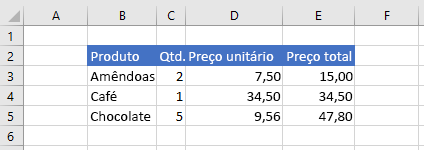

# <a name="set-range-format-using-the-excel-javascript-api"></a>Definir o formato de intervalo usando a EXCEL JavaScript

Este artigo fornece exemplos de código que configuram a cor da fonte, a cor do preenchimento e o formato de número para células em um intervalo com a API JavaScript Excel JavaScript. Para ver a lista completa de propriedades e métodos que o `Range` objeto oferece suporte, [consulte Excel. Classe Range](/javascript/api/excel/excel.range).

[!include[Excel cells and ranges note](../includes/note-excel-cells-and-ranges.md)]

## <a name="set-font-color-and-fill-color"></a>Definir cor da fonte e cor de preenchimento

O exemplo de código a seguir define a cor da fonte e a cor de preenchimento para células no intervalo **B2:E2**.

```js
Excel.run(function (context) {
    var sheet = context.workbook.worksheets.getItem("Sample");

    var range = sheet.getRange("B2:E2");
    range.format.fill.color = "#4472C4";
    range.format.font.color = "white";

    return context.sync();
}).catch(errorHandlerFunction);
```

### <a name="data-in-range-before-font-color-and-fill-color-are-set"></a>Dados no intervalo antes da definição da cor da fonte e da cor de preenchimento


### <a name="data-in-range-after-font-color-and-fill-color-are-set"></a>Dados no intervalo após a definição da cor da fonte e da cor de preenchimento


## <a name="set-number-format"></a>Definir formato de número

O exemplo de código a seguir define o formato de número para as células no intervalo **D3:E5**.

```js
Excel.run(function (context) {
    var sheet = context.workbook.worksheets.getItem("Sample");

    var formats = [
        ["0.00", "0.00"],
        ["0.00", "0.00"],
        ["0.00", "0.00"]
    ];

    var range = sheet.getRange("D3:E5");
    range.numberFormat = formats;

    return context.sync();
}).catch(errorHandlerFunction);
```

### <a name="data-in-range-before-number-format-is-set"></a>Dados no intervalo antes da definição do formato de número


### <a name="data-in-range-after-number-format-is-set"></a>Dados no intervalo após a definição do formato de número



## <a name="see-also"></a>Confira também

- [Modelo de objeto JavaScript do Excel em Suplementos do Office](excel-add-ins-core-concepts.md)
- [Trabalhar com células usando a EXCEL JavaScript](excel-add-ins-cells.md)
- [Definir e obter intervalos usando a EXCEL JavaScript](excel-add-ins-ranges-set-get.md)
- [Definir e obter valores de intervalo, texto ou fórmulas usando Excel API JavaScript](excel-add-ins-ranges-set-get-values.md)
