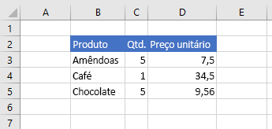
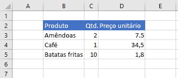
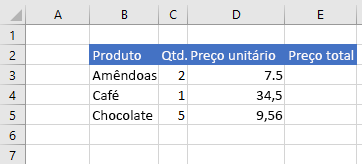
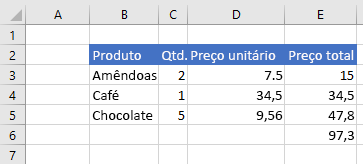

# <a name="set-and-get-range-values-text-or-formulas-using-the-excel-javascript-api"></a>Definir e obter valores de intervalo, texto ou fórmulas usando Excel API JavaScript

Este artigo fornece exemplos de código que configuram e obteram valores de intervalo, texto ou fórmulas com a API JavaScript Excel JavaScript. Para ver a lista completa de propriedades e métodos que o `Range` objeto oferece suporte, [consulte Excel. Classe Range](/javascript/api/excel/excel.range).

[!include[Excel cells and ranges note](../includes/note-excel-cells-and-ranges.md)]

## <a name="set-values-or-formulas"></a>Definir valores ou fórmulas

Os exemplos de código a seguir configuram valores e fórmulas para uma única célula ou um intervalo de células.

### <a name="set-value-for-a-single-cell"></a>Definir valor para uma única célula

O exemplo de código a seguir define o valor da célula **C3** como "5" e, em seguida, define a largura das colunas para melhor ajustar os dados.

```js
Excel.run(function (context) {
    var sheet = context.workbook.worksheets.getItem("Sample");

    var range = sheet.getRange("C3");
    range.values = [[ 5 ]];
    range.format.autofitColumns();

    return context.sync();
}).catch(errorHandlerFunction);
```

#### <a name="data-before-cell-value-is-updated"></a>Dados antes da atualização do valor da célula


#### <a name="data-after-cell-value-is-updated"></a>Dados após a atualização do valor da célula



### <a name="set-values-for-a-range-of-cells"></a>Definir valores para um intervalo de células

O exemplo de código a seguir define valores das células no intervalo **B5:D5** e, em seguida, define a largura das colunas para melhor ajustar os dados.

```js
Excel.run(function (context) {
    var sheet = context.workbook.worksheets.getItem("Sample");

    var data = [
        ["Potato Chips", 10, 1.80],
    ];

    var range = sheet.getRange("B5:D5");
    range.values = data;
    range.format.autofitColumns();

    return context.sync();
}).catch(errorHandlerFunction);
```

#### <a name="data-before-cell-values-are-updated"></a>Dados antes da atualização dos valores da célula


#### <a name="data-after-cell-values-are-updated"></a>Dados após a atualização dos valores da célula



### <a name="set-formula-for-a-single-cell"></a>Definir fórmula para uma única célula

O exemplo de código a seguir define uma fórmula para a célula **E3** e, em seguida, define a largura das colunas para melhor ajustar os dados.

```js
Excel.run(function (context) {
    var sheet = context.workbook.worksheets.getItem("Sample");

    var range = sheet.getRange("E3");
    range.formulas = [[ "=C3 * D3" ]];
    range.format.autofitColumns();

    return context.sync();
}).catch(errorHandlerFunction);
```

#### <a name="data-before-cell-formula-is-set"></a>Dados antes da definição da fórmula da célula



#### <a name="data-after-cell-formula-is-set"></a>Dados após a definição da fórmula da célula


### <a name="set-formulas-for-a-range-of-cells"></a>Definir fórmulas para um intervalo de células

O exemplo de código a seguir define fórmulas para células no intervalo **E2:E6** e, em seguida, define a largura das colunas para melhor ajustar os dados.

```js
Excel.run(function (context) {
    var sheet = context.workbook.worksheets.getItem("Sample");

    var data = [
        ["=C3 * D3"],
        ["=C4 * D4"],
        ["=C5 * D5"],
        ["=SUM(E3:E5)"]
    ];

    var range = sheet.getRange("E3:E6");
    range.formulas = data;
    range.format.autofitColumns();

    return context.sync();
}).catch(errorHandlerFunction);
```

#### <a name="data-before-cell-formulas-are-set"></a>Dados antes da definição das fórmulas da célula


#### <a name="data-after-cell-formulas-are-set"></a>Dados após a definição das fórmulas da célula



## <a name="get-values-text-or-formulas"></a>Obter valores, texto ou fórmulas

Esses exemplos de código obterão valores, texto e fórmulas de um intervalo de células.

### <a name="get-values-from-a-range-of-cells"></a>Obter valores de um intervalo de células

O exemplo de código a seguir obtém o intervalo **B2:E6**, carrega sua propriedade e grava `values` os valores no console. A `values` propriedade de um intervalo especifica os valores brutos que as células contêm. Mesmo que algumas células em um intervalo contenham fórmulas, a propriedade do intervalo especifica os valores brutos dessas células, não qualquer `values` uma das fórmulas.

```js
Excel.run(function (context) {
    var sheet = context.workbook.worksheets.getItem("Sample");
    var range = sheet.getRange("B2:E6");
    range.load("values");

    return context.sync()
        .then(function () {
            console.log(JSON.stringify(range.values, null, 4));
        });
}).catch(errorHandlerFunction);
```

#### <a name="data-in-range-values-in-column-e-are-a-result-of-formulas"></a>Dados no intervalo (valores na coluna E são um resultado de fórmulas)


#### <a name="rangevalues-as-logged-to-the-console-by-the-code-sample-above"></a>range.values (conforme registrado em log no console pelo exemplo de código acima)

```json
[
    [
        "Product",
        "Qty",
        "Unit Price",
        "Total Price"
    ],
    [
        "Almonds",
        2,
        7.5,
        15
    ],
    [
        "Coffee",
        1,
        34.5,
        34.5
    ],
    [
        "Chocolate",
        5,
        9.56,
        47.8
    ],
    [
        "",
        "",
        "",
        97.3
    ]
]
```

### <a name="get-text-from-a-range-of-cells"></a>Obter texto de um intervalo de células

O exemplo de código a seguir obtém o intervalo **B2:E6**, carrega sua propriedade `text` e grava-a no console. A `text` propriedade de um intervalo especifica os valores de exibição para células no intervalo. Mesmo que algumas células em um intervalo contenham fórmulas, a propriedade do intervalo especifica os valores de exibição dessas células, não qualquer `text` uma das fórmulas.

```js
Excel.run(function (context) {
    var sheet = context.workbook.worksheets.getItem("Sample");
    var range = sheet.getRange("B2:E6");
    range.load("text");

    return context.sync()
        .then(function () {
            console.log(JSON.stringify(range.text, null, 4));
        });
}).catch(errorHandlerFunction);
```

#### <a name="data-in-range-values-in-column-e-are-a-result-of-formulas"></a>Dados no intervalo (valores na coluna E são um resultado de fórmulas)


#### <a name="rangetext-as-logged-to-the-console-by-the-code-sample-above"></a>range.text (conforme registrado em log no console pelo exemplo de código acima)

```json
[
    [
        "Product",
        "Qty",
        "Unit Price",
        "Total Price"
    ],
    [
        "Almonds",
        "2",
        "7.5",
        "15"
    ],
    [
        "Coffee",
        "1",
        "34.5",
        "34.5"
    ],
    [
        "Chocolate",
        "5",
        "9.56",
        "47.8"
    ],
    [
        "",
        "",
        "",
        "97.3"
    ]
]
```

### <a name="get-formulas-from-a-range-of-cells"></a>Obter fórmulas de um intervalo de células

O exemplo de código a seguir obtém o intervalo **B2:E6**, carrega sua propriedade `formulas` e grava-a no console. A propriedade de um intervalo especifica as fórmulas para células no intervalo que contêm fórmulas e os valores brutos para células no intervalo que não `formulas` contêm fórmulas.

```js
Excel.run(function (context) {
    var sheet = context.workbook.worksheets.getItem("Sample");
    var range = sheet.getRange("B2:E6");
    range.load("formulas");

    return context.sync()
        .then(function () {
            console.log(JSON.stringify(range.formulas, null, 4));
        });
}).catch(errorHandlerFunction);
```

#### <a name="data-in-range-values-in-column-e-are-a-result-of-formulas"></a>Dados no intervalo (valores na coluna E são um resultado de fórmulas)


#### <a name="rangeformulas-as-logged-to-the-console-by-the-code-sample-above"></a>range.formulas (conforme registrado em log no console pelo exemplo de código acima)

```json
[
    [
        "Product",
        "Qty",
        "Unit Price",
        "Total Price"
    ],
    [
        "Almonds",
        2,
        7.5,
        "=C3 * D3"
    ],
    [
        "Coffee",
        1,
        34.5,
        "=C4 * D4"
    ],
    [
        "Chocolate",
        5,
        9.56,
        "=C5 * D5"
    ],
    [
        "",
        "",
        "",
        "=SUM(E3:E5)"
    ]
]
```

## <a name="see-also"></a>Confira também

- [Modelo de objeto JavaScript do Excel em Suplementos do Office](excel-add-ins-core-concepts.md)
- [Trabalhar com células usando a EXCEL JavaScript](excel-add-ins-cells.md)
- [Definir e obter intervalos usando a EXCEL JavaScript](excel-add-ins-ranges-set-get.md)
- [Definir o formato de intervalo usando a EXCEL JavaScript](excel-add-ins-ranges-set-format.md)
