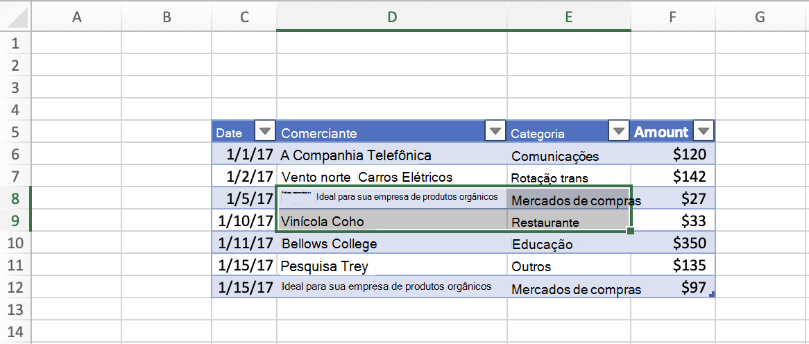

# <a name="set-and-get-the-selected-range-using-the-excel-javascript-api"></a>Definir e obter o intervalo selecionado usando a EXCEL JavaScript

Este artigo fornece exemplos de código que configuram e selecionam o intervalo com a API JavaScript Excel javascript. Para ver a lista completa de propriedades e métodos que o `Range` objeto oferece suporte, [consulte Excel. Classe Range](/javascript/api/excel/excel.range).

[!include[Excel cells and ranges note](../includes/note-excel-cells-and-ranges.md)]

## <a name="set-the-selected-range"></a>Definir o intervalo selecionado

O exemplo de código a seguir seleciona o intervalo **B2:E6** na planilha ativa.

```js
Excel.run(function (context) {
    var sheet = context.workbook.worksheets.getActiveWorksheet();
    var range = sheet.getRange("B2:E6");

    range.select();

    return context.sync();
}).catch(errorHandlerFunction);
```

### <a name="selected-range-b2e6"></a>Intervalo selecionado B2:E6


## <a name="get-the-selected-range"></a>Obter o intervalo selecionado

O exemplo de código a seguir obtém o intervalo selecionado, carrega `address` sua propriedade e grava uma mensagem no console.

```js
Excel.run(function (context) {
    var range = context.workbook.getSelectedRange();
    range.load("address");

    return context.sync()
        .then(function () {
            console.log(`The address of the selected range is "${range.address}"`);
        });
}).catch(errorHandlerFunction);
```

## <a name="select-the-edge-of-a-used-range"></a>Selecione a borda de um intervalo usado

Os [métodos Range.getRangeEdge](/javascript/api/excel/excel.range#getRangeEdge_direction__activeCell_) e [Range.getExtendedRange](/javascript/api/excel/excel.range#getExtendedRange_directionString__activeCell_) permitem que o seu complemento replique o comportamento dos atalhos de seleção do teclado, selecionando a borda do intervalo usado com base no intervalo selecionado no momento. Para saber mais sobre intervalos usados, consulte [Obter intervalo usado](excel-add-ins-ranges-get.md#get-used-range).

Na captura de tela a seguir, o intervalo usado é a tabela com valores em cada célula, **C5:F12**. As células vazias fora desta tabela estão fora do intervalo usado.


### <a name="select-the-cell-at-the-edge-of-the-current-used-range"></a>Selecione a célula na borda do intervalo usado atual

O exemplo de código a seguir mostra como usar o método para selecionar a célula na borda mais distante do intervalo usado `Range.getRangeEdge` atual, na direção para cima. Essa ação corresponde ao resultado do uso do atalho do teclado de tecla de seta Ctrl+Up enquanto um intervalo é selecionado.

```js
Excel.run(function (context) {
    // Get the selected range.
    var range = context.workbook.getSelectedRange();

    // Specify the direction with the `KeyboardDirection` enum.
    var direction = Excel.KeyboardDirection.up;

    // Get the active cell in the workbook.
    var activeCell = context.workbook.getActiveCell();

    // Get the top-most cell of the current used range.
    // This method acts like the Ctrl+Up arrow key keyboard shortcut while a range is selected.
    var rangeEdge = range.getRangeEdge(
      direction,
      activeCell
    );
    rangeEdge.select();

    return context.sync();
}).catch(errorHandlerFunction);
```

#### <a name="before-selecting-the-cell-at-the-edge-of-the-used-range"></a>Antes de selecionar a célula na borda do intervalo usado

A captura de tela a seguir mostra um intervalo usado e um intervalo selecionado dentro do intervalo usado. O intervalo usado é uma tabela com dados **em C5:F12**. Dentro desta tabela, o intervalo **D8:E9** está selecionado. Essa seleção é o *estado anterior,* antes de executar o `Range.getRangeEdge` método.



#### <a name="after-selecting-the-cell-at-the-edge-of-the-used-range"></a>Depois de selecionar a célula na borda do intervalo usado

A captura de tela a seguir mostra a mesma tabela da captura de tela anterior, com dados no intervalo **C5:F12**. Dentro desta tabela, o intervalo **D5** é selecionado. Essa seleção é *após o* estado, depois de executar o método para selecionar a célula na borda do intervalo usado na direção `Range.getRangeEdge` para cima.


### <a name="select-all-cells-from-current-range-to-furthest-edge-of-used-range"></a>Selecione todas as células do intervalo atual até a borda mais distante do intervalo usado

O exemplo de código a seguir mostra como usar o método para selecionar todas as células do intervalo selecionado no momento até a borda mais distante do intervalo usado, na direção `Range.getExtendedRange` para baixo. Essa ação corresponde ao resultado do uso do atalho do teclado de tecla de seta Ctrl+Shift+Down enquanto um intervalo é selecionado.

```js
Excel.run(function (context) {
    // Get the selected range.
    var range = context.workbook.getSelectedRange();

    // Specify the direction with the `KeyboardDirection` enum.
    var direction = Excel.KeyboardDirection.down;

    // Get the active cell in the workbook.
    var activeCell = context.workbook.getActiveCell();

    // Get all the cells from the currently selected range to the bottom-most edge of the used range.
    // This method acts like the Ctrl+Shift+Down arrow key keyboard shortcut while a range is selected.
    var extendedRange = range.getExtendedRange(
      direction,
      activeCell
    );
    extendedRange.select();

    return context.sync();
}).catch(errorHandlerFunction);
```

#### <a name="before-selecting-all-the-cells-from-the-current-range-to-the-edge-of-the-used-range"></a>Antes de selecionar todas as células do intervalo atual até a borda do intervalo usado

A captura de tela a seguir mostra um intervalo usado e um intervalo selecionado dentro do intervalo usado. O intervalo usado é uma tabela com dados **em C5:F12**. Dentro desta tabela, o intervalo **D8:E9** está selecionado. Essa seleção é o *estado anterior,* antes de executar o `Range.getExtendedRange` método.


#### <a name="after-selecting-all-the-cells-from-the-current-range-to-the-edge-of-the-used-range"></a>Depois de selecionar todas as células do intervalo atual até a borda do intervalo usado

A captura de tela a seguir mostra a mesma tabela da captura de tela anterior, com dados no intervalo **C5:F12**. Dentro desta tabela, o intervalo **D8:E12** está selecionado. Essa seleção é *após o* estado, depois de executar o método para selecionar todas as células do intervalo atual até a borda do intervalo usado na direção `Range.getExtendedRange` para baixo.


## <a name="see-also"></a>Confira também

- [Modelo de objeto JavaScript do Excel em Suplementos do Office](excel-add-ins-core-concepts.md)
- [Trabalhar com células usando a EXCEL JavaScript](excel-add-ins-cells.md)
- [Definir e obter valores de intervalo, texto ou fórmulas usando Excel API JavaScript](excel-add-ins-ranges-set-get-values.md)
- [Definir o formato de intervalo usando a EXCEL JavaScript](excel-add-ins-ranges-set-format.md)
