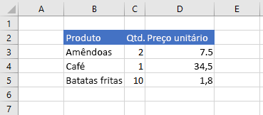
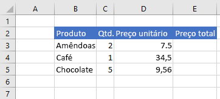

# <a name="work-with-ranges-using-the-excel-javascript-api"></a><span data-ttu-id="25e8d-102">Trabalhar com intervalos usando a API JavaScript do Excel</span><span class="sxs-lookup"><span data-stu-id="25e8d-102">Work with ranges using the Excel JavaScript API</span></span>

<span data-ttu-id="25e8d-103">Este artigo fornece exemplos de código que mostram como executar tarefas comuns com intervalos usando a API JavaScript do Excel.</span><span class="sxs-lookup"><span data-stu-id="25e8d-103">This article provides code samples that show how to perform common tasks with ranges using the Excel JavaScript API.</span></span> <span data-ttu-id="25e8d-104">Para obter a lista completa de propriedades e métodos que o objeto **Range** suporta, confira [Objeto Range (API JavaScript para Excel)](https://dev.office.com/reference/add-ins/excel/range).</span><span class="sxs-lookup"><span data-stu-id="25e8d-104">For the complete list of properties and methods that the **Range** object supports, see [Range Object (JavaScript API for Excel)](https://dev.office.com/reference/add-ins/excel/range).</span></span>

## <a name="get-a-range"></a><span data-ttu-id="25e8d-105">Obter um intervalo</span><span class="sxs-lookup"><span data-stu-id="25e8d-105">Get a range</span></span>

<span data-ttu-id="25e8d-106">Os exemplos a seguir mostram diferentes maneiras de obter uma referência a um intervalo em uma planilha.</span><span class="sxs-lookup"><span data-stu-id="25e8d-106">The following examples show different ways to get a reference to a range within a worksheet.</span></span>

### <a name="get-range-by-address"></a><span data-ttu-id="25e8d-107">Obter intervalo por endereço</span><span class="sxs-lookup"><span data-stu-id="25e8d-107">Get range by address</span></span>

<span data-ttu-id="25e8d-108">O exemplo de código a seguir obtém o intervalo com o endereço **B2:B5** da planilha chamada **Amostra**, carrega sua propriedade **address** e grava uma mensagem no console.</span><span class="sxs-lookup"><span data-stu-id="25e8d-108">The following code sample gets the range with address **B2:B5** from the worksheet named **Sample**, loads its **address** property, and writes a message to the console.</span></span>

```js
Excel.run(function (context) {
    var sheet = context.workbook.worksheets.getItem("Sample");
    var range = sheet.getRange("B2:C5");
    range.load("address");

    return context.sync()
        .then(function () {
            console.log(`The address of the range B2:C5 is "${range.address}"`);
        });
}).catch(errorHandlerFunction);
```

### <a name="get-range-by-name"></a><span data-ttu-id="25e8d-109">Obter intervalo por nome</span><span class="sxs-lookup"><span data-stu-id="25e8d-109">Get range by name</span></span>

<span data-ttu-id="25e8d-110">O exemplo de código a seguir obtém o intervalo chamado **MyRange** da planilha chamada **Amostra**, carrega sua propriedade **address** e grava uma mensagem no console.</span><span class="sxs-lookup"><span data-stu-id="25e8d-110">The following code sample gets the range named **MyRange** from the worksheet named **Sample**, loads its **address** property, and writes a message to the console.</span></span>

```js
Excel.run(function (context) {
    var sheet = context.workbook.worksheets.getItem("Sample");
    var range = sheet.getRange("MyRange");
    range.load("address");

    return context.sync()
        .then(function () {
            console.log(`The address of the range "MyRange" is "${range.address}"`);
        });
}).catch(errorHandlerFunction);
```

### <a name="get-used-range"></a><span data-ttu-id="25e8d-111">Obter intervalo usado</span><span class="sxs-lookup"><span data-stu-id="25e8d-111">Get used range</span></span>

<span data-ttu-id="25e8d-112">O exemplo de código a seguir obtém o intervalo usado da planilha chamada **Amostra**, carrega sua propriedade **address** e grava uma mensagem no console.</span><span class="sxs-lookup"><span data-stu-id="25e8d-112">The following code sample gets the used range from the worksheet named **Sample**, loads its **address** property, and writes a message to the console.</span></span> <span data-ttu-id="25e8d-113">O intervalo usado é o menor intervalo que abrange todas as células na planilha que têm um valor ou uma formatação atribuída a elas.</span><span class="sxs-lookup"><span data-stu-id="25e8d-113">The used range is the smallest range that encompasses any cells in the worksheet that have a value or formatting assigned to them.</span></span> <span data-ttu-id="25e8d-114">Se a planilha inteira estiver em branco, o método **getUsedRange()** retornará um intervalo que consiste apenas na célula superior esquerda da planilha.</span><span class="sxs-lookup"><span data-stu-id="25e8d-114">If the entire worksheet is blank, the **getUsedRange()** method returns a range that consists of only the top-left cell in the worksheet.</span></span>

```js
Excel.run(function (context) {
    var sheet = context.workbook.worksheets.getItem("Sample");
    var range = sheet.getUsedRange();
    range.load("address");

    return context.sync()
        .then(function () {
            console.log(`The address of the used range in the worksheet is "${range.address}"`);
        });
}).catch(errorHandlerFunction);
```

### <a name="get-entire-range"></a><span data-ttu-id="25e8d-115">Obter intervalo inteiro</span><span class="sxs-lookup"><span data-stu-id="25e8d-115">Get entire range</span></span>

<span data-ttu-id="25e8d-116">O exemplo de código a seguir obtém todo o intervalo da planilha chamada **Amostra**, carrega sua propriedade **address** e grava uma mensagem no console.</span><span class="sxs-lookup"><span data-stu-id="25e8d-116">The following code sample gets the entire worksheet range from the worksheet named **Sample**, loads its **address** property, and writes a message to the console.</span></span>

```js
Excel.run(function (context) {
    var sheet = context.workbook.worksheets.getItem("Sample");
    var range = sheet.getRange();
    range.load("address");

    return context.sync()
        .then(function () {
            console.log(`The address of the entire worksheet range is "${range.address}"`);
        });
}).catch(errorHandlerFunction);
```

## <a name="insert-a-range-of-cells"></a><span data-ttu-id="25e8d-117">Inserir um intervalo de células</span><span class="sxs-lookup"><span data-stu-id="25e8d-117">Insert a range of cells</span></span>

<span data-ttu-id="25e8d-118">O exemplo de código a seguir insere um intervalo de células no local **B4:E4** e desloca outras células para baixo a fim de fornecer espaço para as novas células.</span><span class="sxs-lookup"><span data-stu-id="25e8d-118">The following code sample inserts a range of cells in location **B4:E4** and shifts other cells down to provide space for the new cells.</span></span>

```js
Excel.run(function (context) {
    var sheet = context.workbook.worksheets.getItem("Sample");
    var range = sheet.getRange("B4:E4");

    range.insert(Excel.InsertShiftDirection.down);
    
    return context.sync();
}).catch(errorHandlerFunction);
```

<span data-ttu-id="25e8d-119">**Dados antes da inserção do intervalo**</span><span class="sxs-lookup"><span data-stu-id="25e8d-119">**Data before range is inserted**</span></span>


<span data-ttu-id="25e8d-121">**Dados após a inserção do intervalo**</span><span class="sxs-lookup"><span data-stu-id="25e8d-121">**Data after range is inserted**</span></span>


## <a name="clear-a-range-of-cells"></a><span data-ttu-id="25e8d-123">Limpar um intervalo de células</span><span class="sxs-lookup"><span data-stu-id="25e8d-123">Clear a range of cells</span></span>

<span data-ttu-id="25e8d-124">O exemplo de código a seguir limpa todo o conteúdo e a formatação das células no intervalo **E2:E5**.</span><span class="sxs-lookup"><span data-stu-id="25e8d-124">The following code sample clears all contents and formatting of cells in the range **E2:E5**.</span></span>  

```js
Excel.run(function (context) {
    var sheet = context.workbook.worksheets.getItem("Sample");
    var range = sheet.getRange("E2:E5");

    range.clear();

    return context.sync();
}).catch(errorHandlerFunction);
```

<span data-ttu-id="25e8d-125">**Dados antes da limpeza do intervalo**</span><span class="sxs-lookup"><span data-stu-id="25e8d-125">**Data before range is cleared**</span></span>


<span data-ttu-id="25e8d-127">**Dados após a limpeza do intervalo**</span><span class="sxs-lookup"><span data-stu-id="25e8d-127">**Data after range is cleared**</span></span>


## <a name="delete-a-range-of-cells"></a><span data-ttu-id="25e8d-129">Excluir um intervalo de células</span><span class="sxs-lookup"><span data-stu-id="25e8d-129">Delete a range of cells</span></span>

<span data-ttu-id="25e8d-130">O exemplo de código a seguir exclui as células no intervalo **B4:E4** e desloca outras células para cima a fim de preencher o espaço deixado pelas células excluídas.</span><span class="sxs-lookup"><span data-stu-id="25e8d-130">The following code sample deletes the cells in the range **B4:E4** and shift other cells up to fill the space that was vacated by the deleted cells.</span></span>

```js
Excel.run(function (context) {
    var sheet = context.workbook.worksheets.getItem("Sample");
    var range = sheet.getRange("B4:E4");

    range.delete(Excel.DeleteShiftDirection.up);

    return context.sync();
}).catch(errorHandlerFunction);
```

<span data-ttu-id="25e8d-131">**Dados antes da exclusão do intervalo**</span><span class="sxs-lookup"><span data-stu-id="25e8d-131">**Data before range is deleted**</span></span>


<span data-ttu-id="25e8d-133">**Dados após a exclusão do intervalo**</span><span class="sxs-lookup"><span data-stu-id="25e8d-133">**Data after range is deleted**</span></span>


## <a name="set-the-selected-range"></a><span data-ttu-id="25e8d-135">Definir o intervalo selecionado</span><span class="sxs-lookup"><span data-stu-id="25e8d-135">Set the selected range</span></span>

<span data-ttu-id="25e8d-136">O exemplo de código a seguir seleciona o intervalo **B2:E6** na planilha ativa.</span><span class="sxs-lookup"><span data-stu-id="25e8d-136">The following code sample selects the range **B2:E6** in the active worksheet.</span></span>

```js
Excel.run(function (context) {
    var sheet = context.workbook.worksheets.getActiveWorksheet();
    var range = sheet.getRange("B2:E6");

    range.select();

    return context.sync();
}).catch(errorHandlerFunction);
```

<span data-ttu-id="25e8d-137">**Intervalo selecionado B2:E6**</span><span class="sxs-lookup"><span data-stu-id="25e8d-137">**Selected range B2:E6**</span></span>


## <a name="get-the-selected-range"></a><span data-ttu-id="25e8d-139">Obter o intervalo selecionado</span><span class="sxs-lookup"><span data-stu-id="25e8d-139">Get the selected range</span></span>

<span data-ttu-id="25e8d-140">O exemplo de código a seguir obtém o intervalo selecionado, carrega sua propriedade **address** e grava uma mensagem no console.</span><span class="sxs-lookup"><span data-stu-id="25e8d-140">The following code sample gets the selected range, loads its **address** property, and writes a message to the console.</span></span> 

```js
Excel.run(function (context) {
    var range = context.workbook.getSelectedRange();
    range.load("address");

    return context.sync()
        .then(function () {
            console.log(`The address of the selected range is "${range.address}"`);
        });
}).catch(errorHandlerFunction);
```

## <a name="set-values-or-formulas"></a><span data-ttu-id="25e8d-141">Definir valores ou fórmulas</span><span class="sxs-lookup"><span data-stu-id="25e8d-141">Set values or formulas</span></span>

<span data-ttu-id="25e8d-142">Os exemplos a seguir mostram como definir valores e fórmulas para uma única célula ou um intervalo de células.</span><span class="sxs-lookup"><span data-stu-id="25e8d-142">The following examples show how to set values and formulas for a single cell or a range of cells.</span></span>

### <a name="set-value-for-a-single-cell"></a><span data-ttu-id="25e8d-143">Definir valor para uma única célula</span><span class="sxs-lookup"><span data-stu-id="25e8d-143">Set value for a single cell</span></span>

<span data-ttu-id="25e8d-144">O exemplo de código a seguir define o valor da célula **C3** como "5" e, em seguida, define a largura das colunas para melhor ajustar os dados.</span><span class="sxs-lookup"><span data-stu-id="25e8d-144">The following code sample sets the value of cell **C3** to "5" and then sets the width of the columns to best fit the data.</span></span>

```js
Excel.run(function (context) {
    var sheet = context.workbook.worksheets.getItem("Sample");

    var range = sheet.getRange("C3");
    range.values = [[ 5 ]];
    range.format.autofitColumns();

    return context.sync();
}).catch(errorHandlerFunction);
```

<span data-ttu-id="25e8d-145">**Dados antes da atualização do valor da célula**</span><span class="sxs-lookup"><span data-stu-id="25e8d-145">**Data before cell value is updated**</span></span>


<span data-ttu-id="25e8d-147">**Dados após a atualização do valor da célula**</span><span class="sxs-lookup"><span data-stu-id="25e8d-147">**Data after cell value is updated**</span></span>


### <a name="set-values-for-a-range-of-cells"></a><span data-ttu-id="25e8d-149">Definir valores para um intervalo de células</span><span class="sxs-lookup"><span data-stu-id="25e8d-149">Set values for a range of cells</span></span>

<span data-ttu-id="25e8d-150">O exemplo de código a seguir define valores das células no intervalo **B5:D5** e, em seguida, define a largura das colunas para melhor ajustar os dados.</span><span class="sxs-lookup"><span data-stu-id="25e8d-150">The following code sample sets values for the cells in the range **B5:D5** and then sets the width of the columns to best fit the data.</span></span>

```js
Excel.run(function (context) {
    var sheet = context.workbook.worksheets.getItem("Sample");

    var data = [
        ["Potato Chips", 10, 1.80],
    ];
    
    var range = sheet.getRange("B5:D5");
    range.values = data;
    range.format.autofitColumns();

    return context.sync();
}).catch(errorHandlerFunction);
```

<span data-ttu-id="25e8d-151">**Dados antes da atualização dos valores da célula**</span><span class="sxs-lookup"><span data-stu-id="25e8d-151">**Data before cell values are updated**</span></span>


<span data-ttu-id="25e8d-153">**Dados após a atualização dos valores da célula**</span><span class="sxs-lookup"><span data-stu-id="25e8d-153">**Data after cell values are updated**</span></span>



### <a name="set-formula-for-a-single-cell"></a><span data-ttu-id="25e8d-155">Definir fórmula para uma única célula</span><span class="sxs-lookup"><span data-stu-id="25e8d-155">Set formula for a single cell</span></span>

<span data-ttu-id="25e8d-156">O exemplo de código a seguir define uma fórmula para a célula **E3** e, em seguida, define a largura das colunas para melhor ajustar os dados.</span><span class="sxs-lookup"><span data-stu-id="25e8d-156">The following code sample sets a formula for cell **E3** and then sets the width of the columns to best fit the data.</span></span>

```js
Excel.run(function (context) {
    var sheet = context.workbook.worksheets.getItem("Sample");

    var range = sheet.getRange("E3");
    range.formulas = [[ "=C3 * D3" ]];
    range.format.autofitColumns();

    return context.sync();
}).catch(errorHandlerFunction);
```

<span data-ttu-id="25e8d-157">**Dados antes da definição da fórmula da célula**</span><span class="sxs-lookup"><span data-stu-id="25e8d-157">**Data before cell formula is set**</span></span>



<span data-ttu-id="25e8d-159">**Dados após a definição da fórmula da célula**</span><span class="sxs-lookup"><span data-stu-id="25e8d-159">**Data after cell formula is set**</span></span>


### <a name="set-formulas-for-a-range-of-cells"></a><span data-ttu-id="25e8d-161">Definir fórmulas para um intervalo de células</span><span class="sxs-lookup"><span data-stu-id="25e8d-161">Set formulas for a range of cells</span></span>

<span data-ttu-id="25e8d-162">O exemplo de código a seguir define fórmulas para células no intervalo **E2:E6** e, em seguida, define a largura das colunas para melhor ajustar os dados.</span><span class="sxs-lookup"><span data-stu-id="25e8d-162">The following code sample sets formulas for cells in the range **E2:E6** and then sets the width of the columns to best fit the data.</span></span>

```js
Excel.run(function (context) {
    var sheet = context.workbook.worksheets.getItem("Sample");

    var data = [
        ["=C3 * D3"],
        ["=C4 * D4"],
        ["=C5 * D5"],
        ["=SUM(E3:E5)"]
    ];
    
    var range = sheet.getRange("E3:E6");
    range.formulas = data;
    range.format.autofitColumns();

    return context.sync();
}).catch(errorHandlerFunction);
```

<span data-ttu-id="25e8d-163">**Dados antes da definição das fórmulas da célula**</span><span class="sxs-lookup"><span data-stu-id="25e8d-163">**Data before cell formulas are set**</span></span>


<span data-ttu-id="25e8d-165">**Dados após a definição das fórmulas da célula**</span><span class="sxs-lookup"><span data-stu-id="25e8d-165">**Data after cell formulas are set**</span></span>


## <a name="get-values-text-or-formulas"></a><span data-ttu-id="25e8d-167">Obter valores, texto ou fórmulas</span><span class="sxs-lookup"><span data-stu-id="25e8d-167">Get values, text, or formulas</span></span>

<span data-ttu-id="25e8d-168">Estes exemplos mostram como obter valores, texto e fórmulas de um intervalo de células.</span><span class="sxs-lookup"><span data-stu-id="25e8d-168">These examples show how to get values, text, and formulas from a range of cells.</span></span>

### <a name="get-values-from-a-range-of-cells"></a><span data-ttu-id="25e8d-169">Obter valores de um intervalo de células</span><span class="sxs-lookup"><span data-stu-id="25e8d-169">Get values from a range of cells</span></span>

<span data-ttu-id="25e8d-170">O exemplo de código a seguir obtém o intervalo **B2:E6**, carrega sua propriedade **values** e grava os valores no console.</span><span class="sxs-lookup"><span data-stu-id="25e8d-170">The following code sample gets the range **B2:E6**, loads its **values** property, and writes the values to the console.</span></span> <span data-ttu-id="25e8d-171">A propriedade **values** de um intervalo especifica os novos valores brutos que as células contêm.</span><span class="sxs-lookup"><span data-stu-id="25e8d-171">The **values** property of a range specifies the raw values that the cells contain.</span></span> <span data-ttu-id="25e8d-172">Mesmo que algumas células em um intervalo contenham fórmulas, a propriedade **values** do intervalo especifica os valores brutos para essas células, não alguma das fórmulas.</span><span class="sxs-lookup"><span data-stu-id="25e8d-172">Even if some cells in a range contain formulas, the **values** property of the range specifies the raw values for those cells, not any of the formulas.</span></span>

```js
Excel.run(function (context) {
    var sheet = context.workbook.worksheets.getItem("Sample");
    var range = sheet.getRange("B2:E6");
    range.load("values");

    return context.sync()
        .then(function () {
            console.log(JSON.stringify(range.values, null, 4));
        });
}).catch(errorHandlerFunction);
```

<span data-ttu-id="25e8d-173">**Dados no intervalo (valores na coluna E são um resultado de fórmulas)**</span><span class="sxs-lookup"><span data-stu-id="25e8d-173">**Data in range (values in column E are a result of formulas)**</span></span>


<span data-ttu-id="25e8d-175">**range.values (conforme registrado em log no console pelo exemplo de código acima)**</span><span class="sxs-lookup"><span data-stu-id="25e8d-175">**range.values (as logged to the console by the code sample above)**</span></span>

```json
[
    [
        "Product",
        "Qty",
        "Unit Price",
        "Total Price"
    ],
    [
        "Almonds",
        2,
        7.5,
        15
    ],
    [
        "Coffee",
        1,
        34.5,
        34.5
    ],
    [
        "Chocolate",
        5,
        9.56,
        47.8
    ],
    [
        "",
        "",
        "",
        97.3
    ]
]
```

### <a name="get-text-from-a-range-of-cells"></a><span data-ttu-id="25e8d-176">Obter texto de um intervalo de células</span><span class="sxs-lookup"><span data-stu-id="25e8d-176">Get text from a range of cells</span></span>

<span data-ttu-id="25e8d-177">O exemplo de código a seguir obtém o intervalo **B2:E6**, carrega sua propriedade **text** e o grava no console.</span><span class="sxs-lookup"><span data-stu-id="25e8d-177">The following code sample gets the range **B2:E6**, loads its **text** property, and writes it to the console.</span></span>  <span data-ttu-id="25e8d-178">A propriedade **text** de um intervalo especifica os valores de exibição para as células no intervalo.</span><span class="sxs-lookup"><span data-stu-id="25e8d-178">The **text** property of a range specifies the display values for cells in the range.</span></span> <span data-ttu-id="25e8d-179">Mesmo que algumas células em um intervalo contenham fórmulas, a propriedade **text** do intervalo especifica os valores de exibição para essas células, não alguma das fórmulas.</span><span class="sxs-lookup"><span data-stu-id="25e8d-179">Even if some cells in a range contain formulas, the **text** property of the range specifies the display values for those cells, not any of the formulas.</span></span>

```js
Excel.run(function (context) {
    var sheet = context.workbook.worksheets.getItem("Sample");
    var range = sheet.getRange("B2:E6");
    range.load("text");

    return context.sync()
        .then(function () {
            console.log(JSON.stringify(range.text, null, 4));
        });
}).catch(errorHandlerFunction);
```

<span data-ttu-id="25e8d-180">**Dados no intervalo (valores na coluna E são um resultado de fórmulas)**</span><span class="sxs-lookup"><span data-stu-id="25e8d-180">**Data in range (values in column E are a result of formulas)**</span></span>


<span data-ttu-id="25e8d-182">**range.text (conforme registrado em log no console pelo exemplo de código acima)**</span><span class="sxs-lookup"><span data-stu-id="25e8d-182">**range.text (as logged to the console by the code sample above)**</span></span>

```json
[
    [
        "Product",
        "Qty",
        "Unit Price",
        "Total Price"
    ],
    [
        "Almonds",
        "2",
        "7.5",
        "15"
    ],
    [
        "Coffee",
        "1",
        "34.5",
        "34.5"
    ],
    [
        "Chocolate",
        "5",
        "9.56",
        "47.8"
    ],
    [
        "",
        "",
        "",
        "97.3"
    ]
]
```

### <a name="get-formulas-from-a-range-of-cells"></a><span data-ttu-id="25e8d-183">Obter fórmulas de um intervalo de células</span><span class="sxs-lookup"><span data-stu-id="25e8d-183">Get formulas from a range of cells</span></span>

<span data-ttu-id="25e8d-184">O exemplo de código a seguir obtém o intervalo **B2:E6**, carrega sua propriedade **formulas** e o grava no console.</span><span class="sxs-lookup"><span data-stu-id="25e8d-184">The following code sample gets the range **B2:E6**, loads its **formulas** property, and writes it to the console.</span></span>  <span data-ttu-id="25e8d-185">A propriedade **formulas** de um intervalo especifica as fórmulas para células no intervalo que contêm fórmulas e os valores brutos para células no intervalo que não contêm fórmulas.</span><span class="sxs-lookup"><span data-stu-id="25e8d-185">The **formulas** property of a range specifies the formulas for cells in the range that contain formulas and the raw values for cells in the range that do not contain formulas.</span></span>

```js
Excel.run(function (context) {
    var sheet = context.workbook.worksheets.getItem("Sample");
    var range = sheet.getRange("B2:E6");
    range.load("formulas");

    return context.sync()
        .then(function () {
            console.log(JSON.stringify(range.formulas, null, 4));
        });
}).catch(errorHandlerFunction);
```

<span data-ttu-id="25e8d-186">**Dados no intervalo (valores na coluna E são um resultado de fórmulas)**</span><span class="sxs-lookup"><span data-stu-id="25e8d-186">**Data in range (values in column E are a result of formulas)**</span></span>


<span data-ttu-id="25e8d-188">**range.formulas (conforme registrado em log no console pelo exemplo de código acima)**</span><span class="sxs-lookup"><span data-stu-id="25e8d-188">**range.formulas (as logged to the console by the code sample above)**</span></span>

```json
[
    [
        "Product",
        "Qty",
        "Unit Price",
        "Total Price"
    ],
    [
        "Almonds",
        2,
        7.5,
        "=C3 * D3"
    ],
    [
        "Coffee",
        1,
        34.5,
        "=C4 * D4"
    ],
    [
        "Chocolate",
        5,
        9.56,
        "=C5 * D5"
    ],
    [
        "",
        "",
        "",
        "=SUM(E3:E5)"
    ]
]
```

## <a name="set-range-format"></a><span data-ttu-id="25e8d-189">Definir formato do intervalo</span><span class="sxs-lookup"><span data-stu-id="25e8d-189">Set range format</span></span>

<span data-ttu-id="25e8d-190">Os exemplos a seguir mostram como definir a cor da fonte, a cor de preenchimento e o formato de número para células em um intervalo.</span><span class="sxs-lookup"><span data-stu-id="25e8d-190">The following examples show how to set font color, fill color, and number format for cells in a range.</span></span>

### <a name="set-font-color-and-fill-color"></a><span data-ttu-id="25e8d-191">Definir cor da fonte e cor de preenchimento</span><span class="sxs-lookup"><span data-stu-id="25e8d-191">Set font color and fill color</span></span>

<span data-ttu-id="25e8d-192">O exemplo de código a seguir define a cor da fonte e a cor de preenchimento para células no intervalo **B2:E2**.</span><span class="sxs-lookup"><span data-stu-id="25e8d-192">The following code sample sets the font color and fill color for cells in range **B2:E2**.</span></span>

```js
Excel.run(function (context) {
    var sheet = context.workbook.worksheets.getItem("Sample");

    var range = sheet.getRange("B2:E2");
    range.format.fill.color = "#4472C4";;
    range.format.font.color = "white";

    return context.sync();
}).catch(errorHandlerFunction);
```

<span data-ttu-id="25e8d-193">**Dados no intervalo antes da definição da cor da fonte e da cor de preenchimento**</span><span class="sxs-lookup"><span data-stu-id="25e8d-193">**Data in range before font color and fill color are set**</span></span>


<span data-ttu-id="25e8d-195">**Dados no intervalo após a definição da cor da fonte e da cor de preenchimento**</span><span class="sxs-lookup"><span data-stu-id="25e8d-195">**Data in range after font color and fill color are set**</span></span>


### <a name="set-number-format"></a><span data-ttu-id="25e8d-197">Definir formato de número</span><span class="sxs-lookup"><span data-stu-id="25e8d-197">Set number format</span></span>

<span data-ttu-id="25e8d-198">O exemplo de código a seguir define o formato de número para as células no intervalo **D3:E5**.</span><span class="sxs-lookup"><span data-stu-id="25e8d-198">The following code sample sets the number format for the cells in range **D3:E5**.</span></span>

```js
Excel.run(function (context) {
    var sheet = context.workbook.worksheets.getItem("Sample");

    var formats = [
        ["0.00", "0.00"],
        ["0.00", "0.00"],
        ["0.00", "0.00"]
    ];

    var range = sheet.getRange("D3:E5");
    range.numberFormat = formats;

    return context.sync();
}).catch(errorHandlerFunction);
```

<span data-ttu-id="25e8d-199">**Dados no intervalo antes da definição do formato de número**</span><span class="sxs-lookup"><span data-stu-id="25e8d-199">**Data in range before number format is set**</span></span>


<span data-ttu-id="25e8d-201">**Dados no intervalo após a definição do formato de número**</span><span class="sxs-lookup"><span data-stu-id="25e8d-201">**Data in range after number format is set**</span></span>


## <a name="copy-and-paste"></a><span data-ttu-id="25e8d-203">Copiar e colar</span><span class="sxs-lookup"><span data-stu-id="25e8d-203">Copy and paste</span></span>

> [!NOTE]
> <span data-ttu-id="25e8d-204">A função copyFrom está atualmente disponível somente na visualização pública (beta).</span><span class="sxs-lookup"><span data-stu-id="25e8d-204">The copyFrom function is currently available only in public preview (beta).</span></span> <span data-ttu-id="25e8d-205">Para usar esse recurso, você deve usar a biblioteca de beta do CDN do Office.js: https://appsforoffice.microsoft.com/lib/beta/hosted/office.js.</span><span class="sxs-lookup"><span data-stu-id="25e8d-205">To use these features, you must use the beta library of the Office.js CDN: https://appsforoffice.microsoft.com/lib/beta/hosted/office.js.</span></span>
> <span data-ttu-id="25e8d-206">Se você estiver usando o TypeScript ou se seu editor de códigos usa um arquivo de definição do tipo TypeScript para IntelliSense, use https://appsforoffice.microsoft.com/lib/beta/hosted/office.d.ts.</span><span class="sxs-lookup"><span data-stu-id="25e8d-206">If you are using TypeScript or your code editor uses a TypeScript type definition file for intellisense, use https://appsforoffice.microsoft.com/lib/beta/hosted/office.d.ts.</span></span>

<span data-ttu-id="25e8d-207">A função de copyFrom do intervalo replica o comportamento de copiar e colar da interface do usuário do Excel.</span><span class="sxs-lookup"><span data-stu-id="25e8d-207">Range’s copyFrom function replicates the copy-and-paste behavior of the Excel UI.</span></span> <span data-ttu-id="25e8d-208">O objeto range a partir do qual copyFrom é chamado é destination.</span><span class="sxs-lookup"><span data-stu-id="25e8d-208">The range object that copyFrom is called on is the destination.</span></span> <span data-ttu-id="25e8d-209">O original a ser copiado é passado como um intervalo ou um endereço de seuquência de caracteres que representa um intervalo.</span><span class="sxs-lookup"><span data-stu-id="25e8d-209">The source to be copied is passed as a range or a string address representing a range.</span></span> <span data-ttu-id="25e8d-210">O exemplo de código a seguir copia os dados de **A1: E1** para o intervalo começando em **G1** (que acaba sendo colado em **G1:K1**).</span><span class="sxs-lookup"><span data-stu-id="25e8d-210">The following code sample copies the data from **A1:E1** into the range starting at **G1** (which ends up pasting into **G1:K1**).</span></span>

```js
Excel.run(function (context) {
    var sheet = context.workbook.worksheets.getItem("Sample");
    // copy a range starting at a single cell destination
    sheet.getRange("G1").copyFrom("A1:E1");
    return context.sync();
}).catch(errorHandlerFunction);
```

<span data-ttu-id="25e8d-211">Range.copyFrom tem três parâmetros opcionais.</span><span class="sxs-lookup"><span data-stu-id="25e8d-211">Range.copyFrom has three optional parameters.</span></span>

```ts
copyFrom(sourceRange: Range | string, copyType?: "All" | "Formulas" | "Values" | "Formats", skipBlanks?: boolean, transpose?: boolean): void;
``` 

<span data-ttu-id="25e8d-212">`copyType` especifica quais dados são copiados da origem para o destino.</span><span class="sxs-lookup"><span data-stu-id="25e8d-212">`copyType` specifies what data gets copied from the source to the destination.</span></span> 
<span data-ttu-id="25e8d-213">`“Formulas”` transfere as fórmulas nas células de origem e preserva o posicionamento relativo dos intervalos dessas fórmulas.</span><span class="sxs-lookup"><span data-stu-id="25e8d-213">`“Formulas”` transfers the formulas in the source cells and preserves the relative positioning of those formulas’ ranges.</span></span> <span data-ttu-id="25e8d-214">Todas as entradas que não são fórmulas são copiadas como são.</span><span class="sxs-lookup"><span data-stu-id="25e8d-214">Any non-formula entries are copied as-is.</span></span> 
<span data-ttu-id="25e8d-215">`“Values”` copia os valores de dados e, no caso de fórmulas, seu resultado.</span><span class="sxs-lookup"><span data-stu-id="25e8d-215">`“Values”` copies the data values and, in the case of formulas, the result of the formula.</span></span> 
<span data-ttu-id="25e8d-216">`“Formats”` copia a formatação do intervalo, incluindo a fonte, cor e outras configurações de formato, mas sem valores.</span><span class="sxs-lookup"><span data-stu-id="25e8d-216">`“Formats”` copies the formatting of the range, including font, color, and other format settings, but no values.</span></span> 
<span data-ttu-id="25e8d-217">`”All”` (a opção padrão) copia os dados e a formatação, preservando as fórmulas das células, quando encontradas.</span><span class="sxs-lookup"><span data-stu-id="25e8d-217">`”All”` (the default option) copies both data and formatting, preserving cells’ formulas if found.</span></span>

<span data-ttu-id="25e8d-218">`skipBlanks` define se células vazias são copiadas para o destino.</span><span class="sxs-lookup"><span data-stu-id="25e8d-218">`skipBlanks` sets whether blank cells are copied into the destination.</span></span> <span data-ttu-id="25e8d-219">Quando definido como true, `copyFrom` ignora células vazias no intervalo de origem.</span><span class="sxs-lookup"><span data-stu-id="25e8d-219">When true, `copyFrom` skips blank cells in the source range.</span></span> <span data-ttu-id="25e8d-220">Células ignoradas não substituem os dados existentes das células correspondentes no intervalo de destino.</span><span class="sxs-lookup"><span data-stu-id="25e8d-220">Skipped cells will not overwrite the existing data of their corresponding cells in the destination range.</span></span> <span data-ttu-id="25e8d-221">O padrão é False.</span><span class="sxs-lookup"><span data-stu-id="25e8d-221">The default is False.</span></span>

<span data-ttu-id="25e8d-222">O exemplo de código e as imagens a seguir demonstram esse comportamento em um cenário simples.</span><span class="sxs-lookup"><span data-stu-id="25e8d-222">The following code sample and images demonstrate this behavior in a simple scenario.</span></span> 

```js
Excel.run(function (context) {
    var sheet = context.workbook.worksheets.getItem("Sample");
    // copy a range, omitting the blank cells so existing data is not overwritten in those cells
    sheet.getRange("D1").copyFrom("A1:C1",
        Excel.RangeCopyType.all,
        true, // skipBlanks
        false); // transpose
    // copy a range, including the blank cells which will overwrite existing data in the target cells
    sheet.getRange("D2").copyFrom("A2:C2",
        Excel.RangeCopyType.all,
        false, // skipBlanks
        false); // transpose
    return context.sync();
}).catch(errorHandlerFunction);
```

<span data-ttu-id="25e8d-223">*Antes da função anterior ter sido executada.*</span><span class="sxs-lookup"><span data-stu-id="25e8d-223">*Before the preceeding function has been run.*</span></span>


<span data-ttu-id="25e8d-225">*Depois que a função anterior foi executada.*</span><span class="sxs-lookup"><span data-stu-id="25e8d-225">*After the preceeding function has been run.*</span></span>


<span data-ttu-id="25e8d-227">`transpose` determina se os dados são transpostos ou não, o que significa que suas linhas e colunas são invertidas no local de origem.</span><span class="sxs-lookup"><span data-stu-id="25e8d-227">`transpose` determines whether or not the data is transposed, meaning its rows and columns are switched, into the source location.</span></span> <span data-ttu-id="25e8d-228">Um intervalo transposto é invertido na diagonal principal, de forma que as linhas **1**, **2** e **3** se tornam as colunas **A**, **B** e **C**.</span><span class="sxs-lookup"><span data-stu-id="25e8d-228">A transposed range is flipped along the main diagonal, so rows **1**, **2**, and **3** will become columns **A**, **B**, and **C**.</span></span> 


## <a name="see-also"></a><span data-ttu-id="25e8d-229">Veja também</span><span class="sxs-lookup"><span data-stu-id="25e8d-229">See also</span></span>

- [<span data-ttu-id="25e8d-230">Principais conceitos da API JavaScript do Excel</span><span class="sxs-lookup"><span data-stu-id="25e8d-230">Excel JavaScript API core concepts</span></span>](excel-add-ins-core-concepts.md)
- [<span data-ttu-id="25e8d-231">Objeto Range (API JavaScript para Excel)</span><span class="sxs-lookup"><span data-stu-id="25e8d-231">Range Object (JavaScript API for Excel)</span></span>](https://dev.office.com/reference/add-ins/excel/range)
