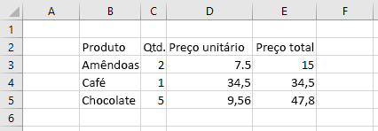

# <a name="work-with-ranges-using-the-excel-javascript-api"></a><span data-ttu-id="ecbab-103">Trabalhar com intervalos usando a API JavaScript do Excel</span><span class="sxs-lookup"><span data-stu-id="ecbab-103">Work with ranges using the Excel JavaScript API</span></span>

<span data-ttu-id="ecbab-104">Este artigo fornece exemplos de código que mostram como executar tarefas comuns com intervalos usando a API JavaScript do Excel.</span><span class="sxs-lookup"><span data-stu-id="ecbab-104">This article provides code samples that show how to perform common tasks with ranges using the Excel JavaScript API.</span></span> <span data-ttu-id="ecbab-105">Para obter a lista completa de propriedades e métodos aos quais o `Range` objeto oferece suporte, consulte [objeto Range (API JavaScript para Excel)](/javascript/api/excel/excel.range).</span><span class="sxs-lookup"><span data-stu-id="ecbab-105">For the complete list of properties and methods that the `Range` object supports, see [Range Object (JavaScript API for Excel)](/javascript/api/excel/excel.range).</span></span>

> [!NOTE]
> <span data-ttu-id="ecbab-106">Confira exemplos de código que mostram como executar tarefas avançadas com intervalos em [Trabalhar com intervalos usando a API JavaScript do Excel (avançado)](excel-add-ins-ranges-advanced.md).</span><span class="sxs-lookup"><span data-stu-id="ecbab-106">For code samples that show how to perform more advanced tasks with ranges, see [Work with ranges using the Excel JavaScript API (advanced)](excel-add-ins-ranges-advanced.md).</span></span>

## <a name="get-a-range"></a><span data-ttu-id="ecbab-107">Obter um intervalo</span><span class="sxs-lookup"><span data-stu-id="ecbab-107">Get a range</span></span>

<span data-ttu-id="ecbab-108">Os exemplos a seguir mostram diferentes maneiras de obter uma referência a um intervalo em uma planilha.</span><span class="sxs-lookup"><span data-stu-id="ecbab-108">The following examples show different ways to get a reference to a range within a worksheet.</span></span>

### <a name="get-range-by-address"></a><span data-ttu-id="ecbab-109">Obter intervalo por endereço</span><span class="sxs-lookup"><span data-stu-id="ecbab-109">Get range by address</span></span>

<span data-ttu-id="ecbab-110">O exemplo de código a seguir obtém o intervalo com o endereço **B2: C5** da planilha chamada **amostra**, carrega sua `address` propriedade e grava uma mensagem no console.</span><span class="sxs-lookup"><span data-stu-id="ecbab-110">The following code sample gets the range with address **B2:C5** from the worksheet named **Sample**, loads its `address` property, and writes a message to the console.</span></span>

```js
Excel.run(function (context) {
    var sheet = context.workbook.worksheets.getItem("Sample");
    var range = sheet.getRange("B2:C5");
    range.load("address");

    return context.sync()
        .then(function () {
            console.log(`The address of the range B2:C5 is "${range.address}"`);
        });
}).catch(errorHandlerFunction);
```

### <a name="get-range-by-name"></a><span data-ttu-id="ecbab-111">Obter intervalo por nome</span><span class="sxs-lookup"><span data-stu-id="ecbab-111">Get range by name</span></span>

<span data-ttu-id="ecbab-112">O exemplo de código a seguir obtém o intervalo nomeado `MyRange` da planilha chamada **amostra**, carrega sua `address` propriedade e grava uma mensagem no console.</span><span class="sxs-lookup"><span data-stu-id="ecbab-112">The following code sample gets the range named `MyRange` from the worksheet named **Sample**, loads its `address` property, and writes a message to the console.</span></span>

```js
Excel.run(function (context) {
    var sheet = context.workbook.worksheets.getItem("Sample");
    var range = sheet.getRange("MyRange");
    range.load("address");

    return context.sync()
        .then(function () {
            console.log(`The address of the range "MyRange" is "${range.address}"`);
        });
}).catch(errorHandlerFunction);
```

### <a name="get-used-range"></a><span data-ttu-id="ecbab-113">Obter intervalo usado</span><span class="sxs-lookup"><span data-stu-id="ecbab-113">Get used range</span></span>

<span data-ttu-id="ecbab-114">O exemplo de código a seguir obtém o intervalo usado da planilha chamada **amostra**, carrega sua `address` propriedade e grava uma mensagem no console.</span><span class="sxs-lookup"><span data-stu-id="ecbab-114">The following code sample gets the used range from the worksheet named **Sample**, loads its `address` property, and writes a message to the console.</span></span> <span data-ttu-id="ecbab-115">O intervalo usado é o menor intervalo que abrange todas as células na planilha que têm um valor ou uma formatação atribuída a elas.</span><span class="sxs-lookup"><span data-stu-id="ecbab-115">The used range is the smallest range that encompasses any cells in the worksheet that have a value or formatting assigned to them.</span></span> <span data-ttu-id="ecbab-116">Se a planilha inteira estiver em branco, o `getUsedRange()` método retornará um intervalo que consiste apenas na célula superior esquerda na planilha.</span><span class="sxs-lookup"><span data-stu-id="ecbab-116">If the entire worksheet is blank, the `getUsedRange()` method returns a range that consists of only the top-left cell in the worksheet.</span></span>

```js
Excel.run(function (context) {
    var sheet = context.workbook.worksheets.getItem("Sample");
    var range = sheet.getUsedRange();
    range.load("address");

    return context.sync()
        .then(function () {
            console.log(`The address of the used range in the worksheet is "${range.address}"`);
        });
}).catch(errorHandlerFunction);
```

### <a name="get-entire-range"></a><span data-ttu-id="ecbab-117">Obter intervalo inteiro</span><span class="sxs-lookup"><span data-stu-id="ecbab-117">Get entire range</span></span>

<span data-ttu-id="ecbab-118">O exemplo de código a seguir obtém todo o intervalo de planilha da planilha chamada **amostra**, carrega sua `address` propriedade e grava uma mensagem no console.</span><span class="sxs-lookup"><span data-stu-id="ecbab-118">The following code sample gets the entire worksheet range from the worksheet named **Sample**, loads its `address` property, and writes a message to the console.</span></span>

```js
Excel.run(function (context) {
    var sheet = context.workbook.worksheets.getItem("Sample");
    var range = sheet.getRange();
    range.load("address");

    return context.sync()
        .then(function () {
            console.log(`The address of the entire worksheet range is "${range.address}"`);
        });
}).catch(errorHandlerFunction);
```

## <a name="insert-a-range-of-cells"></a><span data-ttu-id="ecbab-119">Inserir um intervalo de células</span><span class="sxs-lookup"><span data-stu-id="ecbab-119">Insert a range of cells</span></span>

<span data-ttu-id="ecbab-120">O exemplo de código a seguir insere um intervalo de células no local **B4:E4** e desloca outras células para baixo a fim de fornecer espaço para as novas células.</span><span class="sxs-lookup"><span data-stu-id="ecbab-120">The following code sample inserts a range of cells in location **B4:E4** and shifts other cells down to provide space for the new cells.</span></span>

```js
Excel.run(function (context) {
    var sheet = context.workbook.worksheets.getItem("Sample");
    var range = sheet.getRange("B4:E4");

    range.insert(Excel.InsertShiftDirection.down);

    return context.sync();
}).catch(errorHandlerFunction);
```

### <a name="data-before-range-is-inserted"></a><span data-ttu-id="ecbab-121">Dados antes da inserção do intervalo</span><span class="sxs-lookup"><span data-stu-id="ecbab-121">Data before range is inserted</span></span>


### <a name="data-after-range-is-inserted"></a><span data-ttu-id="ecbab-123">Dados após a inserção do intervalo</span><span class="sxs-lookup"><span data-stu-id="ecbab-123">Data after range is inserted</span></span>


## <a name="clear-a-range-of-cells"></a><span data-ttu-id="ecbab-125">Limpar um intervalo de células</span><span class="sxs-lookup"><span data-stu-id="ecbab-125">Clear a range of cells</span></span>

<span data-ttu-id="ecbab-126">O exemplo de código a seguir limpa todo o conteúdo e a formatação das células no intervalo **E2:E5**.</span><span class="sxs-lookup"><span data-stu-id="ecbab-126">The following code sample clears all contents and formatting of cells in the range **E2:E5**.</span></span>  

```js
Excel.run(function (context) {
    var sheet = context.workbook.worksheets.getItem("Sample");
    var range = sheet.getRange("E2:E5");

    range.clear();

    return context.sync();
}).catch(errorHandlerFunction);
```

### <a name="data-before-range-is-cleared"></a><span data-ttu-id="ecbab-127">Dados antes da limpeza do intervalo</span><span class="sxs-lookup"><span data-stu-id="ecbab-127">Data before range is cleared</span></span>


### <a name="data-after-range-is-cleared"></a><span data-ttu-id="ecbab-129">Dados após a limpeza do intervalo</span><span class="sxs-lookup"><span data-stu-id="ecbab-129">Data after range is cleared</span></span>


## <a name="delete-a-range-of-cells"></a><span data-ttu-id="ecbab-131">Excluir um intervalo de células</span><span class="sxs-lookup"><span data-stu-id="ecbab-131">Delete a range of cells</span></span>

<span data-ttu-id="ecbab-132">O exemplo de código a seguir exclui as células no intervalo **B4:E4** e desloca outras células para cima a fim de preencher o espaço deixado pelas células excluídas.</span><span class="sxs-lookup"><span data-stu-id="ecbab-132">The following code sample deletes the cells in the range **B4:E4** and shift other cells up to fill the space that was vacated by the deleted cells.</span></span>

```js
Excel.run(function (context) {
    var sheet = context.workbook.worksheets.getItem("Sample");
    var range = sheet.getRange("B4:E4");

    range.delete(Excel.DeleteShiftDirection.up);

    return context.sync();
}).catch(errorHandlerFunction);
```

### <a name="data-before-range-is-deleted"></a><span data-ttu-id="ecbab-133">Dados antes da exclusão do intervalo</span><span class="sxs-lookup"><span data-stu-id="ecbab-133">Data before range is deleted</span></span>


### <a name="data-after-range-is-deleted"></a><span data-ttu-id="ecbab-135">Dados após a exclusão do intervalo</span><span class="sxs-lookup"><span data-stu-id="ecbab-135">Data after range is deleted</span></span>


## <a name="set-the-selected-range"></a><span data-ttu-id="ecbab-137">Definir o intervalo selecionado</span><span class="sxs-lookup"><span data-stu-id="ecbab-137">Set the selected range</span></span>

<span data-ttu-id="ecbab-138">O exemplo de código a seguir seleciona o intervalo **B2:E6** na planilha ativa.</span><span class="sxs-lookup"><span data-stu-id="ecbab-138">The following code sample selects the range **B2:E6** in the active worksheet.</span></span>

```js
Excel.run(function (context) {
    var sheet = context.workbook.worksheets.getActiveWorksheet();
    var range = sheet.getRange("B2:E6");

    range.select();

    return context.sync();
}).catch(errorHandlerFunction);
```

### <a name="selected-range-b2e6"></a><span data-ttu-id="ecbab-139">Intervalo selecionado B2:E6</span><span class="sxs-lookup"><span data-stu-id="ecbab-139">Selected range B2:E6</span></span>


## <a name="get-the-selected-range"></a><span data-ttu-id="ecbab-141">Obter o intervalo selecionado</span><span class="sxs-lookup"><span data-stu-id="ecbab-141">Get the selected range</span></span>

<span data-ttu-id="ecbab-142">O exemplo de código a seguir obtém o intervalo selecionado, carrega sua `address` propriedade e grava uma mensagem no console.</span><span class="sxs-lookup"><span data-stu-id="ecbab-142">The following code sample gets the selected range, loads its `address` property, and writes a message to the console.</span></span>

```js
Excel.run(function (context) {
    var range = context.workbook.getSelectedRange();
    range.load("address");

    return context.sync()
        .then(function () {
            console.log(`The address of the selected range is "${range.address}"`);
        });
}).catch(errorHandlerFunction);
```

## <a name="set-values-or-formulas"></a><span data-ttu-id="ecbab-143">Definir valores ou fórmulas</span><span class="sxs-lookup"><span data-stu-id="ecbab-143">Set values or formulas</span></span>

<span data-ttu-id="ecbab-144">Os exemplos a seguir mostram como definir valores e fórmulas para uma única célula ou um intervalo de células.</span><span class="sxs-lookup"><span data-stu-id="ecbab-144">The following examples show how to set values and formulas for a single cell or a range of cells.</span></span>

### <a name="set-value-for-a-single-cell"></a><span data-ttu-id="ecbab-145">Definir valor para uma única célula</span><span class="sxs-lookup"><span data-stu-id="ecbab-145">Set value for a single cell</span></span>

<span data-ttu-id="ecbab-146">O exemplo de código a seguir define o valor da célula **C3** como "5" e, em seguida, define a largura das colunas para melhor ajustar os dados.</span><span class="sxs-lookup"><span data-stu-id="ecbab-146">The following code sample sets the value of cell **C3** to "5" and then sets the width of the columns to best fit the data.</span></span>

```js
Excel.run(function (context) {
    var sheet = context.workbook.worksheets.getItem("Sample");

    var range = sheet.getRange("C3");
    range.values = [[ 5 ]];
    range.format.autofitColumns();

    return context.sync();
}).catch(errorHandlerFunction);
```

#### <a name="data-before-cell-value-is-updated"></a><span data-ttu-id="ecbab-147">Dados antes da atualização do valor da célula</span><span class="sxs-lookup"><span data-stu-id="ecbab-147">Data before cell value is updated</span></span>


#### <a name="data-after-cell-value-is-updated"></a><span data-ttu-id="ecbab-149">Dados após a atualização do valor da célula</span><span class="sxs-lookup"><span data-stu-id="ecbab-149">Data after cell value is updated</span></span>


### <a name="set-values-for-a-range-of-cells"></a><span data-ttu-id="ecbab-151">Definir valores para um intervalo de células</span><span class="sxs-lookup"><span data-stu-id="ecbab-151">Set values for a range of cells</span></span>

<span data-ttu-id="ecbab-152">O exemplo de código a seguir define valores das células no intervalo **B5:D5** e, em seguida, define a largura das colunas para melhor ajustar os dados.</span><span class="sxs-lookup"><span data-stu-id="ecbab-152">The following code sample sets values for the cells in the range **B5:D5** and then sets the width of the columns to best fit the data.</span></span>

```js
Excel.run(function (context) {
    var sheet = context.workbook.worksheets.getItem("Sample");

    var data = [
        ["Potato Chips", 10, 1.80],
    ];

    var range = sheet.getRange("B5:D5");
    range.values = data;
    range.format.autofitColumns();

    return context.sync();
}).catch(errorHandlerFunction);
```

#### <a name="data-before-cell-values-are-updated"></a><span data-ttu-id="ecbab-153">Dados antes da atualização dos valores da célula</span><span class="sxs-lookup"><span data-stu-id="ecbab-153">Data before cell values are updated</span></span>


#### <a name="data-after-cell-values-are-updated"></a><span data-ttu-id="ecbab-155">Dados após a atualização dos valores da célula</span><span class="sxs-lookup"><span data-stu-id="ecbab-155">Data after cell values are updated</span></span>


### <a name="set-formula-for-a-single-cell"></a><span data-ttu-id="ecbab-157">Definir fórmula para uma única célula</span><span class="sxs-lookup"><span data-stu-id="ecbab-157">Set formula for a single cell</span></span>

<span data-ttu-id="ecbab-158">O exemplo de código a seguir define uma fórmula para a célula **E3** e, em seguida, define a largura das colunas para melhor ajustar os dados.</span><span class="sxs-lookup"><span data-stu-id="ecbab-158">The following code sample sets a formula for cell **E3** and then sets the width of the columns to best fit the data.</span></span>

```js
Excel.run(function (context) {
    var sheet = context.workbook.worksheets.getItem("Sample");

    var range = sheet.getRange("E3");
    range.formulas = [[ "=C3 * D3" ]];
    range.format.autofitColumns();

    return context.sync();
}).catch(errorHandlerFunction);
```

#### <a name="data-before-cell-formula-is-set"></a><span data-ttu-id="ecbab-159">Dados antes da definição da fórmula da célula</span><span class="sxs-lookup"><span data-stu-id="ecbab-159">Data before cell formula is set</span></span>


#### <a name="data-after-cell-formula-is-set"></a><span data-ttu-id="ecbab-161">Dados após a definição da fórmula da célula</span><span class="sxs-lookup"><span data-stu-id="ecbab-161">Data after cell formula is set</span></span>


### <a name="set-formulas-for-a-range-of-cells"></a><span data-ttu-id="ecbab-163">Definir fórmulas para um intervalo de células</span><span class="sxs-lookup"><span data-stu-id="ecbab-163">Set formulas for a range of cells</span></span>

<span data-ttu-id="ecbab-164">O exemplo de código a seguir define fórmulas para células no intervalo **E2:E6** e, em seguida, define a largura das colunas para melhor ajustar os dados.</span><span class="sxs-lookup"><span data-stu-id="ecbab-164">The following code sample sets formulas for cells in the range **E2:E6** and then sets the width of the columns to best fit the data.</span></span>

```js
Excel.run(function (context) {
    var sheet = context.workbook.worksheets.getItem("Sample");

    var data = [
        ["=C3 * D3"],
        ["=C4 * D4"],
        ["=C5 * D5"],
        ["=SUM(E3:E5)"]
    ];

    var range = sheet.getRange("E3:E6");
    range.formulas = data;
    range.format.autofitColumns();

    return context.sync();
}).catch(errorHandlerFunction);
```

#### <a name="data-before-cell-formulas-are-set"></a><span data-ttu-id="ecbab-165">Dados antes da definição das fórmulas da célula</span><span class="sxs-lookup"><span data-stu-id="ecbab-165">Data before cell formulas are set</span></span>


#### <a name="data-after-cell-formulas-are-set"></a><span data-ttu-id="ecbab-167">Dados após a definição das fórmulas da célula</span><span class="sxs-lookup"><span data-stu-id="ecbab-167">Data after cell formulas are set</span></span>


## <a name="get-values-text-or-formulas"></a><span data-ttu-id="ecbab-169">Obter valores, texto ou fórmulas</span><span class="sxs-lookup"><span data-stu-id="ecbab-169">Get values, text, or formulas</span></span>

<span data-ttu-id="ecbab-170">Estes exemplos mostram como obter valores, texto e fórmulas de um intervalo de células.</span><span class="sxs-lookup"><span data-stu-id="ecbab-170">These examples show how to get values, text, and formulas from a range of cells.</span></span>

### <a name="get-values-from-a-range-of-cells"></a><span data-ttu-id="ecbab-171">Obter valores de um intervalo de células</span><span class="sxs-lookup"><span data-stu-id="ecbab-171">Get values from a range of cells</span></span>

<span data-ttu-id="ecbab-172">O exemplo de código a seguir obtém o intervalo **B2: E6**, carrega sua `values` propriedade e grava os valores no console.</span><span class="sxs-lookup"><span data-stu-id="ecbab-172">The following code sample gets the range **B2:E6**, loads its `values` property, and writes the values to the console.</span></span> <span data-ttu-id="ecbab-173">A `values` propriedade de um intervalo especifica os valores brutos que as células contêm.</span><span class="sxs-lookup"><span data-stu-id="ecbab-173">The `values` property of a range specifies the raw values that the cells contain.</span></span> <span data-ttu-id="ecbab-174">Mesmo que algumas células em um intervalo contenham fórmulas, a `values` Propriedade do intervalo especifica os valores brutos para essas células, e não qualquer uma das fórmulas.</span><span class="sxs-lookup"><span data-stu-id="ecbab-174">Even if some cells in a range contain formulas, the `values` property of the range specifies the raw values for those cells, not any of the formulas.</span></span>

```js
Excel.run(function (context) {
    var sheet = context.workbook.worksheets.getItem("Sample");
    var range = sheet.getRange("B2:E6");
    range.load("values");

    return context.sync()
        .then(function () {
            console.log(JSON.stringify(range.values, null, 4));
        });
}).catch(errorHandlerFunction);
```

#### <a name="data-in-range-values-in-column-e-are-a-result-of-formulas"></a><span data-ttu-id="ecbab-175">Dados no intervalo (valores na coluna E são um resultado de fórmulas)</span><span class="sxs-lookup"><span data-stu-id="ecbab-175">Data in range (values in column E are a result of formulas)</span></span>


#### <a name="rangevalues-as-logged-to-the-console-by-the-code-sample-above"></a><span data-ttu-id="ecbab-177">range.values (conforme registrado em log no console pelo exemplo de código acima)</span><span class="sxs-lookup"><span data-stu-id="ecbab-177">range.values (as logged to the console by the code sample above)</span></span>

```json
[
    [
        "Product",
        "Qty",
        "Unit Price",
        "Total Price"
    ],
    [
        "Almonds",
        2,
        7.5,
        15
    ],
    [
        "Coffee",
        1,
        34.5,
        34.5
    ],
    [
        "Chocolate",
        5,
        9.56,
        47.8
    ],
    [
        "",
        "",
        "",
        97.3
    ]
]
```

### <a name="get-text-from-a-range-of-cells"></a><span data-ttu-id="ecbab-178">Obter texto de um intervalo de células</span><span class="sxs-lookup"><span data-stu-id="ecbab-178">Get text from a range of cells</span></span>

<span data-ttu-id="ecbab-179">O exemplo de código a seguir obtém o intervalo **B2: E6**, carrega sua `text` propriedade e o grava no console.</span><span class="sxs-lookup"><span data-stu-id="ecbab-179">The following code sample gets the range **B2:E6**, loads its `text` property, and writes it to the console.</span></span> <span data-ttu-id="ecbab-180">A `text` propriedade de um intervalo especifica os valores de exibição para as células no intervalo.</span><span class="sxs-lookup"><span data-stu-id="ecbab-180">The `text` property of a range specifies the display values for cells in the range.</span></span> <span data-ttu-id="ecbab-181">Mesmo que algumas células em um intervalo contenham fórmulas, a `text` Propriedade do intervalo especifica os valores de exibição para essas células, e não qualquer uma das fórmulas.</span><span class="sxs-lookup"><span data-stu-id="ecbab-181">Even if some cells in a range contain formulas, the `text` property of the range specifies the display values for those cells, not any of the formulas.</span></span>

```js
Excel.run(function (context) {
    var sheet = context.workbook.worksheets.getItem("Sample");
    var range = sheet.getRange("B2:E6");
    range.load("text");

    return context.sync()
        .then(function () {
            console.log(JSON.stringify(range.text, null, 4));
        });
}).catch(errorHandlerFunction);
```

#### <a name="data-in-range-values-in-column-e-are-a-result-of-formulas"></a><span data-ttu-id="ecbab-182">Dados no intervalo (valores na coluna E são um resultado de fórmulas)</span><span class="sxs-lookup"><span data-stu-id="ecbab-182">Data in range (values in column E are a result of formulas)</span></span>


#### <a name="rangetext-as-logged-to-the-console-by-the-code-sample-above"></a><span data-ttu-id="ecbab-184">range.text (conforme registrado em log no console pelo exemplo de código acima)</span><span class="sxs-lookup"><span data-stu-id="ecbab-184">range.text (as logged to the console by the code sample above)</span></span>

```json
[
    [
        "Product",
        "Qty",
        "Unit Price",
        "Total Price"
    ],
    [
        "Almonds",
        "2",
        "7.5",
        "15"
    ],
    [
        "Coffee",
        "1",
        "34.5",
        "34.5"
    ],
    [
        "Chocolate",
        "5",
        "9.56",
        "47.8"
    ],
    [
        "",
        "",
        "",
        "97.3"
    ]
]
```

### <a name="get-formulas-from-a-range-of-cells"></a><span data-ttu-id="ecbab-185">Obter fórmulas de um intervalo de células</span><span class="sxs-lookup"><span data-stu-id="ecbab-185">Get formulas from a range of cells</span></span>

<span data-ttu-id="ecbab-186">O exemplo de código a seguir obtém o intervalo **B2: E6**, carrega sua `formulas` propriedade e o grava no console.</span><span class="sxs-lookup"><span data-stu-id="ecbab-186">The following code sample gets the range **B2:E6**, loads its `formulas` property, and writes it to the console.</span></span> <span data-ttu-id="ecbab-187">A `formulas` propriedade de um intervalo especifica as fórmulas para células no intervalo que contêm fórmulas e os valores brutos para células no intervalo que não contêm fórmulas.</span><span class="sxs-lookup"><span data-stu-id="ecbab-187">The `formulas` property of a range specifies the formulas for cells in the range that contain formulas and the raw values for cells in the range that do not contain formulas.</span></span>

```js
Excel.run(function (context) {
    var sheet = context.workbook.worksheets.getItem("Sample");
    var range = sheet.getRange("B2:E6");
    range.load("formulas");

    return context.sync()
        .then(function () {
            console.log(JSON.stringify(range.formulas, null, 4));
        });
}).catch(errorHandlerFunction);
```

#### <a name="data-in-range-values-in-column-e-are-a-result-of-formulas"></a><span data-ttu-id="ecbab-188">Dados no intervalo (valores na coluna E são um resultado de fórmulas)</span><span class="sxs-lookup"><span data-stu-id="ecbab-188">Data in range (values in column E are a result of formulas)</span></span>


#### <a name="rangeformulas-as-logged-to-the-console-by-the-code-sample-above"></a><span data-ttu-id="ecbab-190">range.formulas (conforme registrado em log no console pelo exemplo de código acima)</span><span class="sxs-lookup"><span data-stu-id="ecbab-190">range.formulas (as logged to the console by the code sample above)</span></span>

```json
[
    [
        "Product",
        "Qty",
        "Unit Price",
        "Total Price"
    ],
    [
        "Almonds",
        2,
        7.5,
        "=C3 * D3"
    ],
    [
        "Coffee",
        1,
        34.5,
        "=C4 * D4"
    ],
    [
        "Chocolate",
        5,
        9.56,
        "=C5 * D5"
    ],
    [
        "",
        "",
        "",
        "=SUM(E3:E5)"
    ]
]
```

## <a name="set-range-format"></a><span data-ttu-id="ecbab-191">Definir formato do intervalo</span><span class="sxs-lookup"><span data-stu-id="ecbab-191">Set range format</span></span>

<span data-ttu-id="ecbab-192">Os exemplos a seguir mostram como definir a cor da fonte, a cor de preenchimento e o formato de número para células em um intervalo.</span><span class="sxs-lookup"><span data-stu-id="ecbab-192">The following examples show how to set font color, fill color, and number format for cells in a range.</span></span>

### <a name="set-font-color-and-fill-color"></a><span data-ttu-id="ecbab-193">Definir cor da fonte e cor de preenchimento</span><span class="sxs-lookup"><span data-stu-id="ecbab-193">Set font color and fill color</span></span>

<span data-ttu-id="ecbab-194">O exemplo de código a seguir define a cor da fonte e a cor de preenchimento para células no intervalo **B2:E2**.</span><span class="sxs-lookup"><span data-stu-id="ecbab-194">The following code sample sets the font color and fill color for cells in range **B2:E2**.</span></span>

```js
Excel.run(function (context) {
    var sheet = context.workbook.worksheets.getItem("Sample");

    var range = sheet.getRange("B2:E2");
    range.format.fill.color = "#4472C4";
    range.format.font.color = "white";

    return context.sync();
}).catch(errorHandlerFunction);
```

#### <a name="data-in-range-before-font-color-and-fill-color-are-set"></a><span data-ttu-id="ecbab-195">Dados no intervalo antes da definição da cor da fonte e da cor de preenchimento</span><span class="sxs-lookup"><span data-stu-id="ecbab-195">Data in range before font color and fill color are set</span></span>



#### <a name="data-in-range-after-font-color-and-fill-color-are-set"></a><span data-ttu-id="ecbab-197">Dados no intervalo após a definição da cor da fonte e da cor de preenchimento</span><span class="sxs-lookup"><span data-stu-id="ecbab-197">Data in range after font color and fill color are set</span></span>


### <a name="set-number-format"></a><span data-ttu-id="ecbab-199">Definir formato de número</span><span class="sxs-lookup"><span data-stu-id="ecbab-199">Set number format</span></span>

<span data-ttu-id="ecbab-200">O exemplo de código a seguir define o formato de número para as células no intervalo **D3:E5**.</span><span class="sxs-lookup"><span data-stu-id="ecbab-200">The following code sample sets the number format for the cells in range **D3:E5**.</span></span>

```js
Excel.run(function (context) {
    var sheet = context.workbook.worksheets.getItem("Sample");

    var formats = [
        ["0.00", "0.00"],
        ["0.00", "0.00"],
        ["0.00", "0.00"]
    ];

    var range = sheet.getRange("D3:E5");
    range.numberFormat = formats;

    return context.sync();
}).catch(errorHandlerFunction);
```

#### <a name="data-in-range-before-number-format-is-set"></a><span data-ttu-id="ecbab-201">Dados no intervalo antes da definição do formato de número</span><span class="sxs-lookup"><span data-stu-id="ecbab-201">Data in range before number format is set</span></span>


#### <a name="data-in-range-after-number-format-is-set"></a><span data-ttu-id="ecbab-203">Dados no intervalo após a definição do formato de número</span><span class="sxs-lookup"><span data-stu-id="ecbab-203">Data in range after number format is set</span></span>


## <a name="read-or-write-to-an-unbounded-range"></a><span data-ttu-id="ecbab-205">Ler ou gravar em um intervalo não limitado</span><span class="sxs-lookup"><span data-stu-id="ecbab-205">Read or write to an unbounded range</span></span>

### <a name="read-an-unbounded-range"></a><span data-ttu-id="ecbab-206">Ler um intervalo não limitado</span><span class="sxs-lookup"><span data-stu-id="ecbab-206">Read an unbounded range</span></span>

<span data-ttu-id="ecbab-207">Um endereço de intervalo não associado é um endereço de intervalo que especifica colunas inteiras ou linhas inteiras.</span><span class="sxs-lookup"><span data-stu-id="ecbab-207">An unbounded range address is a range address that specifies either entire columns or entire rows.</span></span> <span data-ttu-id="ecbab-208">Por exemplo:</span><span class="sxs-lookup"><span data-stu-id="ecbab-208">For example:</span></span>

- <span data-ttu-id="ecbab-209">Endereços de intervalo compostos de colunas inteiras:</span><span class="sxs-lookup"><span data-stu-id="ecbab-209">Range addresses comprised of entire columns:</span></span><ul><li>`C:C`</li><li>`A:F`</li></ul>
- <span data-ttu-id="ecbab-210">Endereços de intervalo compostos de linhas inteiras:</span><span class="sxs-lookup"><span data-stu-id="ecbab-210">Range addresses comprised of entire rows:</span></span><ul><li>`2:2`</li><li>`1:4`</li></ul>

<span data-ttu-id="ecbab-p107">Quando uma API faz uma solicitação para recuperar um intervalo não limitado (por exemplo, `getRange('C:C')`), a resposta conterá valores `null` para as propriedades no nível de célula, como `values`, `text`, `numberFormat` e `formula`. Outras propriedades do intervalo, como `address` e `cellCount`, conterão valores válidos para o intervalo não limitado.</span><span class="sxs-lookup"><span data-stu-id="ecbab-p107">When the API makes a request to retrieve an unbounded range (for example, `getRange('C:C')`), the response will contain `null` values for cell-level properties such as `values`, `text`, `numberFormat`, and `formula`. Other properties of the range, such as `address` and `cellCount`, will contain valid values for the unbounded range.</span></span>

### <a name="write-to-an-unbounded-range"></a><span data-ttu-id="ecbab-213">Gravar em um intervalo não limitado</span><span class="sxs-lookup"><span data-stu-id="ecbab-213">Write to an unbounded range</span></span>

<span data-ttu-id="ecbab-214">Você não pode definir propriedades de nível de célula, como `values` , `numberFormat` e `formula` em um intervalo não associado, pois a solicitação de entrada é muito grande.</span><span class="sxs-lookup"><span data-stu-id="ecbab-214">You cannot set cell-level properties such as `values`, `numberFormat`, and `formula` on an unbounded range because the input request is too large.</span></span> <span data-ttu-id="ecbab-215">Por exemplo, o trecho de código a seguir não é válida porque ele tenta especificar `values` para um intervalo não limitado.</span><span class="sxs-lookup"><span data-stu-id="ecbab-215">For example, the following code snippet is not valid because it attempts to specify `values` for an unbounded range.</span></span> <span data-ttu-id="ecbab-216">A API retornará um erro se você tentar definir propriedades de nível de célula para um intervalo não associado.</span><span class="sxs-lookup"><span data-stu-id="ecbab-216">The API returns an error if you attempt to set cell-level properties for an unbounded range.</span></span>

```js
var range = context.workbook.worksheets.getActiveWorksheet().getRange('A:B');
range.values = 'Due Date';
```

## <a name="read-or-write-to-a-large-range"></a><span data-ttu-id="ecbab-217">Ler ou gravar em um intervalo grande</span><span class="sxs-lookup"><span data-stu-id="ecbab-217">Read or write to a large range</span></span>

<span data-ttu-id="ecbab-p109">Se um intervalo contiver um grande número de células, valores, formatos de número e/ou fórmulas, talvez não seja possível executar operações de API nesse intervalo. A API sempre fará a melhor tentativa de executar a operação solicitada em um intervalo (isto é, para recuperar ou gravar os dados especificados), mas tentar executar operações de leitura ou gravação para um intervalo grande pode resultar em um erro de API devido à utilização excessiva de recursos. Para evitar tais erros, é recomendável executar operações de leitura ou gravação separadas para subconjuntos menores de um intervalo grande, em vez de tentar executar uma única operação de leitura ou gravação em um intervalo grande.</span><span class="sxs-lookup"><span data-stu-id="ecbab-p109">If a range contains a large number of cells, values, number formats, and/or formulas, it may not be possible to run API operations on that range. The API will always make a best attempt to run the requested operation on a range (i.e., to retrieve or write the specified data), but attempting to perform read or write operations for a large range may result in an API error due to excessive resource utilization. To avoid such errors, we recommend that you run separate read or write operations for smaller subsets of a large range, instead of attempting to run a single read or write operation on a large range.</span></span>

<span data-ttu-id="ecbab-221">Para obter detalhes sobre as limitações do sistema, consulte a seção "suplementos do Excel" de [limites de recurso e otimização de desempenho para suplementos do Office](../concepts/resource-limits-and-performance-optimization.md#excel-add-ins).</span><span class="sxs-lookup"><span data-stu-id="ecbab-221">For details on the system limitations, see the "Excel add-ins" section of [Resource limits and performance optimization for Office Add-ins](../concepts/resource-limits-and-performance-optimization.md#excel-add-ins).</span></span>

### <a name="conditional-formatting-of-ranges"></a><span data-ttu-id="ecbab-222">Formatação condicional de intervalos</span><span class="sxs-lookup"><span data-stu-id="ecbab-222">Conditional formatting of ranges</span></span>

<span data-ttu-id="ecbab-223">Os intervalos podem ter formatos aplicados a células individuais baseadas em condições.</span><span class="sxs-lookup"><span data-stu-id="ecbab-223">Ranges can have formats applied to individual cells based on conditions.</span></span> <span data-ttu-id="ecbab-224">Confira mais informações sobre isso em [Aplicar a formatação condicional a intervalos do Excel](excel-add-ins-conditional-formatting.md).</span><span class="sxs-lookup"><span data-stu-id="ecbab-224">For more information about this, see [Apply conditional formatting to Excel ranges](excel-add-ins-conditional-formatting.md).</span></span>

## <a name="find-a-cell-using-string-matching"></a><span data-ttu-id="ecbab-225">Localizar uma célula usando a cadeia de correspondência</span><span class="sxs-lookup"><span data-stu-id="ecbab-225">Find a cell using string matching</span></span>

<span data-ttu-id="ecbab-226">O objeto `Range` tem um método `find` para pesquisar uma cadeia especificada dentro do intervalo.</span><span class="sxs-lookup"><span data-stu-id="ecbab-226">The `Range` object has a `find` method to search for a specified string within the range.</span></span> <span data-ttu-id="ecbab-227">Ele retorna o intervalo da primeira célula com o texto correspondente.</span><span class="sxs-lookup"><span data-stu-id="ecbab-227">It returns the range of the first cell with matching text.</span></span> <span data-ttu-id="ecbab-228">O exemplo de código a seguir localiza a primeira célula com um valor igual à cadeia de caracteres **Alimentos** e registra o seu endereço no console.</span><span class="sxs-lookup"><span data-stu-id="ecbab-228">The following code sample finds the first cell with a value equal to the string **Food** and logs its address to the console.</span></span> <span data-ttu-id="ecbab-229">Observe que `find` exibe um erro `ItemNotFound` se a cadeia de caracteres especificada não existir no intervalo.</span><span class="sxs-lookup"><span data-stu-id="ecbab-229">Note that `find` throws an `ItemNotFound` error if the specified string doesn't exist in the range.</span></span> <span data-ttu-id="ecbab-230">Se você acha que a cadeia de caracteres especificada pode não estar no intervalo, use o método [findOrNullObject](../develop/application-specific-api-model.md#ornullobject-methods-and-properties) para que seu código manipule normalmente esse cenário.</span><span class="sxs-lookup"><span data-stu-id="ecbab-230">If you expect that the specified string may not exist in the range, use the [findOrNullObject](../develop/application-specific-api-model.md#ornullobject-methods-and-properties) method instead, so your code gracefully handles that scenario.</span></span>

```js
Excel.run(function (context) {
    var sheet = context.workbook.worksheets.getItem("Sample");
    var table = sheet.tables.getItem("ExpensesTable");
    var searchRange = table.getRange();
    var foundRange = searchRange.find("Food", {
        completeMatch: true, // find will match the whole cell value
        matchCase: false, // find will not match case
        searchDirection: Excel.SearchDirection.forward // find will start searching at the beginning of the range
    });

    foundRange.load("address");
    return context.sync()
        .then(function() {
            console.log(foundRange.address);
    });
}).catch(errorHandlerFunction);
```

<span data-ttu-id="ecbab-231">Quando o método `find` é chamado em um intervalo que representa uma única célula, a planilha inteira é pesquisada.</span><span class="sxs-lookup"><span data-stu-id="ecbab-231">When the `find` method is called on a range representing a single cell, the entire worksheet is searched.</span></span> <span data-ttu-id="ecbab-232">A pesquisa começa na célula e segue na direção especificada pelo `SearchCriteria.searchDirection`, envolvendo as extremidades da planilha, se necessário.</span><span class="sxs-lookup"><span data-stu-id="ecbab-232">The search begins at that cell and goes in the direction specified by `SearchCriteria.searchDirection`, wrapping around the ends of the worksheet if needed.</span></span>

## <a name="see-also"></a><span data-ttu-id="ecbab-233">Confira também</span><span class="sxs-lookup"><span data-stu-id="ecbab-233">See also</span></span>

- [<span data-ttu-id="ecbab-234">Trabalhar com intervalos usando a API JavaScript do Excel (avançado)</span><span class="sxs-lookup"><span data-stu-id="ecbab-234">Work with ranges using the Excel JavaScript API (advanced)</span></span>](excel-add-ins-ranges-advanced.md)
- [<span data-ttu-id="ecbab-235">Conceitos fundamentais de programação com a API JavaScript do Excel</span><span class="sxs-lookup"><span data-stu-id="ecbab-235">Fundamental programming concepts with the Excel JavaScript API</span></span>](excel-add-ins-core-concepts.md)
