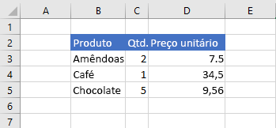
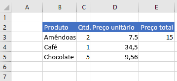

# <a name="work-with-ranges-using-the-excel-javascript-api"></a>Trabalhar com intervalos usando a API JavaScript do Excel

Este artigo fornece exemplos de código que mostram como executar tarefas comuns com intervalos usando a API JavaScript do Excel. Para obter a lista completa de propriedades e métodos aos quais o `Range` objeto oferece suporte, consulte [objeto Range (API JavaScript para Excel)](/javascript/api/excel/excel.range).

> [!NOTE]
> Confira exemplos de código que mostram como executar tarefas avançadas com intervalos em [Trabalhar com intervalos usando a API JavaScript do Excel (avançado)](excel-add-ins-ranges-advanced.md).

## <a name="get-a-range"></a>Obter um intervalo

Os exemplos a seguir mostram diferentes maneiras de obter uma referência a um intervalo em uma planilha.

### <a name="get-range-by-address"></a>Obter intervalo por endereço

O exemplo de código a seguir obtém o intervalo com o endereço **B2: C5** da planilha chamada **amostra**, carrega sua `address` propriedade e grava uma mensagem no console.

```js
Excel.run(function (context) {
    var sheet = context.workbook.worksheets.getItem("Sample");
    var range = sheet.getRange("B2:C5");
    range.load("address");

    return context.sync()
        .then(function () {
            console.log(`The address of the range B2:C5 is "${range.address}"`);
        });
}).catch(errorHandlerFunction);
```

### <a name="get-range-by-name"></a>Obter intervalo por nome

O exemplo de código a seguir obtém o intervalo nomeado `MyRange` da planilha chamada **amostra**, carrega sua `address` propriedade e grava uma mensagem no console.

```js
Excel.run(function (context) {
    var sheet = context.workbook.worksheets.getItem("Sample");
    var range = sheet.getRange("MyRange");
    range.load("address");

    return context.sync()
        .then(function () {
            console.log(`The address of the range "MyRange" is "${range.address}"`);
        });
}).catch(errorHandlerFunction);
```

### <a name="get-used-range"></a>Obter intervalo usado

O exemplo de código a seguir obtém o intervalo usado da planilha chamada **amostra**, carrega sua `address` propriedade e grava uma mensagem no console. O intervalo usado é o menor intervalo que abrange todas as células na planilha que têm um valor ou uma formatação atribuída a elas. Se a planilha inteira estiver em branco, o `getUsedRange()` método retornará um intervalo que consiste apenas na célula superior esquerda na planilha.

```js
Excel.run(function (context) {
    var sheet = context.workbook.worksheets.getItem("Sample");
    var range = sheet.getUsedRange();
    range.load("address");

    return context.sync()
        .then(function () {
            console.log(`The address of the used range in the worksheet is "${range.address}"`);
        });
}).catch(errorHandlerFunction);
```

### <a name="get-entire-range"></a>Obter intervalo inteiro

O exemplo de código a seguir obtém todo o intervalo de planilha da planilha chamada **amostra**, carrega sua `address` propriedade e grava uma mensagem no console.

```js
Excel.run(function (context) {
    var sheet = context.workbook.worksheets.getItem("Sample");
    var range = sheet.getRange();
    range.load("address");

    return context.sync()
        .then(function () {
            console.log(`The address of the entire worksheet range is "${range.address}"`);
        });
}).catch(errorHandlerFunction);
```

## <a name="insert-a-range-of-cells"></a>Inserir um intervalo de células

O exemplo de código a seguir insere um intervalo de células no local **B4:E4** e desloca outras células para baixo a fim de fornecer espaço para as novas células.

```js
Excel.run(function (context) {
    var sheet = context.workbook.worksheets.getItem("Sample");
    var range = sheet.getRange("B4:E4");

    range.insert(Excel.InsertShiftDirection.down);

    return context.sync();
}).catch(errorHandlerFunction);
```

### <a name="data-before-range-is-inserted"></a>Dados antes da inserção do intervalo


### <a name="data-after-range-is-inserted"></a>Dados após a inserção do intervalo


## <a name="clear-a-range-of-cells"></a>Limpar um intervalo de células

O exemplo de código a seguir limpa todo o conteúdo e a formatação das células no intervalo **E2:E5**.  

```js
Excel.run(function (context) {
    var sheet = context.workbook.worksheets.getItem("Sample");
    var range = sheet.getRange("E2:E5");

    range.clear();

    return context.sync();
}).catch(errorHandlerFunction);
```

### <a name="data-before-range-is-cleared"></a>Dados antes da limpeza do intervalo


### <a name="data-after-range-is-cleared"></a>Dados após a limpeza do intervalo


## <a name="delete-a-range-of-cells"></a>Excluir um intervalo de células

O exemplo de código a seguir exclui as células no intervalo **B4:E4** e desloca outras células para cima a fim de preencher o espaço deixado pelas células excluídas.

```js
Excel.run(function (context) {
    var sheet = context.workbook.worksheets.getItem("Sample");
    var range = sheet.getRange("B4:E4");

    range.delete(Excel.DeleteShiftDirection.up);

    return context.sync();
}).catch(errorHandlerFunction);
```

### <a name="data-before-range-is-deleted"></a>Dados antes da exclusão do intervalo


### <a name="data-after-range-is-deleted"></a>Dados após a exclusão do intervalo


## <a name="set-the-selected-range"></a>Definir o intervalo selecionado

O exemplo de código a seguir seleciona o intervalo **B2:E6** na planilha ativa.

```js
Excel.run(function (context) {
    var sheet = context.workbook.worksheets.getActiveWorksheet();
    var range = sheet.getRange("B2:E6");

    range.select();

    return context.sync();
}).catch(errorHandlerFunction);
```

### <a name="selected-range-b2e6"></a>Intervalo selecionado B2:E6


## <a name="get-the-selected-range"></a>Obter o intervalo selecionado

O exemplo de código a seguir obtém o intervalo selecionado, carrega sua `address` propriedade e grava uma mensagem no console.

```js
Excel.run(function (context) {
    var range = context.workbook.getSelectedRange();
    range.load("address");

    return context.sync()
        .then(function () {
            console.log(`The address of the selected range is "${range.address}"`);
        });
}).catch(errorHandlerFunction);
```

## <a name="set-values-or-formulas"></a>Definir valores ou fórmulas

Os exemplos a seguir mostram como definir valores e fórmulas para uma única célula ou um intervalo de células.

### <a name="set-value-for-a-single-cell"></a>Definir valor para uma única célula

O exemplo de código a seguir define o valor da célula **C3** como "5" e, em seguida, define a largura das colunas para melhor ajustar os dados.

```js
Excel.run(function (context) {
    var sheet = context.workbook.worksheets.getItem("Sample");

    var range = sheet.getRange("C3");
    range.values = [[ 5 ]];
    range.format.autofitColumns();

    return context.sync();
}).catch(errorHandlerFunction);
```

#### <a name="data-before-cell-value-is-updated"></a>Dados antes da atualização do valor da célula



#### <a name="data-after-cell-value-is-updated"></a>Dados após a atualização do valor da célula


### <a name="set-values-for-a-range-of-cells"></a>Definir valores para um intervalo de células

O exemplo de código a seguir define valores das células no intervalo **B5:D5** e, em seguida, define a largura das colunas para melhor ajustar os dados.

```js
Excel.run(function (context) {
    var sheet = context.workbook.worksheets.getItem("Sample");

    var data = [
        ["Potato Chips", 10, 1.80],
    ];

    var range = sheet.getRange("B5:D5");
    range.values = data;
    range.format.autofitColumns();

    return context.sync();
}).catch(errorHandlerFunction);
```

#### <a name="data-before-cell-values-are-updated"></a>Dados antes da atualização dos valores da célula


#### <a name="data-after-cell-values-are-updated"></a>Dados após a atualização dos valores da célula


### <a name="set-formula-for-a-single-cell"></a>Definir fórmula para uma única célula

O exemplo de código a seguir define uma fórmula para a célula **E3** e, em seguida, define a largura das colunas para melhor ajustar os dados.

```js
Excel.run(function (context) {
    var sheet = context.workbook.worksheets.getItem("Sample");

    var range = sheet.getRange("E3");
    range.formulas = [[ "=C3 * D3" ]];
    range.format.autofitColumns();

    return context.sync();
}).catch(errorHandlerFunction);
```

#### <a name="data-before-cell-formula-is-set"></a>Dados antes da definição da fórmula da célula


#### <a name="data-after-cell-formula-is-set"></a>Dados após a definição da fórmula da célula



### <a name="set-formulas-for-a-range-of-cells"></a>Definir fórmulas para um intervalo de células

O exemplo de código a seguir define fórmulas para células no intervalo **E2:E6** e, em seguida, define a largura das colunas para melhor ajustar os dados.

```js
Excel.run(function (context) {
    var sheet = context.workbook.worksheets.getItem("Sample");

    var data = [
        ["=C3 * D3"],
        ["=C4 * D4"],
        ["=C5 * D5"],
        ["=SUM(E3:E5)"]
    ];

    var range = sheet.getRange("E3:E6");
    range.formulas = data;
    range.format.autofitColumns();

    return context.sync();
}).catch(errorHandlerFunction);
```

#### <a name="data-before-cell-formulas-are-set"></a>Dados antes da definição das fórmulas da célula


#### <a name="data-after-cell-formulas-are-set"></a>Dados após a definição das fórmulas da célula


## <a name="get-values-text-or-formulas"></a>Obter valores, texto ou fórmulas

Estes exemplos mostram como obter valores, texto e fórmulas de um intervalo de células.

### <a name="get-values-from-a-range-of-cells"></a>Obter valores de um intervalo de células

O exemplo de código a seguir obtém o intervalo **B2: E6**, carrega sua `values` propriedade e grava os valores no console. A `values` propriedade de um intervalo especifica os valores brutos que as células contêm. Mesmo que algumas células em um intervalo contenham fórmulas, a `values` Propriedade do intervalo especifica os valores brutos para essas células, e não qualquer uma das fórmulas.

```js
Excel.run(function (context) {
    var sheet = context.workbook.worksheets.getItem("Sample");
    var range = sheet.getRange("B2:E6");
    range.load("values");

    return context.sync()
        .then(function () {
            console.log(JSON.stringify(range.values, null, 4));
        });
}).catch(errorHandlerFunction);
```

#### <a name="data-in-range-values-in-column-e-are-a-result-of-formulas"></a>Dados no intervalo (valores na coluna E são um resultado de fórmulas)


#### <a name="rangevalues-as-logged-to-the-console-by-the-code-sample-above"></a>range.values (conforme registrado em log no console pelo exemplo de código acima)

```json
[
    [
        "Product",
        "Qty",
        "Unit Price",
        "Total Price"
    ],
    [
        "Almonds",
        2,
        7.5,
        15
    ],
    [
        "Coffee",
        1,
        34.5,
        34.5
    ],
    [
        "Chocolate",
        5,
        9.56,
        47.8
    ],
    [
        "",
        "",
        "",
        97.3
    ]
]
```

### <a name="get-text-from-a-range-of-cells"></a>Obter texto de um intervalo de células

O exemplo de código a seguir obtém o intervalo **B2: E6**, carrega sua `text` propriedade e o grava no console. A `text` propriedade de um intervalo especifica os valores de exibição para as células no intervalo. Mesmo que algumas células em um intervalo contenham fórmulas, a `text` Propriedade do intervalo especifica os valores de exibição para essas células, e não qualquer uma das fórmulas.

```js
Excel.run(function (context) {
    var sheet = context.workbook.worksheets.getItem("Sample");
    var range = sheet.getRange("B2:E6");
    range.load("text");

    return context.sync()
        .then(function () {
            console.log(JSON.stringify(range.text, null, 4));
        });
}).catch(errorHandlerFunction);
```

#### <a name="data-in-range-values-in-column-e-are-a-result-of-formulas"></a>Dados no intervalo (valores na coluna E são um resultado de fórmulas)


#### <a name="rangetext-as-logged-to-the-console-by-the-code-sample-above"></a>range.text (conforme registrado em log no console pelo exemplo de código acima)

```json
[
    [
        "Product",
        "Qty",
        "Unit Price",
        "Total Price"
    ],
    [
        "Almonds",
        "2",
        "7.5",
        "15"
    ],
    [
        "Coffee",
        "1",
        "34.5",
        "34.5"
    ],
    [
        "Chocolate",
        "5",
        "9.56",
        "47.8"
    ],
    [
        "",
        "",
        "",
        "97.3"
    ]
]
```

### <a name="get-formulas-from-a-range-of-cells"></a>Obter fórmulas de um intervalo de células

O exemplo de código a seguir obtém o intervalo **B2: E6**, carrega sua `formulas` propriedade e o grava no console. A `formulas` propriedade de um intervalo especifica as fórmulas para células no intervalo que contêm fórmulas e os valores brutos para células no intervalo que não contêm fórmulas.

```js
Excel.run(function (context) {
    var sheet = context.workbook.worksheets.getItem("Sample");
    var range = sheet.getRange("B2:E6");
    range.load("formulas");

    return context.sync()
        .then(function () {
            console.log(JSON.stringify(range.formulas, null, 4));
        });
}).catch(errorHandlerFunction);
```

#### <a name="data-in-range-values-in-column-e-are-a-result-of-formulas"></a>Dados no intervalo (valores na coluna E são um resultado de fórmulas)


#### <a name="rangeformulas-as-logged-to-the-console-by-the-code-sample-above"></a>range.formulas (conforme registrado em log no console pelo exemplo de código acima)

```json
[
    [
        "Product",
        "Qty",
        "Unit Price",
        "Total Price"
    ],
    [
        "Almonds",
        2,
        7.5,
        "=C3 * D3"
    ],
    [
        "Coffee",
        1,
        34.5,
        "=C4 * D4"
    ],
    [
        "Chocolate",
        5,
        9.56,
        "=C5 * D5"
    ],
    [
        "",
        "",
        "",
        "=SUM(E3:E5)"
    ]
]
```

## <a name="set-range-format"></a>Definir formato do intervalo

Os exemplos a seguir mostram como definir a cor da fonte, a cor de preenchimento e o formato de número para células em um intervalo.

### <a name="set-font-color-and-fill-color"></a>Definir cor da fonte e cor de preenchimento

O exemplo de código a seguir define a cor da fonte e a cor de preenchimento para células no intervalo **B2:E2**.

```js
Excel.run(function (context) {
    var sheet = context.workbook.worksheets.getItem("Sample");

    var range = sheet.getRange("B2:E2");
    range.format.fill.color = "#4472C4";
    range.format.font.color = "white";

    return context.sync();
}).catch(errorHandlerFunction);
```

#### <a name="data-in-range-before-font-color-and-fill-color-are-set"></a>Dados no intervalo antes da definição da cor da fonte e da cor de preenchimento


#### <a name="data-in-range-after-font-color-and-fill-color-are-set"></a>Dados no intervalo após a definição da cor da fonte e da cor de preenchimento


### <a name="set-number-format"></a>Definir formato de número

O exemplo de código a seguir define o formato de número para as células no intervalo **D3:E5**.

```js
Excel.run(function (context) {
    var sheet = context.workbook.worksheets.getItem("Sample");

    var formats = [
        ["0.00", "0.00"],
        ["0.00", "0.00"],
        ["0.00", "0.00"]
    ];

    var range = sheet.getRange("D3:E5");
    range.numberFormat = formats;

    return context.sync();
}).catch(errorHandlerFunction);
```

#### <a name="data-in-range-before-number-format-is-set"></a>Dados no intervalo antes da definição do formato de número


#### <a name="data-in-range-after-number-format-is-set"></a>Dados no intervalo após a definição do formato de número


## <a name="read-or-write-to-an-unbounded-range"></a>Ler ou gravar em um intervalo não limitado

### <a name="read-an-unbounded-range"></a>Ler um intervalo não limitado

Um endereço de intervalo não associado é um endereço de intervalo que especifica colunas inteiras ou linhas inteiras. Por exemplo:

- Endereços de intervalo compostos de colunas inteiras:<ul><li>`C:C`</li><li>`A:F`</li></ul>
- Endereços de intervalo compostos de linhas inteiras:<ul><li>`2:2`</li><li>`1:4`</li></ul>

Quando uma API faz uma solicitação para recuperar um intervalo não limitado (por exemplo, `getRange('C:C')`), a resposta conterá valores `null` para as propriedades no nível de célula, como `values`, `text`, `numberFormat` e `formula`. Outras propriedades do intervalo, como `address` e `cellCount`, conterão valores válidos para o intervalo não limitado.

### <a name="write-to-an-unbounded-range"></a>Gravar em um intervalo não limitado

Você não pode definir propriedades de nível de célula, como `values` , `numberFormat` e `formula` em um intervalo não associado, pois a solicitação de entrada é muito grande. Por exemplo, o trecho de código a seguir não é válida porque ele tenta especificar `values` para um intervalo não limitado. A API retornará um erro se você tentar definir propriedades de nível de célula para um intervalo não associado.

```js
var range = context.workbook.worksheets.getActiveWorksheet().getRange('A:B');
range.values = 'Due Date';
```

## <a name="read-or-write-to-a-large-range"></a>Ler ou gravar em um intervalo grande

Se um intervalo contiver um grande número de células, valores, formatos de número e/ou fórmulas, talvez não seja possível executar operações de API nesse intervalo. A API sempre fará a melhor tentativa de executar a operação solicitada em um intervalo (isto é, para recuperar ou gravar os dados especificados), mas tentar executar operações de leitura ou gravação para um intervalo grande pode resultar em um erro de API devido à utilização excessiva de recursos. Para evitar tais erros, é recomendável executar operações de leitura ou gravação separadas para subconjuntos menores de um intervalo grande, em vez de tentar executar uma única operação de leitura ou gravação em um intervalo grande.

Para obter detalhes sobre as limitações do sistema, consulte a seção "suplementos do Excel" de [limites de recurso e otimização de desempenho para suplementos do Office](../concepts/resource-limits-and-performance-optimization.md#excel-add-ins).

### <a name="conditional-formatting-of-ranges"></a>Formatação condicional de intervalos

Os intervalos podem ter formatos aplicados a células individuais baseadas em condições. Confira mais informações sobre isso em [Aplicar a formatação condicional a intervalos do Excel](excel-add-ins-conditional-formatting.md).

## <a name="find-a-cell-using-string-matching"></a>Localizar uma célula usando a cadeia de correspondência

O objeto `Range` tem um método `find` para pesquisar uma cadeia especificada dentro do intervalo. Ele retorna o intervalo da primeira célula com o texto correspondente. O exemplo de código a seguir localiza a primeira célula com um valor igual à cadeia de caracteres **Alimentos** e registra o seu endereço no console. Observe que `find` exibe um erro `ItemNotFound` se a cadeia de caracteres especificada não existir no intervalo. Se você acha que a cadeia de caracteres especificada pode não estar no intervalo, use o método [findOrNullObject](../develop/application-specific-api-model.md#ornullobject-methods-and-properties) para que seu código manipule normalmente esse cenário.

```js
Excel.run(function (context) {
    var sheet = context.workbook.worksheets.getItem("Sample");
    var table = sheet.tables.getItem("ExpensesTable");
    var searchRange = table.getRange();
    var foundRange = searchRange.find("Food", {
        completeMatch: true, // find will match the whole cell value
        matchCase: false, // find will not match case
        searchDirection: Excel.SearchDirection.forward // find will start searching at the beginning of the range
    });

    foundRange.load("address");
    return context.sync()
        .then(function() {
            console.log(foundRange.address);
    });
}).catch(errorHandlerFunction);
```

Quando o método `find` é chamado em um intervalo que representa uma única célula, a planilha inteira é pesquisada. A pesquisa começa na célula e segue na direção especificada pelo `SearchCriteria.searchDirection`, envolvendo as extremidades da planilha, se necessário.

## <a name="see-also"></a>Confira também

- [Trabalhar com intervalos usando a API JavaScript do Excel (avançado)](excel-add-ins-ranges-advanced.md)
- [Modelo de objeto do JavaScript do Excel em suplementos do Office](excel-add-ins-core-concepts.md)
