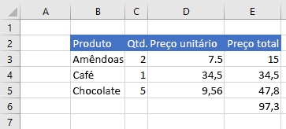

# <a name="work-with-ranges-using-the-excel-javascript-api"></a><span data-ttu-id="04d5b-102">Trabalhar com intervalos usando a API JavaScript do Excel</span><span class="sxs-lookup"><span data-stu-id="04d5b-102">Work with ranges using the Excel JavaScript API</span></span>

<span data-ttu-id="04d5b-103">Este artigo fornece exemplos de código que mostram como executar tarefas comuns com intervalos usando a API JavaScript do Excel.</span><span class="sxs-lookup"><span data-stu-id="04d5b-103">This article provides code samples that show how to perform common tasks with ranges using the Excel JavaScript API.</span></span> <span data-ttu-id="04d5b-104">Para obter a lista completa de propriedades e métodos que o objeto **Range** suporta, confira [Objeto Range (API JavaScript para Excel)](https://docs.microsoft.com/javascript/api/excel/excel.range).</span><span class="sxs-lookup"><span data-stu-id="04d5b-104">For the complete list of properties and methods that the **Range** object supports, see [Range Object (JavaScript API for Excel)](https://docs.microsoft.com/javascript/api/excel/excel.range).</span></span>

## <a name="get-a-range"></a><span data-ttu-id="04d5b-105">Obter um intervalo</span><span class="sxs-lookup"><span data-stu-id="04d5b-105">Get a range</span></span>

<span data-ttu-id="04d5b-106">Os exemplos a seguir mostram diferentes maneiras de obter uma referência a um intervalo em uma planilha.</span><span class="sxs-lookup"><span data-stu-id="04d5b-106">The following examples show different ways to get a reference to a range within a worksheet.</span></span>

### <a name="get-range-by-address"></a><span data-ttu-id="04d5b-107">Obter intervalo por endereço</span><span class="sxs-lookup"><span data-stu-id="04d5b-107">Get range by address</span></span>

<span data-ttu-id="04d5b-108">O exemplo de código a seguir obtém o intervalo com o endereço **B2:B5** da planilha chamada **Amostra**, carrega sua propriedade **address** e grava uma mensagem no console.</span><span class="sxs-lookup"><span data-stu-id="04d5b-108">The following code sample gets the range with address **B2:B5** from the worksheet named **Sample**, loads its **address** property, and writes a message to the console.</span></span>

```js
Excel.run(function (context) {
    var sheet = context.workbook.worksheets.getItem("Sample");
    var range = sheet.getRange("B2:C5");
    range.load("address");

    return context.sync()
        .then(function () {
            console.log(`The address of the range B2:C5 is "${range.address}"`);
        });
}).catch(errorHandlerFunction);
```

### <a name="get-range-by-name"></a><span data-ttu-id="04d5b-109">Obter intervalo por nome</span><span class="sxs-lookup"><span data-stu-id="04d5b-109">Get range by name</span></span>

<span data-ttu-id="04d5b-110">O exemplo de código a seguir obtém o intervalo chamado **MyRange** da planilha chamada **Amostra**, carrega sua propriedade **address** e grava uma mensagem no console.</span><span class="sxs-lookup"><span data-stu-id="04d5b-110">The following code sample gets the range named **MyRange** from the worksheet named **Sample**, loads its **address** property, and writes a message to the console.</span></span>

```js
Excel.run(function (context) {
    var sheet = context.workbook.worksheets.getItem("Sample");
    var range = sheet.getRange("MyRange");
    range.load("address");

    return context.sync()
        .then(function () {
            console.log(`The address of the range "MyRange" is "${range.address}"`);
        });
}).catch(errorHandlerFunction);
```

### <a name="get-used-range"></a><span data-ttu-id="04d5b-111">Obter intervalo usado</span><span class="sxs-lookup"><span data-stu-id="04d5b-111">Get used range</span></span>

<span data-ttu-id="04d5b-112">O exemplo de código a seguir obtém o intervalo usado da planilha chamada **Amostra**, carrega sua propriedade **address** e grava uma mensagem no console.</span><span class="sxs-lookup"><span data-stu-id="04d5b-112">The following code sample gets the used range from the worksheet named **Sample**, loads its **address** property, and writes a message to the console.</span></span> <span data-ttu-id="04d5b-113">O intervalo usado é o menor intervalo que abrange todas as células na planilha que têm um valor ou uma formatação atribuída a elas.</span><span class="sxs-lookup"><span data-stu-id="04d5b-113">The used range is the smallest range that encompasses any cells in the worksheet that have a value or formatting assigned to them.</span></span> <span data-ttu-id="04d5b-114">Se a planilha inteira estiver em branco, o método **getUsedRange()** retornará um intervalo que consiste apenas na célula superior esquerda da planilha.</span><span class="sxs-lookup"><span data-stu-id="04d5b-114">If the entire worksheet is blank, the **getUsedRange()** method returns a range that consists of only the top-left cell in the worksheet.</span></span>

```js
Excel.run(function (context) {
    var sheet = context.workbook.worksheets.getItem("Sample");
    var range = sheet.getUsedRange();
    range.load("address");

    return context.sync()
        .then(function () {
            console.log(`The address of the used range in the worksheet is "${range.address}"`);
        });
}).catch(errorHandlerFunction);
```

### <a name="get-entire-range"></a><span data-ttu-id="04d5b-115">Obter intervalo inteiro</span><span class="sxs-lookup"><span data-stu-id="04d5b-115">Get entire range</span></span>

<span data-ttu-id="04d5b-116">O exemplo de código a seguir obtém todo o intervalo da planilha chamada **Amostra**, carrega sua propriedade **address** e grava uma mensagem no console.</span><span class="sxs-lookup"><span data-stu-id="04d5b-116">The following code sample gets the entire worksheet range from the worksheet named **Sample**, loads its **address** property, and writes a message to the console.</span></span>

```js
Excel.run(function (context) {
    var sheet = context.workbook.worksheets.getItem("Sample");
    var range = sheet.getRange();
    range.load("address");

    return context.sync()
        .then(function () {
            console.log(`The address of the entire worksheet range is "${range.address}"`);
        });
}).catch(errorHandlerFunction);
```

## <a name="insert-a-range-of-cells"></a><span data-ttu-id="04d5b-117">Inserir um intervalo de células</span><span class="sxs-lookup"><span data-stu-id="04d5b-117">Insert a range of cells</span></span>

<span data-ttu-id="04d5b-118">O exemplo de código a seguir insere um intervalo de células no local **B4:E4** e desloca outras células para baixo a fim de fornecer espaço para as novas células.</span><span class="sxs-lookup"><span data-stu-id="04d5b-118">The following code sample inserts a range of cells in location **B4:E4** and shifts other cells down to provide space for the new cells.</span></span>

```js
Excel.run(function (context) {
    var sheet = context.workbook.worksheets.getItem("Sample");
    var range = sheet.getRange("B4:E4");

    range.insert(Excel.InsertShiftDirection.down);
    
    return context.sync();
}).catch(errorHandlerFunction);
```

<span data-ttu-id="04d5b-119">**Dados antes da inserção do intervalo**</span><span class="sxs-lookup"><span data-stu-id="04d5b-119">**Data before range is inserted**</span></span>


<span data-ttu-id="04d5b-121">**Dados após a inserção do intervalo**</span><span class="sxs-lookup"><span data-stu-id="04d5b-121">**Data after range is inserted**</span></span>


## <a name="clear-a-range-of-cells"></a><span data-ttu-id="04d5b-123">Limpar um intervalo de células</span><span class="sxs-lookup"><span data-stu-id="04d5b-123">Clear a range of cells</span></span>

<span data-ttu-id="04d5b-124">O exemplo de código a seguir limpa todo o conteúdo e a formatação das células no intervalo **E2:E5**.</span><span class="sxs-lookup"><span data-stu-id="04d5b-124">The following code sample clears all contents and formatting of cells in the range **E2:E5**.</span></span>  

```js
Excel.run(function (context) {
    var sheet = context.workbook.worksheets.getItem("Sample");
    var range = sheet.getRange("E2:E5");

    range.clear();

    return context.sync();
}).catch(errorHandlerFunction);
```

<span data-ttu-id="04d5b-125">**Dados antes da limpeza do intervalo**</span><span class="sxs-lookup"><span data-stu-id="04d5b-125">**Data before range is cleared**</span></span>


<span data-ttu-id="04d5b-127">**Dados após a limpeza do intervalo**</span><span class="sxs-lookup"><span data-stu-id="04d5b-127">**Data after range is cleared**</span></span>


## <a name="delete-a-range-of-cells"></a><span data-ttu-id="04d5b-129">Excluir um intervalo de células</span><span class="sxs-lookup"><span data-stu-id="04d5b-129">Delete a range of cells</span></span>

<span data-ttu-id="04d5b-130">O exemplo de código a seguir exclui as células no intervalo **B4:E4** e desloca outras células para cima a fim de preencher o espaço deixado pelas células excluídas.</span><span class="sxs-lookup"><span data-stu-id="04d5b-130">The following code sample deletes the cells in the range **B4:E4** and shift other cells up to fill the space that was vacated by the deleted cells.</span></span>

```js
Excel.run(function (context) {
    var sheet = context.workbook.worksheets.getItem("Sample");
    var range = sheet.getRange("B4:E4");

    range.delete(Excel.DeleteShiftDirection.up);

    return context.sync();
}).catch(errorHandlerFunction);
```

<span data-ttu-id="04d5b-131">**Dados antes da exclusão do intervalo**</span><span class="sxs-lookup"><span data-stu-id="04d5b-131">**Data before range is deleted**</span></span>


<span data-ttu-id="04d5b-133">**Dados após a exclusão do intervalo**</span><span class="sxs-lookup"><span data-stu-id="04d5b-133">**Data after range is deleted**</span></span>


## <a name="set-the-selected-range"></a><span data-ttu-id="04d5b-135">Definir o intervalo selecionado</span><span class="sxs-lookup"><span data-stu-id="04d5b-135">Set the selected range</span></span>

<span data-ttu-id="04d5b-136">O exemplo de código a seguir seleciona o intervalo **B2:E6** na planilha ativa.</span><span class="sxs-lookup"><span data-stu-id="04d5b-136">The following code sample selects the range **B2:E6** in the active worksheet.</span></span>

```js
Excel.run(function (context) {
    var sheet = context.workbook.worksheets.getActiveWorksheet();
    var range = sheet.getRange("B2:E6");

    range.select();

    return context.sync();
}).catch(errorHandlerFunction);
```

<span data-ttu-id="04d5b-137">**Intervalo selecionado B2:E6**</span><span class="sxs-lookup"><span data-stu-id="04d5b-137">**Selected range B2:E6**</span></span>


## <a name="get-the-selected-range"></a><span data-ttu-id="04d5b-139">Obter o intervalo selecionado</span><span class="sxs-lookup"><span data-stu-id="04d5b-139">Get the selected range</span></span>

<span data-ttu-id="04d5b-140">O exemplo de código a seguir obtém o intervalo selecionado, carrega sua propriedade **address** e grava uma mensagem no console.</span><span class="sxs-lookup"><span data-stu-id="04d5b-140">The following code sample gets the selected range, loads its **address** property, and writes a message to the console.</span></span> 

```js
Excel.run(function (context) {
    var range = context.workbook.getSelectedRange();
    range.load("address");

    return context.sync()
        .then(function () {
            console.log(`The address of the selected range is "${range.address}"`);
        });
}).catch(errorHandlerFunction);
```

## <a name="set-values-or-formulas"></a><span data-ttu-id="04d5b-141">Definir valores ou fórmulas</span><span class="sxs-lookup"><span data-stu-id="04d5b-141">Set values or formulas</span></span>

<span data-ttu-id="04d5b-142">Os exemplos a seguir mostram como definir valores e fórmulas para uma única célula ou um intervalo de células.</span><span class="sxs-lookup"><span data-stu-id="04d5b-142">The following examples show how to set values and formulas for a single cell or a range of cells.</span></span>

### <a name="set-value-for-a-single-cell"></a><span data-ttu-id="04d5b-143">Definir valor para uma única célula</span><span class="sxs-lookup"><span data-stu-id="04d5b-143">Set value for a single cell</span></span>

<span data-ttu-id="04d5b-144">O exemplo de código a seguir define o valor da célula **C3** como "5" e, em seguida, define a largura das colunas para melhor ajustar os dados.</span><span class="sxs-lookup"><span data-stu-id="04d5b-144">The following code sample sets the value of cell **C3** to "5" and then sets the width of the columns to best fit the data.</span></span>

```js
Excel.run(function (context) {
    var sheet = context.workbook.worksheets.getItem("Sample");

    var range = sheet.getRange("C3");
    range.values = [[ 5 ]];
    range.format.autofitColumns();

    return context.sync();
}).catch(errorHandlerFunction);
```

<span data-ttu-id="04d5b-145">**Dados antes da atualização do valor da célula**</span><span class="sxs-lookup"><span data-stu-id="04d5b-145">**Data before cell value is updated**</span></span>


<span data-ttu-id="04d5b-147">**Dados após a atualização do valor da célula**</span><span class="sxs-lookup"><span data-stu-id="04d5b-147">**Data after cell value is updated**</span></span>


### <a name="set-values-for-a-range-of-cells"></a><span data-ttu-id="04d5b-149">Definir valores para um intervalo de células</span><span class="sxs-lookup"><span data-stu-id="04d5b-149">Set values for a range of cells</span></span>

<span data-ttu-id="04d5b-150">O exemplo de código a seguir define valores das células no intervalo **B5:D5** e, em seguida, define a largura das colunas para melhor ajustar os dados.</span><span class="sxs-lookup"><span data-stu-id="04d5b-150">The following code sample sets values for the cells in the range **B5:D5** and then sets the width of the columns to best fit the data.</span></span>

```js
Excel.run(function (context) {
    var sheet = context.workbook.worksheets.getItem("Sample");

    var data = [
        ["Potato Chips", 10, 1.80],
    ];
    
    var range = sheet.getRange("B5:D5");
    range.values = data;
    range.format.autofitColumns();

    return context.sync();
}).catch(errorHandlerFunction);
```

<span data-ttu-id="04d5b-151">**Dados antes da atualização dos valores da célula**</span><span class="sxs-lookup"><span data-stu-id="04d5b-151">**Data before cell values are updated**</span></span>


<span data-ttu-id="04d5b-153">**Dados após a atualização dos valores da célula**</span><span class="sxs-lookup"><span data-stu-id="04d5b-153">**Data after cell values are updated**</span></span>


### <a name="set-formula-for-a-single-cell"></a><span data-ttu-id="04d5b-155">Definir fórmula para uma única célula</span><span class="sxs-lookup"><span data-stu-id="04d5b-155">Set formula for a single cell</span></span>

<span data-ttu-id="04d5b-156">O exemplo de código a seguir define uma fórmula para a célula **E3** e, em seguida, define a largura das colunas para melhor ajustar os dados.</span><span class="sxs-lookup"><span data-stu-id="04d5b-156">The following code sample sets a formula for cell **E3** and then sets the width of the columns to best fit the data.</span></span>

```js
Excel.run(function (context) {
    var sheet = context.workbook.worksheets.getItem("Sample");

    var range = sheet.getRange("E3");
    range.formulas = [[ "=C3 * D3" ]];
    range.format.autofitColumns();

    return context.sync();
}).catch(errorHandlerFunction);
```

<span data-ttu-id="04d5b-157">**Dados antes da definição da fórmula da célula**</span><span class="sxs-lookup"><span data-stu-id="04d5b-157">**Data before cell formula is set**</span></span>


<span data-ttu-id="04d5b-159">**Dados após a definição da fórmula da célula**</span><span class="sxs-lookup"><span data-stu-id="04d5b-159">**Data after cell formula is set**</span></span>


### <a name="set-formulas-for-a-range-of-cells"></a><span data-ttu-id="04d5b-161">Definir fórmulas para um intervalo de células</span><span class="sxs-lookup"><span data-stu-id="04d5b-161">Set formulas for a range of cells</span></span>

<span data-ttu-id="04d5b-162">O exemplo de código a seguir define fórmulas para células no intervalo **E2:E6** e, em seguida, define a largura das colunas para melhor ajustar os dados.</span><span class="sxs-lookup"><span data-stu-id="04d5b-162">The following code sample sets formulas for cells in the range **E2:E6** and then sets the width of the columns to best fit the data.</span></span>

```js
Excel.run(function (context) {
    var sheet = context.workbook.worksheets.getItem("Sample");

    var data = [
        ["=C3 * D3"],
        ["=C4 * D4"],
        ["=C5 * D5"],
        ["=SUM(E3:E5)"]
    ];
    
    var range = sheet.getRange("E3:E6");
    range.formulas = data;
    range.format.autofitColumns();

    return context.sync();
}).catch(errorHandlerFunction);
```

<span data-ttu-id="04d5b-163">**Dados antes da definição das fórmulas da célula**</span><span class="sxs-lookup"><span data-stu-id="04d5b-163">**Data before cell formulas are set**</span></span>


<span data-ttu-id="04d5b-165">**Dados após a definição das fórmulas da célula**</span><span class="sxs-lookup"><span data-stu-id="04d5b-165">**Data after cell formulas are set**</span></span>



## <a name="get-values-text-or-formulas"></a><span data-ttu-id="04d5b-167">Obter valores, texto ou fórmulas</span><span class="sxs-lookup"><span data-stu-id="04d5b-167">Get values, text, or formulas</span></span>

<span data-ttu-id="04d5b-168">Estes exemplos mostram como obter valores, texto e fórmulas de um intervalo de células.</span><span class="sxs-lookup"><span data-stu-id="04d5b-168">These examples show how to get values, text, and formulas from a range of cells.</span></span>

### <a name="get-values-from-a-range-of-cells"></a><span data-ttu-id="04d5b-169">Obter valores de um intervalo de células</span><span class="sxs-lookup"><span data-stu-id="04d5b-169">Get values from a range of cells</span></span>

<span data-ttu-id="04d5b-170">O exemplo de código a seguir obtém o intervalo **B2:E6**, carrega sua propriedade **values** e grava os valores no console.</span><span class="sxs-lookup"><span data-stu-id="04d5b-170">The following code sample gets the range **B2:E6**, loads its **values** property, and writes the values to the console.</span></span> <span data-ttu-id="04d5b-171">A propriedade **values** de um intervalo especifica os novos valores brutos que as células contêm.</span><span class="sxs-lookup"><span data-stu-id="04d5b-171">The **values** property of a range specifies the raw values that the cells contain.</span></span> <span data-ttu-id="04d5b-172">Mesmo que algumas células em um intervalo contenham fórmulas, a propriedade **values** do intervalo especifica os valores brutos para essas células, não alguma das fórmulas.</span><span class="sxs-lookup"><span data-stu-id="04d5b-172">Even if some cells in a range contain formulas, the **values** property of the range specifies the raw values for those cells, not any of the formulas.</span></span>

```js
Excel.run(function (context) {
    var sheet = context.workbook.worksheets.getItem("Sample");
    var range = sheet.getRange("B2:E6");
    range.load("values");

    return context.sync()
        .then(function () {
            console.log(JSON.stringify(range.values, null, 4));
        });
}).catch(errorHandlerFunction);
```

<span data-ttu-id="04d5b-173">**Dados no intervalo (valores na coluna E são um resultado de fórmulas)**</span><span class="sxs-lookup"><span data-stu-id="04d5b-173">**Data in range (values in column E are a result of formulas)**</span></span>


<span data-ttu-id="04d5b-175">**range.values (conforme registrado em log no console pelo exemplo de código acima)**</span><span class="sxs-lookup"><span data-stu-id="04d5b-175">**range.values (as logged to the console by the code sample above)**</span></span>

```json
[
    [
        "Product",
        "Qty",
        "Unit Price",
        "Total Price"
    ],
    [
        "Almonds",
        2,
        7.5,
        15
    ],
    [
        "Coffee",
        1,
        34.5,
        34.5
    ],
    [
        "Chocolate",
        5,
        9.56,
        47.8
    ],
    [
        "",
        "",
        "",
        97.3
    ]
]
```

### <a name="get-text-from-a-range-of-cells"></a><span data-ttu-id="04d5b-176">Obter texto de um intervalo de células</span><span class="sxs-lookup"><span data-stu-id="04d5b-176">Get text from a range of cells</span></span>

<span data-ttu-id="04d5b-177">O exemplo de código a seguir obtém o intervalo **B2:E6**, carrega sua propriedade **text** e o grava no console.</span><span class="sxs-lookup"><span data-stu-id="04d5b-177">The following code sample gets the range **B2:E6**, loads its **text** property, and writes it to the console.</span></span>  <span data-ttu-id="04d5b-178">A propriedade **text** de um intervalo especifica os valores de exibição para as células no intervalo.</span><span class="sxs-lookup"><span data-stu-id="04d5b-178">The **text** property of a range specifies the display values for cells in the range.</span></span> <span data-ttu-id="04d5b-179">Mesmo que algumas células em um intervalo contenham fórmulas, a propriedade **text** do intervalo especifica os valores de exibição para essas células, não alguma das fórmulas.</span><span class="sxs-lookup"><span data-stu-id="04d5b-179">Even if some cells in a range contain formulas, the **text** property of the range specifies the display values for those cells, not any of the formulas.</span></span>

```js
Excel.run(function (context) {
    var sheet = context.workbook.worksheets.getItem("Sample");
    var range = sheet.getRange("B2:E6");
    range.load("text");

    return context.sync()
        .then(function () {
            console.log(JSON.stringify(range.text, null, 4));
        });
}).catch(errorHandlerFunction);
```

<span data-ttu-id="04d5b-180">**Dados no intervalo (valores na coluna E são um resultado de fórmulas)**</span><span class="sxs-lookup"><span data-stu-id="04d5b-180">**Data in range (values in column E are a result of formulas)**</span></span>


<span data-ttu-id="04d5b-182">**range.text (conforme registrado em log no console pelo exemplo de código acima)**</span><span class="sxs-lookup"><span data-stu-id="04d5b-182">**range.text (as logged to the console by the code sample above)**</span></span>

```json
[
    [
        "Product",
        "Qty",
        "Unit Price",
        "Total Price"
    ],
    [
        "Almonds",
        "2",
        "7.5",
        "15"
    ],
    [
        "Coffee",
        "1",
        "34.5",
        "34.5"
    ],
    [
        "Chocolate",
        "5",
        "9.56",
        "47.8"
    ],
    [
        "",
        "",
        "",
        "97.3"
    ]
]
```

### <a name="get-formulas-from-a-range-of-cells"></a><span data-ttu-id="04d5b-183">Obter fórmulas de um intervalo de células</span><span class="sxs-lookup"><span data-stu-id="04d5b-183">Get formulas from a range of cells</span></span>

<span data-ttu-id="04d5b-184">O exemplo de código a seguir obtém o intervalo **B2:E6**, carrega sua propriedade **formulas** e o grava no console.</span><span class="sxs-lookup"><span data-stu-id="04d5b-184">The following code sample gets the range **B2:E6**, loads its **formulas** property, and writes it to the console.</span></span>  <span data-ttu-id="04d5b-185">A propriedade **formulas** de um intervalo especifica as fórmulas para células no intervalo que contêm fórmulas e os valores brutos para células no intervalo que não contêm fórmulas.</span><span class="sxs-lookup"><span data-stu-id="04d5b-185">The **formulas** property of a range specifies the formulas for cells in the range that contain formulas and the raw values for cells in the range that do not contain formulas.</span></span>

```js
Excel.run(function (context) {
    var sheet = context.workbook.worksheets.getItem("Sample");
    var range = sheet.getRange("B2:E6");
    range.load("formulas");

    return context.sync()
        .then(function () {
            console.log(JSON.stringify(range.formulas, null, 4));
        });
}).catch(errorHandlerFunction);
```

<span data-ttu-id="04d5b-186">**Dados no intervalo (valores na coluna E são um resultado de fórmulas)**</span><span class="sxs-lookup"><span data-stu-id="04d5b-186">**Data in range (values in column E are a result of formulas)**</span></span>


<span data-ttu-id="04d5b-188">**range.formulas (conforme registrado em log no console pelo exemplo de código acima)**</span><span class="sxs-lookup"><span data-stu-id="04d5b-188">**range.formulas (as logged to the console by the code sample above)**</span></span>

```json
[
    [
        "Product",
        "Qty",
        "Unit Price",
        "Total Price"
    ],
    [
        "Almonds",
        2,
        7.5,
        "=C3 * D3"
    ],
    [
        "Coffee",
        1,
        34.5,
        "=C4 * D4"
    ],
    [
        "Chocolate",
        5,
        9.56,
        "=C5 * D5"
    ],
    [
        "",
        "",
        "",
        "=SUM(E3:E5)"
    ]
]
```

## <a name="set-range-format"></a><span data-ttu-id="04d5b-189">Definir formato do intervalo</span><span class="sxs-lookup"><span data-stu-id="04d5b-189">Set range format</span></span>

<span data-ttu-id="04d5b-190">Os exemplos a seguir mostram como definir a cor da fonte, a cor de preenchimento e o formato de número para células em um intervalo.</span><span class="sxs-lookup"><span data-stu-id="04d5b-190">The following examples show how to set font color, fill color, and number format for cells in a range.</span></span>

### <a name="set-font-color-and-fill-color"></a><span data-ttu-id="04d5b-191">Definir cor da fonte e cor de preenchimento</span><span class="sxs-lookup"><span data-stu-id="04d5b-191">Set font color and fill color</span></span>

<span data-ttu-id="04d5b-192">O exemplo de código a seguir define a cor da fonte e a cor de preenchimento para células no intervalo **B2:E2**.</span><span class="sxs-lookup"><span data-stu-id="04d5b-192">The following code sample sets the font color and fill color for cells in range **B2:E2**.</span></span>

```js
Excel.run(function (context) {
    var sheet = context.workbook.worksheets.getItem("Sample");

    var range = sheet.getRange("B2:E2");
    range.format.fill.color = "#4472C4";;
    range.format.font.color = "white";

    return context.sync();
}).catch(errorHandlerFunction);
```

<span data-ttu-id="04d5b-193">**Dados no intervalo antes da definição da cor da fonte e da cor de preenchimento**</span><span class="sxs-lookup"><span data-stu-id="04d5b-193">**Data in range before font color and fill color are set**</span></span>


<span data-ttu-id="04d5b-195">**Dados no intervalo após a definição da cor da fonte e da cor de preenchimento**</span><span class="sxs-lookup"><span data-stu-id="04d5b-195">**Data in range after font color and fill color are set**</span></span>


### <a name="set-number-format"></a><span data-ttu-id="04d5b-197">Definir formato de número</span><span class="sxs-lookup"><span data-stu-id="04d5b-197">Set number format</span></span>

<span data-ttu-id="04d5b-198">O exemplo de código a seguir define o formato de número para as células no intervalo **D3:E5**.</span><span class="sxs-lookup"><span data-stu-id="04d5b-198">The following code sample sets the number format for the cells in range **D3:E5**.</span></span>

```js
Excel.run(function (context) {
    var sheet = context.workbook.worksheets.getItem("Sample");

    var formats = [
        ["0.00", "0.00"],
        ["0.00", "0.00"],
        ["0.00", "0.00"]
    ];

    var range = sheet.getRange("D3:E5");
    range.numberFormat = formats;

    return context.sync();
}).catch(errorHandlerFunction);
```

<span data-ttu-id="04d5b-199">**Dados no intervalo antes da definição do formato de número**</span><span class="sxs-lookup"><span data-stu-id="04d5b-199">**Data in range before number format is set**</span></span>


<span data-ttu-id="04d5b-201">**Dados no intervalo após a definição do formato de número**</span><span class="sxs-lookup"><span data-stu-id="04d5b-201">**Data in range after number format is set**</span></span>


### <a name="conditional-formatting-of-ranges"></a><span data-ttu-id="04d5b-203">Formatação condicional de intervalos</span><span class="sxs-lookup"><span data-stu-id="04d5b-203">Conditional formatting of ranges</span></span>

<span data-ttu-id="04d5b-204">Os intervalos podem ter formatos aplicados a células individuais baseadas em condições.</span><span class="sxs-lookup"><span data-stu-id="04d5b-204">Ranges can have formats applied to individual cells based on conditions.</span></span> <span data-ttu-id="04d5b-205">Para saber mais sobre isso, confira [Aplicar a formatação condicional a intervalos do Excel](excel-add-ins-conditional-formatting.md).</span><span class="sxs-lookup"><span data-stu-id="04d5b-205">For more information about this, see [Apply conditional formatting to Excel ranges](excel-add-ins-conditional-formatting.md).</span></span>

## <a name="work-with-dates-using-the-moment-msdate-plug-in"></a><span data-ttu-id="04d5b-206">Trabalhar com datas usando o plug-in Moment-MSDate</span><span class="sxs-lookup"><span data-stu-id="04d5b-206">Work with dates using the Moment-MSDate plug-in</span></span>

<span data-ttu-id="04d5b-207">A [biblioteca Moment do JavaScript](https://momentjs.com/) fornece uma maneira conveniente de usar datas e carimbos de data e hora.</span><span class="sxs-lookup"><span data-stu-id="04d5b-207">The [Moment JavaScript library](https://momentjs.com/) provides a convenient way to use dates and timestamps.</span></span> <span data-ttu-id="04d5b-208">O [plug-in Moment-MSDate](https://www.npmjs.com/package/moment-msdate) converte o formato de momentos em um formato mais apropriado para o Excel.</span><span class="sxs-lookup"><span data-stu-id="04d5b-208">The [Moment-MSDate plug-in](https://www.npmjs.com/package/moment-msdate) converts the format of moments into one preferable for Excel.</span></span> <span data-ttu-id="04d5b-209">Este é o mesmo formato que a [função NOW](https://support.office.com/article/now-function-3337fd29-145a-4347-b2e6-20c904739c46) retorna.</span><span class="sxs-lookup"><span data-stu-id="04d5b-209">This is the same format the [NOW function](https://support.office.com/article/now-function-3337fd29-145a-4347-b2e6-20c904739c46) returns.</span></span>

<span data-ttu-id="04d5b-210">O código a seguir mostra como definir o intervalo em \*\* B4 \*\* para o carimbo de data/hora de um momento:</span><span class="sxs-lookup"><span data-stu-id="04d5b-210">The following code shows how to set the range at **B4** to a moment's timestamp:</span></span>

```js
Excel.run(function (context) {
    var sheet = context.workbook.worksheets.getItem("Sample");
    
    var now = Date.now();
    var nowMoment = moment(now);
    var nowMS = nowMoment.toOADate();
    
    var dateRange = sheet.getRange("B4");
    dateRange.values = [[nowMS]];
    
    dateRange.numberFormat = [["[$-409]m/d/yy h:mm AM/PM;@"]];
    
    return context.sync();
}).catch(errorHandlerFunction);
```

<span data-ttu-id="04d5b-211">É uma técnica semelhante para retirar a data da célula e convertê-la em um momento ou outro formato, conforme demonstrado no código a seguir:</span><span class="sxs-lookup"><span data-stu-id="04d5b-211">It is a similar technique to get the date back out of the cell and convert it to a moment or other format, as demonstrated in the following code:</span></span>

```js
Excel.run(function (context) {
    var sheet = context.workbook.worksheets.getItem("Sample");

    var dateRange = sheet.getRange("B4");
    dateRange.load("values");
        
    return context.sync().then(function () {
        var nowMS = dateRange.values[0][0];

        // log the date as a moment
        var nowMoment = moment.fromOADate(nowMS);
        console.log(`get (moment): ${JSON.stringify(nowMoment)}`);

        // log the date as a UNIX-style timestamp 
        var now = nowMoment.unix();
        console.log(`get (timestamp): ${now}`);
    });
}).catch(errorHandlerFunction);
```

<span data-ttu-id="04d5b-212">Seu suplemento terá que formatar os intervalos para exibir as datas em um formato mais legível.</span><span class="sxs-lookup"><span data-stu-id="04d5b-212">Your add-in will have to format the ranges to display the dates in a more human-readable form.</span></span> <span data-ttu-id="04d5b-213">O exemplo de `"[$-409]m/d/yy h:mm AM/PM;@"` exibe a hora como "3/12/18 15:57".</span><span class="sxs-lookup"><span data-stu-id="04d5b-213">The example of `"[$-409]m/d/yy h:mm AM/PM;@"` displays a time like "12/3/18 3:57 PM".</span></span> <span data-ttu-id="04d5b-214">Para obter mais informações sobre formatos de números de data e hora, confira as "Diretrizes para formatos de data e hora" no artigo [Diretrizes de revisão para personalizar um formato de número](https://support.office.com/article/review-guidelines-for-customizing-a-number-format-c0a1d1fa-d3f4-4018-96b7-9c9354dd99f5).</span><span class="sxs-lookup"><span data-stu-id="04d5b-214">For more information about date and time number formats, please see the "Guidelines for date and time formats" in the [Review guidelines for customizing a number format](https://support.office.com/article/review-guidelines-for-customizing-a-number-format-c0a1d1fa-d3f4-4018-96b7-9c9354dd99f5) article.</span></span>

## <a name="copy-and-paste"></a><span data-ttu-id="04d5b-215">Copiar e colar</span><span class="sxs-lookup"><span data-stu-id="04d5b-215">Copy and Paste</span></span>

> [!NOTE]
> <span data-ttu-id="04d5b-216">A função copyFrom no momento só está disponível na versão prévia pública (beta).</span><span class="sxs-lookup"><span data-stu-id="04d5b-216">The copyFrom function is currently available only in public preview (beta).</span></span> <span data-ttu-id="04d5b-217">Para usar esse recurso, você deve usar a biblioteca beta do CDN do Office.js: https://appsforoffice.microsoft.com/lib/beta/hosted/office.js.</span><span class="sxs-lookup"><span data-stu-id="04d5b-217">To use this feature, you must use the beta library of the Office.js CDN: https://appsforoffice.microsoft.com/lib/beta/hosted/office.js.</span></span>
> <span data-ttu-id="04d5b-218">Se você estiver usando o TypeScript ou se seu editor de código usar arquivos de definição de tipo do TypeScript do IntelliSense, use https://appsforoffice.microsoft.com/lib/beta/hosted/office.d.ts.</span><span class="sxs-lookup"><span data-stu-id="04d5b-218">If you are using TypeScript or your code editor uses TypeScript type definition files for IntelliSense, use https://appsforoffice.microsoft.com/lib/beta/hosted/office.d.ts.</span></span>

<span data-ttu-id="04d5b-219">A função de copyFrom do intervalo replica o comportamento de copiar e colar da IU do Excel.</span><span class="sxs-lookup"><span data-stu-id="04d5b-219">Range’s copyFrom function replicates the copy-and-paste behavior of the Excel UI.</span></span> <span data-ttu-id="04d5b-220">O objeto de intervalo para o qual a função copyFrom é chamada é o destino.</span><span class="sxs-lookup"><span data-stu-id="04d5b-220">The range object that copyFrom is called on is the destination.</span></span> <span data-ttu-id="04d5b-221">A fonte a ser copiada é passada como um intervalo ou um endereço de cadeia de caracteres que representa um intervalo.</span><span class="sxs-lookup"><span data-stu-id="04d5b-221">The source to be copied is passed as a range or a string address representing a range.</span></span> <span data-ttu-id="04d5b-222">O exemplo a seguir copia dados de **A1:E1** para o intervalo que começa em **G1** (que acaba sendo colado em **G1:K1**).</span><span class="sxs-lookup"><span data-stu-id="04d5b-222">The following code sample copies the data from **A1:E1** into the range starting at **G1** (which ends up pasting into **G1:K1**).</span></span>

```js
Excel.run(function (context) {
    var sheet = context.workbook.worksheets.getItem("Sample");
    // copy a range starting at a single cell destination
    sheet.getRange("G1").copyFrom("A1:E1");
    return context.sync();
}).catch(errorHandlerFunction);
```

<span data-ttu-id="04d5b-223">Range.copyFrom tem três parâmetros opcionais.</span><span class="sxs-lookup"><span data-stu-id="04d5b-223">Range.copyFrom has three optional parameters.</span></span>

```ts
copyFrom(sourceRange: Range | string, copyType?: "All" | "Formulas" | "Values" | "Formats", skipBlanks?: boolean, transpose?: boolean): void;
``` 

<span data-ttu-id="04d5b-224">`copyType` especifica quais dados são copiados da origem para o destino.</span><span class="sxs-lookup"><span data-stu-id="04d5b-224">`copyType` specifies what data gets copied from the source to the destination.</span></span> 
<span data-ttu-id="04d5b-225">`“Formulas”` transfere as fórmulas nas células de origem e preserva o posicionamento relativo dos intervalos dessas fórmulas.</span><span class="sxs-lookup"><span data-stu-id="04d5b-225">`“Formulas”` transfers the formulas in the source cells and preserves the relative positioning of those formulas’ ranges.</span></span> <span data-ttu-id="04d5b-226">As entradas que não sejam uma fórmula são copiadas no seu estado original.</span><span class="sxs-lookup"><span data-stu-id="04d5b-226">Any non-formula entries are copied as-is.</span></span> 
<span data-ttu-id="04d5b-227">`“Values”` copia os valores dos dados e, no caso de fórmulas, o resultado da fórmula.</span><span class="sxs-lookup"><span data-stu-id="04d5b-227">`“Values”` copies the data values and, in the case of formulas, the result of the formula.</span></span> 
<span data-ttu-id="04d5b-228">`“Formats”` copia a formatação do intervalo incluindo a fonte, cor e outras configurações de formato, mas nenhum valor.</span><span class="sxs-lookup"><span data-stu-id="04d5b-228">`“Formats”` copies the formatting of the range, including font, color, and other format settings, but no values.</span></span> 
<span data-ttu-id="04d5b-229">`”All”` (a opção padrão) copia ambos os dados e formatação, preservando as fórmulas das células, caso elas sejam encontradas.</span><span class="sxs-lookup"><span data-stu-id="04d5b-229">`”All”` (the default option) copies both data and formatting, preserving cells’ formulas if found.</span></span>

<span data-ttu-id="04d5b-230">`skipBlanks` define se as células em branco são copiadas para o destino.</span><span class="sxs-lookup"><span data-stu-id="04d5b-230">`skipBlanks` sets whether blank cells are copied into the destination.</span></span> <span data-ttu-id="04d5b-231">Quando for verdadeiro, `copyFrom` ignora células em branco no intervalo de origem.</span><span class="sxs-lookup"><span data-stu-id="04d5b-231">When true, `copyFrom` skips blank cells in the source range.</span></span> <span data-ttu-id="04d5b-232">As células ignoradas não substituem os dados existentes de suas células correspondentes no intervalo de destino.</span><span class="sxs-lookup"><span data-stu-id="04d5b-232">Skipped cells will not overwrite the existing data of their corresponding cells in the destination range.</span></span> <span data-ttu-id="04d5b-233">O padrão é false.</span><span class="sxs-lookup"><span data-stu-id="04d5b-233">The default is false.</span></span>

<span data-ttu-id="04d5b-234">O exemplo de código e as imagens a seguir demonstram esse comportamento em um cenário simples.</span><span class="sxs-lookup"><span data-stu-id="04d5b-234">The following code sample and images demonstrate this behavior in a simple scenario.</span></span> 

```js
Excel.run(function (context) {
    var sheet = context.workbook.worksheets.getItem("Sample");
    // copy a range, omitting the blank cells so existing data is not overwritten in those cells
    sheet.getRange("D1").copyFrom("A1:C1",
        Excel.RangeCopyType.all,
        true, // skipBlanks
        false); // transpose
    // copy a range, including the blank cells which will overwrite existing data in the target cells
    sheet.getRange("D2").copyFrom("A2:C2",
        Excel.RangeCopyType.all,
        false, // skipBlanks
        false); // transpose
    return context.sync();
}).catch(errorHandlerFunction);
```

<span data-ttu-id="04d5b-235">*Antes da função precedente ter sido executada.*</span><span class="sxs-lookup"><span data-stu-id="04d5b-235">*Before the preceeding function has been run.*</span></span>


<span data-ttu-id="04d5b-237">*Após a função precedente ter sido executada.*</span><span class="sxs-lookup"><span data-stu-id="04d5b-237">*After the preceeding function has been run.*</span></span>


<span data-ttu-id="04d5b-239">`transpose` determina se os dados são transpostos, ou seja, suas linhas e colunas são alternadas para o local de origem.</span><span class="sxs-lookup"><span data-stu-id="04d5b-239">`transpose` determines whether or not the data is transposed, meaning its rows and columns are switched, into the source location.</span></span> <span data-ttu-id="04d5b-240">Um intervalo transposto invertido na diagonal principal, portanto as linhas **1**, **2** e **3** se tornarão as colunas **A**, **B** e **C**.</span><span class="sxs-lookup"><span data-stu-id="04d5b-240">A transposed range is flipped along the main diagonal, so rows **1**, **2**, and **3** will become columns **A**, **B**, and **C**.</span></span> 


## <a name="see-also"></a><span data-ttu-id="04d5b-241">Confira também</span><span class="sxs-lookup"><span data-stu-id="04d5b-241">See also</span></span>

- [<span data-ttu-id="04d5b-242">Conceitos fundamentais de programação com a API JavaScript do Excel</span><span class="sxs-lookup"><span data-stu-id="04d5b-242">Fundamental programming concepts with the Excel JavaScript API</span></span>](excel-add-ins-core-concepts.md)

