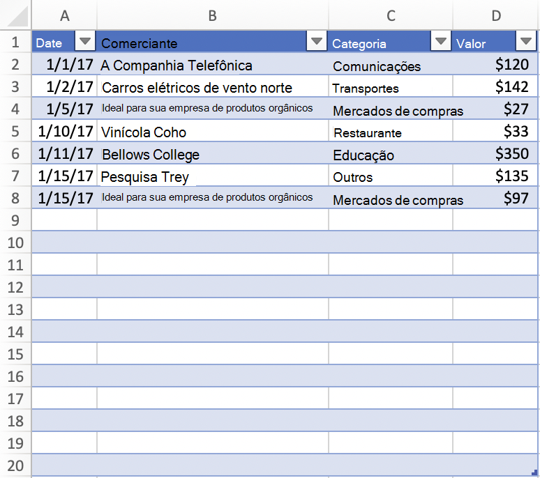
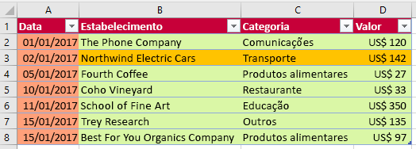

# <a name="work-with-tables-using-the-excel-javascript-api"></a>Trabalhar com tabelas usando a API JavaScript do Excel

Este artigo fornece exemplos de código que mostram como executar tarefas comuns com tabelas usando a API JavaScript do Excel. Para ver a lista completa de propriedades e métodos que os objetos e suportam, consulte [Objeto Table (API JavaScript para Excel)](/javascript/api/excel/excel.table) e [Objeto TableCollection (API JavaScript para Excel)](/javascript/api/excel/excel.tablecollection).`Table` `TableCollection`

## <a name="create-a-table"></a>Criar uma tabela

O exemplo de código a seguir cria uma tabela na planilha chamada **Exemplo**. A tabela tem cabeçalhos e contém quatro colunas e sete linhas de dados. Se o aplicativo Excel em que o código está sendo executado oferece suporte [](../reference/requirement-sets/excel-api-requirement-sets.md) ao conjunto de requisitos **ExcelApi 1.2**, a largura das colunas e a altura das linhas serão definidas para melhor se ajustar aos dados atuais na tabela.

> [!NOTE]
> Para especificar um nome para uma tabela, você deve primeiro criar a tabela e, em seguida, definir `name` sua propriedade, conforme mostrado no exemplo a seguir.

```js
await Excel.run(async (context) => {
    let sheet = context.workbook.worksheets.getItem("Sample");
    let expensesTable = sheet.tables.add("A1:D1", true /*hasHeaders*/);
    expensesTable.name = "ExpensesTable";

    expensesTable.getHeaderRowRange().values = [["Date", "Merchant", "Category", "Amount"]];

    expensesTable.rows.add(null /*add rows to the end of the table*/, [
        ["1/1/2017", "The Phone Company", "Communications", "$120"],
        ["1/2/2017", "Northwind Electric Cars", "Transportation", "$142"],
        ["1/5/2017", "Best For You Organics Company", "Groceries", "$27"],
        ["1/10/2017", "Coho Vineyard", "Restaurant", "$33"],
        ["1/11/2017", "Bellows College", "Education", "$350"],
        ["1/15/2017", "Trey Research", "Other", "$135"],
        ["1/15/2017", "Best For You Organics Company", "Groceries", "$97"]
    ]);

    if (Office.context.requirements.isSetSupported("ExcelApi", "1.2")) {
        sheet.getUsedRange().format.autofitColumns();
        sheet.getUsedRange().format.autofitRows();
    }

    sheet.activate();

    await context.sync();
});
```

### <a name="new-table"></a>Nova tabela


## <a name="add-rows-to-a-table"></a>Adicionar linhas a uma tabela

O exemplo de código a seguir adiciona sete novas linhas à tabela **ExpensesTable** na planilha **Exemplo**. As novas linhas são adicionadas ao fim da tabela. Se o aplicativo Excel em que o código está sendo executado oferece suporte [](../reference/requirement-sets/excel-api-requirement-sets.md) ao conjunto de requisitos **ExcelApi 1.2**, a largura das colunas e a altura das linhas serão definidas para melhor se ajustar aos dados atuais na tabela.

> [!NOTE]
> A `index` propriedade de [um objeto TableRow](/javascript/api/excel/excel.tablerow) indica o número de índice da linha na coleção rows da tabela. Um `TableRow` objeto não contém uma propriedade `id` que pode ser usada como uma chave exclusiva para identificar a linha.

```js
await Excel.run(async (context) => {
    let sheet = context.workbook.worksheets.getItem("Sample");
    let expensesTable = sheet.tables.getItem("ExpensesTable");

    expensesTable.rows.add(null /*add rows to the end of the table*/, [
        ["1/16/2017", "THE PHONE COMPANY", "Communications", "$120"],
        ["1/20/2017", "NORTHWIND ELECTRIC CARS", "Transportation", "$142"],
        ["1/20/2017", "BEST FOR YOU ORGANICS COMPANY", "Groceries", "$27"],
        ["1/21/2017", "COHO VINEYARD", "Restaurant", "$33"],
        ["1/25/2017", "BELLOWS COLLEGE", "Education", "$350"],
        ["1/28/2017", "TREY RESEARCH", "Other", "$135"],
        ["1/31/2017", "BEST FOR YOU ORGANICS COMPANY", "Groceries", "$97"]
    ]);

    if (Office.context.requirements.isSetSupported("ExcelApi", "1.2")) {
        sheet.getUsedRange().format.autofitColumns();
        sheet.getUsedRange().format.autofitRows();
    }

    await context.sync();
});
```

### <a name="table-with-new-rows"></a>Tabela com novas linhas


## <a name="add-a-column-to-a-table"></a>Adicionar uma coluna a uma tabela

Estes exemplos mostram como adicionar uma coluna a uma tabela. O primeiro exemplo preenche a nova coluna com valores estáticos. O segundo exemplo popula a nova coluna com fórmulas.

> [!NOTE]
> A propriedade **index** de um objeto [TableColumn](/javascript/api/excel/excel.tablecolumn) indica o número de índice da coluna no conjunto de colunas da tabela. A propriedade **id** de um objeto **TableColumn** contém uma chave exclusiva que identifica a coluna.

### <a name="add-a-column-that-contains-static-values"></a>Adicionar uma coluna que contém valores estáticos

O exemplo de código a seguir adiciona uma nova coluna à tabela **ExpensesTable** na planilha **Exemplo**. A nova coluna é adicionada após todas as colunas existentes na tabela e contém um cabeçalho ("Dia da Semana"), bem como dados para popular as células na coluna. Se o aplicativo Excel em que o código está sendo executado oferece suporte [](../reference/requirement-sets/excel-api-requirement-sets.md) ao conjunto de requisitos **ExcelApi 1.2**, a largura das colunas e a altura das linhas serão definidas para melhor se ajustar aos dados atuais na tabela.

```js
await Excel.run(async (context) => {
    let sheet = context.workbook.worksheets.getItem("Sample");
    let expensesTable = sheet.tables.getItem("ExpensesTable");

    expensesTable.columns.add(null /*add columns to the end of the table*/, [
        ["Day of the Week"],
        ["Saturday"],
        ["Friday"],
        ["Monday"],
        ["Thursday"],
        ["Sunday"],
        ["Saturday"],
        ["Monday"]
    ]);

    if (Office.context.requirements.isSetSupported("ExcelApi", "1.2")) {
        sheet.getUsedRange().format.autofitColumns();
        sheet.getUsedRange().format.autofitRows();
    }

    await context.sync();
});
```

#### <a name="table-with-new-column"></a>Tabela com nova coluna


### <a name="add-a-column-that-contains-formulas"></a>Adicionar uma coluna que contém fórmulas

O exemplo de código a seguir adiciona uma nova coluna à tabela **ExpensesTable** na planilha **Exemplo**. A nova coluna é adicionada ao fim da tabela, contém um cabeçalho ("Tipo do Dia") e usa uma fórmula para popular cada célula na coluna de dados. Se o aplicativo Excel em que o código está sendo executado oferece suporte [](../reference/requirement-sets/excel-api-requirement-sets.md) ao conjunto de requisitos **ExcelApi 1.2**, a largura das colunas e a altura das linhas serão definidas para melhor se ajustar aos dados atuais na tabela.

```js
await Excel.run(async (context) => {
    let sheet = context.workbook.worksheets.getItem("Sample");
    let expensesTable = sheet.tables.getItem("ExpensesTable");

    expensesTable.columns.add(null /*add columns to the end of the table*/, [
        ["Type of the Day"],
        ['=IF(OR((TEXT([DATE], "dddd") = "Saturday"), (TEXT([DATE], "dddd") = "Sunday")), "Weekend", "Weekday")'],
        ['=IF(OR((TEXT([DATE], "dddd") = "Saturday"), (TEXT([DATE], "dddd") = "Sunday")), "Weekend", "Weekday")'],
        ['=IF(OR((TEXT([DATE], "dddd") = "Saturday"), (TEXT([DATE], "dddd") = "Sunday")), "Weekend", "Weekday")'],
        ['=IF(OR((TEXT([DATE], "dddd") = "Saturday"), (TEXT([DATE], "dddd") = "Sunday")), "Weekend", "Weekday")'],
        ['=IF(OR((TEXT([DATE], "dddd") = "Saturday"), (TEXT([DATE], "dddd") = "Sunday")), "Weekend", "Weekday")'],
        ['=IF(OR((TEXT([DATE], "dddd") = "Saturday"), (TEXT([DATE], "dddd") = "Sunday")), "Weekend", "Weekday")'],
        ['=IF(OR((TEXT([DATE], "dddd") = "Saturday"), (TEXT([DATE], "dddd") = "Sunday")), "Weekend", "Weekday")']
    ]);

    if (Office.context.requirements.isSetSupported("ExcelApi", "1.2")) {
        sheet.getUsedRange().format.autofitColumns();
        sheet.getUsedRange().format.autofitRows();
    }

    await context.sync();
});
```

#### <a name="table-with-new-calculated-column"></a>Tabela com nova coluna calculada


## <a name="resize-a-table"></a>Resize uma tabela

Seu complemento pode ressarmar uma tabela sem adicionar dados à tabela ou alterar valores de célula. Para ressizer uma tabela, use o [método Table.resize](/javascript/api/excel/excel.table#excel-excel-table-resize-member(1)) . O exemplo de código a seguir mostra como reorganizar uma tabela. Este exemplo de código usa **a Tabela de** Despesas [da seção Criar](#create-a-table) uma tabela anteriormente neste artigo e define o novo intervalo da tabela como **A1:D20**.

```js
await Excel.run(async (context) => {
    // Retrieve the worksheet and a table on that worksheet.
    let sheet = context.workbook.worksheets.getItem("Sample");
    let expensesTable = sheet.tables.getItem("ExpensesTable");

    // Resize the table.
    expensesTable.resize("A1:D20");

    await context.sync();
});
```

> [!IMPORTANT]
> O novo intervalo da tabela deve se sobrepor ao intervalo original, e os headers (ou a parte superior da tabela) devem estar na mesma linha.

### <a name="table-after-resize"></a>Tabela após resize



## <a name="update-column-name"></a>Atualizar o nome da coluna

O exemplo de código a seguir atualiza o nome da primeira coluna da tabela para **Data da compra**. Se o aplicativo Excel em que o código está sendo executado oferece suporte [](../reference/requirement-sets/excel-api-requirement-sets.md) ao conjunto de requisitos **ExcelApi 1.2**, a largura das colunas e a altura das linhas serão definidas para melhor se ajustar aos dados atuais na tabela.

```js
await Excel.run(async (context) => {
    let sheet = context.workbook.worksheets.getItem("Sample");

    let expensesTable = sheet.tables.getItem("ExpensesTable");
    expensesTable.columns.load("items");

    await context.sync();
        
    expensesTable.columns.items[0].name = "Purchase date";

    if (Office.context.requirements.isSetSupported("ExcelApi", "1.2")) {
        sheet.getUsedRange().format.autofitColumns();
        sheet.getUsedRange().format.autofitRows();
    }

    await context.sync();
});
```

### <a name="table-with-new-column-name"></a>Tabela com novo nome de coluna


## <a name="get-data-from-a-table"></a>Obter dados de uma tabela

O exemplo de código a seguir lê dados de uma tabela chamada **ExpensesTable** na planilha **Exemplo** e inclui esses dados abaixo da tabela na mesma planilha.

```js
await Excel.run(async (context) => {
    let sheet = context.workbook.worksheets.getItem("Sample");
    let expensesTable = sheet.tables.getItem("ExpensesTable");

    // Get data from the header row.
    let headerRange = expensesTable.getHeaderRowRange().load("values");

    // Get data from the table.
    let bodyRange = expensesTable.getDataBodyRange().load("values");

    // Get data from a single column.
    let columnRange = expensesTable.columns.getItem("Merchant").getDataBodyRange().load("values");

    // Get data from a single row.
    let rowRange = expensesTable.rows.getItemAt(1).load("values");

    // Sync to populate proxy objects with data from Excel.
    await context.sync();

    let headerValues = headerRange.values;
    let bodyValues = bodyRange.values;
    let merchantColumnValues = columnRange.values;
    let secondRowValues = rowRange.values;

    // Write data from table back to the sheet
    sheet.getRange("A11:A11").values = [["Results"]];
    sheet.getRange("A13:D13").values = headerValues;
    sheet.getRange("A14:D20").values = bodyValues;
    sheet.getRange("B23:B29").values = merchantColumnValues;
    sheet.getRange("A32:D32").values = secondRowValues;

    // Sync to update the sheet in Excel.
    await context.sync();
});
```

### <a name="table-and-data-output"></a>Tabela e saída de dados


## <a name="detect-data-changes"></a>Detectar as alterações dos dados

O suplemento precisará reagir aos usuários alterando os dados em uma tabela. Para detectar essas alterações, basta [Registrar um manipulador de eventos.](excel-add-ins-events.md#register-an-event-handler) para o `onChanged` evento da tabela. Manipuladores de eventos para o `onChanged` evento recebem um objeto [TableChangedEventArgs](/javascript/api/excel/excel.tablechangedeventargs) quando o evento é acionado.

O `TableChangedEventArgs` objeto fornece informações sobre as alterações e a fonte. Como `onChanged` o acionamento ocorre quando o formato ou o valor dos dados mudam, pode ser útil checar com o suplemento se os valores realmente foram alterados. A `details` propriedade encapsula estas informações como um [ChangedEventDetail](/javascript/api/excel/excel.changedeventdetail). O exemplo a seguir mostra como exibir o antes e depois dos valores e tipos de uma célula que foi alterada.

```js
// This function would be used as an event handler for the Table.onChanged event.
async function onTableChanged(eventArgs) {
    await Excel.run(async (context) => {
        let details = eventArgs.details;
        let address = eventArgs.address;

        // Print the before and after types and values to the console.
        console.log(`Change at ${address}: was ${details.valueBefore}(${details.valueTypeBefore}),`
            + ` now is ${details.valueAfter}(${details.valueTypeAfter})`);
        await context.sync();
    });
}
```

## <a name="sort-data-in-a-table"></a>Classificar dados em uma tabela

O exemplo de código a seguir classifica os dados da tabela em ordem decrescente de acordo com os valores na quarta coluna da tabela.

```js
await Excel.run(async (context) => {
    let sheet = context.workbook.worksheets.getItem("Sample");
    let expensesTable = sheet.tables.getItem("ExpensesTable");

    // Queue a command to sort data by the fourth column of the table (descending).
    let sortRange = expensesTable.getDataBodyRange();
    sortRange.sort.apply([
        {
            key: 3,
            ascending: false,
        },
    ]);

    // Sync to run the queued command in Excel.
    await context.sync();
});
```

### <a name="table-data-sorted-by-amount-descending"></a>Dados de tabela classificados por Valor (decrescente)


Quando os dados são classificados em uma planilha, uma notificação de evento é acionada. Para saber mais sobre os eventos relacionados à classificação e como seu suplemento pode registrar manipuladores de eventos para responder a esses eventos, consulte [Manipular eventos de classificação](excel-add-ins-worksheets.md#handle-sorting-events).

## <a name="apply-filters-to-a-table"></a>Aplicar filtros a uma tabela

O exemplo de código a seguir aplica filtros à coluna **Valor** e à coluna **Categoria** em uma tabela. Como resultado dos filtros, são mostradas apenas linhas em que **Categoria** é um dos valores especificados e **Valor** está abaixo do valor médio para todas as linhas.

```js
await Excel.run(async (context) => {
    let sheet = context.workbook.worksheets.getItem("Sample");
    let expensesTable = sheet.tables.getItem("ExpensesTable");

    // Queue a command to apply a filter on the Category column.
    let categoryFilter = expensesTable.columns.getItem("Category").filter;
    categoryFilter.apply({
      filterOn: Excel.FilterOn.values,
      values: ["Restaurant", "Groceries"]
    });

    // Queue a command to apply a filter on the Amount column.
    let amountFilter = expensesTable.columns.getItem("Amount").filter;
    amountFilter.apply({
      filterOn: Excel.FilterOn.dynamic,
      dynamicCriteria: Excel.DynamicFilterCriteria.belowAverage
    });

    // Sync to run the queued commands in Excel.
    await context.sync();
});
```

### <a name="table-data-with-filters-applied-for-category-and-amount"></a>Dados de tabela com filtros aplicados por Categoria e Valor


## <a name="clear-table-filters"></a>Limpar filtros de tabela

O exemplo de código a seguir limpa todos os filtros aplicados atualmente à tabela.

```js
await Excel.run(async (context) => {
    let sheet = context.workbook.worksheets.getItem("Sample");
    let expensesTable = sheet.tables.getItem("ExpensesTable");

    expensesTable.clearFilters();

    await context.sync();
});
```

### <a name="table-data-with-no-filters-applied"></a>Dados de tabela sem filtros aplicados


## <a name="get-the-visible-range-from-a-filtered-table"></a>Obter o intervalo visível de uma tabela filtrada

O exemplo de código a seguir obtém um intervalo que contém dados somente para células que estão visíveis atualmente na tabela especificada e grava os valores do intervalo no console. Você pode usar o método `getVisibleView()` conforme mostrado abaixo para obter o conteúdo visível de uma tabela sempre que os filtros de coluna foram aplicados.

```js
await Excel.run(async (context) => {
    let sheet = context.workbook.worksheets.getItem("Sample");
    let expensesTable = sheet.tables.getItem("ExpensesTable");

    let visibleRange = expensesTable.getDataBodyRange().getVisibleView();
    visibleRange.load("values");

    await context.sync();
    console.log(visibleRange.values);
});
```

## <a name="autofilter"></a>Filtro Automático

Um suplemento pode usar o objeto [AutoFilter](/javascript/api/excel/excel.autofilter) da tabela para filtrar dados. Um `AutoFilter` objeto é toda a estrutura de filtro de uma tabela ou intervalo. Todas as operações de filtros abordadas anteriormente neste artigo são compatíveis com o filtro automático. O ponto de acesso único facilita o acesso e o gerenciamento de múltiplos filtros.

O exemplo de código a seguir mostra a mesma [filtragem de dados como o exemplo de código anterior](#apply-filters-to-a-table), mas concluído totalmente pelo filtro automático.

```js
await Excel.run(async (context) => {
    let sheet = context.workbook.worksheets.getItem("Sample");
    let expensesTable = sheet.tables.getItem("ExpensesTable");

    expensesTable.autoFilter.apply(expensesTable.getRange(), 2, {
        filterOn: Excel.FilterOn.values,
        values: ["Restaurant", "Groceries"]
    });
    expensesTable.autoFilter.apply(expensesTable.getRange(), 3, {
        filterOn: Excel.FilterOn.dynamic,
        dynamicCriteria: Excel.DynamicFilterCriteria.belowAverage
    });

    await context.sync();
});
```

Um `AutoFilter` também pode ser aplicado a um intervalo no nível da planilha. Consulte [Trabalhar com tabelas usando o API JavaScript do Excel](excel-add-ins-worksheets.md#filter-data) para mais informações.

## <a name="format-a-table"></a>Formatar uma tabela

O código de exemplo a seguir aplica formatação a uma tabela. Ele especifica cores de preenchimento diferentes para a linha de cabeçalho, o corpo, a segunda linha e a primeira coluna da tabela. Para obter informações sobre as propriedades que você pode usar para especificar o formato, confira [Objeto RangeFormat (API do JavaScript para Excel)](/javascript/api/excel/excel.rangeformat).

```js
await Excel.run(async (context) => {
    let sheet = context.workbook.worksheets.getItem("Sample");
    let expensesTable = sheet.tables.getItem("ExpensesTable");

    expensesTable.getHeaderRowRange().format.fill.color = "#C70039";
    expensesTable.getDataBodyRange().format.fill.color = "#DAF7A6";
    expensesTable.rows.getItemAt(1).getRange().format.fill.color = "#FFC300";
    expensesTable.columns.getItemAt(0).getDataBodyRange().format.fill.color = "#FFA07A";

    await context.sync();
});
```

### <a name="table-after-formatting-is-applied"></a>Tabela depois que a formatação é aplicada



## <a name="convert-a-range-to-a-table"></a>Converter um intervalo em uma tabela

O exemplo de código a seguir cria um intervalo de dados e o converte em uma tabela.

```js
await Excel.run(async (context) => {
    let sheet = context.workbook.worksheets.getItem("Sample");

    // Define values for the range.
    let values = [["Product", "Qtr1", "Qtr2", "Qtr3", "Qtr4"],
    ["Frames", 5000, 7000, 6544, 4377],
    ["Saddles", 400, 323, 276, 651],
    ["Brake levers", 12000, 8766, 8456, 9812],
    ["Chains", 1550, 1088, 692, 853],
    ["Mirrors", 225, 600, 923, 544],
    ["Spokes", 6005, 7634, 4589, 8765]];

    // Create the range.
    let range = sheet.getRange("A1:E7");
    range.values = values;

    if (Office.context.requirements.isSetSupported("ExcelApi", "1.2")) {
        sheet.getUsedRange().format.autofitColumns();
        sheet.getUsedRange().format.autofitRows();
    }

    sheet.activate();

    // Convert the range to a table.
    let expensesTable = sheet.tables.add('A1:E7', true);
    expensesTable.name = "ExpensesTable";

    await context.sync();
});
```

### <a name="data-in-the-range-before-the-range-is-converted-to-a-table"></a>Dados no intervalo (antes que o intervalo seja convertido em uma tabela)


### <a name="data-in-the-table-after-the-range-is-converted-to-a-table"></a>Dados da tabela (depois que o intervalo é convertido em uma tabela)


## <a name="import-json-data-into-a-table"></a>Importar dados JSON em uma tabela

O exemplo de código a seguir cria uma tabela na planilha **Exemplo** e popula a tabela usando um objeto JSON que define duas linhas de dados. Se o aplicativo Excel em que o código está sendo executado oferece suporte [](../reference/requirement-sets/excel-api-requirement-sets.md) ao conjunto de requisitos **ExcelApi 1.2**, a largura das colunas e a altura das linhas serão definidas para melhor se ajustar aos dados atuais na tabela.

```js
await Excel.run(async (context) => {
    let sheet = context.workbook.worksheets.getItem("Sample");

    let expensesTable = sheet.tables.add("A1:D1", true /*hasHeaders*/);
    expensesTable.name = "ExpensesTable";
    expensesTable.getHeaderRowRange().values = [["Date", "Merchant", "Category", "Amount"]];

    let transactions = [
      {
        "DATE": "1/1/2017",
        "MERCHANT": "The Phone Company",
        "CATEGORY": "Communications",
        "AMOUNT": "$120"
      },
      {
        "DATE": "1/1/2017",
        "MERCHANT": "Southridge Video",
        "CATEGORY": "Entertainment",
        "AMOUNT": "$40"
      }
    ];

    let newData = transactions.map(item =>
        [item.DATE, item.MERCHANT, item.CATEGORY, item.AMOUNT]);

    expensesTable.rows.add(null, newData);

    if (Office.context.requirements.isSetSupported("ExcelApi", "1.2")) {
        sheet.getUsedRange().format.autofitColumns();
        sheet.getUsedRange().format.autofitRows();
    }

    sheet.activate();

    await context.sync();
});
```

### <a name="new-table"></a>Nova tabela


## <a name="see-also"></a>Confira também

- [Modelo de objeto JavaScript do Excel em Suplementos do Office](excel-add-ins-core-concepts.md)
