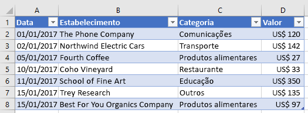

# <a name="work-with-tables-using-the-excel-javascript-api"></a><span data-ttu-id="37959-102">Trabalhar com tabelas usando a API JavaScript do Excel</span><span class="sxs-lookup"><span data-stu-id="37959-102">Work with tables using the Excel JavaScript API</span></span>

<span data-ttu-id="37959-103">Este artigo fornece exemplos de código que mostram como executar tarefas comuns com tabelas usando a API JavaScript do Excel.</span><span class="sxs-lookup"><span data-stu-id="37959-103">This article provides code samples that show how to perform common tasks with tables using the Excel JavaScript API.</span></span> <span data-ttu-id="37959-104">Para obter a lista completa de propriedades e métodos aos quais os objetos **Table** e **TableCollection** dão suporte, confira [Objeto Table (API do JavaScript para Excel)](https://docs.microsoft.com/javascript/api/excel/excel.table?view=office-js) e [Objeto TableCollection (API do JavaScript para Excel)](https://docs.microsoft.com/javascript/api/excel/excel.tablecollection?view=office-js).</span><span class="sxs-lookup"><span data-stu-id="37959-104">For the complete list of properties and methods that the **Table** and **TableCollection** objects support, see [Table Object (JavaScript API for Excel)](https://docs.microsoft.com/javascript/api/excel/excel.table?view=office-js) and [TableCollection Object (JavaScript API for Excel)](https://docs.microsoft.com/javascript/api/excel/excel.tablecollection?view=office-js).</span></span>

## <a name="create-a-table"></a><span data-ttu-id="37959-105">Criar uma tabela</span><span class="sxs-lookup"><span data-stu-id="37959-105">Create a table</span></span>

<span data-ttu-id="37959-106">O exemplo de código a seguir cria uma tabela na planilha chamada **Sample**.</span><span class="sxs-lookup"><span data-stu-id="37959-106">The following code sample creates a table in the worksheet named **Sample**.</span></span> <span data-ttu-id="37959-107">A tabela tem cabeçalhos e contém quatro colunas e sete linhas de dados.</span><span class="sxs-lookup"><span data-stu-id="37959-107">The table has headers and contains four columns and seven rows of data.</span></span> <span data-ttu-id="37959-108">Se o aplicativo host do Excel no qual o código está em execução suporta o [ conjunto de requisitos](https://docs.microsoft.com/javascript/office/requirement-sets/excel-api-requirement-sets?view=office-js) **ExcelApi 1.2**, a largura das colunas e a altura das linhas serão configuradas para melhor se ajustarem aos dados atuais da tabela.</span><span class="sxs-lookup"><span data-stu-id="37959-108">If the Excel host application where the code is running supports [requirement set](https://docs.microsoft.com/javascript/office/requirement-sets/excel-api-requirement-sets?view=office-js) **ExcelApi 1.2**, the width of the columns and height of the rows are set to best fit the current data in the table.</span></span>

> [!NOTE]
> <span data-ttu-id="37959-109">Para especificar um nome para uma tabela, primeiro crie a tabela e defina sua propriedade **name**, como mostrado no exemplo a seguir.</span><span class="sxs-lookup"><span data-stu-id="37959-109">To specify a name for a table, you must first create the table and then set its **name** property, as shown in the example below.</span></span>

```js
Excel.run(function (context) {
    var sheet = context.workbook.worksheets.getItem("Sample");
    var expensesTable = sheet.tables.add("A1:D1", true /*hasHeaders*/);
    expensesTable.name = "ExpensesTable";

    expensesTable.getHeaderRowRange().values = [["Date", "Merchant", "Category", "Amount"]];

    expensesTable.rows.add(null /*add rows to the end of the table*/, [
        ["1/1/2017", "The Phone Company", "Communications", "$120"],
        ["1/2/2017", "Northwind Electric Cars", "Transportation", "$142"],
        ["1/5/2017", "Best For You Organics Company", "Groceries", "$27"],
        ["1/10/2017", "Coho Vineyard", "Restaurant", "$33"],
        ["1/11/2017", "Bellows College", "Education", "$350"],
        ["1/15/2017", "Trey Research", "Other", "$135"],
        ["1/15/2017", "Best For You Organics Company", "Groceries", "$97"]
    ]);

    if (Office.context.requirements.isSetSupported("ExcelApi", 1.2)) {
        sheet.getUsedRange().format.autofitColumns();
        sheet.getUsedRange().format.autofitRows();
    }

    sheet.activate();

    return context.sync();
}).catch(errorHandlerFunction);
```

<span data-ttu-id="37959-110">**Nova tabela**</span><span class="sxs-lookup"><span data-stu-id="37959-110">**New table**</span></span>



## <a name="add-rows-to-a-table"></a><span data-ttu-id="37959-112">Adicionar linhas a uma tabela</span><span class="sxs-lookup"><span data-stu-id="37959-112">Add rows to a table</span></span>

<span data-ttu-id="37959-113">O exemplo de código a seguir adiciona sete novas linhas à tabela **ExpensesTable** dentro da planilha chamada **Sample**.</span><span class="sxs-lookup"><span data-stu-id="37959-113">The following code sample adds seven new rows to the table named **ExpensesTable** within the worksheet named **Sample**.</span></span> <span data-ttu-id="37959-114">As novas linhas são adicionadas ao fim da tabela.</span><span class="sxs-lookup"><span data-stu-id="37959-114">The new rows are added to the end of the table.</span></span> <span data-ttu-id="37959-115">Se o aplicativo host do Excel no qual o código está em execução suporta o [ conjunto de requisitos](https://docs.microsoft.com/javascript/office/requirement-sets/excel-api-requirement-sets?view=office-js) **ExcelApi 1.2**, a largura das colunas e a altura das linhas serão configuradas para melhor se ajustarem aos dados atuais da tabela.</span><span class="sxs-lookup"><span data-stu-id="37959-115">If the Excel host application where the code is running supports [requirement set](https://docs.microsoft.com/javascript/office/requirement-sets/excel-api-requirement-sets?view=office-js) **ExcelApi 1.2**, the width of the columns and height of the rows are set to best fit the current data in the table.</span></span>

> [!NOTE]
> <span data-ttu-id="37959-116">A propriedade **index** de um objeto [TableRow](https://docs.microsoft.com/javascript/api/excel/excel.tablerow?view=office-js) indica o número de índice da linha no conjunto de linhas da tabela.</span><span class="sxs-lookup"><span data-stu-id="37959-116">The **index** property of a [TableRow](https://docs.microsoft.com/javascript/api/excel/excel.tablerow?view=office-js) object indicates the index number of the row within the rows collection of the table.</span></span> <span data-ttu-id="37959-117">Um objeto **TableRow** não contém uma propriedade **id** que pode ser usada como chave exclusiva para identificar a linha.</span><span class="sxs-lookup"><span data-stu-id="37959-117">A **TableRow** object does not contain an **id** property that can be used as a unique key to identify the row.</span></span>

```js
Excel.run(function (context) {
    var sheet = context.workbook.worksheets.getItem("Sample");       
    var expensesTable = sheet.tables.getItem("ExpensesTable");

    expensesTable.rows.add(null /*add rows to the end of the table*/, [
        ["1/16/2017", "THE PHONE COMPANY", "Communications", "$120"],
        ["1/20/2017", "NORTHWIND ELECTRIC CARS", "Transportation", "$142"],
        ["1/20/2017", "BEST FOR YOU ORGANICS COMPANY", "Groceries", "$27"],
        ["1/21/2017", "COHO VINEYARD", "Restaurant", "$33"],
        ["1/25/2017", "BELLOWS COLLEGE", "Education", "$350"],
        ["1/28/2017", "TREY RESEARCH", "Other", "$135"],
        ["1/31/2017", "BEST FOR YOU ORGANICS COMPANY", "Groceries", "$97"]
    ]);

    if (Office.context.requirements.isSetSupported("ExcelApi", 1.2)) {
        sheet.getUsedRange().format.autofitColumns();
        sheet.getUsedRange().format.autofitRows();
    }

    return context.sync();
}).catch(errorHandlerFunction);
```

<span data-ttu-id="37959-118">**Tabela com novas linhas**</span><span class="sxs-lookup"><span data-stu-id="37959-118">**Table with new rows**</span></span>


## <a name="add-a-column-to-a-table"></a><span data-ttu-id="37959-120">Adicionar uma coluna a uma tabela</span><span class="sxs-lookup"><span data-stu-id="37959-120">Add a column to a table</span></span>

<span data-ttu-id="37959-121">Estes exemplos mostram como adicionar uma coluna a uma tabela.</span><span class="sxs-lookup"><span data-stu-id="37959-121">These examples show how to add a column to a table.</span></span> <span data-ttu-id="37959-122">O primeiro exemplo preenche a nova coluna com valores estáticos. O segundo exemplo popula a nova coluna com fórmulas.</span><span class="sxs-lookup"><span data-stu-id="37959-122">The first example populates the new column with static values; the second example populates the new column with formulas.</span></span>

> [!NOTE]
> <span data-ttu-id="37959-123">A propriedade **index** de um objeto [TableColumn](https://docs.microsoft.com/javascript/api/excel/excel.tablecolumn?view=office-js) indica o número de índice da coluna no conjunto de colunas da tabela.</span><span class="sxs-lookup"><span data-stu-id="37959-123">The **index** property of a [TableColumn](https://docs.microsoft.com/javascript/api/excel/excel.tablecolumn?view=office-js) object indicates the index number of the column within the columns collection of the table.</span></span> <span data-ttu-id="37959-124">A propriedade **id** de um objeto **TableColumn** contém uma chave exclusiva que identifica a coluna.</span><span class="sxs-lookup"><span data-stu-id="37959-124">The **id** property of a **TableColumn** object contains a unique key that identifies the column.</span></span>

### <a name="add-a-column-that-contains-static-values"></a><span data-ttu-id="37959-125">Adicionar uma coluna que contém valores estáticos</span><span class="sxs-lookup"><span data-stu-id="37959-125">Add a column that contains static values</span></span>

<span data-ttu-id="37959-126">O exemplo de código a seguir adiciona uma nova coluna à tabela **ExpensesTable** dentro da planilha chamada **Sample**.</span><span class="sxs-lookup"><span data-stu-id="37959-126">The following code sample adds a new column to the table named **ExpensesTable** within the worksheet named **Sample**.</span></span> <span data-ttu-id="37959-127">A nova coluna é adicionada após todas as colunas existentes na tabela e contém um cabeçalho ("Day of the Week"), bem como dados para popular as células na coluna.</span><span class="sxs-lookup"><span data-stu-id="37959-127">The new column is added after all existing columns in the table and contains a header ("Day of the Week") as well as data to populate the cells in the column.</span></span> <span data-ttu-id="37959-128">Se o aplicativo host do Excel no qual o código está em execução suporta o [ conjunto de requisitos](https://docs.microsoft.com/javascript/office/requirement-sets/excel-api-requirement-sets?view=office-js) **ExcelApi 1.2**, a largura das colunas e a altura das linhas serão configuradas para melhor se ajustarem aos dados atuais da tabela.</span><span class="sxs-lookup"><span data-stu-id="37959-128">If the Excel host application where the code is running supports [requirement set](https://docs.microsoft.com/javascript/office/requirement-sets/excel-api-requirement-sets?view=office-js) **ExcelApi 1.2**, the width of the columns and height of the rows are set to best fit the current data in the table.</span></span>

```js
Excel.run(function (context) {
    var sheet = context.workbook.worksheets.getItem("Sample");       
    var expensesTable = sheet.tables.getItem("ExpensesTable");

    expensesTable.columns.add(null /*add columns to the end of the table*/, [
        ["Day of the Week"],
        ["Saturday"],
        ["Friday"],
        ["Monday"],
        ["Thursday"],
        ["Sunday"],
        ["Saturday"],
        ["Monday"]
    ]);

    if (Office.context.requirements.isSetSupported("ExcelApi", 1.2)) {
        sheet.getUsedRange().format.autofitColumns();
        sheet.getUsedRange().format.autofitRows();
    }

    return context.sync();
}).catch(errorHandlerFunction);
```

<span data-ttu-id="37959-129">**Tabela com nova coluna**</span><span class="sxs-lookup"><span data-stu-id="37959-129">**Table with new column**</span></span>


### <a name="add-a-column-that-contains-formulas"></a><span data-ttu-id="37959-131">Adicionar uma coluna que contém fórmulas</span><span class="sxs-lookup"><span data-stu-id="37959-131">Add a column that contains formulas</span></span>

<span data-ttu-id="37959-132">O exemplo de código a seguir adiciona uma nova coluna à tabela **ExpensesTable** dentro da planilha chamada **Sample**.</span><span class="sxs-lookup"><span data-stu-id="37959-132">The following code sample adds a new column to the table named **ExpensesTable** within the worksheet named **Sample**.</span></span> <span data-ttu-id="37959-133">A nova coluna é adicionada ao fim da tabela, contém um cabeçalho ("Type of the Day") e usa uma fórmula para popular cada célula na coluna de dados.</span><span class="sxs-lookup"><span data-stu-id="37959-133">The new column is added to the end of the table, contains a header ("Type of the Day"), and uses a formula to populate each data cell in the column.</span></span> <span data-ttu-id="37959-134">Se o aplicativo host do Excel no qual o código está em execução suporta o [ conjunto de requisitos](https://docs.microsoft.com/javascript/office/requirement-sets/excel-api-requirement-sets?view=office-js) **ExcelApi 1.2**, a largura das colunas e a altura das linhas serão configuradas para melhor se ajustarem aos dados atuais da tabela.</span><span class="sxs-lookup"><span data-stu-id="37959-134">If the Excel host application where the code is running supports [requirement set](https://docs.microsoft.com/javascript/office/requirement-sets/excel-api-requirement-sets?view=office-js) **ExcelApi 1.2**, the width of the columns and height of the rows are set to best fit the current data in the table.</span></span>

```js
Excel.run(function (context) {
    var sheet = context.workbook.worksheets.getItem("Sample");
    var expensesTable = sheet.tables.getItem("ExpensesTable");

    expensesTable.columns.add(null /*add columns to the end of the table*/, [
        ["Type of the Day"],
        ['=IF(OR((TEXT([DATE], "dddd") = "Saturday"), (TEXT([DATE], "dddd") = "Sunday")), "Weekend", "Weekday")'],
        ['=IF(OR((TEXT([DATE], "dddd") = "Saturday"), (TEXT([DATE], "dddd") = "Sunday")), "Weekend", "Weekday")'],
        ['=IF(OR((TEXT([DATE], "dddd") = "Saturday"), (TEXT([DATE], "dddd") = "Sunday")), "Weekend", "Weekday")'],
        ['=IF(OR((TEXT([DATE], "dddd") = "Saturday"), (TEXT([DATE], "dddd") = "Sunday")), "Weekend", "Weekday")'],
        ['=IF(OR((TEXT([DATE], "dddd") = "Saturday"), (TEXT([DATE], "dddd") = "Sunday")), "Weekend", "Weekday")'],
        ['=IF(OR((TEXT([DATE], "dddd") = "Saturday"), (TEXT([DATE], "dddd") = "Sunday")), "Weekend", "Weekday")'],
        ['=IF(OR((TEXT([DATE], "dddd") = "Saturday"), (TEXT([DATE], "dddd") = "Sunday")), "Weekend", "Weekday")']
    ]);

    if (Office.context.requirements.isSetSupported("ExcelApi", 1.2)) {
        sheet.getUsedRange().format.autofitColumns();
        sheet.getUsedRange().format.autofitRows();
    }

    return context.sync();
}).catch(errorHandlerFunction);
```

<span data-ttu-id="37959-135">**Tabela com nova coluna calculada**</span><span class="sxs-lookup"><span data-stu-id="37959-135">**Table with new calculated column**</span></span>


## <a name="update-column-name"></a><span data-ttu-id="37959-137">Atualizar o nome da coluna</span><span class="sxs-lookup"><span data-stu-id="37959-137">Update column name</span></span>

<span data-ttu-id="37959-p109">O exemplo de código a seguir atualiza o nome da primeira coluna da tabela para **Purchase date**. Se o aplicativo host do Excel em que o código está sendo executado der suporte ao [conjunto de requisitos](https://docs.microsoft.com/javascript/office/requirement-sets/excel-api-requirement-sets?view=office-js) **ExcelApi 1.2**, a largura das colunas e a altura das linhas serão definidas para o melhor ajuste aos dados atuais da tabela.</span><span class="sxs-lookup"><span data-stu-id="37959-p109">The following code sample updates the name of the first column in the table to **Purchase date**. If the Excel host application where the code is running supports [requirement set](https://docs.microsoft.com/javascript/office/requirement-sets/excel-api-requirement-sets?view=office-js) **ExcelApi 1.2**, the width of the columns and height of the rows are set to best fit the current data in the table.</span></span>

```js
Excel.run(function (context) {
    var sheet = context.workbook.worksheets.getItem("Sample");

    var expensesTable = sheet.tables.getItem("ExpensesTable");
    expensesTable.columns.load("items");

    return context.sync()
        .then(function () {
            expensesTable.columns.items[0].name = "Purchase date";

            if (Office.context.requirements.isSetSupported("ExcelApi", 1.2)) {
                sheet.getUsedRange().format.autofitColumns();
                sheet.getUsedRange().format.autofitRows();
            }

            return context.sync();
        });
}).catch(errorHandlerFunction);
```

<span data-ttu-id="37959-140">**Tabela com novo nome de coluna**</span><span class="sxs-lookup"><span data-stu-id="37959-140">**Table with new column name**</span></span>


## <a name="get-data-from-a-table"></a><span data-ttu-id="37959-142">Obter dados de uma tabela</span><span class="sxs-lookup"><span data-stu-id="37959-142">Get data from a table</span></span>

<span data-ttu-id="37959-143">O exemplo de código a seguir lê dados de uma tabela chamada **ExpensesTable** dentro da planilha chamada **Sample** e inclui esses dados abaixo da tabela na mesma planilha.</span><span class="sxs-lookup"><span data-stu-id="37959-143">The following code sample reads data from a table named **ExpensesTable** in the worksheet named **Sample** and then outputs that data below the table in the same worksheet.</span></span>

```js
Excel.run(function (context) {
    var sheet = context.workbook.worksheets.getItem("Sample");
    var expensesTable = sheet.tables.getItem("ExpensesTable");

    // Get data from the header row
    var headerRange = expensesTable.getHeaderRowRange().load("values");

    // Get data from the table
    var bodyRange = expensesTable.getDataBodyRange().load("values");

    // Get data from a single column
    var columnRange = expensesTable.columns.getItem("Merchant").getDataBodyRange().load("values");

    // Get data from a single row
    var rowRange = expensesTable.rows.getItemAt(1).load("values");

    // Sync to populate proxy objects with data from Excel
    return context.sync()
        .then(function () {
            var headerValues = headerRange.values;
            var bodyValues = bodyRange.values;
            var merchantColumnValues = columnRange.values;
            var secondRowValues = rowRange.values;

            // Write data from table back to the sheet
            sheet.getRange("A11:A11").values = [["Results"]];
            sheet.getRange("A13:D13").values = headerValues;
            sheet.getRange("A14:D20").values = bodyValues;
            sheet.getRange("B23:B29").values = merchantColumnValues;
            sheet.getRange("A32:D32").values = secondRowValues;

            // Sync to update the sheet in Excel
            return context.sync();
        });
}).catch(errorHandlerFunction);
```

<span data-ttu-id="37959-144">**Saída de tabela e dados**</span><span class="sxs-lookup"><span data-stu-id="37959-144">**Table and data output**</span></span>


## <a name="sort-data-in-a-table"></a><span data-ttu-id="37959-146">Classificar dados em uma tabela</span><span class="sxs-lookup"><span data-stu-id="37959-146">Sort data in a table</span></span>

<span data-ttu-id="37959-147">O exemplo de código a seguir classifica os dados da tabela em ordem decrescente de acordo com os valores na quarta coluna da tabela.</span><span class="sxs-lookup"><span data-stu-id="37959-147">The following code sample sorts table data in descending order according to the values in the fourth column of the table.</span></span>

```js
Excel.run(function (context) {
    var sheet = context.workbook.worksheets.getItem("Sample");
    var expensesTable = sheet.tables.getItem("ExpensesTable");

    // Queue a command to sort data by the fourth column of the table (descending)
    var sortRange = expensesTable.getDataBodyRange();
    sortRange.sort.apply([
        {
            key: 3,
            ascending: false,
        },
    ]);

    // Sync to run the queued command in Excel
    return context.sync();
}).catch(errorHandlerFunction);
```

<span data-ttu-id="37959-148">**Dados de tabela classificados por Valor (decrescente)**</span><span class="sxs-lookup"><span data-stu-id="37959-148">**Table data sorted by Amount (descending)**</span></span>


## <a name="apply-filters-to-a-table"></a><span data-ttu-id="37959-150">Aplicar filtros a uma tabela</span><span class="sxs-lookup"><span data-stu-id="37959-150">Apply filters to a table</span></span>

<span data-ttu-id="37959-151">O exemplo de código a seguir aplica filtros à coluna **Amount** e à coluna **Category** em uma tabela.</span><span class="sxs-lookup"><span data-stu-id="37959-151">The following code sample applies filters to the **Amount** column and the **Category** column within a table.</span></span> <span data-ttu-id="37959-152">Como resultado dos filtros, são mostradas apenas linhas em que **Category** é um dos valores especificados e **Amount** está abaixo do valor médio para todas as linhas.</span><span class="sxs-lookup"><span data-stu-id="37959-152">As a result of the filters, only rows where **Category** is one of the specified values and **Amount** is below the average value for all rows is shown.</span></span>

```js
Excel.run(function (context) {
    var sheet = context.workbook.worksheets.getItem("Sample");
    var expensesTable = sheet.tables.getItem("ExpensesTable");

    // Queue a command to apply a filter on the Category column
    filter = expensesTable.columns.getItem("Category").filter;
    filter.apply({
        filterOn: Excel.FilterOn.values,
        values: ["Restaurant", "Groceries"]
    });

    // Queue a command to apply a filter on the Amount column
    var filter = expensesTable.columns.getItem("Amount").filter;
    filter.apply({
        filterOn: Excel.FilterOn.dynamic,
        dynamicCriteria: Excel.DynamicFilterCriteria.belowAverage
    });

    // Sync to run the queued commands in Excel
    return context.sync();
}).catch(errorHandlerFunction);
```

<span data-ttu-id="37959-153">**Dados de tabela com filtros aplicados para Category e Amount**</span><span class="sxs-lookup"><span data-stu-id="37959-153">**Table data with filters applied for Category and Amount**</span></span>


## <a name="clear-table-filters"></a><span data-ttu-id="37959-155">Limpar filtros de tabela</span><span class="sxs-lookup"><span data-stu-id="37959-155">Clear table filters</span></span>

<span data-ttu-id="37959-156">O exemplo de código a seguir limpa todos os filtros aplicados atualmente à tabela.</span><span class="sxs-lookup"><span data-stu-id="37959-156">The following code sample clears any filters currently applied on the table.</span></span>

```js
Excel.run(function (context) {
    var sheet = context.workbook.worksheets.getItem("Sample");
    var expensesTable = sheet.tables.getItem("ExpensesTable");

    expensesTable.clearFilters();

    return context.sync();
}).catch(errorHandlerFunction);
```

<span data-ttu-id="37959-157">**Dados de tabela sem filtros aplicados**</span><span class="sxs-lookup"><span data-stu-id="37959-157">**Table data with no filters applied**</span></span>


## <a name="get-the-visible-range-from-a-filtered-table"></a><span data-ttu-id="37959-159">Obter o intervalo visível de uma tabela filtrada</span><span class="sxs-lookup"><span data-stu-id="37959-159">Get the visible range from a filtered table</span></span>

<span data-ttu-id="37959-160">O exemplo de código a seguir obtém um intervalo que contém dados somente para células que estão visíveis atualmente na tabela especificada e grava os valores do intervalo no console.</span><span class="sxs-lookup"><span data-stu-id="37959-160">The following code sample gets a range that contains data only for cells that are currently visible within the specified table, and then writes the values of that range to the console.</span></span> <span data-ttu-id="37959-161">Você pode usar o método **getVisibleView()** conforme mostrado abaixo para obter o conteúdo visível de uma tabela sempre que filtros de coluna tiverem sido aplicados.</span><span class="sxs-lookup"><span data-stu-id="37959-161">You can use the **getVisibleView()** method as shown below to get the visible contents of a table whenever column filters have been applied.</span></span>

```js
Excel.run(function (context) {
    var sheet = context.workbook.worksheets.getItem("Sample");
    var expensesTable = sheet.tables.getItem("ExpensesTable");

    var visibleRange = expensesTable.getDataBodyRange().getVisibleView();
    visibleRange.load("values");

    return context.sync()
        .then(function() {
            console.log(visibleRange.values);
        });
}).catch(errorHandlerFunction);
```

## <a name="format-a-table"></a><span data-ttu-id="37959-162">Formatar uma tabela</span><span class="sxs-lookup"><span data-stu-id="37959-162">Format a table</span></span>

<span data-ttu-id="37959-163">O código de exemplo a seguir aplica formatação a uma tabela.</span><span class="sxs-lookup"><span data-stu-id="37959-163">The following code sample applies formatting to a table.</span></span> <span data-ttu-id="37959-164">Ele especifica cores de preenchimento diferentes para a linha de cabeçalho, o corpo, a segunda linha e a primeira coluna da tabela.</span><span class="sxs-lookup"><span data-stu-id="37959-164">It specifies different fill colors for the header row of the table, the body of the table, the second row of the table, and the first column of the table.</span></span> <span data-ttu-id="37959-165">Para obter informações sobre as propriedades que você pode usar para especificar o formato, confira [Objeto RangeFormat (API do JavaScript para Excel)](https://docs.microsoft.com/javascript/api/excel/excel.rangeformat?view=office-js).</span><span class="sxs-lookup"><span data-stu-id="37959-165">For information about the properties you can use to specify format, see [RangeFormat Object (JavaScript API for Excel)](https://docs.microsoft.com/javascript/api/excel/excel.rangeformat?view=office-js).</span></span>

```js
Excel.run(function (context) {
    var sheet = context.workbook.worksheets.getItem("Sample");
    var expensesTable = sheet.tables.getItem("ExpensesTable");

    expensesTable.getHeaderRowRange().format.fill.color = "#C70039";
    expensesTable.getDataBodyRange().format.fill.color = "#DAF7A6";
    expensesTable.rows.getItemAt(1).getRange().format.fill.color = "#FFC300";
    expensesTable.columns.getItemAt(0).getDataBodyRange().format.fill.color = "#FFA07A";

    return context.sync();
}).catch(errorHandlerFunction);
```

<span data-ttu-id="37959-166">**Tabela depois que a formatação é aplicada**</span><span class="sxs-lookup"><span data-stu-id="37959-166">**Table after formatting is applied**</span></span>


## <a name="convert-a-range-to-a-table"></a><span data-ttu-id="37959-168">Converter um intervalo em uma tabela</span><span class="sxs-lookup"><span data-stu-id="37959-168">Convert a range to a table</span></span>

<span data-ttu-id="37959-169">O exemplo de código a seguir cria um intervalo de dados e o converte em uma tabela.</span><span class="sxs-lookup"><span data-stu-id="37959-169">The following code sample creates a range of data and then converts that range to a table.</span></span>

```js
Excel.run(function (context) {
    var sheet = context.workbook.worksheets.getItem("Sample");

    // Define values for the range
    var values = [["Product", "Qtr1", "Qtr2", "Qtr3", "Qtr4"],
    ["Frames", 5000, 7000, 6544, 4377],
    ["Saddles", 400, 323, 276, 651],
    ["Brake levers", 12000, 8766, 8456, 9812],
    ["Chains", 1550, 1088, 692, 853],
    ["Mirrors", 225, 600, 923, 544],
    ["Spokes", 6005, 7634, 4589, 8765]];

    // Create the range
    var range = sheet.getRange("A1:E7");
    range.values = values;

    if (Office.context.requirements.isSetSupported("ExcelApi", 1.2)) {
        sheet.getUsedRange().format.autofitColumns();
        sheet.getUsedRange().format.autofitRows();
    }

    sheet.activate();

    // Convert the range to a table
    var expensesTable = sheet.tables.add('A1:E7', true);
    expensesTable.name = "ExpensesTable";

    return context.sync();
}).catch(errorHandlerFunction);
```

<span data-ttu-id="37959-170">**Dados no intervalo (antes que o intervalo seja convertido em uma tabela)**</span><span class="sxs-lookup"><span data-stu-id="37959-170">**Data in the range (before the range is converted to a table)**</span></span>


<span data-ttu-id="37959-172">**Dados da tabela (depois que o intervalo é convertido em uma tabela)**</span><span class="sxs-lookup"><span data-stu-id="37959-172">**Data in the table (after the range is converted to a table)**</span></span>


## <a name="import-json-data-into-a-table"></a><span data-ttu-id="37959-174">Importar dados JSON para uma tabela</span><span class="sxs-lookup"><span data-stu-id="37959-174">Import JSON data into a table</span></span>

<span data-ttu-id="37959-175">O exemplo de código a seguir cria uma tabela na planilha chamada **Sample** e popula a tabela usando um objeto JSON que define duas linhas de dados.</span><span class="sxs-lookup"><span data-stu-id="37959-175">The following code sample creates a table in the worksheet named **Sample** and then populates the table by using a JSON object that defines two rows of data.</span></span> <span data-ttu-id="37959-176">Se o aplicativo host do Excel no qual o código está em execução suporta o [ conjunto de requisitos](https://docs.microsoft.com/javascript/office/requirement-sets/excel-api-requirement-sets?view=office-js) **ExcelApi 1.2**, a largura das colunas e a altura das linhas serão configuradas para melhor se ajustarem aos dados atuais da tabela.</span><span class="sxs-lookup"><span data-stu-id="37959-176">If the Excel host application where the code is running supports [requirement set](https://docs.microsoft.com/javascript/office/requirement-sets/excel-api-requirement-sets?view=office-js) **ExcelApi 1.2**, the width of the columns and height of the rows are set to best fit the current data in the table.</span></span>

```js
Excel.run(function (context) {
    var sheet = context.workbook.worksheets.getItem("Sample");

    var expensesTable = sheet.tables.add("A1:D1", true /*hasHeaders*/);
    expensesTable.name = "ExpensesTable";
    expensesTable.getHeaderRowRange().values = [["Date", "Merchant", "Category", "Amount"]];

    var transactions = [
      {
        "DATE": "1/1/2017",
        "MERCHANT": "The Phone Company",
        "CATEGORY": "Communications",
        "AMOUNT": "$120"
      },
      {
        "DATE": "1/1/2017",
        "MERCHANT": "Southridge Video",
        "CATEGORY": "Entertainment",
        "AMOUNT": "$40"
      }
    ];

    var newData = transactions.map(item =>
        [item.DATE, item.MERCHANT, item.CATEGORY, item.AMOUNT]);

    expensesTable.rows.add(null, newData);

    if (Office.context.requirements.isSetSupported("ExcelApi", 1.2)) {
        sheet.getUsedRange().format.autofitColumns();
        sheet.getUsedRange().format.autofitRows();
    }

    sheet.activate();

    return context.sync();
}).catch(errorHandlerFunction);
```

<span data-ttu-id="37959-177">**Nova tabela**</span><span class="sxs-lookup"><span data-stu-id="37959-177">**New table**</span></span>


## <a name="see-also"></a><span data-ttu-id="37959-179">Confira também</span><span class="sxs-lookup"><span data-stu-id="37959-179">See also</span></span>

- [<span data-ttu-id="37959-180">Conceitos de programação fundamentais com a API JavaScript do Excel</span><span class="sxs-lookup"><span data-stu-id="37959-180">Fundamental programming concepts with the Excel JavaScript API</span></span>](excel-add-ins-core-concepts.md)

