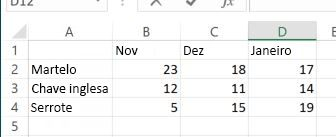

# <a name="call-built-in-excel-worksheet-functions"></a><span data-ttu-id="540e6-102">Chamar funções internas de planilha do Excel</span><span class="sxs-lookup"><span data-stu-id="540e6-102">Call built-in Excel worksheet functions</span></span>

<span data-ttu-id="540e6-p101">Este artigo explica como chamar funções internas de planilha do Excel, como `VLOOKUP` e `SUM`, usando as API JavaScript do Excel. Também fornece a lista completa de funções internas de planilha Excel que podem ser chamadas usando as APIs JavaScript do Excel.</span><span class="sxs-lookup"><span data-stu-id="540e6-p101">This article explains how to call built-in Excel worksheet functions such as `VLOOKUP` and `SUM` using the Excel JavaScript API. It also provides the full list of built-in Excel worksheet functions that can be called using the Excel JavaScript API.</span></span>

> [!NOTE]
> <span data-ttu-id="540e6-105">Para saber mais sobre como criar *funções personalizadas* no Excel usando as APIs JavaScript do Excel, confira [Criar funções personalizadas no Excel](custom-functions-overview.md).</span><span class="sxs-lookup"><span data-stu-id="540e6-105">For information about how to create *custom functions* in Excel using the Excel JavaScript API, see [Create custom functions in Excel](custom-functions-overview.md).</span></span>

## <a name="calling-a-worksheet-function"></a><span data-ttu-id="540e6-106">Chamar uma função de planilha</span><span class="sxs-lookup"><span data-stu-id="540e6-106">Calling a worksheet function</span></span>

<span data-ttu-id="540e6-p102">O trecho de código a seguir mostra como chamar uma função de planilha, onde `sampleFunction()` é um espaço reservado que deve ser substituído pelo nome da função a chamar e os parâmetros de entrada que a função exige. A propriedade **valor** do objeto **FunctionResult** que uma função de planilha retorna contém o resultado da função especificada. Como mostra este exemplo, você deve carregar `load` a propriedade **valor** do objeto **FunctionResult** antes de lê-lo. Neste exemplo, o resultado da função está simplesmente sendo gravado no console.</span><span class="sxs-lookup"><span data-stu-id="540e6-p102">The following code snippet shows how to call a worksheet function, where `sampleFunction()` is a placeholder that should be replaced with the name of the function to call and the input parameters that the function requires. The **value** property of the **FunctionResult** object that's returned by a worksheet function contains the result of the specified function. As this example shows, you must `load` the **value** property of the **FunctionResult** object before you can read it. In this example, the result of the function is simply being written to the console.</span></span> 

```js
var functionResult = context.workbook.functions.sampleFunction(); 
functionResult.load('value');
return context.sync()
    .then(function () {
        console.log('Result of the function: ' + functionResult.value);
    });
```

> [!TIP]
> <span data-ttu-id="540e6-111">Confira a seção [Funções de planilha com suporte](#supported-worksheet-functions) deste artigo para obter uma lista das funções que podem ser chamadas usando as APIs JavaScript do Excel.</span><span class="sxs-lookup"><span data-stu-id="540e6-111">See the [Supported worksheet functions](#supported-worksheet-functions) section of this article for a list of functions that can be called using the Excel JavaScript API.</span></span>

## <a name="sample-data"></a><span data-ttu-id="540e6-112">Dados de exemplo</span><span class="sxs-lookup"><span data-stu-id="540e6-112">Sample data</span></span>

<span data-ttu-id="540e6-p103">A imagem a seguir mostra uma tabela em uma planilha do Excel com dados de vendas para vários tipos de ferramentas durante um período de três meses. Cada número da tabela representa o número de unidades vendidas de uma ferramenta específica em um mês específico. Os exemplos a seguir mostram como aplicar funções internas da planilha nesses dados.</span><span class="sxs-lookup"><span data-stu-id="540e6-p103">The following image shows a table in an Excel worksheet that contains sales data for various types of tools over a three month period. Each number in the table represents the number of units sold for a specific tool in a specific month. The examples that follow will show how to apply built-in worksheet functions to this data.</span></span>



## <a name="example-1-single-function"></a><span data-ttu-id="540e6-117">Exemplo 1: função individual</span><span class="sxs-lookup"><span data-stu-id="540e6-117">Example 1: Single function</span></span>

<span data-ttu-id="540e6-118">O exemplo a seguir se aplica à função `VLOOKUP` para os dados de exemplo descritos anteriormente a fim de identificar o número de chaves inglesas vendidas em novembro.</span><span class="sxs-lookup"><span data-stu-id="540e6-118">The following code sample applies the `VLOOKUP` function to the sample data described previously to identify the number of wrenches sold in November.</span></span>

```js
Excel.run(function (context) {
    var range = context.workbook.worksheets.getItem("Sheet1").getRange("A1:D4");
    var unitSoldInNov = context.workbook.functions.vlookup("Wrench", range, 2, false);
    unitSoldInNov.load('value');

    return context.sync()
        .then(function () {
            console.log(' Number of wrenches sold in November = ' + unitSoldInNov.value);
        });
}).catch(errorHandlerFunction);
```

## <a name="example-2-nested-functions"></a><span data-ttu-id="540e6-119">Exemplo 2: funções aninhadas</span><span class="sxs-lookup"><span data-stu-id="540e6-119">Example 2: Nested functions</span></span>

<span data-ttu-id="540e6-120">O exemplo de código a seguir aplica a função `VLOOKUP` nos dados de amostras descritos anteriormente para identificar o número de chaves inglesas vendidas em novembro e em dezembro e, em seguida, aplica a função `SUM` para calcular o total de chaves inglesas vendido durante esses dois meses.</span><span class="sxs-lookup"><span data-stu-id="540e6-120">The following code sample applies the `VLOOKUP` function to the sample data described previously to identify the number of wrenches sold in November and the number of wrenches sold in December, and then applies the `SUM` function to calculate the total number of wrenches sold during those two months.</span></span> 

<span data-ttu-id="540e6-p104">Como mostra este exemplo, quando uma ou mais chamadas de função são aninhadas dentro de outra chamada de função, você só precisa dar `load` no resultado final caso você queira ler (neste exemplo, `sumOfTwoLookups`). Os resultados intermediários (neste exemplo, o resultado de cada função `VLOOKUP`) serão calculados e usados para calcular o resultado final.</span><span class="sxs-lookup"><span data-stu-id="540e6-p104">As this example shows, when one or more function calls are nested within another function call, you only need to `load` the final result that you subsequently want to read (in this example, `sumOfTwoLookups`). Any intermediate results (in this example, the result of each `VLOOKUP` function) will be calculated and used to calculate the final result.</span></span>

```js
Excel.run(function (context) {
    var range = context.workbook.worksheets.getItem("Sheet1").getRange("A1:D4");
    var sumOfTwoLookups = context.workbook.functions.sum(
        context.workbook.functions.vlookup("Wrench", range, 2, false),
        context.workbook.functions.vlookup("Wrench", range, 3, false)
    );
    sumOfTwoLookups.load('value');

    return context.sync()
        .then(function () {
            console.log(' Number of wrenches sold in November and December = ' + sumOfTwoLookups.value);
        });
}).catch(errorHandlerFunction);
```

## <a name="supported-worksheet-functions"></a><span data-ttu-id="540e6-123">Funções de planilha com suporte</span><span class="sxs-lookup"><span data-stu-id="540e6-123">Supported worksheet functions</span></span>

<span data-ttu-id="540e6-124">As seguintes funções internas de planilhas do Excel podem ser chamadas usando as APIs JavaScript do Excel.</span><span class="sxs-lookup"><span data-stu-id="540e6-124">The following built-in Excel worksheet functions can be called using the Excel JavaScript API.</span></span>

| <span data-ttu-id="540e6-125">Função</span><span class="sxs-lookup"><span data-stu-id="540e6-125">Function</span></span> | <span data-ttu-id="540e6-126">Tipo de retorno</span><span class="sxs-lookup"><span data-stu-id="540e6-126">Return type</span></span> | <span data-ttu-id="540e6-127">Descrição</span><span class="sxs-lookup"><span data-stu-id="540e6-127">Description</span></span> |
|:---------------|:-------------|:-----------|
| <span data-ttu-id="540e6-128"><a href="https://support.office.com/article/ABS-function-3420200f-5628-4e8c-99da-c99d7c87713c" target="_blank">Função ABS</a></span><span class="sxs-lookup"><span data-stu-id="540e6-128"><a href="https://support.office.com/article/ABS-function-3420200f-5628-4e8c-99da-c99d7c87713c" target="_blank">ABS function</a></span></span> | <span data-ttu-id="540e6-129">FunctionResult</span><span class="sxs-lookup"><span data-stu-id="540e6-129">FunctionResult</span></span> | <span data-ttu-id="540e6-130">Retorna o valor absoluto de um número</span><span class="sxs-lookup"><span data-stu-id="540e6-130">Returns the absolute value of a number</span></span> |
| <span data-ttu-id="540e6-131"><a href="https://support.office.com/article/ACCRINT-function-fe45d089-6722-4fb3-9379-e1f911d8dc74" target="_blank">Função JUROSACUM</a></span><span class="sxs-lookup"><span data-stu-id="540e6-131"><a href="https://support.office.com/article/ACCRINT-function-fe45d089-6722-4fb3-9379-e1f911d8dc74" target="_blank">ACCRINT function</a></span></span> | <span data-ttu-id="540e6-132">FunctionResult</span><span class="sxs-lookup"><span data-stu-id="540e6-132">FunctionResult</span></span> | <span data-ttu-id="540e6-133">Retorna juros acumulados de um título que paga juros periódicos</span><span class="sxs-lookup"><span data-stu-id="540e6-133">Returns the accrued interest for a security that pays periodic interest</span></span> |
| <span data-ttu-id="540e6-134"><a href="https://support.office.com/article/ACCRINTM-function-f62f01f9-5754-4cc4-805b-0e70199328a7" target="_blank">Função JUROSACUMV</a></span><span class="sxs-lookup"><span data-stu-id="540e6-134"><a href="https://support.office.com/article/ACCRINTM-function-f62f01f9-5754-4cc4-805b-0e70199328a7" target="_blank">ACCRINTM function</a></span></span> | <span data-ttu-id="540e6-135">FunctionResult</span><span class="sxs-lookup"><span data-stu-id="540e6-135">FunctionResult</span></span> | <span data-ttu-id="540e6-136">Retorna juros acumulados de um título que paga juros no vencimento</span><span class="sxs-lookup"><span data-stu-id="540e6-136">Returns the accrued interest for a security that pays interest at maturity</span></span> |
| <span data-ttu-id="540e6-137"><a href="https://support.office.com/article/ACOS-function-cb73173f-d089-4582-afa1-76e5524b5d5b" target="_blank">Função ACOS</a></span><span class="sxs-lookup"><span data-stu-id="540e6-137"><a href="https://support.office.com/article/ACOS-function-cb73173f-d089-4582-afa1-76e5524b5d5b" target="_blank">ACOS function</a></span></span> | <span data-ttu-id="540e6-138">FunctionResult</span><span class="sxs-lookup"><span data-stu-id="540e6-138">FunctionResult</span></span> | <span data-ttu-id="540e6-139">Retorna o arco cosseno de um número</span><span class="sxs-lookup"><span data-stu-id="540e6-139">Returns the arccosine of a number</span></span> |
| <span data-ttu-id="540e6-140"><a href="https://support.office.com/article/ACOSH-function-e3992cc1-103f-4e72-9f04-624b9ef5ebfe" target="_blank">Função ACOSH</a></span><span class="sxs-lookup"><span data-stu-id="540e6-140"><a href="https://support.office.com/article/ACOSH-function-e3992cc1-103f-4e72-9f04-624b9ef5ebfe" target="_blank">ACOSH function</a></span></span> | <span data-ttu-id="540e6-141">FunctionResult</span><span class="sxs-lookup"><span data-stu-id="540e6-141">FunctionResult</span></span> | <span data-ttu-id="540e6-142">Retorna o cosseno hiperbólico inverso de um número</span><span class="sxs-lookup"><span data-stu-id="540e6-142">Returns the inverse hyperbolic cosine of a number</span></span> |
| <span data-ttu-id="540e6-143"><a href="https://support.office.com/article/ACOT-function-dc7e5008-fe6b-402e-bdd6-2eea8383d905" target="_blank">Função ACOT</a></span><span class="sxs-lookup"><span data-stu-id="540e6-143"><a href="https://support.office.com/article/ACOT-function-dc7e5008-fe6b-402e-bdd6-2eea8383d905" target="_blank">ACOT function</a></span></span> | <span data-ttu-id="540e6-144">FunctionResult</span><span class="sxs-lookup"><span data-stu-id="540e6-144">FunctionResult</span></span> | <span data-ttu-id="540e6-145">Retorna o arco cotangente de um número</span><span class="sxs-lookup"><span data-stu-id="540e6-145">Returns the arccotangent of a number</span></span> |
| <span data-ttu-id="540e6-146"><a href="https://support.office.com/article/ACOTH-function-cc49480f-f684-4171-9fc5-73e4e852300f" target="_blank">Função ACOTH</a></span><span class="sxs-lookup"><span data-stu-id="540e6-146"><a href="https://support.office.com/article/ACOTH-function-cc49480f-f684-4171-9fc5-73e4e852300f" target="_blank">ACOTH function</a></span></span> | <span data-ttu-id="540e6-147">FunctionResult</span><span class="sxs-lookup"><span data-stu-id="540e6-147">FunctionResult</span></span> | <span data-ttu-id="540e6-148">Retorna o arco cotangente hiperbólico de um número</span><span class="sxs-lookup"><span data-stu-id="540e6-148">Returns the hyperbolic arccotangent of a number</span></span> |
| <span data-ttu-id="540e6-149"><a href="https://support.office.com/article/AMORDEGRC-function-a14d0ca1-64a4-42eb-9b3d-b0dededf9e51" target="_blank">Função AMORDEGRC</a></span><span class="sxs-lookup"><span data-stu-id="540e6-149"><a href="https://support.office.com/article/AMORDEGRC-function-a14d0ca1-64a4-42eb-9b3d-b0dededf9e51" target="_blank">AMORDEGRC function</a></span></span> | <span data-ttu-id="540e6-150">FunctionResult</span><span class="sxs-lookup"><span data-stu-id="540e6-150">FunctionResult</span></span> | <span data-ttu-id="540e6-151">Retorna a depreciação para cada período contábil usando o coeficiente de depreciação</span><span class="sxs-lookup"><span data-stu-id="540e6-151">Returns the depreciation for each accounting period by using a depreciation coefficient</span></span> |
| <span data-ttu-id="540e6-152"><a href="https://support.office.com/article/AMORLINC-function-7d417b45-f7f5-4dba-a0a5-3451a81079a8" target="_blank">Função AMORLINC</a></span><span class="sxs-lookup"><span data-stu-id="540e6-152"><a href="https://support.office.com/article/AMORLINC-function-7d417b45-f7f5-4dba-a0a5-3451a81079a8" target="_blank">AMORLINC function</a></span></span> | <span data-ttu-id="540e6-153">FunctionResult</span><span class="sxs-lookup"><span data-stu-id="540e6-153">FunctionResult</span></span> | <span data-ttu-id="540e6-154">Retorna a depreciação para cada período contábil</span><span class="sxs-lookup"><span data-stu-id="540e6-154">Returns the depreciation for each accounting period</span></span> |
| <span data-ttu-id="540e6-155"><a href="https://support.office.com/article/AND-function-5f19b2e8-e1df-4408-897a-ce285a19e9d9" target="_blank">Função E</a></span><span class="sxs-lookup"><span data-stu-id="540e6-155"><a href="https://support.office.com/article/AND-function-5f19b2e8-e1df-4408-897a-ce285a19e9d9" target="_blank">AND function</a></span></span> | <span data-ttu-id="540e6-156">FunctionResult</span><span class="sxs-lookup"><span data-stu-id="540e6-156">FunctionResult</span></span> | <span data-ttu-id="540e6-157">Retorna `TRUE` se todos os seus argumentos forem verdadeiros</span><span class="sxs-lookup"><span data-stu-id="540e6-157">Returns `TRUE` if all of its arguments are true</span></span> |
| <span data-ttu-id="540e6-158"><a href="https://support.office.com/article/ARABIC-function-9a8da418-c17b-4ef9-a657-9370a30a674f" target="_blank">Função ARÁBICO</a></span><span class="sxs-lookup"><span data-stu-id="540e6-158"><a href="https://support.office.com/article/ARABIC-function-9a8da418-c17b-4ef9-a657-9370a30a674f" target="_blank">ARABIC function</a></span></span> | <span data-ttu-id="540e6-159">FunctionResult</span><span class="sxs-lookup"><span data-stu-id="540e6-159">FunctionResult</span></span> | <span data-ttu-id="540e6-160">Converte um número romano em arábico, como um número</span><span class="sxs-lookup"><span data-stu-id="540e6-160">Converts a Roman number to Arabic, as a number</span></span> |
| <span data-ttu-id="540e6-161"><a href="https://support.office.com/article/AREAS-function-8392ba32-7a41-43b3-96b0-3695d2ec6152" target="_blank">Função ÁREAS</a></span><span class="sxs-lookup"><span data-stu-id="540e6-161"><a href="https://support.office.com/article/AREAS-function-8392ba32-7a41-43b3-96b0-3695d2ec6152" target="_blank">AREAS function</a></span></span> | <span data-ttu-id="540e6-162">FunctionResult</span><span class="sxs-lookup"><span data-stu-id="540e6-162">FunctionResult</span></span> | <span data-ttu-id="540e6-163">Retorna o número de áreas em uma referência</span><span class="sxs-lookup"><span data-stu-id="540e6-163">Returns the number of areas in a reference</span></span> |
| <span data-ttu-id="540e6-164"><a href="https://support.office.com/article/ASC-function-0b6abf1c-c663-4004-a964-ebc00b723266" target="_blank">Função ASC</a></span><span class="sxs-lookup"><span data-stu-id="540e6-164"><a href="https://support.office.com/article/ASC-function-0b6abf1c-c663-4004-a964-ebc00b723266" target="_blank">ASC function</a></span></span> | <span data-ttu-id="540e6-165">FunctionResult</span><span class="sxs-lookup"><span data-stu-id="540e6-165">FunctionResult</span></span> | <span data-ttu-id="540e6-166">Altera letras do inglês ou katakana de largura total (bytes duplos) dentro de uma cadeia de caracteres para caracteres de meia largura (byte único)</span><span class="sxs-lookup"><span data-stu-id="540e6-166">Changes full-width (double-byte) English letters or katakana within a character string to half-width (single-byte) characters</span></span> |
| <span data-ttu-id="540e6-167"><a href="https://support.office.com/article/ASIN-function-81fb95e5-6d6f-48c4-bc45-58f955c6d347" target="_blank">Função ASEN</a></span><span class="sxs-lookup"><span data-stu-id="540e6-167"><a href="https://support.office.com/article/ASIN-function-81fb95e5-6d6f-48c4-bc45-58f955c6d347" target="_blank">ASIN function</a></span></span> | <span data-ttu-id="540e6-168">FunctionResult</span><span class="sxs-lookup"><span data-stu-id="540e6-168">FunctionResult</span></span> | <span data-ttu-id="540e6-169">Retorna o arco seno de um número</span><span class="sxs-lookup"><span data-stu-id="540e6-169">Returns the arcsine of a number</span></span> |
| <span data-ttu-id="540e6-170"><a href="https://support.office.com/article/ASINH-function-4e00475a-067a-43cf-926a-765b0249717c" target="_blank">Função ASENH</a></span><span class="sxs-lookup"><span data-stu-id="540e6-170"><a href="https://support.office.com/article/ASINH-function-4e00475a-067a-43cf-926a-765b0249717c" target="_blank">ASINH function</a></span></span> | <span data-ttu-id="540e6-171">FunctionResult</span><span class="sxs-lookup"><span data-stu-id="540e6-171">FunctionResult</span></span> | <span data-ttu-id="540e6-172">Retorna o seno hiperbólico inverso de um número</span><span class="sxs-lookup"><span data-stu-id="540e6-172">Returns the inverse hyperbolic sine of a number</span></span> |
| <span data-ttu-id="540e6-173"><a href="https://support.office.com/article/ATAN-function-50746fa8-630a-406b-81d0-4a2aed395543" target="_blank">Função ATAN</a></span><span class="sxs-lookup"><span data-stu-id="540e6-173"><a href="https://support.office.com/article/ATAN-function-50746fa8-630a-406b-81d0-4a2aed395543" target="_blank">ATAN function</a></span></span> | <span data-ttu-id="540e6-174">FunctionResult</span><span class="sxs-lookup"><span data-stu-id="540e6-174">FunctionResult</span></span> | <span data-ttu-id="540e6-175">Retorna o arco tangente de um número</span><span class="sxs-lookup"><span data-stu-id="540e6-175">Returns the arctangent of a number</span></span> |
| <span data-ttu-id="540e6-176"><a href="https://support.office.com/article/ATAN2-function-c04592ab-b9e3-4908-b428-c96b3a565033" target="_blank">Função ATAN2</a></span><span class="sxs-lookup"><span data-stu-id="540e6-176"><a href="https://support.office.com/article/ATAN2-function-c04592ab-b9e3-4908-b428-c96b3a565033" target="_blank">ATAN2 function</a></span></span> | <span data-ttu-id="540e6-177">FunctionResult</span><span class="sxs-lookup"><span data-stu-id="540e6-177">FunctionResult</span></span> | <span data-ttu-id="540e6-178">Retorna o arco tangente das coordenadas x e y</span><span class="sxs-lookup"><span data-stu-id="540e6-178">Returns the arctangent from x- and y-coordinates</span></span> |
| <span data-ttu-id="540e6-179"><a href="https://support.office.com/article/ATANH-function-3cd65768-0de7-4f1d-b312-d01c8c930d90" target="_blank">Função ATANH</a></span><span class="sxs-lookup"><span data-stu-id="540e6-179"><a href="https://support.office.com/article/ATANH-function-3cd65768-0de7-4f1d-b312-d01c8c930d90" target="_blank">ATANH function</a></span></span> | <span data-ttu-id="540e6-180">FunctionResult</span><span class="sxs-lookup"><span data-stu-id="540e6-180">FunctionResult</span></span> | <span data-ttu-id="540e6-181">Retorna a tangente hiperbólica inversa de um número</span><span class="sxs-lookup"><span data-stu-id="540e6-181">Returns the inverse hyperbolic tangent of a number</span></span> |
| <span data-ttu-id="540e6-182"><a href="https://support.office.com/article/AVEDEV-function-58fe8d65-2a84-4dc7-8052-f3f87b5c6639" target="_blank">Função DESV.MÉDIO</a></span><span class="sxs-lookup"><span data-stu-id="540e6-182"><a href="https://support.office.com/article/AVEDEV-function-58fe8d65-2a84-4dc7-8052-f3f87b5c6639" target="_blank">AVEDEV function</a></span></span> | <span data-ttu-id="540e6-183">FunctionResult</span><span class="sxs-lookup"><span data-stu-id="540e6-183">FunctionResult</span></span> | <span data-ttu-id="540e6-184">Retorna a média dos desvios absolutos dos pontos de dados a partir de sua média</span><span class="sxs-lookup"><span data-stu-id="540e6-184">Returns the average of the absolute deviations of data points from their mean</span></span> |
| <span data-ttu-id="540e6-185"><a href="https://support.office.com/article/AVERAGE-function-047bac88-d466-426c-a32b-8f33eb960cf6" target="_blank">Função MÉDIA</a></span><span class="sxs-lookup"><span data-stu-id="540e6-185"><a href="https://support.office.com/article/AVERAGE-function-047bac88-d466-426c-a32b-8f33eb960cf6" target="_blank">AVERAGE function</a></span></span> | <span data-ttu-id="540e6-186">FunctionResult</span><span class="sxs-lookup"><span data-stu-id="540e6-186">FunctionResult</span></span> | <span data-ttu-id="540e6-187">Retorna a média dos argumentos</span><span class="sxs-lookup"><span data-stu-id="540e6-187">Returns the average of its arguments</span></span> |
| <span data-ttu-id="540e6-188"><a href="https://support.office.com/article/AVERAGEA-function-f5f84098-d453-4f4c-bbba-3d2c66356091" target="_blank">Função MÉDIAA</a></span><span class="sxs-lookup"><span data-stu-id="540e6-188"><a href="https://support.office.com/article/AVERAGEA-function-f5f84098-d453-4f4c-bbba-3d2c66356091" target="_blank">AVERAGEA function</a></span></span> | <span data-ttu-id="540e6-189">FunctionResult</span><span class="sxs-lookup"><span data-stu-id="540e6-189">FunctionResult</span></span> | <span data-ttu-id="540e6-190">Retorna a média dos argumentos, incluindo números, texto e valores lógicos</span><span class="sxs-lookup"><span data-stu-id="540e6-190">Returns the average of its arguments, including numbers, text, and logical values</span></span> |
| <span data-ttu-id="540e6-191"><a href="https://support.office.com/article/AVERAGEIF-function-faec8e2e-0dec-4308-af69-f5576d8ac642" target="_blank">Função MÉDIASE</a></span><span class="sxs-lookup"><span data-stu-id="540e6-191"><a href="https://support.office.com/article/AVERAGEIF-function-faec8e2e-0dec-4308-af69-f5576d8ac642" target="_blank">AVERAGEIF function</a></span></span> | <span data-ttu-id="540e6-192">FunctionResult</span><span class="sxs-lookup"><span data-stu-id="540e6-192">FunctionResult</span></span> | <span data-ttu-id="540e6-193">Retorna a média (média aritmética) de todas as células em um intervalo que atendem a um determinado critério</span><span class="sxs-lookup"><span data-stu-id="540e6-193">Returns the average (arithmetic mean) of all the cells in a range that meet a given criteria</span></span> |
| <span data-ttu-id="540e6-194"><a href="https://support.office.com/article/AVERAGEIFS-function-48910c45-1fc0-4389-a028-f7c5c3001690" target="_blank">Função MÉDIASES</a></span><span class="sxs-lookup"><span data-stu-id="540e6-194"><a href="https://support.office.com/article/AVERAGEIFS-function-48910c45-1fc0-4389-a028-f7c5c3001690" target="_blank">AVERAGEIFS function</a></span></span> | <span data-ttu-id="540e6-195">FunctionResult</span><span class="sxs-lookup"><span data-stu-id="540e6-195">FunctionResult</span></span> | <span data-ttu-id="540e6-196">Retorna a média (média aritmética) de todas as células que satisfazem vários critérios</span><span class="sxs-lookup"><span data-stu-id="540e6-196">Returns the average (arithmetic mean) of all cells that meet multiple criteria</span></span> |
| <span data-ttu-id="540e6-197"><a href="https://support.office.com/article/BAHTTEXT-function-5ba4d0b4-abd3-4325-8d22-7a92d59aab9c" target="_blank">Função BAHTTEXT</a></span><span class="sxs-lookup"><span data-stu-id="540e6-197"><a href="https://support.office.com/article/BAHTTEXT-function-5ba4d0b4-abd3-4325-8d22-7a92d59aab9c" target="_blank">BAHTTEXT function</a></span></span> | <span data-ttu-id="540e6-198">FunctionResult</span><span class="sxs-lookup"><span data-stu-id="540e6-198">FunctionResult</span></span> | <span data-ttu-id="540e6-199">Converte um número em texto, usando o formato de moeda ß (baht)</span><span class="sxs-lookup"><span data-stu-id="540e6-199">Converts a number to text, using the ß (baht) currency format</span></span> |
| <span data-ttu-id="540e6-200"><a href="https://support.office.com/article/BASE-function-2ef61411-aee9-4f29-a811-1c42456c6342" target="_blank">Função BASE</a></span><span class="sxs-lookup"><span data-stu-id="540e6-200"><a href="https://support.office.com/article/BASE-function-2ef61411-aee9-4f29-a811-1c42456c6342" target="_blank">BASE function</a></span></span> | <span data-ttu-id="540e6-201">FunctionResult</span><span class="sxs-lookup"><span data-stu-id="540e6-201">FunctionResult</span></span> | <span data-ttu-id="540e6-202">Converte um número em uma representação de texto com a determinada base</span><span class="sxs-lookup"><span data-stu-id="540e6-202">Converts a number into a text representation with the given radix (base)</span></span> |
| <span data-ttu-id="540e6-203"><a href="https://support.office.com/article/BESSELI-function-8d33855c-9a8d-444b-98e0-852267b1c0df" target="_blank">Função BESSELI</a></span><span class="sxs-lookup"><span data-stu-id="540e6-203"><a href="https://support.office.com/article/BESSELI-function-8d33855c-9a8d-444b-98e0-852267b1c0df" target="_blank">BESSELI function</a></span></span> | <span data-ttu-id="540e6-204">FunctionResult</span><span class="sxs-lookup"><span data-stu-id="540e6-204">FunctionResult</span></span> | <span data-ttu-id="540e6-205">Retorna a função de Bessel In(x) modificada</span><span class="sxs-lookup"><span data-stu-id="540e6-205">Returns the modified Bessel function In(x)</span></span> |
| <span data-ttu-id="540e6-206"><a href="https://support.office.com/article/BESSELJ-function-839cb181-48de-408b-9d80-bd02982d94f7" target="_blank">Função BESSELJ</a></span><span class="sxs-lookup"><span data-stu-id="540e6-206"><a href="https://support.office.com/article/BESSELJ-function-839cb181-48de-408b-9d80-bd02982d94f7" target="_blank">BESSELJ function</a></span></span> | <span data-ttu-id="540e6-207">FunctionResult</span><span class="sxs-lookup"><span data-stu-id="540e6-207">FunctionResult</span></span> | <span data-ttu-id="540e6-208">Retorna a função de Bessel Jn(x)</span><span class="sxs-lookup"><span data-stu-id="540e6-208">Returns the Bessel function Jn(x)</span></span> |
| <span data-ttu-id="540e6-209"><a href="https://support.office.com/article/BESSELK-function-606d11bc-06d3-4d53-9ecb-2803e2b90b70" target="_blank">Função BESSELK</a></span><span class="sxs-lookup"><span data-stu-id="540e6-209"><a href="https://support.office.com/article/BESSELK-function-606d11bc-06d3-4d53-9ecb-2803e2b90b70" target="_blank">BESSELK function</a></span></span> | <span data-ttu-id="540e6-210">FunctionResult</span><span class="sxs-lookup"><span data-stu-id="540e6-210">FunctionResult</span></span> | <span data-ttu-id="540e6-211">Retorna a função de Bessel Kn(x) modificada</span><span class="sxs-lookup"><span data-stu-id="540e6-211">Returns the modified Bessel function Kn(x)</span></span> |
| <span data-ttu-id="540e6-212"><a href="https://support.office.com/article/BESSELY-function-f3a356b3-da89-42c3-8974-2da54d6353a2" target="_blank">Função BESSELY</a></span><span class="sxs-lookup"><span data-stu-id="540e6-212"><a href="https://support.office.com/article/BESSELY-function-f3a356b3-da89-42c3-8974-2da54d6353a2" target="_blank">BESSELY function</a></span></span> | <span data-ttu-id="540e6-213">FunctionResult</span><span class="sxs-lookup"><span data-stu-id="540e6-213">FunctionResult</span></span> | <span data-ttu-id="540e6-214">Retorna a função de Bessel Yn(x)</span><span class="sxs-lookup"><span data-stu-id="540e6-214">Returns the Bessel function Yn(x)</span></span> |
| <span data-ttu-id="540e6-215"><a href="https://support.office.com/article/BETADIST-function-11188c9c-780a-42c7-ba43-9ecb5a878d31" target="_blank">Função DIST.BETA</a></span><span class="sxs-lookup"><span data-stu-id="540e6-215"><a href="https://support.office.com/article/BETADIST-function-11188c9c-780a-42c7-ba43-9ecb5a878d31" target="_blank">BETA.DIST function</a></span></span> | <span data-ttu-id="540e6-216">FunctionResult</span><span class="sxs-lookup"><span data-stu-id="540e6-216">FunctionResult</span></span> | <span data-ttu-id="540e6-217">Retorna a função de distribuição cumulativa beta</span><span class="sxs-lookup"><span data-stu-id="540e6-217">Returns the beta cumulative distribution function</span></span> |
| <span data-ttu-id="540e6-218"><a href="https://support.office.com/article/BETAINV-function-e84cb8aa-8df0-4cf6-9892-83a341d252eb" target="_blank">Função INV.BETA</a></span><span class="sxs-lookup"><span data-stu-id="540e6-218"><a href="https://support.office.com/article/BETAINV-function-e84cb8aa-8df0-4cf6-9892-83a341d252eb" target="_blank">BETA.INV function</a></span></span> | <span data-ttu-id="540e6-219">FunctionResult</span><span class="sxs-lookup"><span data-stu-id="540e6-219">FunctionResult</span></span> | <span data-ttu-id="540e6-220">Retorna o inverso da função de distribuição cumulativa para uma distribuição beta especificada</span><span class="sxs-lookup"><span data-stu-id="540e6-220">Returns the inverse of the cumulative distribution function for a specified beta distribution</span></span> |
| <span data-ttu-id="540e6-221"><a href="https://support.office.com/article/BIN2DEC-function-63905b57-b3a0-453d-99f4-647bb519cd6c" target="_blank">Função BINADEC</a></span><span class="sxs-lookup"><span data-stu-id="540e6-221"><a href="https://support.office.com/article/BIN2DEC-function-63905b57-b3a0-453d-99f4-647bb519cd6c" target="_blank">BIN2DEC function</a></span></span> | <span data-ttu-id="540e6-222">FunctionResult</span><span class="sxs-lookup"><span data-stu-id="540e6-222">FunctionResult</span></span> | <span data-ttu-id="540e6-223">Converte um número binário em decimal</span><span class="sxs-lookup"><span data-stu-id="540e6-223">Converts a binary number to decimal</span></span> |
| <span data-ttu-id="540e6-224"><a href="https://support.office.com/article/BIN2HEX-function-0375e507-f5e5-4077-9af8-28d84f9f41cc" target="_blank">Função BINAHEX</a></span><span class="sxs-lookup"><span data-stu-id="540e6-224"><a href="https://support.office.com/article/BIN2HEX-function-0375e507-f5e5-4077-9af8-28d84f9f41cc" target="_blank">BIN2HEX function</a></span></span> | <span data-ttu-id="540e6-225">FunctionResult</span><span class="sxs-lookup"><span data-stu-id="540e6-225">FunctionResult</span></span> | <span data-ttu-id="540e6-226">Converte um número binário em hexadecimal</span><span class="sxs-lookup"><span data-stu-id="540e6-226">Converts a binary number to hexadecimal</span></span> |
| <span data-ttu-id="540e6-227"><a href="https://support.office.com/article/BIN2OCT-function-0a4e01ba-ac8d-4158-9b29-16c25c4c23fd" target="_blank">Função BINAOCT</a></span><span class="sxs-lookup"><span data-stu-id="540e6-227"><a href="https://support.office.com/article/BIN2OCT-function-0a4e01ba-ac8d-4158-9b29-16c25c4c23fd" target="_blank">BIN2OCT function</a></span></span> | <span data-ttu-id="540e6-228">FunctionResult</span><span class="sxs-lookup"><span data-stu-id="540e6-228">FunctionResult</span></span> | <span data-ttu-id="540e6-229">Converte um número binário em octal</span><span class="sxs-lookup"><span data-stu-id="540e6-229">Converts a binary number to octal</span></span> |
| <span data-ttu-id="540e6-230"><a href="https://support.office.com/article/BINOMDIST-function-c5ae37b6-f39c-4be2-94c2-509a1480770c" target="_blank">Função DISTR.BINOM</a></span><span class="sxs-lookup"><span data-stu-id="540e6-230"><a href="https://support.office.com/article/BINOMDIST-function-c5ae37b6-f39c-4be2-94c2-509a1480770c" target="_blank">BINOM.DIST function</a></span></span> | <span data-ttu-id="540e6-231">FunctionResult</span><span class="sxs-lookup"><span data-stu-id="540e6-231">FunctionResult</span></span> | <span data-ttu-id="540e6-232">Retorna a probabilidade de distribuição binomial do termo individual</span><span class="sxs-lookup"><span data-stu-id="540e6-232">Returns the individual term binomial distribution probability</span></span> |
| <span data-ttu-id="540e6-233"><a href="https://support.office.com/article/BINOMDISTRANGE-function-17331329-74c7-4053-bb4c-6653a7421595" target="_blank">Função INTERV.DISTR.BINOM</a></span><span class="sxs-lookup"><span data-stu-id="540e6-233"><a href="https://support.office.com/article/BINOMDISTRANGE-function-17331329-74c7-4053-bb4c-6653a7421595" target="_blank">BINOM.DIST.RANGE function</a></span></span> | <span data-ttu-id="540e6-234">FunctionResult</span><span class="sxs-lookup"><span data-stu-id="540e6-234">FunctionResult</span></span> | <span data-ttu-id="540e6-235">Retorna a probabilidade de um resultado de teste usando uma distribuição binomial</span><span class="sxs-lookup"><span data-stu-id="540e6-235">Returns the probability of a trial result using a binomial distribution</span></span> |
| <span data-ttu-id="540e6-236"><a href="https://support.office.com/article/BINOMINV-function-80a0370c-ada6-49b4-83e7-05a91ba77ac9" target="_blank">Função INV.BINOM</a></span><span class="sxs-lookup"><span data-stu-id="540e6-236"><a href="https://support.office.com/article/BINOMINV-function-80a0370c-ada6-49b4-83e7-05a91ba77ac9" target="_blank">BINOM.INV function</a></span></span> | <span data-ttu-id="540e6-237">FunctionResult</span><span class="sxs-lookup"><span data-stu-id="540e6-237">FunctionResult</span></span> | <span data-ttu-id="540e6-238">Retorna o menor valor para o qual a distribuição binomial cumulativa é maior ou igual ao valor padrão</span><span class="sxs-lookup"><span data-stu-id="540e6-238">Returns the smallest value for which the cumulative binomial distribution is less than or equal to a criterion value</span></span> |
| <span data-ttu-id="540e6-239"><a href="https://support.office.com/article/BITAND-function-8a2be3d7-91c3-4b48-9517-64548008563a" target="_blank">Função BITAND</a></span><span class="sxs-lookup"><span data-stu-id="540e6-239"><a href="https://support.office.com/article/BITAND-function-8a2be3d7-91c3-4b48-9517-64548008563a" target="_blank">BITAND function</a></span></span> | <span data-ttu-id="540e6-240">FunctionResult</span><span class="sxs-lookup"><span data-stu-id="540e6-240">FunctionResult</span></span> | <span data-ttu-id="540e6-241">Retorna um bit "E" de dois números</span><span class="sxs-lookup"><span data-stu-id="540e6-241">Returns a 'Bitwise And' of two numbers</span></span> |
| <span data-ttu-id="540e6-242"><a href="https://support.office.com/article/BITLSHIFT-function-c55bb27e-cacd-4c7c-b258-d80861a03c9c" target="_blank">Função DESLOCESQBIT</a></span><span class="sxs-lookup"><span data-stu-id="540e6-242"><a href="https://support.office.com/article/BITLSHIFT-function-c55bb27e-cacd-4c7c-b258-d80861a03c9c" target="_blank">BITLSHIFT function</a></span></span> | <span data-ttu-id="540e6-243">FunctionResult</span><span class="sxs-lookup"><span data-stu-id="540e6-243">FunctionResult</span></span> | <span data-ttu-id="540e6-244">Retorna um valor numérico deslocado à esquerda por quantidade_deslocamento bits</span><span class="sxs-lookup"><span data-stu-id="540e6-244">Returns a value number shifted left by shift_amount bits</span></span> |
| <span data-ttu-id="540e6-245"><a href="https://support.office.com/article/BITOR-function-f6ead5c8-5b98-4c9e-9053-8ad5234919b2" target="_blank">Função BITOR</a></span><span class="sxs-lookup"><span data-stu-id="540e6-245"><a href="https://support.office.com/article/BITOR-function-f6ead5c8-5b98-4c9e-9053-8ad5234919b2" target="_blank">BITOR function</a></span></span> | <span data-ttu-id="540e6-246">FunctionResult</span><span class="sxs-lookup"><span data-stu-id="540e6-246">FunctionResult</span></span> | <span data-ttu-id="540e6-247">Retorna um bit "OU" de dois números</span><span class="sxs-lookup"><span data-stu-id="540e6-247">Returns a bitwise OR of 2 numbers</span></span> |
| <span data-ttu-id="540e6-248"><a href="https://support.office.com/article/BITRSHIFT-function-274d6996-f42c-4743-abdb-4ff95351222c" target="_blank">Função DESLOCDIRBIT</a></span><span class="sxs-lookup"><span data-stu-id="540e6-248"><a href="https://support.office.com/article/BITRSHIFT-function-274d6996-f42c-4743-abdb-4ff95351222c" target="_blank">BITRSHIFT function</a></span></span> | <span data-ttu-id="540e6-249">FunctionResult</span><span class="sxs-lookup"><span data-stu-id="540e6-249">FunctionResult</span></span> | <span data-ttu-id="540e6-250">Retorna um valor numérico deslocado à direita por quantidade_deslocamento bits</span><span class="sxs-lookup"><span data-stu-id="540e6-250">Returns a value number shifted right by shift_amount bits</span></span> |
| <span data-ttu-id="540e6-251"><a href="https://support.office.com/article/BITXOR-function-c81306a1-03f9-4e89-85ac-b86c3cba10e4" target="_blank">Função BITXOR</a></span><span class="sxs-lookup"><span data-stu-id="540e6-251"><a href="https://support.office.com/article/BITXOR-function-c81306a1-03f9-4e89-85ac-b86c3cba10e4" target="_blank">BITXOR function</a></span></span> | <span data-ttu-id="540e6-252">FunctionResult</span><span class="sxs-lookup"><span data-stu-id="540e6-252">FunctionResult</span></span> | <span data-ttu-id="540e6-253">Retorna um bit 'Exclusivo Ou' de dois números</span><span class="sxs-lookup"><span data-stu-id="540e6-253">Returns a bitwise 'Exclusive Or' of two numbers</span></span> |
| <span data-ttu-id="540e6-254"><a href="https://support.office.com/article/CEILINGMATH-function-80f95d2f-b499-4eee-9f16-f795a8e306c8" target="_blank">Rendimento. Funções MATH, ECMA_CEILING</a></span><span class="sxs-lookup"><span data-stu-id="540e6-254"><a href="https://support.office.com/article/CEILINGMATH-function-80f95d2f-b499-4eee-9f16-f795a8e306c8" target="_blank">CEILING.MATH, ECMA_CEILING functions</a></span></span> | <span data-ttu-id="540e6-255">FunctionResult</span><span class="sxs-lookup"><span data-stu-id="540e6-255">FunctionResult</span></span> | <span data-ttu-id="540e6-256">Arredonda um número para cima, para o inteiro mais próximo ou para o múltiplo mais próximo significativo</span><span class="sxs-lookup"><span data-stu-id="540e6-256">Rounds a number up, to the nearest integer or to the nearest multiple of significance</span></span> |
| <span data-ttu-id="540e6-257"><a href="https://support.office.com/article/CEILINGPRECISE-function-f366a774-527a-4c92-ba49-af0a196e66cb" target="_blank">Função TETO.PRECISO</a></span><span class="sxs-lookup"><span data-stu-id="540e6-257"><a href="https://support.office.com/article/CEILINGPRECISE-function-f366a774-527a-4c92-ba49-af0a196e66cb" target="_blank">CEILING.PRECISE function</a></span></span> | <span data-ttu-id="540e6-258">FunctionResult</span><span class="sxs-lookup"><span data-stu-id="540e6-258">FunctionResult</span></span> | <span data-ttu-id="540e6-p105">Arredonda um número para o inteiro mais próximo ou para o múltiplo mais próximo significativo. Independentemente do sinal do número, ele é arredondado para cima.</span><span class="sxs-lookup"><span data-stu-id="540e6-p105">Rounds a number the nearest integer or to the nearest multiple of significance. Regardless of the sign of the number, the number is rounded up.</span></span> |
| <span data-ttu-id="540e6-261"><a href="https://support.office.com/article/CHAR-function-bbd249c8-b36e-4a91-8017-1c133f9b837a" target="_blank">Função CARACT</a></span><span class="sxs-lookup"><span data-stu-id="540e6-261"><a href="https://support.office.com/article/CHAR-function-bbd249c8-b36e-4a91-8017-1c133f9b837a" target="_blank">CHAR function</a></span></span> | <span data-ttu-id="540e6-262">FunctionResult</span><span class="sxs-lookup"><span data-stu-id="540e6-262">FunctionResult</span></span> | <span data-ttu-id="540e6-263">Retorna o caractere especificado pelo número de código</span><span class="sxs-lookup"><span data-stu-id="540e6-263">Returns the character specified by the code number</span></span> |
| <span data-ttu-id="540e6-264"><a href="https://support.office.com/article/CHISQDIST-function-8486b05e-5c05-4942-a9ea-f6b341518732" target="_blank">Função DIST.QUIQUA</a></span><span class="sxs-lookup"><span data-stu-id="540e6-264"><a href="https://support.office.com/article/CHISQDIST-function-8486b05e-5c05-4942-a9ea-f6b341518732" target="_blank">CHISQ.DIST function</a></span></span> | <span data-ttu-id="540e6-265">FunctionResult</span><span class="sxs-lookup"><span data-stu-id="540e6-265">FunctionResult</span></span> | <span data-ttu-id="540e6-266">Retorna a função de densidade da probabilidade beta cumulativa</span><span class="sxs-lookup"><span data-stu-id="540e6-266">Returns the cumulative beta probability density function</span></span> |
| <span data-ttu-id="540e6-267"><a href="https://support.office.com/article/CHISQDISTRT-function-dc4832e8-ed2b-49ae-8d7c-b28d5804c0f2" target="_blank">Função DIST.QUIQUA.CD</a></span><span class="sxs-lookup"><span data-stu-id="540e6-267"><a href="https://support.office.com/article/CHISQDISTRT-function-dc4832e8-ed2b-49ae-8d7c-b28d5804c0f2" target="_blank">CHISQ.DIST.RT function</a></span></span> | <span data-ttu-id="540e6-268">FunctionResult</span><span class="sxs-lookup"><span data-stu-id="540e6-268">FunctionResult</span></span> | <span data-ttu-id="540e6-269">Retorna a probabilidade unicaudal da distribuição qui-quadrada</span><span class="sxs-lookup"><span data-stu-id="540e6-269">Returns the one-tailed probability of the chi-squared distribution</span></span> |
| <span data-ttu-id="540e6-270"><a href="https://support.office.com/article/CHISQINV-function-400db556-62b3-472d-80b3-254723e7092f" target="_blank">Função INV.QUIQUA</a></span><span class="sxs-lookup"><span data-stu-id="540e6-270"><a href="https://support.office.com/article/CHISQINV-function-400db556-62b3-472d-80b3-254723e7092f" target="_blank">CHISQ.INV function</a></span></span> | <span data-ttu-id="540e6-271">FunctionResult</span><span class="sxs-lookup"><span data-stu-id="540e6-271">FunctionResult</span></span> | <span data-ttu-id="540e6-272">Retorna a função de densidade da probabilidade beta cumulativa</span><span class="sxs-lookup"><span data-stu-id="540e6-272">Returns the cumulative beta probability density function</span></span> |
| <span data-ttu-id="540e6-273"><a href="https://support.office.com/article/CHISQINVRT-function-435b5ed8-98d5-4da6-823f-293e2cbc94fe" target="_blank">Função INV.QUIQUA.CD</a></span><span class="sxs-lookup"><span data-stu-id="540e6-273"><a href="https://support.office.com/article/CHISQINVRT-function-435b5ed8-98d5-4da6-823f-293e2cbc94fe" target="_blank">CHISQ.INV.RT function</a></span></span> | <span data-ttu-id="540e6-274">FunctionResult</span><span class="sxs-lookup"><span data-stu-id="540e6-274">FunctionResult</span></span> | <span data-ttu-id="540e6-275">Retorna o inverso da probabilidade unicaudal da distribuição qui-quadrada</span><span class="sxs-lookup"><span data-stu-id="540e6-275">Returns the inverse of the one-tailed probability of the chi-squared distribution</span></span> |
| <span data-ttu-id="540e6-276"><a href="https://support.office.com/article/CHOOSE-function-fc5c184f-cb62-4ec7-a46e-38653b98f5bc" target="_blank">Função ESCOLHER</a></span><span class="sxs-lookup"><span data-stu-id="540e6-276"><a href="https://support.office.com/article/CHOOSE-function-fc5c184f-cb62-4ec7-a46e-38653b98f5bc" target="_blank">CHOOSE function</a></span></span> | <span data-ttu-id="540e6-277">FunctionResult</span><span class="sxs-lookup"><span data-stu-id="540e6-277">FunctionResult</span></span> | <span data-ttu-id="540e6-278">Escolhe um valor em uma lista de valores</span><span class="sxs-lookup"><span data-stu-id="540e6-278">Chooses a value from a list of values</span></span> |
| <span data-ttu-id="540e6-279"><a href="https://support.office.com/article/CLEAN-function-26f3d7c5-475f-4a9c-90e5-4b8ba987ba41" target="_blank">Função TIRAR</a></span><span class="sxs-lookup"><span data-stu-id="540e6-279"><a href="https://support.office.com/article/CLEAN-function-26f3d7c5-475f-4a9c-90e5-4b8ba987ba41" target="_blank">CLEAN function</a></span></span> | <span data-ttu-id="540e6-280">FunctionResult</span><span class="sxs-lookup"><span data-stu-id="540e6-280">FunctionResult</span></span> | <span data-ttu-id="540e6-281">Remove do texto todos os caracteres não imprimíveis</span><span class="sxs-lookup"><span data-stu-id="540e6-281">Removes all nonprintable characters from text</span></span> |
| <span data-ttu-id="540e6-282"><a href="https://support.office.com/article/CODE-function-c32b692b-2ed0-4a04-bdd9-75640144b928" target="_blank">Função CÓDIGO</a></span><span class="sxs-lookup"><span data-stu-id="540e6-282"><a href="https://support.office.com/article/CODE-function-c32b692b-2ed0-4a04-bdd9-75640144b928" target="_blank">CODE function</a></span></span> | <span data-ttu-id="540e6-283">FunctionResult</span><span class="sxs-lookup"><span data-stu-id="540e6-283">FunctionResult</span></span> | <span data-ttu-id="540e6-284">Retorna um código numérico para o primeiro caractere de uma cadeia de texto</span><span class="sxs-lookup"><span data-stu-id="540e6-284">Returns a numeric code for the first character in a text string</span></span> |
| <span data-ttu-id="540e6-285"><a href="https://support.office.com/article/COLUMNS-function-4e8e7b4e-e603-43e8-b177-956088fa48ca" target="_blank">Função COLS</a></span><span class="sxs-lookup"><span data-stu-id="540e6-285"><a href="https://support.office.com/article/COLUMNS-function-4e8e7b4e-e603-43e8-b177-956088fa48ca" target="_blank">COLUMNS function</a></span></span> | <span data-ttu-id="540e6-286">FunctionResult</span><span class="sxs-lookup"><span data-stu-id="540e6-286">FunctionResult</span></span> | <span data-ttu-id="540e6-287">Retorna o número de colunas em uma referência</span><span class="sxs-lookup"><span data-stu-id="540e6-287">Returns the number of columns in a reference</span></span> |
| <span data-ttu-id="540e6-288"><a href="https://support.office.com/article/COMBIN-function-12a3f276-0a21-423a-8de6-06990aaf638a" target="_blank">Função COMBIN</a></span><span class="sxs-lookup"><span data-stu-id="540e6-288"><a href="https://support.office.com/article/COMBIN-function-12a3f276-0a21-423a-8de6-06990aaf638a" target="_blank">COMBIN function</a></span></span> | <span data-ttu-id="540e6-289">FunctionResult</span><span class="sxs-lookup"><span data-stu-id="540e6-289">FunctionResult</span></span> | <span data-ttu-id="540e6-290">Retorna o número de combinações de um determinado número de objetos</span><span class="sxs-lookup"><span data-stu-id="540e6-290">Returns the number of combinations for a given number of objects</span></span> |
| <span data-ttu-id="540e6-291"><a href="https://support.office.com/article/COMBINA-function-efb49eaa-4f4c-4cd2-8179-0ddfcf9d035d" target="_blank">Função COMBINA</a></span><span class="sxs-lookup"><span data-stu-id="540e6-291"><a href="https://support.office.com/article/COMBINA-function-efb49eaa-4f4c-4cd2-8179-0ddfcf9d035d" target="_blank">COMBINA function</a></span></span> | <span data-ttu-id="540e6-292">FunctionResult</span><span class="sxs-lookup"><span data-stu-id="540e6-292">FunctionResult</span></span> | <span data-ttu-id="540e6-293">Retorna o número de combinações com repetições de um determinado número de itens</span><span class="sxs-lookup"><span data-stu-id="540e6-293">Returns the number of combinations with repetitions for a given number of items</span></span> |
| <span data-ttu-id="540e6-294"><a href="https://support.office.com/article/COMPLEX-function-f0b8f3a9-51cc-4d6d-86fb-3a9362fa4128" target="_blank">Função COMPLEXO</a></span><span class="sxs-lookup"><span data-stu-id="540e6-294"><a href="https://support.office.com/article/COMPLEX-function-f0b8f3a9-51cc-4d6d-86fb-3a9362fa4128" target="_blank">COMPLEX function</a></span></span> | <span data-ttu-id="540e6-295">FunctionResult</span><span class="sxs-lookup"><span data-stu-id="540e6-295">FunctionResult</span></span> | <span data-ttu-id="540e6-296">Converte coeficientes reais e imaginários em um número complexo</span><span class="sxs-lookup"><span data-stu-id="540e6-296">Converts real and imaginary coefficients into a complex number</span></span> |
| <span data-ttu-id="540e6-297"><a href="https://support.office.com/article/CONCATENATE-function-8f8ae884-2ca8-4f7a-b093-75d702bea31d" target="_blank">Função CONCATENAR</a></span><span class="sxs-lookup"><span data-stu-id="540e6-297"><a href="https://support.office.com/article/CONCATENATE-function-8f8ae884-2ca8-4f7a-b093-75d702bea31d" target="_blank">CONCATENATE function</a></span></span> | <span data-ttu-id="540e6-298">FunctionResult</span><span class="sxs-lookup"><span data-stu-id="540e6-298">FunctionResult</span></span> | <span data-ttu-id="540e6-299">Agrupa vários itens de texto em um item de texto</span><span class="sxs-lookup"><span data-stu-id="540e6-299">Joins several text items into one text item</span></span> |
| <span data-ttu-id="540e6-300"><a href="https://support.office.com/article/CONFIDENCENORM-function-7cec58a6-85bb-488d-91c3-63828d4fbfd4" target="_blank">Função INT.CONFIANÇA.NORM</a></span><span class="sxs-lookup"><span data-stu-id="540e6-300"><a href="https://support.office.com/article/CONFIDENCENORM-function-7cec58a6-85bb-488d-91c3-63828d4fbfd4" target="_blank">CONFIDENCE.NORM function</a></span></span> | <span data-ttu-id="540e6-301">FunctionResult</span><span class="sxs-lookup"><span data-stu-id="540e6-301">FunctionResult</span></span> | <span data-ttu-id="540e6-302">Retorna o intervalo de confiança para um meio de preenchimento</span><span class="sxs-lookup"><span data-stu-id="540e6-302">Returns the confidence interval for a population mean</span></span> |
| <span data-ttu-id="540e6-303"><a href="https://support.office.com/article/CONFIDENCET-function-e8eca395-6c3a-4ba9-9003-79ccc61d3c53" target="_blank">Função INT.CONFIANÇA.T</a></span><span class="sxs-lookup"><span data-stu-id="540e6-303"><a href="https://support.office.com/article/CONFIDENCET-function-e8eca395-6c3a-4ba9-9003-79ccc61d3c53" target="_blank">CONFIDENCE.T function</a></span></span> | <span data-ttu-id="540e6-304">FunctionResult</span><span class="sxs-lookup"><span data-stu-id="540e6-304">FunctionResult</span></span> | <span data-ttu-id="540e6-305">Retorna o intervalo de confiança para um meio de preenchimento, usando a distribuição t de Student</span><span class="sxs-lookup"><span data-stu-id="540e6-305">Returns the confidence interval for a population mean, using a Student's t distribution</span></span> |
| <span data-ttu-id="540e6-306"><a href="https://support.office.com/article/CONVERT-function-d785bef1-808e-4aac-bdcd-666c810f9af2" target="_blank">Função CONVERTER</a></span><span class="sxs-lookup"><span data-stu-id="540e6-306"><a href="https://support.office.com/article/CONVERT-function-d785bef1-808e-4aac-bdcd-666c810f9af2" target="_blank">CONVERT function</a></span></span> | <span data-ttu-id="540e6-307">FunctionResult</span><span class="sxs-lookup"><span data-stu-id="540e6-307">FunctionResult</span></span> | <span data-ttu-id="540e6-308">Converte um número de um sistema de medidas para outro</span><span class="sxs-lookup"><span data-stu-id="540e6-308">Converts a number from one measurement system to another</span></span> |
| <span data-ttu-id="540e6-309"><a href="https://support.office.com/article/COS-function-0fb808a5-95d6-4553-8148-22aebdce5f05" target="_blank">Função COS</a></span><span class="sxs-lookup"><span data-stu-id="540e6-309"><a href="https://support.office.com/article/COS-function-0fb808a5-95d6-4553-8148-22aebdce5f05" target="_blank">COS function</a></span></span> | <span data-ttu-id="540e6-310">FunctionResult</span><span class="sxs-lookup"><span data-stu-id="540e6-310">FunctionResult</span></span> | <span data-ttu-id="540e6-311">Retorna o cosseno de um número</span><span class="sxs-lookup"><span data-stu-id="540e6-311">Returns the cosine of a number</span></span> |
| <span data-ttu-id="540e6-312"><a href="https://support.office.com/article/COSH-function-e460d426-c471-43e8-9540-a57ff3b70555" target="_blank">Função COSH</a></span><span class="sxs-lookup"><span data-stu-id="540e6-312"><a href="https://support.office.com/article/COSH-function-e460d426-c471-43e8-9540-a57ff3b70555" target="_blank">COSH function</a></span></span> | <span data-ttu-id="540e6-313">FunctionResult</span><span class="sxs-lookup"><span data-stu-id="540e6-313">FunctionResult</span></span> | <span data-ttu-id="540e6-314">Retorna o cosseno hiperbólico de um número</span><span class="sxs-lookup"><span data-stu-id="540e6-314">Returns the hyperbolic cosine of a number</span></span> |
| <span data-ttu-id="540e6-315"><a href="https://support.office.com/article/COT-function-c446f34d-6fe4-40dc-84f8-cf59e5f5e31a" target="_blank">Função COT</a></span><span class="sxs-lookup"><span data-stu-id="540e6-315"><a href="https://support.office.com/article/COT-function-c446f34d-6fe4-40dc-84f8-cf59e5f5e31a" target="_blank">COT function</a></span></span> | <span data-ttu-id="540e6-316">FunctionResult</span><span class="sxs-lookup"><span data-stu-id="540e6-316">FunctionResult</span></span> | <span data-ttu-id="540e6-317">Retorna a cotangente de um ângulo</span><span class="sxs-lookup"><span data-stu-id="540e6-317">Returns the cotangent of an angle</span></span> |
| <span data-ttu-id="540e6-318"><a href="https://support.office.com/article/COTH-function-2e0b4cb6-0ba0-403e-aed4-deaa71b49df5" target="_blank">Função COTH</a></span><span class="sxs-lookup"><span data-stu-id="540e6-318"><a href="https://support.office.com/article/COTH-function-2e0b4cb6-0ba0-403e-aed4-deaa71b49df5" target="_blank">COTH function</a></span></span> | <span data-ttu-id="540e6-319">FunctionResult</span><span class="sxs-lookup"><span data-stu-id="540e6-319">FunctionResult</span></span> | <span data-ttu-id="540e6-320">Retorna a cotangente hiperbólica de um número</span><span class="sxs-lookup"><span data-stu-id="540e6-320">Returns the hyperbolic cotangent of a number</span></span> |
| <span data-ttu-id="540e6-321"><a href="https://support.office.com/article/COUNT-function-a59cd7fc-b623-4d93-87a4-d23bf411294c" target="_blank">Função CONT.NÚM</a></span><span class="sxs-lookup"><span data-stu-id="540e6-321"><a href="https://support.office.com/article/COUNT-function-a59cd7fc-b623-4d93-87a4-d23bf411294c" target="_blank">COUNT function</a></span></span> | <span data-ttu-id="540e6-322">FunctionResult</span><span class="sxs-lookup"><span data-stu-id="540e6-322">FunctionResult</span></span> | <span data-ttu-id="540e6-323">Calcula quantos números há na lista de argumentos</span><span class="sxs-lookup"><span data-stu-id="540e6-323">Counts how many numbers are in the list of arguments</span></span> |
| <span data-ttu-id="540e6-324"><a href="https://support.office.com/article/COUNTA-function-7dc98875-d5c1-46f1-9a82-53f3219e2509" target="_blank">Função CONT.VALORES</a></span><span class="sxs-lookup"><span data-stu-id="540e6-324"><a href="https://support.office.com/article/COUNTA-function-7dc98875-d5c1-46f1-9a82-53f3219e2509" target="_blank">COUNTA function</a></span></span> | <span data-ttu-id="540e6-325">FunctionResult</span><span class="sxs-lookup"><span data-stu-id="540e6-325">FunctionResult</span></span> | <span data-ttu-id="540e6-326">Calcula quantos valores há na lista de argumentos</span><span class="sxs-lookup"><span data-stu-id="540e6-326">Counts how many values are in the list of arguments</span></span> |
| <span data-ttu-id="540e6-327"><a href="https://support.office.com/article/COUNTBLANK-function-6a92d772-675c-4bee-b346-24af6bd3ac22" target="_blank">Função CONTAR.VAZIO</a></span><span class="sxs-lookup"><span data-stu-id="540e6-327"><a href="https://support.office.com/article/COUNTBLANK-function-6a92d772-675c-4bee-b346-24af6bd3ac22" target="_blank">COUNTBLANK function</a></span></span> | <span data-ttu-id="540e6-328">FunctionResult</span><span class="sxs-lookup"><span data-stu-id="540e6-328">FunctionResult</span></span> | <span data-ttu-id="540e6-329">Conta o número de células vazias no intervalo especificado</span><span class="sxs-lookup"><span data-stu-id="540e6-329">Counts the number of blank cells within a range</span></span> |
| <span data-ttu-id="540e6-330"><a href="https://support.office.com/article/COUNTIF-function-e0de10c6-f885-4e71-abb4-1f464816df34" target="_blank">Função CONT.SE</a></span><span class="sxs-lookup"><span data-stu-id="540e6-330"><a href="https://support.office.com/article/COUNTIF-function-e0de10c6-f885-4e71-abb4-1f464816df34" target="_blank">COUNTIF function</a></span></span> | <span data-ttu-id="540e6-331">FunctionResult</span><span class="sxs-lookup"><span data-stu-id="540e6-331">FunctionResult</span></span> | <span data-ttu-id="540e6-332">Conta o número de células em um intervalo que atendem aos critérios fornecidos</span><span class="sxs-lookup"><span data-stu-id="540e6-332">Counts the number of cells within a range that meet the given criteria</span></span> |
| <span data-ttu-id="540e6-333"><a href="https://support.office.com/article/COUNTIFS-function-dda3dc6e-f74e-4aee-88bc-aa8c2a866842" target="_blank">Função CONT.SES</a></span><span class="sxs-lookup"><span data-stu-id="540e6-333"><a href="https://support.office.com/article/COUNTIFS-function-dda3dc6e-f74e-4aee-88bc-aa8c2a866842" target="_blank">COUNTIFS function</a></span></span> | <span data-ttu-id="540e6-334">FunctionResult</span><span class="sxs-lookup"><span data-stu-id="540e6-334">FunctionResult</span></span> | <span data-ttu-id="540e6-335">Conta o número de células dentro de um intervalo que atende a múltiplos critérios</span><span class="sxs-lookup"><span data-stu-id="540e6-335">Counts the number of cells within a range that meet multiple criteria</span></span> |
| <span data-ttu-id="540e6-336"><a href="https://support.office.com/article/COUPDAYBS-function-eb9a8dfb-2fb2-4c61-8e5d-690b320cf872" target="_blank">Função CUPDIASINLIQ</a></span><span class="sxs-lookup"><span data-stu-id="540e6-336"><a href="https://support.office.com/article/COUPDAYBS-function-eb9a8dfb-2fb2-4c61-8e5d-690b320cf872" target="_blank">COUPDAYBS function</a></span></span> | <span data-ttu-id="540e6-337">FunctionResult</span><span class="sxs-lookup"><span data-stu-id="540e6-337">FunctionResult</span></span> | <span data-ttu-id="540e6-338">Retorna o número de dias do início do período de cupom até a data de liquidação</span><span class="sxs-lookup"><span data-stu-id="540e6-338">Returns the number of days from the beginning of the coupon period to the settlement date</span></span> |
| <span data-ttu-id="540e6-339"><a href="https://support.office.com/article/COUPDAYS-function-cc64380b-315b-4e7b-950c-b30b0a76f671" target="_blank">Função CUPDIAS</a></span><span class="sxs-lookup"><span data-stu-id="540e6-339"><a href="https://support.office.com/article/COUPDAYS-function-cc64380b-315b-4e7b-950c-b30b0a76f671" target="_blank">COUPDAYS function</a></span></span> | <span data-ttu-id="540e6-340">FunctionResult</span><span class="sxs-lookup"><span data-stu-id="540e6-340">FunctionResult</span></span> | <span data-ttu-id="540e6-341">Retorna o número de dias no período de cupom que contém a data de liquidação</span><span class="sxs-lookup"><span data-stu-id="540e6-341">Returns the number of days in the coupon period that contains the settlement date</span></span> |
| <span data-ttu-id="540e6-342"><a href="https://support.office.com/article/COUPDAYSNC-function-5ab3f0b2-029f-4a8b-bb65-47d525eea547" target="_blank">Função CUPDIASPRÓX</a></span><span class="sxs-lookup"><span data-stu-id="540e6-342"><a href="https://support.office.com/article/COUPDAYSNC-function-5ab3f0b2-029f-4a8b-bb65-47d525eea547" target="_blank">COUPDAYSNC function</a></span></span> | <span data-ttu-id="540e6-343">FunctionResult</span><span class="sxs-lookup"><span data-stu-id="540e6-343">FunctionResult</span></span> | <span data-ttu-id="540e6-344">Retorna o número de dias da data de liquidação até a data do próximo cupom</span><span class="sxs-lookup"><span data-stu-id="540e6-344">Returns the number of days from the settlement date to the next coupon date</span></span> |
| <span data-ttu-id="540e6-345"><a href="https://support.office.com/article/COUPNCD-function-fd962fef-506b-4d9d-8590-16df5393691f" target="_blank">Função CUPDATAPRÓX</a></span><span class="sxs-lookup"><span data-stu-id="540e6-345"><a href="https://support.office.com/article/COUPNCD-function-fd962fef-506b-4d9d-8590-16df5393691f" target="_blank">COUPNCD function</a></span></span> | <span data-ttu-id="540e6-346">FunctionResult</span><span class="sxs-lookup"><span data-stu-id="540e6-346">FunctionResult</span></span> | <span data-ttu-id="540e6-347">Retorna a próxima data de cupom após a data de quitação</span><span class="sxs-lookup"><span data-stu-id="540e6-347">Returns the next coupon date after the settlement date</span></span> |
| <span data-ttu-id="540e6-348"><a href="https://support.office.com/article/COUPNUM-function-a90af57b-de53-4969-9c99-dd6139db2522" target="_blank">Função CUPNÚM</a></span><span class="sxs-lookup"><span data-stu-id="540e6-348"><a href="https://support.office.com/article/COUPNUM-function-a90af57b-de53-4969-9c99-dd6139db2522" target="_blank">COUPNUM function</a></span></span> | <span data-ttu-id="540e6-349">FunctionResult</span><span class="sxs-lookup"><span data-stu-id="540e6-349">FunctionResult</span></span> | <span data-ttu-id="540e6-350">Retorna o número de cupons pagáveis entre as datas de quitação e vencimento</span><span class="sxs-lookup"><span data-stu-id="540e6-350">Returns the number of coupons payable between the settlement date and maturity date</span></span> |
| <span data-ttu-id="540e6-351"><a href="https://support.office.com/article/COUPPCD-function-2eb50473-6ee9-4052-a206-77a9a385d5b3" target="_blank">Função CUPDATAANT</a></span><span class="sxs-lookup"><span data-stu-id="540e6-351"><a href="https://support.office.com/article/COUPPCD-function-2eb50473-6ee9-4052-a206-77a9a385d5b3" target="_blank">COUPPCD function</a></span></span> | <span data-ttu-id="540e6-352">FunctionResult</span><span class="sxs-lookup"><span data-stu-id="540e6-352">FunctionResult</span></span> | <span data-ttu-id="540e6-353">Retorna a data de cupom anterior à data de quitação</span><span class="sxs-lookup"><span data-stu-id="540e6-353">Returns the previous coupon date before the settlement date</span></span> |
| <span data-ttu-id="540e6-354"><a href="https://support.office.com/article/CSC-function-07379361-219a-4398-8675-07ddc4f135c1" target="_blank">Função COSEC</a></span><span class="sxs-lookup"><span data-stu-id="540e6-354"><a href="https://support.office.com/article/CSC-function-07379361-219a-4398-8675-07ddc4f135c1" target="_blank">CSC function</a></span></span> | <span data-ttu-id="540e6-355">FunctionResult</span><span class="sxs-lookup"><span data-stu-id="540e6-355">FunctionResult</span></span> | <span data-ttu-id="540e6-356">Retorna a cossecante de um ângulo</span><span class="sxs-lookup"><span data-stu-id="540e6-356">Returns the cosecant of an angle</span></span> |
| <span data-ttu-id="540e6-357"><a href="https://support.office.com/article/CSCH-function-f58f2c22-eb75-4dd6-84f4-a503527f8eeb" target="_blank">Função COSECH</a></span><span class="sxs-lookup"><span data-stu-id="540e6-357"><a href="https://support.office.com/article/CSCH-function-f58f2c22-eb75-4dd6-84f4-a503527f8eeb" target="_blank">CSCH function</a></span></span> | <span data-ttu-id="540e6-358">FunctionResult</span><span class="sxs-lookup"><span data-stu-id="540e6-358">FunctionResult</span></span> | <span data-ttu-id="540e6-359">Retorna a cossecante hiperbólica de um ângulo</span><span class="sxs-lookup"><span data-stu-id="540e6-359">Returns the hyperbolic cosecant of an angle</span></span> |
| <span data-ttu-id="540e6-360"><a href="https://support.office.com/article/CUMIPMT-function-61067bb0-9016-427d-b95b-1a752af0e606" target="_blank">Função PGTOJURACUM</a></span><span class="sxs-lookup"><span data-stu-id="540e6-360"><a href="https://support.office.com/article/CUMIPMT-function-61067bb0-9016-427d-b95b-1a752af0e606" target="_blank">CUMIPMT function</a></span></span> | <span data-ttu-id="540e6-361">FunctionResult</span><span class="sxs-lookup"><span data-stu-id="540e6-361">FunctionResult</span></span> | <span data-ttu-id="540e6-362">Retorna os juros acumulados pagos entre dois períodos</span><span class="sxs-lookup"><span data-stu-id="540e6-362">Returns the cumulative interest paid between two periods</span></span> |
| <span data-ttu-id="540e6-363"><a href="https://support.office.com/article/CUMPRINC-function-94a4516d-bd65-41a1-bc16-053a6af4c04d" target="_blank">Função PGTOCAPACUM</a></span><span class="sxs-lookup"><span data-stu-id="540e6-363"><a href="https://support.office.com/article/CUMPRINC-function-94a4516d-bd65-41a1-bc16-053a6af4c04d" target="_blank">CUMPRINC function</a></span></span> | <span data-ttu-id="540e6-364">FunctionResult</span><span class="sxs-lookup"><span data-stu-id="540e6-364">FunctionResult</span></span> | <span data-ttu-id="540e6-365">Retorna o capital acumulado pago sobre um empréstimo entre dois períodos</span><span class="sxs-lookup"><span data-stu-id="540e6-365">Returns the cumulative principal paid on a loan between two periods</span></span> |
| <span data-ttu-id="540e6-366"><a href="https://support.office.com/article/DATE-function-e36c0c8c-4104-49da-ab83-82328b832349" target="_blank">Função DATA</a></span><span class="sxs-lookup"><span data-stu-id="540e6-366"><a href="https://support.office.com/article/DATE-function-e36c0c8c-4104-49da-ab83-82328b832349" target="_blank">DATE function</a></span></span> | <span data-ttu-id="540e6-367">FunctionResult</span><span class="sxs-lookup"><span data-stu-id="540e6-367">FunctionResult</span></span> | <span data-ttu-id="540e6-368">Retorna o número de série de uma data específica</span><span class="sxs-lookup"><span data-stu-id="540e6-368">Returns the serial number of a particular date</span></span> |
| <span data-ttu-id="540e6-369"><a href="https://support.office.com/article/DATEVALUE-function-df8b07d4-7761-4a93-bc33-b7471bbff252" target="_blank">Função DATA.VALOR</a></span><span class="sxs-lookup"><span data-stu-id="540e6-369"><a href="https://support.office.com/article/DATEVALUE-function-df8b07d4-7761-4a93-bc33-b7471bbff252" target="_blank">DATEVALUE function</a></span></span> | <span data-ttu-id="540e6-370">FunctionResult</span><span class="sxs-lookup"><span data-stu-id="540e6-370">FunctionResult</span></span> | <span data-ttu-id="540e6-371">Converte uma data na forma de texto em um número de série</span><span class="sxs-lookup"><span data-stu-id="540e6-371">Converts a date in the form of text to a serial number</span></span> |
| <span data-ttu-id="540e6-372"><a href="https://support.office.com/article/DAVERAGE-function-a6a2d5ac-4b4b-48cd-a1d8-7b37834e5aee" target="_blank">Função BDMÉDIA</a></span><span class="sxs-lookup"><span data-stu-id="540e6-372"><a href="https://support.office.com/article/DAVERAGE-function-a6a2d5ac-4b4b-48cd-a1d8-7b37834e5aee" target="_blank">DAVERAGE function</a></span></span> | <span data-ttu-id="540e6-373">FunctionResult</span><span class="sxs-lookup"><span data-stu-id="540e6-373">FunctionResult</span></span> | <span data-ttu-id="540e6-374">Retorna a média das entradas selecionadas de um banco de dados</span><span class="sxs-lookup"><span data-stu-id="540e6-374">Returns the average of selected database entries</span></span> |
| <span data-ttu-id="540e6-375"><a href="https://support.office.com/article/DAY-function-8a7d1cbb-6c7d-4ba1-8aea-25c134d03101" target="_blank">Função DIA</a></span><span class="sxs-lookup"><span data-stu-id="540e6-375"><a href="https://support.office.com/article/DAY-function-8a7d1cbb-6c7d-4ba1-8aea-25c134d03101" target="_blank">DAY function</a></span></span> | <span data-ttu-id="540e6-376">FunctionResult</span><span class="sxs-lookup"><span data-stu-id="540e6-376">FunctionResult</span></span> | <span data-ttu-id="540e6-377">Converte um número de série em um dia do mês</span><span class="sxs-lookup"><span data-stu-id="540e6-377">Converts a serial number to a day of the month</span></span> |
| <span data-ttu-id="540e6-378"><a href="https://support.office.com/article/DAYS-function-57740535-d549-4395-8728-0f07bff0b9df" target="_blank">Função DIAS</a></span><span class="sxs-lookup"><span data-stu-id="540e6-378"><a href="https://support.office.com/article/DAYS-function-57740535-d549-4395-8728-0f07bff0b9df" target="_blank">DAYS function</a></span></span> | <span data-ttu-id="540e6-379">FunctionResult</span><span class="sxs-lookup"><span data-stu-id="540e6-379">FunctionResult</span></span> | <span data-ttu-id="540e6-380">Retorna o número de dias entre duas datas</span><span class="sxs-lookup"><span data-stu-id="540e6-380">Returns the number of days between two dates</span></span> |
| <span data-ttu-id="540e6-381"><a href="https://support.office.com/article/DAYS360-function-b9a509fd-49ef-407e-94df-0cbda5718c2a" target="_blank">Função DIAS360</a></span><span class="sxs-lookup"><span data-stu-id="540e6-381"><a href="https://support.office.com/article/DAYS360-function-b9a509fd-49ef-407e-94df-0cbda5718c2a" target="_blank">DAYS360 function</a></span></span> | <span data-ttu-id="540e6-382">FunctionResult</span><span class="sxs-lookup"><span data-stu-id="540e6-382">FunctionResult</span></span> | <span data-ttu-id="540e6-383">Calcula o número de dias entre duas datas com base em um ano de 360 dias</span><span class="sxs-lookup"><span data-stu-id="540e6-383">Calculates the number of days between two dates based on a 360-day year</span></span> |
| <span data-ttu-id="540e6-384"><a href="https://support.office.com/article/DB-function-354e7d28-5f93-4ff1-8a52-eb4ee549d9d7" target="_blank">Função BD</a></span><span class="sxs-lookup"><span data-stu-id="540e6-384"><a href="https://support.office.com/article/DB-function-354e7d28-5f93-4ff1-8a52-eb4ee549d9d7" target="_blank">DB function</a></span></span> | <span data-ttu-id="540e6-385">FunctionResult</span><span class="sxs-lookup"><span data-stu-id="540e6-385">FunctionResult</span></span> | <span data-ttu-id="540e6-386">Retorna a depreciação de um ativo para um período especificado, usando o método de balanço de declínio fixo</span><span class="sxs-lookup"><span data-stu-id="540e6-386">Returns the depreciation of an asset for a specified period by using the fixed-declining balance method</span></span> |
| <span data-ttu-id="540e6-387"><a href="https://support.office.com/article/DBCS-function-a4025e73-63d2-4958-9423-21a24794c9e5" target="_blank">Função DBCS</a></span><span class="sxs-lookup"><span data-stu-id="540e6-387"><a href="https://support.office.com/article/DBCS-function-a4025e73-63d2-4958-9423-21a24794c9e5" target="_blank">DBCS function</a></span></span> | <span data-ttu-id="540e6-388">FunctionResult</span><span class="sxs-lookup"><span data-stu-id="540e6-388">FunctionResult</span></span> | <span data-ttu-id="540e6-389">Altera letras do inglês ou katakana de meia largura (byte único) dentro de uma cadeia de caracteres para caracteres de largura total (bytes duplos)</span><span class="sxs-lookup"><span data-stu-id="540e6-389">Changes half-width (single-byte) English letters or katakana within a character string to full-width (double-byte) characters</span></span> |
| <span data-ttu-id="540e6-390"><a href="https://support.office.com/article/DCOUNT-function-c1fc7b93-fb0d-4d8d-97db-8d5f076eaeb1" target="_blank">Função BDCONTAR</a></span><span class="sxs-lookup"><span data-stu-id="540e6-390"><a href="https://support.office.com/article/DCOUNT-function-c1fc7b93-fb0d-4d8d-97db-8d5f076eaeb1" target="_blank">DCOUNT function</a></span></span> | <span data-ttu-id="540e6-391">FunctionResult</span><span class="sxs-lookup"><span data-stu-id="540e6-391">FunctionResult</span></span> | <span data-ttu-id="540e6-392">Conta as células que contêm números em um banco de dados</span><span class="sxs-lookup"><span data-stu-id="540e6-392">Counts the cells that contain numbers in a database</span></span> |
| <span data-ttu-id="540e6-393"><a href="https://support.office.com/article/DCOUNTA-function-00232a6d-5a66-4a01-a25b-c1653fda1244" target="_blank">Função BDCONTARA</a></span><span class="sxs-lookup"><span data-stu-id="540e6-393"><a href="https://support.office.com/article/DCOUNTA-function-00232a6d-5a66-4a01-a25b-c1653fda1244" target="_blank">DCOUNTA function</a></span></span> | <span data-ttu-id="540e6-394">FunctionResult</span><span class="sxs-lookup"><span data-stu-id="540e6-394">FunctionResult</span></span> | <span data-ttu-id="540e6-395">Conta células não vazias em um banco de dados</span><span class="sxs-lookup"><span data-stu-id="540e6-395">Counts nonblank cells in a database</span></span> |
| <span data-ttu-id="540e6-396"><a href="https://support.office.com/article/DDB-function-519a7a37-8772-4c96-85c0-ed2c209717a5" target="_blank">Função BDD</a></span><span class="sxs-lookup"><span data-stu-id="540e6-396"><a href="https://support.office.com/article/DDB-function-519a7a37-8772-4c96-85c0-ed2c209717a5" target="_blank">DDB function</a></span></span> | <span data-ttu-id="540e6-397">FunctionResult</span><span class="sxs-lookup"><span data-stu-id="540e6-397">FunctionResult</span></span> | <span data-ttu-id="540e6-398">Retorna a depreciação de um ativo com relação a um período especificado usando o método de saldos decrescentes duplos ou qualquer outro método especificado por você</span><span class="sxs-lookup"><span data-stu-id="540e6-398">Returns the depreciation of an asset for a specified period by using the double-declining balance method or some other method that you specify</span></span> |
| <span data-ttu-id="540e6-399"><a href="https://support.office.com/article/DEC2BIN-function-0f63dd0e-5d1a-42d8-b511-5bf5c6d43838" target="_blank">Função DECABIN</a></span><span class="sxs-lookup"><span data-stu-id="540e6-399"><a href="https://support.office.com/article/DEC2BIN-function-0f63dd0e-5d1a-42d8-b511-5bf5c6d43838" target="_blank">DEC2BIN function</a></span></span> | <span data-ttu-id="540e6-400">FunctionResult</span><span class="sxs-lookup"><span data-stu-id="540e6-400">FunctionResult</span></span> | <span data-ttu-id="540e6-401">Converte um número decimal em binário</span><span class="sxs-lookup"><span data-stu-id="540e6-401">Converts a decimal number to binary</span></span> |
| <span data-ttu-id="540e6-402"><a href="https://support.office.com/article/DEC2HEX-function-6344ee8b-b6b5-4c6a-a672-f64666704619" target="_blank">Função DECAHEX</a></span><span class="sxs-lookup"><span data-stu-id="540e6-402"><a href="https://support.office.com/article/DEC2HEX-function-6344ee8b-b6b5-4c6a-a672-f64666704619" target="_blank">DEC2HEX function</a></span></span> | <span data-ttu-id="540e6-403">FunctionResult</span><span class="sxs-lookup"><span data-stu-id="540e6-403">FunctionResult</span></span> | <span data-ttu-id="540e6-404">Converte um número decimal em hexadecimal</span><span class="sxs-lookup"><span data-stu-id="540e6-404">Converts a decimal number to hexadecimal</span></span> |
| <span data-ttu-id="540e6-405"><a href="https://support.office.com/article/DEC2OCT-function-c9d835ca-20b7-40c4-8a9e-d3be351ce00f" target="_blank">Função DECAOCT</a></span><span class="sxs-lookup"><span data-stu-id="540e6-405"><a href="https://support.office.com/article/DEC2OCT-function-c9d835ca-20b7-40c4-8a9e-d3be351ce00f" target="_blank">DEC2OCT function</a></span></span> | <span data-ttu-id="540e6-406">FunctionResult</span><span class="sxs-lookup"><span data-stu-id="540e6-406">FunctionResult</span></span> | <span data-ttu-id="540e6-407">Converte um número decimal em octal</span><span class="sxs-lookup"><span data-stu-id="540e6-407">Converts a decimal number to octal</span></span> |
| <span data-ttu-id="540e6-408"><a href="https://support.office.com/article/DECIMAL-function-ee554665-6176-46ef-82de-0a283658da2e" target="_blank">Função DECIMAL</a></span><span class="sxs-lookup"><span data-stu-id="540e6-408"><a href="https://support.office.com/article/DECIMAL-function-ee554665-6176-46ef-82de-0a283658da2e" target="_blank">DECIMAL function</a></span></span> | <span data-ttu-id="540e6-409">FunctionResult</span><span class="sxs-lookup"><span data-stu-id="540e6-409">FunctionResult</span></span> | <span data-ttu-id="540e6-410">Converte em um número decimal a representação de texto de um número em determinada base</span><span class="sxs-lookup"><span data-stu-id="540e6-410">Converts a text representation of a number in a given base into a decimal number</span></span> |
| <span data-ttu-id="540e6-411"><a href="https://support.office.com/article/DEGREES-function-4d6ec4db-e694-4b94-ace0-1cc3f61f9ba1" target="_blank">Função GRAUS</a></span><span class="sxs-lookup"><span data-stu-id="540e6-411"><a href="https://support.office.com/article/DEGREES-function-4d6ec4db-e694-4b94-ace0-1cc3f61f9ba1" target="_blank">DEGREES function</a></span></span> | <span data-ttu-id="540e6-412">FunctionResult</span><span class="sxs-lookup"><span data-stu-id="540e6-412">FunctionResult</span></span> | <span data-ttu-id="540e6-413">Converte radianos em graus</span><span class="sxs-lookup"><span data-stu-id="540e6-413">Converts radians to degrees</span></span> |
| <span data-ttu-id="540e6-414"><a href="https://support.office.com/article/DELTA-function-2f763672-c959-4e07-ac33-fe03220ba432" target="_blank">Função DELTA</a></span><span class="sxs-lookup"><span data-stu-id="540e6-414"><a href="https://support.office.com/article/DELTA-function-2f763672-c959-4e07-ac33-fe03220ba432" target="_blank">DELTA function</a></span></span> | <span data-ttu-id="540e6-415">FunctionResult</span><span class="sxs-lookup"><span data-stu-id="540e6-415">FunctionResult</span></span> | <span data-ttu-id="540e6-416">Testa se dois valores são iguais</span><span class="sxs-lookup"><span data-stu-id="540e6-416">Tests whether two values are equal</span></span> |
| <span data-ttu-id="540e6-417"><a href="https://support.office.com/article/DEVSQ-function-8b739616-8376-4df5-8bd0-cfe0a6caf444" target="_blank">Função DESVQ</a></span><span class="sxs-lookup"><span data-stu-id="540e6-417"><a href="https://support.office.com/article/DEVSQ-function-8b739616-8376-4df5-8bd0-cfe0a6caf444" target="_blank">DEVSQ function</a></span></span> | <span data-ttu-id="540e6-418">FunctionResult</span><span class="sxs-lookup"><span data-stu-id="540e6-418">FunctionResult</span></span> | <span data-ttu-id="540e6-419">Retorna a soma dos quadrados dos desvios</span><span class="sxs-lookup"><span data-stu-id="540e6-419">Returns the sum of squares of deviations</span></span> |
| <span data-ttu-id="540e6-420"><a href="https://support.office.com/article/DGET-function-455568bf-4eef-45f7-90f0-ec250d00892e" target="_blank">Função BDEXTRAIR</a></span><span class="sxs-lookup"><span data-stu-id="540e6-420"><a href="https://support.office.com/article/DGET-function-455568bf-4eef-45f7-90f0-ec250d00892e" target="_blank">DGET function</a></span></span> | <span data-ttu-id="540e6-421">FunctionResult</span><span class="sxs-lookup"><span data-stu-id="540e6-421">FunctionResult</span></span> | <span data-ttu-id="540e6-422">Extrai de um banco de dados um único registro que corresponde aos critérios especificados</span><span class="sxs-lookup"><span data-stu-id="540e6-422">Extracts from a database a single record that matches the specified criteria</span></span> |
| <span data-ttu-id="540e6-423"><a href="https://support.office.com/article/DISC-function-71fce9f3-3f05-4acf-a5a3-eac6ef4daa53" target="_blank">Função DESC</a></span><span class="sxs-lookup"><span data-stu-id="540e6-423"><a href="https://support.office.com/article/DISC-function-71fce9f3-3f05-4acf-a5a3-eac6ef4daa53" target="_blank">DISC function</a></span></span> | <span data-ttu-id="540e6-424">FunctionResult</span><span class="sxs-lookup"><span data-stu-id="540e6-424">FunctionResult</span></span> | <span data-ttu-id="540e6-425">Retorna a taxa de desconto de um título</span><span class="sxs-lookup"><span data-stu-id="540e6-425">Returns the discount rate for a security</span></span> |
| <span data-ttu-id="540e6-426"><a href="https://support.office.com/article/DMAX-function-f4e8209d-8958-4c3d-a1ee-6351665d41c2" target="_blank">Função BDMÁX</a></span><span class="sxs-lookup"><span data-stu-id="540e6-426"><a href="https://support.office.com/article/DMAX-function-f4e8209d-8958-4c3d-a1ee-6351665d41c2" target="_blank">DMAX function</a></span></span> | <span data-ttu-id="540e6-427">FunctionResult</span><span class="sxs-lookup"><span data-stu-id="540e6-427">FunctionResult</span></span> | <span data-ttu-id="540e6-428">Retorna o valor máximo de entradas selecionadas de banco de dados</span><span class="sxs-lookup"><span data-stu-id="540e6-428">Returns the maximum value from selected database entries</span></span> |
| <span data-ttu-id="540e6-429"><a href="https://support.office.com/article/DMIN-function-4ae6f1d9-1f26-40f1-a783-6dc3680192a3" target="_blank">Função BDMÍN</a></span><span class="sxs-lookup"><span data-stu-id="540e6-429"><a href="https://support.office.com/article/DMIN-function-4ae6f1d9-1f26-40f1-a783-6dc3680192a3" target="_blank">DMIN function</a></span></span> | <span data-ttu-id="540e6-430">FunctionResult</span><span class="sxs-lookup"><span data-stu-id="540e6-430">FunctionResult</span></span> | <span data-ttu-id="540e6-431">Retorna o valor mínimo de entradas selecionadas de um banco de dados</span><span class="sxs-lookup"><span data-stu-id="540e6-431">Returns the minimum value from selected database entries</span></span> |
| <span data-ttu-id="540e6-432"><a href="https://support.office.com/article/DOLLAR-function-a6cd05d9-9740-4ad3-a469-8109d18ff611" target="_blank">Dólar, funções USDOLLAR</a></span><span class="sxs-lookup"><span data-stu-id="540e6-432"><a href="https://support.office.com/article/DOLLAR-function-a6cd05d9-9740-4ad3-a469-8109d18ff611" target="_blank">DOLLAR, USDOLLAR functions</a></span></span> | <span data-ttu-id="540e6-433">FunctionResult</span><span class="sxs-lookup"><span data-stu-id="540e6-433">FunctionResult</span></span> | <span data-ttu-id="540e6-434">Converte um número em texto, usando o formato de moeda $ (cifrão)</span><span class="sxs-lookup"><span data-stu-id="540e6-434">Converts a number to text, using the $ (dollar) currency format</span></span> |
| <span data-ttu-id="540e6-435"><a href="https://support.office.com/article/DOLLARDE-function-db85aab0-1677-428a-9dfd-a38476693427" target="_blank">Função MOEDADEC</a></span><span class="sxs-lookup"><span data-stu-id="540e6-435"><a href="https://support.office.com/article/DOLLARDE-function-db85aab0-1677-428a-9dfd-a38476693427" target="_blank">DOLLARDE function</a></span></span> | <span data-ttu-id="540e6-436">FunctionResult</span><span class="sxs-lookup"><span data-stu-id="540e6-436">FunctionResult</span></span> | <span data-ttu-id="540e6-437">Converte um preço em moeda expresso como uma fração em um preço em moeda expresso como um número decimal</span><span class="sxs-lookup"><span data-stu-id="540e6-437">Converts a dollar price, expressed as a fraction, into a dollar price, expressed as a decimal number</span></span> |
| <span data-ttu-id="540e6-438"><a href="https://support.office.com/article/DOLLARFR-function-0835d163-3023-4a33-9824-3042c5d4f495" target="_blank">Função MOEDAFRA</a></span><span class="sxs-lookup"><span data-stu-id="540e6-438"><a href="https://support.office.com/article/DOLLARFR-function-0835d163-3023-4a33-9824-3042c5d4f495" target="_blank">DOLLARFR function</a></span></span> | <span data-ttu-id="540e6-439">FunctionResult</span><span class="sxs-lookup"><span data-stu-id="540e6-439">FunctionResult</span></span> | <span data-ttu-id="540e6-440">Converte um preço em moeda expresso como um número decimal em um preço em moeda expresso como uma fração</span><span class="sxs-lookup"><span data-stu-id="540e6-440">Converts a dollar price, expressed as a decimal number, into a dollar price, expressed as a fraction</span></span> |
| <span data-ttu-id="540e6-441"><a href="https://support.office.com/article/DPRODUCT-function-4f96b13e-d49c-47a7-b769-22f6d017cb31" target="_blank">Função BDMULTIPL</a></span><span class="sxs-lookup"><span data-stu-id="540e6-441"><a href="https://support.office.com/article/DPRODUCT-function-4f96b13e-d49c-47a7-b769-22f6d017cb31" target="_blank">DPRODUCT function</a></span></span> | <span data-ttu-id="540e6-442">FunctionResult</span><span class="sxs-lookup"><span data-stu-id="540e6-442">FunctionResult</span></span> | <span data-ttu-id="540e6-443">Multiplica os valores em um campo específico de registros que correspondem ao critério em um banco de dados</span><span class="sxs-lookup"><span data-stu-id="540e6-443">Multiplies the values in a particular field of records that match the criteria in a database</span></span> |
| <span data-ttu-id="540e6-444"><a href="https://support.office.com/article/DSTDEV-function-026b8c73-616d-4b5e-b072-241871c4ab96" target="_blank">Função BDEST</a></span><span class="sxs-lookup"><span data-stu-id="540e6-444"><a href="https://support.office.com/article/DSTDEV-function-026b8c73-616d-4b5e-b072-241871c4ab96" target="_blank">DSTDEV function</a></span></span> | <span data-ttu-id="540e6-445">FunctionResult</span><span class="sxs-lookup"><span data-stu-id="540e6-445">FunctionResult</span></span> | <span data-ttu-id="540e6-446">Estima o desvio padrão com base em uma amostra de entradas selecionadas de um banco de dados</span><span class="sxs-lookup"><span data-stu-id="540e6-446">Estimates the standard deviation based on a sample of selected database entries</span></span> |
| <span data-ttu-id="540e6-447"><a href="https://support.office.com/article/DSTDEVP-function-04b78995-da03-4813-bbd9-d74fd0f5d94b" target="_blank">Função BDDESVPA</a></span><span class="sxs-lookup"><span data-stu-id="540e6-447"><a href="https://support.office.com/article/DSTDEVP-function-04b78995-da03-4813-bbd9-d74fd0f5d94b" target="_blank">DSTDEVP function</a></span></span> | <span data-ttu-id="540e6-448">FunctionResult</span><span class="sxs-lookup"><span data-stu-id="540e6-448">FunctionResult</span></span> | <span data-ttu-id="540e6-449">Calcula o desvio padrão com base no preenchimento completo de entradas selecionadas de banco de dados</span><span class="sxs-lookup"><span data-stu-id="540e6-449">Calculates the standard deviation based on the entire population of selected database entries</span></span> |
| <span data-ttu-id="540e6-450"><a href="https://support.office.com/article/DSUM-function-53181285-0c4b-4f5a-aaa3-529a322be41b" target="_blank">Função BDSOMA</a></span><span class="sxs-lookup"><span data-stu-id="540e6-450"><a href="https://support.office.com/article/DSUM-function-53181285-0c4b-4f5a-aaa3-529a322be41b" target="_blank">DSUM function</a></span></span> | <span data-ttu-id="540e6-451">FunctionResult</span><span class="sxs-lookup"><span data-stu-id="540e6-451">FunctionResult</span></span> | <span data-ttu-id="540e6-452">Soma os números na coluna de campos de registros do banco de dados que correspondem ao critério</span><span class="sxs-lookup"><span data-stu-id="540e6-452">Adds the numbers in the field column of records in the database that match the criteria</span></span> |
| <span data-ttu-id="540e6-453"><a href="https://support.office.com/article/DURATION-function-b254ea57-eadc-4602-a86a-c8e369334038" target="_blank">Função DURAÇÃO</a></span><span class="sxs-lookup"><span data-stu-id="540e6-453"><a href="https://support.office.com/article/DURATION-function-b254ea57-eadc-4602-a86a-c8e369334038" target="_blank">DURATION function</a></span></span> | <span data-ttu-id="540e6-454">FunctionResult</span><span class="sxs-lookup"><span data-stu-id="540e6-454">FunctionResult</span></span> | <span data-ttu-id="540e6-455">Retorna a duração anual de um título com pagamentos de juros periódicos</span><span class="sxs-lookup"><span data-stu-id="540e6-455">Returns the annual duration of a security with periodic interest payments</span></span> |
| <span data-ttu-id="540e6-456"><a href="https://support.office.com/article/DVAR-function-d6747ca9-99c7-48bb-996e-9d7af00f3ed1" target="_blank">Função BDVAREST</a></span><span class="sxs-lookup"><span data-stu-id="540e6-456"><a href="https://support.office.com/article/DVAR-function-d6747ca9-99c7-48bb-996e-9d7af00f3ed1" target="_blank">DVAR function</a></span></span> | <span data-ttu-id="540e6-457">FunctionResult</span><span class="sxs-lookup"><span data-stu-id="540e6-457">FunctionResult</span></span> | <span data-ttu-id="540e6-458">Estima a variação com base em uma amostra de entradas selecionadas de um banco de dados</span><span class="sxs-lookup"><span data-stu-id="540e6-458">Estimates variance based on a sample from selected database entries</span></span> |
| <span data-ttu-id="540e6-459"><a href="https://support.office.com/article/DVARP-function-eb0ba387-9cb7-45c8-81e9-0394912502fc" target="_blank">Função BDVARP</a></span><span class="sxs-lookup"><span data-stu-id="540e6-459"><a href="https://support.office.com/article/DVARP-function-eb0ba387-9cb7-45c8-81e9-0394912502fc" target="_blank">DVARP function</a></span></span> | <span data-ttu-id="540e6-460">FunctionResult</span><span class="sxs-lookup"><span data-stu-id="540e6-460">FunctionResult</span></span> | <span data-ttu-id="540e6-461">Calcula a variação com base no preenchimento completo de entradas selecionadas de um banco de dados</span><span class="sxs-lookup"><span data-stu-id="540e6-461">Calculates variance based on the entire population of selected database entries</span></span> |
| <span data-ttu-id="540e6-462"><a href="https://support.office.com/article/EDATE-function-3c920eb2-6e66-44e7-a1f5-753ae47ee4f5" target="_blank">Função DATAM</a></span><span class="sxs-lookup"><span data-stu-id="540e6-462"><a href="https://support.office.com/article/EDATE-function-3c920eb2-6e66-44e7-a1f5-753ae47ee4f5" target="_blank">EDATE function</a></span></span> | <span data-ttu-id="540e6-463">FunctionResult</span><span class="sxs-lookup"><span data-stu-id="540e6-463">FunctionResult</span></span> | <span data-ttu-id="540e6-464">Retorna o número de série da data que é o número indicado de meses antes ou depois da data inicial</span><span class="sxs-lookup"><span data-stu-id="540e6-464">Returns the serial number of the date that is the indicated number of months before or after the start date</span></span> |
| <span data-ttu-id="540e6-465"><a href="https://support.office.com/article/EFFECT-function-910d4e4c-79e2-4009-95e6-507e04f11bc4" target="_blank">Função EFETIVA</a></span><span class="sxs-lookup"><span data-stu-id="540e6-465"><a href="https://support.office.com/article/EFFECT-function-910d4e4c-79e2-4009-95e6-507e04f11bc4" target="_blank">EFFECT function</a></span></span> | <span data-ttu-id="540e6-466">FunctionResult</span><span class="sxs-lookup"><span data-stu-id="540e6-466">FunctionResult</span></span> | <span data-ttu-id="540e6-467">Retorna a taxa de juros anual efetiva</span><span class="sxs-lookup"><span data-stu-id="540e6-467">Returns the effective annual interest rate</span></span> |
| <span data-ttu-id="540e6-468"><a href="https://support.office.com/article/EOMONTH-function-7314ffa1-2bc9-4005-9d66-f49db127d628" target="_blank">Função FIMMÊS</a></span><span class="sxs-lookup"><span data-stu-id="540e6-468"><a href="https://support.office.com/article/EOMONTH-function-7314ffa1-2bc9-4005-9d66-f49db127d628" target="_blank">EOMONTH function</a></span></span> | <span data-ttu-id="540e6-469">FunctionResult</span><span class="sxs-lookup"><span data-stu-id="540e6-469">FunctionResult</span></span> | <span data-ttu-id="540e6-470">Retorna o número de série do último dia do mês antes ou depois de um número especificado de meses</span><span class="sxs-lookup"><span data-stu-id="540e6-470">Returns the serial number of the last day of the month before or after a specified number of months</span></span> |
| <span data-ttu-id="540e6-471"><a href="https://support.office.com/article/ERF-function-c53c7e7b-5482-4b6c-883e-56df3c9af349" target="_blank">Função FUNERRO</a></span><span class="sxs-lookup"><span data-stu-id="540e6-471"><a href="https://support.office.com/article/ERF-function-c53c7e7b-5482-4b6c-883e-56df3c9af349" target="_blank">ERF function</a></span></span> | <span data-ttu-id="540e6-472">FunctionResult</span><span class="sxs-lookup"><span data-stu-id="540e6-472">FunctionResult</span></span> | <span data-ttu-id="540e6-473">Retorna a função de erro</span><span class="sxs-lookup"><span data-stu-id="540e6-473">Returns the error function</span></span> |
| <span data-ttu-id="540e6-474"><a href="https://support.office.com/article/ERFPRECISE-function-9a349593-705c-4278-9a98-e4122831a8e0" target="_blank">Função FUNERRO.PRECISO</a></span><span class="sxs-lookup"><span data-stu-id="540e6-474"><a href="https://support.office.com/article/ERFPRECISE-function-9a349593-705c-4278-9a98-e4122831a8e0" target="_blank">ERF.PRECISE function</a></span></span> | <span data-ttu-id="540e6-475">FunctionResult</span><span class="sxs-lookup"><span data-stu-id="540e6-475">FunctionResult</span></span> | <span data-ttu-id="540e6-476">Retorna a função de erro</span><span class="sxs-lookup"><span data-stu-id="540e6-476">Returns the error function</span></span> |
| <span data-ttu-id="540e6-477"><a href="https://support.office.com/article/ERFC-function-736e0318-70ba-4e8b-8d08-461fe68b71b3" target="_blank">Função FUNERROCOMPL</a></span><span class="sxs-lookup"><span data-stu-id="540e6-477"><a href="https://support.office.com/article/ERFC-function-736e0318-70ba-4e8b-8d08-461fe68b71b3" target="_blank">ERFC function</a></span></span> | <span data-ttu-id="540e6-478">FunctionResult</span><span class="sxs-lookup"><span data-stu-id="540e6-478">FunctionResult</span></span> | <span data-ttu-id="540e6-479">Retorna a função de erro complementar</span><span class="sxs-lookup"><span data-stu-id="540e6-479">Returns the complementary error function</span></span> |
| <span data-ttu-id="540e6-480"><a href="https://support.office.com/article/ERFCPRECISE-function-e90e6bab-f45e-45df-b2ac-cd2eb4d4a273" target="_blank">Função FUNERROCOMPL.PRECISO</a></span><span class="sxs-lookup"><span data-stu-id="540e6-480"><a href="https://support.office.com/article/ERFCPRECISE-function-e90e6bab-f45e-45df-b2ac-cd2eb4d4a273" target="_blank">ERFC.PRECISE function</a></span></span> | <span data-ttu-id="540e6-481">FunctionResult</span><span class="sxs-lookup"><span data-stu-id="540e6-481">FunctionResult</span></span> | <span data-ttu-id="540e6-482">Retorna a função FUNERRO complementar integrada entre x e infinito</span><span class="sxs-lookup"><span data-stu-id="540e6-482">Returns the complementary ERF function integrated between x and infinity</span></span> |
| <span data-ttu-id="540e6-483"><a href="https://support.office.com/article/ERRORTYPE-function-10958677-7c8d-44f7-ae77-b9a9ee6eefaa" target="_blank">Função TIPO.ERRO</a></span><span class="sxs-lookup"><span data-stu-id="540e6-483"><a href="https://support.office.com/article/ERRORTYPE-function-10958677-7c8d-44f7-ae77-b9a9ee6eefaa" target="_blank">ERROR.TYPE function</a></span></span> | <span data-ttu-id="540e6-484">FunctionResult</span><span class="sxs-lookup"><span data-stu-id="540e6-484">FunctionResult</span></span> | <span data-ttu-id="540e6-485">Retorna um número correspondente a um tipo de erro</span><span class="sxs-lookup"><span data-stu-id="540e6-485">Returns a number corresponding to an error type</span></span> |
| <span data-ttu-id="540e6-486"><a href="https://support.office.com/article/EVEN-function-197b5f06-c795-4c1e-8696-3c3b8a646cf9" target="_blank">Função PAR</a></span><span class="sxs-lookup"><span data-stu-id="540e6-486"><a href="https://support.office.com/article/EVEN-function-197b5f06-c795-4c1e-8696-3c3b8a646cf9" target="_blank">EVEN function</a></span></span> | <span data-ttu-id="540e6-487">FunctionResult</span><span class="sxs-lookup"><span data-stu-id="540e6-487">FunctionResult</span></span> | <span data-ttu-id="540e6-488">Arredonda um número para cima até o inteiro par mais próximo</span><span class="sxs-lookup"><span data-stu-id="540e6-488">Rounds a number up to the nearest even integer</span></span> |
| <span data-ttu-id="540e6-489"><a href="https://support.office.com/article/EXACT-function-d3087698-fc15-4a15-9631-12575cf29926" target="_blank">Função EXATO</a></span><span class="sxs-lookup"><span data-stu-id="540e6-489"><a href="https://support.office.com/article/EXACT-function-d3087698-fc15-4a15-9631-12575cf29926" target="_blank">EXACT function</a></span></span> | <span data-ttu-id="540e6-490">FunctionResult</span><span class="sxs-lookup"><span data-stu-id="540e6-490">FunctionResult</span></span> | <span data-ttu-id="540e6-491">Verifica se dois valores de texto são idênticos</span><span class="sxs-lookup"><span data-stu-id="540e6-491">Checks to see if two text values are identical</span></span> |
| <span data-ttu-id="540e6-492"><a href="https://support.office.com/article/EXP-function-c578f034-2c45-4c37-bc8c-329660a63abe" target="_blank">Função EXP</a></span><span class="sxs-lookup"><span data-stu-id="540e6-492"><a href="https://support.office.com/article/EXP-function-c578f034-2c45-4c37-bc8c-329660a63abe" target="_blank">EXP function</a></span></span> | <span data-ttu-id="540e6-493">FunctionResult</span><span class="sxs-lookup"><span data-stu-id="540e6-493">FunctionResult</span></span> | <span data-ttu-id="540e6-494">Retorna e elevado à potência de um número especificado</span><span class="sxs-lookup"><span data-stu-id="540e6-494">Returns e raised to the power of a given number</span></span> |
| <span data-ttu-id="540e6-495"><a href="https://support.office.com/article/EXPONDIST-function-4c12ae24-e563-4155-bf3e-8b78b6ae140e" target="_blank">Função DISTR.EXPON</a></span><span class="sxs-lookup"><span data-stu-id="540e6-495"><a href="https://support.office.com/article/EXPONDIST-function-4c12ae24-e563-4155-bf3e-8b78b6ae140e" target="_blank">EXPON.DIST function</a></span></span> | <span data-ttu-id="540e6-496">FunctionResult</span><span class="sxs-lookup"><span data-stu-id="540e6-496">FunctionResult</span></span> | <span data-ttu-id="540e6-497">Retorna a distribuição exponencial</span><span class="sxs-lookup"><span data-stu-id="540e6-497">Returns the exponential distribution</span></span> |
| <span data-ttu-id="540e6-498"><a href="https://support.office.com/article/FDIST-function-a887efdc-7c8e-46cb-a74a-f884cd29b25d" target="_blank">Função DIST.F</a></span><span class="sxs-lookup"><span data-stu-id="540e6-498"><a href="https://support.office.com/article/FDIST-function-a887efdc-7c8e-46cb-a74a-f884cd29b25d" target="_blank">F.DIST function</a></span></span> | <span data-ttu-id="540e6-499">FunctionResult</span><span class="sxs-lookup"><span data-stu-id="540e6-499">FunctionResult</span></span> | <span data-ttu-id="540e6-500">Retorna a distribuição de probabilidade F</span><span class="sxs-lookup"><span data-stu-id="540e6-500">Returns the F probability distribution</span></span> |
| <span data-ttu-id="540e6-501"><a href="https://support.office.com/article/FDISTRT-function-d74cbb00-6017-4ac9-b7d7-6049badc0520" target="_blank">Função DIST.F.CD</a></span><span class="sxs-lookup"><span data-stu-id="540e6-501"><a href="https://support.office.com/article/FDISTRT-function-d74cbb00-6017-4ac9-b7d7-6049badc0520" target="_blank">F.DIST.RT function</a></span></span> | <span data-ttu-id="540e6-502">FunctionResult</span><span class="sxs-lookup"><span data-stu-id="540e6-502">FunctionResult</span></span> | <span data-ttu-id="540e6-503">Retorna a distribuição de probabilidade F</span><span class="sxs-lookup"><span data-stu-id="540e6-503">Returns the F probability distribution</span></span> |
| <span data-ttu-id="540e6-504"><a href="https://support.office.com/article/FINV-function-0dda0cf9-4ea0-42fd-8c3c-417a1ff30dbe" target="_blank">Função INV.F</a></span><span class="sxs-lookup"><span data-stu-id="540e6-504"><a href="https://support.office.com/article/FINV-function-0dda0cf9-4ea0-42fd-8c3c-417a1ff30dbe" target="_blank">F.INV function</a></span></span> | <span data-ttu-id="540e6-505">FunctionResult</span><span class="sxs-lookup"><span data-stu-id="540e6-505">FunctionResult</span></span> | <span data-ttu-id="540e6-506">Retorna o inverso da distribuição de probabilidade F</span><span class="sxs-lookup"><span data-stu-id="540e6-506">Returns the inverse of the F probability distribution</span></span> |
| <span data-ttu-id="540e6-507"><a href="https://support.office.com/article/FINVRT-function-d371aa8f-b0b1-40ef-9cc2-496f0693ac00" target="_blank">Função INV.F.CD</a></span><span class="sxs-lookup"><span data-stu-id="540e6-507"><a href="https://support.office.com/article/FINVRT-function-d371aa8f-b0b1-40ef-9cc2-496f0693ac00" target="_blank">F.INV.RT function</a></span></span> | <span data-ttu-id="540e6-508">FunctionResult</span><span class="sxs-lookup"><span data-stu-id="540e6-508">FunctionResult</span></span> | <span data-ttu-id="540e6-509">Retorna o inverso da distribuição de probabilidade F</span><span class="sxs-lookup"><span data-stu-id="540e6-509">Returns the inverse of the F probability distribution</span></span> |
| <span data-ttu-id="540e6-510"><a href="https://support.office.com/article/FACT-function-ca8588c2-15f2-41c0-8e8c-c11bd471a4f3" target="_blank">Função FATORIAL</a></span><span class="sxs-lookup"><span data-stu-id="540e6-510"><a href="https://support.office.com/article/FACT-function-ca8588c2-15f2-41c0-8e8c-c11bd471a4f3" target="_blank">FACT function</a></span></span> | <span data-ttu-id="540e6-511">FunctionResult</span><span class="sxs-lookup"><span data-stu-id="540e6-511">FunctionResult</span></span> | <span data-ttu-id="540e6-512">Retorna o fatorial de um número</span><span class="sxs-lookup"><span data-stu-id="540e6-512">Returns the factorial of a number</span></span> |
| <span data-ttu-id="540e6-513"><a href="https://support.office.com/article/FACTDOUBLE-function-e67697ac-d214-48eb-b7b7-cce2589ecac8" target="_blank">Função FATDUPLO</a></span><span class="sxs-lookup"><span data-stu-id="540e6-513"><a href="https://support.office.com/article/FACTDOUBLE-function-e67697ac-d214-48eb-b7b7-cce2589ecac8" target="_blank">FACTDOUBLE function</a></span></span> | <span data-ttu-id="540e6-514">FunctionResult</span><span class="sxs-lookup"><span data-stu-id="540e6-514">FunctionResult</span></span> | <span data-ttu-id="540e6-515">Retorna o fatorial duplo de um número</span><span class="sxs-lookup"><span data-stu-id="540e6-515">Returns the double factorial of a number</span></span> |
| <span data-ttu-id="540e6-516"><a href="https://support.office.com/article/FALSE-function-2d58dfa5-9c03-4259-bf8f-f0ae14346904" target="_blank">Função FALSO</a></span><span class="sxs-lookup"><span data-stu-id="540e6-516"><a href="https://support.office.com/article/FALSE-function-2d58dfa5-9c03-4259-bf8f-f0ae14346904" target="_blank">FALSE function</a></span></span> | <span data-ttu-id="540e6-517">FunctionResult</span><span class="sxs-lookup"><span data-stu-id="540e6-517">FunctionResult</span></span> | <span data-ttu-id="540e6-518">Retorna o valor lógico `FALSE`</span><span class="sxs-lookup"><span data-stu-id="540e6-518">Returns the logical value `FALSE`</span></span> |
| <span data-ttu-id="540e6-519"><a href="https://support.office.com/article/FIND-FINDB-functions-c7912941-af2a-4bdf-a553-d0d89b0a0628" target="_blank">Funções PROCURAR, PROCURARB</a></span><span class="sxs-lookup"><span data-stu-id="540e6-519"><a href="https://support.office.com/article/FIND-FINDB-functions-c7912941-af2a-4bdf-a553-d0d89b0a0628" target="_blank">FIND, FINDB functions</a></span></span> | <span data-ttu-id="540e6-520">FunctionResult</span><span class="sxs-lookup"><span data-stu-id="540e6-520">FunctionResult</span></span> | <span data-ttu-id="540e6-521">Procura um valor de texto dentro de outro (diferencia maiúsculas de minúsculas)</span><span class="sxs-lookup"><span data-stu-id="540e6-521">Finds one text value within another (case-sensitive)</span></span> |
| <span data-ttu-id="540e6-522"><a href="https://support.office.com/article/FISHER-function-d656523c-5076-4f95-b87b-7741bf236c69" target="_blank">Função FISHER</a></span><span class="sxs-lookup"><span data-stu-id="540e6-522"><a href="https://support.office.com/article/FISHER-function-d656523c-5076-4f95-b87b-7741bf236c69" target="_blank">FISHER function</a></span></span> | <span data-ttu-id="540e6-523">FunctionResult</span><span class="sxs-lookup"><span data-stu-id="540e6-523">FunctionResult</span></span> | <span data-ttu-id="540e6-524">Retorna a transformação Fisher</span><span class="sxs-lookup"><span data-stu-id="540e6-524">Returns the Fisher transformation</span></span> |
| <span data-ttu-id="540e6-525"><a href="https://support.office.com/article/FISHERINV-function-62504b39-415a-4284-a285-19c8e82f86bb" target="_blank">Função FISHERINV</a></span><span class="sxs-lookup"><span data-stu-id="540e6-525"><a href="https://support.office.com/article/FISHERINV-function-62504b39-415a-4284-a285-19c8e82f86bb" target="_blank">FISHERINV function</a></span></span> | <span data-ttu-id="540e6-526">FunctionResult</span><span class="sxs-lookup"><span data-stu-id="540e6-526">FunctionResult</span></span> | <span data-ttu-id="540e6-527">Retorna o inverso da transformação Fisher</span><span class="sxs-lookup"><span data-stu-id="540e6-527">Returns the inverse of the Fisher transformation</span></span> |
| <span data-ttu-id="540e6-528"><a href="https://support.office.com/article/FIXED-function-ffd5723c-324c-45e9-8b96-e41be2a8274a" target="_blank">Função FIXO</a></span><span class="sxs-lookup"><span data-stu-id="540e6-528"><a href="https://support.office.com/article/FIXED-function-ffd5723c-324c-45e9-8b96-e41be2a8274a" target="_blank">FIXED function</a></span></span> | <span data-ttu-id="540e6-529">FunctionResult</span><span class="sxs-lookup"><span data-stu-id="540e6-529">FunctionResult</span></span> | <span data-ttu-id="540e6-530">Formata um número como texto com um número fixo de decimais</span><span class="sxs-lookup"><span data-stu-id="540e6-530">Formats a number as text with a fixed number of decimals</span></span> |
| <span data-ttu-id="540e6-531"><a href="https://support.office.com/article/FLOORMATH-function-c302b599-fbdb-4177-ba19-2c2b1249a2f5" target="_blank">Função de ARREDMULTB.MAT</a></span><span class="sxs-lookup"><span data-stu-id="540e6-531"><a href="https://support.office.com/article/FLOORMATH-function-c302b599-fbdb-4177-ba19-2c2b1249a2f5" target="_blank">FLOOR.MATH function</a></span></span> | <span data-ttu-id="540e6-532">FunctionResult</span><span class="sxs-lookup"><span data-stu-id="540e6-532">FunctionResult</span></span> | <span data-ttu-id="540e6-533">Arredonda um número para baixo para o inteiro mais próximo ou para o múltiplo mais próximo de significância</span><span class="sxs-lookup"><span data-stu-id="540e6-533">Rounds a number down, to the nearest integer or to the nearest multiple of significance</span></span> |
| <span data-ttu-id="540e6-534"><a href="https://support.office.com/article/FLOORPRECISE-function-f769b468-1452-4617-8dc3-02f842a0702e" target="_blank">Função ARREDMULTB.PRECISO</a></span><span class="sxs-lookup"><span data-stu-id="540e6-534"><a href="https://support.office.com/article/FLOORPRECISE-function-f769b468-1452-4617-8dc3-02f842a0702e" target="_blank">FLOOR.PRECISE function</a></span></span> | <span data-ttu-id="540e6-535">FunctionResult</span><span class="sxs-lookup"><span data-stu-id="540e6-535">FunctionResult</span></span> | <span data-ttu-id="540e6-p106">Arredonda um número para baixo para o inteiro mais próximo ou para o múltiplo mais próximo de significância. Independentemente do sinal do número, ele é arredondado para baixo.</span><span class="sxs-lookup"><span data-stu-id="540e6-p106">Rounds a number down to the nearest integer or to the nearest multiple of significance. Regardless of the sign of the number, the number is rounded down.</span></span> |
| <span data-ttu-id="540e6-538"><a href="https://support.office.com/article/FV-function-2eef9f44-a084-4c61-bdd8-4fe4bb1b71b3" target="_blank">Função VF</a></span><span class="sxs-lookup"><span data-stu-id="540e6-538"><a href="https://support.office.com/article/FV-function-2eef9f44-a084-4c61-bdd8-4fe4bb1b71b3" target="_blank">FV function</a></span></span> | <span data-ttu-id="540e6-539">FunctionResult</span><span class="sxs-lookup"><span data-stu-id="540e6-539">FunctionResult</span></span> | <span data-ttu-id="540e6-540">Retorna o valor futuro de um investimento</span><span class="sxs-lookup"><span data-stu-id="540e6-540">Returns the future value of an investment</span></span> |
| <span data-ttu-id="540e6-541"><a href="https://support.office.com/article/FVSCHEDULE-function-bec29522-bd87-4082-bab9-a241f3fb251d" target="_blank">Função VFPLANO</a></span><span class="sxs-lookup"><span data-stu-id="540e6-541"><a href="https://support.office.com/article/FVSCHEDULE-function-bec29522-bd87-4082-bab9-a241f3fb251d" target="_blank">FVSCHEDULE function</a></span></span> | <span data-ttu-id="540e6-542">FunctionResult</span><span class="sxs-lookup"><span data-stu-id="540e6-542">FunctionResult</span></span> | <span data-ttu-id="540e6-543">Retorna o valor futuro de um capital inicial após a aplicação de uma série de taxas de juros compostas</span><span class="sxs-lookup"><span data-stu-id="540e6-543">Returns the future value of an initial principal after applying a series of compound interest rates</span></span> |
| <span data-ttu-id="540e6-544"><a href="https://support.office.com/article/GAMMA-function-ce1702b1-cf55-471d-8307-f83be0fc5297" target="_blank">Função GAMA</a></span><span class="sxs-lookup"><span data-stu-id="540e6-544"><a href="https://support.office.com/article/GAMMA-function-ce1702b1-cf55-471d-8307-f83be0fc5297" target="_blank">GAMMA function</a></span></span> | <span data-ttu-id="540e6-545">FunctionResult</span><span class="sxs-lookup"><span data-stu-id="540e6-545">FunctionResult</span></span> | <span data-ttu-id="540e6-546">Retorna o valor da função GAMA</span><span class="sxs-lookup"><span data-stu-id="540e6-546">Returns the Gamma function value</span></span> |
| <span data-ttu-id="540e6-547"><a href="https://support.office.com/article/GAMMADIST-function-9b6f1538-d11c-4d5f-8966-21f6a2201def" target="_blank">Função DIST.GAMA</a></span><span class="sxs-lookup"><span data-stu-id="540e6-547"><a href="https://support.office.com/article/GAMMADIST-function-9b6f1538-d11c-4d5f-8966-21f6a2201def" target="_blank">GAMMA.DIST function</a></span></span> | <span data-ttu-id="540e6-548">FunctionResult</span><span class="sxs-lookup"><span data-stu-id="540e6-548">FunctionResult</span></span> | <span data-ttu-id="540e6-549">Retorna a distribuição gama</span><span class="sxs-lookup"><span data-stu-id="540e6-549">Returns the gamma distribution</span></span> |
| <span data-ttu-id="540e6-550"><a href="https://support.office.com/article/GAMMAINV-function-74991443-c2b0-4be5-aaab-1aa4d71fbb18" target="_blank">Função INV.GAMA</a></span><span class="sxs-lookup"><span data-stu-id="540e6-550"><a href="https://support.office.com/article/GAMMAINV-function-74991443-c2b0-4be5-aaab-1aa4d71fbb18" target="_blank">GAMMA.INV function</a></span></span> | <span data-ttu-id="540e6-551">FunctionResult</span><span class="sxs-lookup"><span data-stu-id="540e6-551">FunctionResult</span></span> | <span data-ttu-id="540e6-552">Retorna o inverso da distribuição cumulativa gama</span><span class="sxs-lookup"><span data-stu-id="540e6-552">Returns the inverse of the gamma cumulative distribution</span></span> |
| <span data-ttu-id="540e6-553"><a href="https://support.office.com/article/GAMMALN-function-b838c48b-c65f-484f-9e1d-141c55470eb9" target="_blank">Função LNGAMA</a></span><span class="sxs-lookup"><span data-stu-id="540e6-553"><a href="https://support.office.com/article/GAMMALN-function-b838c48b-c65f-484f-9e1d-141c55470eb9" target="_blank">GAMMALN function</a></span></span> | <span data-ttu-id="540e6-554">FunctionResult</span><span class="sxs-lookup"><span data-stu-id="540e6-554">FunctionResult</span></span> | <span data-ttu-id="540e6-555">Retorna o logaritmo natural da função gama, G(x)</span><span class="sxs-lookup"><span data-stu-id="540e6-555">Returns the natural logarithm of the gamma function, Γ(x)</span></span> |
| <span data-ttu-id="540e6-556"><a href="https://support.office.com/article/GAMMALNPRECISE-function-5cdfe601-4e1e-4189-9d74-241ef1caa599" target="_blank">Função LNGAMA.PRECISO</a></span><span class="sxs-lookup"><span data-stu-id="540e6-556"><a href="https://support.office.com/article/GAMMALNPRECISE-function-5cdfe601-4e1e-4189-9d74-241ef1caa599" target="_blank">GAMMALN.PRECISE function</a></span></span> | <span data-ttu-id="540e6-557">FunctionResult</span><span class="sxs-lookup"><span data-stu-id="540e6-557">FunctionResult</span></span> | <span data-ttu-id="540e6-558">Retorna o logaritmo natural da função gama, G(x)</span><span class="sxs-lookup"><span data-stu-id="540e6-558">Returns the natural logarithm of the gamma function, Γ(x)</span></span> |
| <span data-ttu-id="540e6-559"><a href="https://support.office.com/article/GAUSS-function-069f1b4e-7dee-4d6a-a71f-4b69044a6b33" target="_blank">Função GAUSS</a></span><span class="sxs-lookup"><span data-stu-id="540e6-559"><a href="https://support.office.com/article/GAUSS-function-069f1b4e-7dee-4d6a-a71f-4b69044a6b33" target="_blank">GAUSS function</a></span></span> | <span data-ttu-id="540e6-560">FunctionResult</span><span class="sxs-lookup"><span data-stu-id="540e6-560">FunctionResult</span></span> | <span data-ttu-id="540e6-561">Retorna menos 0,5 que a distribuição cumulativa normal padrão</span><span class="sxs-lookup"><span data-stu-id="540e6-561">Returns 0.5 less than the standard normal cumulative distribution</span></span> |
| <span data-ttu-id="540e6-562"><a href="https://support.office.com/article/GCD-function-d5107a51-69e3-461f-8e4c-ddfc21b5073a" target="_blank">Função MDC</a></span><span class="sxs-lookup"><span data-stu-id="540e6-562"><a href="https://support.office.com/article/GCD-function-d5107a51-69e3-461f-8e4c-ddfc21b5073a" target="_blank">GCD function</a></span></span> | <span data-ttu-id="540e6-563">FunctionResult</span><span class="sxs-lookup"><span data-stu-id="540e6-563">FunctionResult</span></span> | <span data-ttu-id="540e6-564">Retorna o máximo divisor comum</span><span class="sxs-lookup"><span data-stu-id="540e6-564">Returns the greatest common divisor</span></span> |
| <span data-ttu-id="540e6-565"><a href="https://support.office.com/article/GEOMEAN-function-db1ac48d-25a5-40a0-ab83-0b38980e40d5" target="_blank">Função MÉDIA.GEOMÉTRICA</a></span><span class="sxs-lookup"><span data-stu-id="540e6-565"><a href="https://support.office.com/article/GEOMEAN-function-db1ac48d-25a5-40a0-ab83-0b38980e40d5" target="_blank">GEOMEAN function</a></span></span> | <span data-ttu-id="540e6-566">FunctionResult</span><span class="sxs-lookup"><span data-stu-id="540e6-566">FunctionResult</span></span> | <span data-ttu-id="540e6-567">Retorna a média geométrica</span><span class="sxs-lookup"><span data-stu-id="540e6-567">Returns the geometric mean</span></span> |
| <span data-ttu-id="540e6-568"><a href="https://support.office.com/article/GESTEP-function-f37e7d2a-41da-4129-be95-640883fca9df" target="_blank">Função DEGRAU</a></span><span class="sxs-lookup"><span data-stu-id="540e6-568"><a href="https://support.office.com/article/GESTEP-function-f37e7d2a-41da-4129-be95-640883fca9df" target="_blank">GESTEP function</a></span></span> | <span data-ttu-id="540e6-569">FunctionResult</span><span class="sxs-lookup"><span data-stu-id="540e6-569">FunctionResult</span></span> | <span data-ttu-id="540e6-570">Testa se um número é maior do que um valor limite</span><span class="sxs-lookup"><span data-stu-id="540e6-570">Tests whether a number is greater than a threshold value</span></span> |
| <span data-ttu-id="540e6-571"><a href="https://support.office.com/article/HARMEAN-function-5efd9184-fab5-42f9-b1d3-57883a1d3bc6" target="_blank">Função MÉDIA.HARMÔNICA</a></span><span class="sxs-lookup"><span data-stu-id="540e6-571"><a href="https://support.office.com/article/HARMEAN-function-5efd9184-fab5-42f9-b1d3-57883a1d3bc6" target="_blank">HARMEAN function</a></span></span> | <span data-ttu-id="540e6-572">FunctionResult</span><span class="sxs-lookup"><span data-stu-id="540e6-572">FunctionResult</span></span> | <span data-ttu-id="540e6-573">Retorna a média harmônica</span><span class="sxs-lookup"><span data-stu-id="540e6-573">Returns the harmonic mean</span></span> |
| <span data-ttu-id="540e6-574"><a href="https://support.office.com/article/HEX2BIN-function-a13aafaa-5737-4920-8424-643e581828c1" target="_blank">Função HEXABIN</a></span><span class="sxs-lookup"><span data-stu-id="540e6-574"><a href="https://support.office.com/article/HEX2BIN-function-a13aafaa-5737-4920-8424-643e581828c1" target="_blank">HEX2BIN function</a></span></span> | <span data-ttu-id="540e6-575">FunctionResult</span><span class="sxs-lookup"><span data-stu-id="540e6-575">FunctionResult</span></span> | <span data-ttu-id="540e6-576">Converte um número hexadecimal em binário</span><span class="sxs-lookup"><span data-stu-id="540e6-576">Converts a hexadecimal number to binary</span></span> |
| <span data-ttu-id="540e6-577"><a href="https://support.office.com/article/HEX2DEC-function-8c8c3155-9f37-45a5-a3ee-ee5379ef106e" target="_blank">Função HEXADEC</a></span><span class="sxs-lookup"><span data-stu-id="540e6-577"><a href="https://support.office.com/article/HEX2DEC-function-8c8c3155-9f37-45a5-a3ee-ee5379ef106e" target="_blank">HEX2DEC function</a></span></span> | <span data-ttu-id="540e6-578">FunctionResult</span><span class="sxs-lookup"><span data-stu-id="540e6-578">FunctionResult</span></span> | <span data-ttu-id="540e6-579">Converte um número hexadecimal em decimal</span><span class="sxs-lookup"><span data-stu-id="540e6-579">Converts a hexadecimal number to decimal</span></span> |
| <span data-ttu-id="540e6-580"><a href="https://support.office.com/article/HEX2OCT-function-54d52808-5d19-4bd0-8a63-1096a5d11912" target="_blank">Função HEXAOCT</a></span><span class="sxs-lookup"><span data-stu-id="540e6-580"><a href="https://support.office.com/article/HEX2OCT-function-54d52808-5d19-4bd0-8a63-1096a5d11912" target="_blank">HEX2OCT function</a></span></span> | <span data-ttu-id="540e6-581">FunctionResult</span><span class="sxs-lookup"><span data-stu-id="540e6-581">FunctionResult</span></span> | <span data-ttu-id="540e6-582">Converte um número hexadecimal em octal</span><span class="sxs-lookup"><span data-stu-id="540e6-582">Converts a hexadecimal number to octal</span></span> |
| <span data-ttu-id="540e6-583"><a href="https://support.office.com/article/HLOOKUP-function-a3034eec-b719-4ba3-bb65-e1ad662ed95f" target="_blank">Função PROCH</a></span><span class="sxs-lookup"><span data-stu-id="540e6-583"><a href="https://support.office.com/article/HLOOKUP-function-a3034eec-b719-4ba3-bb65-e1ad662ed95f" target="_blank">HLOOKUP function</a></span></span> | <span data-ttu-id="540e6-584">FunctionResult</span><span class="sxs-lookup"><span data-stu-id="540e6-584">FunctionResult</span></span> | <span data-ttu-id="540e6-585">Procura na linha superior de uma matriz e retorna o valor da célula especificada</span><span class="sxs-lookup"><span data-stu-id="540e6-585">Looks in the top row of an array and returns the value of the indicated cell</span></span> |
| <span data-ttu-id="540e6-586"><a href="https://support.office.com/article/HOUR-function-a3afa879-86cb-4339-b1b5-2dd2d7310ac7" target="_blank">Função HORA</a></span><span class="sxs-lookup"><span data-stu-id="540e6-586"><a href="https://support.office.com/article/HOUR-function-a3afa879-86cb-4339-b1b5-2dd2d7310ac7" target="_blank">HOUR function</a></span></span> | <span data-ttu-id="540e6-587">FunctionResult</span><span class="sxs-lookup"><span data-stu-id="540e6-587">FunctionResult</span></span> | <span data-ttu-id="540e6-588">Converte um número de série em um hora</span><span class="sxs-lookup"><span data-stu-id="540e6-588">Converts a serial number to an hour</span></span> |
| <span data-ttu-id="540e6-589"><a href="https://support.office.com/article/HYPERLINK-function-333c7ce6-c5ae-4164-9c47-7de9b76f577f" target="_blank">Função HIPERLINK</a></span><span class="sxs-lookup"><span data-stu-id="540e6-589"><a href="https://support.office.com/article/HYPERLINK-function-333c7ce6-c5ae-4164-9c47-7de9b76f577f" target="_blank">HYPERLINK function</a></span></span> | <span data-ttu-id="540e6-590">FunctionResult</span><span class="sxs-lookup"><span data-stu-id="540e6-590">FunctionResult</span></span> | <span data-ttu-id="540e6-591">Cria um atalho ou salto que abre um documento armazenado em um servidor de rede, uma intranet ou na Internet</span><span class="sxs-lookup"><span data-stu-id="540e6-591">Creates a shortcut or jump that opens a document stored on a network server, an intranet, or the Internet</span></span> |
| <span data-ttu-id="540e6-592"><a href="https://support.office.com/article/HYPGEOMDIST-function-6dbd547f-1d12-4b1f-8ae5-b0d9e3d22fbf" target="_blank">Função DIST.HIPERGEOM.N</a></span><span class="sxs-lookup"><span data-stu-id="540e6-592"><a href="https://support.office.com/article/HYPGEOMDIST-function-6dbd547f-1d12-4b1f-8ae5-b0d9e3d22fbf" target="_blank">HYPGEOM.DIST function</a></span></span> | <span data-ttu-id="540e6-593">FunctionResult</span><span class="sxs-lookup"><span data-stu-id="540e6-593">FunctionResult</span></span> | <span data-ttu-id="540e6-594">Retorna a distribuição hipergeométrica</span><span class="sxs-lookup"><span data-stu-id="540e6-594">Returns the hypergeometric distribution</span></span> |
| <span data-ttu-id="540e6-595"><a href="https://support.office.com/article/IF-function-69aed7c9-4e8a-4755-a9bc-aa8bbff73be2" target="_blank">Função SE</a></span><span class="sxs-lookup"><span data-stu-id="540e6-595"><a href="https://support.office.com/article/IF-function-69aed7c9-4e8a-4755-a9bc-aa8bbff73be2" target="_blank">IF function</a></span></span> | <span data-ttu-id="540e6-596">FunctionResult</span><span class="sxs-lookup"><span data-stu-id="540e6-596">FunctionResult</span></span> | <span data-ttu-id="540e6-597">Especifica um teste lógico a ser executado</span><span class="sxs-lookup"><span data-stu-id="540e6-597">Specifies a logical test to perform</span></span> |
| <span data-ttu-id="540e6-598"><a href="https://support.office.com/article/IMABS-function-b31e73c6-d90c-4062-90bc-8eb351d765a1" target="_blank">Função IMABS</a></span><span class="sxs-lookup"><span data-stu-id="540e6-598"><a href="https://support.office.com/article/IMABS-function-b31e73c6-d90c-4062-90bc-8eb351d765a1" target="_blank">IMABS function</a></span></span> | <span data-ttu-id="540e6-599">FunctionResult</span><span class="sxs-lookup"><span data-stu-id="540e6-599">FunctionResult</span></span> | <span data-ttu-id="540e6-600">Retorna o valor absoluto (módulo) de um número complexo</span><span class="sxs-lookup"><span data-stu-id="540e6-600">Returns the absolute value (modulus) of a complex number</span></span> |
| <span data-ttu-id="540e6-601"><a href="https://support.office.com/article/IMAGINARY-function-dd5952fd-473d-44d9-95a1-9a17b23e428a" target="_blank">Função IMAGINÁRIO</a></span><span class="sxs-lookup"><span data-stu-id="540e6-601"><a href="https://support.office.com/article/IMAGINARY-function-dd5952fd-473d-44d9-95a1-9a17b23e428a" target="_blank">IMAGINARY function</a></span></span> | <span data-ttu-id="540e6-602">FunctionResult</span><span class="sxs-lookup"><span data-stu-id="540e6-602">FunctionResult</span></span> | <span data-ttu-id="540e6-603">Retorna o coeficiente imaginário de um número complexo</span><span class="sxs-lookup"><span data-stu-id="540e6-603">Returns the imaginary coefficient of a complex number</span></span> |
| <span data-ttu-id="540e6-604"><a href="https://support.office.com/article/IMARGUMENT-function-eed37ec1-23b3-4f59-b9f3-d340358a034a" target="_blank">Função IMARG</a></span><span class="sxs-lookup"><span data-stu-id="540e6-604"><a href="https://support.office.com/article/IMARGUMENT-function-eed37ec1-23b3-4f59-b9f3-d340358a034a" target="_blank">IMARGUMENT function</a></span></span> | <span data-ttu-id="540e6-605">FunctionResult</span><span class="sxs-lookup"><span data-stu-id="540e6-605">FunctionResult</span></span> | <span data-ttu-id="540e6-606">Retorna o argumento teta, um ângulo expresso em radianos</span><span class="sxs-lookup"><span data-stu-id="540e6-606">Returns the argument theta, an angle expressed in radians</span></span> |
| <span data-ttu-id="540e6-607"><a href="https://support.office.com/article/IMCONJUGATE-function-2e2fc1ea-f32b-4f9b-9de6-233853bafd42" target="_blank">Função IMCONJ</a></span><span class="sxs-lookup"><span data-stu-id="540e6-607"><a href="https://support.office.com/article/IMCONJUGATE-function-2e2fc1ea-f32b-4f9b-9de6-233853bafd42" target="_blank">IMCONJUGATE function</a></span></span> | <span data-ttu-id="540e6-608">FunctionResult</span><span class="sxs-lookup"><span data-stu-id="540e6-608">FunctionResult</span></span> | <span data-ttu-id="540e6-609">Retorna o conjugado complexo de um número complexo</span><span class="sxs-lookup"><span data-stu-id="540e6-609">Returns the complex conjugate of a complex number</span></span> |
| <span data-ttu-id="540e6-610"><a href="https://support.office.com/article/IMCOS-function-dad75277-f592-4a6b-ad6c-be93a808a53c" target="_blank">Função IMCOS</a></span><span class="sxs-lookup"><span data-stu-id="540e6-610"><a href="https://support.office.com/article/IMCOS-function-dad75277-f592-4a6b-ad6c-be93a808a53c" target="_blank">IMCOS function</a></span></span> | <span data-ttu-id="540e6-611">FunctionResult</span><span class="sxs-lookup"><span data-stu-id="540e6-611">FunctionResult</span></span> | <span data-ttu-id="540e6-612">Retorna o cosseno de um número complexo</span><span class="sxs-lookup"><span data-stu-id="540e6-612">Returns the cosine of a complex number</span></span> |
| <span data-ttu-id="540e6-613"><a href="https://support.office.com/article/IMCOSH-function-053e4ddb-4122-458b-be9a-457c405e90ff" target="_blank">Função IMCOSH</a></span><span class="sxs-lookup"><span data-stu-id="540e6-613"><a href="https://support.office.com/article/IMCOSH-function-053e4ddb-4122-458b-be9a-457c405e90ff" target="_blank">IMCOSH function</a></span></span> | <span data-ttu-id="540e6-614">FunctionResult</span><span class="sxs-lookup"><span data-stu-id="540e6-614">FunctionResult</span></span> | <span data-ttu-id="540e6-615">Retorna o cosseno hiperbólico de um número complexo</span><span class="sxs-lookup"><span data-stu-id="540e6-615">Returns the hyperbolic cosine of a complex number</span></span> |
| <span data-ttu-id="540e6-616"><a href="https://support.office.com/article/IMCOT-function-dc6a3607-d26a-4d06-8b41-8931da36442c" target="_blank">Função IMCOT</a></span><span class="sxs-lookup"><span data-stu-id="540e6-616"><a href="https://support.office.com/article/IMCOT-function-dc6a3607-d26a-4d06-8b41-8931da36442c" target="_blank">IMCOT function</a></span></span> | <span data-ttu-id="540e6-617">FunctionResult</span><span class="sxs-lookup"><span data-stu-id="540e6-617">FunctionResult</span></span> | <span data-ttu-id="540e6-618">Retorna a cotangente de um número complexo</span><span class="sxs-lookup"><span data-stu-id="540e6-618">Returns the cotangent of a complex number</span></span> |
| <span data-ttu-id="540e6-619"><a href="https://support.office.com/article/IMCSC-function-9e158d8f-2ddf-46cd-9b1d-98e29904a323" target="_blank">Função IMCOSEC</a></span><span class="sxs-lookup"><span data-stu-id="540e6-619"><a href="https://support.office.com/article/IMCSC-function-9e158d8f-2ddf-46cd-9b1d-98e29904a323" target="_blank">IMCSC function</a></span></span> | <span data-ttu-id="540e6-620">FunctionResult</span><span class="sxs-lookup"><span data-stu-id="540e6-620">FunctionResult</span></span> | <span data-ttu-id="540e6-621">Retorna a cossecante de um número complexo</span><span class="sxs-lookup"><span data-stu-id="540e6-621">Returns the cosecant of a complex number</span></span> |
| <span data-ttu-id="540e6-622"><a href="https://support.office.com/article/IMCSCH-function-c0ae4f54-5f09-4fef-8da0-dc33ea2c5ca9" target="_blank">Função IMCOSECH</a></span><span class="sxs-lookup"><span data-stu-id="540e6-622"><a href="https://support.office.com/article/IMCSCH-function-c0ae4f54-5f09-4fef-8da0-dc33ea2c5ca9" target="_blank">IMCSCH function</a></span></span> | <span data-ttu-id="540e6-623">FunctionResult</span><span class="sxs-lookup"><span data-stu-id="540e6-623">FunctionResult</span></span> | <span data-ttu-id="540e6-624">Retorna a cossecante hiperbólica de um número complexo</span><span class="sxs-lookup"><span data-stu-id="540e6-624">Returns the hyperbolic cosecant of a complex number</span></span> |
| <span data-ttu-id="540e6-625"><a href="https://support.office.com/article/IMDIV-function-a505aff7-af8a-4451-8142-77ec3d74d83f" target="_blank">Função IMDIV</a></span><span class="sxs-lookup"><span data-stu-id="540e6-625"><a href="https://support.office.com/article/IMDIV-function-a505aff7-af8a-4451-8142-77ec3d74d83f" target="_blank">IMDIV function</a></span></span> | <span data-ttu-id="540e6-626">FunctionResult</span><span class="sxs-lookup"><span data-stu-id="540e6-626">FunctionResult</span></span> | <span data-ttu-id="540e6-627">Retorna o quociente de dois números complexos</span><span class="sxs-lookup"><span data-stu-id="540e6-627">Returns the quotient of two complex numbers</span></span> |
| <span data-ttu-id="540e6-628"><a href="https://support.office.com/article/IMEXP-function-c6f8da1f-e024-4c0c-b802-a60e7147a95f" target="_blank">Função IMEXP</a></span><span class="sxs-lookup"><span data-stu-id="540e6-628"><a href="https://support.office.com/article/IMEXP-function-c6f8da1f-e024-4c0c-b802-a60e7147a95f" target="_blank">IMEXP function</a></span></span> | <span data-ttu-id="540e6-629">FunctionResult</span><span class="sxs-lookup"><span data-stu-id="540e6-629">FunctionResult</span></span> | <span data-ttu-id="540e6-630">Retorna o exponencial de um número complexo</span><span class="sxs-lookup"><span data-stu-id="540e6-630">Returns the exponential of a complex number</span></span> |
| <span data-ttu-id="540e6-631"><a href="https://support.office.com/article/IMLN-function-32b98bcf-8b81-437c-a636-6fb3aad509d8" target="_blank">Função IMLN</a></span><span class="sxs-lookup"><span data-stu-id="540e6-631"><a href="https://support.office.com/article/IMLN-function-32b98bcf-8b81-437c-a636-6fb3aad509d8" target="_blank">IMLN function</a></span></span> | <span data-ttu-id="540e6-632">FunctionResult</span><span class="sxs-lookup"><span data-stu-id="540e6-632">FunctionResult</span></span> | <span data-ttu-id="540e6-633">Retorna o logaritmo natural de um número complexo</span><span class="sxs-lookup"><span data-stu-id="540e6-633">Returns the natural logarithm of a complex number</span></span> |
| <span data-ttu-id="540e6-634"><a href="https://support.office.com/article/IMLOG10-function-58200fca-e2a2-4271-8a98-ccd4360213a5" target="_blank">Função IMLOG10</a></span><span class="sxs-lookup"><span data-stu-id="540e6-634"><a href="https://support.office.com/article/IMLOG10-function-58200fca-e2a2-4271-8a98-ccd4360213a5" target="_blank">IMLOG10 function</a></span></span> | <span data-ttu-id="540e6-635">FunctionResult</span><span class="sxs-lookup"><span data-stu-id="540e6-635">FunctionResult</span></span> | <span data-ttu-id="540e6-636">Retorna o logaritmo de base 10 de um número complexo</span><span class="sxs-lookup"><span data-stu-id="540e6-636">Returns the base-10 logarithm of a complex number</span></span> |
| <span data-ttu-id="540e6-637"><a href="https://support.office.com/article/IMLOG2-function-152e13b4-bc79-486c-a243-e6a676878c51" target="_blank">Função IMLOG2</a></span><span class="sxs-lookup"><span data-stu-id="540e6-637"><a href="https://support.office.com/article/IMLOG2-function-152e13b4-bc79-486c-a243-e6a676878c51" target="_blank">IMLOG2 function</a></span></span> | <span data-ttu-id="540e6-638">FunctionResult</span><span class="sxs-lookup"><span data-stu-id="540e6-638">FunctionResult</span></span> | <span data-ttu-id="540e6-639">Retorna o logaritmo de base 2 de um número complexo</span><span class="sxs-lookup"><span data-stu-id="540e6-639">Returns the base-2 logarithm of a complex number</span></span> |
| <span data-ttu-id="540e6-640"><a href="https://support.office.com/article/IMPOWER-function-210fd2f5-f8ff-4c6a-9d60-30e34fbdef39" target="_blank">Função IMPOT</a></span><span class="sxs-lookup"><span data-stu-id="540e6-640"><a href="https://support.office.com/article/IMPOWER-function-210fd2f5-f8ff-4c6a-9d60-30e34fbdef39" target="_blank">IMPOWER function</a></span></span> | <span data-ttu-id="540e6-641">FunctionResult</span><span class="sxs-lookup"><span data-stu-id="540e6-641">FunctionResult</span></span> | <span data-ttu-id="540e6-642">Retorna um número complexo elevado a uma potência inteira</span><span class="sxs-lookup"><span data-stu-id="540e6-642">Returns a complex number raised to an integer power</span></span> |
| <span data-ttu-id="540e6-643"><a href="https://support.office.com/article/IMPRODUCT-function-2fb8651a-a4f2-444f-975e-8ba7aab3a5ba" target="_blank">Função IMPROD</a></span><span class="sxs-lookup"><span data-stu-id="540e6-643"><a href="https://support.office.com/article/IMPRODUCT-function-2fb8651a-a4f2-444f-975e-8ba7aab3a5ba" target="_blank">IMPRODUCT function</a></span></span> | <span data-ttu-id="540e6-644">FunctionResult</span><span class="sxs-lookup"><span data-stu-id="540e6-644">FunctionResult</span></span> | <span data-ttu-id="540e6-645">Retorna o produto de 2 a 255 números complexos</span><span class="sxs-lookup"><span data-stu-id="540e6-645">Returns the product of from 2 to 255 complex numbers</span></span> |
| <span data-ttu-id="540e6-646"><a href="https://support.office.com/article/IMREAL-function-d12bc4c0-25d0-4bb3-a25f-ece1938bf366" target="_blank">Função IMREAL</a></span><span class="sxs-lookup"><span data-stu-id="540e6-646"><a href="https://support.office.com/article/IMREAL-function-d12bc4c0-25d0-4bb3-a25f-ece1938bf366" target="_blank">IMREAL function</a></span></span> | <span data-ttu-id="540e6-647">FunctionResult</span><span class="sxs-lookup"><span data-stu-id="540e6-647">FunctionResult</span></span> | <span data-ttu-id="540e6-648">Retorna o coeficiente real de um número complexo</span><span class="sxs-lookup"><span data-stu-id="540e6-648">Returns the real coefficient of a complex number</span></span> |
| <span data-ttu-id="540e6-649"><a href="https://support.office.com/article/IMSEC-function-6df11132-4411-4df4-a3dc-1f17372459e0" target="_blank">Função IMSEC</a></span><span class="sxs-lookup"><span data-stu-id="540e6-649"><a href="https://support.office.com/article/IMSEC-function-6df11132-4411-4df4-a3dc-1f17372459e0" target="_blank">IMSEC function</a></span></span> | <span data-ttu-id="540e6-650">FunctionResult</span><span class="sxs-lookup"><span data-stu-id="540e6-650">FunctionResult</span></span> | <span data-ttu-id="540e6-651">Retorna a secante de um número complexo</span><span class="sxs-lookup"><span data-stu-id="540e6-651">Returns the secant of a complex number</span></span> |
| <span data-ttu-id="540e6-652"><a href="https://support.office.com/article/IMSECH-function-f250304f-788b-4505-954e-eb01fa50903b" target="_blank">Função IMSECH</a></span><span class="sxs-lookup"><span data-stu-id="540e6-652"><a href="https://support.office.com/article/IMSECH-function-f250304f-788b-4505-954e-eb01fa50903b" target="_blank">IMSECH function</a></span></span> | <span data-ttu-id="540e6-653">FunctionResult</span><span class="sxs-lookup"><span data-stu-id="540e6-653">FunctionResult</span></span> | <span data-ttu-id="540e6-654">Retorna a secante hiperbólica de um número complexo</span><span class="sxs-lookup"><span data-stu-id="540e6-654">Returns the hyperbolic secant of a complex number</span></span> |
| <span data-ttu-id="540e6-655"><a href="https://support.office.com/article/IMSIN-function-1ab02a39-a721-48de-82ef-f52bf37859f6" target="_blank">Função IMSENO</a></span><span class="sxs-lookup"><span data-stu-id="540e6-655"><a href="https://support.office.com/article/IMSIN-function-1ab02a39-a721-48de-82ef-f52bf37859f6" target="_blank">IMSIN function</a></span></span> | <span data-ttu-id="540e6-656">FunctionResult</span><span class="sxs-lookup"><span data-stu-id="540e6-656">FunctionResult</span></span> | <span data-ttu-id="540e6-657">Retorna o seno de um número complexo</span><span class="sxs-lookup"><span data-stu-id="540e6-657">Returns the sine of a complex number</span></span> |
| <span data-ttu-id="540e6-658"><a href="https://support.office.com/article/IMSINH-function-dfb9ec9e-8783-4985-8c42-b028e9e8da3d" target="_blank">Função IMSENH</a></span><span class="sxs-lookup"><span data-stu-id="540e6-658"><a href="https://support.office.com/article/IMSINH-function-dfb9ec9e-8783-4985-8c42-b028e9e8da3d" target="_blank">IMSINH function</a></span></span> | <span data-ttu-id="540e6-659">FunctionResult</span><span class="sxs-lookup"><span data-stu-id="540e6-659">FunctionResult</span></span> | <span data-ttu-id="540e6-660">Retorna o seno hiperbólico de um número complexo</span><span class="sxs-lookup"><span data-stu-id="540e6-660">Returns the hyperbolic sine of a complex number</span></span> |
| <span data-ttu-id="540e6-661"><a href="https://support.office.com/article/IMSQRT-function-e1753f80-ba11-4664-a10e-e17368396b70" target="_blank">Função IMRAIZ</a></span><span class="sxs-lookup"><span data-stu-id="540e6-661"><a href="https://support.office.com/article/IMSQRT-function-e1753f80-ba11-4664-a10e-e17368396b70" target="_blank">IMSQRT function</a></span></span> | <span data-ttu-id="540e6-662">FunctionResult</span><span class="sxs-lookup"><span data-stu-id="540e6-662">FunctionResult</span></span> | <span data-ttu-id="540e6-663">Retorna a raiz quadrada de um número complexo</span><span class="sxs-lookup"><span data-stu-id="540e6-663">Returns the square root of a complex number</span></span> |
| <span data-ttu-id="540e6-664"><a href="https://support.office.com/article/IMSUB-function-2e404b4d-4935-4e85-9f52-cb08b9a45054" target="_blank">Função IMSUBTR</a></span><span class="sxs-lookup"><span data-stu-id="540e6-664"><a href="https://support.office.com/article/IMSUB-function-2e404b4d-4935-4e85-9f52-cb08b9a45054" target="_blank">IMSUB function</a></span></span> | <span data-ttu-id="540e6-665">FunctionResult</span><span class="sxs-lookup"><span data-stu-id="540e6-665">FunctionResult</span></span> | <span data-ttu-id="540e6-666">Retorna a diferença entre dois números complexos</span><span class="sxs-lookup"><span data-stu-id="540e6-666">Returns the difference between two complex numbers</span></span> |
| <span data-ttu-id="540e6-667"><a href="https://support.office.com/article/IMSUM-function-81542999-5f1c-4da6-9ffe-f1d7aaa9457f" target="_blank">Função IMSOMA</a></span><span class="sxs-lookup"><span data-stu-id="540e6-667"><a href="https://support.office.com/article/IMSUM-function-81542999-5f1c-4da6-9ffe-f1d7aaa9457f" target="_blank">IMSUM function</a></span></span> | <span data-ttu-id="540e6-668">FunctionResult</span><span class="sxs-lookup"><span data-stu-id="540e6-668">FunctionResult</span></span> | <span data-ttu-id="540e6-669">Retorna a soma de números complexos</span><span class="sxs-lookup"><span data-stu-id="540e6-669">Returns the sum of complex numbers</span></span> |
| <span data-ttu-id="540e6-670"><a href="https://support.office.com/article/IMTAN-function-8478f45d-610a-43cf-8544-9fc0b553a132" target="_blank">Função IMTAN</a></span><span class="sxs-lookup"><span data-stu-id="540e6-670"><a href="https://support.office.com/article/IMTAN-function-8478f45d-610a-43cf-8544-9fc0b553a132" target="_blank">IMTAN function</a></span></span> | <span data-ttu-id="540e6-671">FunctionResult</span><span class="sxs-lookup"><span data-stu-id="540e6-671">FunctionResult</span></span> | <span data-ttu-id="540e6-672">Retorna a tangente de um número complexo</span><span class="sxs-lookup"><span data-stu-id="540e6-672">Returns the tangent of a complex number</span></span> |
| <span data-ttu-id="540e6-673"><a href="https://support.office.com/article/INT-function-a6c4af9e-356d-4369-ab6a-cb1fd9d343ef" target="_blank">Função INT</a></span><span class="sxs-lookup"><span data-stu-id="540e6-673"><a href="https://support.office.com/article/INT-function-a6c4af9e-356d-4369-ab6a-cb1fd9d343ef" target="_blank">INT function</a></span></span> | <span data-ttu-id="540e6-674">FunctionResult</span><span class="sxs-lookup"><span data-stu-id="540e6-674">FunctionResult</span></span> | <span data-ttu-id="540e6-675">Arredonda um número para baixo até o número inteiro mais próximo</span><span class="sxs-lookup"><span data-stu-id="540e6-675">Rounds a number down to the nearest integer</span></span> |
| <span data-ttu-id="540e6-676"><a href="https://support.office.com/article/INTRATE-function-5cb34dde-a221-4cb6-b3eb-0b9e55e1316f" target="_blank">Função TAXAJUROS</a></span><span class="sxs-lookup"><span data-stu-id="540e6-676"><a href="https://support.office.com/article/INTRATE-function-5cb34dde-a221-4cb6-b3eb-0b9e55e1316f" target="_blank">INTRATE function</a></span></span> | <span data-ttu-id="540e6-677">FunctionResult</span><span class="sxs-lookup"><span data-stu-id="540e6-677">FunctionResult</span></span> | <span data-ttu-id="540e6-678">Retorna a taxa de juros de um título totalmente investido</span><span class="sxs-lookup"><span data-stu-id="540e6-678">Returns the interest rate for a fully invested security</span></span> |
| <span data-ttu-id="540e6-679"><a href="https://support.office.com/article/IPMT-function-5cce0ad6-8402-4a41-8d29-61a0b054cb6f" target="_blank">Função IPGTO</a></span><span class="sxs-lookup"><span data-stu-id="540e6-679"><a href="https://support.office.com/article/IPMT-function-5cce0ad6-8402-4a41-8d29-61a0b054cb6f" target="_blank">IPMT function</a></span></span> | <span data-ttu-id="540e6-680">FunctionResult</span><span class="sxs-lookup"><span data-stu-id="540e6-680">FunctionResult</span></span> | <span data-ttu-id="540e6-681">Retorna o pagamento de juros para um investimento em um determinado período</span><span class="sxs-lookup"><span data-stu-id="540e6-681">Returns the interest payment for an investment for a given period</span></span> |
| <span data-ttu-id="540e6-682"><a href="https://support.office.com/article/IRR-function-64925eaa-9988-495b-b290-3ad0c163c1bc" target="_blank">Função TIR</a></span><span class="sxs-lookup"><span data-stu-id="540e6-682"><a href="https://support.office.com/article/IRR-function-64925eaa-9988-495b-b290-3ad0c163c1bc" target="_blank">IRR function</a></span></span> | <span data-ttu-id="540e6-683">FunctionResult</span><span class="sxs-lookup"><span data-stu-id="540e6-683">FunctionResult</span></span> | <span data-ttu-id="540e6-684">Retorna a taxa interna de retorno de uma série de fluxos de caixa</span><span class="sxs-lookup"><span data-stu-id="540e6-684">Returns the internal rate of return for a series of cash flows</span></span> |
| <span data-ttu-id="540e6-685"><a href="https://support.office.com/article/ISERR-function-0f2d7971-6019-40a0-a171-f2d869135665" target="_blank">Função ÉERRO</a></span><span class="sxs-lookup"><span data-stu-id="540e6-685"><a href="https://support.office.com/article/ISERR-function-0f2d7971-6019-40a0-a171-f2d869135665" target="_blank">ISERR function</a></span></span> | <span data-ttu-id="540e6-686">FunctionResult</span><span class="sxs-lookup"><span data-stu-id="540e6-686">FunctionResult</span></span> | <span data-ttu-id="540e6-687">Retorna `TRUE` se o valor for um valor de erro diferente de #N/D</span><span class="sxs-lookup"><span data-stu-id="540e6-687">Returns `TRUE` if the value is any error value except #N/A</span></span> |
| <span data-ttu-id="540e6-688"><a href="https://support.office.com/article/ISERROR-function-0f2d7971-6019-40a0-a171-f2d869135665" target="_blank">Função ÉERROS</a></span><span class="sxs-lookup"><span data-stu-id="540e6-688"><a href="https://support.office.com/article/ISERROR-function-0f2d7971-6019-40a0-a171-f2d869135665" target="_blank">ISERROR function</a></span></span> | <span data-ttu-id="540e6-689">FunctionResult</span><span class="sxs-lookup"><span data-stu-id="540e6-689">FunctionResult</span></span> | <span data-ttu-id="540e6-690">Retorna `TRUE` se o valor for um valor de erro</span><span class="sxs-lookup"><span data-stu-id="540e6-690">Returns `TRUE` if the value is any error value</span></span> |
| <span data-ttu-id="540e6-691"><a href="https://support.office.com/article/ISEVEN-function-aa15929a-d77b-4fbb-92f4-2f479af55356" target="_blank">Função ÉPAR</a></span><span class="sxs-lookup"><span data-stu-id="540e6-691"><a href="https://support.office.com/article/ISEVEN-function-aa15929a-d77b-4fbb-92f4-2f479af55356" target="_blank">ISEVEN function</a></span></span> | <span data-ttu-id="540e6-692">FunctionResult</span><span class="sxs-lookup"><span data-stu-id="540e6-692">FunctionResult</span></span> | <span data-ttu-id="540e6-693">Retorna `TRUE` se o número for par</span><span class="sxs-lookup"><span data-stu-id="540e6-693">Returns `TRUE` if the number is even</span></span> |
| <span data-ttu-id="540e6-694"><a href="https://support.office.com/article/ISFORMULA-function-e4d1355f-7121-4ef2-801e-3839bfd6b1e5" target="_blank">Função ÉFÓRMULA</a></span><span class="sxs-lookup"><span data-stu-id="540e6-694"><a href="https://support.office.com/article/ISFORMULA-function-e4d1355f-7121-4ef2-801e-3839bfd6b1e5" target="_blank">ISFORMULA function</a></span></span> | <span data-ttu-id="540e6-695">FunctionResult</span><span class="sxs-lookup"><span data-stu-id="540e6-695">FunctionResult</span></span> | <span data-ttu-id="540e6-696">Retorna `TRUE` quando há uma referência a uma célula que contém uma fórmula</span><span class="sxs-lookup"><span data-stu-id="540e6-696">Returns `TRUE` if there is a reference to a cell that contains a formula</span></span> |
| <span data-ttu-id="540e6-697"><a href="https://support.office.com/article/ISLOGICAL-function-0f2d7971-6019-40a0-a171-f2d869135665" target="_blank">Função ÉLÓGICO</a></span><span class="sxs-lookup"><span data-stu-id="540e6-697"><a href="https://support.office.com/article/ISLOGICAL-function-0f2d7971-6019-40a0-a171-f2d869135665" target="_blank">ISLOGICAL function</a></span></span> | <span data-ttu-id="540e6-698">FunctionResult</span><span class="sxs-lookup"><span data-stu-id="540e6-698">FunctionResult</span></span> | <span data-ttu-id="540e6-699">Retorna `TRUE` se o valor for um valor lógico</span><span class="sxs-lookup"><span data-stu-id="540e6-699">Returns `TRUE` if the value is a logical value</span></span> |
| <span data-ttu-id="540e6-700"><a href="https://support.office.com/article/ISNA-function-0f2d7971-6019-40a0-a171-f2d869135665" target="_blank">Função É.NÃO.DISP</a></span><span class="sxs-lookup"><span data-stu-id="540e6-700"><a href="https://support.office.com/article/ISNA-function-0f2d7971-6019-40a0-a171-f2d869135665" target="_blank">ISNA function</a></span></span> | <span data-ttu-id="540e6-701">FunctionResult</span><span class="sxs-lookup"><span data-stu-id="540e6-701">FunctionResult</span></span> | <span data-ttu-id="540e6-702">Retorna `TRUE` se o valor for o valor de erro #N/D</span><span class="sxs-lookup"><span data-stu-id="540e6-702">Returns `TRUE` if the value is the #N/A error value</span></span> |
| <span data-ttu-id="540e6-703"><a href="https://support.office.com/article/ISNONTEXT-function-0f2d7971-6019-40a0-a171-f2d869135665" target="_blank">Função É.NÃO.TEXTO</a></span><span class="sxs-lookup"><span data-stu-id="540e6-703"><a href="https://support.office.com/article/ISNONTEXT-function-0f2d7971-6019-40a0-a171-f2d869135665" target="_blank">ISNONTEXT function</a></span></span> | <span data-ttu-id="540e6-704">FunctionResult</span><span class="sxs-lookup"><span data-stu-id="540e6-704">FunctionResult</span></span> | <span data-ttu-id="540e6-705">Retorna `TRUE` se o valor for diferente de texto</span><span class="sxs-lookup"><span data-stu-id="540e6-705">Returns `TRUE` if the value is not text</span></span> |
| <span data-ttu-id="540e6-706"><a href="https://support.office.com/article/ISNUMBER-function-0f2d7971-6019-40a0-a171-f2d869135665" target="_blank">Função ÉNÚM</a></span><span class="sxs-lookup"><span data-stu-id="540e6-706"><a href="https://support.office.com/article/ISNUMBER-function-0f2d7971-6019-40a0-a171-f2d869135665" target="_blank">ISNUMBER function</a></span></span> | <span data-ttu-id="540e6-707">FunctionResult</span><span class="sxs-lookup"><span data-stu-id="540e6-707">FunctionResult</span></span> | <span data-ttu-id="540e6-708">Retorna `TRUE` se o valor for um número</span><span class="sxs-lookup"><span data-stu-id="540e6-708">Returns `TRUE` if the value is a number</span></span> |
| <span data-ttu-id="540e6-709"><a href="https://support.office.com/article/ISOCEILING-function-e587bb73-6cc2-4113-b664-ff5b09859a83" target="_blank">Função ISO.TETO</a></span><span class="sxs-lookup"><span data-stu-id="540e6-709"><a href="https://support.office.com/article/ISOCEILING-function-e587bb73-6cc2-4113-b664-ff5b09859a83" target="_blank">ISO.CEILING function</a></span></span> | <span data-ttu-id="540e6-710">FunctionResult</span><span class="sxs-lookup"><span data-stu-id="540e6-710">FunctionResult</span></span> | <span data-ttu-id="540e6-711">Retorna um número para o inteiro mais próximo ou para o múltiplo mais próximo de significância</span><span class="sxs-lookup"><span data-stu-id="540e6-711">Returns a number that is rounded up to the nearest integer or to the nearest multiple of significance</span></span> |
| <span data-ttu-id="540e6-712"><a href="https://support.office.com/article/ISODD-function-0f2d7971-6019-40a0-a171-f2d869135665" target="_blank">Função ÉIMPAR</a></span><span class="sxs-lookup"><span data-stu-id="540e6-712"><a href="https://support.office.com/article/ISODD-function-0f2d7971-6019-40a0-a171-f2d869135665" target="_blank">ISODD function</a></span></span> | <span data-ttu-id="540e6-713">FunctionResult</span><span class="sxs-lookup"><span data-stu-id="540e6-713">FunctionResult</span></span> | <span data-ttu-id="540e6-714">Retorna `TRUE` se o número for ímpar</span><span class="sxs-lookup"><span data-stu-id="540e6-714">Returns `TRUE` if the number is odd</span></span> |
| <span data-ttu-id="540e6-715"><a href="https://support.office.com/article/ISOWEEKNUM-function-1c2d0afe-d25b-4ab1-8894-8d0520e90e0e" target="_blank">Função NÚMSEMANAISO</a></span><span class="sxs-lookup"><span data-stu-id="540e6-715"><a href="https://support.office.com/article/ISOWEEKNUM-function-1c2d0afe-d25b-4ab1-8894-8d0520e90e0e" target="_blank">ISOWEEKNUM function</a></span></span> | <span data-ttu-id="540e6-716">FunctionResult</span><span class="sxs-lookup"><span data-stu-id="540e6-716">FunctionResult</span></span> | <span data-ttu-id="540e6-717">Retorna o número do número da semana ISO do ano referente a determinada data</span><span class="sxs-lookup"><span data-stu-id="540e6-717">Returns the number of the ISO week number of the year for a given date</span></span> |
| <span data-ttu-id="540e6-718"><a href="https://support.office.com/article/ISPMT-function-fa58adb6-9d39-4ce0-8f43-75399cea56cc" target="_blank">Função ÉPGTO</a></span><span class="sxs-lookup"><span data-stu-id="540e6-718"><a href="https://support.office.com/article/ISPMT-function-fa58adb6-9d39-4ce0-8f43-75399cea56cc" target="_blank">ISPMT function</a></span></span> | <span data-ttu-id="540e6-719">FunctionResult</span><span class="sxs-lookup"><span data-stu-id="540e6-719">FunctionResult</span></span> | <span data-ttu-id="540e6-720">Calcula os juros pagos durante um período específico de um investimento</span><span class="sxs-lookup"><span data-stu-id="540e6-720">Calculates the interest paid during a specific period of an investment</span></span> |
| <span data-ttu-id="540e6-721"><a href="https://support.office.com/article/ISREF-function-0f2d7971-6019-40a0-a171-f2d869135665" target="_blank">Função ÉREF</a></span><span class="sxs-lookup"><span data-stu-id="540e6-721"><a href="https://support.office.com/article/ISREF-function-0f2d7971-6019-40a0-a171-f2d869135665" target="_blank">ISREF function</a></span></span> | <span data-ttu-id="540e6-722">FunctionResult</span><span class="sxs-lookup"><span data-stu-id="540e6-722">FunctionResult</span></span> | <span data-ttu-id="540e6-723">Retorna `TRUE` se o valor for uma referência</span><span class="sxs-lookup"><span data-stu-id="540e6-723">Returns `TRUE` if the value is a reference</span></span> |
| <span data-ttu-id="540e6-724"><a href="https://support.office.com/article/ISTEXT-function-0f2d7971-6019-40a0-a171-f2d869135665" target="_blank">Função ÉTEXTO</a></span><span class="sxs-lookup"><span data-stu-id="540e6-724"><a href="https://support.office.com/article/ISTEXT-function-0f2d7971-6019-40a0-a171-f2d869135665" target="_blank">ISTEXT function</a></span></span> | <span data-ttu-id="540e6-725">FunctionResult</span><span class="sxs-lookup"><span data-stu-id="540e6-725">FunctionResult</span></span> | <span data-ttu-id="540e6-726">Retorna `TRUE` se o valor for texto</span><span class="sxs-lookup"><span data-stu-id="540e6-726">Returns `TRUE` if the value is text</span></span> |
| <span data-ttu-id="540e6-727"><a href="https://support.office.com/article/KURT-function-bc3a265c-5da4-4dcb-b7fd-c237789095ab" target="_blank">Função CURT</a></span><span class="sxs-lookup"><span data-stu-id="540e6-727"><a href="https://support.office.com/article/KURT-function-bc3a265c-5da4-4dcb-b7fd-c237789095ab" target="_blank">KURT function</a></span></span> | <span data-ttu-id="540e6-728">FunctionResult</span><span class="sxs-lookup"><span data-stu-id="540e6-728">FunctionResult</span></span> | <span data-ttu-id="540e6-729">Retorna a curtose de um conjunto de dados</span><span class="sxs-lookup"><span data-stu-id="540e6-729">Returns the kurtosis of a data set</span></span> |
| <span data-ttu-id="540e6-730"><a href="https://support.office.com/article/LARGE-function-3af0af19-1190-42bb-bb8b-01672ec00a64" target="_blank">Função MAIOR</a></span><span class="sxs-lookup"><span data-stu-id="540e6-730"><a href="https://support.office.com/article/LARGE-function-3af0af19-1190-42bb-bb8b-01672ec00a64" target="_blank">LARGE function</a></span></span> | <span data-ttu-id="540e6-731">FunctionResult</span><span class="sxs-lookup"><span data-stu-id="540e6-731">FunctionResult</span></span> | <span data-ttu-id="540e6-732">Retorna o maior valor k-ésimo em um conjunto de dados</span><span class="sxs-lookup"><span data-stu-id="540e6-732">Returns the k-th largest value in a data set</span></span> |
| <span data-ttu-id="540e6-733"><a href="https://support.office.com/article/LCM-function-7152b67a-8bb5-4075-ae5c-06ede5563c94" target="_blank">Função MMC</a></span><span class="sxs-lookup"><span data-stu-id="540e6-733"><a href="https://support.office.com/article/LCM-function-7152b67a-8bb5-4075-ae5c-06ede5563c94" target="_blank">LCM function</a></span></span> | <span data-ttu-id="540e6-734">FunctionResult</span><span class="sxs-lookup"><span data-stu-id="540e6-734">FunctionResult</span></span> | <span data-ttu-id="540e6-735">Retorna o mínimo múltiplo comum</span><span class="sxs-lookup"><span data-stu-id="540e6-735">Returns the least common multiple</span></span> |
| <span data-ttu-id="540e6-736"><a href="https://support.office.com/article/LEFT-LEFTB-functions-9203d2d2-7960-479b-84c6-1ea52b99640c" target="_blank">Funções ESQUERDA, ESQUERDAB</a></span><span class="sxs-lookup"><span data-stu-id="540e6-736"><a href="https://support.office.com/article/LEFT-LEFTB-functions-9203d2d2-7960-479b-84c6-1ea52b99640c" target="_blank">LEFT, LEFTB functions</a></span></span> | <span data-ttu-id="540e6-737">FunctionResult</span><span class="sxs-lookup"><span data-stu-id="540e6-737">FunctionResult</span></span> | <span data-ttu-id="540e6-738">Retorna os caracteres mais à esquerda de um valor de texto</span><span class="sxs-lookup"><span data-stu-id="540e6-738">Returns the leftmost characters from a text value</span></span> |
| <span data-ttu-id="540e6-739"><a href="https://support.office.com/article/LEN-LENB-functions-29236f94-cedc-429d-affd-b5e33d2c67cb" target="_blank">Funções NÚM.CARACT, NÚM.CARACTB</a></span><span class="sxs-lookup"><span data-stu-id="540e6-739"><a href="https://support.office.com/article/LEN-LENB-functions-29236f94-cedc-429d-affd-b5e33d2c67cb" target="_blank">LEN, LENB functions</a></span></span> | <span data-ttu-id="540e6-740">FunctionResult</span><span class="sxs-lookup"><span data-stu-id="540e6-740">FunctionResult</span></span> | <span data-ttu-id="540e6-741">Retorna o número de caracteres em uma cadeia de texto</span><span class="sxs-lookup"><span data-stu-id="540e6-741">Returns the number of characters in a text string</span></span> |
| <span data-ttu-id="540e6-742"><a href="https://support.office.com/article/LN-function-81fe1ed7-dac9-4acd-ba1d-07a142c6118f" target="_blank">Função LN</a></span><span class="sxs-lookup"><span data-stu-id="540e6-742"><a href="https://support.office.com/article/LN-function-81fe1ed7-dac9-4acd-ba1d-07a142c6118f" target="_blank">LN function</a></span></span> | <span data-ttu-id="540e6-743">FunctionResult</span><span class="sxs-lookup"><span data-stu-id="540e6-743">FunctionResult</span></span> | <span data-ttu-id="540e6-744">Retorna o logaritmo natural de um número</span><span class="sxs-lookup"><span data-stu-id="540e6-744">Returns the natural logarithm of a number</span></span> |
| <span data-ttu-id="540e6-745"><a href="https://support.office.com/article/LOG-function-4e82f196-1ca9-4747-8fb0-6c4a3abb3280" target="_blank">Função LOG</a></span><span class="sxs-lookup"><span data-stu-id="540e6-745"><a href="https://support.office.com/article/LOG-function-4e82f196-1ca9-4747-8fb0-6c4a3abb3280" target="_blank">LOG function</a></span></span> | <span data-ttu-id="540e6-746">FunctionResult</span><span class="sxs-lookup"><span data-stu-id="540e6-746">FunctionResult</span></span> | <span data-ttu-id="540e6-747">Retorna o logaritmo de um número de uma base especificada</span><span class="sxs-lookup"><span data-stu-id="540e6-747">Returns the logarithm of a number to a specified base</span></span> |
| <span data-ttu-id="540e6-748"><a href="https://support.office.com/article/LOG10-function-c75b881b-49dd-44fb-b6f4-37e3486a0211" target="_blank">Função LOG10</a></span><span class="sxs-lookup"><span data-stu-id="540e6-748"><a href="https://support.office.com/article/LOG10-function-c75b881b-49dd-44fb-b6f4-37e3486a0211" target="_blank">LOG10 function</a></span></span> | <span data-ttu-id="540e6-749">FunctionResult</span><span class="sxs-lookup"><span data-stu-id="540e6-749">FunctionResult</span></span> | <span data-ttu-id="540e6-750">Retorna o logaritmo de base 10 de um número</span><span class="sxs-lookup"><span data-stu-id="540e6-750">Returns the base-10 logarithm of a number</span></span> |
| <span data-ttu-id="540e6-751"><a href="https://support.office.com/article/LOGNORMDIST-function-eb60d00b-48a9-4217-be2b-6074aee6b070" target="_blank">Função DIST.LOGNORMAL.N</a></span><span class="sxs-lookup"><span data-stu-id="540e6-751"><a href="https://support.office.com/article/LOGNORMDIST-function-eb60d00b-48a9-4217-be2b-6074aee6b070" target="_blank">LOGNORM.DIST function</a></span></span> | <span data-ttu-id="540e6-752">FunctionResult</span><span class="sxs-lookup"><span data-stu-id="540e6-752">FunctionResult</span></span> | <span data-ttu-id="540e6-753">Retorna a distribuição lognormal cumulativa</span><span class="sxs-lookup"><span data-stu-id="540e6-753">Returns the cumulative lognormal distribution</span></span> |
| <span data-ttu-id="540e6-754"><a href="https://support.office.com/article/LOGNORMINV-function-fe79751a-f1f2-4af8-a0a1-e151b2d4f600" target="_blank">Função INV.LOGNORMAL</a></span><span class="sxs-lookup"><span data-stu-id="540e6-754"><a href="https://support.office.com/article/LOGNORMINV-function-fe79751a-f1f2-4af8-a0a1-e151b2d4f600" target="_blank">LOGNORM.INV function</a></span></span> | <span data-ttu-id="540e6-755">FunctionResult</span><span class="sxs-lookup"><span data-stu-id="540e6-755">FunctionResult</span></span> | <span data-ttu-id="540e6-756">Retorna o inverso da distribuição cumulativa lognormal</span><span class="sxs-lookup"><span data-stu-id="540e6-756">Returns the inverse of the lognormal cumulative distribution</span></span> |
| <span data-ttu-id="540e6-757"><a href="https://support.office.com/article/LOOKUP-function-446d94af-663b-451d-8251-369d5e3864cb" target="_blank">Função PROC</a></span><span class="sxs-lookup"><span data-stu-id="540e6-757"><a href="https://support.office.com/article/LOOKUP-function-446d94af-663b-451d-8251-369d5e3864cb" target="_blank">LOOKUP function</a></span></span> | <span data-ttu-id="540e6-758">FunctionResult</span><span class="sxs-lookup"><span data-stu-id="540e6-758">FunctionResult</span></span> | <span data-ttu-id="540e6-759">Procura valores em um vetor ou uma matriz</span><span class="sxs-lookup"><span data-stu-id="540e6-759">Looks up values in a vector or array</span></span> |
| <span data-ttu-id="540e6-760"><a href="https://support.office.com/article/LOWER-function-3f21df02-a80c-44b2-afaf-81358f9fdeb4" target="_blank">Função MINÚSCULA</a></span><span class="sxs-lookup"><span data-stu-id="540e6-760"><a href="https://support.office.com/article/LOWER-function-3f21df02-a80c-44b2-afaf-81358f9fdeb4" target="_blank">LOWER function</a></span></span> | <span data-ttu-id="540e6-761">FunctionResult</span><span class="sxs-lookup"><span data-stu-id="540e6-761">FunctionResult</span></span> | <span data-ttu-id="540e6-762">Converte texto em minúsculas</span><span class="sxs-lookup"><span data-stu-id="540e6-762">Converts text to lowercase</span></span> |
| <span data-ttu-id="540e6-763"><a href="https://support.office.com/article/MATCH-function-e8dffd45-c762-47d6-bf89-533f4a37673a" target="_blank">Função CORRESP</a></span><span class="sxs-lookup"><span data-stu-id="540e6-763"><a href="https://support.office.com/article/MATCH-function-e8dffd45-c762-47d6-bf89-533f4a37673a" target="_blank">MATCH function</a></span></span> | <span data-ttu-id="540e6-764">FunctionResult</span><span class="sxs-lookup"><span data-stu-id="540e6-764">FunctionResult</span></span> | <span data-ttu-id="540e6-765">Procura valores em uma referência ou matriz</span><span class="sxs-lookup"><span data-stu-id="540e6-765">Looks up values in a reference or array</span></span> |
| <span data-ttu-id="540e6-766"><a href="https://support.office.com/article/MAX-function-e0012414-9ac8-4b34-9a47-73e662c08098" target="_blank">Função MÁXIMO</a></span><span class="sxs-lookup"><span data-stu-id="540e6-766"><a href="https://support.office.com/article/MAX-function-e0012414-9ac8-4b34-9a47-73e662c08098" target="_blank">MAX function</a></span></span> | <span data-ttu-id="540e6-767">FunctionResult</span><span class="sxs-lookup"><span data-stu-id="540e6-767">FunctionResult</span></span> | <span data-ttu-id="540e6-768">Retorna o valor máximo em uma lista de argumentos</span><span class="sxs-lookup"><span data-stu-id="540e6-768">Returns the maximum value in a list of arguments</span></span> |
| <span data-ttu-id="540e6-769"><a href="https://support.office.com/article/MAXA-function-814bda1e-3840-4bff-9365-2f59ac2ee62d" target="_blank">Função MÁXIMOA</a></span><span class="sxs-lookup"><span data-stu-id="540e6-769"><a href="https://support.office.com/article/MAXA-function-814bda1e-3840-4bff-9365-2f59ac2ee62d" target="_blank">MAXA function</a></span></span> | <span data-ttu-id="540e6-770">FunctionResult</span><span class="sxs-lookup"><span data-stu-id="540e6-770">FunctionResult</span></span> | <span data-ttu-id="540e6-771">Retorna o maior valor em uma lista de argumentos, incluindo números, texto e valores lógicos</span><span class="sxs-lookup"><span data-stu-id="540e6-771">Returns the maximum value in a list of arguments, including numbers, text, and logical values</span></span> |
| <span data-ttu-id="540e6-772"><a href="https://support.office.com/article/MDURATION-function-b3786a69-4f20-469a-94ad-33e5b90a763c" target="_blank">Função MDURAÇÃO</a></span><span class="sxs-lookup"><span data-stu-id="540e6-772"><a href="https://support.office.com/article/MDURATION-function-b3786a69-4f20-469a-94ad-33e5b90a763c" target="_blank">MDURATION function</a></span></span> | <span data-ttu-id="540e6-773">FunctionResult</span><span class="sxs-lookup"><span data-stu-id="540e6-773">FunctionResult</span></span> | <span data-ttu-id="540e6-774">Retorna a duração modificada Macauley de um título com um valor de paridade equivalente a R$ 100</span><span class="sxs-lookup"><span data-stu-id="540e6-774">Returns the Macauley modified duration for a security with an assumed par value of $100</span></span> |
| <span data-ttu-id="540e6-775"><a href="https://support.office.com/article/MEDIAN-function-d0916313-4753-414c-8537-ce85bdd967d2" target="_blank">Função MED</a></span><span class="sxs-lookup"><span data-stu-id="540e6-775"><a href="https://support.office.com/article/MEDIAN-function-d0916313-4753-414c-8537-ce85bdd967d2" target="_blank">MEDIAN function</a></span></span> | <span data-ttu-id="540e6-776">FunctionResult</span><span class="sxs-lookup"><span data-stu-id="540e6-776">FunctionResult</span></span> | <span data-ttu-id="540e6-777">Retorna a mediana dos números indicados</span><span class="sxs-lookup"><span data-stu-id="540e6-777">Returns the median of the given numbers</span></span> |
| <span data-ttu-id="540e6-778"><a href="https://support.office.com/article/MID-MIDB-functions-d5f9e25c-d7d6-472e-b568-4ecb12433028" target="_blank">Funções EXT.TEXTO, EXT.TEXTOB</a></span><span class="sxs-lookup"><span data-stu-id="540e6-778"><a href="https://support.office.com/article/MID-MIDB-functions-d5f9e25c-d7d6-472e-b568-4ecb12433028" target="_blank">MID, MIDB functions</a></span></span> | <span data-ttu-id="540e6-779">FunctionResult</span><span class="sxs-lookup"><span data-stu-id="540e6-779">FunctionResult</span></span> | <span data-ttu-id="540e6-780">Retorna um número específico de caracteres de uma cadeia de texto começando na posição especificada</span><span class="sxs-lookup"><span data-stu-id="540e6-780">Returns a specific number of characters from a text string starting at the position you specify</span></span> |
| <span data-ttu-id="540e6-781"><a href="https://support.office.com/article/MIN-function-61635d12-920f-4ce2-a70f-96f202dcc152" target="_blank">Função MÍNIMO</a></span><span class="sxs-lookup"><span data-stu-id="540e6-781"><a href="https://support.office.com/article/MIN-function-61635d12-920f-4ce2-a70f-96f202dcc152" target="_blank">MIN function</a></span></span> | <span data-ttu-id="540e6-782">FunctionResult</span><span class="sxs-lookup"><span data-stu-id="540e6-782">FunctionResult</span></span> | <span data-ttu-id="540e6-783">Retorna o valor mínimo em uma lista de argumentos</span><span class="sxs-lookup"><span data-stu-id="540e6-783">Returns the minimum value in a list of arguments</span></span> |
| <span data-ttu-id="540e6-784"><a href="https://support.office.com/article/MINA-function-245a6f46-7ca5-4dc7-ab49-805341bc31d3" target="_blank">Função MÍNIMOA</a></span><span class="sxs-lookup"><span data-stu-id="540e6-784"><a href="https://support.office.com/article/MINA-function-245a6f46-7ca5-4dc7-ab49-805341bc31d3" target="_blank">MINA function</a></span></span> | <span data-ttu-id="540e6-785">FunctionResult</span><span class="sxs-lookup"><span data-stu-id="540e6-785">FunctionResult</span></span> | <span data-ttu-id="540e6-786">Retorna o menor valor em uma lista de argumentos, incluindo números, texto e valores lógicos</span><span class="sxs-lookup"><span data-stu-id="540e6-786">Returns the smallest value in a list of arguments, including numbers, text, and logical values</span></span> |
| <span data-ttu-id="540e6-787"><a href="https://support.office.com/article/MINUTE-function-af728df0-05c4-4b07-9eed-a84801a60589" target="_blank">Função MINUTO</a></span><span class="sxs-lookup"><span data-stu-id="540e6-787"><a href="https://support.office.com/article/MINUTE-function-af728df0-05c4-4b07-9eed-a84801a60589" target="_blank">MINUTE function</a></span></span> | <span data-ttu-id="540e6-788">FunctionResult</span><span class="sxs-lookup"><span data-stu-id="540e6-788">FunctionResult</span></span> | <span data-ttu-id="540e6-789">Converte um número de série em um minuto</span><span class="sxs-lookup"><span data-stu-id="540e6-789">Converts a serial number to a minute</span></span> |
| <span data-ttu-id="540e6-790"><a href="https://support.office.com/article/MIRR-function-b020f038-7492-4fb4-93c1-35c345b53524" target="_blank">Função MTIR</a></span><span class="sxs-lookup"><span data-stu-id="540e6-790"><a href="https://support.office.com/article/MIRR-function-b020f038-7492-4fb4-93c1-35c345b53524" target="_blank">MIRR function</a></span></span> | <span data-ttu-id="540e6-791">FunctionResult</span><span class="sxs-lookup"><span data-stu-id="540e6-791">FunctionResult</span></span> | <span data-ttu-id="540e6-792">Calcula a taxa interna de retorno em que fluxos de caixa positivos e negativos são financiados com diferentes taxas</span><span class="sxs-lookup"><span data-stu-id="540e6-792">Returns the internal rate of return where positive and negative cash flows are financed at different rates</span></span> |
| <span data-ttu-id="540e6-793"><a href="https://support.office.com/article/MOD-function-9b6cd169-b6ee-406a-a97b-edf2a9dc24f3" target="_blank">Função MOD</a></span><span class="sxs-lookup"><span data-stu-id="540e6-793"><a href="https://support.office.com/article/MOD-function-9b6cd169-b6ee-406a-a97b-edf2a9dc24f3" target="_blank">MOD function</a></span></span> | <span data-ttu-id="540e6-794">FunctionResult</span><span class="sxs-lookup"><span data-stu-id="540e6-794">FunctionResult</span></span> | <span data-ttu-id="540e6-795">Retorna o resto da divisão</span><span class="sxs-lookup"><span data-stu-id="540e6-795">Returns the remainder from division</span></span> |
| <span data-ttu-id="540e6-796"><a href="https://support.office.com/article/MONTH-function-579a2881-199b-48b2-ab90-ddba0eba86e8" target="_blank">Função MÊS</a></span><span class="sxs-lookup"><span data-stu-id="540e6-796"><a href="https://support.office.com/article/MONTH-function-579a2881-199b-48b2-ab90-ddba0eba86e8" target="_blank">MONTH function</a></span></span> | <span data-ttu-id="540e6-797">FunctionResult</span><span class="sxs-lookup"><span data-stu-id="540e6-797">FunctionResult</span></span> | <span data-ttu-id="540e6-798">Converte um número de série em um mês</span><span class="sxs-lookup"><span data-stu-id="540e6-798">Converts a serial number to a month</span></span> |
| <span data-ttu-id="540e6-799"><a href="https://support.office.com/article/MROUND-function-c299c3b0-15a5-426d-aa4b-d2d5b3baf427" target="_blank">Função MARRED</a></span><span class="sxs-lookup"><span data-stu-id="540e6-799"><a href="https://support.office.com/article/MROUND-function-c299c3b0-15a5-426d-aa4b-d2d5b3baf427" target="_blank">MROUND function</a></span></span> | <span data-ttu-id="540e6-800">FunctionResult</span><span class="sxs-lookup"><span data-stu-id="540e6-800">FunctionResult</span></span> | <span data-ttu-id="540e6-801">Retorna um número arredondado ao múltiplo desejado</span><span class="sxs-lookup"><span data-stu-id="540e6-801">Returns a number rounded to the desired multiple</span></span> |
| <span data-ttu-id="540e6-802"><a href="https://support.office.com/article/MULTINOMIAL-function-6fa6373c-6533-41a2-a45e-a56db1db1bf6" target="_blank">Função MULTINOMIAL</a></span><span class="sxs-lookup"><span data-stu-id="540e6-802"><a href="https://support.office.com/article/MULTINOMIAL-function-6fa6373c-6533-41a2-a45e-a56db1db1bf6" target="_blank">MULTINOMIAL function</a></span></span> | <span data-ttu-id="540e6-803">FunctionResult</span><span class="sxs-lookup"><span data-stu-id="540e6-803">FunctionResult</span></span> | <span data-ttu-id="540e6-804">Retorna o multinômio de um conjunto de números</span><span class="sxs-lookup"><span data-stu-id="540e6-804">Returns the multinomial of a set of numbers</span></span> |
| <span data-ttu-id="540e6-805"><a href="https://support.office.com/article/N-function-a624cad1-3635-4208-b54a-29733d1278c9" target="_blank">Função N</a></span><span class="sxs-lookup"><span data-stu-id="540e6-805"><a href="https://support.office.com/article/N-function-a624cad1-3635-4208-b54a-29733d1278c9" target="_blank">N function</a></span></span> | <span data-ttu-id="540e6-806">FunctionResult</span><span class="sxs-lookup"><span data-stu-id="540e6-806">FunctionResult</span></span> | <span data-ttu-id="540e6-807">Retorna um valor convertido em um número</span><span class="sxs-lookup"><span data-stu-id="540e6-807">Returns a value converted to a number</span></span> |
| <span data-ttu-id="540e6-808"><a href="https://support.office.com/article/NA-function-5469c2d1-a90c-4fb5-9bbc-64bd9bb6b47c" target="_blank">Função NÃO.DISP</a></span><span class="sxs-lookup"><span data-stu-id="540e6-808"><a href="https://support.office.com/article/NA-function-5469c2d1-a90c-4fb5-9bbc-64bd9bb6b47c" target="_blank">NA function</a></span></span> | <span data-ttu-id="540e6-809">FunctionResult</span><span class="sxs-lookup"><span data-stu-id="540e6-809">FunctionResult</span></span> | <span data-ttu-id="540e6-810">Retorna o valor de erro #N/D</span><span class="sxs-lookup"><span data-stu-id="540e6-810">Returns the error value #N/A</span></span> |
| <span data-ttu-id="540e6-811"><a href="https://support.office.com/article/NEGBINOMDIST-function-c8239f89-c2d0-45bd-b6af-172e570f8599" target="_blank">Função DIST.BIN.NEG.N</a></span><span class="sxs-lookup"><span data-stu-id="540e6-811"><a href="https://support.office.com/article/NEGBINOMDIST-function-c8239f89-c2d0-45bd-b6af-172e570f8599" target="_blank">NEGBINOM.DIST function</a></span></span> | <span data-ttu-id="540e6-812">FunctionResult</span><span class="sxs-lookup"><span data-stu-id="540e6-812">FunctionResult</span></span> | <span data-ttu-id="540e6-813">Retorna a distribuição binomial negativa</span><span class="sxs-lookup"><span data-stu-id="540e6-813">Returns the negative binomial distribution</span></span> |
| <span data-ttu-id="540e6-814"><a href="https://support.office.com/article/NETWORKDAYS-function-48e717bf-a7a3-495f-969e-5005e3eb18e7" target="_blank">Função DIATRABALHOTOTAL</a></span><span class="sxs-lookup"><span data-stu-id="540e6-814"><a href="https://support.office.com/article/NETWORKDAYS-function-48e717bf-a7a3-495f-969e-5005e3eb18e7" target="_blank">NETWORKDAYS function</a></span></span> | <span data-ttu-id="540e6-815">FunctionResult</span><span class="sxs-lookup"><span data-stu-id="540e6-815">FunctionResult</span></span> | <span data-ttu-id="540e6-816">Retorna o número de dias úteis inteiros entre duas datas</span><span class="sxs-lookup"><span data-stu-id="540e6-816">Returns the number of whole workdays between two dates</span></span> |
| <span data-ttu-id="540e6-817"><a href="https://support.office.com/article/NETWORKDAYSINTL-function-a9b26239-4f20-46a1-9ab8-4e925bfd5e28" target="_blank">Função DIATRABALHOTOTAL.INTL</a></span><span class="sxs-lookup"><span data-stu-id="540e6-817"><a href="https://support.office.com/article/NETWORKDAYSINTL-function-a9b26239-4f20-46a1-9ab8-4e925bfd5e28" target="_blank">NETWORKDAYS.INTL function</a></span></span> | <span data-ttu-id="540e6-818">FunctionResult</span><span class="sxs-lookup"><span data-stu-id="540e6-818">FunctionResult</span></span> | <span data-ttu-id="540e6-819">Retorna o número de dias de trabalho totais entre duas datas usando parâmetros para indicar quais e quantos dias caem em finais de semana</span><span class="sxs-lookup"><span data-stu-id="540e6-819">Returns the number of whole workdays between two dates using parameters to indicate which and how many days are weekend days</span></span> |
| <span data-ttu-id="540e6-820"><a href="https://support.office.com/article/NOMINAL-function-7f1ae29b-6b92-435e-b950-ad8b190ddd2b" target="_blank">Função NOMINAL</a></span><span class="sxs-lookup"><span data-stu-id="540e6-820"><a href="https://support.office.com/article/NOMINAL-function-7f1ae29b-6b92-435e-b950-ad8b190ddd2b" target="_blank">NOMINAL function</a></span></span> | <span data-ttu-id="540e6-821">FunctionResult</span><span class="sxs-lookup"><span data-stu-id="540e6-821">FunctionResult</span></span> | <span data-ttu-id="540e6-822">Retorna a taxa de juros nominal anual</span><span class="sxs-lookup"><span data-stu-id="540e6-822">Returns the annual nominal interest rate</span></span> |
| <span data-ttu-id="540e6-823"><a href="https://support.office.com/article/NORMDIST-function-edb1cc14-a21c-4e53-839d-8082074c9f8d" target="_blank">Função DIST.NORM.N</a></span><span class="sxs-lookup"><span data-stu-id="540e6-823"><a href="https://support.office.com/article/NORMDIST-function-edb1cc14-a21c-4e53-839d-8082074c9f8d" target="_blank">NORM.DIST function</a></span></span> | <span data-ttu-id="540e6-824">FunctionResult</span><span class="sxs-lookup"><span data-stu-id="540e6-824">FunctionResult</span></span> | <span data-ttu-id="540e6-825">Retorna a distribuição cumulativa normal</span><span class="sxs-lookup"><span data-stu-id="540e6-825">Returns the normal cumulative distribution</span></span> |
| <span data-ttu-id="540e6-826"><a href="https://support.office.com/article/NORMINV-function-54b30935-fee7-493c-bedb-2278a9db7e13" target="_blank">Função INV.NORM.N</a></span><span class="sxs-lookup"><span data-stu-id="540e6-826"><a href="https://support.office.com/article/NORMINV-function-54b30935-fee7-493c-bedb-2278a9db7e13" target="_blank">NORM.INV function</a></span></span> | <span data-ttu-id="540e6-827">FunctionResult</span><span class="sxs-lookup"><span data-stu-id="540e6-827">FunctionResult</span></span> | <span data-ttu-id="540e6-828">Retorna o inverso da distribuição cumulativa normal</span><span class="sxs-lookup"><span data-stu-id="540e6-828">Returns the inverse of the normal cumulative distribution</span></span> |
| <span data-ttu-id="540e6-829"><a href="https://support.office.com/article/NORMSDIST-function-1e787282-3832-4520-a9ae-bd2a8d99ba88" target="_blank">Função DIST.NORMP.N</a></span><span class="sxs-lookup"><span data-stu-id="540e6-829"><a href="https://support.office.com/article/NORMSDIST-function-1e787282-3832-4520-a9ae-bd2a8d99ba88" target="_blank">NORM.S.DIST function</a></span></span> | <span data-ttu-id="540e6-830">FunctionResult</span><span class="sxs-lookup"><span data-stu-id="540e6-830">FunctionResult</span></span> | <span data-ttu-id="540e6-831">Retorna a distribuição cumulativa normal padrão</span><span class="sxs-lookup"><span data-stu-id="540e6-831">Returns the standard normal cumulative distribution</span></span> |
| <span data-ttu-id="540e6-832"><a href="https://support.office.com/article/NORMSINV-function-d6d556b4-ab7f-49cd-b526-5a20918452b1" target="_blank">Função INV.NORMP.N</a></span><span class="sxs-lookup"><span data-stu-id="540e6-832"><a href="https://support.office.com/article/NORMSINV-function-d6d556b4-ab7f-49cd-b526-5a20918452b1" target="_blank">NORM.S.INV function</a></span></span> | <span data-ttu-id="540e6-833">FunctionResult</span><span class="sxs-lookup"><span data-stu-id="540e6-833">FunctionResult</span></span> | <span data-ttu-id="540e6-834">Retorna o inverso da distribuição cumulativa normal padrão</span><span class="sxs-lookup"><span data-stu-id="540e6-834">Returns the inverse of the standard normal cumulative distribution</span></span> |
| <span data-ttu-id="540e6-835"><a href="https://support.office.com/article/NOT-function-9cfc6011-a054-40c7-a140-cd4ba2d87d77" target="_blank">Função NÃO</a></span><span class="sxs-lookup"><span data-stu-id="540e6-835"><a href="https://support.office.com/article/NOT-function-9cfc6011-a054-40c7-a140-cd4ba2d87d77" target="_blank">NOT function</a></span></span> | <span data-ttu-id="540e6-836">FunctionResult</span><span class="sxs-lookup"><span data-stu-id="540e6-836">FunctionResult</span></span> | <span data-ttu-id="540e6-837">Inverte o valor lógico do argumento</span><span class="sxs-lookup"><span data-stu-id="540e6-837">Reverses the logic of its argument</span></span> |
| <span data-ttu-id="540e6-838"><a href="https://support.office.com/article/NOW-function-3337fd29-145a-4347-b2e6-20c904739c46" target="_blank">Função AGORA</a></span><span class="sxs-lookup"><span data-stu-id="540e6-838"><a href="https://support.office.com/article/NOW-function-3337fd29-145a-4347-b2e6-20c904739c46" target="_blank">NOW function</a></span></span> | <span data-ttu-id="540e6-839">FunctionResult</span><span class="sxs-lookup"><span data-stu-id="540e6-839">FunctionResult</span></span> | <span data-ttu-id="540e6-840">Retorna o número de série sequencial da data e hora atuais</span><span class="sxs-lookup"><span data-stu-id="540e6-840">Returns the serial number of the current date and time</span></span> |
| <span data-ttu-id="540e6-841"><a href="https://support.office.com/article/NPER-function-240535b5-6653-4d2d-bfcf-b6a38151d815" target="_blank">Função NPER</a></span><span class="sxs-lookup"><span data-stu-id="540e6-841"><a href="https://support.office.com/article/NPER-function-240535b5-6653-4d2d-bfcf-b6a38151d815" target="_blank">NPER function</a></span></span> | <span data-ttu-id="540e6-842">FunctionResult</span><span class="sxs-lookup"><span data-stu-id="540e6-842">FunctionResult</span></span> | <span data-ttu-id="540e6-843">Retorna o número de períodos de um investimento</span><span class="sxs-lookup"><span data-stu-id="540e6-843">Returns the number of periods for an investment</span></span> |
| <span data-ttu-id="540e6-844"><a href="https://support.office.com/article/NPV-function-8672cb67-2576-4d07-b67b-ac28acf2a568" target="_blank">Função VPL</a></span><span class="sxs-lookup"><span data-stu-id="540e6-844"><a href="https://support.office.com/article/NPV-function-8672cb67-2576-4d07-b67b-ac28acf2a568" target="_blank">NPV function</a></span></span> | <span data-ttu-id="540e6-845">FunctionResult</span><span class="sxs-lookup"><span data-stu-id="540e6-845">FunctionResult</span></span> | <span data-ttu-id="540e6-846">Retorna o valor líquido atual de um investimento com base em uma série de fluxos de caixa periódicos e em uma taxa de desconto</span><span class="sxs-lookup"><span data-stu-id="540e6-846">Returns the net present value of an investment based on a series of periodic cash flows and a discount rate</span></span> |
| <span data-ttu-id="540e6-847"><a href="https://support.office.com/article/NUMBERVALUE-function-1b05c8cf-2bfa-4437-af70-596c7ea7d879" target="_blank">Função VALORNUMÉRICO</a></span><span class="sxs-lookup"><span data-stu-id="540e6-847"><a href="https://support.office.com/article/NUMBERVALUE-function-1b05c8cf-2bfa-4437-af70-596c7ea7d879" target="_blank">NUMBERVALUE function</a></span></span> | <span data-ttu-id="540e6-848">FunctionResult</span><span class="sxs-lookup"><span data-stu-id="540e6-848">FunctionResult</span></span> | <span data-ttu-id="540e6-849">Converte texto em número de maneira independente de localidade</span><span class="sxs-lookup"><span data-stu-id="540e6-849">Converts text to number in a locale-independent manner</span></span> |
| <span data-ttu-id="540e6-850"><a href="https://support.office.com/article/OCT2BIN-function-55383471-3c56-4d27-9522-1a8ec646c589" target="_blank">Função OCTABIN</a></span><span class="sxs-lookup"><span data-stu-id="540e6-850"><a href="https://support.office.com/article/OCT2BIN-function-55383471-3c56-4d27-9522-1a8ec646c589" target="_blank">OCT2BIN function</a></span></span> | <span data-ttu-id="540e6-851">FunctionResult</span><span class="sxs-lookup"><span data-stu-id="540e6-851">FunctionResult</span></span> | <span data-ttu-id="540e6-852">Converte um número octal em binário</span><span class="sxs-lookup"><span data-stu-id="540e6-852">Converts an octal number to binary</span></span> |
| <span data-ttu-id="540e6-853"><a href="https://support.office.com/article/OCT2DEC-function-87606014-cb98-44b2-8dbb-e48f8ced1554" target="_blank">Função OCTADEC</a></span><span class="sxs-lookup"><span data-stu-id="540e6-853"><a href="https://support.office.com/article/OCT2DEC-function-87606014-cb98-44b2-8dbb-e48f8ced1554" target="_blank">OCT2DEC function</a></span></span> | <span data-ttu-id="540e6-854">FunctionResult</span><span class="sxs-lookup"><span data-stu-id="540e6-854">FunctionResult</span></span> | <span data-ttu-id="540e6-855">Converte um número octal em decimal</span><span class="sxs-lookup"><span data-stu-id="540e6-855">Converts an octal number to decimal</span></span> |
| <span data-ttu-id="540e6-856"><a href="https://support.office.com/article/OCT2HEX-function-912175b4-d497-41b4-a029-221f051b858f" target="_blank">Função OCTAHEX</a></span><span class="sxs-lookup"><span data-stu-id="540e6-856"><a href="https://support.office.com/article/OCT2HEX-function-912175b4-d497-41b4-a029-221f051b858f" target="_blank">OCT2HEX function</a></span></span> | <span data-ttu-id="540e6-857">FunctionResult</span><span class="sxs-lookup"><span data-stu-id="540e6-857">FunctionResult</span></span> | <span data-ttu-id="540e6-858">Converte um número octal em hexadecimal</span><span class="sxs-lookup"><span data-stu-id="540e6-858">Converts an octal number to hexadecimal</span></span> |
| <span data-ttu-id="540e6-859"><a href="https://support.office.com/article/ODD-function-deae64eb-e08a-4c88-8b40-6d0b42575c98" target="_blank">Função ÍMPAR</a></span><span class="sxs-lookup"><span data-stu-id="540e6-859"><a href="https://support.office.com/article/ODD-function-deae64eb-e08a-4c88-8b40-6d0b42575c98" target="_blank">ODD function</a></span></span> | <span data-ttu-id="540e6-860">FunctionResult</span><span class="sxs-lookup"><span data-stu-id="540e6-860">FunctionResult</span></span> | <span data-ttu-id="540e6-861">Arredonda um número para cima até o inteiro ímpar mais próximo</span><span class="sxs-lookup"><span data-stu-id="540e6-861">Rounds a number up to the nearest odd integer</span></span> |
| <span data-ttu-id="540e6-862"><a href="https://support.office.com/article/ODDFPRICE-function-d7d664a8-34df-4233-8d2b-922bcf6a69e1" target="_blank">Função PREÇOPRIMINC</a></span><span class="sxs-lookup"><span data-stu-id="540e6-862"><a href="https://support.office.com/article/ODDFPRICE-function-d7d664a8-34df-4233-8d2b-922bcf6a69e1" target="_blank">ODDFPRICE function</a></span></span> | <span data-ttu-id="540e6-863">FunctionResult</span><span class="sxs-lookup"><span data-stu-id="540e6-863">FunctionResult</span></span> | <span data-ttu-id="540e6-864">Retorna o preço por R$ 100 do valor nominal de um título com um período inicial incompleto</span><span class="sxs-lookup"><span data-stu-id="540e6-864">Returns the price per $100 face value of a security with an odd first period</span></span> |
| <span data-ttu-id="540e6-865"><a href="https://support.office.com/article/ODDFYIELD-function-66bc8b7b-6501-4c93-9ce3-2fd16220fe37" target="_blank">Função LUCROPRIMINC</a></span><span class="sxs-lookup"><span data-stu-id="540e6-865"><a href="https://support.office.com/article/ODDFYIELD-function-66bc8b7b-6501-4c93-9ce3-2fd16220fe37" target="_blank">ODDFYIELD function</a></span></span> | <span data-ttu-id="540e6-866">FunctionResult</span><span class="sxs-lookup"><span data-stu-id="540e6-866">FunctionResult</span></span> | <span data-ttu-id="540e6-867">Retorna o rendimento de um título com um período inicial incompleto</span><span class="sxs-lookup"><span data-stu-id="540e6-867">Returns the yield of a security with an odd first period</span></span> |
| <span data-ttu-id="540e6-868"><a href="https://support.office.com/article/ODDLPRICE-function-fb657749-d200-4902-afaf-ed5445027fc4" target="_blank">Função PREÇOÚLTINC</a></span><span class="sxs-lookup"><span data-stu-id="540e6-868"><a href="https://support.office.com/article/ODDLPRICE-function-fb657749-d200-4902-afaf-ed5445027fc4" target="_blank">ODDLPRICE function</a></span></span> | <span data-ttu-id="540e6-869">FunctionResult</span><span class="sxs-lookup"><span data-stu-id="540e6-869">FunctionResult</span></span> | <span data-ttu-id="540e6-870">Retorna o preço por R$ 100 do valor nominal de um título com um período final incompleto</span><span class="sxs-lookup"><span data-stu-id="540e6-870">Returns the price per $100 face value of a security with an odd last period</span></span> |
| <span data-ttu-id="540e6-871"><a href="https://support.office.com/article/ODDLYIELD-function-c873d088-cf40-435f-8d41-c8232fee9238" target="_blank">Função LUCROÚLTINC</a></span><span class="sxs-lookup"><span data-stu-id="540e6-871"><a href="https://support.office.com/article/ODDLYIELD-function-c873d088-cf40-435f-8d41-c8232fee9238" target="_blank">ODDLYIELD function</a></span></span> | <span data-ttu-id="540e6-872">FunctionResult</span><span class="sxs-lookup"><span data-stu-id="540e6-872">FunctionResult</span></span> | <span data-ttu-id="540e6-873">Retorna o rendimento de um título com um período final incompleto</span><span class="sxs-lookup"><span data-stu-id="540e6-873">Returns the yield of a security with an odd last period</span></span> |
| <span data-ttu-id="540e6-874"><a href="https://support.office.com/article/OR-function-7d17ad14-8700-4281-b308-00b131e22af0" target="_blank">Função OU</a></span><span class="sxs-lookup"><span data-stu-id="540e6-874"><a href="https://support.office.com/article/OR-function-7d17ad14-8700-4281-b308-00b131e22af0" target="_blank">OR function</a></span></span> | <span data-ttu-id="540e6-875">FunctionResult</span><span class="sxs-lookup"><span data-stu-id="540e6-875">FunctionResult</span></span> | <span data-ttu-id="540e6-876">Retorna `TRUE` se um dos argumentos for verdadeiro</span><span class="sxs-lookup"><span data-stu-id="540e6-876">Returns `TRUE` if any argument is true</span></span> |
| <span data-ttu-id="540e6-877"><a href="https://support.office.com/article/PDURATION-function-44f33460-5be5-4c90-b857-22308892adaf" target="_blank">Função DURAÇÃOP</a></span><span class="sxs-lookup"><span data-stu-id="540e6-877"><a href="https://support.office.com/article/PDURATION-function-44f33460-5be5-4c90-b857-22308892adaf" target="_blank">PDURATION function</a></span></span> | <span data-ttu-id="540e6-878">FunctionResult</span><span class="sxs-lookup"><span data-stu-id="540e6-878">FunctionResult</span></span> | <span data-ttu-id="540e6-879">Retorna o número de períodos necessários para que um investimento atinja um valor específico</span><span class="sxs-lookup"><span data-stu-id="540e6-879">Returns the number of periods required by an investment to reach a specified value</span></span> |
| <span data-ttu-id="540e6-880"><a href="https://support.office.com/article/PERCENTILEEXC-function-bbaa7204-e9e1-4010-85bf-c31dc5dce4ba" target="_blank">Função PERCENTIL.EXC</a></span><span class="sxs-lookup"><span data-stu-id="540e6-880"><a href="https://support.office.com/article/PERCENTILEEXC-function-bbaa7204-e9e1-4010-85bf-c31dc5dce4ba" target="_blank">PERCENTILE.EXC function</a></span></span> | <span data-ttu-id="540e6-881">FunctionResult</span><span class="sxs-lookup"><span data-stu-id="540e6-881">FunctionResult</span></span> | <span data-ttu-id="540e6-882">Retorna o k-ésimo percentil de valores em um intervalo, onde k está no intervalo 0..1, exclusive</span><span class="sxs-lookup"><span data-stu-id="540e6-882">Returns the k-th percentile of values in a range, where k is in the range 0..1, exclusive</span></span> |
| <span data-ttu-id="540e6-883"><a href="https://support.office.com/article/PERCENTILEINC-function-680f9539-45eb-410b-9a5e-c1355e5fe2ed" target="_blank">Função PERCENTIL.INC</a></span><span class="sxs-lookup"><span data-stu-id="540e6-883"><a href="https://support.office.com/article/PERCENTILEINC-function-680f9539-45eb-410b-9a5e-c1355e5fe2ed" target="_blank">PERCENTILE.INC function</a></span></span> | <span data-ttu-id="540e6-884">FunctionResult</span><span class="sxs-lookup"><span data-stu-id="540e6-884">FunctionResult</span></span> | <span data-ttu-id="540e6-885">Retorna o k-ésimo percentil de valores em um intervalo</span><span class="sxs-lookup"><span data-stu-id="540e6-885">Returns the k-th percentile of values in a range</span></span> |
| <span data-ttu-id="540e6-886"><a href="https://support.office.com/article/PERCENTRANKEXC-function-d8afee96-b7e2-4a2f-8c01-8fcdedaa6314" target="_blank">Função ORDEM.PORCENTUAL.EXC</a></span><span class="sxs-lookup"><span data-stu-id="540e6-886"><a href="https://support.office.com/article/PERCENTRANKEXC-function-d8afee96-b7e2-4a2f-8c01-8fcdedaa6314" target="_blank">PERCENTRANK.EXC function</a></span></span> | <span data-ttu-id="540e6-887">FunctionResult</span><span class="sxs-lookup"><span data-stu-id="540e6-887">FunctionResult</span></span> | <span data-ttu-id="540e6-888">Retorna a posição de um valor em um conjunto de dados como uma porcentagem (0..1, exclusivo) do conjunto de dados</span><span class="sxs-lookup"><span data-stu-id="540e6-888">Returns the rank of a value in a data set as a percentage (0..1, exclusive) of the data set</span></span> |
| <span data-ttu-id="540e6-889"><a href="https://support.office.com/article/PERCENTRANKINC-function-149592c9-00c0-49ba-86c1-c1f45b80463a" target="_blank">Função ORDEM.PORCENTUAL.INC</a></span><span class="sxs-lookup"><span data-stu-id="540e6-889"><a href="https://support.office.com/article/PERCENTRANKINC-function-149592c9-00c0-49ba-86c1-c1f45b80463a" target="_blank">PERCENTRANK.INC function</a></span></span> | <span data-ttu-id="540e6-890">FunctionResult</span><span class="sxs-lookup"><span data-stu-id="540e6-890">FunctionResult</span></span> | <span data-ttu-id="540e6-891">Retorna a ordem percentual de um valor em um conjunto de dados</span><span class="sxs-lookup"><span data-stu-id="540e6-891">Returns the percentage rank of a value in a data set</span></span> |
| <span data-ttu-id="540e6-892"><a href="https://support.office.com/article/PERMUT-function-3bd1cb9a-2880-41ab-a197-f246a7a602d3" target="_blank">Função PERMUT</a></span><span class="sxs-lookup"><span data-stu-id="540e6-892"><a href="https://support.office.com/article/PERMUT-function-3bd1cb9a-2880-41ab-a197-f246a7a602d3" target="_blank">PERMUT function</a></span></span> | <span data-ttu-id="540e6-893">FunctionResult</span><span class="sxs-lookup"><span data-stu-id="540e6-893">FunctionResult</span></span> | <span data-ttu-id="540e6-894">Retorna o número de permutações de um determinado número de objetos</span><span class="sxs-lookup"><span data-stu-id="540e6-894">Returns the number of permutations for a given number of objects</span></span> |
| <span data-ttu-id="540e6-895"><a href="https://support.office.com/article/PERMUTATIONA-function-6c7d7fdc-d657-44e6-aa19-2857b25cae4e" target="_blank">Função PERMUTAS</a></span><span class="sxs-lookup"><span data-stu-id="540e6-895"><a href="https://support.office.com/article/PERMUTATIONA-function-6c7d7fdc-d657-44e6-aa19-2857b25cae4e" target="_blank">PERMUTATIONA function</a></span></span> | <span data-ttu-id="540e6-896">FunctionResult</span><span class="sxs-lookup"><span data-stu-id="540e6-896">FunctionResult</span></span> | <span data-ttu-id="540e6-897">Retorna o número de permutações referentes a determinado número de objetos (com repetições) que podem ser selecionadas do total de objetos</span><span class="sxs-lookup"><span data-stu-id="540e6-897">Returns the number of permutations for a given number of objects (with repetitions) that can be selected from the total objects</span></span> |
| <span data-ttu-id="540e6-898"><a href="https://support.office.com/article/PHI-function-23e49bc6-a8e8-402d-98d3-9ded87f6295c" target="_blank">Função PHI</a></span><span class="sxs-lookup"><span data-stu-id="540e6-898"><a href="https://support.office.com/article/PHI-function-23e49bc6-a8e8-402d-98d3-9ded87f6295c" target="_blank">PHI function</a></span></span> | <span data-ttu-id="540e6-899">FunctionResult</span><span class="sxs-lookup"><span data-stu-id="540e6-899">FunctionResult</span></span> | <span data-ttu-id="540e6-900">Retorna o valor da função de densidade referente a uma distribuição normal padrão</span><span class="sxs-lookup"><span data-stu-id="540e6-900">Returns the value of the density function for a standard normal distribution</span></span> |
| <span data-ttu-id="540e6-901"><a href="https://support.office.com/article/PI-function-264199d0-a3ba-46b8-975a-c4a04608989b" target="_blank">Função PI</a></span><span class="sxs-lookup"><span data-stu-id="540e6-901"><a href="https://support.office.com/article/PI-function-264199d0-a3ba-46b8-975a-c4a04608989b" target="_blank">PI function</a></span></span> | <span data-ttu-id="540e6-902">FunctionResult</span><span class="sxs-lookup"><span data-stu-id="540e6-902">FunctionResult</span></span> | <span data-ttu-id="540e6-903">Retorna o valor de pi</span><span class="sxs-lookup"><span data-stu-id="540e6-903">Returns the value of pi</span></span> |
| <span data-ttu-id="540e6-904"><a href="https://support.office.com/article/PMT-function-0214da64-9a63-4996-bc20-214433fa6441" target="_blank">Função PGTO</a></span><span class="sxs-lookup"><span data-stu-id="540e6-904"><a href="https://support.office.com/article/PMT-function-0214da64-9a63-4996-bc20-214433fa6441" target="_blank">PMT function</a></span></span> | <span data-ttu-id="540e6-905">FunctionResult</span><span class="sxs-lookup"><span data-stu-id="540e6-905">FunctionResult</span></span> | <span data-ttu-id="540e6-906">Retorna o pagamento periódico de uma anuidade</span><span class="sxs-lookup"><span data-stu-id="540e6-906">Returns the periodic payment for an annuity</span></span> |
| <span data-ttu-id="540e6-907"><a href="https://support.office.com/article/POISSONDIST-function-8fe148ff-39a2-46cb-abf3-7772695d9636" target="_blank">Função DIST.POISSON</a></span><span class="sxs-lookup"><span data-stu-id="540e6-907"><a href="https://support.office.com/article/POISSONDIST-function-8fe148ff-39a2-46cb-abf3-7772695d9636" target="_blank">POISSON.DIST function</a></span></span> | <span data-ttu-id="540e6-908">FunctionResult</span><span class="sxs-lookup"><span data-stu-id="540e6-908">FunctionResult</span></span> | <span data-ttu-id="540e6-909">Retorna a distribuição de Poisson</span><span class="sxs-lookup"><span data-stu-id="540e6-909">Returns the Poisson distribution</span></span> |
| <span data-ttu-id="540e6-910"><a href="https://support.office.com/article/POWER-function-d3f2908b-56f4-4c3f-895a-07fb519c362a" target="_blank">Função POTÊNCIA</a></span><span class="sxs-lookup"><span data-stu-id="540e6-910"><a href="https://support.office.com/article/POWER-function-d3f2908b-56f4-4c3f-895a-07fb519c362a" target="_blank">POWER function</a></span></span> | <span data-ttu-id="540e6-911">FunctionResult</span><span class="sxs-lookup"><span data-stu-id="540e6-911">FunctionResult</span></span> | <span data-ttu-id="540e6-912">Retorna o resultado de um número elevado a uma potência</span><span class="sxs-lookup"><span data-stu-id="540e6-912">Returns the result of a number raised to a power</span></span> |
| <span data-ttu-id="540e6-913"><a href="https://support.office.com/article/PPMT-function-c370d9e3-7749-4ca4-beea-b06c6ac95e1b" target="_blank">Função PPGTO</a></span><span class="sxs-lookup"><span data-stu-id="540e6-913"><a href="https://support.office.com/article/PPMT-function-c370d9e3-7749-4ca4-beea-b06c6ac95e1b" target="_blank">PPMT function</a></span></span> | <span data-ttu-id="540e6-914">FunctionResult</span><span class="sxs-lookup"><span data-stu-id="540e6-914">FunctionResult</span></span> | <span data-ttu-id="540e6-915">Retorna o pagamento de capital para determinado período de investimento</span><span class="sxs-lookup"><span data-stu-id="540e6-915">Returns the payment on the principal for an investment for a given period</span></span> |
| <span data-ttu-id="540e6-916"><a href="https://support.office.com/article/PRICE-function-3ea9deac-8dfa-436f-a7c8-17ea02c21b0a" target="_blank">Função PREÇO</a></span><span class="sxs-lookup"><span data-stu-id="540e6-916"><a href="https://support.office.com/article/PRICE-function-3ea9deac-8dfa-436f-a7c8-17ea02c21b0a" target="_blank">PRICE function</a></span></span> | <span data-ttu-id="540e6-917">FunctionResult</span><span class="sxs-lookup"><span data-stu-id="540e6-917">FunctionResult</span></span> | <span data-ttu-id="540e6-918">Retorna o preço pelo valor nominal R$100 de um título que paga juros periódicos</span><span class="sxs-lookup"><span data-stu-id="540e6-918">Returns the price per $100 face value of a security that pays periodic interest</span></span> |
| <span data-ttu-id="540e6-919"><a href="https://support.office.com/article/PRICEDISC-function-d06ad7c1-380e-4be7-9fd9-75e3079acfd3" target="_blank">Função PREÇODESC</a></span><span class="sxs-lookup"><span data-stu-id="540e6-919"><a href="https://support.office.com/article/PRICEDISC-function-d06ad7c1-380e-4be7-9fd9-75e3079acfd3" target="_blank">PRICEDISC function</a></span></span> | <span data-ttu-id="540e6-920">FunctionResult</span><span class="sxs-lookup"><span data-stu-id="540e6-920">FunctionResult</span></span> | <span data-ttu-id="540e6-921">Retorna o preço por valor nominal de R$ 100,00 de um título descontado</span><span class="sxs-lookup"><span data-stu-id="540e6-921">Returns the price per $100 face value of a discounted security</span></span> |
| <span data-ttu-id="540e6-922"><a href="https://support.office.com/article/PRICEMAT-function-52c3b4da-bc7e-476a-989f-a95f675cae77" target="_blank">Função PREÇOVENC</a></span><span class="sxs-lookup"><span data-stu-id="540e6-922"><a href="https://support.office.com/article/PRICEMAT-function-52c3b4da-bc7e-476a-989f-a95f675cae77" target="_blank">PRICEMAT function</a></span></span> | <span data-ttu-id="540e6-923">FunctionResult</span><span class="sxs-lookup"><span data-stu-id="540e6-923">FunctionResult</span></span> | <span data-ttu-id="540e6-924">Retorna o preço pelo valor nominal R$100 de um título que paga juros no vencimento</span><span class="sxs-lookup"><span data-stu-id="540e6-924">Returns the price per $100 face value of a security that pays interest at maturity</span></span> |
| <span data-ttu-id="540e6-925"><a href="https://support.office.com/article/PRODUCT-function-8e6b5b24-90ee-4650-aeec-80982a0512ce" target="_blank">Função MULT</a></span><span class="sxs-lookup"><span data-stu-id="540e6-925"><a href="https://support.office.com/article/PRODUCT-function-8e6b5b24-90ee-4650-aeec-80982a0512ce" target="_blank">PRODUCT function</a></span></span> | <span data-ttu-id="540e6-926">FunctionResult</span><span class="sxs-lookup"><span data-stu-id="540e6-926">FunctionResult</span></span> | <span data-ttu-id="540e6-927">Multiplica seus argumentos</span><span class="sxs-lookup"><span data-stu-id="540e6-927">Multiplies its arguments</span></span> |
| <span data-ttu-id="540e6-928"><a href="https://support.office.com/article/PROPER-function-52a5a283-e8b2-49be-8506-b2887b889f94" target="_blank">Função PRI.MAIÚSCULA</a></span><span class="sxs-lookup"><span data-stu-id="540e6-928"><a href="https://support.office.com/article/PROPER-function-52a5a283-e8b2-49be-8506-b2887b889f94" target="_blank">PROPER function</a></span></span> | <span data-ttu-id="540e6-929">FunctionResult</span><span class="sxs-lookup"><span data-stu-id="540e6-929">FunctionResult</span></span> | <span data-ttu-id="540e6-930">Coloca a primeira letra de cada palavra em maiúscula em um valor de texto</span><span class="sxs-lookup"><span data-stu-id="540e6-930">Capitalizes the first letter in each word of a text value</span></span> |
| <span data-ttu-id="540e6-931"><a href="https://support.office.com/article/PV-function-23879d31-0e02-4321-be01-da16e8168cbd" target="_blank">Função VP</a></span><span class="sxs-lookup"><span data-stu-id="540e6-931"><a href="https://support.office.com/article/PV-function-23879d31-0e02-4321-be01-da16e8168cbd" target="_blank">PV function</a></span></span> | <span data-ttu-id="540e6-932">FunctionResult</span><span class="sxs-lookup"><span data-stu-id="540e6-932">FunctionResult</span></span> | <span data-ttu-id="540e6-933">Retorna o valor presente de um investimento</span><span class="sxs-lookup"><span data-stu-id="540e6-933">Returns the present value of an investment</span></span> |
| <span data-ttu-id="540e6-934"><a href="https://support.office.com/article/QUARTILEEXC-function-5a355b7a-840b-4a01-b0f1-f538c2864cad" target="_blank">Função QUARTIL.EXC</a></span><span class="sxs-lookup"><span data-stu-id="540e6-934"><a href="https://support.office.com/article/QUARTILEEXC-function-5a355b7a-840b-4a01-b0f1-f538c2864cad" target="_blank">QUARTILE.EXC function</a></span></span> | <span data-ttu-id="540e6-935">FunctionResult</span><span class="sxs-lookup"><span data-stu-id="540e6-935">FunctionResult</span></span> | <span data-ttu-id="540e6-936">Retorna o quartil do conjunto de dados, com base em valores de percentil de 0..1, exclusive</span><span class="sxs-lookup"><span data-stu-id="540e6-936">Returns the quartile of the data set, based on percentile values from 0..1, exclusive</span></span> |
| <span data-ttu-id="540e6-937"><a href="https://support.office.com/article/QUARTILEINC-function-1bbacc80-5075-42f1-aed6-47d735c4819d" target="_blank">Função QUARTIL.INC</a></span><span class="sxs-lookup"><span data-stu-id="540e6-937"><a href="https://support.office.com/article/QUARTILEINC-function-1bbacc80-5075-42f1-aed6-47d735c4819d" target="_blank">QUARTILE.INC function</a></span></span> | <span data-ttu-id="540e6-938">FunctionResult</span><span class="sxs-lookup"><span data-stu-id="540e6-938">FunctionResult</span></span> | <span data-ttu-id="540e6-939">Retorna o quartil de um conjunto de dados</span><span class="sxs-lookup"><span data-stu-id="540e6-939">Returns the quartile of a data set</span></span> |
| <span data-ttu-id="540e6-940"><a href="https://support.office.com/article/QUOTIENT-function-9f7bf099-2a18-4282-8fa4-65290cc99dee" target="_blank">Função QUOCIENTE</a></span><span class="sxs-lookup"><span data-stu-id="540e6-940"><a href="https://support.office.com/article/QUOTIENT-function-9f7bf099-2a18-4282-8fa4-65290cc99dee" target="_blank">QUOTIENT function</a></span></span> | <span data-ttu-id="540e6-941">FunctionResult</span><span class="sxs-lookup"><span data-stu-id="540e6-941">FunctionResult</span></span> | <span data-ttu-id="540e6-942">Retorna a parte inteira de uma divisão</span><span class="sxs-lookup"><span data-stu-id="540e6-942">Returns the integer portion of a division</span></span> |
| <span data-ttu-id="540e6-943"><a href="https://support.office.com/article/RADIANS-function-ac409508-3d48-45f5-ac02-1497c92de5bf" target="_blank">Função RADIANOS</a></span><span class="sxs-lookup"><span data-stu-id="540e6-943"><a href="https://support.office.com/article/RADIANS-function-ac409508-3d48-45f5-ac02-1497c92de5bf" target="_blank">RADIANS function</a></span></span> | <span data-ttu-id="540e6-944">FunctionResult</span><span class="sxs-lookup"><span data-stu-id="540e6-944">FunctionResult</span></span> | <span data-ttu-id="540e6-945">Converte graus em radianos</span><span class="sxs-lookup"><span data-stu-id="540e6-945">Converts degrees to radians</span></span> |
| <span data-ttu-id="540e6-946"><a href="https://support.office.com/article/RAND-function-4cbfa695-8869-4788-8d90-021ea9f5be73" target="_blank">Função ALEATÓRIO</a></span><span class="sxs-lookup"><span data-stu-id="540e6-946"><a href="https://support.office.com/article/RAND-function-4cbfa695-8869-4788-8d90-021ea9f5be73" target="_blank">RAND function</a></span></span> | <span data-ttu-id="540e6-947">FunctionResult</span><span class="sxs-lookup"><span data-stu-id="540e6-947">FunctionResult</span></span> | <span data-ttu-id="540e6-948">Retorna um número aleatório entre 0 e 1</span><span class="sxs-lookup"><span data-stu-id="540e6-948">Returns a random number between 0 and 1</span></span> |
| <span data-ttu-id="540e6-949"><a href="https://support.office.com/article/RANDBETWEEN-function-4cc7f0d1-87dc-4eb7-987f-a469ab381685" target="_blank">Função ALEATÓRIOENTRE</a></span><span class="sxs-lookup"><span data-stu-id="540e6-949"><a href="https://support.office.com/article/RANDBETWEEN-function-4cc7f0d1-87dc-4eb7-987f-a469ab381685" target="_blank">RANDBETWEEN function</a></span></span> | <span data-ttu-id="540e6-950">FunctionResult</span><span class="sxs-lookup"><span data-stu-id="540e6-950">FunctionResult</span></span> | <span data-ttu-id="540e6-951">Retorna um número aleatório entre os números especificados</span><span class="sxs-lookup"><span data-stu-id="540e6-951">Returns a random number between the numbers you specify</span></span> |
| <span data-ttu-id="540e6-952"><a href="https://support.office.com/article/RANKAVG-function-bd406a6f-eb38-4d73-aa8e-6d1c3c72e83a" target="_blank">Função ORDEM.MÉD</a></span><span class="sxs-lookup"><span data-stu-id="540e6-952"><a href="https://support.office.com/article/RANKAVG-function-bd406a6f-eb38-4d73-aa8e-6d1c3c72e83a" target="_blank">RANK.AVG function</a></span></span> | <span data-ttu-id="540e6-953">FunctionResult</span><span class="sxs-lookup"><span data-stu-id="540e6-953">FunctionResult</span></span> | <span data-ttu-id="540e6-954">Retorna a posição de um número em uma lista de números</span><span class="sxs-lookup"><span data-stu-id="540e6-954">Returns the rank of a number in a list of numbers</span></span> |
| <span data-ttu-id="540e6-955"><a href="https://support.office.com/article/RANKEQ-function-284858ce-8ef6-450e-b662-26245be04a40" target="_blank">Função ORDEM.EQ</a></span><span class="sxs-lookup"><span data-stu-id="540e6-955"><a href="https://support.office.com/article/RANKEQ-function-284858ce-8ef6-450e-b662-26245be04a40" target="_blank">RANK.EQ function</a></span></span> | <span data-ttu-id="540e6-956">FunctionResult</span><span class="sxs-lookup"><span data-stu-id="540e6-956">FunctionResult</span></span> | <span data-ttu-id="540e6-957">Retorna a posição de um número em uma lista de números</span><span class="sxs-lookup"><span data-stu-id="540e6-957">Returns the rank of a number in a list of numbers</span></span> |
| <span data-ttu-id="540e6-958"><a href="https://support.office.com/article/RATE-function-9f665657-4a7e-4bb7-a030-83fc59e748ce" target="_blank">Função TAXA</a></span><span class="sxs-lookup"><span data-stu-id="540e6-958"><a href="https://support.office.com/article/RATE-function-9f665657-4a7e-4bb7-a030-83fc59e748ce" target="_blank">RATE function</a></span></span> | <span data-ttu-id="540e6-959">FunctionResult</span><span class="sxs-lookup"><span data-stu-id="540e6-959">FunctionResult</span></span> | <span data-ttu-id="540e6-960">Retorna a taxa de juros por período de uma anuidade</span><span class="sxs-lookup"><span data-stu-id="540e6-960">Returns the interest rate per period of an annuity</span></span> |
| <span data-ttu-id="540e6-961"><a href="https://support.office.com/article/RECEIVED-function-7a3f8b93-6611-4f81-8576-828312c9b5e5" target="_blank">Função RECEBIDO</a></span><span class="sxs-lookup"><span data-stu-id="540e6-961"><a href="https://support.office.com/article/RECEIVED-function-7a3f8b93-6611-4f81-8576-828312c9b5e5" target="_blank">RECEIVED function</a></span></span> | <span data-ttu-id="540e6-962">FunctionResult</span><span class="sxs-lookup"><span data-stu-id="540e6-962">FunctionResult</span></span> | <span data-ttu-id="540e6-963">Retorna a quantia recebida no vencimento de um título totalmente investido</span><span class="sxs-lookup"><span data-stu-id="540e6-963">Returns the amount received at maturity for a fully invested security</span></span> |
| <span data-ttu-id="540e6-964"><a href="https://support.office.com/article/REPLACE-REPLACEB-functions-8d799074-2425-4a8a-84bc-82472868878a" target="_blank">Funções MUDAR, SUBSTITUIRB</a></span><span class="sxs-lookup"><span data-stu-id="540e6-964"><a href="https://support.office.com/article/REPLACE-REPLACEB-functions-8d799074-2425-4a8a-84bc-82472868878a" target="_blank">REPLACE, REPLACEB functions</a></span></span> | <span data-ttu-id="540e6-965">FunctionResult</span><span class="sxs-lookup"><span data-stu-id="540e6-965">FunctionResult</span></span> | <span data-ttu-id="540e6-966">Muda os caracteres dentro do texto</span><span class="sxs-lookup"><span data-stu-id="540e6-966">Replaces characters within text</span></span> |
| <span data-ttu-id="540e6-967"><a href="https://support.office.com/article/REPT-function-04c4d778-e712-43b4-9c15-d656582bb061" target="_blank">Função REPT</a></span><span class="sxs-lookup"><span data-stu-id="540e6-967"><a href="https://support.office.com/article/REPT-function-04c4d778-e712-43b4-9c15-d656582bb061" target="_blank">REPT function</a></span></span> | <span data-ttu-id="540e6-968">FunctionResult</span><span class="sxs-lookup"><span data-stu-id="540e6-968">FunctionResult</span></span> | <span data-ttu-id="540e6-969">Repete o texto um determinado número de vezes</span><span class="sxs-lookup"><span data-stu-id="540e6-969">Repeats text a given number of times</span></span> |
| <span data-ttu-id="540e6-970"><a href="https://support.office.com/article/RIGHT-RIGHTB-functions-240267ee-9afa-4639-a02b-f19e1786cf2f" target="_blank">Funções DIREITA, DIREITAB</a></span><span class="sxs-lookup"><span data-stu-id="540e6-970"><a href="https://support.office.com/article/RIGHT-RIGHTB-functions-240267ee-9afa-4639-a02b-f19e1786cf2f" target="_blank">RIGHT, RIGHTB functions</a></span></span> | <span data-ttu-id="540e6-971">FunctionResult</span><span class="sxs-lookup"><span data-stu-id="540e6-971">FunctionResult</span></span> | <span data-ttu-id="540e6-972">Retorna os caracteres mais à direita de um valor de texto</span><span class="sxs-lookup"><span data-stu-id="540e6-972">Returns the rightmost characters from a text value</span></span> |
| <span data-ttu-id="540e6-973"><a href="https://support.office.com/article/ROMAN-function-d6b0b99e-de46-4704-a518-b45a0f8b56f5" target="_blank">Função ROMANO</a></span><span class="sxs-lookup"><span data-stu-id="540e6-973"><a href="https://support.office.com/article/ROMAN-function-d6b0b99e-de46-4704-a518-b45a0f8b56f5" target="_blank">ROMAN function</a></span></span> | <span data-ttu-id="540e6-974">FunctionResult</span><span class="sxs-lookup"><span data-stu-id="540e6-974">FunctionResult</span></span> | <span data-ttu-id="540e6-975">Converte um algarismo arábico em romano, como texto</span><span class="sxs-lookup"><span data-stu-id="540e6-975">Converts an Arabic numeral to Roman, as text</span></span> |
| <span data-ttu-id="540e6-976"><a href="https://support.office.com/article/ROUND-function-c018c5d8-40fb-4053-90b1-b3e7f61a213c" target="_blank">Função ARRED</a></span><span class="sxs-lookup"><span data-stu-id="540e6-976"><a href="https://support.office.com/article/ROUND-function-c018c5d8-40fb-4053-90b1-b3e7f61a213c" target="_blank">ROUND function</a></span></span> | <span data-ttu-id="540e6-977">FunctionResult</span><span class="sxs-lookup"><span data-stu-id="540e6-977">FunctionResult</span></span> | <span data-ttu-id="540e6-978">Arredonda um número até uma quantidade especificada de dígitos</span><span class="sxs-lookup"><span data-stu-id="540e6-978">Rounds a number to a specified number of digits</span></span> |
| <span data-ttu-id="540e6-979"><a href="https://support.office.com/article/ROUNDDOWN-function-2ec94c73-241f-4b01-8c6f-17e6d7968f53" target="_blank">Função ARREDONDAR.PARA.BAIXO</a></span><span class="sxs-lookup"><span data-stu-id="540e6-979"><a href="https://support.office.com/article/ROUNDDOWN-function-2ec94c73-241f-4b01-8c6f-17e6d7968f53" target="_blank">ROUNDDOWN function</a></span></span> | <span data-ttu-id="540e6-980">FunctionResult</span><span class="sxs-lookup"><span data-stu-id="540e6-980">FunctionResult</span></span> | <span data-ttu-id="540e6-981">Arredonda um número para baixo até zero</span><span class="sxs-lookup"><span data-stu-id="540e6-981">Rounds a number down, toward zero</span></span> |
| <span data-ttu-id="540e6-982"><a href="https://support.office.com/article/ROUNDUP-function-f8bc9b23-e795-47db-8703-db171d0c42a7" target="_blank">Função ARREDONDAR.PARA.CIMA</a></span><span class="sxs-lookup"><span data-stu-id="540e6-982"><a href="https://support.office.com/article/ROUNDUP-function-f8bc9b23-e795-47db-8703-db171d0c42a7" target="_blank">ROUNDUP function</a></span></span> | <span data-ttu-id="540e6-983">FunctionResult</span><span class="sxs-lookup"><span data-stu-id="540e6-983">FunctionResult</span></span> | <span data-ttu-id="540e6-984">Arredonda um número para cima afastando-o de zero</span><span class="sxs-lookup"><span data-stu-id="540e6-984">Rounds a number up, away from zero</span></span> |
| <span data-ttu-id="540e6-985"><a href="https://support.office.com/article/ROWS-function-b592593e-3fc2-47f2-bec1-bda493811597" target="_blank">Função LINS</a></span><span class="sxs-lookup"><span data-stu-id="540e6-985"><a href="https://support.office.com/article/ROWS-function-b592593e-3fc2-47f2-bec1-bda493811597" target="_blank">ROWS function</a></span></span> | <span data-ttu-id="540e6-986">FunctionResult</span><span class="sxs-lookup"><span data-stu-id="540e6-986">FunctionResult</span></span> | <span data-ttu-id="540e6-987">Retorna o número de linhas em uma referência</span><span class="sxs-lookup"><span data-stu-id="540e6-987">Returns the number of rows in a reference</span></span> |
| <span data-ttu-id="540e6-988"><a href="https://support.office.com/article/RRI-function-6f5822d8-7ef1-4233-944c-79e8172930f4" target="_blank">Função TAXAJURO</a></span><span class="sxs-lookup"><span data-stu-id="540e6-988"><a href="https://support.office.com/article/RRI-function-6f5822d8-7ef1-4233-944c-79e8172930f4" target="_blank">RRI function</a></span></span> | <span data-ttu-id="540e6-989">FunctionResult</span><span class="sxs-lookup"><span data-stu-id="540e6-989">FunctionResult</span></span> | <span data-ttu-id="540e6-990">Retorna uma taxa de juros equivalente para o crescimento de um investimento</span><span class="sxs-lookup"><span data-stu-id="540e6-990">Returns an equivalent interest rate for the growth of an investment</span></span> |
| <span data-ttu-id="540e6-991"><a href="https://support.office.com/article/SEC-function-ff224717-9c87-4170-9b58-d069ced6d5f7" target="_blank">Função SEC</a></span><span class="sxs-lookup"><span data-stu-id="540e6-991"><a href="https://support.office.com/article/SEC-function-ff224717-9c87-4170-9b58-d069ced6d5f7" target="_blank">SEC function</a></span></span> | <span data-ttu-id="540e6-992">FunctionResult</span><span class="sxs-lookup"><span data-stu-id="540e6-992">FunctionResult</span></span> | <span data-ttu-id="540e6-993">Retorna a secante de um ângulo</span><span class="sxs-lookup"><span data-stu-id="540e6-993">Returns the secant of an angle</span></span> |
| <span data-ttu-id="540e6-994"><a href="https://support.office.com/article/SECH-function-e05a789f-5ff7-4d7f-984a-5edb9b09556f" target="_blank">Função SECH</a></span><span class="sxs-lookup"><span data-stu-id="540e6-994"><a href="https://support.office.com/article/SECH-function-e05a789f-5ff7-4d7f-984a-5edb9b09556f" target="_blank">SECH function</a></span></span> | <span data-ttu-id="540e6-995">FunctionResult</span><span class="sxs-lookup"><span data-stu-id="540e6-995">FunctionResult</span></span> | <span data-ttu-id="540e6-996">Retorna a secante hiperbólica de um ângulo</span><span class="sxs-lookup"><span data-stu-id="540e6-996">Returns the hyperbolic secant of an angle</span></span> |
| <span data-ttu-id="540e6-997"><a href="https://support.office.com/article/SECOND-function-740d1cfc-553c-4099-b668-80eaa24e8af1" target="_blank">Função SEGUNDO</a></span><span class="sxs-lookup"><span data-stu-id="540e6-997"><a href="https://support.office.com/article/SECOND-function-740d1cfc-553c-4099-b668-80eaa24e8af1" target="_blank">SECOND function</a></span></span> | <span data-ttu-id="540e6-998">FunctionResult</span><span class="sxs-lookup"><span data-stu-id="540e6-998">FunctionResult</span></span> | <span data-ttu-id="540e6-999">Converte um número de série em um segundo</span><span class="sxs-lookup"><span data-stu-id="540e6-999">Converts a serial number to a second</span></span> |
| <span data-ttu-id="540e6-1000"><a href="https://support.office.com/article/SERIESSUM-function-a3ab25b5-1093-4f5b-b084-96c49087f637" target="_blank">Função SOMASEQÜÊNCIA</a></span><span class="sxs-lookup"><span data-stu-id="540e6-1000"><a href="https://support.office.com/article/SERIESSUM-function-a3ab25b5-1093-4f5b-b084-96c49087f637" target="_blank">SERIESSUM function</a></span></span> | <span data-ttu-id="540e6-1001">FunctionResult</span><span class="sxs-lookup"><span data-stu-id="540e6-1001">FunctionResult</span></span> | <span data-ttu-id="540e6-1002">Retorna a soma de uma série polinomial baseada na fórmula</span><span class="sxs-lookup"><span data-stu-id="540e6-1002">Returns the sum of a power series based on the formula</span></span> |
| <span data-ttu-id="540e6-1003"><a href="https://support.office.com/article/SHEET-function-44718b6f-8b87-47a1-a9d6-b701c06cff24" target="_blank">Função PLAN</a></span><span class="sxs-lookup"><span data-stu-id="540e6-1003"><a href="https://support.office.com/article/SHEET-function-44718b6f-8b87-47a1-a9d6-b701c06cff24" target="_blank">SHEET function</a></span></span> | <span data-ttu-id="540e6-1004">FunctionResult</span><span class="sxs-lookup"><span data-stu-id="540e6-1004">FunctionResult</span></span> | <span data-ttu-id="540e6-1005">Retorna o número da planilha referenciada</span><span class="sxs-lookup"><span data-stu-id="540e6-1005">Returns the sheet number of the referenced sheet</span></span> |
| <span data-ttu-id="540e6-1006"><a href="https://support.office.com/article/SHEETS-function-770515eb-e1e8-45ce-8066-b557e5e4b80b" target="_blank">Função PLANS</a></span><span class="sxs-lookup"><span data-stu-id="540e6-1006"><a href="https://support.office.com/article/SHEETS-function-770515eb-e1e8-45ce-8066-b557e5e4b80b" target="_blank">SHEETS function</a></span></span> | <span data-ttu-id="540e6-1007">FunctionResult</span><span class="sxs-lookup"><span data-stu-id="540e6-1007">FunctionResult</span></span> | <span data-ttu-id="540e6-1008">Retorna o número de planilhas em uma referência</span><span class="sxs-lookup"><span data-stu-id="540e6-1008">Returns the number of sheets in a reference</span></span> |
| <span data-ttu-id="540e6-1009"><a href="https://support.office.com/article/SIGN-function-109c932d-fcdc-4023-91f1-2dd0e916a1d8" target="_blank">Função SINAL</a></span><span class="sxs-lookup"><span data-stu-id="540e6-1009"><a href="https://support.office.com/article/SIGN-function-109c932d-fcdc-4023-91f1-2dd0e916a1d8" target="_blank">SIGN function</a></span></span> | <span data-ttu-id="540e6-1010">FunctionResult</span><span class="sxs-lookup"><span data-stu-id="540e6-1010">FunctionResult</span></span> | <span data-ttu-id="540e6-1011">Retorna o sinal de um número</span><span class="sxs-lookup"><span data-stu-id="540e6-1011">Returns the sign of a number</span></span> |
| <span data-ttu-id="540e6-1012"><a href="https://support.office.com/article/SIN-function-cf0e3432-8b9e-483c-bc55-a76651c95602" target="_blank">Função SEN</a></span><span class="sxs-lookup"><span data-stu-id="540e6-1012"><a href="https://support.office.com/article/SIN-function-cf0e3432-8b9e-483c-bc55-a76651c95602" target="_blank">SIN function</a></span></span> | <span data-ttu-id="540e6-1013">FunctionResult</span><span class="sxs-lookup"><span data-stu-id="540e6-1013">FunctionResult</span></span> | <span data-ttu-id="540e6-1014">Retorna o seno do ângulo fornecido</span><span class="sxs-lookup"><span data-stu-id="540e6-1014">Returns the sine of the given angle</span></span> |
| <span data-ttu-id="540e6-1015"><a href="https://support.office.com/article/SINH-function-1e4e8b9f-2b65-43fc-ab8a-0a37f4081fa7" target="_blank">Função SENH</a></span><span class="sxs-lookup"><span data-stu-id="540e6-1015"><a href="https://support.office.com/article/SINH-function-1e4e8b9f-2b65-43fc-ab8a-0a37f4081fa7" target="_blank">SINH function</a></span></span> | <span data-ttu-id="540e6-1016">FunctionResult</span><span class="sxs-lookup"><span data-stu-id="540e6-1016">FunctionResult</span></span> | <span data-ttu-id="540e6-1017">Retorna o seno hiperbólico de um número</span><span class="sxs-lookup"><span data-stu-id="540e6-1017">Returns the hyperbolic sine of a number</span></span> |
| <span data-ttu-id="540e6-1018"><a href="https://support.office.com/article/SKEW-function-bdf49d86-b1ef-4804-a046-28eaea69c9fa" target="_blank">Função DISTORÇÃO</a></span><span class="sxs-lookup"><span data-stu-id="540e6-1018"><a href="https://support.office.com/article/SKEW-function-bdf49d86-b1ef-4804-a046-28eaea69c9fa" target="_blank">SKEW function</a></span></span> | <span data-ttu-id="540e6-1019">FunctionResult</span><span class="sxs-lookup"><span data-stu-id="540e6-1019">FunctionResult</span></span> | <span data-ttu-id="540e6-1020">Retorna a distorção de uma distribuição</span><span class="sxs-lookup"><span data-stu-id="540e6-1020">Returns the skewness of a distribution</span></span> |
| <span data-ttu-id="540e6-1021"><a href="https://support.office.com/article/SKEWP-function-76530a5c-99b9-48a1-8392-26632d542fcb" target="_blank">Função DISTORÇÃO.P</a></span><span class="sxs-lookup"><span data-stu-id="540e6-1021"><a href="https://support.office.com/article/SKEWP-function-76530a5c-99b9-48a1-8392-26632d542fcb" target="_blank">SKEW.P function</a></span></span> | <span data-ttu-id="540e6-1022">FunctionResult</span><span class="sxs-lookup"><span data-stu-id="540e6-1022">FunctionResult</span></span> | <span data-ttu-id="540e6-1023">Retorna a inclinação de uma distribuição com base em um preenchimento: uma caracterização do grau de assimetria de uma distribuição em torno de sua média</span><span class="sxs-lookup"><span data-stu-id="540e6-1023">Returns the skewness of a distribution based on a population: a characterization of the degree of asymmetry of a distribution around its mean</span></span> |
| <span data-ttu-id="540e6-1024"><a href="https://support.office.com/article/SLN-function-cdb666e5-c1c6-40a7-806a-e695edc2f1c8" target="_blank">Função DPD</a></span><span class="sxs-lookup"><span data-stu-id="540e6-1024"><a href="https://support.office.com/article/SLN-function-cdb666e5-c1c6-40a7-806a-e695edc2f1c8" target="_blank">SLN function</a></span></span> | <span data-ttu-id="540e6-1025">FunctionResult</span><span class="sxs-lookup"><span data-stu-id="540e6-1025">FunctionResult</span></span> | <span data-ttu-id="540e6-1026">Retorna a depreciação em linha reta de um ativo durante um período</span><span class="sxs-lookup"><span data-stu-id="540e6-1026">Returns the straight-line depreciation of an asset for one period</span></span> |
| <span data-ttu-id="540e6-1027"><a href="https://support.office.com/article/SMALL-function-17da8222-7c82-42b2-961b-14c45384df07" target="_blank">Função MENOR</a></span><span class="sxs-lookup"><span data-stu-id="540e6-1027"><a href="https://support.office.com/article/SMALL-function-17da8222-7c82-42b2-961b-14c45384df07" target="_blank">SMALL function</a></span></span> | <span data-ttu-id="540e6-1028">FunctionResult</span><span class="sxs-lookup"><span data-stu-id="540e6-1028">FunctionResult</span></span> | <span data-ttu-id="540e6-1029">Retorna o menor valor k-ésimo em um conjunto de dados</span><span class="sxs-lookup"><span data-stu-id="540e6-1029">Returns the k-th smallest value in a data set</span></span> |
| <span data-ttu-id="540e6-1030"><a href="https://support.office.com/article/SQRT-function-654975c2-05c4-4831-9a24-2c65e4040fdf" target="_blank">Função RAIZ</a></span><span class="sxs-lookup"><span data-stu-id="540e6-1030"><a href="https://support.office.com/article/SQRT-function-654975c2-05c4-4831-9a24-2c65e4040fdf" target="_blank">SQRT function</a></span></span> | <span data-ttu-id="540e6-1031">FunctionResult</span><span class="sxs-lookup"><span data-stu-id="540e6-1031">FunctionResult</span></span> | <span data-ttu-id="540e6-1032">Retorna uma raiz quadrada positiva</span><span class="sxs-lookup"><span data-stu-id="540e6-1032">Returns a positive square root</span></span> |
| <span data-ttu-id="540e6-1033"><a href="https://support.office.com/article/SQRTPI-function-1fb4e63f-9b51-46d6-ad68-b3e7a8b519b4" target="_blank">Função RAIZPI</a></span><span class="sxs-lookup"><span data-stu-id="540e6-1033"><a href="https://support.office.com/article/SQRTPI-function-1fb4e63f-9b51-46d6-ad68-b3e7a8b519b4" target="_blank">SQRTPI function</a></span></span> | <span data-ttu-id="540e6-1034">FunctionResult</span><span class="sxs-lookup"><span data-stu-id="540e6-1034">FunctionResult</span></span> | <span data-ttu-id="540e6-1035">Retorna a raiz quadrada de (número \* pi)</span><span class="sxs-lookup"><span data-stu-id="540e6-1035">Returns the square root of (number \* pi)</span></span> |
| <span data-ttu-id="540e6-1036"><a href="https://support.office.com/article/STANDARDIZE-function-81d66554-2d54-40ec-ba83-6437108ee775" target="_blank">Função PADRONIZAR</a></span><span class="sxs-lookup"><span data-stu-id="540e6-1036"><a href="https://support.office.com/article/STANDARDIZE-function-81d66554-2d54-40ec-ba83-6437108ee775" target="_blank">STANDARDIZE function</a></span></span> | <span data-ttu-id="540e6-1037">FunctionResult</span><span class="sxs-lookup"><span data-stu-id="540e6-1037">FunctionResult</span></span> | <span data-ttu-id="540e6-1038">Retorna um valor normalizado</span><span class="sxs-lookup"><span data-stu-id="540e6-1038">Returns a normalized value</span></span> |
| <span data-ttu-id="540e6-1039"><a href="https://support.office.com/article/STDEVP-function-6e917c05-31a0-496f-ade7-4f4e7462f285" target="_blank">Função DESVPAD.P</a></span><span class="sxs-lookup"><span data-stu-id="540e6-1039"><a href="https://support.office.com/article/STDEVP-function-6e917c05-31a0-496f-ade7-4f4e7462f285" target="_blank">STDEV.P function</a></span></span> | <span data-ttu-id="540e6-1040">FunctionResult</span><span class="sxs-lookup"><span data-stu-id="540e6-1040">FunctionResult</span></span> | <span data-ttu-id="540e6-1041">Calcula o desvio padrão com base no preenchimento completo</span><span class="sxs-lookup"><span data-stu-id="540e6-1041">Calculates standard deviation based on the entire population</span></span> |
| <span data-ttu-id="540e6-1042"><a href="https://support.office.com/article/STDEVS-function-7d69cf97-0c1f-4acf-be27-f3e83904cc23" target="_blank">Função DESVPAD.A</a></span><span class="sxs-lookup"><span data-stu-id="540e6-1042"><a href="https://support.office.com/article/STDEVS-function-7d69cf97-0c1f-4acf-be27-f3e83904cc23" target="_blank">STDEV.S function</a></span></span> | <span data-ttu-id="540e6-1043">FunctionResult</span><span class="sxs-lookup"><span data-stu-id="540e6-1043">FunctionResult</span></span> | <span data-ttu-id="540e6-1044">Estima o desvio padrão com base em uma amostra</span><span class="sxs-lookup"><span data-stu-id="540e6-1044">Estimates standard deviation based on a sample</span></span> |
| <span data-ttu-id="540e6-1045"><a href="https://support.office.com/article/STDEVA-function-5ff38888-7ea5-48de-9a6d-11ed73b29e9d" target="_blank">Função DESVPADA</a></span><span class="sxs-lookup"><span data-stu-id="540e6-1045"><a href="https://support.office.com/article/STDEVA-function-5ff38888-7ea5-48de-9a6d-11ed73b29e9d" target="_blank">STDEVA function</a></span></span> | <span data-ttu-id="540e6-1046">FunctionResult</span><span class="sxs-lookup"><span data-stu-id="540e6-1046">FunctionResult</span></span> | <span data-ttu-id="540e6-1047">Estima o desvio padrão com base em uma amostra, incluindo números, texto e valores lógicos</span><span class="sxs-lookup"><span data-stu-id="540e6-1047">Estimates standard deviation based on a sample, including numbers, text, and logical values</span></span> |
| <span data-ttu-id="540e6-1048"><a href="https://support.office.com/article/STDEVPA-function-5578d4d6-455a-4308-9991-d405afe2c28c" target="_blank">Função DESVPADPA</a></span><span class="sxs-lookup"><span data-stu-id="540e6-1048"><a href="https://support.office.com/article/STDEVPA-function-5578d4d6-455a-4308-9991-d405afe2c28c" target="_blank">STDEVPA function</a></span></span> | <span data-ttu-id="540e6-1049">FunctionResult</span><span class="sxs-lookup"><span data-stu-id="540e6-1049">FunctionResult</span></span> | <span data-ttu-id="540e6-1050">Calcula o desvio padrão com base no preenchimento completo, incluindo números, texto e valores lógicos</span><span class="sxs-lookup"><span data-stu-id="540e6-1050">Calculates standard deviation based on the entire population, including numbers, text, and logical values</span></span> |
| <span data-ttu-id="540e6-1051"><a href="https://support.office.com/article/SUBSTITUTE-function-6434944e-a904-4336-a9b0-1e58df3bc332" target="_blank">Função SUBSTITUIR</a></span><span class="sxs-lookup"><span data-stu-id="540e6-1051"><a href="https://support.office.com/article/SUBSTITUTE-function-6434944e-a904-4336-a9b0-1e58df3bc332" target="_blank">SUBSTITUTE function</a></span></span> | <span data-ttu-id="540e6-1052">FunctionResult</span><span class="sxs-lookup"><span data-stu-id="540e6-1052">FunctionResult</span></span> | <span data-ttu-id="540e6-1053">Substitui um novo texto por um texto antigo em uma cadeia de texto</span><span class="sxs-lookup"><span data-stu-id="540e6-1053">Substitutes new text for old text in a text string</span></span> |
| <span data-ttu-id="540e6-1054"><a href="https://support.office.com/article/SUBTOTAL-function-7b027003-f060-4ade-9040-e478765b9939" target="_blank">Função SUBTOTAL</a></span><span class="sxs-lookup"><span data-stu-id="540e6-1054"><a href="https://support.office.com/article/SUBTOTAL-function-7b027003-f060-4ade-9040-e478765b9939" target="_blank">SUBTOTAL function</a></span></span> | <span data-ttu-id="540e6-1055">FunctionResult</span><span class="sxs-lookup"><span data-stu-id="540e6-1055">FunctionResult</span></span> | <span data-ttu-id="540e6-1056">Retorna um subtotal em uma lista ou banco de dados</span><span class="sxs-lookup"><span data-stu-id="540e6-1056">Returns a subtotal in a list or database</span></span> |
| <span data-ttu-id="540e6-1057"><a href="https://support.office.com/article/SUM-function-043e1c7d-7726-4e80-8f32-07b23e057f89" target="_blank">Função SOMA</a></span><span class="sxs-lookup"><span data-stu-id="540e6-1057"><a href="https://support.office.com/article/SUM-function-043e1c7d-7726-4e80-8f32-07b23e057f89" target="_blank">SUM function</a></span></span> | <span data-ttu-id="540e6-1058">FunctionResult</span><span class="sxs-lookup"><span data-stu-id="540e6-1058">FunctionResult</span></span> | <span data-ttu-id="540e6-1059">Soma seus argumentos</span><span class="sxs-lookup"><span data-stu-id="540e6-1059">Adds its arguments</span></span> |
| <span data-ttu-id="540e6-1060"><a href="https://support.office.com/article/SUMIF-function-169b8c99-c05c-4483-a712-1697a653039b" target="_blank">Função SOMASE</a></span><span class="sxs-lookup"><span data-stu-id="540e6-1060"><a href="https://support.office.com/article/SUMIF-function-169b8c99-c05c-4483-a712-1697a653039b" target="_blank">SUMIF function</a></span></span> | <span data-ttu-id="540e6-1061">FunctionResult</span><span class="sxs-lookup"><span data-stu-id="540e6-1061">FunctionResult</span></span> | <span data-ttu-id="540e6-1062">Adiciona as células especificadas por um determinado critério</span><span class="sxs-lookup"><span data-stu-id="540e6-1062">Adds the cells specified by a given criteria</span></span> |
| <span data-ttu-id="540e6-1063"><a href="https://support.office.com/article/SUMIFS-function-c9e748f5-7ea7-455d-9406-611cebce642b" target="_blank">Função SOMASES</a></span><span class="sxs-lookup"><span data-stu-id="540e6-1063"><a href="https://support.office.com/article/SUMIFS-function-c9e748f5-7ea7-455d-9406-611cebce642b" target="_blank">SUMIFS function</a></span></span> | <span data-ttu-id="540e6-1064">FunctionResult</span><span class="sxs-lookup"><span data-stu-id="540e6-1064">FunctionResult</span></span> | <span data-ttu-id="540e6-1065">Adiciona as células de um intervalo que atendam a vários critérios</span><span class="sxs-lookup"><span data-stu-id="540e6-1065">Adds the cells in a range that meet multiple criteria</span></span> |
| <span data-ttu-id="540e6-1066"><a href="https://support.office.com/article/SUMSQ-function-e3313c02-51cc-4963-aae6-31442d9ec307" target="_blank">Função SOMAQUAD</a></span><span class="sxs-lookup"><span data-stu-id="540e6-1066"><a href="https://support.office.com/article/SUMSQ-function-e3313c02-51cc-4963-aae6-31442d9ec307" target="_blank">SUMSQ function</a></span></span> | <span data-ttu-id="540e6-1067">FunctionResult</span><span class="sxs-lookup"><span data-stu-id="540e6-1067">FunctionResult</span></span> | <span data-ttu-id="540e6-1068">Retorna a soma dos quadrados dos argumentos</span><span class="sxs-lookup"><span data-stu-id="540e6-1068">Returns the sum of the squares of the arguments</span></span> |
| <span data-ttu-id="540e6-1069"><a href="https://support.office.com/article/SYD-function-069f8106-b60b-4ca2-98e0-2a0f206bdb27" target="_blank">Função SDA</a></span><span class="sxs-lookup"><span data-stu-id="540e6-1069"><a href="https://support.office.com/article/SYD-function-069f8106-b60b-4ca2-98e0-2a0f206bdb27" target="_blank">SYD function</a></span></span> | <span data-ttu-id="540e6-1070">FunctionResult</span><span class="sxs-lookup"><span data-stu-id="540e6-1070">FunctionResult</span></span> | <span data-ttu-id="540e6-1071">Retorna a depreciação dos dígitos da soma dos anos de um ativo para um período especificado</span><span class="sxs-lookup"><span data-stu-id="540e6-1071">Returns the sum-of-years' digits depreciation of an asset for a specified period</span></span> |
| <span data-ttu-id="540e6-1072"><a href="https://support.office.com/article/T-function-fb83aeec-45e7-4924-af95-53e073541228" target="_blank">Função T</a></span><span class="sxs-lookup"><span data-stu-id="540e6-1072"><a href="https://support.office.com/article/T-function-fb83aeec-45e7-4924-af95-53e073541228" target="_blank">T function</a></span></span> | <span data-ttu-id="540e6-1073">FunctionResult</span><span class="sxs-lookup"><span data-stu-id="540e6-1073">FunctionResult</span></span> | <span data-ttu-id="540e6-1074">Converte os argumentos em texto</span><span class="sxs-lookup"><span data-stu-id="540e6-1074">Converts its arguments to text</span></span> |
| <span data-ttu-id="540e6-1075"><a href="https://support.office.com/article/TDIST-function-4329459f-ae91-48c2-bba8-1ead1c6c21b2" target="_blank">Função DIST.T</a></span><span class="sxs-lookup"><span data-stu-id="540e6-1075"><a href="https://support.office.com/article/TDIST-function-4329459f-ae91-48c2-bba8-1ead1c6c21b2" target="_blank">T.DIST function</a></span></span> | <span data-ttu-id="540e6-1076">FunctionResult</span><span class="sxs-lookup"><span data-stu-id="540e6-1076">FunctionResult</span></span> | <span data-ttu-id="540e6-1077">Retorna os Pontos Percentuais (probabilidade) para a distribuição t de Student</span><span class="sxs-lookup"><span data-stu-id="540e6-1077">Returns the Percentage Points (probability) for the Student t-distribution</span></span> |
| <span data-ttu-id="540e6-1078"><a href="https://support.office.com/article/TDIST2T-function-198e9340-e360-4230-bd21-f52f22ff5c28" target="_blank">Função DIST.T.BC</a></span><span class="sxs-lookup"><span data-stu-id="540e6-1078"><a href="https://support.office.com/article/TDIST2T-function-198e9340-e360-4230-bd21-f52f22ff5c28" target="_blank">T.DIST.2T function</a></span></span> | <span data-ttu-id="540e6-1079">FunctionResult</span><span class="sxs-lookup"><span data-stu-id="540e6-1079">FunctionResult</span></span> | <span data-ttu-id="540e6-1080">Retorna os Pontos Percentuais (probabilidade) para a distribuição t de Student</span><span class="sxs-lookup"><span data-stu-id="540e6-1080">Returns the Percentage Points (probability) for the Student t-distribution</span></span> |
| <span data-ttu-id="540e6-1081"><a href="https://support.office.com/article/TDISTRT-function-20a30020-86f9-4b35-af1f-7ef6ae683eda" target="_blank">Função DIST.T.CD</a></span><span class="sxs-lookup"><span data-stu-id="540e6-1081"><a href="https://support.office.com/article/TDISTRT-function-20a30020-86f9-4b35-af1f-7ef6ae683eda" target="_blank">T.DIST.RT function</a></span></span> | <span data-ttu-id="540e6-1082">FunctionResult</span><span class="sxs-lookup"><span data-stu-id="540e6-1082">FunctionResult</span></span> | <span data-ttu-id="540e6-1083">Retorna a distribuição t de Student</span><span class="sxs-lookup"><span data-stu-id="540e6-1083">Returns the Student's t-distribution</span></span> |
| <span data-ttu-id="540e6-1084"><a href="https://support.office.com/article/TINV-function-2908272b-4e61-4942-9df9-a25fec9b0e2e" target="_blank">Função INV.T</a></span><span class="sxs-lookup"><span data-stu-id="540e6-1084"><a href="https://support.office.com/article/TINV-function-2908272b-4e61-4942-9df9-a25fec9b0e2e" target="_blank">T.INV function</a></span></span> | <span data-ttu-id="540e6-1085">FunctionResult</span><span class="sxs-lookup"><span data-stu-id="540e6-1085">FunctionResult</span></span> | <span data-ttu-id="540e6-1086">Retorna o valor t da distribuição t de Student como uma função da probabilidade e dos graus de liberdade</span><span class="sxs-lookup"><span data-stu-id="540e6-1086">Returns the t-value of the Student's t-distribution as a function of the probability and the degrees of freedom</span></span> |
| <span data-ttu-id="540e6-1087"><a href="https://support.office.com/article/TINV2T-function-ce72ea19-ec6c-4be7-bed2-b9baf2264f17" target="_blank">Função INV.T.BC</a></span><span class="sxs-lookup"><span data-stu-id="540e6-1087"><a href="https://support.office.com/article/TINV2T-function-ce72ea19-ec6c-4be7-bed2-b9baf2264f17" target="_blank">T.INV.2T function</a></span></span> | <span data-ttu-id="540e6-1088">FunctionResult</span><span class="sxs-lookup"><span data-stu-id="540e6-1088">FunctionResult</span></span> | <span data-ttu-id="540e6-1089">Retorna o inverso da distribuição t de Student</span><span class="sxs-lookup"><span data-stu-id="540e6-1089">Returns the inverse of the Student's t-distribution</span></span> |
| <span data-ttu-id="540e6-1090"><a href="https://support.office.com/article/TAN-function-08851a40-179f-4052-b789-d7f699447401" target="_blank">Função TAN</a></span><span class="sxs-lookup"><span data-stu-id="540e6-1090"><a href="https://support.office.com/article/TAN-function-08851a40-179f-4052-b789-d7f699447401" target="_blank">TAN function</a></span></span> | <span data-ttu-id="540e6-1091">FunctionResult</span><span class="sxs-lookup"><span data-stu-id="540e6-1091">FunctionResult</span></span> | <span data-ttu-id="540e6-1092">Retorna a tangente de um número</span><span class="sxs-lookup"><span data-stu-id="540e6-1092">Returns the tangent of a number</span></span> |
| <span data-ttu-id="540e6-1093"><a href="https://support.office.com/article/TANH-function-017222f0-a0c3-4f69-9787-b3202295dc6c" target="_blank">Função TANH</a></span><span class="sxs-lookup"><span data-stu-id="540e6-1093"><a href="https://support.office.com/article/TANH-function-017222f0-a0c3-4f69-9787-b3202295dc6c" target="_blank">TANH function</a></span></span> | <span data-ttu-id="540e6-1094">FunctionResult</span><span class="sxs-lookup"><span data-stu-id="540e6-1094">FunctionResult</span></span> | <span data-ttu-id="540e6-1095">Retorna a tangente hiperbólica de um número</span><span class="sxs-lookup"><span data-stu-id="540e6-1095">Returns the hyperbolic tangent of a number</span></span> |
| <span data-ttu-id="540e6-1096"><a href="https://support.office.com/article/TBILLEQ-function-2ab72d90-9b4d-4efe-9fc2-0f81f2c19c8c" target="_blank">Função OTN</a></span><span class="sxs-lookup"><span data-stu-id="540e6-1096"><a href="https://support.office.com/article/TBILLEQ-function-2ab72d90-9b4d-4efe-9fc2-0f81f2c19c8c" target="_blank">TBILLEQ function</a></span></span> | <span data-ttu-id="540e6-1097">FunctionResult</span><span class="sxs-lookup"><span data-stu-id="540e6-1097">FunctionResult</span></span> | <span data-ttu-id="540e6-1098">Retorna o rendimento de um título equivalente a uma obrigação do Tesouro</span><span class="sxs-lookup"><span data-stu-id="540e6-1098">Returns the bond-equivalent yield for a Treasury bill</span></span> |
| <span data-ttu-id="540e6-1099"><a href="https://support.office.com/article/TBILLPRICE-function-eacca992-c29d-425a-9eb8-0513fe6035a2" target="_blank">Função OTNVALOR</a></span><span class="sxs-lookup"><span data-stu-id="540e6-1099"><a href="https://support.office.com/article/TBILLPRICE-function-eacca992-c29d-425a-9eb8-0513fe6035a2" target="_blank">TBILLPRICE function</a></span></span> | <span data-ttu-id="540e6-1100">FunctionResult</span><span class="sxs-lookup"><span data-stu-id="540e6-1100">FunctionResult</span></span> | <span data-ttu-id="540e6-1101">Retorna o preço por R$ 100,00 do valor nominal de uma obrigação do Tesouro</span><span class="sxs-lookup"><span data-stu-id="540e6-1101">Returns the price per $100 face value for a Treasury bill</span></span> |
| <span data-ttu-id="540e6-1102"><a href="https://support.office.com/article/TBILLYIELD-function-6d381232-f4b0-4cd5-8e97-45b9c03468ba" target="_blank">Função OTNLUCRO</a></span><span class="sxs-lookup"><span data-stu-id="540e6-1102"><a href="https://support.office.com/article/TBILLYIELD-function-6d381232-f4b0-4cd5-8e97-45b9c03468ba" target="_blank">TBILLYIELD function</a></span></span> | <span data-ttu-id="540e6-1103">FunctionResult</span><span class="sxs-lookup"><span data-stu-id="540e6-1103">FunctionResult</span></span> | <span data-ttu-id="540e6-1104">Retorna o rendimento de uma obrigação do Tesouro</span><span class="sxs-lookup"><span data-stu-id="540e6-1104">Returns the yield for a Treasury bill</span></span> |
| <span data-ttu-id="540e6-1105"><a href="https://support.office.com/article/TEXT-function-20d5ac4d-7b94-49fd-bb38-93d29371225c" target="_blank">Função TEXTO</a></span><span class="sxs-lookup"><span data-stu-id="540e6-1105"><a href="https://support.office.com/article/TEXT-function-20d5ac4d-7b94-49fd-bb38-93d29371225c" target="_blank">TEXT function</a></span></span> | <span data-ttu-id="540e6-1106">FunctionResult</span><span class="sxs-lookup"><span data-stu-id="540e6-1106">FunctionResult</span></span> | <span data-ttu-id="540e6-1107">Formata um número e o converte em texto</span><span class="sxs-lookup"><span data-stu-id="540e6-1107">Formats a number and converts it to text</span></span> |
| <span data-ttu-id="540e6-1108"><a href="https://support.office.com/article/TIME-function-9a5aff99-8f7d-4611-845e-747d0b8d5457" target="_blank">Função TEMPO</a></span><span class="sxs-lookup"><span data-stu-id="540e6-1108"><a href="https://support.office.com/article/TIME-function-9a5aff99-8f7d-4611-845e-747d0b8d5457" target="_blank">TIME function</a></span></span> | <span data-ttu-id="540e6-1109">FunctionResult</span><span class="sxs-lookup"><span data-stu-id="540e6-1109">FunctionResult</span></span> | <span data-ttu-id="540e6-1110">Retorna o número de série de uma hora específica</span><span class="sxs-lookup"><span data-stu-id="540e6-1110">Returns the serial number of a particular time</span></span> |
| <span data-ttu-id="540e6-1111"><a href="https://support.office.com/article/TIMEVALUE-function-0b615c12-33d8-4431-bf3d-f3eb6d186645" target="_blank">Função VALOR.TEMPO</a></span><span class="sxs-lookup"><span data-stu-id="540e6-1111"><a href="https://support.office.com/article/TIMEVALUE-function-0b615c12-33d8-4431-bf3d-f3eb6d186645" target="_blank">TIMEVALUE function</a></span></span> | <span data-ttu-id="540e6-1112">FunctionResult</span><span class="sxs-lookup"><span data-stu-id="540e6-1112">FunctionResult</span></span> | <span data-ttu-id="540e6-1113">Converte um horário na forma de texto em um número de série</span><span class="sxs-lookup"><span data-stu-id="540e6-1113">Converts a time in the form of text to a serial number</span></span> |
| <span data-ttu-id="540e6-1114"><a href="https://support.office.com/article/TODAY-function-5eb3078d-a82c-4736-8930-2f51a028fdd9" target="_blank">Função HOJE</a></span><span class="sxs-lookup"><span data-stu-id="540e6-1114"><a href="https://support.office.com/article/TODAY-function-5eb3078d-a82c-4736-8930-2f51a028fdd9" target="_blank">TODAY function</a></span></span> | <span data-ttu-id="540e6-1115">FunctionResult</span><span class="sxs-lookup"><span data-stu-id="540e6-1115">FunctionResult</span></span> | <span data-ttu-id="540e6-1116">Retorna o número de série da data de hoje</span><span class="sxs-lookup"><span data-stu-id="540e6-1116">Returns the serial number of today's date</span></span> |
| <span data-ttu-id="540e6-1117"><a href="https://support.office.com/article/TRIM-function-410388fa-c5df-49c6-b16c-9e5630b479f9" target="_blank">Função ARRUMAR</a></span><span class="sxs-lookup"><span data-stu-id="540e6-1117"><a href="https://support.office.com/article/TRIM-function-410388fa-c5df-49c6-b16c-9e5630b479f9" target="_blank">TRIM function</a></span></span> | <span data-ttu-id="540e6-1118">FunctionResult</span><span class="sxs-lookup"><span data-stu-id="540e6-1118">FunctionResult</span></span> | <span data-ttu-id="540e6-1119">Remove espaços do texto</span><span class="sxs-lookup"><span data-stu-id="540e6-1119">Removes spaces from text</span></span> |
| <span data-ttu-id="540e6-1120"><a href="https://support.office.com/article/TRIMMEAN-function-d90c9878-a119-4746-88fa-63d988f511d3" target="_blank">Função MÉDIA.INTERNA</a></span><span class="sxs-lookup"><span data-stu-id="540e6-1120"><a href="https://support.office.com/article/TRIMMEAN-function-d90c9878-a119-4746-88fa-63d988f511d3" target="_blank">TRIMMEAN function</a></span></span> | <span data-ttu-id="540e6-1121">FunctionResult</span><span class="sxs-lookup"><span data-stu-id="540e6-1121">FunctionResult</span></span> | <span data-ttu-id="540e6-1122">Retorna a média do interior de um conjunto de dados</span><span class="sxs-lookup"><span data-stu-id="540e6-1122">Returns the mean of the interior of a data set</span></span> |
| <span data-ttu-id="540e6-1123"><a href="https://support.office.com/article/TRUE-function-7652c6e3-8987-48d0-97cd-ef223246b3fb" target="_blank">Função VERDADEIRO</a></span><span class="sxs-lookup"><span data-stu-id="540e6-1123"><a href="https://support.office.com/article/TRUE-function-7652c6e3-8987-48d0-97cd-ef223246b3fb" target="_blank">TRUE function</a></span></span> | <span data-ttu-id="540e6-1124">FunctionResult</span><span class="sxs-lookup"><span data-stu-id="540e6-1124">FunctionResult</span></span> | <span data-ttu-id="540e6-1125">Retorna o valor lógico `TRUE`</span><span class="sxs-lookup"><span data-stu-id="540e6-1125">Returns the logical value `TRUE`</span></span> |
| <span data-ttu-id="540e6-1126"><a href="https://support.office.com/article/TRUNC-function-8b86a64c-3127-43db-ba14-aa5ceb292721" target="_blank">Função TRUNC</a></span><span class="sxs-lookup"><span data-stu-id="540e6-1126"><a href="https://support.office.com/article/TRUNC-function-8b86a64c-3127-43db-ba14-aa5ceb292721" target="_blank">TRUNC function</a></span></span> | <span data-ttu-id="540e6-1127">FunctionResult</span><span class="sxs-lookup"><span data-stu-id="540e6-1127">FunctionResult</span></span> | <span data-ttu-id="540e6-1128">Trunca um número em um inteiro</span><span class="sxs-lookup"><span data-stu-id="540e6-1128">Truncates a number to an integer</span></span> |
| <span data-ttu-id="540e6-1129"><a href="https://support.office.com/article/TYPE-function-45b4e688-4bc3-48b3-a105-ffa892995899" target="_blank">Função TIPO</a></span><span class="sxs-lookup"><span data-stu-id="540e6-1129"><a href="https://support.office.com/article/TYPE-function-45b4e688-4bc3-48b3-a105-ffa892995899" target="_blank">TYPE function</a></span></span> | <span data-ttu-id="540e6-1130">FunctionResult</span><span class="sxs-lookup"><span data-stu-id="540e6-1130">FunctionResult</span></span> | <span data-ttu-id="540e6-1131">Retorna um número indicando o tipo de dados de um valor</span><span class="sxs-lookup"><span data-stu-id="540e6-1131">Returns a number indicating the data type of a value</span></span> |
| <span data-ttu-id="540e6-1132"><a href="https://support.office.com/article/UNICHAR-function-ffeb64f5-f131-44c6-b332-5cd72f0659b8" target="_blank">Função CARACTUNICODE</a></span><span class="sxs-lookup"><span data-stu-id="540e6-1132"><a href="https://support.office.com/article/UNICHAR-function-ffeb64f5-f131-44c6-b332-5cd72f0659b8" target="_blank">UNICHAR function</a></span></span> | <span data-ttu-id="540e6-1133">FunctionResult</span><span class="sxs-lookup"><span data-stu-id="540e6-1133">FunctionResult</span></span> | <span data-ttu-id="540e6-1134">Retorna o caractere Unicode referenciado por determinado valor numérico</span><span class="sxs-lookup"><span data-stu-id="540e6-1134">Returns the Unicode character that is references by the given numeric value</span></span> |
| <span data-ttu-id="540e6-1135"><a href="https://support.office.com/article/UNICODE-function-adb74aaa-a2a5-4dde-aff6-966e4e81f16f" target="_blank">Função UNICODE</a></span><span class="sxs-lookup"><span data-stu-id="540e6-1135"><a href="https://support.office.com/article/UNICODE-function-adb74aaa-a2a5-4dde-aff6-966e4e81f16f" target="_blank">UNICODE function</a></span></span> | <span data-ttu-id="540e6-1136">FunctionResult</span><span class="sxs-lookup"><span data-stu-id="540e6-1136">FunctionResult</span></span> | <span data-ttu-id="540e6-1137">Retorna o número (ponto de código) que corresponde ao primeiro caractere do texto</span><span class="sxs-lookup"><span data-stu-id="540e6-1137">Returns the number (code point) that corresponds to the first character of the text</span></span> |
| <span data-ttu-id="540e6-1138"><a href="https://support.office.com/article/UPPER-function-c11f29b3-d1a3-4537-8df6-04d0049963d6" target="_blank">Função MAIÚSCULA</a></span><span class="sxs-lookup"><span data-stu-id="540e6-1138"><a href="https://support.office.com/article/UPPER-function-c11f29b3-d1a3-4537-8df6-04d0049963d6" target="_blank">UPPER function</a></span></span> | <span data-ttu-id="540e6-1139">FunctionResult</span><span class="sxs-lookup"><span data-stu-id="540e6-1139">FunctionResult</span></span> | <span data-ttu-id="540e6-1140">Converte texto em maiúsculas</span><span class="sxs-lookup"><span data-stu-id="540e6-1140">Converts text to uppercase</span></span> |
| <span data-ttu-id="540e6-1141"><a href="https://support.office.com/article/VALUE-function-257d0108-07dc-437d-ae1c-bc2d3953d8c2" target="_blank">Função VALOR</a></span><span class="sxs-lookup"><span data-stu-id="540e6-1141"><a href="https://support.office.com/article/VALUE-function-257d0108-07dc-437d-ae1c-bc2d3953d8c2" target="_blank">VALUE function</a></span></span> | <span data-ttu-id="540e6-1142">FunctionResult</span><span class="sxs-lookup"><span data-stu-id="540e6-1142">FunctionResult</span></span> | <span data-ttu-id="540e6-1143">Converte um argumento de texto em um número</span><span class="sxs-lookup"><span data-stu-id="540e6-1143">Converts a text argument to a number</span></span> |
| <span data-ttu-id="540e6-1144"><a href="https://support.office.com/article/VARP-function-73d1285c-108c-4843-ba5d-a51f90656f3a" target="_blank">Função VAR.P</a></span><span class="sxs-lookup"><span data-stu-id="540e6-1144"><a href="https://support.office.com/article/VARP-function-73d1285c-108c-4843-ba5d-a51f90656f3a" target="_blank">VAR.P function</a></span></span> | <span data-ttu-id="540e6-1145">FunctionResult</span><span class="sxs-lookup"><span data-stu-id="540e6-1145">FunctionResult</span></span> | <span data-ttu-id="540e6-1146">Calcula a variação com base no preenchimento inteiro</span><span class="sxs-lookup"><span data-stu-id="540e6-1146">Calculates variance based on the entire population</span></span> |
| <span data-ttu-id="540e6-1147"><a href="https://support.office.com/article/VARS-function-913633de-136b-449d-813e-65a00b2b990b" target="_blank">Função VAR.A</a></span><span class="sxs-lookup"><span data-stu-id="540e6-1147"><a href="https://support.office.com/article/VARS-function-913633de-136b-449d-813e-65a00b2b990b" target="_blank">VAR.S function</a></span></span> | <span data-ttu-id="540e6-1148">FunctionResult</span><span class="sxs-lookup"><span data-stu-id="540e6-1148">FunctionResult</span></span> | <span data-ttu-id="540e6-1149">Estima a variação com base em uma amostra</span><span class="sxs-lookup"><span data-stu-id="540e6-1149">Estimates variance based on a sample</span></span> |
| <span data-ttu-id="540e6-1150"><a href="https://support.office.com/article/VARA-function-3de77469-fa3a-47b4-85fd-81758a1e1d07" target="_blank">Função VARA</a></span><span class="sxs-lookup"><span data-stu-id="540e6-1150"><a href="https://support.office.com/article/VARA-function-3de77469-fa3a-47b4-85fd-81758a1e1d07" target="_blank">VARA function</a></span></span> | <span data-ttu-id="540e6-1151">FunctionResult</span><span class="sxs-lookup"><span data-stu-id="540e6-1151">FunctionResult</span></span> | <span data-ttu-id="540e6-1152">Estima a variação com base em uma amostra, incluindo números, texto e valores lógicos</span><span class="sxs-lookup"><span data-stu-id="540e6-1152">Estimates variance based on a sample, including numbers, text, and logical values</span></span> |
| <span data-ttu-id="540e6-1153"><a href="https://support.office.com/article/VARPA-function-59a62635-4e89-4fad-88ac-ce4dc0513b96" target="_blank">Função VARPA</a></span><span class="sxs-lookup"><span data-stu-id="540e6-1153"><a href="https://support.office.com/article/VARPA-function-59a62635-4e89-4fad-88ac-ce4dc0513b96" target="_blank">VARPA function</a></span></span> | <span data-ttu-id="540e6-1154">FunctionResult</span><span class="sxs-lookup"><span data-stu-id="540e6-1154">FunctionResult</span></span> | <span data-ttu-id="540e6-1155">Calcula a variação com base no preenchimento total, incluindo números, texto e valores lógicos</span><span class="sxs-lookup"><span data-stu-id="540e6-1155">Calculates variance based on the entire population, including numbers, text, and logical values</span></span> |
| <span data-ttu-id="540e6-1156"><a href="https://support.office.com/article/VDB-function-dde4e207-f3fa-488d-91d2-66d55e861d73" target="_blank">Função BDV</a></span><span class="sxs-lookup"><span data-stu-id="540e6-1156"><a href="https://support.office.com/article/VDB-function-dde4e207-f3fa-488d-91d2-66d55e861d73" target="_blank">VDB function</a></span></span> | <span data-ttu-id="540e6-1157">FunctionResult</span><span class="sxs-lookup"><span data-stu-id="540e6-1157">FunctionResult</span></span> | <span data-ttu-id="540e6-1158">Retorna a depreciação de um ativo para um período especificado ou parcial usando um método de balanço declinante</span><span class="sxs-lookup"><span data-stu-id="540e6-1158">Returns the depreciation of an asset for a specified or partial period by using a declining balance method</span></span> |
| <span data-ttu-id="540e6-1159"><a href="https://support.office.com/article/VLOOKUP-function-0bbc8083-26fe-4963-8ab8-93a18ad188a1" target="_blank">Função PROCV</a></span><span class="sxs-lookup"><span data-stu-id="540e6-1159"><a href="https://support.office.com/article/VLOOKUP-function-0bbc8083-26fe-4963-8ab8-93a18ad188a1" target="_blank">VLOOKUP function</a></span></span> | <span data-ttu-id="540e6-1160">FunctionResult</span><span class="sxs-lookup"><span data-stu-id="540e6-1160">FunctionResult</span></span> | <span data-ttu-id="540e6-1161">Procura na primeira coluna de uma matriz e se move ao longo da linha para retornar o valor de uma célula</span><span class="sxs-lookup"><span data-stu-id="540e6-1161">Looks in the first column of an array and moves across the row to return the value of a cell</span></span> |
| <span data-ttu-id="540e6-1162"><a href="https://support.office.com/article/WEEKDAY-function-60e44483-2ed1-439f-8bd0-e404c190949a" target="_blank">Função DIA.DA.SEMANA</a></span><span class="sxs-lookup"><span data-stu-id="540e6-1162"><a href="https://support.office.com/article/WEEKDAY-function-60e44483-2ed1-439f-8bd0-e404c190949a" target="_blank">WEEKDAY function</a></span></span> | <span data-ttu-id="540e6-1163">FunctionResult</span><span class="sxs-lookup"><span data-stu-id="540e6-1163">FunctionResult</span></span> | <span data-ttu-id="540e6-1164">Converte um número de série em um dia da semana</span><span class="sxs-lookup"><span data-stu-id="540e6-1164">Converts a serial number to a day of the week</span></span> |
| <span data-ttu-id="540e6-1165"><a href="https://support.office.com/article/WEEKNUM-function-e5c43a03-b4ab-426c-b411-b18c13c75340" target="_blank">Função NÚMSEMANA</a></span><span class="sxs-lookup"><span data-stu-id="540e6-1165"><a href="https://support.office.com/article/WEEKNUM-function-e5c43a03-b4ab-426c-b411-b18c13c75340" target="_blank">WEEKNUM function</a></span></span> | <span data-ttu-id="540e6-1166">FunctionResult</span><span class="sxs-lookup"><span data-stu-id="540e6-1166">FunctionResult</span></span> | <span data-ttu-id="540e6-1167">Converte um número de série em um número que representa onde a semana cai numericamente em um ano</span><span class="sxs-lookup"><span data-stu-id="540e6-1167">Converts a serial number to a number representing where the week falls numerically with a year</span></span> |
| <span data-ttu-id="540e6-1168"><a href="https://support.office.com/article/WEIBULLDIST-function-4e783c39-9325-49be-bbc9-a83ef82b45db" target="_blank">Função DIST.WEIBULL</a></span><span class="sxs-lookup"><span data-stu-id="540e6-1168"><a href="https://support.office.com/article/WEIBULLDIST-function-4e783c39-9325-49be-bbc9-a83ef82b45db" target="_blank">WEIBULL.DIST function</a></span></span> | <span data-ttu-id="540e6-1169">FunctionResult</span><span class="sxs-lookup"><span data-stu-id="540e6-1169">FunctionResult</span></span> | <span data-ttu-id="540e6-1170">Retorna a distribuição de Weibull</span><span class="sxs-lookup"><span data-stu-id="540e6-1170">Returns the Weibull distribution</span></span> |
| <span data-ttu-id="540e6-1171"><a href="https://support.office.com/article/WORKDAY-function-f764a5b7-05fc-4494-9486-60d494efbf33" target="_blank">Função DIATRABALHO</a></span><span class="sxs-lookup"><span data-stu-id="540e6-1171"><a href="https://support.office.com/article/WORKDAY-function-f764a5b7-05fc-4494-9486-60d494efbf33" target="_blank">WORKDAY function</a></span></span> | <span data-ttu-id="540e6-1172">FunctionResult</span><span class="sxs-lookup"><span data-stu-id="540e6-1172">FunctionResult</span></span> | <span data-ttu-id="540e6-1173">Retorna o número de série da data antes ou depois de um número específico de dias úteis</span><span class="sxs-lookup"><span data-stu-id="540e6-1173">Returns the serial number of the date before or after a specified number of workdays</span></span> |
| <span data-ttu-id="540e6-1174"><a href="https://support.office.com/article/WORKDAYINTL-function-a378391c-9ba7-4678-8a39-39611a9bf81d" target="_blank">Função DIATRABALHO.INTL</a></span><span class="sxs-lookup"><span data-stu-id="540e6-1174"><a href="https://support.office.com/article/WORKDAYINTL-function-a378391c-9ba7-4678-8a39-39611a9bf81d" target="_blank">WORKDAY.INTL function</a></span></span> | <span data-ttu-id="540e6-1175">FunctionResult</span><span class="sxs-lookup"><span data-stu-id="540e6-1175">FunctionResult</span></span> | <span data-ttu-id="540e6-1176">Retorna o número de série da data antes ou depois de um número específico de dias úteis usando parâmetros para indicar quais e quantos dias são de fim de semana</span><span class="sxs-lookup"><span data-stu-id="540e6-1176">Returns the serial number of the date before or after a specified number of workdays using parameters to indicate which and how many days are weekend days</span></span> |
| <span data-ttu-id="540e6-1177"><a href="https://support.office.com/article/XIRR-function-de1242ec-6477-445b-b11b-a303ad9adc9d" target="_blank">Função XTIR</a></span><span class="sxs-lookup"><span data-stu-id="540e6-1177"><a href="https://support.office.com/article/XIRR-function-de1242ec-6477-445b-b11b-a303ad9adc9d" target="_blank">XIRR function</a></span></span> | <span data-ttu-id="540e6-1178">FunctionResult</span><span class="sxs-lookup"><span data-stu-id="540e6-1178">FunctionResult</span></span> | <span data-ttu-id="540e6-1179">Fornece a taxa interna de retorno para um programa de fluxos de caixa que não é necessariamente periódico</span><span class="sxs-lookup"><span data-stu-id="540e6-1179">Returns the internal rate of return for a schedule of cash flows that is not necessarily periodic</span></span> |
| <span data-ttu-id="540e6-1180"><a href="https://support.office.com/article/XNPV-function-1b42bbf6-370f-4532-a0eb-d67c16b664b7" target="_blank">Função XVPL</a></span><span class="sxs-lookup"><span data-stu-id="540e6-1180"><a href="https://support.office.com/article/XNPV-function-1b42bbf6-370f-4532-a0eb-d67c16b664b7" target="_blank">XNPV function</a></span></span> | <span data-ttu-id="540e6-1181">FunctionResult</span><span class="sxs-lookup"><span data-stu-id="540e6-1181">FunctionResult</span></span> | <span data-ttu-id="540e6-1182">Retorna o valor presente líquido de um programa de fluxos de caixa que não é necessariamente periódico</span><span class="sxs-lookup"><span data-stu-id="540e6-1182">Returns the net present value for a schedule of cash flows that is not necessarily periodic</span></span> |
| <span data-ttu-id="540e6-1183"><a href="https://support.office.com/article/XOR-function-1548d4c2-5e47-4f77-9a92-0533bba14f37" target="_blank">Função XOR</a></span><span class="sxs-lookup"><span data-stu-id="540e6-1183"><a href="https://support.office.com/article/XOR-function-1548d4c2-5e47-4f77-9a92-0533bba14f37" target="_blank">XOR function</a></span></span> | <span data-ttu-id="540e6-1184">FunctionResult</span><span class="sxs-lookup"><span data-stu-id="540e6-1184">FunctionResult</span></span> | <span data-ttu-id="540e6-1185">Retorna um OU exclusivo lógico de todos os argumentos</span><span class="sxs-lookup"><span data-stu-id="540e6-1185">Returns a logical exclusive OR of all arguments</span></span> |
| <span data-ttu-id="540e6-1186"><a href="https://support.office.com/article/YEAR-function-c64f017a-1354-490d-981f-578e8ec8d3b9" target="_blank">Função ANO</a></span><span class="sxs-lookup"><span data-stu-id="540e6-1186"><a href="https://support.office.com/article/YEAR-function-c64f017a-1354-490d-981f-578e8ec8d3b9" target="_blank">YEAR function</a></span></span> | <span data-ttu-id="540e6-1187">FunctionResult</span><span class="sxs-lookup"><span data-stu-id="540e6-1187">FunctionResult</span></span> | <span data-ttu-id="540e6-1188">Converte um número de série em um ano</span><span class="sxs-lookup"><span data-stu-id="540e6-1188">Converts a serial number to a year</span></span> |
| <span data-ttu-id="540e6-1189"><a href="https://support.office.com/article/YEARFRAC-function-3844141e-c76d-4143-82b6-208454ddc6a8" target="_blank">Função FRAÇÃOANO</a></span><span class="sxs-lookup"><span data-stu-id="540e6-1189"><a href="https://support.office.com/article/YEARFRAC-function-3844141e-c76d-4143-82b6-208454ddc6a8" target="_blank">YEARFRAC function</a></span></span> | <span data-ttu-id="540e6-1190">FunctionResult</span><span class="sxs-lookup"><span data-stu-id="540e6-1190">FunctionResult</span></span> | <span data-ttu-id="540e6-1191">Retorna a fração do ano que representa o número de dias entre a data_inicial e a data_final</span><span class="sxs-lookup"><span data-stu-id="540e6-1191">Returns the year fraction representing the number of whole days between start_date and end_date</span></span> |
| <span data-ttu-id="540e6-1192"><a href="https://support.office.com/article/YIELD-function-f5f5ca43-c4bd-434f-8bd2-ed3c9727a4fe" target="_blank">Função LUCRO</a></span><span class="sxs-lookup"><span data-stu-id="540e6-1192"><a href="https://support.office.com/article/YIELD-function-f5f5ca43-c4bd-434f-8bd2-ed3c9727a4fe" target="_blank">YIELD function</a></span></span> | <span data-ttu-id="540e6-1193">FunctionResult</span><span class="sxs-lookup"><span data-stu-id="540e6-1193">FunctionResult</span></span> | <span data-ttu-id="540e6-1194">Retorna o lucro de um título que paga juros periódicos</span><span class="sxs-lookup"><span data-stu-id="540e6-1194">Returns the yield on a security that pays periodic interest</span></span> |
| <span data-ttu-id="540e6-1195"><a href="https://support.office.com/article/YIELDDISC-function-a9dbdbae-7dae-46de-b995-615faffaaed7" target="_blank">Função LUCRODESC</a></span><span class="sxs-lookup"><span data-stu-id="540e6-1195"><a href="https://support.office.com/article/YIELDDISC-function-a9dbdbae-7dae-46de-b995-615faffaaed7" target="_blank">YIELDDISC function</a></span></span> | <span data-ttu-id="540e6-1196">FunctionResult</span><span class="sxs-lookup"><span data-stu-id="540e6-1196">FunctionResult</span></span> | <span data-ttu-id="540e6-1197">Retorna o rendimento anual de um título descontado. Por exemplo, uma obrigação do Tesouro</span><span class="sxs-lookup"><span data-stu-id="540e6-1197">Returns the annual yield for a discounted security; for example, a Treasury bill</span></span> |
| <span data-ttu-id="540e6-1198"><a href="https://support.office.com/article/YIELDMAT-function-ba7d1809-0d33-4bcb-96c7-6c56ec62ef6f" target="_blank">Função LUCROVENC</a></span><span class="sxs-lookup"><span data-stu-id="540e6-1198"><a href="https://support.office.com/article/YIELDMAT-function-ba7d1809-0d33-4bcb-96c7-6c56ec62ef6f" target="_blank">YIELDMAT function</a></span></span> | <span data-ttu-id="540e6-1199">FunctionResult</span><span class="sxs-lookup"><span data-stu-id="540e6-1199">FunctionResult</span></span> | <span data-ttu-id="540e6-1200">Retorna o rendimento anual de um título que paga juros no vencimento</span><span class="sxs-lookup"><span data-stu-id="540e6-1200">Returns the annual yield of a security that pays interest at maturity</span></span> |
| <span data-ttu-id="540e6-1201"><a href="https://support.office.com/article/ZTEST-function-d633d5a3-2031-4614-a016-92180ad82bee" target="_blank">Função TESTE.Z</a></span><span class="sxs-lookup"><span data-stu-id="540e6-1201"><a href="https://support.office.com/article/ZTEST-function-d633d5a3-2031-4614-a016-92180ad82bee" target="_blank">Z.TEST function</a></span></span> | <span data-ttu-id="540e6-1202">FunctionResult</span><span class="sxs-lookup"><span data-stu-id="540e6-1202">FunctionResult</span></span> | <span data-ttu-id="540e6-1203">Retorna o valor de probabilidade unicaudal de um teste-z</span><span class="sxs-lookup"><span data-stu-id="540e6-1203">Returns the one-tailed probability-value of a z-test</span></span> |

## <a name="see-also"></a><span data-ttu-id="540e6-1204">Confira também</span><span class="sxs-lookup"><span data-stu-id="540e6-1204">See also</span></span>

- [<span data-ttu-id="540e6-1205">Conceitos fundamentais de programação com a API JavaScript do Excel</span><span class="sxs-lookup"><span data-stu-id="540e6-1205">Fundamental programming concepts with the Excel JavaScript API</span></span>](excel-add-ins-core-concepts.md)
- [<span data-ttu-id="540e6-1206">Classe de funções (API JavaScript para Excel)</span><span class="sxs-lookup"><span data-stu-id="540e6-1206">Functions Class (JavaScript API for Excel)</span></span>](/javascript/api/excel/excel.functions)
- [<span data-ttu-id="540e6-1207">Objeto de funções de pasta de trabalho (API JavaScript para Excel)</span><span class="sxs-lookup"><span data-stu-id="540e6-1207">Workbook Functions Object (JavaScript API for Excel)</span></span>](/javascript/api/excel/excel.workbook#functions)
