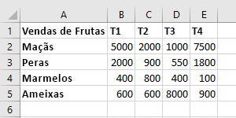
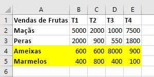
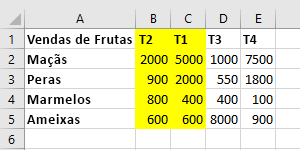

# <a name="work-with-worksheets-using-the-excel-javascript-api"></a>Trabalhe com planilhas usando a API JavaScript do Excel

Este artigo fornece exemplos de código que mostram como executar tarefas comuns com planilhas usando a API JavaScript do Excel. Para obter a lista completa de propriedades e métodos aos quais os objetos `Worksheet` e `WorksheetCollection` dão suporte, confira [Objeto Worksheet (API JavaScript para Excel)](/javascript/api/excel/excel.worksheet) e [Objeto WorksheetCollection (API JavaScript para Excel)](/javascript/api/excel/excel.worksheetcollection).

> [!NOTE]
> As informações deste artigo se aplicam apenas a planilhas regulares; elas não se aplicam às folhas "gráfico" ou "macro".

## <a name="get-worksheets"></a>Obter planilhas

O exemplo de código a seguir obtém a coleção de planilhas, carrega a propriedade `name` de cada planilha e grava uma mensagem no console.

```js
Excel.run(function (context) {
    var sheets = context.workbook.worksheets;
    sheets.load("items/name");

    return context.sync()
        .then(function () {
            if (sheets.items.length > 1) {
                console.log(`There are ${sheets.items.length} worksheets in the workbook:`);
            } else {
                console.log(`There is one worksheet in the workbook:`);
            }
            for (var i in sheets.items) {
                console.log(sheets.items[i].name);
            }
        });
}).catch(errorHandlerFunction);
```

> [!NOTE]
> A propriedade `id` de uma planilha identifica exclusivamente a planilha em uma determinada pasta de trabalho e seu valor permanecerá igual, mesmo quando a planilha for renomeada ou movida. Quando uma planilha é excluída de uma pasta de trabalho no Excel para Mac, a `id` da planilha excluída pode ser reatribuída a uma nova planilha que é subsequentemente criada.

## <a name="get-the-active-worksheet"></a>Obter a planilha ativa

O exemplo de código a seguir obtém a planilha ativa, carrega sua propriedade `name` e grava uma mensagem no console.

```js
Excel.run(function (context) {
    var sheet = context.workbook.worksheets.getActiveWorksheet();
    sheet.load("name");

    return context.sync()
        .then(function () {
            console.log(`The active worksheet is "${sheet.name}"`);
        });
}).catch(errorHandlerFunction);
```

## <a name="set-the-active-worksheet"></a>Definir a planilha ativa

O exemplo de código a seguir define a planilha ativa para a planilha chamada **Amostra**, carrega sua propriedade `name` e grava uma mensagem no console. Se não houver planilha com esse nome, o método `activate()` gerará um erro `ItemNotFound`.

```js
Excel.run(function (context) {
    var sheet = context.workbook.worksheets.getItem("Sample");
    sheet.activate();
    sheet.load("name");

    return context.sync()
        .then(function () {
            console.log(`The active worksheet is "${sheet.name}"`);
        });
}).catch(errorHandlerFunction);
```

## <a name="reference-worksheets-by-relative-position"></a>Planilhas de referência por posição relativa

Esses exemplos mostram como fazer referência a uma planilha por sua posição relativa.

### <a name="get-the-first-worksheet"></a>Obter a primeira planilha

O exemplo de código a seguir obtém a primeira planilha na pasta de trabalho, carrega sua propriedade `name` e grava uma mensagem no console.

```js
Excel.run(function (context) {
    var firstSheet = context.workbook.worksheets.getFirst();
    firstSheet.load("name");

    return context.sync()
        .then(function () {
            console.log(`The name of the first worksheet is "${firstSheet.name}"`);
        });
}).catch(errorHandlerFunction);
```

### <a name="get-the-last-worksheet"></a>Obter a última planilha

O exemplo de código a seguir obtém a última planilha na pasta de trabalho, carrega sua propriedade `name` e grava uma mensagem no console.

```js
Excel.run(function (context) {
    var lastSheet = context.workbook.worksheets.getLast();
    lastSheet.load("name");

    return context.sync()
        .then(function () {
            console.log(`The name of the last worksheet is "${lastSheet.name}"`);
        });
}).catch(errorHandlerFunction);
```

### <a name="get-the-next-worksheet"></a>Obter a próxima planilha

O exemplo de código a seguir obtém a planilha que vem depois da planilha ativa na pasta de trabalho, carrega sua propriedade `name` e grava uma mensagem no console. Se não houver planilha após a planilha ativa, o método `getNext()` gerará um erro `ItemNotFound`.

```js
 Excel.run(function (context) {
    var currentSheet = context.workbook.worksheets.getActiveWorksheet();
    var nextSheet = currentSheet.getNext();
    nextSheet.load("name");

    return context.sync()
        .then(function () {
            console.log(`The name of the sheet that follows the active worksheet is "${nextSheet.name}"`);
        });
}).catch(errorHandlerFunction);
```

### <a name="get-the-previous-worksheet"></a>Obter a planilha anterior

O exemplo de código a seguir obtém a planilha que precede a planilha ativa na pasta de trabalho, carrega sua propriedade `name` e grava uma mensagem no console. Se não houver planilha antes da planilha ativa, o método `getPrevious()` gerará um erro `ItemNotFound`.

```js
Excel.run(function (context) {
    var currentSheet = context.workbook.worksheets.getActiveWorksheet();
    var previousSheet = currentSheet.getPrevious();
    previousSheet.load("name");

    return context.sync()
        .then(function () {
            console.log(`The name of the sheet that precedes the active worksheet is "${previousSheet.name}"`);
        });
}).catch(errorHandlerFunction);
```

## <a name="add-a-worksheet"></a>Adicionar uma planilha

O exemplo de código a seguir adiciona uma nova planilha chamada **Amostra** à pasta de trabalho, carrega suas propriedades `name` e `position` e grava uma mensagem no console. A nova planilha é adicionada após todas as planilhas existentes.

```js
Excel.run(function (context) {
    var sheets = context.workbook.worksheets;

    var sheet = sheets.add("Sample");
    sheet.load("name, position");

    return context.sync()
        .then(function () {
            console.log(`Added worksheet named "${sheet.name}" in position ${sheet.position}`);
        });
}).catch(errorHandlerFunction);
```

### <a name="copy-an-existing-worksheet"></a>Copiar uma planilha existente

`Worksheet.copy` adiciona uma nova planilha que é uma cópia de uma planilha existente. O nome da nova planilha terá um número anexado ao final, consistente com a cópia de uma planilha feita pela Interface do Usuário do Excel (por exemplo, **MySheet (2) **). `Worksheet.copy` pode-se usar dois parâmetros, ambos opcionais:

- `positionType` -Um [WorksheetPositionType](/javascript/api/excel/excel.worksheetpositiontype) enum especificando o local da pasta de trabalho em que a nova planilha deve ser adicionada.
- `relativeTo` -Se o `positionType` for `Before` ou `After`, você precisa especificar uma planilha relativa à qual a nova planilha deve ser adicionada (esse parâmetro responde a pergunta "antes ou depois?").

O exemplo de código a seguir copia a planilha atual e insere a nova planilha logo após a planilha atual.

```js
Excel.run(function (context) {
    var myWorkbook = context.workbook;
    var sampleSheet = myWorkbook.worksheets.getActiveWorksheet();
    var copiedSheet = sampleSheet.copy(Excel.WorksheetPositionType.after, sampleSheet);
    return context.sync();
});
```

## <a name="delete-a-worksheet"></a>Excluir uma planilha

O exemplo de código a seguir exclui a planilha final na pasta de trabalho (desde que ela não seja a única folha na pasta de trabalho) e grava uma mensagem no console.

```js
Excel.run(function (context) {
    var sheets = context.workbook.worksheets;
    sheets.load("items/name");

    return context.sync()
        .then(function () {
            if (sheets.items.length === 1) {
                console.log("Unable to delete the only worksheet in the workbook");
            } else {
                var lastSheet = sheets.items[sheets.items.length - 1];

                console.log(`Deleting worksheet named "${lastSheet.name}"`);
                lastSheet.delete();

                return context.sync();
            };
        });
}).catch(errorHandlerFunction);
```

> [!NOTE]
> Uma planilha com visibilidade de "[Muito oculta](/javascript/api/excel/excel.sheetvisibility)" não pode ser excluída com o método `delete`. Se você quiser excluir a planilha de qualquer forma, deverá primeiro alterar a visibilidade.

## <a name="rename-a-worksheet"></a>Renomear uma planilha

O exemplo de código a seguir altera o nome da planilha ativa para **Novo Nome**.

```js
Excel.run(function (context) {
    var currentSheet = context.workbook.worksheets.getActiveWorksheet();
    currentSheet.name = "New Name";

    return context.sync();
}).catch(errorHandlerFunction);
```

## <a name="move-a-worksheet"></a>Mover uma planilha

O exemplo de código a seguir move uma planilha da última posição para a primeira posição na pasta de trabalho.

```js
Excel.run(function (context) {
    var sheets = context.workbook.worksheets;
    sheets.load("items");

    return context.sync()
        .then(function () {
            var lastSheet = sheets.items[sheets.items.length - 1];
            lastSheet.position = 0;

            return context.sync();
        });
}).catch(errorHandlerFunction);
```

## <a name="set-worksheet-visibility"></a>Definir visibilidade da planilha

Esses exemplos mostram como definir a visibilidade de uma planilha.

### <a name="hide-a-worksheet"></a>Ocultar uma planilha

O exemplo de código a seguir define a visibilidade da planilha chamada **Amostra** para oculta, carrega sua propriedade `name` e grava uma mensagem no console.

```js
Excel.run(function (context) {
    var sheet = context.workbook.worksheets.getItem("Sample");
    sheet.visibility = Excel.SheetVisibility.hidden;
    sheet.load("name");

    return context.sync()
        .then(function () {
            console.log(`Worksheet with name "${sheet.name}" is hidden`);
        });
}).catch(errorHandlerFunction);
```

### <a name="unhide-a-worksheet"></a>Reexibir uma planilha

O exemplo de código a seguir define a visibilidade da planilha chamada **Amostra** para visível, carrega sua propriedade `name` e grava uma mensagem no console.

```js
Excel.run(function (context) {
    var sheet = context.workbook.worksheets.getItem("Sample");
    sheet.visibility = Excel.SheetVisibility.visible;
    sheet.load("name");

    return context.sync()
        .then(function () {
            console.log(`Worksheet with name "${sheet.name}" is visible`);
        });
}).catch(errorHandlerFunction);
```

## <a name="get-a-single-cell-within-a-worksheet"></a>Obter uma única célula em uma planilha

O exemplo de código a seguir obtém a célula que está localizada na linha 2, coluna 5 da planilha chamada **Amostra**, carrega suas propriedades `address` e `values` e grava uma mensagem no console. Os valores que são passados no método `getCell(row: number, column:number)` são número de linha e número de coluna indexados por zero para a célula que está sendo recuperada.

```js
Excel.run(function (context) {
    var sheet = context.workbook.worksheets.getItem("Sample");
    var cell = sheet.getCell(1, 4);
    cell.load("address, values");

    return context.sync()
        .then(function() {
            console.log(`The value of the cell in row 2, column 5 is "${cell.values[0][0]}" and the address of that cell is "${cell.address}"`);
        })
}).catch(errorHandlerFunction);
```

## <a name="detect-data-changes"></a>Detectar as alterações dos dados

O suplemento precisará reagir aos usuários alterando os dados em uma planilha. Para detectar essas alterações, basta [Registrar um manipulador de eventos.](excel-add-ins-events.md#register-an-event-handler) para o `onChanged` evento da planilha. Manipuladores de eventos para o `onChanged` evento recebem um objeto [WorksheetChangedEventArgs](/javascript/api/excel/excel.worksheetchangedeventargs) quando o evento é acionado.

O `WorksheetChangedEventArgs` objeto fornece informações sobre as alterações e a fonte. Como `onChanged` o acionamento ocorre quando o formato ou o valor dos dados mudam, pode ser útil checar com o suplemento se os valores realmente foram alterados. A `details` propriedade encapsula estas informações como um [ChangedEventDetail](/javascript/api/excel/excel.changedeventdetail). O exemplo a seguir mostra como exibir o antes e depois dos valores e tipos de uma célula que foi alterada.

```js
// This function would be used as an event handler for the Worksheet.onChanged event.
function onWorksheetChanged(eventArgs) {
    Excel.run(function (context) {
        var details = eventArgs.details;
        var address = eventArgs.address;

        // Print the before and after types and values to the console.
        console.log(`Change at ${address}: was ${details.valueBefore}(${details.valueTypeBefore}),`
            + ` now is ${details.valueAfter}(${details.valueTypeAfter})`);
        return context.sync();
    });
}
```

## <a name="handle-sorting-events"></a>Manipulação de eventos de classificação

Os eventos `onColumnSorted` e `onRowSorted` indicam quando quaisquer dados de planilha são classificados. Esses eventos estão conectados a objetos `Worksheet` individuais e à `WorkbookCollection` da pasta de trabalho. Eles são acionados independentemente da classificação ser realizada de forma programática ou manualmente por meio da interface de usuário do Excel.

> [!NOTE]
> `onColumnSorted` aciona quando as colunas são classificadas como resultado de uma operação de classificação da esquerda para a direita. `onRowSorted` aciona quando as linhas são classificadas como resultado de uma operação de classificação de cima para baixo. Classificar uma tabela usando o menu suspenso em um cabeçalho da coluna resulta em um evento `onRowSorted`. O evento corresponde ao que está movendo, não ao que está sendo considerado como os critérios de classificação.

Os eventos `onColumnSorted` e `onRowSorted` fornecem seus retornos de chamadas com [WorksheetColumnSortedEventArgs](/javascript/api/excel/excel.worksheetcolumnsortedeventargs) ou [WorksheetRowSortedEventArgs](/javascript/api/excel/excel.worksheetrowsortedeventargs), respectivamente. Isso fornece mais detalhes sobre o evento. Em particular, ambos `EventArgs` têm uma propriedade `address` que representa as linhas ou as colunas movidas como resultado da operação de classificação. Qualquer célula com o conteúdo classificado será incluída, mesmo que o valor da célula não seja parte do critério de classificação.

As imagens a seguir mostram os intervalos retornados pela propriedade `address` para eventos de classificação. Primeiro, aqui estão os dados de exemplo antes da classificação:



Se uma classificação de cima para baixo for realizada no "**Q1**" (os valores em "**B**"), as seguintes linhas realçadas serão retornadas por `WorksheetRowSortedEventArgs.address`:



Se uma classificação da esquerda para a direita for executada em "**Quinces**" (os valores em "**4**") nos dados originais, as seguintes colunas realçadas serão retornadas por `WorksheetColumnsSortedEventArgs.address`:



O exemplo de código a seguir mostra como registrar um manipulador de eventos para o evento `Worksheet.onRowSorted`. O retorno de chamada do manipulador limpa a cor de preenchimento do intervalo, e depois preenche as células das linhas movidas.

```js
Excel.run(function (context) {
    var sheet = context.workbook.worksheets.getActiveWorksheet();

    // This will fire whenever a row has been moved as the result of a sort action.
    sheet.onRowSorted.add(function (event) {
        return Excel.run(function (context) {
            console.log("Row sorted: " + event.address);
            var sheet = context.workbook.worksheets.getActiveWorksheet();

            // Clear formatting for section, then highlight the sorted area.
            sheet.getRange("A1:E5").format.fill.clear();
            if (event.address !== "") {
                sheet.getRanges(event.address).format.fill.color = "yellow";
            }

            return context.sync();
        });
    });

    return context.sync();
}).catch(errorHandlerFunction);
```

## <a name="find-all-cells-with-matching-text"></a>Localizar todas as células com texto correspondente

O objeto `Worksheet` tem o método `find` para pesquisar uma cadeia especificada dentro da planilha. Ele retorna um objeto `RangeAreas`, que é um conjunto de objetos `Range` que podem ser editados ao mesmo tempo. O exemplo de código a seguir localiza todas as células com valores iguais à cadeia de caracteres **Concluída** e os marca de verde. Observe que `findAll` exibirá um erro `ItemNotFound` se a cadeia especificada não existir na planilha. Se você acha que a cadeia especificada pode não estar na planilha, use o método [findAllOrNullObject](excel-add-ins-advanced-concepts.md#ornullobject-methods) para que seu código manipule normalmente esse cenário.

```js
Excel.run(function (context) {
    var sheet = context.workbook.worksheets.getItem("Sample");
    var foundRanges = sheet.findAll("Complete", {
        completeMatch: true, // findAll will match the whole cell value
        matchCase: false // findAll will not match case
    });

    return context.sync()
        .then(function() {
            foundRanges.format.fill.color = "green"
    });
}).catch(errorHandlerFunction);
```

> [!NOTE]
> Esta seção descreve como localizar as células e intervalos usando as funções do objeto `Worksheet`. Encontre mais informações de recuperação de intervalo nos artigos específicos do objeto.
> - Confira os exemplos que mostram como obter um intervalo em uma planilha usando o objeto `Range` em [Trabalhar com intervalos usando a API JavaScript do Excel](excel-add-ins-ranges.md).
> - Para obter exemplos que mostram como obter intervalos de um objeto `Table`, confira [Trabalhar com tabelas usando a API JavaScript do Excel](excel-add-ins-tables.md).
> - Para obter exemplos que mostram como pesquisar um grande intervalo para vários subgrupos com base nas características da célula, confira [Trabalhar simultaneamente com vários intervalos em suplementos do Excel](excel-add-ins-multiple-ranges.md).

## <a name="filter-data"></a>Filtrar dados

Um [AutoFiltro](/javascript/api/excel/excel.autofilter) aplica filtros de data em um intervalo dentro da planilha. Isso é criado com `Worksheet.autoFilter.apply`, que possui os seguintes parâmetros:

- `range`: O intervalo para o qual o filtro é aplicado, especificado como um `Range` objeto ou uma cadeia de caracteres.
- `columnIndex`: O índice da coluna com base em zero contra os quais o critério de filtro é avaliado.
- `criteria`: Um [FilterCriteria](/javascript/api/excel/excel.filtercriteria) objeto determinando quais linhas devem ser filtradas com base na célula da coluna.

O exemplo do primeiro código mostra como adicionar um filtro de intervalo usado na planilha. Esse filtro ocultará as entradas que não estiverem superior a 25%, com base nos valores na coluna **3**.

```js
Excel.run(function (context) {
    var sheet = context.workbook.worksheets.getActiveWorksheet();
    var farmData = sheet.getUsedRange();

    // This filter will only show the rows with the top 25% of values in column 3.
    sheet.autoFilter.apply(farmData, 3, { criterion1: "25", filterOn: Excel.FilterOn.topPercent });
    return context.sync();
}).catch(errorHandlerFunction);
```

O exemplo do código seguinte mostra como atualizar o filtro automático usando o método `reapply`. Isso deve ser feito quando os dados no intervalo forem alterados.

```js
Excel.run(function (context) {
    var sheet = context.workbook.worksheets.getActiveWorksheet();
    sheet.autoFilter.reapply();
    return context.sync();
}).catch(errorHandlerFunction);
```

O exemplo de código final de filtro automático mostra como remover o filtro automático de planilha com o método `remove`.

```js
Excel.run(function (context) {
    var sheet = context.workbook.worksheets.getActiveWorksheet();
    sheet.autoFilter.remove();
    return context.sync();
}).catch(errorHandlerFunction);
```

Um `AutoFilter` também pode ser aplicado em tabelas individuais. Consulte [Trabalhar com tabelas usando o API JavaScript do Excel](excel-add-ins-tables.md#autofilter) para mais informações.

## <a name="data-protection"></a>Proteção de dados

O suplemento pode controlar a capacidade de um usuário de editar dados em uma planilha. A propriedade `protection` da planilha é um objeto [WorksheetProtection](/javascript/api/excel/excel.worksheetprotection) com um método `protect()`. O exemplo a seguir mostra um cenário básico ativando/desativando a proteção completa da planilha ativa.

```js
Excel.run(function (context) {
    var activeSheet = context.workbook.worksheets.getActiveWorksheet();
    activeSheet.load("protection/protected");

    return context.sync().then(function() {
        if (!activeSheet.protection.protected) {
            activeSheet.protection.protect();
        }
    })
}).catch(errorHandlerFunction);
```

O método `protect` tem dois parâmetros opcionais:

- `options`: Um objeto [WorksheetProtectionOptions](/javascript/api/excel/excel.worksheetprotectionoptions) definindo restrições de edição de específicas.
- `password`: Uma cadeia de caracteres que representa a senha necessária para um usuário ignorar a proteção e editar a planilha.

O artigo [Proteger uma planilha](https://support.office.com/article/protect-a-worksheet-3179efdb-1285-4d49-a9c3-f4ca36276de6) tem mais informações sobre a proteção de planilhas e sobre como alterar na interface do usuário do Excel.

## <a name="page-layout-and-print-settings"></a>Configurações de impressão e layout da página

Os suplementos tem acesso às configurações de layout de página em um nível de planilha. Estes controlam como a planilha é impressa. Um `Worksheet` objeto tem três propriedades de layout relacionadas: `horizontalPageBreaks`, `verticalPageBreaks`, `pageLayout`.

`Worksheet.horizontalPageBreaks` e `Worksheet.verticalPageBreaks` são [PageBreakCollections](/javascript/api/excel/excel.pagebreakcollection). Estes são conjuntos [Quebras de página](/javascript/api/excel/excel.pagebreak), que especificam os intervalos em que as quebras de página manuais são inseridas. O exemplo de código a seguir adiciona uma quebra de página horizontal acima da linha **21**.

```js
Excel.run(function (context) {
    var sheet = context.workbook.worksheets.getActiveWorksheet();
    sheet.horizontalPageBreaks.add("A21:E21"); // The page break is added above this range.
    return context.sync();
}).catch(errorHandlerFunction);
```

`Worksheet.pageLayout` é um objeto [PageLayout](/javascript/api/excel/excel.pagelayout). Esse objeto contém as configurações de layout e impressão que não são dependentes da implementação de qualquer impressora específica. Essas configurações incluem margens, orientação, numeração de página, linhas de título e a área de impressão.

O exemplo de código a seguir centraliza a página (tanto verticalmente quanto horizontalmente), define uma linha de título que será impressa na parte superior de cada página e define a área impressa para a subseção da planilha.

```js
Excel.run(function (context) {
    var sheet = context.workbook.worksheets.getActiveWorksheet();

    // Center the page in both directions.
    sheet.pageLayout.centerHorizontally = true;
    sheet.pageLayout.centerVertically = true;

    // Set the first row as the title row for every page.
    sheet.pageLayout.setPrintTitleRows("$1:$1");

    // Limit the area to be printed to the range "A1:D100".
    sheet.pageLayout.setPrintArea("A1:D100");

    return context.sync();
}).catch(errorHandlerFunction);
```

## <a name="see-also"></a>Confira também

- [Conceitos fundamentais de programação com a API JavaScript do Excel](excel-add-ins-core-concepts.md)
