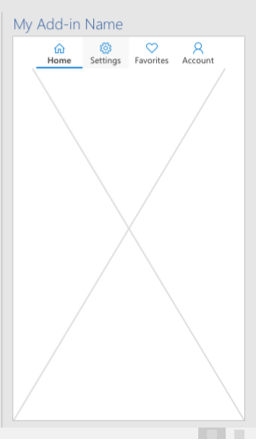

# <a name="show-or-hide-an-office-add-in-in-a-shared-runtime"></a>Mostrar ou ocultar um suplemento do Office em um tempo de execução compartilhado

Um suplemento do Office pode incluir qualquer uma das seguintes partes:

- Um painel de tarefas
- Um arquivo de função sem IU (funções personalizadas que não usam um painel de tarefas ou outros elementos da interface do usuário)
- Uma função personalizada do Excel

Por padrão, cada parte é executada em seu próprio tempo de execução de JavaScript separado, com seu próprio objeto global e variáveis globais.

É possível para suplementos com duas ou mais partes para compartilhar um tempo de execução JavaScript comum. Esse recurso de tempo de execução compartilhado habilita novas APIs que ocultam e reabrem o painel de tarefas enquanto o suplemento é executado.

## <a name="configure-an-add-in-to-use-a-shared-runtime"></a>Configurar um suplemento para usar um tempo de execução compartilhado

Para configurar o suplemento para usar um tempo de execução compartilhado, confira [Configurar o suplemento do Office para usar um tempo de execução compartilhado](configure-your-add-in-to-use-a-shared-runtime.md).

## <a name="show-and-hide-the-task-pane"></a>Mostrar e ocultar o painel de tarefas

As novas APIs estão na `Office.addin` propriedade. Para mostrar o painel de tarefas, seu código chama `Office.addin.showAsTaskpane()` . O Office será exibido em um painel de tarefas a página que você atribuiu à ID de recurso ( `resid` ) para o painel de tarefas. Este é o `resid` que você atribuiu ao `<SourceLocation>` do `<Action xsi:type="ShowTaskpane">` manifesto. (Confira [Configurar o suplemento do Office para usar um tempo de execução compartilhado](configure-your-add-in-to-use-a-shared-runtime.md).)

Este é um método assíncrono, portanto, seu código deve aguardar quando o código subsequente não deve ser executado até que seja concluído. Aguarde essa conclusão com a `await` palavra-chave ou um `then()` método, dependendo da sintaxe JavaScript que você está usando. O seguinte pressupõe que haja uma planilha do Excel chamada **CurrentQuarterSales**. O suplemento deve tornar o painel de tarefas visível sempre que esta planilha for ativada. O método `onCurrentQuarter` é um manipulador para o evento [Office. Worksheet. OnActivated](/javascript/api/excel/excel.worksheet?view=excel-js-preview&preserve-view=true#onactivated) que foi registrado para a planilha.

```javascript
function onCurrentQuarter() {
    Office.addin.showAsTaskpane()
    .then(function() {
        // Code that enables task pane UI elements for
        // working with the current quarter.
    });
}
```

Para ocultar o painel de tarefas, seu código chama `Office.addin.hide()` . O exemplo a seguir é um manipulador registrado para o evento [Office. Worksheet. OnActivated](/javascript/api/excel/excel.worksheet?view=excel-js-preview&preserve-view=true#ondeactivated) .

```javascript
function onCurrentQuarterDeactivated() {
    Office.addin.hide();
}
```

### <a name="preservation-of-state-and-event-listeners"></a>Preservação de estado e ouvintes de eventos

Os `hide()` `showAsTaskpane()` métodos e só alteram a *visibilidade* do painel de tarefas. Eles não descarrega ou recarregam (ou reinicializam seu estado).

Considere o seguinte cenário: um painel de tarefas é projetado com guias. A guia **página inicial** é aberta quando o suplemento é iniciado pela primeira vez. Suponha que um usuário abra a guia **configurações** e, posteriormente, o código no painel de tarefas é chamado `hide()` em resposta a algum evento. Ainda mais tarde as chamadas `showAsTaskpane()` de código em resposta a outro evento. O painel de tarefas será exibido novamente, e a guia **configurações** ainda estará selecionada.



Além disso, todos os ouvintes de eventos registrados no painel de tarefas continuam a ser executados, mesmo quando o painel de tarefas está oculto.

Considere o seguinte cenário: o painel de tarefas tem um manipulador registrado para o Excel `Worksheet.onActivated` e `Worksheet.onDeactivated` eventos para uma planilha chamada **Planilha1**. O manipulador ativado faz com que um ponto verde apareça no painel de tarefas. O manipulador desativado transforma o ponto vermelho (que é seu estado padrão). Suponha que o código chame `hide()` quando **Sheet1** não está ativado e o ponto é vermelho. Enquanto o painel de tarefas está oculto, **Sheet1** é ativada. Chamadas de código posteriores `showAsTaskpane()` em resposta a algum evento. Quando o painel de tarefas é aberto, o ponto é verde porque os ouvintes e manipuladores de eventos foram executados, mesmo que o painel de tarefas tenha sido ocultado.

### <a name="handle-visibility-changed-event"></a>Evento alterado de visibilidade de manipulação

Quando o código altera a visibilidade do painel de tarefas com `showAsTaskpane()` ou `hide()` , o Office aciona o `VisibilityModeChanged` evento. Pode ser útil para lidar com esse evento. Por exemplo, suponha que o painel de tarefas exiba uma lista de todas as planilhas em uma pasta de trabalho. Se uma nova planilha for adicionada enquanto o painel de tarefas estiver oculto, tornar o painel de tarefas visível não, sozinho, adicionará o novo nome da planilha à lista. Mas seu código pode responder ao `VisibilityModeChanged` evento para recarregar a propriedade [Worksheet.Name](/javascript/api/excel/excel.worksheet#name) de todas as planilhas na coleção [Workbook. Worksheets](/javascript/api/excel/excel.workbook#worksheets) , conforme mostrado no exemplo de código abaixo.

Para registrar um manipulador para o evento, você não usa um método "Add Handler" como faria na maioria dos contextos JavaScript do Office. Em vez disso, há uma função especial para a qual você passa seu manipulador: [Office. AddIn. onVisibilityModeChanged](/javascript/api/office/office.addin#onvisibilitymodechanged-listener-). Apresentamos um exemplo a seguir. Observe que a `args.visibilityMode` propriedade é do tipo [VisibilityMode](/javascript/api/office/office.visibilitymode).

```javascript
Office.addin.onVisibilityModeChanged(function(args) {
    if (args.visibilityMode = "Taskpane"); {
        // Code that runs whenever the task pane is made visible.
        // For example, an Excel.run() that loads the names of
        // all worksheets and passes them to the task pane UI.
    }
});
```

A função retorna outra função que *cancela o registro* do manipulador. Veja um exemplo simples, mas não robusto:

```javascript
var removeVisibilityModeHandler =
    Office.addin.onVisibilityModeChanged(function(args) {
        if (args.visibilityMode = "Taskpane"); {
            // Code that runs whenever the task pane is made visible.
        }
    });


// In some later code path, deregister with:
removeVisibilityModeHandler();
```

O `onVisibilityModeChanged` método é assíncrono, o que significa que, se seu código chama o manipulador de *cancelamento de registro* que `onVisibilityModeChanged` retorna, você deve garantir que `onVisibilityModeChanged` tenha sido concluída antes de chamar o manipulador de cancelamento de registro. Uma maneira de fazer isso é usar a `await` palavra-chave no método Call como no exemplo a seguir.

```javascript
var removeVisibilityModeHandler =
    await Office.addin.onVisibilityModeChanged(function(args) {
        if (args.visibilityMode = "Taskpane"); {
            // Code that runs whenever the task pane is made visible.
        }
    });
```

Se você quiser usar apenas JavaScript ES2015, seu código poderá usar o `then` método para aguardar até que o objeto Promise retornado tenha sido resolvido e atribuir a função retornada a uma variável global, como no exemplo a seguir.

```javascript
var removeVisibilityModeHandler;

Office.addin.onVisibilityModeChanged(function(args) {
        if (args.visibilityMode = "Taskpane"); {
            // Code that runs whenever the task pane is made visible.
        }
}).then(function(removeHandler) {
        removeVisibilityModeHandler = removeHandler;
    });

// In some later code path, deregister with:
removeVisibilityModeHandler();
```

A função cancelamento de registro é assíncrona. Portanto, se você tiver um código que não deve ser executado até que o cancelamento de registro seja concluído, a função de cancelamento também deverá ser esperada com a `await` palavra-chave ou com um `then` método como nos exemplos a seguir.

Para cancelar o registro do manipulador:

```javascript
await removeVisibilityModeHandler();
// subsequent code here

// or use pre-ES2015 syntax:
removeVisibilityModeHandler().then(function () {
        // subsequent code here
    })
```
