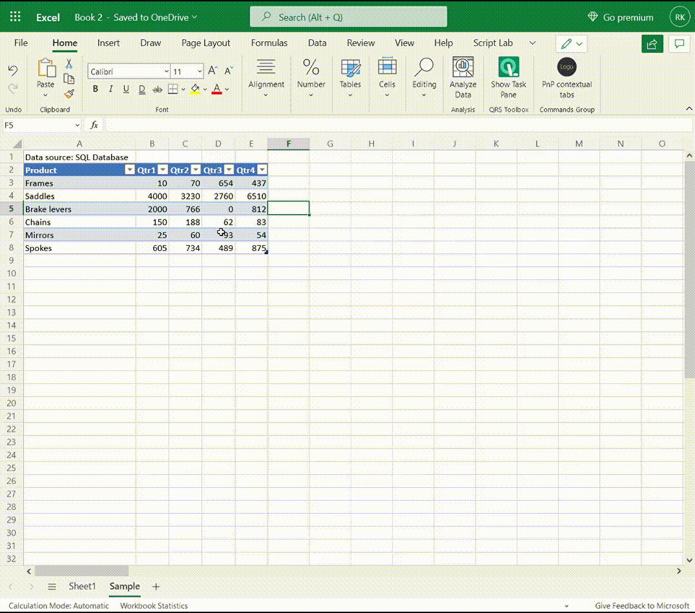

A animação a seguir mostra como os eventos podem alternar a visibilidade das guias contextuais e alterar o status habilitado dos botões.

1. No início, o foco não está na tabela.
1. Uma célula de tabela é clicada e a guia contextual personalizada **Dados** de tabela aparece na faixa de opções (além da guia contextual interno Design **de Tabela**).
1. A seleção **da guia Dados da** Tabela a abre. Dois dos botões na guia estão desabilitados.
1. Alterar dados em uma célula habilita os dois botões.
1. Clicar em um dos botões desabilita os dois botões novamente.
1. Clicar em uma célula fora da tabela remove o foco da tabela e as duas guias contextuais são removidas da faixa de opções.

