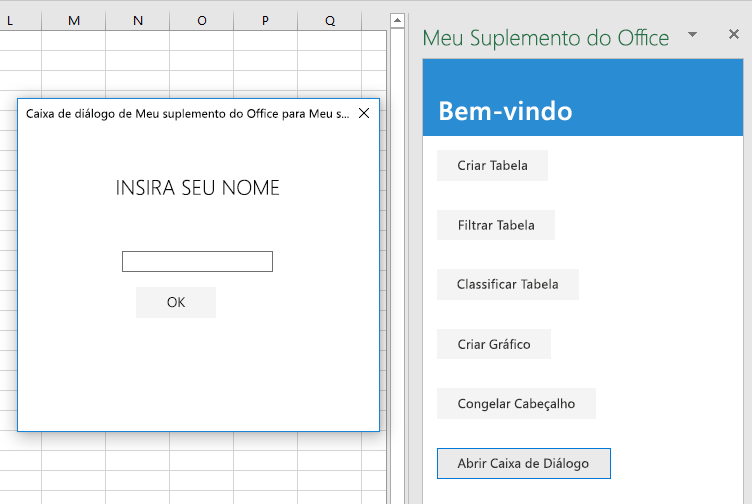

<span data-ttu-id="c9a8b-101">Nesta etapa final do tutorial, voc? abre uma caixa de di?logo no suplemento, passa uma mensagem do processo de caixa de di?logo para o processo de painel de tarefas e fecha a caixa de di?logo.</span><span class="sxs-lookup"><span data-stu-id="c9a8b-101">In this final step of the tutorial, you'll open a dialog in your add-in, pass a message from the dialog process to the task pane process, and close the dialog.</span></span> <span data-ttu-id="c9a8b-102">As caixas de di?logo do Suplemento do Office s?o *n?o modais*: o usu?rio pode continuar a interagir com o documento no aplicativo do Office do host e com a p?gina host no painel de tarefas.</span><span class="sxs-lookup"><span data-stu-id="c9a8b-102">Office Add-in dialogs are *nonmodal*: a user can continue to interact with both the document in the host Office application and with the host page in the task pane.</span></span>

> [!NOTE]
> <span data-ttu-id="c9a8b-103">Esta p?gina descreve uma etapa individual do tutorial de suplemento do Excel.</span><span class="sxs-lookup"><span data-stu-id="c9a8b-103">This page describes an individual step of the Excel add-in tutorial.</span></span> <span data-ttu-id="c9a8b-104">Se voc? chegou aqui por meio dos resultados de mecanismos de pesquisa ou via outro link direto, acesse a p?gina de Introdu??o do [tutorial de suplemento do Excel](../tutorials/excel-tutorial.yml) para come??-lo do in?cio.</span><span class="sxs-lookup"><span data-stu-id="c9a8b-104">If you?ve arrived at this page via search engine results or other direct link, please go to the [Excel add-in tutorial](../tutorials/excel-tutorial.yml) introduction page to start the tutorial from the beginning.</span></span>

## <a name="create-the-dialog-page"></a><span data-ttu-id="c9a8b-105">Crie a p?gina da caixa de di?logo</span><span class="sxs-lookup"><span data-stu-id="c9a8b-105">Create the dialog page</span></span>

1. <span data-ttu-id="c9a8b-106">Abra o projeto em seu editor de c?digo.</span><span class="sxs-lookup"><span data-stu-id="c9a8b-106">Open the project in your code editor.</span></span>
2. <span data-ttu-id="c9a8b-107">Crie um arquivo chamado popup.html na raiz do projeto (onde se encontra index.html).</span><span class="sxs-lookup"><span data-stu-id="c9a8b-107">Create a file in the root of the project (where index.html is) called popup.html.</span></span>
3. <span data-ttu-id="c9a8b-p103">Adicione a marca??o a seguir em popup.html. Observa??o:</span><span class="sxs-lookup"><span data-stu-id="c9a8b-p103">Add the following markup to popup.html. Note:</span></span>
   - <span data-ttu-id="c9a8b-110">A p?gina tem um `<input>` onde o usu?rio insere seu nome e um bot?o que enviar? o nome para a p?gina no painel de tarefas onde ele ser? exibido.</span><span class="sxs-lookup"><span data-stu-id="c9a8b-110">The page has a `<input>` where the user will enter his or her name and a button that will send the name to the page in the task pane where it will be displayed.</span></span>
   - <span data-ttu-id="c9a8b-111">A marca??o carrega um script chamado popup.js que voc? criar? em uma etapa posterior.</span><span class="sxs-lookup"><span data-stu-id="c9a8b-111">The markup loads a script called popup.js that you will create in a later step.</span></span>
   - <span data-ttu-id="c9a8b-112">Ela tamb?m carrega uma biblioteca Office.JS e jQuery porque elas ser?o usadas em popup.js.</span><span class="sxs-lookup"><span data-stu-id="c9a8b-112">It also loads the Office.JS library and jQuery because they will be used in popup.js.</span></span>

    ```html
    <!DOCTYPE html>
    <html>
        <head lang="en">
            <title>Dialog for My Office Add-in</title>
            <meta charset="UTF-8">
            <meta name="viewport" content="width=device-width, initial-scale=1">
        
            <link rel="stylesheet" href="node_modules/office-ui-fabric-js/dist/css/fabric.min.css" />
            <link rel="stylesheet" href="node_modules/office-ui-fabric-js/dist/css/fabric.components.css" />
            <link rel="stylesheet" href="app.css">
    
            <script type="text/javascript" src="https://appsforoffice.microsoft.com/lib/1.1/hosted/office.js"></script>
            <script type="text/javascript" src="https://ajax.aspnetcdn.com/ajax/jQuery/jquery-2.2.1.min.js"></script>
            <script type="text/javascript" src="popup.js"></script>
    
        </head>
         <body style="display:flex;flex-direction:column;align-items:center;justify-content:center">
         <div class="padding">
            <p class="ms-font-xl">ENTER YOUR NAME</p>
         </div>        
        <div class="padding">
            <input id="name-box" type="text"/>
        <div>
        <div class="padding">
            <button id="ok-button" class="ms-Button">OK</button>
        </div>
    </body>
    </html>
    ```

4. <span data-ttu-id="c9a8b-113">Crie um arquivo chamado popup.js na raiz do projeto.</span><span class="sxs-lookup"><span data-stu-id="c9a8b-113">Create a file in the root of the project called popup.js.</span></span>
5. <span data-ttu-id="c9a8b-p104">Adicione o c?digo a seguir ao popup.js. Observa??o:</span><span class="sxs-lookup"><span data-stu-id="c9a8b-p104">Add the following code to popup.js. Note:</span></span>
   - <span data-ttu-id="c9a8b-116">*Todas as p?ginas que chamam APIs na biblioteca Office.JS devem atribuir uma fun??o ? propriedade `Office.initialize`.*</span><span class="sxs-lookup"><span data-stu-id="c9a8b-116">*Every page that calls APIs in the Office.JS library must assign a function to the `Office.initialize` property.*</span></span> <span data-ttu-id="c9a8b-117">Se nenhuma inicializa??o for necess?ria, a fun??o poder? ter um corpo vazio, mas a propriedade n?o deve ser deixada indefinida, atribu?da a nulo ou a um valor que n?o seja uma fun??o.</span><span class="sxs-lookup"><span data-stu-id="c9a8b-117">If no initialization is needed, then the function can have an empty body, but the property must not be left undefined, assigned to null or to a non-function value.</span></span> <span data-ttu-id="c9a8b-118">Por exemplo, veja o arquivo app.js na raiz do projeto.</span><span class="sxs-lookup"><span data-stu-id="c9a8b-118">For an example, see the app.js file in the project root.</span></span> <span data-ttu-id="c9a8b-119">O c?digo que cria a tarefa deve ser executado antes de qualquer chamada para Office.JS; por isso, a tarefa se encontra em um arquivo de script que ? carregado pela p?gina, como neste caso.</span><span class="sxs-lookup"><span data-stu-id="c9a8b-119">The code that makes the assignment must run before any calls to Office.JS; hence the assignment is in a script file that is loaded by the page, as it is in this case.</span></span>
   - <span data-ttu-id="c9a8b-p106">A fun??o jQuery `ready` ? chamada dentro do m?todo `initialize`. ? uma regra quase universal que o c?digo de carregamento, inicializa??o ou bootstrapping de outras bibliotecas JavaScript deva estar dentro da fun??o `Office.initialize`.</span><span class="sxs-lookup"><span data-stu-id="c9a8b-p106">The jQuery `ready` function is called inside the `initialize` method. It is an almost universal rule that the loading, initializing, or bootstrapping code of other JavaScript libraries should be inside the `Office.initialize` function.</span></span>

    ```js
    (function () {
    "use strict";

        Office.initialize = function() {        
            $(document).ready(function () {  
    
                // TODO1: Assign handler to the OK button.
    
            });
        }

        // TODO2: Create the OK button handler
    
    }());    
    ```

6. <span data-ttu-id="c9a8b-122">Substitua `TODO1` pelo c?digo a seguir.</span><span class="sxs-lookup"><span data-stu-id="c9a8b-122">Replace `TODO1` with the following code.</span></span> <span data-ttu-id="c9a8b-123">Voc? criar? a fun??o `sendStringToParentPage` na pr?xima etapa.</span><span class="sxs-lookup"><span data-stu-id="c9a8b-123">You'll create the `sendStringToParentPage` function in the next step.</span></span>

    ```js
    $('#ok-button').click(sendStringToParentPage);
    ```

7. <span data-ttu-id="c9a8b-124">Substitua `TODO2` pelo c?digo a seguir.</span><span class="sxs-lookup"><span data-stu-id="c9a8b-124">Replace `TODO2` with the following code.</span></span> <span data-ttu-id="c9a8b-125">O m?todo `messageParent` passa seu par?metro para a p?gina pai, neste caso, a p?gina no painel de tarefas.</span><span class="sxs-lookup"><span data-stu-id="c9a8b-125">The `messageParent` method passes its parameter to the parent page, in this case, the page in the task pane.</span></span> <span data-ttu-id="c9a8b-126">O par?metro pode ser um booliano ou uma cadeia de caracteres, que inclui tudo o que pode ser serializado como uma cadeia de caracteres, como XML ou JSON.</span><span class="sxs-lookup"><span data-stu-id="c9a8b-126">The parameter can be a boolean or a string, which includes anything that can be serialized as a string, such as XML or JSON.</span></span> 

    ```js
    function sendStringToParentPage() {
        var userName = $('#name-box').val();
        Office.context.ui.messageParent(userName);
    }
    ```

8. <span data-ttu-id="c9a8b-127">Salve o arquivo.</span><span class="sxs-lookup"><span data-stu-id="c9a8b-127">Save the file.</span></span>

   > [!NOTE]
   > <span data-ttu-id="c9a8b-128">O arquivo popup.html e o arquivo popup.js carregado s?o executados em um processo do Internet Explorer completamente separado de painel de tarefas do suplemento.</span><span class="sxs-lookup"><span data-stu-id="c9a8b-128">The popup.html file, and the popup.js file that it loads, run in an entirely separate Internet Explorer process from the add-in's task pane.</span></span> <span data-ttu-id="c9a8b-129">Se o popup.js foi transcompilado no mesmo arquivo bundle.js que o arquivo app.js, o suplemento precisar? carregar duas c?pias do arquivo bundle.js, o que anule o prop?sito do agrupamento.</span><span class="sxs-lookup"><span data-stu-id="c9a8b-129">If the popup.js was transpiled into the same bundle.js file as the app.js file, then the add-in would have to load two copies of the bundle.js file, which defeats the purpose of bundling.</span></span> <span data-ttu-id="c9a8b-130">Al?m disso, o arquivo popup.js n?o cont?m qualquer JavaScript incompat?vel com o Internet Explorer.</span><span class="sxs-lookup"><span data-stu-id="c9a8b-130">In addition, the popup.js file does not contain any JavaScript that is unsupported by IE.</span></span> <span data-ttu-id="c9a8b-131">Por esses dois motivos, esse suplemento n?o transcompila o popup.js.</span><span class="sxs-lookup"><span data-stu-id="c9a8b-131">For these two reasons, this add-in does not transpile the popup.js file at all.</span></span> 


## <a name="open-the-dialog-from-the-task-pane"></a><span data-ttu-id="c9a8b-132">Abra a caixa de di?logo do painel de tarefas</span><span class="sxs-lookup"><span data-stu-id="c9a8b-132">Open the dialog from the task pane</span></span>

1. <span data-ttu-id="c9a8b-133">Abra o arquivo index.html.</span><span class="sxs-lookup"><span data-stu-id="c9a8b-133">Open the file index.html.</span></span>
2. <span data-ttu-id="c9a8b-134">Abaixo do `div` que cont?m o bot?o `freeze-header`, adicione a marca??o a seguir:</span><span class="sxs-lookup"><span data-stu-id="c9a8b-134">Below the `div` that contains the `freeze-header` button, add the following markup:</span></span>

    ```html
    <div class="padding">            
        <button class="ms-Button" id="open-dialog">Open Dialog</button>          
    </div>
    ```

3. <span data-ttu-id="c9a8b-135">A caixa de di?logo solicitar? que o usu?rio insira um nome e passar? o nome de usu?rio para o painel de tarefas.</span><span class="sxs-lookup"><span data-stu-id="c9a8b-135">The dialog will prompt the user to enter a name and pass the user's name to the task pane.</span></span> <span data-ttu-id="c9a8b-136">O painel de tarefas o exibir? em um r?tulo.</span><span class="sxs-lookup"><span data-stu-id="c9a8b-136">The task pane will display it in a label.</span></span> <span data-ttu-id="c9a8b-137">Imediatamente abaixo do `div` que voc? adicionou, adicione a marca??o a seguir:</span><span class="sxs-lookup"><span data-stu-id="c9a8b-137">Immediately below the `div` that you just added, add the following markup:</span></span>

    ```html
    <div class="padding">            
        <label id="user-name"></label>            
    </div>
    ```

4. <span data-ttu-id="c9a8b-138">Abra o arquivo app.js.</span><span class="sxs-lookup"><span data-stu-id="c9a8b-138">Open the app.js file.</span></span>

5. <span data-ttu-id="c9a8b-139">Abaixo da linha que atribui um identificador de clique ao bot?o `freeze-header`, adicione o seguinte c?digo.</span><span class="sxs-lookup"><span data-stu-id="c9a8b-139">Below the line that assigns a click handler to the `freeze-header` button, add the following code.</span></span> <span data-ttu-id="c9a8b-140">Voc? criar? o m?todo `openDialog` em uma etapa posterior.</span><span class="sxs-lookup"><span data-stu-id="c9a8b-140">You'll create the `openDialog` method in a later step.</span></span>

    ```js
    $('#open-dialog').click(openDialog);
    ```

6. <span data-ttu-id="c9a8b-p112">Abaixo da fun??o `freezeHeader`, adicione a declara??o seguinte. Essa vari?vel ? usada para armazenar um objeto no contexto de execu??o da p?gina pai que atua como um intermediador no contexto de execu??o da p?gina da caixa de di?logo.</span><span class="sxs-lookup"><span data-stu-id="c9a8b-p112">Below the `freezeHeader` function add the following declaration. This variable is used to hold an object in the parent page's execution context that acts as an intermediator to the dialog page's execution context.</span></span>

    ```js
    let dialog = null;
    ```

7. <span data-ttu-id="c9a8b-143">Abaixo da declara??o de `dialog`, adicione a fun??o a seguir.</span><span class="sxs-lookup"><span data-stu-id="c9a8b-143">Below the declaration of `dialog`, add the following function.</span></span> <span data-ttu-id="c9a8b-144">? importante observar o que esse c?digo *n?o* cont?m: n?o h? nenhuma chamada de `Excel.run`.</span><span class="sxs-lookup"><span data-stu-id="c9a8b-144">The important thing to notice about this code is what is *not* there: there is no call of `Excel.run`.</span></span> <span data-ttu-id="c9a8b-145">Isso ocorre porque a API para abrir uma caixa de di?logo ? compartilhada com todos os hosts do Office, portanto, ela faz parte da API de Office JavaScript Common, n?o da API espec?fica do Excel.</span><span class="sxs-lookup"><span data-stu-id="c9a8b-145">This is because the API to open a dialog is shared among all Office hosts, so it is part of the Office JavaScript Common API, not the Excel-specific API.</span></span>

    ```js
    function openDialog() {
        // TODO1: Call the Office Shared API that opens a dialog
    }
    ``` 

8. <span data-ttu-id="c9a8b-p114">Substitua `TODO1` pelo c?digo a seguir. Observa??o:</span><span class="sxs-lookup"><span data-stu-id="c9a8b-p114">Replace `TODO1` with the following code. Note:</span></span>
   - <span data-ttu-id="c9a8b-148">O m?todo`displayDialogAsync` abre uma caixa de di?logo no centro da tela.</span><span class="sxs-lookup"><span data-stu-id="c9a8b-148">The `displayDialogAsync` method opens a dialog in the center of the screen.</span></span>
   - <span data-ttu-id="c9a8b-149">O primeiro par?metro ? a URL da p?gina a ser aberta.</span><span class="sxs-lookup"><span data-stu-id="c9a8b-149">The first parameter is the URL of the page to open.</span></span>
   - <span data-ttu-id="c9a8b-p115">O segundo par?metro passa op??es. `height` e `width` s?o porcentagens do tamanho da janela do aplicativo do Office.</span><span class="sxs-lookup"><span data-stu-id="c9a8b-p115">The second parameter passes options. `height` and `width` are percentages of the size of the Office application's window.</span></span> 
   
    ```js
    Office.context.ui.displayDialogAsync(
        'https://localhost:3000/popup.html',
        {height: 45, width: 55},
        
        // TODO2: Add callback parameter.
    );
    ``` 

## <a name="process-the-message-from-the-dialog-and-close-the-dialog"></a><span data-ttu-id="c9a8b-152">Processar a mensagem da caixa de di?logo e depois fech?-la</span><span class="sxs-lookup"><span data-stu-id="c9a8b-152">Process the message from the dialog and close the dialog</span></span>

1. <span data-ttu-id="c9a8b-p116">Continue no arquivo app.js e substitua `TODO2` pelo c?digo a seguir. Observa??o:</span><span class="sxs-lookup"><span data-stu-id="c9a8b-p116">Continue in the app.js file, and replace `TODO2` with the following code. Note:</span></span>
   - <span data-ttu-id="c9a8b-155">O retorno de chamada ? executado logo ap?s a caixa de di?logo ser aberta com ?xito e antes de o usu?rio executar qualquer a??o nela.</span><span class="sxs-lookup"><span data-stu-id="c9a8b-155">The callback is executed immediately after the dialog successfully opens and before the user has taken any action in the dialog.</span></span>
   - <span data-ttu-id="c9a8b-156">O `result.value` ? o objeto que funciona como um tipo de intermedi?rio entre contextos execu??o das p?ginas de pai e de caixa de di?logo.</span><span class="sxs-lookup"><span data-stu-id="c9a8b-156">The `result.value` is the object that acts as a kind of middleman between the execution contexts of the parent and dialog pages.</span></span>
   - <span data-ttu-id="c9a8b-157">A fun??o `processMessage` ser? criada em uma etapa posterior.</span><span class="sxs-lookup"><span data-stu-id="c9a8b-157">The `processMessage` function will be created in a later step.</span></span> <span data-ttu-id="c9a8b-158">Esse identificador processar? os valores que sejam enviados da p?gina da caixa de di?logo com chamadas da fun??o `messageParent`.</span><span class="sxs-lookup"><span data-stu-id="c9a8b-158">This handler will process any values that are sent from the dialog page with calls of the `messageParent` function.</span></span>

    ```js
    function (result) {
        dialog = result.value;
        dialog.addEventHandler(Microsoft.Office.WebExtension.EventType.DialogMessageReceived, processMessage);
    }
    ```

2. <span data-ttu-id="c9a8b-159">Abaixo da fun??o `openDialog`, adicione a fun??o a seguir.</span><span class="sxs-lookup"><span data-stu-id="c9a8b-159">Below the `openDialog` function, add the following function.</span></span>

    ```js
    function processMessage(arg) {
        $('#user-name').text(arg.message);
        dialog.close();
    }
    ```

## <a name="test-the-add-in"></a><span data-ttu-id="c9a8b-160">Testar o suplemento</span><span class="sxs-lookup"><span data-stu-id="c9a8b-160">Test the add-in</span></span>

1. <span data-ttu-id="c9a8b-161">Se a janela Git bash ou o prompt de sistema habilitado para Node.JS do tutorial anterior ainda estiverem abertos, digite Ctrl + C duas vezes para interromper a execu??o do servidor Web.</span><span class="sxs-lookup"><span data-stu-id="c9a8b-161">If the Git bash window, or Node.JS-enabled system prompt, from the previous stage tutorial is still open, enter Ctrl-C twice to stop the running web server.</span></span> <span data-ttu-id="c9a8b-162">Caso contr?rio, abra uma janela Git bash ou um prompt de sistema habilitado para Node.JS e navegue at? a pasta **Iniciar** do projeto.</span><span class="sxs-lookup"><span data-stu-id="c9a8b-162">Otherwise, open a Git bash window, or Node.JS-enabled system prompt, and navigate to the **Start** folder of the project.</span></span>

     > [!NOTE]
     > <span data-ttu-id="c9a8b-163">Embora o servidor de sincroniza??o do navegador recarregue o suplemento no painel de tarefas sempre que voc? fizer uma altera??o em algum arquivo, incluindo o arquivo app.js, ele n?o transcompila o JavaScript, portanto, ? necess?rio repetir o comando de compila??o para que as altera??es em app.js as entrem em vigor.</span><span class="sxs-lookup"><span data-stu-id="c9a8b-163">Although the browser-sync server reloads your add-in in the task pane every time you make a change to any file, including the app.js file, it does not retranspile the JavaScript, so you must repeat the build command in order for your changes to app.js to take effect.</span></span> <span data-ttu-id="c9a8b-164">Para fazer isso, interrompa o processo do servidor para obter uma solicita??o para inserir o comando de compila??o.</span><span class="sxs-lookup"><span data-stu-id="c9a8b-164">In order to do this, you need to kill the server process in so that you can get a prompt to enter the build command.</span></span> <span data-ttu-id="c9a8b-165">Ap?s a compila??o, reinicie o servidor.</span><span class="sxs-lookup"><span data-stu-id="c9a8b-165">After the build, you restart the server.</span></span> <span data-ttu-id="c9a8b-166">As pr?ximas etapas executam esse processo.</span><span class="sxs-lookup"><span data-stu-id="c9a8b-166">The next few steps carry out this process.</span></span>

1. <span data-ttu-id="c9a8b-167">Execute o comando `npm run build` para transcompilar seu c?digo-fonte ES6 para uma vers?o anterior do JavaScript com suporte no Internet Explorer (que ? usada em segundo plano pelo Excel para executar os suplementos do Excel).</span><span class="sxs-lookup"><span data-stu-id="c9a8b-167">Run the command `npm run build` to transpile your ES6 source code to an earlier version of JavaScript that is supported by Internet Explorer (which is used under-the-hood by Excel to run Excel add-ins).</span></span>
2. <span data-ttu-id="c9a8b-168">Execute o comando `npm start` para iniciar um servidor Web em um host local.</span><span class="sxs-lookup"><span data-stu-id="c9a8b-168">Run the command `npm start` to start a web server running on localhost.</span></span>
4. <span data-ttu-id="c9a8b-169">Feche o painel de tarefas para recarreg?-lo e, no menu **In?cio**, selecione **Mostrar Painel de Tarefas** para reabrir o suplemento.</span><span class="sxs-lookup"><span data-stu-id="c9a8b-169">Reload the task pane by closing it, and then on the **Home** menu, select **Show Taskpane** to reopen the add-in.</span></span>
6. <span data-ttu-id="c9a8b-170">Escolha o bot?o **Abrir Caixa de Di?logo** no painel de tarefas.</span><span class="sxs-lookup"><span data-stu-id="c9a8b-170">Choose the **Open Dialog** button in the task pane.</span></span> 
7. <span data-ttu-id="c9a8b-171">Quando a caixa de di?logo estiver aberta, arraste-a e redimensione-a.</span><span class="sxs-lookup"><span data-stu-id="c9a8b-171">While the dialog is open, drag it and resize it.</span></span> <span data-ttu-id="c9a8b-172">Observe que voc? pode interagir com a planilha e pressionar outros bot?es no painel de tarefas.</span><span class="sxs-lookup"><span data-stu-id="c9a8b-172">Note that you can interact with the worksheet and press other buttons on the taskpane.</span></span> <span data-ttu-id="c9a8b-173">No entanto, n?o ? poss?vel iniciar uma segunda caixa de di?logo na mesma p?gina do painel de tarefas.</span><span class="sxs-lookup"><span data-stu-id="c9a8b-173">But you cannot launch a second dialog from the same task pane page.</span></span>
8. <span data-ttu-id="c9a8b-174">Na caixa de di?logo, digite um nome e escolha **OK**.</span><span class="sxs-lookup"><span data-stu-id="c9a8b-174">In the dialog, enter a name and choose **OK**.</span></span> <span data-ttu-id="c9a8b-175">O nome aparecer? no painel de tarefas e a caixa de di?logo ser? fechada.</span><span class="sxs-lookup"><span data-stu-id="c9a8b-175">The name appears on the task pane and the dialog closes.</span></span>
9. <span data-ttu-id="c9a8b-176">Opcionalmente, comente a linha `dialog.close();` na fun??o `processMessage`.</span><span class="sxs-lookup"><span data-stu-id="c9a8b-176">Optionally, comment out the line `dialog.close();` in the `processMessage` function.</span></span> <span data-ttu-id="c9a8b-177">Em seguida, repita as etapas desta se??o.</span><span class="sxs-lookup"><span data-stu-id="c9a8b-177">Then repeat the steps of this section.</span></span> <span data-ttu-id="c9a8b-178">A caixa de di?logo permanece aberta e voc? pode alterar o nome.</span><span class="sxs-lookup"><span data-stu-id="c9a8b-178">The dialog stays open and you can change the name.</span></span> <span data-ttu-id="c9a8b-179">? poss?vel fech?-la manualmente pressionando o bot?o **X** no canto superior direito.</span><span class="sxs-lookup"><span data-stu-id="c9a8b-179">You can close it manually by pressing the **X** button in the upper right corner.</span></span>

    

