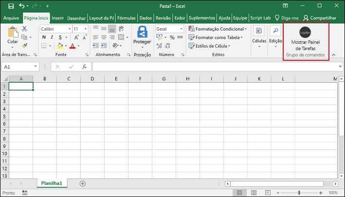
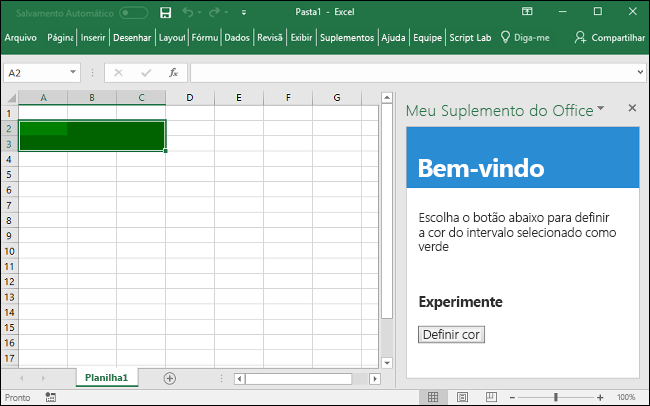

# <a name="build-an-excel-add-in-using-react"></a>Criar um suplemento do Excel usando o React

Neste artigo, você passará pelo processo de criar um suplemento do Excel usando o React e a API JavaScript do Excel.

## <a name="environment"></a>Ambiente

- **Área de Trabalho do Office**: Verifique se você tem a última versão do Office instalada. Comandos de suplemento precisam da compilação 16.0.6769.0000 ou superior (**16.0.6868.0000** recomendada). Saiba como [Instalar a última versão dos aplicativos do Office](http://aka.ms/latestoffice). 
 
- **Office Online**: Não há configuração adicional. Observe que o suporte para comandos no Office Online para contas de trabalho/escola está em versão prévia.

## <a name="prerequisites"></a>Pré-requisitos

- Instale globalmente [Criar aplicativo do React](https://github.com/facebookincubator/create-react-app).

    ```bash
    npm install -g create-react-app
    ```

- Instale a última versão do [Yeoman](https://github.com/yeoman/yo) e o [gerador do Yeoman para Suplementos do Office](https://github.com/OfficeDev/generator-office) globalmente.

    ```bash
    npm install -g yo generator-office
    ```

## <a name="generate-a-new-react-app"></a>Gerar um novo aplicativo do React

Use Criar aplicativo do React para gerar seu aplicativo do React. No terminal, execute o seguinte comando:

```bash
create-react-app my-addin
```

## <a name="generate-the-manifest-file-and-sideload-the-add-in"></a>Gerar o arquivo de manifesto e realizar sideload do suplemento

Cada suplemento requer um arquivo de manifesto para definir os recursos e configurações.

1. Navegue até a pasta do seu aplicativo.

    ```bash
    cd my-addin
    ```

2. Use o gerador do Yeoman para gerar o arquivo de manifesto para o seu suplemento. Execute o comando a seguir e responda aos prompts, conforme mostrado na seguinte captura de tela:

    ```bash
    yo office 
    ```

    - **Escolha um tipo de projeto:** `Office Add-in containing the manifest only`
    - **Como deseja nomear seu suplemento?:** `My Office Add-in`
    - **Para qual aplicativo cliente do Office você deseja suporte?:** `Excel`


    Depois de concluir o assistente, um arquivo de manifesto e um arquivo de recurso estarão disponíveis para você criar seu projeto.
    
    
    
    > [!NOTE]
    > Se for solicitada a substituição de **package.json**, responda **Não** (não substituir).

3. Siga as instruções da plataforma que você usará para executar o suplemento e realizar sideload do suplemento no Excel.

    - Windows: [Realizar sideload de Suplementos do Office no Windows](../testing/create-a-network-shared-folder-catalog-for-task-pane-and-content-add-ins.md)
    - Excel Online: [Realizar sideload dos Suplementos do Office no Office Online](../testing/sideload-office-add-ins-for-testing.md#sideload-an-office-add-in-on-office-online)
    - iPad e Mac: [Realizar sideload dos Suplementos do Office no iPad e Mac](../testing/sideload-an-office-add-in-on-ipad-and-mac.md)

## <a name="update-the-app"></a>Atualizar o aplicativo

1. Abra **public/index.html**, adicione a marca `<script>` a seguir imediatamente antes da marca `</head>` e salve o arquivo.

    ```html
    <script src="https://appsforoffice.microsoft.com/lib/1/hosted/office.js"></script>
    ```

2. Abra **src/index.js**, substitua `ReactDOM.render(<App />, document.getElementById('root'));` pelo código a seguir e salve o arquivo. 

    ```typescript
    const Office = window.Office;
    
    Office.initialize = () => {
      ReactDOM.render(<App />, document.getElementById('root'));
    };
    ```

3. Abra **src/App.js**, substitua o conteúdo do arquivo pelo código a seguir e salve o arquivo. 

    ```js
    import React, { Component } from 'react';
    import './App.css';

    class App extends Component {
      constructor(props) {
        super(props);

        this.onSetColor = this.onSetColor.bind(this);
      }

      onSetColor() {
        window.Excel.run(async (context) => {
          const range = context.workbook.getSelectedRange();
          range.format.fill.color = 'green';
          await context.sync();
        });
      }

      render() {
        return (
          <div id="content">
            <div id="content-header">
              <div className="padding">
                  <h1>Welcome</h1>
              </div>
            </div>
            <div id="content-main">
              <div className="padding">
                  <p>Choose the button below to set the color of the selected range to green.</p>
                  <br />
                  <h3>Try it out</h3>
                  <button onClick={this.onSetColor}>Set color</button>
              </div>
            </div>
          </div>
        );
      }
    }

    export default App;
    ```

4. Abra **src/App.css**, substitua o conteúdo do arquivo pelo código de CSS a seguir e salve o arquivo. 

    ```css
    #content-header {
        background: #2a8dd4;
        color: #fff;
        position: absolute;
        top: 0;
        left: 0;
        width: 100%;
        height: 80px; 
        overflow: hidden;
    }

    #content-main {
        background: #fff;
        position: fixed;
        top: 80px;
        left: 0;
        right: 0;
        bottom: 0;
        overflow: auto; 
    }

    .padding {
        padding: 15px;
    }
    ```

## <a name="try-it-out"></a>Experimente

1. No terminal, execute o comando a seguir para iniciar o servidor de desenvolvimento.

    Windows:
    ```bash
    set HTTPS=true&&npm start
    ```

    macOS:
    ```bash
    HTTPS=true npm start
    ```

   > [!NOTE]
   > Uma nova janela de navegador será aberta contendo o suplemento. Feche esta janela.

2. No Excel, escolha a guia **Página Inicial** e o botão **Mostrar Painel de Tarefas** na faixa de opções para abrir o painel de tarefas do suplemento.

    

3. Selecione um intervalo de células na planilha.

4. No painel de tarefas, escolha o botão **Definir cor** para definir a cor do intervalo selecionado como verde.

    

## <a name="next-steps"></a>Próximas etapas

Você criou com êxito um suplemento do Excel usando o React, parabéns! Agora, saiba mais sobre os recursos dos suplementos do Excel e crie um mais complexo, acompanhando o tutorial de suplemento do Excel.

> [!div class="nextstepaction"]
> [Tutorial de suplemento do Excel](../tutorials/excel-tutorial.yml)

## <a name="see-also"></a>Veja também

* [Tutorial de suplemento do Excel](../tutorials/excel-tutorial-create-table.md)
* [Principais conceitos da API JavaScript do Excel](../excel/excel-add-ins-core-concepts.md)
* [Exemplos de código do suplemento do Excel](http://dev.office.com/code-samples#?filters=excel,office%20add-ins)
* [Referência da API JavaScript do Excel](https://dev.office.com/reference/add-ins/excel/excel-add-ins-reference-overview)
