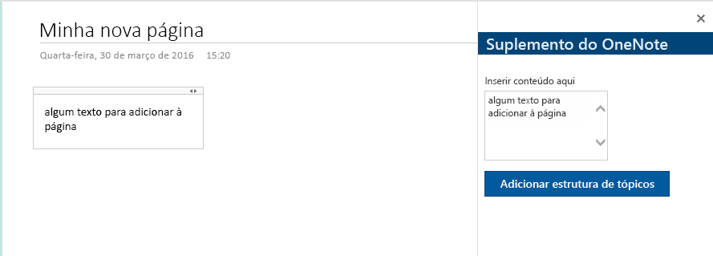

# <a name="build-your-first-onenote-add-in"></a>Crie seu primeiro suplemento do OneNote

Neste artigo, você percorrerá o processo de criação de um suplemento do OneNote usando jQuery e a API JavaScript do Office.

## <a name="prerequisites"></a>Pré-requisitos

- [Node.js](https://nodejs.org)

- Instale globalmente a última versão do [Yeoman](https://github.com/yeoman/yo) e o [gerador Yeoman para Suplementos do Office](https://github.com/OfficeDev/generator-office).

    ```bash
    npm install -g yo generator-office
    ```

## <a name="create-the-add-in-project"></a>Criar o projeto do suplemento

1. Crie uma pasta na unidade local e nomeie-a `my-onenote-addin`.  É aqui que criará os arquivos para seu aplicativo.

2. Navegue até a nova pasta.

    ```bash
    cd my-onenote-addin
    ```

3. Use o gerador Yeoman para criar um projeto de suplemento do OneNote. Execute o seguinte comando e responda as solicitações da seguinte maneira:

    ```bash
    yo office
    ```

    - **Escolha um tipo de projeto:** `Office Add-in project using Jquery framework`
    - **Escolha um tipo de script:** `Javascript`
    - **Como deseja nomear seu suplemento?:** `My Office Add-in`
    - **Para qual aplicativo cliente do Office você deseja suporte?** `Onenote`

    
    
    Depois de concluir o assistente, o gerador criará o projeto e instalará os componentes do nó de suporte.
    
4. Navegue até a pasta raiz do projeto de aplicativo da Web.

    ```bash
    cd "My Office Add-in"
    ```

## <a name="update-the-code"></a>Atualizar o código

1. No seu editor de código, abra o **index.html** na raiz do projeto. Esse arquivo especifica o HTML que será processado no painel de tarefas do suplemento.

2. Substitua o elemento  `<main>` dentro do elemento  `<body>` com a seguinte marcação e salve o arquivo. Isso adiciona uma área de texto e um botão usando os [componentes do Office UI Fabric](https://developer.microsoft.com/en-us/fabric#/components).

    ```html
    <main class="ms-welcome__main">
        <br />
        <p class="ms-font-l">Enter content below</p>
        <div class="ms-TextField ms-TextField--placeholder">
            <textarea id="textBox" rows="5"></textarea>
        </div>
        <button id="addOutline" class="ms-welcome__action ms-Button ms-Button--hero ms-u-slideUpIn20">
            <span class="ms-Button-label">Add Outline</span>
            <span class="ms-Button-icon"><i class="ms-Icon"></i></span>
            <span class="ms-Button-description">Adds the content above to the current page.</span>
        </button>
    </main>
    ```

3. Abra o arquivo **src\index.js** para especificar o script do suplemento. Substitua todo o conteúdo pelo seguinte código e salve o arquivo.

    ```js
    'use strict';

    (function () {

        Office.initialize = function (reason) {
            $(document).ready(function () {
                // Set up event handler for the UI.
                $('#addOutline').click(addOutlineToPage);
            });
        };

        // Add the contents of the text area to the page.
        function addOutlineToPage() {        
            OneNote.run(function (context) {
                var html = '<p>' + $('#textBox').val() + '</p>';

                // Get the current page.
                var page = context.application.getActivePage();

                // Queue a command to load the page with the title property.             
                page.load('title'); 

                // Add an outline with the specified HTML to the page.
                var outline = page.addOutline(40, 90, html);

                // Run the queued commands, and return a promise to indicate task completion.
                return context.sync()
                    .then(function() {
                        console.log('Added outline to page ' + page.title);
                    })
                    .catch(function(error) {
                        app.showNotification("Error: " + error); 
                        console.log("Error: " + error); 
                        if (error instanceof OfficeExtension.Error) { 
                            console.log("Debug info: " + JSON.stringify(error.debugInfo)); 
                        } 
                    }); 
            });
        }
    })();
    ```

## <a name="update-the-manifest"></a>Atualizar o manifesto

1. Abra o arquivo **one-note-add-in-manifest.xml** para definir as configurações e os recursos do suplemento.

2. O elemento `ProviderName` tem um valor de espaço reservado. Substitua-o pelo seu nome.

3. O atributo `DefaultValue` do elemento `Description` tem um espaço reservado. Substitua-o por **Um suplemento de painel de tarefas para OneNote**.

4. Salve o arquivo.

    ```xml
    ...
    <ProviderName>John Doe</ProviderName>
    <DefaultLocale>en-US</DefaultLocale>
    <!-- The display name of your add-in. Used on the store and various places of the Office UI such as the add-ins dialog. -->
    <DisplayName DefaultValue="OneNote Add-in" />
    <Description DefaultValue="A task pane add-in for OneNote"/>
    ...
    ```

## <a name="start-the-dev-server"></a>Iniciar o servidor de desenvolvimento

[!include[Start server section](../includes/quickstart-yo-start-server.md)]

## <a name="try-it-out"></a>Experimente

1. No [OneNote Online](https://www.onenote.com/notebooks), abra um bloco de anotações.

2. Escolha **Inserir > Suplementos do Office** para abrir a caixa de diálogo Suplementos do Office.

    - Se estiver conectado com sua conta de consumidor, selecione a guia **MEUS SUPLEMENTOS** e escolha  **Carregar meu suplemento**.

    - Se estiver conectado com sua conta corporativa ou de estudante, selecione a guia **MINHA ORGANIZAÇÃO** e escolha  **Carregar meu suplemento**. 

    A imagem a seguir mostra a guia **MEUS SUPLEMENTOS** para blocos de anotações de consumidor.

    

3. No diálogo Carregar suplemento, navegue até **one-note-add-in-manifest.xml** na pasta do projeto e escolha **Carregar**. 

4. Na guia **Página inicial** , escolha o botão **Mostrar painel de tarefas** na faixa de opções. O painel de tarefas do suplemento abre em um iFrame ao lado da página do OneNote.

5. Insira algum texto na área de texto e escolha **Adicionar estrutura de código**. O texto inserido é adicionado à página. 

    

## <a name="troubleshooting-and-tips"></a>Dicas e solução de problemas

- O suplemento pode ser depurado usando as ferramentas de desenvolvimento do seu navegador. Quando estiver usando o servidor Web Gulp e depurando no Internet Explore ou no Chrome, poderá salvar as alterações localmente e depois atualizar o iFrame do suplemento.

- Quando você inspeciona um objeto do OneNote, as propriedades que estão atualmente disponíveis para uso exibem valores reais. As propriedades que precisam ser carregadas exibem *undefined*. Expanda o nó `_proto_` para ver as propriedades definidas no objeto, mas que ainda não foram carregadas.

   

- É necessário habilitar conteúdo misto no navegador se o suplemento usa algum recurso HTTP. Os suplementos de produção devem usar apenas recursos HTTPS seguros.

- Os suplementos do painel de tarefas podem ser abertos de qualquer lugar, mas os suplementos de conteúdo só podem ser inseridos dentro do conteúdo normal da página (ou seja, não em títulos, imagens, iFrames, etc.). 

## <a name="next-steps"></a>Próximas etapas

Parabéns, você criou com êxito um suplemento do OneNote! Em seguida, conheça mais sobre os principais conceitos de criação de suplementos do OneNote.

> [!div class="nextstepaction"]
> [Visão geral da programação da API JavaScript do OneNote](../onenote/onenote-add-ins-programming-overview.md)

## <a name="see-also"></a>Confira também

- [Visão geral da programação da API JavaScript do OneNote](../onenote/onenote-add-ins-programming-overview.md)
- [Referência da API JavaScript do OneNote](https://docs.microsoft.com/office/dev/add-ins/reference/overview/onenote-add-ins-javascript-reference?view=office-js)
- [Amostra de Rubric Grader](https://github.com/OfficeDev/OneNote-Add-in-Rubric-Grader)
- [Visão geral da plataforma de suplementos do Office](../overview/office-add-ins.md)
