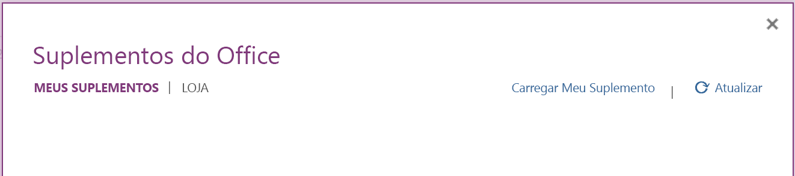
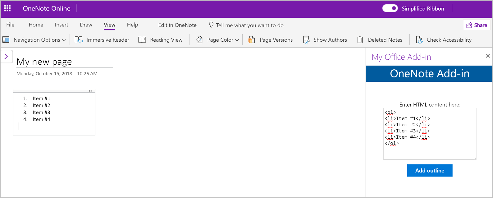

# <a name="build-your-first-onenote-add-in"></a>Criar seu primeiro suplemento do OneNote

Neste artigo, você passará pelo processo de criar um suplemento do OneNote usando o jQuery e a API JavaScript para Office.

## <a name="prerequisites"></a>Pré-requisitos

- [Node.js](https://nodejs.org)

- Instale a última versão do [Yeoman](https://github.com/yeoman/yo) e o [gerador do Yeoman para Suplementos do Office](https://github.com/OfficeDev/generator-office) globalmente.

    ```bash
    npm install -g yo generator-office
    ```

## <a name="create-the-add-in-project"></a>Criar o projeto do suplemento

1. Use o gerador Yeoman para criar um projeto de suplemento do OneNote. Execute o comando a seguir e responda aos prompts da seguinte forma:

    ```bash
    yo office
    ```

    - **Escolha o tipo de projeto:** `Office Add-in project using Jquery framework`
    - **Escolha o tipo de script:** `Javascript`
    - **Qual será o nome do suplemento?:** `My Office Add-in`
    - **Você gostaria de proporcionar suporte para qual aplicativo cliente do Office?:** `Onenote`

    
    
    Depois que você concluir o assistente, o gerador criará o projeto e instalará os componentes Node de suporte.
    
2. Navegue até a pasta raiz do projeto.

    ```bash
    cd "My Office Add-in"
    ```

## <a name="update-the-code"></a>Atualizar o código

1. No editor de código, abra **index.html** na raiz do projeto. Esse arquivo contém o HTML que será renderizado no painel de tarefas do suplemento.

2. Substitua o elemento `<body>` pela marcação a seguir e salve o arquivo. 

    ```html
    <body class="ms-font-m ms-welcome">
        <header class="ms-welcome__header ms-bgColor-themeDark ms-u-fadeIn500">
            <h2 class="ms-fontSize-xxl ms-fontWeight-regular ms-fontColor-white">OneNote Add-in</h1>
        </header>
        <main id="app-body" class="ms-welcome__main">
            <br />
            <p class="ms-font-m">Enter HTML content here:</p>
            <div class="ms-TextField ms-TextField--placeholder">
                <textarea id="textBox" rows="8" cols="30"></textarea>
            </div>
            <button id="addOutline" class="ms-Button ms-Button--primary">
                <span class="ms-Button-label">Add outline</span>
            </button>
        </main>
        <script type="text/javascript" src="node_modules/jquery/dist/jquery.js"></script>
        <script type="text/javascript" src="node_modules/office-ui-fabric-js/dist/js/fabric.js"></script>
    </body>
    ```

3. Abra o arquivo **src\index.js** para especificar o script do suplemento. Substitua todo o conteúdo pelo código a seguir e salve o arquivo.

    ```js
    import * as OfficeHelpers from "@microsoft/office-js-helpers";

    Office.initialize = (reason) => {
        $(document).ready(() => {
            $('#addOutline').click(addOutlineToPage);
        });
    };
    
    async function addOutlineToPage() {
        try {
            await OneNote.run(async context => {
                var html = "<p>" + $("#textBox").val() + "</p>";

                // Get the current page.
                var page = context.application.getActivePage();

                // Queue a command to load the page with the title property.
                page.load("title");

                // Add text to the page by using the specified HTML.
                var outline = page.addOutline(40, 90, html);

                // Run the queued commands, and return a promise to indicate task completion.
                return context.sync()
                    .then(function() {
                        console.log("Added outline to page " + page.title);
                    })
                    .catch(function(error) {
                        app.showNotification("Error: " + error);
                        console.log("Error: " + error);
                        if (error instanceof OfficeExtension.Error) {
                            console.log("Debug info: " + JSON.stringify(error.debugInfo));
                        }
                    });
                });
        } catch (error) {
            OfficeHelpers.UI.notify(error);
            OfficeHelpers.Utilities.log(error);
        }
    }
    ```

4. Abra o arquivo **app.css** para especificar os estilos personalizados do suplemento. Substitua todo o conteúdo pelo que está a seguir e salve o arquivo.

    ```css
    html, body {
        width: 100%;
        height: 100%;
        margin: 0;
        padding: 0;
    }

    ul, p, h1, h2, h3, h4, h5, h6 {
        margin: 0;
        padding: 0;
    }

    .ms-welcome {
        position: relative;
        display: -webkit-flex;
        display: flex;
        -webkit-flex-direction: column;
        flex-direction: column;
        -webkit-flex-wrap: nowrap;
        flex-wrap: nowrap;
        min-height: 500px;
        min-width: 320px;
        overflow: auto;
        overflow-x: hidden;
    }

    .ms-welcome__header {
        min-height: 30px;
        padding: 0px;
        padding-bottom: 5px;
        display: -webkit-flex;
        display: flex;
        -webkit-flex-direction: column;
        flex-direction: column;
        -webkit-flex-wrap: nowrap;
        flex-wrap: nowrap;
        -webkit-align-items: center;
        align-items: center;
        -webkit-justify-content: flex-end;
        justify-content: flex-end;
    }

    .ms-welcome__header > h1 {
        margin-top: 5px;
        text-align: center;
    }

    .ms-welcome__main {
        display: -webkit-flex;
        display: flex;
        -webkit-flex-direction: column;
        flex-direction: column;
        -webkit-flex-wrap: nowrap;
        flex-wrap: nowrap;
        -webkit-align-items: center;
        align-items: left;
        -webkit-flex: 1 0 0;
        flex: 1 0 0;
        padding: 30px 20px;
    }

    .ms-welcome__main > h2 {
        width: 100%;
        text-align: left;
    }

    @media (min-width: 0) and (max-width: 350px) {
        .ms-welcome__features {
            width: 100%;
        }
    }
    ```

## <a name="update-the-manifest"></a>Atualizar o manifesto

1. Abra o arquivo **manifest.xml** para definir as configurações e os recursos do suplemento.

2. O elemento `ProviderName` tem um valor de espaço reservado. Substitua-o com seu nome.

3. O atributo `DefaultValue` do elemento `Description` tem um espaço reservado. Substitua-o por **um suplemento do painel de tarefas do OneNote**.

4. Salve o arquivo.

    ```xml
    ...
    <ProviderName>John Doe</ProviderName>
    <DefaultLocale>en-US</DefaultLocale>
    <!-- The display name of your add-in. Used on the store and various places of the Office UI such as the add-ins dialog. -->
    <DisplayName DefaultValue="My Office Add-in" />
    <Description DefaultValue="A task pane add-in for OneNote"/>
    ...
    ```

## <a name="start-the-dev-server"></a>Iniciar o servidor de desenvolvimento

[!include[Start server section](../includes/quickstart-yo-start-server.md)]

## <a name="try-it-out"></a>Experimente

1. No [OneNote Online](https://www.onenote.com/notebooks), abra um bloco de anotações.

2. Escolha **Inserir > Suplementos do Office** para abrir a caixa de diálogo Suplementos do Office.

    - Se você estiver conectado à sua conta de consumidor, selecione a guia **MEUS SUPLEMENTOS** e escolha  **Carregar Meu Suplemento**.

    - Se você estiver conectado à sua conta corporativa ou de estudante, selecione a guia **MINHA ORGANIZAÇÃO** e escolha  **Carregar Meu Suplemento**. 

    A imagem a seguir mostra a guia **MEUS SUPLEMENTOS** para blocos de anotações do consumidor.

    

3. Na caixa de diálogo Carregar Suplemento, navegue até **manifest.xml** na pasta do projeto e escolha **Carregar**. 

4. Na guia **Página Inicial**, na faixa de opções, escolha o botão **Mostrar Painel de Tarefas**. O painel de tarefa do suplemento abre em um iFrame ao lado da página do OneNote.

5. Insira este conteúdo HTML na área de texto e escolha **Adicionar estrutura de tópicos**.  

    ```html
    <ol>
    <li>Item #1</li>
    <li>Item #2</li>
    <li>Item #3</li>
    <li>Item #4</li>
    </ol>
    ```

    A estrutura de tópicos especificada é adicionada à página.

    

## <a name="troubleshooting-and-tips"></a>Dicas e solução de problemas

- Você pode depurar o suplemento usando as ferramentas de desenvolvedor do seu navegador. Quando você estiver usando o servidor Web Gulp e depurando no Internet Explore ou no Chrome, você pode salvar as alterações localmente e apenas atualize o iFrame do suplemento.

- Quando você inspecionar um objeto do OneNote, as propriedades que estão atualmente disponíveis usam valores reais de exibição. As propriedades que precisam ser carregadas exibem *undefined*. Expanda o nó `_proto_` para ver as propriedades definidas no objeto, mas que ainda não foram carregadas.

   

- Você precisa habilitar conteúdo misto no navegador, se o seu suplemento usar todos os recursos HTTP. Os suplementos de produção devem usar apenas recursos HTTPS seguros.

- É possível abrir os suplementos do Painel de Tarefas em praticamente qualquer lugar, mas os suplementos de conteúdo podem ser inseridos apenas no conteúdo normal da página (ou seja, fora títulos, imagens, iFrames, etc.). 

## <a name="next-steps"></a>Próximas etapas

Parabéns, você criou com êxito um suplemento do OneNote! Em seguida, saiba mais sobre os principais conceitos de criação de suplementos do OneNote.

> [!div class="nextstepaction"]
> [Visão geral da programação da API JavaScript do OneNote](../onenote/onenote-add-ins-programming-overview.md)

## <a name="see-also"></a>Confira também

- [Visão geral da programação da API JavaScript do OneNote](../onenote/onenote-add-ins-programming-overview.md)
- [Referência da API JavaScript do OneNote](https://docs.microsoft.com/office/dev/add-ins/reference/overview/onenote-add-ins-javascript-reference?view=office-js)
- [Amostra de Rubric Grader](https://github.com/OfficeDev/OneNote-Add-in-Rubric-Grader)
- [Visão geral da plataforma Suplementos do Office](../overview/office-add-ins.md)
