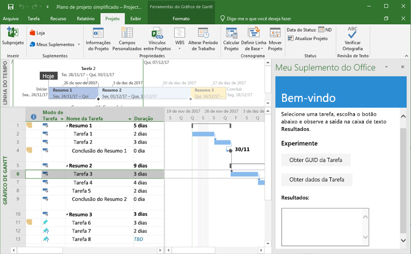
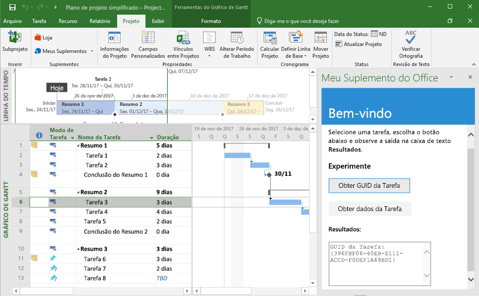

# <a name="build-your-first-project-add-in"></a>Criar seu primeiro suplemento do Project

Neste artigo, você será guiado pelo processo de criação de um suplemento do Project usando o jQuery e a API JavaScript para Office.

## <a name="prerequisites"></a>Pré-requisitos

- [Node.js](https://nodejs.org)

- Instale a última versão do [Yeoman](https://github.com/yeoman/yo) e o [gerador do Yeoman para Suplementos do Office](https://github.com/OfficeDev/generator-office) globalmente.

    ```bash
    npm install -g yo generator-office
    ```

## <a name="create-the-add-in"></a>Criar o suplemento

1. Crie uma pasta na unidade local e chame-a de `my-project-addin`.  É aqui que você criará os arquivos para o seu suplemento.

    ```bash
    mkdir my-project-addin
    ```

2. Navegue até a nova pasta.

    ```bash
    cd my-project-addin
    ```

3. Use o gerador Yeoman para criar um projeto de suplemento do Project. Execute o seguinte comando e responda as solicitações da seguinte maneira:

    ```bash
    yo office
    ```

    - **Escolha o tipo de projeto:** `Office Add-in project using Jquery framework`
    - **Escolha um tipo de script:** `Javascript`
    - **Como deseja nomear seu suplemento?:** `My Office Add-in`
    - **Para qual aplicativo cliente do Office você deseja suporte?** `Project`

    
    
    Depois de concluir o assistente, o gerador criará o projeto e instalará os componentes do nó de suporte.
    
4. Navegue até a pasta raiz do projeto de aplicativo da Web.

    ```bash
    cd "My Office Add-in"
    ```

## <a name="update-the-code"></a>Atualizar o código

1. No seu editor de código, abra o arquivo **index.html** que está na raiz do projeto. Esse arquivo contém o HTML que será processado no painel de tarefas do suplemento.

2. Substitua o elemento `<body>` pela marcação a seguir:

    ```html
    <body class="ms-font-m ms-welcome">
        <div id="content-header">
            <div class="padding">
                <h1>Welcome</h1>
            </div>
        </div>
        <div id="content-main">
            <div class="padding">
                <p>Select a task and then choose the buttons below and observe the output in the <b>Results</b> textbox.</p>
                <h3>Try it out</h3>
                <button class="ms-Button" id="get-task-guid">Get Task GUID</button>
                <br/><br/>
                <button class="ms-Button" id="get-task">Get Task data</button>
                <br/>
                <h4>Results:</h4>
                <textarea id="result" rows="6" cols="25"></textarea>
            </div>
        </div>
        <script type="text/javascript" src="node_modules/jquery/dist/jquery.js"></script>
        <script type="text/javascript" src="node_modules/office-ui-fabric-js/dist/js/fabric.js"></script>
    </body>
    ```

3. Abra o arquivo **src\index.js** para especificar o script do suplemento. Substitua todo o conteúdo pelo código a seguir e salve o arquivo.

    ```js
    'use strict';

    (function () {

        var taskGuid;

        // The initialize function must be run each time a new page is loaded
        Office.initialize = function (reason) {
            $(document).ready(function () {
                $('#get-task-guid').click(getTaskGUID);
                $('#get-task').click(getTask);
            });
        };

        function getTaskGUID() {
            Office.context.document.getSelectedTaskAsync(function (asyncResult) {
                if (asyncResult.status == Office.AsyncResultStatus.Succeeded) {
                    result.value = "Task GUID: " + asyncResult.value;
                    taskGuid = asyncResult.value;
                }
                else {
                    console.log(asyncResult.error.message);
                }
            });
        }

        function getTask() {
            if (taskGuid != undefined) {
                Office.context.document.getTaskAsync(
                    taskGuid,
                    function (asyncResult) {
                        if (asyncResult.status === Office.AsyncResultStatus.Succeeded) {
                            var taskInfo = asyncResult.value;
                            var taskOutput = "Task name: " + taskInfo.taskName +
                                            "\nGUID: " + taskGuid +
                                            "\nWSS Id: " + taskInfo.wssTaskId +
                                            "\nResource names: " + taskInfo.resourceNames;
                            result.value = taskOutput;
                        } else {
                            console.log(asyncResult.error.message);
                        }
                    }
                );
            } else {
                result.value = 'Task GUID not valid:\n' + taskGuid;
            } 
        }
    })();
    ```

4. Abra o arquivo **app.css** que está na raiz do projeto para especificar os estilos personalizados do suplemento. Substitua todo o conteúdo pelo que está a seguir e salve o arquivo.

    ```css
    #content-header {
        background: #2a8dd4;
        color: #fff;
        position: absolute;
        top: 0;
        left: 0;
        width: 100%;
        height: 80px; 
        overflow: hidden;
    }

    #content-main {
        background: #fff;
        position: fixed;
        top: 80px;
        left: 0;
        right: 0;
        bottom: 0;
        overflow: auto; 
    }

    .padding {
        padding: 15px;
    }
    ```

## <a name="update-the-manifest"></a>Atualizar o manifesto

1. Abra o arquivo **my-office-add-in-manifest.xml** para definir as configurações e os recursos do suplemento.

2. O elemento `ProviderName` tem um valor de espaço reservado. Substitua-o pelo seu nome.

3. O atributo `DefaultValue` do elemento `Description` tem um espaço reservado. Substitua-o com **um suplemento do painel de tarefas do Project**.

4. Salve o arquivo.

    ```xml
    ...
    <ProviderName>John Doe</ProviderName>
    <DefaultLocale>en-US</DefaultLocale>
    <!-- The display name of your add-in. Used on the store and various places of the Office UI such as the add-ins dialog. -->
    <DisplayName DefaultValue="My Office Add-in" />
    <Description DefaultValue="A task pane add-in for Project"/>
    ...
    ```

## <a name="start-the-dev-server"></a>Iniciar o servidor de desenvolvimento

[!include[Start server section](../includes/quickstart-yo-start-server.md)] 

## <a name="try-it-out"></a>Experimente

1. No Project, crie um projeto simples que tenha pelo menos uma tarefa.

2. Siga as instruções para a plataforma que você usará para executar o suplemento e para fazer o sideload do suplemento no Project.

    - Windows: [fazer o sideload dos Suplementos do Office no Windows](../testing/create-a-network-shared-folder-catalog-for-task-pane-and-content-add-ins.md)
    - Project Online: [fazer o sideload dos Suplementos do Office no Office Online](../testing/sideload-office-add-ins-for-testing.md#sideload-an-office-add-in-on-office-online)
    - iPad e Mac: [fazer o sideload dos Suplementos do Office no iPad e Mac](../testing/sideload-an-office-add-in-on-ipad-and-mac.md)

3. No Project, selecione uma tarefa.

    

4. No painel de tarefas, clique no botão **Obter GUID da Tarefa** para gravar a GUID da tarefa na caixa de texto **Resultados**.

    

5. No painel de tarefas, escolha o botão **Obter Dados da Tarefa** para gravar as várias propriedades da tarefa selecionada na caixa de texto **Resultados**.

    

## <a name="next-steps"></a>Próximas etapas

Parabéns, você criou com êxito um suplemento do Project! A seguir, aprenda mais sobre os recursos de um suplemento do Project e explore cenários comuns.

> [!div class="nextstepaction"]
> [Suplementos do Project](../project/project-add-ins.md)
