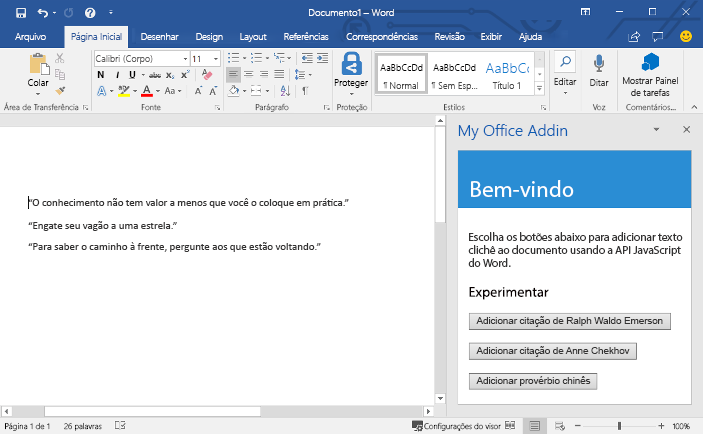

# <a name="build-your-first-word-add-in"></a><span data-ttu-id="cb6d7-101">Compilar seu primeiro suplemento do Word</span><span class="sxs-lookup"><span data-stu-id="cb6d7-101">Build your first Word add-in</span></span>

<span data-ttu-id="cb6d7-102">_Aplica-se a: Word 2016, Word para iPad, Word para Mac_</span><span class="sxs-lookup"><span data-stu-id="cb6d7-102">_Applies to: Word 2016, Word for iPad, Word for Mac_</span></span>

<span data-ttu-id="cb6d7-103">Neste artigo, você passará pelo processo de criar um suplemento do Word usando o jQuery e a API JavaScript para Word.</span><span class="sxs-lookup"><span data-stu-id="cb6d7-103">In this article, you'll walk through the process of building a Word add-in by using jQuery and the Word JavaScript API.</span></span> 

## <a name="create-the-add-in"></a><span data-ttu-id="cb6d7-104">Criar o suplemento</span><span class="sxs-lookup"><span data-stu-id="cb6d7-104">Create the add-in</span></span> 

[!include[Choose your editor](../includes/quickstart-choose-editor.md)]

# <a name="visual-studiotabvisual-studio"></a>[<span data-ttu-id="cb6d7-105">Visual Studio</span><span class="sxs-lookup"><span data-stu-id="cb6d7-105">Visual Studio</span></span>](#tab/visual-studio)

### <a name="prerequisites"></a><span data-ttu-id="cb6d7-106">Pré-requisitos</span><span class="sxs-lookup"><span data-stu-id="cb6d7-106">Prerequisites</span></span>

[!include[Quick Start prerequisites](../includes/quickstart-vs-prerequisites.md)]

### <a name="create-the-add-in-project"></a><span data-ttu-id="cb6d7-107">Criar o projeto do suplemento</span><span class="sxs-lookup"><span data-stu-id="cb6d7-107">Create the add-in project</span></span>

1. <span data-ttu-id="cb6d7-108">Na barra de menus do Visual Studio, selecione **Arquivo**  >  **Novo**  >  **Projeto**.</span><span class="sxs-lookup"><span data-stu-id="cb6d7-108">On the Visual Studio menu bar, choose  **File** > **New** > **Project**.</span></span>
    
2. <span data-ttu-id="cb6d7-109">Na lista de tipos de projeto em **Visual C#** ou em **Visual Basic**, expanda a opção **Office/SharePoint**, escolha **Suplementos** e depois **Suplemento da Web do Word** como o tipo de projeto.</span><span class="sxs-lookup"><span data-stu-id="cb6d7-109">In the list of project types under **Visual C#** or **Visual Basic**, expand  **Office/SharePoint**, choose **Add-ins**, and then choose **Word Web Add-in** as the project type.</span></span> 

3. <span data-ttu-id="cb6d7-110">Dê um nome ao projeto e escolha **OK**.</span><span class="sxs-lookup"><span data-stu-id="cb6d7-110">Name the project, and then choose **OK**.</span></span>

4. <span data-ttu-id="cb6d7-p101">O Visual Studio cria uma solução, e os dois projetos dela são exibidos no **Gerenciador de Soluções**. O arquivo **Home.html** é aberto no Visual Studio.</span><span class="sxs-lookup"><span data-stu-id="cb6d7-p101">Visual Studio creates a solution and its two projects appear in **Solution Explorer**. The **Home.html** file opens in Visual Studio.</span></span>
    
### <a name="explore-the-visual-studio-solution"></a><span data-ttu-id="cb6d7-113">Explorar a solução do Visual Studio</span><span class="sxs-lookup"><span data-stu-id="cb6d7-113">Explore the Visual Studio solution</span></span>

[!include[Description of Visual Studio projects](../includes/quickstart-vs-solution.md)]

### <a name="update-the-code"></a><span data-ttu-id="cb6d7-114">Atualizar o código</span><span class="sxs-lookup"><span data-stu-id="cb6d7-114">Update the code</span></span>

1. <span data-ttu-id="cb6d7-p102">**Home.HTML** especifica o HTML que será processado no painel de tarefas do suplemento. Em **Home.html**, substitua o elemento `<body>`  com a seguinte marcação e salve o arquivo.</span><span class="sxs-lookup"><span data-stu-id="cb6d7-p102">**Home.html** specifies the HTML that will be rendered in the add-in's task pane. In **Home.html**, replace the `<body>` element with the following markup and save the file.</span></span>
 
    ```html
    <body>
        <div id="content-header">
            <div class="padding">
                <h1>Welcome</h1>
            </div>
        </div>    
        <div id="content-main">
            <div class="padding">
                <p>Choose the buttons below to add boilerplate text to the document by using the Word JavaScript API.</p>
                <br />
                <h3>Try it out</h3>
                <button id="emerson">Add quote from Ralph Waldo Emerson</button>
                <br /><br />
                <button id="checkhov">Add quote from Anton Chekhov</button>
                <br /><br />
                <button id="proverb">Add Chinese proverb</button>
            </div>
        </div>
        <br />
        <div id="supportedVersion"/>
    </body>
    ```

2. <span data-ttu-id="cb6d7-p103">Abra o arquivo **Home.js** na raiz do projeto de aplicativo da web. Este arquivo especifica o script para o suplemento. Substitua todo o conteúdo pelo seguinte código e salve o arquivo.</span><span class="sxs-lookup"><span data-stu-id="cb6d7-p103">Open the file **Home.js** in the root of the web application project. This file specifies the script for the add-in. Replace the entire contents with the following code and save the file.</span></span>

    ```js
    'use strict';
    
    (function () {

        // The initialize function is run each time the page is loaded.
        Office.initialize = function (reason) {
            $(document).ready(function () {

                // Use this to check whether the API is supported in the Word client.
                if (Office.context.requirements.isSetSupported('WordApi', 1.1)) {
                    // Do something that is only available via the new APIs
                    $('#emerson').click(insertEmersonQuoteAtSelection);
                    $('#checkhov').click(insertChekhovQuoteAtTheBeginning);
                    $('#proverb').click(insertChineseProverbAtTheEnd);
                    $('#supportedVersion').html('This code is using Word 2016 or later.');
                }
                else {
                    // Just letting you know that this code will not work with your version of Word.
                    $('#supportedVersion').html('This code requires Word 2016 or later.');
                }
            });
        };

        function insertEmersonQuoteAtSelection() {
            Word.run(function (context) {

                // Create a proxy object for the document.
                var thisDocument = context.document;

                // Queue a command to get the current selection.
                // Create a proxy range object for the selection.
                var range = thisDocument.getSelection();

                // Queue a command to replace the selected text.
                range.insertText('"Hitch your wagon to a star."\n', Word.InsertLocation.replace);

                // Synchronize the document state by executing the queued commands,
                // and return a promise to indicate task completion.
                return context.sync().then(function () {
                    console.log('Added a quote from Ralph Waldo Emerson.');
                });
            })
            .catch(function (error) {
                console.log('Error: ' + JSON.stringify(error));
                if (error instanceof OfficeExtension.Error) {
                    console.log('Debug info: ' + JSON.stringify(error.debugInfo));
                }
            });
        }

        function insertChekhovQuoteAtTheBeginning() {
            Word.run(function (context) {

                // Create a proxy object for the document body.
                var body = context.document.body;

                // Queue a command to insert text at the start of the document body.
                body.insertText('"Knowledge is of no value unless you put it into practice."\n', Word.InsertLocation.start);

                // Synchronize the document state by executing the queued commands,
                // and return a promise to indicate task completion.
                return context.sync().then(function () {
                    console.log('Added a quote from Anton Chekhov.');
                });
            })
            .catch(function (error) {
                console.log('Error: ' + JSON.stringify(error));
                if (error instanceof OfficeExtension.Error) {
                    console.log('Debug info: ' + JSON.stringify(error.debugInfo));
                }
            });
        }

        function insertChineseProverbAtTheEnd() {
            Word.run(function (context) {

                // Create a proxy object for the document body.
                var body = context.document.body;

                // Queue a command to insert text at the end of the document body.
                body.insertText('"To know the road ahead, ask those coming back."\n', Word.InsertLocation.end);

                // Synchronize the document state by executing the queued commands,
                // and return a promise to indicate task completion.
                return context.sync().then(function () {
                    console.log('Added a quote from a Chinese proverb.');
                });
            })
            .catch(function (error) {
                console.log('Error: ' + JSON.stringify(error));
                if (error instanceof OfficeExtension.Error) {
                    console.log('Debug info: ' + JSON.stringify(error.debugInfo));
                }
            });
        }
    })();
    ```

3. <span data-ttu-id="cb6d7-p104">Abra o arquivo **Home.css** na raiz do projeto de aplicativo da web. Este arquivo especifica os estilos personalizados para o suplemento. Substitua todo o conteúdo pelo seguinte código e salve o arquivo.</span><span class="sxs-lookup"><span data-stu-id="cb6d7-p104">Open the file **Home.css** in the root of the web application project. This file specifies the custom styles for the add-in. Replace the entire contents with the following code and save the file.</span></span>

    ```css
    #content-header {
        background: #2a8dd4;
        color: #fff;
        position: absolute;
        top: 0;
        left: 0;
        width: 100%;
        height: 80px; 
        overflow: hidden;
    }

    #content-main {
        background: #fff;
        position: fixed;
        top: 80px;
        left: 0;
        right: 0;
        bottom: 0;
        overflow: auto; 
    }

    .padding {
        padding: 15px;
    }
    ```

### <a name="update-the-manifest"></a><span data-ttu-id="cb6d7-123">Atualizar o manifesto</span><span class="sxs-lookup"><span data-stu-id="cb6d7-123">Update the manifest</span></span>

1. <span data-ttu-id="cb6d7-p105">Abra o arquivo de manifesto XML no projeto de suplemento. Este arquivo define as configurações e recursos do suplemento.</span><span class="sxs-lookup"><span data-stu-id="cb6d7-p105">Open the XML manifest file in the add-in project. This file defines the add-in's settings and capabilities.</span></span>

2. <span data-ttu-id="cb6d7-p106">O elemento `ProviderName` tem um valor de espaço reservado. Substitua-o pelo seu nome.</span><span class="sxs-lookup"><span data-stu-id="cb6d7-p106">The `ProviderName` element has a placeholder value. Replace it with your name.</span></span>

3. <span data-ttu-id="cb6d7-p107">O atributo `DefaultValue` do elemento `DisplayName` tem um espaço reservado. Substitua-o pelo **Meu suplemento do Office**.</span><span class="sxs-lookup"><span data-stu-id="cb6d7-p107">The `DefaultValue` attribute of the `DisplayName` element has a placeholder. Replace it with **My Office Add-in**.</span></span>

4. <span data-ttu-id="cb6d7-p108">O atributo `DefaultValue` do elemento `Description` tem um espaço reservado. Substitua-o por **Um suplemento de painel de tarefas para Word**.</span><span class="sxs-lookup"><span data-stu-id="cb6d7-p108">The `DefaultValue` attribute of the `Description` element has a placeholder. Replace it with **A task pane add-in for Word**.</span></span>

5. <span data-ttu-id="cb6d7-132">Salve o arquivo.</span><span class="sxs-lookup"><span data-stu-id="cb6d7-132">Save the file.</span></span>

    ```xml
    ...
    <ProviderName>John Doe</ProviderName>
    <DefaultLocale>en-US</DefaultLocale>
    <!-- The display name of your add-in. Used on the store and various places of the Office UI such as the add-ins dialog. -->
    <DisplayName DefaultValue="My Office Add-in" />
    <Description DefaultValue="A task pane add-in for Word"/>
    ...
    ```

### <a name="try-it-out"></a><span data-ttu-id="cb6d7-133">Experimente</span><span class="sxs-lookup"><span data-stu-id="cb6d7-133">Try it out</span></span>

1. <span data-ttu-id="cb6d7-p109">Usando o Visual Studio, teste o suplemento do Word recém-criado pressionando F5 ou escolhendo o botão **Iniciar** para abrir o Word com o botão de suplemento **Mostrar painel de tarefas** exibido na faixa de opções. O suplemento será hospedado localmente no IIS.</span><span class="sxs-lookup"><span data-stu-id="cb6d7-p109">Using Visual Studio, test the newly created Word add-in by pressing F5 or choosing the **Start** button to launch Word with the **Show Taskpane** add-in button displayed in the ribbon. The add-in will be hosted locally on IIS.</span></span>

2. <span data-ttu-id="cb6d7-p110">No Word, escolha a guia **Página inicial** e, sem seguida, o botão **Mostrar painel de tarefas** na faixa de opções para abrir o painel de tarefas do suplemento. (Se você estiver usando a versão sem assinatura do Office 2016 em vez da versão do Office 365, os botões personalizados não serão suportados. Em vez disso, o painel de tarefas será aberto imediatamente.)</span><span class="sxs-lookup"><span data-stu-id="cb6d7-p110">In Word, choose the **Home** tab, and then choose the **Show Taskpane** button in the ribbon to open the add-in task pane. (If you are using the non-subscription version of Office 2016, instead of the Office 365 version, then custom buttons are not supported. Instead, the task pane will open immediately.)</span></span>

    

3. <span data-ttu-id="cb6d7-140">No painel de tarefas, escolha qualquer um dos botões para adicionar o texto clichê ao documento.</span><span class="sxs-lookup"><span data-stu-id="cb6d7-140">In the task pane, choose any of the buttons to add boilerplate text to the document.</span></span>

    

# <a name="any-editortabvisual-studio-code"></a>[<span data-ttu-id="cb6d7-142">Qualquer editor</span><span class="sxs-lookup"><span data-stu-id="cb6d7-142">Any editor</span></span>](#tab/visual-studio-code)

### <a name="prerequisites"></a><span data-ttu-id="cb6d7-143">Pré-requisitos</span><span class="sxs-lookup"><span data-stu-id="cb6d7-143">Prerequisites</span></span>

- [<span data-ttu-id="cb6d7-144">Node.js</span><span class="sxs-lookup"><span data-stu-id="cb6d7-144">Node.js</span></span>](https://nodejs.org)

- <span data-ttu-id="cb6d7-145">Instale globalmente a última versão do [Yeoman](https://github.com/yeoman/yo) e o [gerador Yeoman para Suplementos do Office](https://github.com/OfficeDev/generator-office).</span><span class="sxs-lookup"><span data-stu-id="cb6d7-145">Install the latest version of [Yeoman](https://github.com/yeoman/yo) and the [Yeoman generator for Office Add-ins](https://github.com/OfficeDev/generator-office) globally.</span></span>

    ```bash
    npm install -g yo generator-office
    ```

### <a name="create-the-add-in-project"></a><span data-ttu-id="cb6d7-146">Criar o projeto do suplemento</span><span class="sxs-lookup"><span data-stu-id="cb6d7-146">Create the add-in project</span></span>

1. <span data-ttu-id="cb6d7-p111">Use o gerador Yeoman para criar um projeto de suplemento do Word. Execute o seguinte comando e responda às solicitações da seguinte maneira:</span><span class="sxs-lookup"><span data-stu-id="cb6d7-p111">Use the Yeoman generator to create a Word add-in project. Run the following command and then answer the prompts as follows:</span></span>

    ```bash
    yo office
    ```

    - <span data-ttu-id="cb6d7-149">**Escolha um tipo de projeto:** `Office Add-in project using Jquery framework`</span><span class="sxs-lookup"><span data-stu-id="cb6d7-149">**Choose a project type:** `Office Add-in project using Jquery framework`</span></span>
    - <span data-ttu-id="cb6d7-150">**Escolha um tipo de script:** `Javascript`</span><span class="sxs-lookup"><span data-stu-id="cb6d7-150">**Choose a script type:** `Javascript`</span></span>
    - <span data-ttu-id="cb6d7-151">**Como deseja nomear seu suplemento?:** `My Office Add-in`</span><span class="sxs-lookup"><span data-stu-id="cb6d7-151">**What do you want to name your add-in?:** `My Office Add-in`</span></span>
    - <span data-ttu-id="cb6d7-152">**Para qual aplicativo cliente do Office você deseja suporte?** `Word`</span><span class="sxs-lookup"><span data-stu-id="cb6d7-152">**Which Office client application would you like to support?:** `Word`</span></span>

    
    
    <span data-ttu-id="cb6d7-154">Depois de concluir o assistente, o gerador criará o projeto e instalará os componentes do nó de suporte.</span><span class="sxs-lookup"><span data-stu-id="cb6d7-154">After you complete the wizard, the generator will create the project and install supporting Node components.</span></span>
    
2. <span data-ttu-id="cb6d7-155">Navegue até a pasta raiz do projeto.</span><span class="sxs-lookup"><span data-stu-id="cb6d7-155">Navigate to the root folder of the web application project.</span></span>

    ```bash
    cd "My Office Add-in"
    ```

### <a name="update-the-code"></a><span data-ttu-id="cb6d7-156">Atualizar o código</span><span class="sxs-lookup"><span data-stu-id="cb6d7-156">Update the code</span></span>

1. <span data-ttu-id="cb6d7-p112">No seu editor de código, abra o arquivo **index.html** na raiz do projeto. Esse arquivo contém o HTML que será processado no painel de tarefas do suplemento.</span><span class="sxs-lookup"><span data-stu-id="cb6d7-p112">In your code editor, open **index.html** in the root of the project. This file contains the HTML that will be rendered in the add-in's task pane.</span></span> 

2. <span data-ttu-id="cb6d7-159">Substitua o elemento `<body>` pela marcação a seguir e salve o arquivo.</span><span class="sxs-lookup"><span data-stu-id="cb6d7-159">Replace the `<body>` element inside the  element with the following markup and save the file.</span></span>

    ```html
    <body>
        <div id="content-header">
            <div class="padding">
                <h1>Welcome</h1>
            </div>
        </div>
        <div id="content-main">
            <div class="padding">
                <p>Choose the buttons below to add boilerplate text to the document by using the Word JavaScript API.</p>
                <br />
                <h3>Try it out</h3>
                <button id="emerson">Add quote from Ralph Waldo Emerson</button>
                <br /><br />
                <button id="checkhov">Add quote from Anton Chekhov</button>
                <br /><br />
                <button id="proverb">Add Chinese proverb</button>
            </div>
        </div>
        <br />
        <div id="supportedVersion" />
        <script type="text/javascript" src="node_modules/jquery/dist/jquery.js"></script>
        <script type="text/javascript" src="node_modules/office-ui-fabric-js/dist/js/fabric.js"></script>
    </body>
    ```

2. <span data-ttu-id="cb6d7-160">Abra o arquivo **src\index.js** para especificar o script do suplemento.</span><span class="sxs-lookup"><span data-stu-id="cb6d7-160">Open the file **app.js** to specify the script for the add-in.</span></span> <span data-ttu-id="cb6d7-161">Substitua todo o conteúdo pelo código a seguir e salve o arquivo.</span><span class="sxs-lookup"><span data-stu-id="cb6d7-161">Replace the entire contents with the following code and save the file.</span></span> <span data-ttu-id="cb6d7-162">Esse script contém códigos de inicialização, além do código que faz alterações no documento do Word, inserindo texto no documento quando um botão é escolhido.</span><span class="sxs-lookup"><span data-stu-id="cb6d7-162">This script contains initialization code as well as the code that makes changes to the Word document, by inserting text into the document when a button is chosen.</span></span> 

    ```js
    'use strict';
    
    (function () {

        // The initialize function is run each time the page is loaded.
        Office.initialize = function (reason) {
            $(document).ready(function () {

                // Use this to check whether the API is supported in the Word client.
                if (Office.context.requirements.isSetSupported('WordApi', 1.1)) {
                    // Do something that is only available via the new APIs
                    $('#emerson').click(insertEmersonQuoteAtSelection);
                    $('#checkhov').click(insertChekhovQuoteAtTheBeginning);
                    $('#proverb').click(insertChineseProverbAtTheEnd);
                    $('#supportedVersion').html('This code is using Word 2016 or later.');
                }
                else {
                    // Just letting you know that this code will not work with your version of Word.
                    $('#supportedVersion').html('This code requires Word 2016 or later.');
                }
            });
        };

        function insertEmersonQuoteAtSelection() {
            Word.run(function (context) {

                // Create a proxy object for the document.
                var thisDocument = context.document;

                // Queue a command to get the current selection.
                // Create a proxy range object for the selection.
                var range = thisDocument.getSelection();

                // Queue a command to replace the selected text.
                range.insertText('"Hitch your wagon to a star."\n', Word.InsertLocation.replace);

                // Synchronize the document state by executing the queued commands,
                // and return a promise to indicate task completion.
                return context.sync().then(function () {
                    console.log('Added a quote from Ralph Waldo Emerson.');
                });
            })
            .catch(function (error) {
                console.log('Error: ' + JSON.stringify(error));
                if (error instanceof OfficeExtension.Error) {
                    console.log('Debug info: ' + JSON.stringify(error.debugInfo));
                }
            });
        }

        function insertChekhovQuoteAtTheBeginning() {
            Word.run(function (context) {

                // Create a proxy object for the document body.
                var body = context.document.body;

                // Queue a command to insert text at the start of the document body.
                body.insertText('"Knowledge is of no value unless you put it into practice."\n', Word.InsertLocation.start);

                // Synchronize the document state by executing the queued commands,
                // and return a promise to indicate task completion.
                return context.sync().then(function () {
                    console.log('Added a quote from Anton Chekhov.');
                });
            })
            .catch(function (error) {
                console.log('Error: ' + JSON.stringify(error));
                if (error instanceof OfficeExtension.Error) {
                    console.log('Debug info: ' + JSON.stringify(error.debugInfo));
                }
            });
        }

        function insertChineseProverbAtTheEnd() {
            Word.run(function (context) {

                // Create a proxy object for the document body.
                var body = context.document.body;

                // Queue a command to insert text at the end of the document body.
                body.insertText('"To know the road ahead, ask those coming back."\n', Word.InsertLocation.end);

                // Synchronize the document state by executing the queued commands,
                // and return a promise to indicate task completion.
                return context.sync().then(function () {
                    console.log('Added a quote from a Chinese proverb.');
                });
            })
            .catch(function (error) {
                console.log('Error: ' + JSON.stringify(error));
                if (error instanceof OfficeExtension.Error) {
                    console.log('Debug info: ' + JSON.stringify(error.debugInfo));
                }
            });
        }
    })();
    ```

3. <span data-ttu-id="cb6d7-p114">Abra o arquivo **app.css** na raiz do projeto para especificar os estilos personalizados do suplemento. Substitua todo o conteúdo pelo seguinte código e salve o arquivo.</span><span class="sxs-lookup"><span data-stu-id="cb6d7-p114">Open the file **app.css** in the root of the project to specify the custom styles for the add-in. Replace the entire contents with the following and save the file.</span></span>

    ```css
    #content-header {
        background: #2a8dd4;
        color: #fff;
        position: absolute;
        top: 0;
        left: 0;
        width: 100%;
        height: 80px; 
        overflow: hidden;
    }

    #content-main {
        background: #fff;
        position: fixed;
        top: 80px;
        left: 0;
        right: 0;
        bottom: 0;
        overflow: auto; 
    }

    .padding {
        padding: 15px;
    }
    ```

### <a name="update-the-manifest"></a><span data-ttu-id="cb6d7-165">Atualizar o manifesto</span><span class="sxs-lookup"><span data-stu-id="cb6d7-165">Update the manifest</span></span>

1. <span data-ttu-id="cb6d7-166">Abra o arquivo **manifest.xml** para definir as configurações e os recursos do suplemento.</span><span class="sxs-lookup"><span data-stu-id="cb6d7-166">Open the file **my-office-add-in-manifest.xml** to define the add-in's settings and capabilities.</span></span>

2. <span data-ttu-id="cb6d7-p115">O elemento `ProviderName` tem um valor de espaço reservado. Substitua-o pelo seu nome.</span><span class="sxs-lookup"><span data-stu-id="cb6d7-p115">The `ProviderName` element has a placeholder value. Replace it with your name.</span></span>

3. <span data-ttu-id="cb6d7-p116">O atributo `DefaultValue` do elemento `Description` tem um espaço reservado. Substitua-o por **Um suplemento de painel de tarefas para Word**.</span><span class="sxs-lookup"><span data-stu-id="cb6d7-p116">The `DefaultValue` attribute of the `Description` element has a placeholder. Replace it with **A task pane add-in for Word**.</span></span>

4. <span data-ttu-id="cb6d7-171">Salve o arquivo.</span><span class="sxs-lookup"><span data-stu-id="cb6d7-171">Save the file.</span></span>

    ```xml
    ...
    <ProviderName>John Doe</ProviderName>
    <DefaultLocale>en-US</DefaultLocale>
    <!-- The display name of your add-in. Used on the store and various places of the Office UI such as the add-ins dialog. -->
    <DisplayName DefaultValue="My Office Add-in" />
    <Description DefaultValue="A task pane add-in for Word"/>
    ...
    ```

### <a name="start-the-dev-server"></a><span data-ttu-id="cb6d7-172">Iniciar o servidor de desenvolvimento</span><span class="sxs-lookup"><span data-stu-id="cb6d7-172">Start the dev server</span></span>

[!include[Start server section](../includes/quickstart-yo-start-server.md)] 

### <a name="try-it-out"></a><span data-ttu-id="cb6d7-173">Experimente</span><span class="sxs-lookup"><span data-stu-id="cb6d7-173">Try it out</span></span>

1. <span data-ttu-id="cb6d7-174">Para fazer o sideload do suplemento no Word, siga as instruções para a plataforma que você usará para executar o suplemento.</span><span class="sxs-lookup"><span data-stu-id="cb6d7-174">To sideload the add-in within Word, follow the instructions for the platform you'll use to run your add-in.</span></span>

    - <span data-ttu-id="cb6d7-175">Windows: [Fazer sideload de Suplementos do Office no Windows](../testing/create-a-network-shared-folder-catalog-for-task-pane-and-content-add-ins.md)</span><span class="sxs-lookup"><span data-stu-id="cb6d7-175">Windows: [Sideload Office Add-ins on Windows](../testing/create-a-network-shared-folder-catalog-for-task-pane-and-content-add-ins.md)</span></span>
    - <span data-ttu-id="cb6d7-176">Word Online: [Fazer sideload dos Suplementos do Office no Office Online](../testing/sideload-office-add-ins-for-testing.md#sideload-an-office-add-in-on-office-online)</span><span class="sxs-lookup"><span data-stu-id="cb6d7-176">Word Online: [Sideload Office Add-ins in Office Online](../testing/sideload-office-add-ins-for-testing.md#sideload-an-office-add-in-on-office-online)</span></span>
    - <span data-ttu-id="cb6d7-177">iPad e Mac: [Fazer sideload dos Suplementos do Office no iPad e Mac](../testing/sideload-an-office-add-in-on-ipad-and-mac.md)</span><span class="sxs-lookup"><span data-stu-id="cb6d7-177">iPad and Mac: [Sideload Office Add-ins on iPad and Mac](../testing/sideload-an-office-add-in-on-ipad-and-mac.md)</span></span>

2. <span data-ttu-id="cb6d7-178">No Word, escolha a guia **Página Inicial** e, em seguida, o botão **Mostrar Painel de Tarefas** na faixa de opções para abrir o painel de tarefas do suplemento.</span><span class="sxs-lookup"><span data-stu-id="cb6d7-178">In Word, choose the **Home** tab, and then choose the **Show Taskpane** button in the ribbon to open the add-in task pane.</span></span>

    

3. <span data-ttu-id="cb6d7-180">No painel de tarefas, escolha qualquer um dos botões para adicionar o texto clichê ao documento.</span><span class="sxs-lookup"><span data-stu-id="cb6d7-180">In the task pane, choose any of the buttons to add boilerplate text to the document.</span></span>

    

---

## <a name="next-steps"></a><span data-ttu-id="cb6d7-182">Próximas etapas</span><span class="sxs-lookup"><span data-stu-id="cb6d7-182">Next steps</span></span>

<span data-ttu-id="cb6d7-183">Parabéns, você criou com êxito um suplemento do Word usando o jQuery!</span><span class="sxs-lookup"><span data-stu-id="cb6d7-183">Congratulations, you've successfully created a Word add-in using jQuery!</span></span> <span data-ttu-id="cb6d7-184">Em seguida, saiba mais sobre os recursos de um suplemento do Word e crie um suplemento mais complexo seguindo as etapas do tutorial de suplemento do Word.</span><span class="sxs-lookup"><span data-stu-id="cb6d7-184">Next, learn more about the capabilities of an Excel add-in and build a more complex add-in by following along with the Excel add-in tutorial.</span></span>

> [!div class="nextstepaction"]
> [<span data-ttu-id="cb6d7-185">Tutorial do suplemento do Word</span><span class="sxs-lookup"><span data-stu-id="cb6d7-185">Word add-in tutorial</span></span>](../tutorials/word-tutorial.yml)

## <a name="see-also"></a><span data-ttu-id="cb6d7-186">Confira também</span><span class="sxs-lookup"><span data-stu-id="cb6d7-186">See also</span></span>

* [<span data-ttu-id="cb6d7-187">Visão geral dos suplementos do Word</span><span class="sxs-lookup"><span data-stu-id="cb6d7-187">Word add-ins overview</span></span>](../word/word-add-ins-programming-overview.md)
* [<span data-ttu-id="cb6d7-188">Exemplos de código de suplemento do Word</span><span class="sxs-lookup"><span data-stu-id="cb6d7-188">Word add-in code samples</span></span>](https://developer.microsoft.com/en-us/office/gallery/?filterBy=Samples,Word)
* [<span data-ttu-id="cb6d7-189">Referência da API JavaScript do Word</span><span class="sxs-lookup"><span data-stu-id="cb6d7-189">Word JavaScript API reference</span></span>](https://docs.microsoft.com/office/dev/add-ins/reference/overview/word-add-ins-reference-overview?view=office-js)
