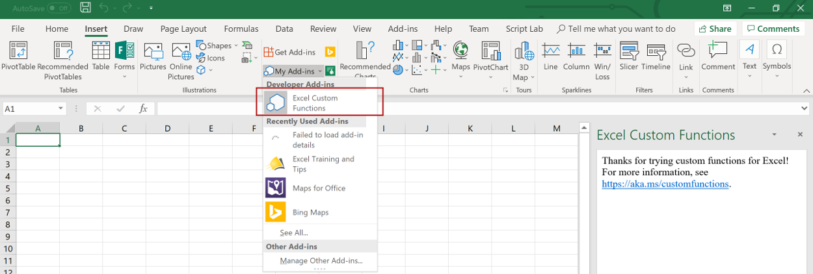

# <a name="tutorial-create-custom-functions-in-excel"></a>Tutorial: Criar funções personalizadas no Excel

## <a name="introduction"></a>Introdução

Funções personalizadas permitem que você adicione novas funções do Excel definindo essas funções em JavaScript como parte de um suplemento. Os usuários do Excel podem acessar funções personalizadas da mesma forma que fariam com qualquer função nativa no Excel, como `SUM()`. Você pode criar funções personalizadas que realizam tarefas simples como cálculos personalizados ou tarefas mais complexas, como streaming de dados da web em tempo real em uma planilha.

Neste tutorial, você vai:
> [!div class="checklist"]
> * Criar um projeto de funções personalizadas usando o gerador Yo Office
> * Usar uma função personalizada predefinida para realizar um cálculo simples
> * Criar uma função personalizada que solicita dados da web
> * Criar uma função personalizada que transmite os dados da web em tempo real

[!include[Excel custom functions note](../includes/excel-custom-functions-note.md)]

## <a name="prerequisites"></a>Pré-requisitos

* [Node e npm](https://nodejs.org/en/)

* [Git Bash](https://git-scm.com/downloads) (ou outro cliente Git)

* A versão mais recente da [Yeoman](http://yeoman.io/) e do [gerador Yo Office](https://www.npmjs.com/package/generator-office). Para instalar essas ferramentas globalmente, execute o seguinte comando para instalar o SDK:

    ```bash
    npm install -g yo generator-office
    ```

* Excel para Windows (versão 1810 ou posterior) ou o Excel Online

* Ingressar o [programa Office Insider](https://products.office.com/office-insider) (nível**Insider**, anteriormente chamado de "Insider – modo rápido")

## <a name="create-a-custom-functions-project"></a>Criar um projeto com funções personalizadas

Você vai começar este tutorial usando o gerador Yo Office para criar os arquivos necessários para seu projeto de funções personalizadas.

1. Execute o comando a seguir e responda aos prompts da seguinte forma.

    ```bash
    yo office
    ```

    * Escolha o tipo de projeto:`Excel Custom Functions Add-in project (...)`
    * Escolha um tipo de script: `JavaScript`
    * Qual será o nome do suplemento? `stock-ticker`

    

    Depois que você concluir o assistente, o gerador criará os arquivos do projeto e instalará os componentes Node de suporte. Os arquivos do project são provenientes de [Excel-Custom-Functions](https://github.com/OfficeDev/Excel-Custom-Functions) GitHub repository.

2. Navegue até a pasta do projeto.

    ```bash
    cd stock-ticker
    ```

3. Inicie o servidor Web local.

    * Se estiver usando o Excel para Windows para testar suas funções personalizadas, execute o seguinte comando para inciar o servidor local da web, inicie o Excel e carregue o suplemento:

        ```bash
        npm start
        ```

    * Se estiver usando o Excel Online para testar suas funções personalizadas, execute o seguinte comando para inciar o servidor local da web: 

        ```bash
        npm run start-web
        ```

## <a name="try-out-a-prebuilt-custom-function"></a>Experimente uma função personalizada predefinida

O projeto de funções personalizadas criado usando o gerador Yo Office contém algumas funções personalizadas predefinidas definidas no arquivo **src/customfunction.js**. O arquivo **manifest. XML** na pasta raiz do projeto especifica que todas as funções personalizadas pertencem ao `CONTOSO` namespace.

Antes de usar as funções personalizadas predefinidas, você deverá registrar o suplemento de funções personalizadas no Excel. Para fazer isso, conclua as etapas para a plataforma que usará neste tutorial.

* Se estiver usando o Excel para Windows para testar suas funções personalizadas:

    1. No Excel, escolha a guia**Inserir** e, em seguida, escolha a seta para baixo localizada à direita de **Meus Suplementos**.  

    2. Na lista de suplementos disponíveis, localize a seção**suplementos do desenvolvedor** e selecione o suplemento**funções do Excel personalizado** para registrá-lo.
        

* Se estiver usando o Excel Online para testar suas funções personalizadas: 

    1. No Excel Online, escolha a guia **Inserir** e, em seguida, escolha **Suplementos**.  

    2. Escolha **Gerenciar Meus suplementos** e selecione **Carregar o Suplemento**. 

    3. Escolha **Procurar... ** e navegue até o diretório raiz do projeto criado pelo gerador Office Yo. 

    4. Selecione o arquivo **manifest. XML** e escolha **aberto**, escolha **Carregar**.

Neste ponto, as funções personalizadas predefinidas do projeto são carregadas e estão disponíveis no Excel. Experimentar a `ADD` função personalizada preenchendo os seguintes etapas no Excel:

1. Em uma célula, digite **= CONTOSO**. Observe que o menu de preenchimento automático mostra a lista de todas as funções na `CONTOSO` namespace.

2. Executar a `CONTOSO.ADD` função, com números `10` e `200` como parâmetros de entrada, especificando o seguinte valor na célula e pressionando enter:

    ```
    =CONTOSO.ADD(10,200)
    ```

O `ADD` função personalizada calcula a soma de dois números que você especificar como os parâmetros de entrada. Digitando `=CONTOSO.ADD(10,200)` deve obter o resultado **210** na célula, depois pressionar enter.

## <a name="create-a-custom-function-that-requests-data-from-the-web"></a>Criar uma função personalizada que solicita dados da web

E se você precisasse de uma função que pode solicitar uma API de preço de uma ação e exibir o resultado na célula de uma planilha? Funções personalizadas são projetadas para que você possa facilmente solicitar os dados da web de forma assíncrona.

Conclua as seguintes etapas para criar uma função personalizada chamada `stockPrice` que aceita cotação da bolsa (por exemplo, **MSFT**) e retorna o preço dessa ação. Esta função personalizada usa IEX Trading API, que é gratuito e não requer autenticação.

1. No projeto**cotações** que o gerador do Office Yo criou, localize o arquivo **src/customfunctions.js** e abra-o no seu editor de código.

2. Adicione o código a seguir a **customfunctions.js** e salve o arquivo.

    ```js
    function stockPrice(ticker) {
        var url = "https://api.iextrading.com/1.0/stock/" + ticker + "/price";
        return fetch(url)
            .then(function(response) {
                return response.text();
            })
            .then(function(text) {
                return parseFloat(text);
            });

        // Note: in case of an error, the returned rejected Promise
        //    will be bubbled up to Excel to indicate an error.
    }

    CustomFunctionMappings.STOCKPRICE = stockPrice;
    ```

3. Antes que o Excel possa fazer esta nova função nova disponível para usuários finais, você deve especificar os metadados que descreve essa função. No projeto**cotações** que o gerador do Office Yo criou, localize o arquivo **config/customfunctions.json** e abra-o no seu editor de código. Adicionar o objeto de seguir ao arquivo `functions` matriz na **config/customfunctions.json** e salve o arquivo.

    Este JSON descreve a `stockPrice` função.

    ```json
    {
        "id": "STOCKPRICE",
        "name": "STOCKPRICE",
        "description": "Fetches current stock price",
        "helpUrl": "http://www.contoso.com/help",
        "result": {
            "type": "number",
            "dimensionality": "scalar"
        },  
        "parameters": [
            {
                "name": "ticker",
                "description": "stock ticker name",
                "type": "string",
                "dimensionality": "scalar"
            }
        ]
    }
    ```

4. Você deverá registrar novamente o suplemento no Excel para que a nova função esteja disponível para os usuários finais. Conclua as etapas para a plataforma que você está usando neste tutorial.

    * Se você estiver usando o Excel para Windows:

        1. Feche o Excel e abra novamente o Excel.

        2. No Excel, escolha a guia**Inserir** e, em seguida, escolha a seta para baixo localizada à direita de **Meus Suplementos**.  

        1. Na lista de suplementos disponíveis, localize a seção**suplementos do desenvolvedor** e selecione o suplemento**funções do Excel personalizado** para registrá-lo.
            

    * Se você estiver usando o Excel Online: 

        1. No Excel Online, escolha a guia **Inserir** e, em seguida, escolha **Suplementos**.  

        2. Escolha **Gerenciar Meus suplementos** e selecione **Carregar o Suplemento**. 

        3. Escolha **Procurar... ** e navegue até o diretório raiz do projeto criado pelo gerador Office Yo. 

        4. Selecione o arquivo **manifest. XML** e escolha **aberto**, escolha **Carregar**.

5. Agora, vamos experimentar a nova função. Na célula **B1**, digite o texto `=CONTOSO.STOCKPRICE("MSFT")` e pressione enter. Você verá que o resultado na célula **B1** é o preço atual das ações para uma ação da Microsoft.

## <a name="create-a-streaming-asynchronous-custom-function"></a>Criar uma função personalizada assíncrona de streaming

A `stockPrice` função que você acabou de criar retorna o preço de uma ação em um momento específico, mas os preços das ações estão sempre mudando. Vamos criar uma função personalizada de fluxos de dados de uma API recebendo atualizações em tempo real sobre o preço de uma atuação.

Conclua as seguintes etapas para criar uma função personalizada chamada `stockPriceStream` que solicita o preço da ação a cada 1000 milissegundos (desde que a solicitação anterior esteja concluída). Enquanto a solicitação inicial está em andamento, você poderá ver o valor de espaço reservado **# OBTENDO_DADOS** na célula em que a função está sendo exibida. Quando um valor é retornado pela função, **# OBTENDO_DADOS**será substituído por esse valor na célula.

1. No projeto**cotações** que o gerador do Office Yo criou, adicione o código a seguir **src/customfunctions.js** e salve o arquivo.

    ```js
    function stockPriceStream(ticker, handler) {
        var updateFrequency = 1000 /* milliseconds*/;
        var isPending = false;

        var timer = setInterval(function() {
            // If there is already a pending request, skip this iteration:
            if (isPending) {
                return;
            }

            var url = "https://api.iextrading.com/1.0/stock/" + ticker + "/price";
            isPending = true;

            fetch(url)
                .then(function(response) {
                    return response.text();
                })
                .then(function(text) {
                    handler.setResult(parseFloat(text));
                })
                .catch(function(error) {
                    handler.setResult(error);
                })
                .then(function() {
                    isPending = false;
                });
        }, updateFrequency);

        handler.onCanceled = () => {
            clearInterval(timer);
        };
    }

    CustomFunctionMappings.STOCKPRICESTREAM = stockPriceStream;
    ```

2. Antes que o Excel possa fazer esta nova função nova disponível para usuários finais, você deve especificar os metadados que descreve essa função. No projeto**cotações** que o gerador do Office Yo criou, adicione o objeto a seguir na `functions`matriz em **config/customfunctions.json** e salve o arquivo.

    Este JSON descreve a `stockPriceStream` função. Para qualquer função streaming a propriedade `stream` e a propriedade `cancelable` devem ser definidas como `true` dentro do `options` objeto, como mostra este exemplo código.

    ```json
    { 
        "id": "STOCKPRICESTREAM",
        "name": "STOCKPRICESTREAM",
        "description": "Streams real time stock price",
        "helpUrl": "http://www.contoso.com/help",
        "result": {
            "type": "number",
            "dimensionality": "scalar"
        },  
        "parameters": [
            {
                "name": "ticker",
                "description": "stock ticker name",
                "type": "string",
                "dimensionality": "scalar"
            }
        ],
        "options": {
            "stream": true,
            "cancelable": true
        }
    }
    ```

3. Você deverá registrar novamente o suplemento no Excel para que a nova função esteja disponível para os usuários finais. Conclua as etapas para a plataforma que você está usando neste tutorial.

    * Se você estiver usando o Excel para Windows:

        1. Feche o Excel e abra novamente o Excel.
        
        2. No Excel, escolha a guia**Inserir** e, em seguida, escolha a seta para baixo localizada à direita de **Meus Suplementos**.  

        3. Na lista de suplementos disponíveis, localize a seção**suplementos do desenvolvedor** e selecione o suplemento**funções do Excel personalizado** para registrá-lo.
            

    * Se você estiver usando o Excel Online: 

        1. No Excel Online, escolha a guia **Inserir** e, em seguida, escolha **Suplementos**.  

        2. Escolha **Gerenciar Meus suplementos** e selecione **Carregar o Suplemento**. 

        3. Escolha **Procurar... ** e navegue até o diretório raiz do projeto criado pelo gerador Office Yo. 

        4. Selecione o arquivo **manifest. XML** e escolha **aberto**, escolha **Carregar**.

4. Agora, vamos experimentar a nova função. Na célula **C1**, digite o texto `=CONTOSO.STOCKPRICESTREAM("MSFT")` e pressione enter. Desde que o mercado de ações esteja aberto, você verá que o resultado na célula **C1** é constantemente atualizado para refletir o preço em tempo uma ação das ações da Microsoft.

## <a name="next-steps"></a>Próximas etapas

Neste tutorial, você criou um novo projeto de funções personalizadas, experimentou uma função predefinida, criou uma função personalizada que solicita dados da web e criou uma função personalizada que transmite dados em tempo real da Web. Para saber mais sobre funções personalizadas no Excel, prossiga para o seguinte artigo: 

> [!div class="nextstepaction"]
> [Criar funções personalizadas no Excel](../excel/custom-functions-overview.md)

## <a name="legal-information"></a>Informações legais

Dados gratuito fornecidos pela [IEX](https://iextrading.com/developer/). Modo de exibição [termos de uso IEX](https://iextrading.com/api-exhibit-a/). O uso da Microsoft dA API IEX neste tutorial é apenas para fins educacionais.
